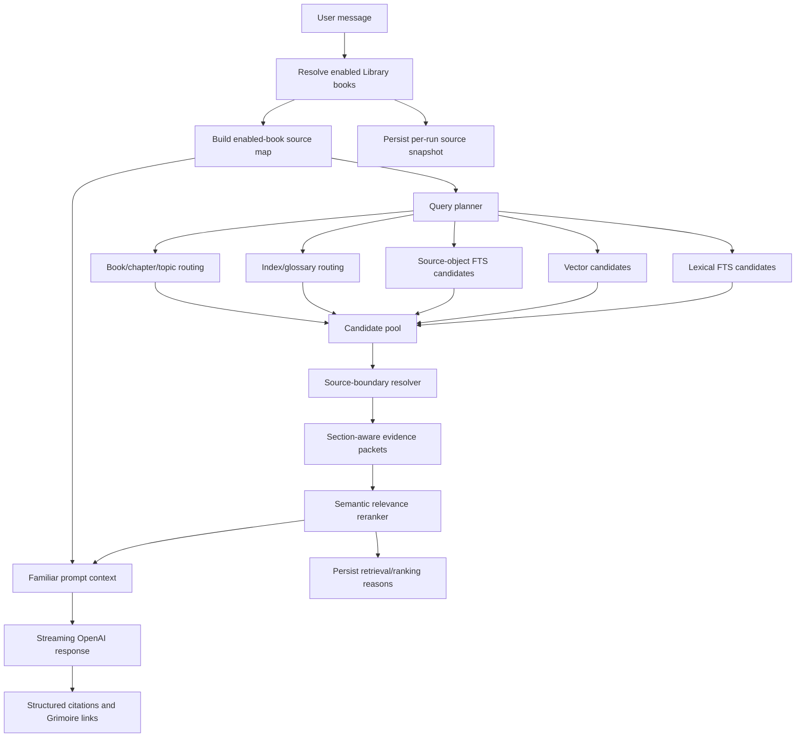

# Source-Map-Aware Hybrid Retrieval Handoff

Date: 2026-06-05

This handoff captures the next retrieval architecture direction for WFRP
Companion. It is intended for a fresh Codex session to read after `CLAUDE.md`,
`AGENTS.md`, `wiki/CONTEXT.md`, `wiki/INDEX.md`, and the relevant wiki topics.

## Core Decision

The next retrieval phase should implement **source-map-aware hybrid retrieval
with semantic reranking and section-aware evidence**.

This is a systemic fix for Familiar retrieval quality. It should not be
implemented as a one-off "critical hits" patch, a single spelling alias patch,
or a vector database replacement for full-text search.

## Current Live-Code Context

Current code has the first working loop:

- Library/PDF import, page text import, and exact FTS are implemented.
- The browser GUI exposes Library, Search, Grimoire, and Familiar.
- Familiar streams through the backend and cites retrieved pages.
- `source_objects`, `source_object_links`, `book_object_status`,
  `book_query_profiles`, `source_object_search`, and
  `source_object_search_fts` exist as Phase 7 foundations.
- `tools/extract_source_objects.py` can extract deterministic `rule_section`
  and `page_chunk` rows.

Important limitation:

- Familiar still retrieves page-level exact-search hits through
  `wfrp_companion/assistant/retrieval.py`.
- It does not yet use source objects, source maps, semantic/vector retrieval,
  reranking, glossary/index routing, table/stat-block handling, or multi-page
  section spans.

Relevant files:

- `wfrp_companion/assistant/retrieval.py`
- `wfrp_companion/assistant/prompts.py`
- `wfrp_companion/assistant/chat_service.py`
- `wfrp_companion/search/fts.py`
- `wfrp_companion/search/scope.py`
- `wfrp_companion/source_objects/`
- `wfrp_companion/db/schema.sql`
- `wfrp_companion/db/migrations.py`
- `wiki/topics/ai-rag-system.md`
- `wiki/topics/target-architecture.md`
- `wiki/concepts/hybrid-search-for-rules.md`

## User-Observed Problems To Preserve

These are not isolated UX annoyances; they reveal retrieval architecture gaps.

1. **Bretonnia / Knights of the Grail failure**
   - The user had `Knights of the Grail` checked.
   - Familiar answered as if it could not find a Bretonnia source.
   - Direct exact search for `Bretonnia` in `Knights of the Grail` returns good
     hits, so the book data exists.
   - The failure is candidate generation and ranking, not missing data.

2. **Lexical junk fills the context**
   - Current query candidate generation can search conversational fragments
     such as `you tell me` before important terms like `Bretonnia`, `duchy`, or
     `king`.
   - Retrieval stops once `hit_limit` is filled, so bad early lexical hits can
     prevent good later hits from being considered.

3. **The AI needs semantic judgment over lexical hits**
   - Exact lexical matches should create candidates only.
   - A later stage must judge whether each candidate actually answers the
     query.

4. **The system prompt needs source-map awareness**
   - Familiar should know what each enabled book is about, what chapters cover,
     and which indexes/glossaries/topics belong to which books.
   - This should not be a giant raw dump. It should be a compact source map plus
     dynamic expanded entries when relevant.

5. **Library checkboxes must control prompt and retrieval scope**
   - Source-map entries for unchecked books must not be available to Familiar.
   - Retrieval must only search checked books.
   - Each Familiar answer should persist the exact enabled-book snapshot used.

6. **Single pages are not meaningful evidence units**
   - A topic can span multiple pages.
   - A hit can land inside a multi-page section, table group, stat block, NPC
     entry, adventure location, or chapter discussion.
   - Retrieval must resolve hits to the owning section/object and pass a
     complete evidence span, not just one page.

7. **Printed page labels are separate from PDF page numbers**
   - Search/Familiar should display actual printed page labels only.
   - Internal `pdf_page_number` should remain the hidden Grimoire jump target.
   - Offsets differ by book, so this needs per-book calibration/backfill.

## Research Basis

The architecture below is based on the current repo plus these retrieval papers
and systems papers.

### RAG: Explicit Evidence Over Model Memory

Retrieval-Augmented Generation frames retrieval as non-parametric memory for
knowledge-intensive generation. For WFRP Companion, that means Familiar should
answer from selected retrieved evidence and cite it, rather than relying on
model memory.

- Paper: [Retrieval-Augmented Generation for Knowledge-Intensive NLP Tasks](https://arxiv.org/abs/2005.11401)

### BEIR: One Retriever Is Not Enough Across Domains

BEIR shows retrieval behavior varies across tasks and domains. Rules-heavy RPG
lookup has exact names, tables, lore, stat blocks, and fuzzy natural-language
questions, so vector-only or lexical-only retrieval is not enough.

- Paper: [BEIR: A Heterogeneous Benchmark for Zero-shot Evaluation of Information Retrieval Models](https://arxiv.org/abs/2104.08663)

### DPR And Dense Retrieval: Semantic Candidate Generation

Dense Passage Retrieval supports semantic lookup when the user does not use the
same terms as the source. WFRP questions like "who rules Bretonnia?" or "how do
I handle fear?" need this channel alongside exact FTS.

- Paper: [Dense Passage Retrieval for Open-Domain Question Answering](https://arxiv.org/abs/2004.04906)

### RRF: Fuse Rankings Instead Of Trusting One Search Mode

Reciprocal Rank Fusion is a simple, strong way to combine independent rankings.
For WFRP Companion, it can combine lexical FTS, vector hits, source-object FTS,
index/glossary matches, and book/source-map routing boosts.

- Paper: [Reciprocal Rank Fusion Outperforms Condorcet and Individual Rank Learning Methods](https://research.google/pubs/reciprocal-rank-fusion-outperforms-condorcet-and-individual-rank-learning-methods/)

### ColBERT: Reranking And Late Interaction

ColBERT-style systems support richer semantic matching after candidate
generation. WFRP Companion does not need to implement ColBERT first, but it
should adopt the same pattern: broad candidate generation followed by semantic
reranking.

- Paper: [ColBERT: Efficient and Effective Passage Search via Contextualized Late Interaction over BERT](https://arxiv.org/abs/2004.12832)

### Query Expansion And Query Rewriting

HyDE, Query2Doc, and Rewrite-Retrieve-Read support expanding/reformulating user
queries before retrieval. WFRP Companion should use this idea for aliases,
misspellings, setting terms, rule names, and user phrasing.

- Paper: [HyDE: Precise Zero-Shot Dense Retrieval without Relevance Labels](https://arxiv.org/abs/2212.10496)
- Paper: [Query2Doc: Query Expansion with Large Language Models](https://arxiv.org/abs/2303.07678)
- Paper: [Rewrite-Retrieve-Read](https://arxiv.org/abs/2305.14283)

### Lost In The Middle: Do Not Stuff Everything Into Context

Long context can degrade how well models use relevant evidence. This supports a
compact source map plus selected evidence, not dumping every full glossary,
index, and chapter into every prompt.

- Paper: [Lost in the Middle: How Language Models Use Long Contexts](https://arxiv.org/abs/2307.03172)

### Tables Need Structured Handling

Tables are first-class WFRP evidence: critical tables, career advances, spell
tables, stat blocks, prices, travel tables, encounter tables, and adventure
reference tables. TAPAS and later table-RAG work reinforce that tables should
not be treated as plain page blobs only.

- Paper: [TAPAS: Weakly Supervised Table Parsing via Pre-training](https://arxiv.org/abs/2004.02349)
- Related work: table-focused RAG and structured table retrieval should inform
  later table extraction/ranking, but exact implementation should remain local
  and pragmatic.

### Hierarchical Retrieval Supports Section-Aware Evidence

Hierarchical retrieval systems support using summaries/trees/graphs to route to
larger logical evidence units. WFRP Companion needs this because topics are
often chapters, subsections, NPC entries, locations, or table groups, not single
PDF pages.

- Paper: [RAPTOR: Recursive Abstractive Processing for Tree-Organized Retrieval](https://arxiv.org/abs/2401.18059)
- Paper: [GraphRAG: From Local to Global Graph RAG](https://arxiv.org/abs/2404.16130)

## Target Architecture



## Source Scope Rule

For each Familiar message:

1. Read the currently enabled Library books from the active source set.
2. Build the source map only for those books.
3. Search only those books.
4. Persist a per-run source snapshot.
5. Cite only sources from that snapshot.

This changes the current behavior where `chat_thread_source_books` snapshots
scope only at thread creation. Existing thread-level snapshots may remain for
history/debugging, but new model runs should have their own source snapshot so
Library changes affect the next Familiar response.

Unchecked books must not contribute:

- source-map summaries
- aliases
- chapter descriptions
- glossary/index terms
- retrieval candidates
- ranking boosts
- citations

## Source Map Contract

The source map is not raw book text. It is compact routing metadata for enabled
books.

Recommended fields:

```json
{
  "book_id": "world-guides-and-faction-sourcebooks-knights-of-the-grail",
  "title": "Knights of the Grail",
  "category": "World Guides and Faction Sourcebooks",
  "summary": "Bretonnia-focused sourcebook covering Bretonnian geography, society, duchies, religion, knighthood, careers, creatures, and adventure material.",
  "best_source_for": [
    "Bretonnia",
    "Bretonnian duchies",
    "knights",
    "Lady of the Lake",
    "Bretonnian careers",
    "Bretonnian geography"
  ],
  "aliases": [
    "Bretonia",
    "Bretonnia",
    "Bretonnian",
    "duchy",
    "dukedom"
  ],
  "chapters": [
    {
      "title": "Characters and Careers",
      "printed_page_start": "94",
      "printed_page_end": "101",
      "summary": "Regional Bretonnian character options, duchy-specific skills, talents, and special rules."
    }
  ],
  "index_terms": [
    {
      "term": "Bretonnia",
      "printed_page_labels": ["..."],
      "target_object_ids": ["..."]
    }
  ],
  "glossary_terms": [
    {
      "term": "...",
      "definition_summary": "...",
      "target_object_ids": ["..."]
    }
  ]
}
```

The actual field names can differ, but the source map must support:

- enabled-book filtering
- query planning
- source/book/chapter boosts
- alias expansion
- prompt orientation
- debugging why a book was or was not considered

## Prompt Strategy

Familiar's system/developer prompt should include:

- private local GM aid boundary
- citations required for rules/factual claims
- unchecked books are out of scope
- use retrieved evidence over memory
- distinguish source-grounded facts from GM interpretation

Each request should include:

- compact source map for enabled books
- any relevant expanded source-map entries found by query planning
- final reranked evidence packets
- recent chat history as currently supported

Avoid:

- dumping every full glossary/index into every prompt
- relying on the model to search raw PDFs
- asking the model to compensate for bad page slices
- showing unchecked books as possible sources

## Retrieval Pipeline

### 1. Query Planner

Input:

- user query
- enabled-book source map
- recent chat context if needed

Output:

- normalized terms
- aliases and spelling variants
- likely query types, e.g. `rules`, `table`, `npc`, `monster`, `location`,
  `lore`, `adventure_scene`, `source_navigation`
- likely books and chapters
- candidate subqueries for lexical, vector, object, index, and glossary search

Immediate bug fix examples:

- `Bretonia` should expand to `Bretonnia`.
- conversational filler like `you`, `tell`, `me`, `about`, `which`, `it`, and
  `have` should not dominate lexical retrieval.
- `Bretonnia`, `duchy`, `king`, and `powerful` should route toward
  `Knights of the Grail` if that book is enabled.

### 2. Hybrid Candidate Generation

Do not stop after the first lexical results fill the limit.

Generate a larger candidate pool from:

- page-level lexical FTS
- source-object FTS
- vector search
- chapter/source-map matches
- glossary and index entries
- exact table/stat-block/name matches

The candidate pool can be larger than the final prompt budget. It exists so
ranking has room to reject weak hits.

### 3. Source-Boundary Resolver

A hit should resolve to the smallest complete evidence unit that can answer the
query.

Preferred evidence units:

- `rule_section`
- `chapter_section`
- `table`
- `table_group`
- `stat_block`
- `npc_profile`
- `monster_profile`
- `location_description`
- `adventure_section`
- `glossary_entry`
- `index_entry`

Pages remain citation/display units, not the primary meaning unit.

If a hit lands inside a multi-page topic, retrieve the owning source object and
its page span. Neighbor page expansion is only a fallback when section
boundaries are not known.

### 4. Semantic Reranking

Each candidate/evidence packet needs a relevance judgment:

- Does this evidence answer the user's question?
- Is it only a weak lexical match?
- Is it a table/stat block/glossary/index entry that should be paired with a
  parent section?
- Does it need a linked/adjacent object to be complete?
- Should it be rejected from prompt context?

Implementation can start with deterministic scoring plus an optional LLM
reranker. The interface should be provider-agnostic enough to later use a local
cross-encoder, ColBERT-style reranker, or OpenAI model call.

Store rank reasons in `retrieval_hits.rank_reasons_json` or equivalent snapshot
metadata so failures are debuggable.

### 5. Evidence Assembly

The final prompt context should contain selected evidence packets with:

- book title
- object type
- title/heading path
- printed page label or printed page range
- hidden/internal PDF jump target
- concise text excerpt or structured table/stat-block summary
- linked child objects when needed

The frontend citation should open the first PDF page in Grimoire and display
the printed page label/range, not raw physical PDF page numbers.

## Structured Evidence Types That Matter

Prioritize these because the user called them out as critical:

- rules and mechanics sections
- tables
- table rows
- NPC stat blocks
- monster stat blocks
- spell/talent/career entries
- area/location descriptions in adventures
- maps and image references
- glossary entries
- index entries
- chapter summaries and chapter ranges

## Data Model Direction

Use existing schema foundations where possible:

- `source_objects`: canonical local structured evidence spans.
- `source_object_links`: parent/child and cross-reference relationships.
- `source_object_search` / `source_object_search_fts`: rebuildable search
  projections.
- `book_query_profiles`: per-book source-map/routing metadata and query-type
  boosts.
- `retrieval_runs` / `retrieval_hits`: immutable per-answer retrieval and
  ranking snapshots.

Likely additions or extensions:

- per-model-run source-scope snapshot table if existing
  `chat_thread_source_books` is not enough.
- explicit source-map/profile extraction status per book if
  `book_object_status` should not own that lifecycle.
- printed page label calibration/backfill status per book.
- vector embedding table or external local vector store metadata.

## Implementation Order Recommendation

The next implementation phase should be PR-sized but systemic.

1. **Fix source scope for Familiar**
   - Read enabled books per message.
   - Persist per-run source snapshots.
   - Ensure unchecked books do not enter prompt or retrieval.

2. **Build source-map storage and prompt injection**
   - Populate compact book/chapter/source metadata for enabled books.
   - Use existing `book_query_profiles` if suitable.
   - Keep source map compact in the prompt.

3. **Repair lexical candidate generation**
   - Expand stopwords.
   - Add alias expansion.
   - Gather a broad pool before truncating.
   - Do not let early junk candidates fill the hit limit.

4. **Wire source-object/object-FTS candidates**
   - Search `source_objects` and/or `source_object_search_fts`.
   - Prefer typed objects over raw page hits when available.

5. **Add source-boundary resolution**
   - Resolve hits to owning sections/objects with page spans.
   - Use neighbor page expansion only as a fallback.

6. **Add semantic reranking**
   - Start with testable deterministic heuristics plus optional LLM judgment.
   - Persist rank reasons.
   - Reject weak lexical hits before prompt assembly.

7. **Add vector search**
   - Add vectors as a second candidate channel, not as a replacement.
   - Fuse rankings with lexical/object/source-map candidates.

8. **Backfill printed page labels**
   - Store real printed page labels/ranges per book/page/object.
   - Use only printed labels in Search/Familiar UI.
   - Keep physical PDF page numbers as hidden jump targets.

## Non-Goals For The Next Phase

Do not build these as part of the immediate retrieval repair unless explicitly
scoped:

- public hosting or user accounts
- public sharing/export of copyrighted book text
- adventure module generation
- TTS/STT
- full automated perfect table extraction for every book
- a generic agent framework
- replacing SQLite entirely
- vector-only retrieval
- stuffing all book text/indexes/glossaries into every prompt

## Verification Scenarios

Minimum scenarios for the next retrieval phase:

1. With `Knights of the Grail` enabled, a Bretonnia query retrieves and cites
   `Knights of the Grail`.
2. With `Knights of the Grail` disabled, the same query does not use or cite
   that book.
3. Misspelling `Bretonia` still routes to `Bretonnia` evidence when the book is
   enabled.
4. Lexical filler words do not produce top-ranked junk context.
5. A table query returns table evidence, not only surrounding prose.
6. An NPC/monster query returns the stat block/profile when available.
7. A multi-page section query returns a page range or complete section evidence,
   not a lone page slice.
8. Search and Familiar display printed page labels/ranges only.
9. Retrieval logs explain candidate sources and ranking reasons.
10. No unchecked book contributes source-map entries, retrieval candidates, or
    citations.

## Fresh Session Startup Prompt

Recommended prompt for a new Codex thread:

```text
Read CLAUDE.md, AGENTS.md, wiki/CONTEXT.md, wiki/INDEX.md,
wiki/topics/ai-rag-system.md, wiki/topics/target-architecture.md,
wiki/topics/implementation-standards.md, and
docs/handoffs/2026-06-05-source-map-hybrid-retrieval-handoff.md.

Continue with the next retrieval phase: source-map-aware hybrid retrieval with
semantic reranking and section-aware evidence. Do not implement a one-off search
patch. Keep Library checkbox scope authoritative for Familiar.
```
