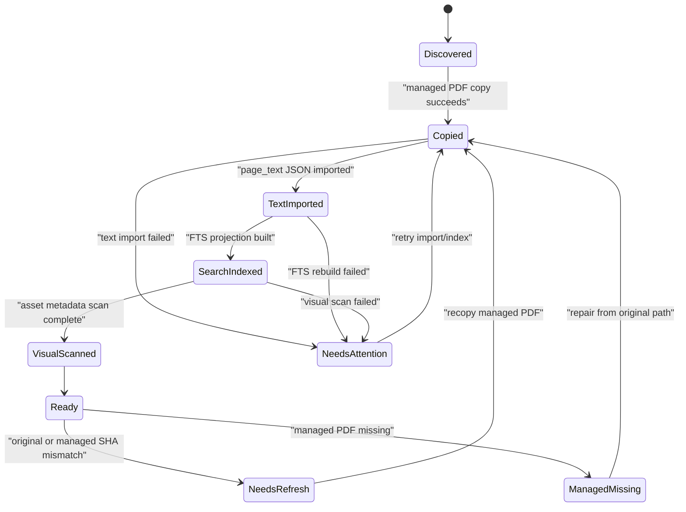
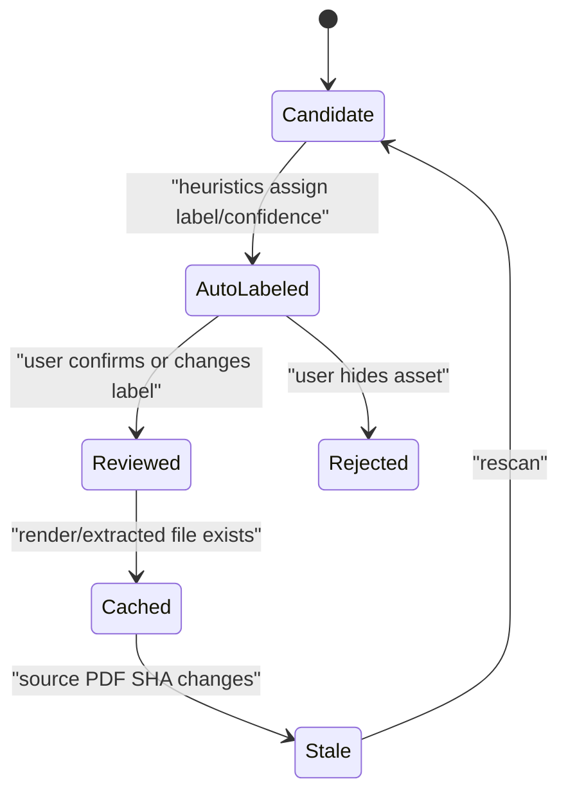
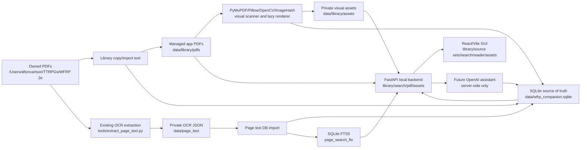

# Local Reference Library Implementation Plan

> **For agentic workers:** REQUIRED SUB-SKILL: Use `superpowers:subagent-driven-development` (recommended) or `superpowers:executing-plans` to implement this plan task-by-task. Steps use checkbox (`- [ ]`) syntax for tracking.

**Goal:** Build the local WFRP Companion reference-library foundation: managed PDF storage, SQLite source of truth, page-text import, exact search, per-book source sets, PDF reading, and automated visual asset detection for maps/images.

**Architecture:** Keep the application local-first. Copy owned PDFs into app-managed private storage, store all app state in SQLite, serve a local FastAPI API to a React/Vite browser GUI, use PDF.js for reading, use PyMuPDF/Tesseract for page text and rendering, and use PyMuPDF/Pillow/OpenCV/ImageHash for automated local visual asset detection.

**Tech Stack:** Python 3.12, Conda, SQLite with FTS5 and JSON fields, PyMuPDF, Tesseract, Pillow, OpenCV, ImageHash, pytest, ruff, FastAPI, React, Vite, TypeScript, PDF.js, Node 22 LTS, npm with a committed `package-lock.json`. Future AI integration uses OpenAI server-side only after retrieval is trustworthy.

---

## 1. Source Boundary

This plan is based on the current live repository at `/Users/aftoncarlson/workspace/WFRP-Companion`.

Sources read from live code and docs:

- `CLAUDE.md`
- `AGENTS.md`
- `.gitignore`
- `environment.yml`
- `tools/pdf_audit.py`
- `tools/extract_page_text.py`
- `docs/adr/0001-conda-python-tooling.md`
- `docs/audits/2026-06-03-pdf-extraction-audit.md`
- `docs/audits/2026-06-03-page-text-ocr-extraction.md`
- `wiki/CONTEXT.md`
- `wiki/INDEX.md`
- `wiki/topics/project-overview.md`
- `wiki/topics/target-architecture.md`
- `wiki/topics/pdf-library-and-ingestion.md`
- `wiki/topics/ai-rag-system.md`
- `wiki/topics/ui-ux-design-principles.md`
- `wiki/topics/local-tooling-and-packaging.md`
- `wiki/topics/implementation-standards.md`
- `wiki/topics/testing-posture-and-conventions.md`
- `wiki/concepts/private-copyright-boundary.md`
- `wiki/concepts/hybrid-search-for-rules.md`
- ignored local data under `data/page_text/`
- owned PDF root `/Users/aftoncarlson/TTRPGs/WFRP 2e`

Relevant official documentation and current integration references:

- SQLite FTS5: https://www.sqlite.org/fts5.html
- SQLite JSON functions: https://www.sqlite.org/json1.html
- SQLite WAL: https://www.sqlite.org/wal.html
- PyMuPDF page API: https://pymupdf.readthedocs.io/en/latest/page.html
- PyMuPDF image/rendering recipes: https://pymupdf.readthedocs.io/en/latest/recipes-images.html
- Tesseract command-line usage: https://tesseract-ocr.github.io/tessdoc/Command-Line-Usage.html
- PDF.js examples: https://mozilla.github.io/pdf.js/examples/
- FastAPI static files: https://fastapi.tiangolo.com/tutorial/static-files/
- Vite guide: https://vite.dev/guide/
- Future OpenAI Responses API: https://platform.openai.com/docs/api-reference/responses/create?api-mode=responses
- Future OpenAI streaming responses: https://platform.openai.com/docs/guides/streaming-responses?api-mode=responses
- Future OpenAI speech-to-text: https://platform.openai.com/docs/guides/speech-to-text
- Future OpenAI text-to-speech: https://platform.openai.com/docs/guides/text-to-speech

Sources intentionally excluded as architectural input:

- Any older, uncommitted, or stale planning documents.
- The original generic implementation-plan prompt as an architecture source.
- Public WFRP content sources or SRD assumptions.
- Cloud-first architecture assumptions.
- The copyrighted PDF text itself as committed design material.

Recent user decisions included in this plan:

- Copy PDFs into app-managed local storage.
- Default source set is Rules/Core.
- Generate full-page renders lazily and cache them.
- Use automated local visual asset detection for maps/images where practical.
- Build pure local web first, not a standalone desktop wrapper.

## 2. Current Live-Code Diagnosis

The current repository is a scaffold plus extraction tooling. There is no application runtime yet.

Concrete live-code state:

- `tools/pdf_audit.py` audits PDFs with PyMuPDF and writes numeric local-only extraction metadata.
- `tools/extract_page_text.py` extracts one JSON record per PDF page using embedded text where available and Tesseract OCR where needed.
- `environment.yml` defines the Conda environment `wfrp-companion` with Python 3.12, PyMuPDF, Poppler, Tesseract, pytest, and ruff.
- `.gitignore` already excludes `data/`, `pdfs/`, `books/`, `library/`, `indexes/`, `vector-store/`, `*.sqlite`, `*.sqlite3`, and `*.db`.
- The wiki defines the intended local-first shape, but no app code exists yet.

Existing local extraction results:

- PDF root: `/Users/aftoncarlson/TTRPGs/WFRP 2e`
- Books: 26
- Pages: 3,736
- Extracted characters: 15,612,529
- Extracted words: 2,668,305
- Embedded-text pages: 391
- OCR pages: 3,214
- OCR-empty pages: 131
- OCR errors: 0

Important current problems:

- There is no app-owned SQLite source of truth.
- `data/page_text/*.json` is private derived input, not a stable query model.
- No managed PDF copy exists under app storage.
- No folder hierarchy model exists, even though the PDF root contains categories and nested collections such as `Adventure Modules and Campaigns/Paths of the Damned`.
- No per-book source-set state exists.
- No default Rules/Core source set exists.
- No full-text search exists.
- No API exists.
- No GUI exists.
- No PDF reader exists.
- No image extraction, page-render cache, or visual asset classification exists.
- `image_count` is recorded per page, but no image metadata, bounding boxes, file paths, or map/illustration labels are stored.
- No AI metadata tables exist for conversations, retrieval runs, or citations.
- No tests exist yet.
- No concurrency/idempotency guards exist for import, indexing, asset extraction, or future AI calls.

Ownership and fragility problems:

- Source identity is currently implied by file paths and generated JSON names. It must become explicit in SQLite.
- Search eligibility is currently impossible to represent. It must be explicit per source set and per book.
- Reader behavior cannot be citation-driven until pages and PDFs have stable IDs.
- Asset discovery cannot be reliable if it only stores `image_count`; the app needs page-level and asset-level records.
- Future AI chat cannot be trustworthy until retrieval is deterministic, citeable, and source-set filtered.

## 3. Architecture Decision

Recommended architecture:

- Use a pure local web app for the first product version.
- Copy all PDFs from `/Users/aftoncarlson/TTRPGs/WFRP 2e` into app-managed private storage under `data/library/pdfs/<book_id>/source.pdf`.
- Preserve the original PDF path in SQLite as provenance, but read from the managed copy at runtime.
- Use SQLite as the single app-owned source of truth.
- Use SQLite FTS5 for exact rule/name/table search.
- Keep future vector search as a derived index keyed back to SQLite page/chunk IDs.
- Use PyMuPDF for PDF inspection, embedded image metadata, and page rendering.
- Keep Tesseract for OCR, matching the existing extraction tool.
- Use local image tooling for asset detection: Pillow for image metadata, OpenCV for simple visual heuristics, and ImageHash for duplicate detection.
- Use FastAPI for local API endpoints.
- Use React/Vite/TypeScript for the GUI.
- Use PDF.js in the browser to display original managed PDFs and jump to cited pages.

Why this fits the codebase:

- The repo has already standardized Python tooling on Conda.
- The existing extraction tools are Python/PyMuPDF/Tesseract-based.
- The project is private and local-first, so SQLite and local file storage are the simplest durable defaults.
- RPG rules retrieval needs exact matching before semantic/vector retrieval.
- PDF.js solves the original-source reading requirement without requiring a desktop wrapper.
- Managed PDF copies make runtime behavior stable if the original folder moves.

Approaches to avoid:

- Avoid a cloud database for the MVP. It adds auth, privacy, copyright, cost, and deployment complexity before the local loop exists.
- Avoid vector-only retrieval. Exact names and page citations matter for rules-heavy books.
- Avoid a local NoSQL database as the main store. The app needs relations, uniqueness, filtering, state transitions, and migrations.
- Avoid making frontend checkbox state the source of truth. Book enablement must be persisted in SQLite.
- Avoid eagerly rendering every page at high quality. It wastes time and disk for pages the user may never open.
- Avoid cloud image classification by default. Book pages are private copyrighted material.
- Avoid a standalone desktop wrapper until the local web app proves the workflow.

## 4. Target State Model

This system needs explicit lifecycle state for books, pages, indexing, managed files, and assets. It does not need a framework-heavy workflow engine.

Book lifecycle:



Asset lifecycle:



Source-set lifecycle:

- Source sets are not inferred from categories.
- `source_sets` owns the named set.
- `source_set_books` owns each book enablement row.
- The active source set is stored in `app_settings`.
- Category/folder toggles are UI conveniences that write per-book rows.

`Ready` and `NeedsAttention` in the diagrams are derived from the `book_readiness` view defined in the data model. Implementations must not invent a second mutable readiness field.

Default source set:

- Name: `Rules/Core`
- Enabled folders:
  - `Core Book & GM Essentials`
  - `Rules and Mechanics Toolkits`
- Disabled by default:
  - `Adventure Modules and Campaigns`
  - `World Guides and Faction Sourcebooks`

## 5. Target Architecture Diagram



## 6. Proposed Data Model / Contracts

SQLite database path:

- Default: `data/wfrp_companion.sqlite`
- Config env: `WFRP_DB_PATH`
- Must be ignored by Git.
- Use WAL mode for local API plus background workers.

Managed storage:

- Managed PDFs: `data/library/pdfs/<book_id>/source.pdf`
- Asset files: `data/library/assets/<book_id>/page-0001/<asset_id>.png`
- Cached renders: `data/library/renders/<book_id>/page-0001-dpi-150.png`
- Thumbnails: `data/library/thumbnails/<book_id>/cover.png`

Core tables:

```sql
create table app_settings (
  key text primary key,
  value_json text not null,
  updated_at text not null
);
```

```sql
create table library_folders (
  id text primary key,
  parent_id text references library_folders(id),
  name text not null,
  relative_path text not null unique,
  sort_order integer not null default 0
);
```

```sql
create table books (
  id text primary key,
  folder_id text not null references library_folders(id),
  title text not null,
  category text not null,
  relative_path text not null unique,
  original_source_path text not null,
  managed_pdf_path text not null,
  original_sha256 text not null,
  managed_sha256 text,
  page_count integer not null,
  copy_status text not null,
  text_status text not null,
  search_status text not null,
  visual_status text not null,
  enabled_default integer not null default 0,
  metadata_json text not null default '{}',
  discovered_at text not null,
  copied_at text,
  updated_at text not null,
  check(copy_status in ('discovered', 'copying', 'copied', 'managed_missing', 'failed')),
  check(copy_status != 'copied' or managed_sha256 is not null),
  check(text_status in ('not_imported', 'importing', 'imported', 'needs_refresh', 'failed')),
  check(search_status in ('not_indexed', 'indexing', 'indexed', 'needs_refresh', 'failed')),
  check(visual_status in ('not_scanned', 'scanning', 'scanned', 'needs_refresh', 'failed'))
);
```

```sql
create table pages (
  id text primary key,
  book_id text not null references books(id) on delete cascade,
  page_number integer not null,
  page_label text,
  extraction_method text not null,
  embedded_text_chars integer not null,
  text_chars integer not null,
  word_count integer not null,
  image_count integer not null,
  ocr_attempted integer not null,
  ocr_error text,
  has_text integer not null,
  metadata_json text not null default '{}',
  unique(book_id, page_number)
);
```

```sql
create table page_text (
  page_id text primary key references pages(id) on delete cascade,
  text text not null,
  text_sha256 text not null,
  generated_at text not null
);
```

Search projection:

```sql
create table page_search (
  rowid integer primary key,
  page_id text not null unique references pages(id) on delete cascade,
  book_id text not null references books(id) on delete cascade,
  folder_id text not null references library_folders(id),
  category text not null,
  title text not null,
  page_number integer not null,
  text text not null
);
```

```sql
create virtual table page_search_fts using fts5(
  title,
  text,
  content='page_search',
  content_rowid='rowid'
);
```

FTS maintenance contract:

- The MVP uses explicit full rebuilds, not triggers.
- `wfrp_companion.search.fts.rebuild_fts()` must update `page_search` and then run:

```sql
insert into page_search_fts(page_search_fts) values('rebuild');
```

- This is acceptable for the current 3,736-page corpus and removes ambiguity around external-content FTS synchronization.
- If incremental indexing is added later, it must replace this contract with insert/update/delete triggers and matching tests.

Source sets:

```sql
create table source_sets (
  id text primary key,
  name text not null unique,
  description text,
  is_builtin integer not null default 0,
  created_at text not null,
  updated_at text not null
);
```

```sql
create table source_set_books (
  source_set_id text not null references source_sets(id) on delete cascade,
  book_id text not null references books(id) on delete cascade,
  enabled integer not null,
  updated_at text not null,
  primary key(source_set_id, book_id)
);
```

Visual assets:

```sql
create table page_assets (
  id text primary key,
  page_id text not null references pages(id) on delete cascade,
  book_id text not null references books(id) on delete cascade,
  page_number integer not null,
  kind text not null,
  file_path text,
  media_type text,
  width integer,
  height integer,
  dpi integer,
  bbox_json text,
  source_xref integer,
  sha256 text,
  perceptual_hash text,
  byte_size integer,
  confidence real not null default 0,
  review_status text not null default 'unreviewed',
  extracted_at text,
  metadata_json text not null default '{}',
  check(kind in ('embedded_image', 'page_render', 'thumbnail', 'visual_candidate')),
  check(review_status in ('unreviewed', 'auto_labeled', 'reviewed', 'rejected'))
);
```

```sql
create table asset_labels (
  id text primary key,
  asset_id text not null references page_assets(id) on delete cascade,
  label text not null,
  source text not null,
  confidence real not null,
  is_current integer not null default 0,
  created_at text not null,
  check(label in ('cover', 'map_candidate', 'illustration_candidate', 'handout_candidate', 'table_candidate', 'character_sheet', 'icon_fragment', 'unknown', 'rejected')),
  check(source in ('heuristic', 'user'))
);
```

```sql
create unique index ux_page_assets_page_kind_hash
on page_assets(page_id, kind, sha256)
where sha256 is not null;
```

```sql
create unique index ux_page_assets_page_kind_phash
on page_assets(page_id, kind, perceptual_hash)
where sha256 is null and perceptual_hash is not null;
```

```sql
create unique index ux_asset_labels_current
on asset_labels(asset_id)
where is_current = 1;
```

Asset ID contract:

- File-backed assets use deterministic IDs: `<page_id>:<kind>:sha256:<sha256>`.
- Non-file visual candidates use deterministic IDs: `<page_id>:<kind>:phash:<perceptual_hash>`.
- If a candidate has neither SHA nor perceptual hash, use `<page_id>:<kind>:unknown:<ordinal>` where `ordinal` is stable within a sorted scan of that page.
- Repeated scans must upsert by deterministic ID and must not create duplicate `visual_candidate` rows.

Current-label contract:

- Heuristic detection writes one `asset_labels` row with `is_current=1` and sets `page_assets.review_status='auto_labeled'`.
- User relabeling later sets the previous current label to `is_current=0`, inserts a user label with `is_current=1`, and sets `review_status='reviewed'`.
- User rejection later inserts a current user label of `rejected` and sets `review_status='rejected'`.

Jobs:

```sql
create table ingest_jobs (
  id text primary key,
  job_type text not null,
  target_id text,
  status text not null,
  idempotency_key text not null unique,
  attempts integer not null default 0,
  last_error text,
  created_at text not null,
  updated_at text not null,
  completed_at text,
  check(job_type in ('copy_pdf', 'import_page_text', 'rebuild_fts', 'scan_visual_assets', 'render_page')),
  check(status in ('queued', 'running', 'succeeded', 'failed'))
);
```

Future AI metadata:

```sql
create table chat_threads (
  id text primary key,
  title text,
  active_source_set_id text references source_sets(id),
  created_at text not null,
  updated_at text not null
);
```

```sql
create table chat_messages (
  id text primary key,
  thread_id text not null references chat_threads(id) on delete cascade,
  role text not null,
  content text not null,
  created_at text not null,
  metadata_json text not null default '{}',
  check(role in ('user', 'assistant', 'system', 'tool'))
);
```

```sql
create table retrieval_runs (
  id text primary key,
  thread_id text references chat_threads(id),
  message_id text references chat_messages(id),
  source_set_id text references source_sets(id),
  query text not null,
  created_at text not null,
  metadata_json text not null default '{}'
);
```

```sql
create table retrieval_hits (
  retrieval_run_id text not null references retrieval_runs(id) on delete cascade,
  page_id text not null references pages(id),
  score real not null,
  rank integer not null,
  snippet text,
  primary key(retrieval_run_id, page_id)
);
```

Indexes:

```sql
create index ix_books_folder_id on books(folder_id);
create index ix_books_category on books(category);
create index ix_pages_book_page on pages(book_id, page_number);
create index ix_page_search_book on page_search(book_id);
create index ix_source_set_books_book on source_set_books(book_id);
create index ix_page_assets_page on page_assets(page_id);
create index ix_page_assets_book_label_lookup on page_assets(book_id, page_number, kind);
create index ix_asset_labels_asset on asset_labels(asset_id);
create index ix_ingest_jobs_status on ingest_jobs(status, job_type);
```

Readiness is a derived app-owned contract, not an extra mutable status column:

```sql
create view book_readiness as
select
  id as book_id,
  case
    when copy_status = 'copied' then 1
    else 0
  end as reader_ready,
  case
    when copy_status = 'copied'
      and text_status = 'imported'
      and search_status = 'indexed'
    then 1
    else 0
  end as search_ready,
  case
    when copy_status = 'copied'
      and text_status = 'imported'
      and search_status = 'indexed'
      and visual_status = 'scanned'
    then 1
    else 0
  end as fully_ready,
  case
    when copy_status in ('managed_missing', 'failed')
      or text_status = 'failed'
      or search_status = 'failed'
      or visual_status = 'failed'
    then 1
    else 0
  end as needs_attention
from books;
```

`visual_status='failed'` does not block text search if `search_ready=1`, but it does set `needs_attention=1`.

Immutable snapshot data:

- `books.original_sha256`
- `books.managed_sha256`
- `page_text.text_sha256`
- `pages.extraction_method`
- `page_assets.sha256`
- `page_assets.perceptual_hash`

Live state:

- `books.copy_status`
- `books.text_status`
- `books.search_status`
- `books.visual_status`
- `page_assets.review_status`
- `asset_labels.is_current`
- `source_set_books.enabled`
- `app_settings.active_source_set_id`
- `ingest_jobs.status`

Explicit linkage:

- `books.folder_id`
- `source_set_books.source_set_id/book_id`
- `pages.book_id/page_number`
- `page_assets.page_id`
- `retrieval_hits.retrieval_run_id/page_id`

## 7. External Integration Design

### Local PDF Source Folder

Source of truth boundary:

- `/Users/aftoncarlson/TTRPGs/WFRP 2e` is the user-owned import source.
- After import, runtime reads from managed app storage, not the original folder.

Reads:

- Discover PDFs recursively.
- Preserve full relative path.
- Infer folder hierarchy from relative path.
- Hash source PDF bytes.

Writes:

- None to original folder.

Idempotency:

- `relative_path` plus `original_sha256`.
- Copy to temp file under `data/library/pdfs/<book_id>/source.pdf.tmp`.
- Verify SHA.
- Rename atomically to `source.pdf`.

Failure:

- If original source is missing after successful managed copy, keep app usable.
- If original source is missing before copy, mark book/job failed.

### Managed App Storage

Source of truth boundary:

- Managed PDFs are the runtime source for PDF.js, PyMuPDF asset extraction, and page rendering.
- SQLite remains the source of truth for metadata and state.

Reads:

- Backend streams managed PDFs.
- PyMuPDF opens managed PDFs for visual scan and lazy renders.

Writes:

- PDF copy process writes managed PDF files.
- Asset worker writes thumbnails, page renders, and extracted images.

Idempotency:

- Stable file paths by `book_id`.
- SHA verification after writes.
- Asset rows are unique by `page_id`, `kind`, and SHA where SHA exists.

Failure:

- Mark `books.copy_status='managed_missing'` if managed PDF disappears.
- Repair from `original_source_path` when available.
- Never delete source metadata because a file is temporarily missing.

### SQLite

Source of truth boundary:

- SQLite owns all application metadata, source sets, states, search projections, visual asset metadata, and future AI conversation metadata.

Writes:

- All lifecycle transitions go through guarded SQL updates.
- Import and indexing happen in transactions.

Idempotency:

- Primary keys and unique indexes prevent duplicate book/page/source-set/asset records.
- `ingest_jobs.idempotency_key` prevents duplicate work claims.

Failure:

- Roll back the current transaction.
- Leave job row with `status='failed'` and `last_error`.

### PyMuPDF

Source of truth boundary:

- Tooling layer only. It does not own state.

Reads:

- Managed PDF pages.

Writes:

- Page render PNG files.
- Embedded image files where extraction is useful.
- Metadata into SQLite through the app service layer.

Official API terms used:

- `page.get_text("text")`
- `page.get_images(full=True)`
- `page.get_pixmap(dpi=...)`

Failure:

- Mark job failed.
- Keep existing successful page/asset records.
- Do not mutate `visual_status='scanned'` until scan completes.

### Tesseract

Source of truth boundary:

- OCR subprocess only.
- Existing OCR JSON is current migration input.

Reads:

- Temporary rendered page images during OCR.

Writes:

- Text to stdout, then JSON via `tools/extract_page_text.py`.

Failure:

- Record page-level OCR failure.
- Keep page records even when OCR returns empty text.

### Pillow/OpenCV/ImageHash

Source of truth boundary:

- Local visual analysis tools only.

Reads:

- Page renders and extracted image files.

Writes:

- Asset dimensions, perceptual hashes, and heuristic labels to SQLite.

Initial automated labels:

- `cover`
- `map_candidate`
- `illustration_candidate`
- `handout_candidate`
- `table_candidate`
- `character_sheet`
- `icon_fragment`
- `unknown`

Failure:

- Fall back to `unknown` label with low confidence.
- Do not block text search if visual scan fails.

### PDF.js

Source of truth boundary:

- Browser renderer only.

Reads:

- Managed PDF URL from FastAPI.
- Page number from citation/search result.

Writes:

- None to DB for MVP.

Failure:

- Reader shows a controlled missing/corrupt PDF notice.

### OpenAI Future Integration

Source of truth boundary:

- OpenAI is not the store of record.
- Backend sends only selected retrieved context and user prompt.

Reads:

- User prompt.
- Retrieved snippets with book/page citations.
- Optional campaign notes after that feature exists.

Writes:

- Assistant response and retrieval metadata to SQLite.

Failure:

- Search and PDF reading remain available.
- Chat message is marked failed or retryable.

## 8. Core Flow Design

### Discover and Copy PDFs

1. User config points to `/Users/aftoncarlson/TTRPGs/WFRP 2e`.
2. Discovery recursively finds all `.pdf` files.
3. For each discovered PDF, run a discovery transaction:
   - compute `relative_path`
   - compute `book_id` with the existing slug convention from `tools/extract_page_text.py`
   - create `library_folders` rows for each relative parent folder
   - compute source SHA
   - open the source PDF with PyMuPDF and compute `page_count`
   - insert or update `books` with `copy_status='discovered'`
   - set `managed_pdf_path='data/library/pdfs/<book_id>/source.pdf'`
   - leave `managed_sha256` null until the managed copy succeeds
   - create or reuse `ingest_jobs(job_type='copy_pdf', idempotency_key='copy_pdf:<book_id>:<source_sha256>')`
4. The copy worker claims the existing discovered book row.
5. The copy worker:
   - copy into `data/library/pdfs/<book_id>/source.pdf.tmp`
   - verify managed SHA matches source SHA
   - rename temp file to `source.pdf`
   - update `books.managed_pdf_path`, `books.managed_sha256`, `books.copy_status='copied'`, and `books.copied_at`

Guarded copy claim:

```sql
update books
set copy_status = 'copying', updated_at = :now
where id = :book_id
  and copy_status in ('discovered', 'managed_missing', 'failed');
```

If no row is updated, another process owns the copy.

Copy job idempotency key:

```text
copy_pdf:<book_id>:<source_sha256>
```

### Import Existing Page Text JSON

1. Read one file from `data/page_text/*.json`.
2. Validate `book_id`, `source_sha256`, `page_count`, and `pages`.
3. Find matching `books.id`.
4. Accept import if JSON SHA matches either `books.original_sha256` or `books.managed_sha256`.
5. Start transaction.
6. Set `text_status='importing'`.
7. Upsert all `pages` rows.
8. Upsert all `page_text` rows.
9. Set `text_status='imported'`.
10. Commit.

Conditional import claim:

```sql
update books
set text_status = 'importing', updated_at = :now
where id = :book_id
  and text_status in ('not_imported', 'needs_refresh', 'failed');
```

### Rebuild FTS

1. Claim book with `search_status='indexing'`.
2. Delete old `page_search` rows for that book.
3. Insert one `page_search` row per page.
4. Rebuild the full external-content FTS table in the same transaction:

```sql
insert into page_search_fts(page_search_fts) values('rebuild');
```

5. Mark `search_status='indexed'`.

The MVP deliberately rebuilds the full FTS index after each book projection update. The corpus is small enough that correctness is more important than incremental complexity.

Search filter contract:

- A search query must resolve source-set book IDs first.
- FTS results must join against enabled books.
- Disabled books must not appear in search or future AI retrieval.

### Create Default Source Sets

Builtins:

- `Rules/Core`
- `All Books`
- `Adventures`
- `World Guides`

Rules/Core logic:

- Enabled if `books.category in ('Core Book & GM Essentials', 'Rules and Mechanics Toolkits')`.
- Disabled otherwise.

The active source set is stored:

```json
{
  "active_source_set_id": "rules-core"
}
```

### Automated Visual Scan

1. Claim book with `visual_status='scanning'`.
2. Open managed PDF using PyMuPDF.
3. For each page:
   - read `pages.image_count`
   - call `page.get_images(full=True)`
   - record embedded image candidates
   - generate or reuse low-DPI analysis render
   - compute dimensions, perceptual hash, simple edge/line density, color-count estimate, and OCR text length
   - assign heuristic labels as `asset_labels.is_current=1`
   - set `page_assets.review_status='auto_labeled'` when a heuristic label is created
4. Insert `page_assets` and `asset_labels`.
5. Mark `visual_status='scanned'`.

Initial heuristic rules:

- Page 1 or first non-empty visual page with large full-page image: `cover`.
- High line/edge density plus many straight segments and low prose text: `map_candidate`.
- Large image occupying most of page with low text: `illustration_candidate`.
- OCR-empty page with a full-page render and nonblank pixels: `illustration_candidate` or `map_candidate`.
- Character-sheet pages near the end of the core rules with form-like layout: `character_sheet`.
- Small repeated fragments under a minimum pixel area: `icon_fragment`.
- Anything uncertain: `unknown`.

### Lazy Page Render

1. UI requests page render or asset panel for `book_id/page_number`.
2. API checks whether cached render exists at requested DPI.
3. If missing:
   - claim `render_page` job
   - render from managed PDF with PyMuPDF `page.get_pixmap(dpi=...)`
   - write temp PNG
   - hash and rename atomically
   - insert/update `page_assets(kind='page_render')`
4. Return asset URL.

### Search

1. UI submits query and source set.
2. API normalizes query.
3. API loads enabled books for the source set.
4. API runs FTS5 query against `page_search_fts`.
5. API joins `page_search`, `pages`, and `books`.
6. API returns structured results:

```json
{
  "query": "fear",
  "source_set_id": "rules-core",
  "results": [
    {
      "book_id": "core-book-gm-essentials-warhammer-fantasy-roleplay-2nd-edition-core-rules",
      "title": "Warhammer Fantasy Roleplay 2nd Edition Core Rules",
      "category": "Core Book & GM Essentials",
      "page_id": "core-book-gm-essentials-warhammer-fantasy-roleplay-2nd-edition-core-rules:198",
      "page_number": 198,
      "snippet": "...",
      "score": -4.21
    }
  ]
}
```

### Reader

1. UI opens a book or search result.
2. API returns PDF metadata and a local PDF URL.
3. PDF.js loads `/api/books/{book_id}/pdf`.
4. UI navigates to the requested page number.
5. Asset panel loads `/api/pages/{page_id}/assets`.

### Future Chat

1. User sends message.
2. API writes user `chat_messages` row.
3. API runs retrieval against active source set.
4. API writes `retrieval_runs` and `retrieval_hits`.
5. API sends minimal cited context to OpenAI.
6. API streams assistant response.
7. API writes assistant message.

## 9. UX / Surface Behavior

Primary app surfaces:

- Library/source panel.
- Search panel.
- PDF reader panel.
- Page asset/map/image panel.
- Future chat panel.

Library behavior:

- Show folders in the same hierarchy as `/Users/aftoncarlson/TTRPGs/WFRP 2e`.
- Show each book individually under its folder.
- Every book has a toggle in the active source set.
- Folder/category toggles are batch actions that update individual book rows.
- Default active source set is `Rules/Core`.
- Show statuses for copied, text indexed, search indexed, visual scanned.

Search behavior:

- Search always runs against the active source set unless the user selects another set.
- Results show title, category, page number, snippet, and asset indicators.
- Search results have actions:
  - open PDF page
  - show page assets
  - include in future chat context

Reader behavior:

- PDF reader opens the original managed PDF, not extracted text.
- Citation clicks jump to the source page.
- Page asset panel stays synchronized with current page.
- If a page has no text but has visual assets, the UI should still make that obvious.

Visual asset behavior:

- Show auto-labeled assets with confidence.
- Use labels like `map candidate`, `illustration candidate`, and `handout candidate`.
- Allow future user review, relabel, and reject actions.
- Resolve the visible label through the single `asset_labels.is_current=1` row.
- Do not force the user to manually classify every page before using search.

State-to-surface table:

| State | Library | Search | Reader | Assets |
| --- | --- | --- | --- | --- |
| `copy_status='copied'` | normal | allowed if indexed | allowed | allowed |
| `copy_status='managed_missing'` | warning | cached search allowed | disabled until repaired | cached assets visible |
| `text_status='imported'` | text ready | allowed after FTS | no effect | no effect |
| `search_status='indexed'` | searchable badge | allowed | no effect | no effect |
| `visual_status='scanned'` | visual ready badge | asset indicator visible | asset panel available | labels visible |
| `visual_status='failed'` | warning | search still allowed | reader still allowed | show failed scan notice |
| `book_readiness.needs_attention=1` | error badge | excluded from AI by default unless `search_ready=1` and user opts in | open if PDF exists | partial assets only |

What should not appear in normal UX:

- Raw local filesystem paths unless in diagnostics.
- Long copied book text.
- API keys.
- Cloud setup prompts.
- Public sharing/export controls for book text.

## 10. Implementation Sequence

### Phase 1: Dependencies, Config, and DB Foundation

Scope:

- Add local app package.
- Add DB schema.
- Add configuration helpers.
- Add required local image dependencies.

Files:

- Modify: `environment.yml`
- Create: `wfrp_companion/__init__.py`
- Create: `wfrp_companion/config.py`
- Create: `wfrp_companion/db/__init__.py`
- Create: `wfrp_companion/db/connection.py`
- Create: `wfrp_companion/db/schema.sql`
- Create: `tools/init_db.py`
- Create: `tests/db/test_schema.py`

Changes:

- Add Conda dependencies: `fastapi`, `uvicorn`, `pillow`, `opencv`, `imagehash`.
- Add SQLite schema from this plan.
- Configure defaults:
  - `WFRP_PDF_ROOT=/Users/aftoncarlson/TTRPGs/WFRP 2e`
  - `WFRP_DATA_DIR=data`
  - `WFRP_DB_PATH=data/wfrp_companion.sqlite`

Intentionally not changed:

- No frontend.
- No AI.
- No PDF copy yet.

Required tests:

- DB initializes.
- Required tables exist.
- WAL is enabled.
- check constraints reject invalid states.
- no generated DB is tracked by Git.

Verification:

```bash
conda activate wfrp-companion
pytest tests/db/test_schema.py
ruff check .
```

### Phase 2: Managed PDF Library Import

Scope:

- Copy all PDFs into app-managed storage.
- Preserve folder hierarchy.
- Create book and folder records.

Files:

- Create: `wfrp_companion/library/__init__.py`
- Create: `wfrp_companion/library/discovery.py`
- Create: `wfrp_companion/library/storage.py`
- Create: `tools/import_pdfs.py`
- Create: `tests/library/test_discovery.py`
- Create: `tests/library/test_storage.py`

Changes:

- Reuse the slug/book-id behavior from `tools/extract_page_text.py`.
- Create `library_folders`.
- Copy PDFs to `data/library/pdfs/<book_id>/source.pdf`.
- Store original and managed paths plus SHA values.

Intentionally not changed:

- Do not read or index OCR JSON yet.
- Do not expose API yet.

Required tests:

- Synthetic nested PDF tree preserves folder hierarchy.
- Managed copy is byte-identical to source.
- Discovery can insert a book before managed SHA exists.
- Discovery stores real `page_count` from the source PDF.
- Re-running import is idempotent.
- Missing original source after successful copy does not break managed metadata.

Verification:

```bash
conda activate wfrp-companion
pytest tests/library/test_discovery.py tests/library/test_storage.py
ruff check .
```

### Phase 3: Page Text JSON Import

Scope:

- Import existing `data/page_text/*.json` into SQLite.

Files:

- Create: `wfrp_companion/library/page_text_import.py`
- Create: `tools/import_page_text.py`
- Create: `tests/library/test_page_text_import.py`

Changes:

- Validate JSON against matching book SHA/page count.
- Preserve page number, OCR method, counts, `image_count`, and empty pages.
- Write `pages` and `page_text`.

Intentionally not changed:

- Do not chunk for vector search yet.
- Do not call OCR again unless JSON is missing.

Required tests:

- Imports synthetic page JSON.
- Rejects SHA mismatch.
- Preserves `ocr-empty` pages.
- Reimport updates changed text without duplicate rows.

Verification:

```bash
conda activate wfrp-companion
pytest tests/library/test_page_text_import.py
ruff check .
```

### Phase 4: FTS5 Exact Search

Scope:

- Build exact search over imported page text.

Files:

- Create: `wfrp_companion/search/__init__.py`
- Create: `wfrp_companion/search/fts.py`
- Create: `tools/search_pages.py`
- Create: `tests/search/test_fts.py`

Changes:

- Populate `page_search`.
- Populate `page_search_fts` through the explicit FTS5 rebuild command.
- Implement source-set filtering hook, even before built-in source sets exist.
- Phase 4 tests may seed minimal `source_sets` and `source_set_books` rows directly; Phase 5 owns built-in source-set creation.

Intentionally not changed:

- No vector search.
- No AI prompt construction.

Required tests:

- Exact term search finds synthetic fixture page.
- Disabled book is filtered out using seeded test source-set rows.
- Rebuilding FTS removes stale old text.
- Rebuilding FTS calls the explicit external-content rebuild command.
- Empty pages do not break indexing.

Verification:

```bash
conda activate wfrp-companion
pytest tests/search/test_fts.py
ruff check .
```

### Phase 5: Source Sets and Rules/Core Default

Scope:

- Add per-book source selection.
- Create default `Rules/Core` source set.

Files:

- Create: `wfrp_companion/library/source_sets.py`
- Create: `tests/library/test_source_sets.py`

Changes:

- Create builtin source sets.
- Enable Core Book & GM Essentials and Rules and Mechanics Toolkits for `Rules/Core`.
- Disable adventures and world guides by default.
- Store active source set in `app_settings`.

Intentionally not changed:

- No frontend toggles yet.
- No semantic retrieval yet.

Required tests:

- Builtin source sets are idempotent.
- `Rules/Core` enables exactly the intended categories.
- Per-book toggle persists.
- Folder/category toggle writes individual book rows.
- Search respects active source set.

Verification:

```bash
conda activate wfrp-companion
pytest tests/library/test_source_sets.py tests/search/test_fts.py
ruff check .
```

### Phase 6: Automated Visual Asset Detection and Lazy Renders

Scope:

- Add local-only image/map/asset detection.
- Add lazy page render cache.

Files:

- Create: `wfrp_companion/library/assets.py`
- Create: `wfrp_companion/library/visual_detection.py`
- Create: `tools/scan_visual_assets.py`
- Create: `tools/render_page.py`
- Create: `tests/library/test_visual_assets.py`
- Create: `tests/fixtures/synthetic_visual_pdf.py`

Changes:

- Use PyMuPDF `page.get_images(full=True)` and `page.get_pixmap(dpi=...)`.
- Use Pillow/OpenCV/ImageHash for dimensions, hashes, and heuristic classification.
- Store `page_assets` and `asset_labels`.
- Generate cover thumbnail eagerly.
- Generate low-DPI scan renders during visual scan.
- Generate high-quality page renders lazily and cache them.

Intentionally not changed:

- No cloud image recognition.
- No manual review UI yet.
- No attempt to guarantee perfect map detection in the first pass.

Required tests:

- Synthetic PDF with full-page image gets visual candidate.
- Synthetic map-like page gets `map_candidate`.
- Re-running scan does not duplicate assets.
- Non-file visual candidates are idempotent by deterministic ID or perceptual hash.
- Lazy render creates a cached page render.
- Missing managed PDF marks visual scan failed without breaking search.

Verification:

```bash
conda activate wfrp-companion
pytest tests/library/test_visual_assets.py
ruff check .
```

### Phase 7: Local FastAPI Backend

Scope:

- Expose library, source sets, search, PDF, and asset endpoints.

Files:

- Create: `apps/api/main.py`
- Create: `apps/api/routes/__init__.py`
- Create: `apps/api/routes/library.py`
- Create: `apps/api/routes/source_sets.py`
- Create: `apps/api/routes/search.py`
- Create: `apps/api/routes/pdf.py`
- Create: `apps/api/routes/assets.py`
- Create: `tests/api/test_library_routes.py`
- Create: `tests/api/test_search_routes.py`
- Create: `tests/api/test_asset_routes.py`

Endpoints:

- `GET /api/health`
- `GET /api/library/folders`
- `GET /api/books`
- `GET /api/books/{book_id}`
- `GET /api/source-sets`
- `POST /api/source-sets`
- `PUT /api/source-sets/{source_set_id}/books/{book_id}`
- `GET /api/search?q=...&source_set_id=...`
- `GET /api/books/{book_id}/pdf`
- `GET /api/pages/{page_id}/assets`
- `POST /api/pages/{page_id}/render`

Intentionally not changed:

- No OpenAI endpoint yet.
- No auth for local-only MVP.

Required tests:

- Endpoints return expected JSON.
- PDF endpoint serves managed PDF only.
- Search endpoint filters by source set.
- Asset endpoint returns labels/confidence.
- Missing managed PDF returns controlled error.

Verification:

```bash
conda activate wfrp-companion
pytest tests/api
ruff check .
```

### Phase 8: React/Vite Web GUI

Scope:

- Build the first local browser app.

Files:

- Create: `apps/web/package.json`
- Create: `apps/web/package-lock.json`
- Create: `apps/web/index.html`
- Create: `apps/web/src/main.tsx`
- Create: `apps/web/src/App.tsx`
- Create: `apps/web/src/api/client.ts`
- Create: `apps/web/src/features/library/LibraryPanel.tsx`
- Create: `apps/web/src/features/search/SearchView.tsx`
- Create: `apps/web/src/features/reader/PdfReader.tsx`
- Create: `apps/web/src/features/assets/PageAssetPanel.tsx`
- Create: `apps/web/src/features/sourceSets/SourceSetControls.tsx`
- Copy or reference: `assets/ui/buttlordxai-hero.png` through the frontend public asset pipeline.

Behavior:

- Use Node 22 LTS.
- Use npm as the frontend package manager.
- Commit `apps/web/package-lock.json`; after it exists, CI and verification should use `npm ci`.
- First screen is the working GM cockpit, not a marketing page.
- Library tree appears grouped by folder hierarchy.
- Active source set defaults to `Rules/Core`.
- Search results open cited PDF pages.
- Reader uses PDF.js.
- Asset panel shows auto-detected maps/images for the current page.

Intentionally not changed:

- No standalone wrapper.
- No chat UI unless Phase 9 starts.

Required tests:

- Web app loads.
- Library renders folders/books.
- Toggle updates source set via API.
- Search result opens reader at expected page.
- Asset panel renders labels.

Verification:

```bash
cd apps/web
node --version
npm ci
npm run build
```

For the first scaffold commit only, use `npm install` to create `apps/web/package-lock.json`; subsequent verification uses `npm ci`.

Also run backend tests:

```bash
conda activate wfrp-companion
pytest tests/api tests/library tests/search
ruff check .
```

### Phase 9: AI Metadata Shell

Scope:

- Add conversation and retrieval metadata without calling OpenAI yet.

Files:

- Create: `wfrp_companion/ai/__init__.py`
- Create: `wfrp_companion/ai/history.py`
- Create: `wfrp_companion/ai/retrieval_log.py`
- Create: `tests/ai/test_history.py`
- Create: `tests/ai/test_retrieval_log.py`

Changes:

- Persist chat threads/messages.
- Persist retrieval runs/hits.
- Snapshot source set used for each retrieval run.

Intentionally not changed:

- No OpenAI network calls.
- No TTS/STT.
- No adventure generation.

Required tests:

- Thread/message persistence.
- Retrieval run/hit persistence.
- Source set captured.
- No copyrighted text in committed fixtures.

### Phase 10: OpenAI Chat Integration

Scope:

- Add cited chat after search/source filtering is stable.

Files:

- Create: `wfrp_companion/ai/openai_client.py`
- Create: `wfrp_companion/ai/chat_service.py`
- Create: `apps/api/routes/chat.py`
- Create: `apps/web/src/features/chat/ChatPanel.tsx`
- Create: `tests/ai/test_chat_service.py`
- Create: `tests/api/test_chat_routes.py`

Changes:

- Use active source set.
- Retrieve snippets server-side.
- Send minimal context to OpenAI.
- Stream response to frontend.
- Cite book/page in answer data.

Intentionally not changed:

- No adventure module generator.
- No TTS/STT.
- No cloud storage.

Required tests:

- Mock OpenAI client.
- Prompt contains structured citations.
- Insufficient context path works.
- API key is never exposed to frontend.

## 11. Testing Requirements

Testing must land with each behavior-changing phase.

Required test categories:

- DB schema tests.
- Library discovery tests.
- Managed file copy tests.
- Import idempotency tests.
- OCR JSON validation tests.
- FTS search tests.
- Source-set filtering tests.
- Visual asset detection tests.
- Lazy render tests.
- API contract tests.
- Frontend smoke tests.
- Future AI metadata tests.
- Future mocked OpenAI integration tests.
- Concurrency tests for guarded status transitions.

Fixtures:

- Use synthetic PDFs generated during tests.
- Do not commit WFRP book text.
- Do not commit real PDFs.
- Do not commit extracted OCR JSON from the user's library.

Minimum commands:

```bash
conda activate wfrp-companion
pytest
ruff check .
```

Frontend commands after Phase 8:

```bash
cd apps/web
node --version
npm ci
npm run build
```

## 12. Verification Matrix

End-to-end verification scenarios:

| Scenario | Expected Result |
| --- | --- |
| Initialize DB | `data/wfrp_companion.sqlite` exists and is ignored |
| Import PDFs | 26 managed PDFs copied into `data/library/pdfs` |
| Preserve folders | All top-level and nested source folders appear in `library_folders` |
| Import OCR JSON | 26 JSON files import successfully |
| Preserve pages | 3,736 page records exist |
| Preserve empty pages | 131 OCR-empty pages exist and remain addressable |
| Build FTS | exact search returns page-level results |
| Rules/Core default | only core and rules/mechanics categories are enabled |
| Disable book | disabled book disappears from search results |
| Enable single book | enabled book appears without enabling whole category |
| Open citation | PDF.js opens managed PDF at expected page |
| Missing original source | app still reads managed copy |
| Missing managed copy | UI shows repair-needed warning |
| Visual scan | page assets and labels are written |
| Lazy render | page render is created and cached on demand |
| Re-run imports | no duplicate books/pages/assets |
| No private data in Git | `git status` shows no PDF, DB, asset, or extracted text files |
| Future chat | answers cite source pages and obey active source set |

## 13. Migration / Compatibility / Cleanup Strategy

Temporary scaffolding:

- `data/page_text/*.json` remains the migration input for page text.
- `tools/extract_page_text.py` remains the way to regenerate OCR JSON.
- `tools/pdf_audit.py` remains useful for diagnostics.

Steady-state after implementation:

- SQLite owns metadata, state, search, source sets, and future AI history.
- Managed PDFs under `data/library/pdfs` are runtime source files.
- `data/page_text` is not read by the API or frontend.

Safe migration cases:

- JSON `book_id` matches `books.id`.
- JSON `source_sha256` matches original or managed PDF SHA.
- JSON `page_count` matches `books.page_count`.

Ambiguous cases:

- Original file path changed but SHA matches.
- Folder structure changed but SHA matches.
- Book title changed but SHA/page count match.

Quarantine/manual-review cases:

- Same `book_id` with different SHA and page count.
- Same title with different SHA and same page count.
- JSON file missing page records.
- Managed PDF hash mismatch after copy.
- Visual scanner cannot open a managed PDF.

Cleanup later:

- Remove direct JSON reads from application services after import works.
- Keep CLI tools for repair/rebuild workflows.
- Do not delete `data/page_text` automatically.
- Schema deletion, if any, must be a separate cleanup phase after backup.

## 14. Operational Rollout Notes

Local environment:

```bash
conda env update -f environment.yml --prune
conda activate wfrp-companion
```

Suggested local env vars:

```bash
export WFRP_PDF_ROOT="/Users/aftoncarlson/TTRPGs/WFRP 2e"
export WFRP_DATA_DIR="/Users/aftoncarlson/workspace/WFRP-Companion/data"
export WFRP_DB_PATH="/Users/aftoncarlson/workspace/WFRP-Companion/data/wfrp_companion.sqlite"
export WFRP_ASSET_DIR="/Users/aftoncarlson/workspace/WFRP-Companion/data/library/assets"
```

Rollout order:

1. Update Conda environment.
2. Initialize SQLite.
3. Copy PDFs into managed storage.
4. Import page text JSON.
5. Build FTS.
6. Create source sets and make `Rules/Core` active.
7. Run visual scan.
8. Start FastAPI.
9. Start Vite web app.
10. Add AI only after search/source filtering is verified.

Recovery:

- Recopy one book from original source path.
- Reimport one book's page JSON.
- Rebuild FTS for one book or all books.
- Rescan visual assets for one book.
- Delete cached page renders safely; they are derived.

Disk/cost notes:

- Managed PDFs duplicate the original library on disk by design.
- High-DPI renders are lazy to avoid unnecessary disk growth.
- Low-DPI scan renders can be deleted and regenerated.
- No cloud costs for MVP.

## 15. ADR / Platform Alignment

Alignment:

- Follows `docs/adr/0001-conda-python-tooling.md`.
- Keeps project local-first as required by the wiki.
- Preserves private copyright boundary.
- Uses exact search before vector search, matching `wiki/concepts/hybrid-search-for-rules.md`.
- Keeps generated data under ignored `data/`.
- Uses `docs/plans/` for multi-module implementation planning.

New ADRs recommended during implementation:

- ADR 0002: SQLite as app-owned source of truth.
- ADR 0003: Managed local PDF copies.
- ADR 0004: Local-only visual asset detection strategy.

Transitional compromise:

- `data/page_text/*.json` is still accepted as import input because OCR has already been run successfully. It should not become the application runtime model.

## 16. Non-Goals / Guardrails / Open Questions

Non-goals:

- No public rules database.
- No hosted deployment.
- No cloud database.
- No cloud image analysis by default.
- No vector search in the first source-library slice.
- No adventure-module generator yet.
- No TTS/STT yet.
- No standalone desktop wrapper yet.
- No PDF editing.
- No manual map tagging requirement before first use.
- No committed WFRP text fixtures.

Guardrails:

- Keep PDFs, SQLite DBs, OCR JSON, indexes, generated assets, and API keys out of Git.
- Prefer citations and summaries over long copied text.
- Every retrieved rule answer must be traceable to book/page once chat exists.
- Source sets must be explicit and persisted.
- Search and future chat must use backend-owned source-set filtering.
- Original PDF page access must remain available from search/chat citations.
- Automated visual labels must expose confidence and allow correction later.

Open questions needing later decisions:

- Whether managed PDFs should retain original filenames in addition to `source.pdf` for easier human browsing.
- Whether printed page labels should be derived from OCR/table-of-contents data or stored manually after first reader version.
- Whether visual asset review UI belongs before or after first chat integration.
- Whether future vector search should use LanceDB, Chroma, or another local vector index.
- Whether the eventual desktop wrapper should be Tauri or Electron after the local web app is useful.

## Implementation Handoff

Recommended execution path:

1. Implement Phases 1-2 to make managed storage and SQLite real.
2. Implement Phases 3-5 to make the library searchable and source-set aware.
3. Implement Phase 6 to make maps/images discoverable without hand-tagging everything.
4. Implement Phases 7-8 to expose the local web app.
5. Implement Phases 9-10 only after search, source sets, reader links, and assets are verified.
