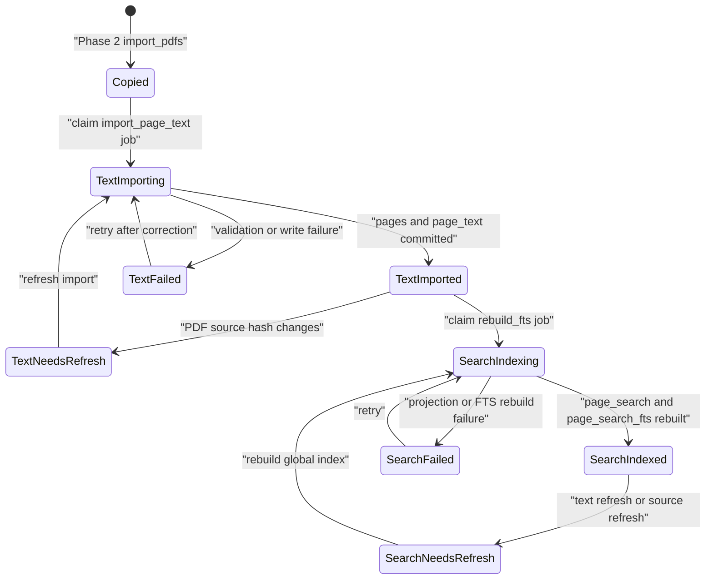
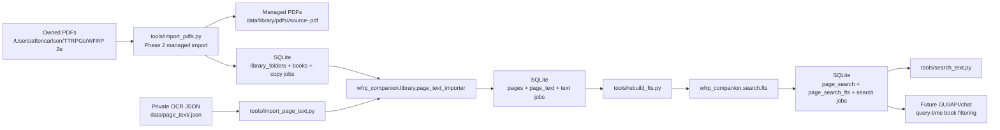

# Page Text Import And Global FTS Exact Search Implementation Plan

> **For agentic workers:** REQUIRED SUB-SKILL: Use `superpowers:subagent-driven-development` or `superpowers:executing-plans` to implement this plan task by task. Steps use checkbox (`- [ ]`) syntax for tracking.

**Goal:** Import existing private page-text JSON into SQLite, build one whole-library SQLite FTS5 search index, and expose exact search with per-book lifecycle ownership and query-time book filtering.

**Architecture:** Keep `books`, `pages`, `page_text`, `page_search`, `page_search_fts`, `source_sets`, and `book_readiness` as the app-owned source of truth. Import page text per book so failures and refreshes are granular, then rebuild one global FTS index for all imported pages so search is simple, fast, and ready for enabled-book filtering. Do not introduce vector search, AI calls, or frontend/API work in this phase.

**Tech Stack:** Python 3.12, Conda environment `wfrp-companion`, SQLite, SQLite FTS5, pytest, pytest-cov, ruff, Python standard library `argparse`, `hashlib`, `json`, `sqlite3`, `dataclasses`, `pathlib`, and `re`.

---

## 1. Source Boundary

This plan is based on the current live repository at `/Users/aftoncarlson/workspace/WFRP-Companion`, on branch `codex/phase-2-managed-pdf-library-import`.

Live code reviewed:

- `wfrp_companion/config.py`
- `wfrp_companion/db/connection.py`
- `wfrp_companion/db/schema.sql`
- `wfrp_companion/library/importer.py`
- `tools/extract_page_text.py`
- `tools/import_pdfs.py`
- `tools/init_db.py`
- `tests/db/test_schema.py`
- `tests/library/test_importer.py`
- `tests/tools/test_import_pdfs.py`

Current wiki, ADRs, and plans reviewed:

- `wiki/topics/target-architecture.md`
- `wiki/topics/pdf-library-and-ingestion.md`
- `wiki/topics/local-tooling-and-packaging.md`
- `wiki/topics/testing-posture-and-conventions.md`
- `wiki/topics/implementation-standards.md`
- `docs/adr/0001-conda-python-tooling.md`
- `docs/adr/0002-managed-local-pdf-storage.md`
- `docs/plans/2026-06-04-phase-2-managed-pdf-library-import-implementation-plan.md`

Official integration documentation verified:

- SQLite FTS5 external-content tables and rebuild behavior: `https://www.sqlite.org/fts5.html`
- SQLite UPSERT syntax: `https://www.sqlite.org/lang_upsert.html`
- SQLite transaction behavior: `https://www.sqlite.org/lang_transaction.html`

Local runtime input observed:

- `data/page_text/` contains 26 ignored JSON files, about 16 MB total.
- `wiki/topics/pdf-library-and-ingestion.md` records that the extraction run produced 26 PDFs / 3,736 pages, with 391 embedded-text pages, 3,214 OCR pages, and 131 empty OCR pages.

Sources intentionally excluded as architectural input:

- Older architecture plans that predate the current Phase 2 branch.
- The generic implementation-plan prompt itself as an architecture source.
- Private WFRP book text.
- Hosted/cloud database designs.
- HuggingFace, OpenAI, vector database, TTS, and adventure-generation plans, because this phase is local page text plus exact search only.

## 2. Current Live-Code Diagnosis

The Phase 2 branch has the correct foundation for managed PDF storage:

- `wfrp_companion/config.py` defines `AppConfig` with `pdf_root`, `data_dir`, `db_path`, and `asset_dir`.
- `wfrp_companion/db/schema.sql` already defines `pages`, `page_text`, `page_search`, `page_search_fts`, `source_sets`, `source_set_books`, `ingest_jobs`, and `book_readiness`.
- `wfrp_companion/library/importer.py` populates `library_folders`, `books`, and `ingest_jobs(job_type='copy_pdf')`.
- `tools/import_pdfs.py` imports all readable PDFs from `/Users/aftoncarlson/TTRPGs/WFRP 2e` by default into ignored managed storage at `data/library/pdfs/<book_id>/source-<original_sha256>.pdf`.

The current live-code problems this phase must fix:

- `pages` is defined but not populated.
- `page_text` is defined but not populated.
- `page_search` is defined but not populated.
- `page_search_fts` is defined but not populated.
- `books.text_status` remains `not_imported`, so the app cannot know which books have usable page text.
- `books.search_status` remains `not_indexed`, so `book_readiness.search_ready` cannot become true.
- `data/page_text/*.json` is currently useful but disconnected runtime input. If the app keeps querying JSON files directly, ownership would be split between SQLite and the filesystem.
- The future GUI and chat retrieval layers have no exact-search contract yet.

The current schema already encodes the right ownership model:

- `books.copy_status` owns reader readiness.
- `books.text_status` owns text import readiness.
- `books.search_status` owns exact search readiness.
- `book_readiness` is a derived view and must not be duplicated by another mutable readiness flag.
- `source_sets` and `source_set_books` already model future per-book enablement, but this phase should only prepare query-time filtering and not build source-set management UI.

## 3. Architecture Decision

Implement three tightly-scoped capabilities:

1. Page text import from `data/page_text/<book_id>.json` into `pages` and `page_text`.
2. Whole-library FTS projection from imported page text into `page_search` and `page_search_fts`.
3. Exact search query helpers and CLI using one global FTS index with optional per-book filtering.

Recommended steady-state architecture:

- Import text per book.
- Track text lifecycle per book in `books.text_status`.
- Track search lifecycle per book in `books.search_status`.
- Build one global SQLite FTS5 index over all imported pages.
- Filter by enabled books/source sets at query time, not by creating separate indexes.

This is the right fit because:

- The current corpus is small enough for whole-library FTS rebuilds: 26 books / 3,736 pages.
- A single global FTS index keeps exact search simple and fast.
- Per-book lifecycle state preserves the granular control the app needs when one book fails, changes, or is disabled.
- Query-time filtering is the cleanest path to the user's requirement that each individual book can be turned on or off.
- SQLite FTS5 is already declared in `wfrp_companion/db/schema.sql`; no new storage engine is required.

Approaches to avoid:

- Do not create one FTS table per book. That would complicate query fan-out, ranking, and future source-set filtering.
- Do not build per-book indexes as separate files. SQLite is already the app-owned metadata and search store for this phase.
- Do not query JSON files directly from app/search code after import.
- Do not implement vector search yet.
- Do not add OpenAI, HuggingFace, TTS, frontend, or adventure-generation behavior in this phase.
- Do not rely on frontend inference for book readiness. Read `book_readiness`.

## 4. Target State Model

This system needs explicit lifecycle state. The source of truth is `books`, supported by `ingest_jobs`.



State ownership:

| State Field | Owner | Meaning |
| --- | --- | --- |
| `books.copy_status` | `wfrp_companion.library.importer` | Managed PDF copy lifecycle. |
| `books.text_status` | new `wfrp_companion.library.page_text_importer` | Page text import lifecycle. |
| `books.search_status` | new `wfrp_companion.search.fts` | Global FTS projection lifecycle for each book. |
| `book_readiness.search_ready` | SQLite view | Derived from copied/imported/indexed state. |
| `ingest_jobs` | importer/search workers | Idempotent job history and retry state. |

Per-book enablement model:

- This phase should not create source-set UI.
- Exact search functions must accept `book_ids: Collection[str] | None`.
- `book_ids=None` means unfiltered whole-library search.
- `book_ids=[]` or any other empty collection means no books are enabled and must return no hits.
- Future app surfaces will resolve enabled books from `source_sets` / `source_set_books` and pass those book IDs into search. They must never pass an empty enabled set and accidentally receive all books.

## 5. Target Architecture Diagram



## 6. Proposed Data Model / Contracts

No new tables are required for the MVP implementation. Use the existing schema in `wfrp_companion/db/schema.sql`.

### Existing Tables To Populate

`pages`

- `id`: text primary key, format `<book_id>:<page_number>`.
- `book_id`: references `books(id)`.
- `page_number`: 1-based PDF page number from JSON.
- `page_label`: `null` for this phase.
- `extraction_method`: JSON page field.
- `embedded_text_chars`: JSON page field.
- `text_chars`: JSON page field.
- `word_count`: JSON page field.
- `image_count`: JSON page field.
- `ocr_attempted`: `1` if JSON `ocr_attempted` is true, else `0`.
- `ocr_error`: JSON page field.
- `has_text`: `1` when imported text after stripping is non-empty, else `0`.
- `metadata_json`: JSON object containing `{"source": "data/page_text", "json_sha256": "...", "ocr_language": "...", "ocr_dpi": ..., "low_text_chars_threshold": ...}`.

`page_text`

- `page_id`: references `pages(id)`.
- `text`: imported page text exactly as stored in the extraction JSON.
- `text_sha256`: SHA-256 of UTF-8 `text`.
- `generated_at`: JSON book-level `generated_at`.

`page_search`

- `rowid`: SQLite rowid primary key.
- `page_id`: references `pages(id)`, unique.
- `book_id`: references `books(id)`.
- `folder_id`: copied from `books.folder_id`.
- `category`: copied from `books.category`.
- `title`: copied from `books.title`.
- `page_number`: copied from `pages.page_number`.
- `text`: copied from `page_text.text`.

`page_search_fts`

- Existing SQLite FTS5 external-content table.
- Whole-library index over `page_search.title` and `page_search.text`.
- Rebuild with SQLite FTS5 rebuild command after refreshing `page_search`.

`ingest_jobs`

- Use `job_type='import_page_text'` for JSON import.
- Use `job_type='rebuild_fts'` for search projection rebuild.
- Use unique `idempotency_key` values:
  - `import_page_text:<book_id>:<json_sha256>` after a valid `book_id` is parsed and matches the filename.
  - `import_page_text_file:<relative_json_path>:<json_sha256>` when JSON is corrupt, missing `book_id`, or otherwise cannot be tied to a valid book.
  - `rebuild_fts:global:<text_snapshot_sha256>`

### New Package Contracts

Create `wfrp_companion/library/page_text_importer.py`:

- `PageTextImportFailure(relative_path: str, book_id: str | None, reason: str)`
- `PageTextImportSummary(discovered: int, imported: int, skipped_current: int, failed: int, pages_imported: int, failures: tuple[PageTextImportFailure, ...])`
- `import_page_text_library(config: AppConfig, input_dir: Path | None = None, force: bool = False, retry_running: bool = False, stale_running_minutes: int = 30) -> PageTextImportSummary`

Create `wfrp_companion/search/fts.py`:

- `FtsRebuildSummary(books_indexed: int, pages_indexed: int, failed: int, failure_reason: str | None)`
- `SearchHit(book_id: str, title: str, category: str, page_id: str, page_number: int, snippet: str, rank: int, score: float)`
- `rebuild_global_fts(config: AppConfig, force: bool = False, retry_running: bool = False, stale_running_minutes: int = 30) -> FtsRebuildSummary`
- `search_exact(config: AppConfig, query: str, *, book_ids: Collection[str] | None = None, limit: int = 20) -> tuple[SearchHit, ...]`
- `build_fts_query(query: str) -> str | None`

### Immutable Snapshot Data vs Live State

Immutable snapshot data:

- JSON file SHA-256.
- JSON `source_sha256`.
- JSON `generated_at`.
- Per-page extraction metrics.
- `page_text.text_sha256`.

Live state:

- `books.text_status`.
- `books.search_status`.
- `ingest_jobs.status`.
- `ingest_jobs.attempts`.
- `ingest_jobs.last_error`.
- `ingest_jobs.completed_at`.

Explicit linkage data:

- `pages.book_id`.
- `pages.page_number`.
- `page_text.page_id`.
- `page_search.page_id`.
- Future `source_set_books.source_set_id + book_id`.

## 7. External Integration Design

There are no cloud integrations in this phase.

### Local Filesystem

Source of truth boundary:

- `data/page_text/*.json` is compatibility input only.
- After successful import, SQLite owns the page metadata and text.
- The importer does not delete or mutate JSON files.
- Generated SQLite DB files remain ignored runtime artifacts.

Reads:

- `tools/import_page_text.py` reads JSON from `data/page_text` by default.
- Each JSON filename should be `<book_id>.json`.
- Each JSON document must include `book_id`, `source_sha256`, `page_count`, `generated_at`, and `pages`.

Writes:

- SQLite rows only.
- No writes to `data/page_text`.
- No writes to managed PDFs.

Success:

- Book row exists.
- `books.copy_status='copied'`.
- JSON source SHA matches `books.original_sha256`.
- JSON page count matches `books.page_count`.
- Page numbers are complete and unique.
- `pages` and `page_text` are committed for that book.
- `books.text_status='imported'`.

Failure:

- Failed `ingest_jobs` row with specific `last_error`.
- `books.text_status='failed'` when the book exists.
- No partial page import for that book.

### SQLite / FTS5

Source of truth boundary:

- `pages` and `page_text` own imported page text.
- `page_search` is a rebuildable search projection.
- `page_search_fts` is a rebuildable FTS index over `page_search`.

Idempotency:

- `import_page_text` jobs are keyed by book ID and JSON SHA.
- malformed JSON or missing-book-ID failures are keyed by relative JSON path and JSON SHA so they are deterministic and visible in `ingest_jobs` even before a book can be identified.
- `rebuild_fts` jobs are keyed by a deterministic text snapshot hash.

Retry behavior:

- Rerunning import with unchanged JSON and successful prior job skips the book unless `--force` is used.
- Rerunning global FTS rebuild is safe and should replace the projection.
- Interrupted `running` jobs are recoverable with the same Phase 2 pattern:
  - `--retry-running` resets all matching running jobs for immediate retry.
  - `--stale-running-minutes N` resets only running jobs older than `N` minutes.
  - recovered `books.text_status='importing'` rows become `failed` before retry unless their job is claimed in the same process.
  - recovered `books.search_status='indexing'` rows become `failed` before retry unless their job is claimed in the same process.

External down behavior:

- If SQLite is locked or unavailable, the CLI exits non-zero with a concise error.
- No filesystem changes need rollback.

## 8. Core Flow Design

### Flow A: Phase 2 PR Handoff

1. Confirm Phase 2 branch `codex/phase-2-managed-pdf-library-import` is merged or intentionally used as the base.
2. If PR creation is still blocked by `gh` identity, use the direct compare URL from the prior push or re-authenticate `gh` as the repo owner.
3. Confirm `git status --short --branch` is clean before starting implementation.

### Flow B: Page Text Import

1. Resolve config with `load_config()`.
2. Resolve input directory:
   - CLI default: `<config.data_dir>/page_text`.
   - CLI override: `--input-dir`.
   - CLI config parity: support `--data-dir` and `--db-path` with the same semantics as `tools/import_pdfs.py`.
3. Initialize SQLite with `initialize_database(config.db_path)`.
4. Recover stale or explicitly retried `import_page_text` jobs before discovering input files.
5. Discover `*.json` files in sorted order.
6. For each JSON file:
   - Read bytes.
   - Compute `json_sha256`.
   - Parse JSON.
   - Validate required book-level fields.
   - Validate required page-level fields.
   - Validate filename stem matches `book_id`.
   - Query `books` row.
   - Require `copy_status='copied'`.
   - Require JSON `source_sha256 == books.original_sha256`.
   - Require JSON `page_count == books.page_count`.
   - Require page numbers exactly match `1..page_count`.
7. If parsing fails before a valid `book_id` exists:
   - create or update a failed `ingest_jobs` row with `idempotency_key='import_page_text_file:<relative_json_path>:<json_sha256>'`;
   - set `target_id=null`;
   - add `PageTextImportFailure(relative_path=<relative_json_path>, book_id=None, reason=<specific_reason>)`;
   - continue to the next file without writing `pages` or `page_text`.
8. Claim import job.
9. In one transaction for the book:
   - Set `books.text_status='importing'`.
   - Delete existing `page_text` and `pages` rows for that book if `--force` or `text_status in ('failed', 'needs_refresh')`.
   - Upsert each `pages` row.
   - Upsert each `page_text` row.
   - Set `books.text_status='imported'`.
   - Set `books.search_status='needs_refresh'` unless it is already `not_indexed`.
   - Mark `ingest_jobs.status='succeeded'`.
10. On failure:
   - Roll back the book transaction.
   - Mark the job failed.
   - Set `books.text_status='failed'` if the book exists.
   - Include failure in CLI summary.

Guarded transition:

```sql
update books
set text_status = 'importing',
    updated_at = :now
where id = :book_id
  and copy_status = 'copied'
  and text_status in ('not_imported', 'failed', 'needs_refresh');
```

Page upsert shape:

```sql
insert into pages (
  id, book_id, page_number, page_label, extraction_method,
  embedded_text_chars, text_chars, word_count, image_count,
  ocr_attempted, ocr_error, has_text, metadata_json
) values (
  :id, :book_id, :page_number, null, :extraction_method,
  :embedded_text_chars, :text_chars, :word_count, :image_count,
  :ocr_attempted, :ocr_error, :has_text, :metadata_json
)
on conflict(id) do update set
  extraction_method = excluded.extraction_method,
  embedded_text_chars = excluded.embedded_text_chars,
  text_chars = excluded.text_chars,
  word_count = excluded.word_count,
  image_count = excluded.image_count,
  ocr_attempted = excluded.ocr_attempted,
  ocr_error = excluded.ocr_error,
  has_text = excluded.has_text,
  metadata_json = excluded.metadata_json;
```

### Flow C: Global FTS Rebuild

1. Resolve config.
2. Initialize SQLite.
3. Recover stale or explicitly retried `rebuild_fts` jobs before claiming a new rebuild.
4. Select all books where:
   - `copy_status='copied'`
   - `text_status='imported'`
5. Compute `text_snapshot_sha256` from ordered `(page_id, text_sha256)` rows for all imported books.
6. Claim `rebuild_fts:global:<text_snapshot_sha256>`.
7. In one transaction:
   - Set selected books to `search_status='indexing'`.
   - Delete all rows from `page_search`.
   - Insert all imported pages into `page_search`.
   - Rebuild `page_search_fts`.
   - Run a SQLite FTS5 integrity check against the rebuilt external-content table.
   - Verify `count(*)` from `page_search` equals `count(*)` visible through `page_search_fts`.
   - Set selected books to `search_status='indexed'`.
   - Set books with no imported text to `search_status='not_indexed'` unless already `failed`.
   - Mark job succeeded.
8. On failure:
   - Roll back the transaction.
   - Mark job failed.
   - Set affected imported books to `search_status='failed'`.

Projection insert shape:

```sql
insert into page_search (
  page_id, book_id, folder_id, category, title, page_number, text
)
select
  pages.id,
  books.id,
  books.folder_id,
  books.category,
  books.title,
  pages.page_number,
  page_text.text
from pages
join page_text on page_text.page_id = pages.id
join books on books.id = pages.book_id
where books.copy_status = 'copied'
  and books.text_status = 'imported';
```

FTS rebuild shape:

```sql
insert into page_search_fts(page_search_fts) values('rebuild');
```

FTS integrity-check shape:

```sql
insert into page_search_fts(page_search_fts, rank) values('integrity-check', 1);
```

### Flow D: Exact Search

1. Accept raw query and optional `book_ids`.
2. Build a safe FTS query:
   - If `book_ids` is an empty collection, return no hits immediately.
   - If `book_ids is None`, run unfiltered whole-library search.
   - Extract Unicode-aware word tokens with `re.findall(r"(?u)\w+", query)`.
   - Return `None` for no tokens.
   - Join quoted tokens with `AND` so `critical hit` becomes `"critical" AND "hit"`.
3. Query `page_search_fts` with bound parameters.
4. Join to `page_search`.
5. Apply optional non-empty `book_ids` filter with bound parameters.
6. Limit results with a bounded `limit`, default 20, maximum 100.
7. Return structured `SearchHit` rows.

Search SQL shape:

```sql
select
  page_search.book_id,
  page_search.title,
  page_search.category,
  page_search.page_id,
  page_search.page_number,
  snippet(page_search_fts, 1, '[', ']', '...', 12) as snippet,
  bm25(page_search_fts) as score
from page_search_fts
join page_search on page_search.rowid = page_search_fts.rowid
where page_search_fts match :fts_query
-- optional: and page_search.book_id in (:book_id_1, :book_id_2, ...)
order by score asc, page_search.title asc, page_search.page_number asc
limit :limit;
```

## 9. UX / Surface Behavior

This phase exposes CLI surfaces only. No GUI work should be included.

| Surface | Behavior |
| --- | --- |
| `tools/import_page_text.py` | Imports JSON into SQLite and prints discovered/imported/skipped/failed/pages summary. |
| `tools/rebuild_fts.py` | Rebuilds one global FTS index and prints books indexed/pages indexed/failure summary. |
| `tools/search_text.py` | Runs exact search and prints ranked book/page/snippet results. |
| Future library GUI | Reads `book_readiness.search_ready`; does not inspect JSON files. |
| Future source-set GUI | Enables/disables books by writing `source_set_books`; search filters by resolved book IDs. |
| Future chat retrieval | Uses `SearchHit` objects with `book_id`, `page_id`, and `page_number` as citation inputs. |

CLI output rules:

- Do not print full page text.
- Print snippets only for explicit search commands.
- Print failure reasons without dumping copyrighted text.
- Return exit code `1` when any import/rebuild failure occurs.
- All new CLIs must support `--data-dir` and `--db-path`.
- `tools/import_page_text.py` must also support `--input-dir`, `--force`, `--retry-running`, and `--stale-running-minutes`.
- `tools/rebuild_fts.py` must also support `--force`, `--retry-running`, and `--stale-running-minutes`.

## 10. Implementation Sequence

### PR 0: Phase 2 PR Handoff

Scope:

- Operational precondition.

Changes:

- No code changes expected.

Required checks:

- Confirm Phase 2 branch is merged or intentionally used as the base for this plan.
- Confirm generated `data/` remains ignored.

What intentionally does not change:

- No text import.
- No search implementation.

### PR 1: Page Text Importer

Files:

- Create `wfrp_companion/library/page_text_importer.py`.
- Create `tools/import_page_text.py`.
- Create `tests/library/test_page_text_importer.py`.
- Create `tests/tools/test_import_page_text.py`.
- Modify `wiki/topics/pdf-library-and-ingestion.md`.
- Modify `wiki/topics/local-tooling-and-packaging.md`.
- Modify `wiki/topics/testing-posture-and-conventions.md`.
- Modify `wiki/log.md`.

Steps:

- [ ] Write tests for parsing a valid synthetic page-text JSON document.
- [ ] Write tests for rejecting missing required book fields.
- [ ] Write tests for rejecting missing required page fields.
- [ ] Write tests for rejecting filename/book ID mismatch.
- [ ] Write tests for rejecting missing `books` row.
- [ ] Write tests for rejecting `copy_status!='copied'`.
- [ ] Write tests for rejecting source SHA mismatch.
- [ ] Write tests for rejecting page count mismatch.
- [ ] Write tests for rejecting duplicate/missing page numbers.
- [ ] Write tests for successful import into `pages` and `page_text`.
- [ ] Write tests for `books.text_status='imported'`.
- [ ] Write tests for idempotent rerun with same JSON SHA.
- [ ] Write tests for corrupt JSON recording `import_page_text_file:<relative_json_path>:<json_sha256>` with `target_id=null`.
- [ ] Write tests for missing `book_id` recording a deterministic file-level failed job.
- [ ] Write tests for recovering stale `running` import jobs.
- [ ] Write tests for `--retry-running` import behavior.
- [ ] Write tests for `--force` replacing existing page text.
- [ ] Write CLI tests for `--data-dir`, `--db-path`, `--input-dir`, `--retry-running`, and `--stale-running-minutes`.
- [ ] Write CLI tests for summary output and non-zero failure exit.
- [ ] Implement the importer only after tests fail for the expected missing module/functions.
- [ ] Run focused tests for importer and CLI.
- [ ] Run full coverage and ruff.
- [ ] Update wiki/docs in the same PR.

Required commands:

```bash
conda run -n wfrp-companion python -m pytest tests/library/test_page_text_importer.py tests/tools/test_import_page_text.py -v
conda run -n wfrp-companion python -m pytest --cov=wfrp_companion --cov=tools.init_db --cov=tools.import_pdfs --cov=tools.import_page_text --cov-report=term-missing --cov-fail-under=100
conda run -n wfrp-companion ruff check .
```

### PR 2: Global FTS Rebuild

Files:

- Create `wfrp_companion/search/__init__.py`.
- Create `wfrp_companion/search/fts.py`.
- Create `tools/rebuild_fts.py`.
- Create `tests/search/test_fts.py`.
- Create `tests/tools/test_rebuild_fts.py`.
- Modify `wiki/topics/target-architecture.md`.
- Modify `wiki/topics/testing-posture-and-conventions.md`.
- Modify `wiki/log.md`.

Steps:

- [ ] Write tests for selecting only copied/imported books.
- [ ] Write tests for deterministic text snapshot hashing.
- [ ] Write tests for populating `page_search` from synthetic pages.
- [ ] Write tests for rebuilding `page_search_fts`.
- [ ] Write tests for FTS5 integrity-check execution after rebuild.
- [ ] Write tests that fail if `page_search` and `page_search_fts` row counts drift after rebuild.
- [ ] Write tests that `books.search_status='indexed'` after success.
- [ ] Write tests that failure sets `books.search_status='failed'` and records `ingest_jobs.last_error`.
- [ ] Write tests for idempotent rebuild with unchanged text snapshot.
- [ ] Write tests for recovering stale `running` rebuild jobs and `books.search_status='indexing'`.
- [ ] Write tests for `--retry-running` rebuild behavior.
- [ ] Implement the FTS rebuild module after tests fail for expected missing functions.
- [ ] Implement the CLI.
- [ ] Run focused tests.
- [ ] Run full coverage and ruff.
- [ ] Update wiki/docs in the same PR.

Required commands:

```bash
conda run -n wfrp-companion python -m pytest tests/search/test_fts.py tests/tools/test_rebuild_fts.py -v
conda run -n wfrp-companion python -m pytest --cov=wfrp_companion --cov=tools.init_db --cov=tools.import_pdfs --cov=tools.import_page_text --cov=tools.rebuild_fts --cov-report=term-missing --cov-fail-under=100
conda run -n wfrp-companion ruff check .
```

### PR 3: Exact Search CLI And Contract

Files:

- Modify `wfrp_companion/search/fts.py`.
- Create `tools/search_text.py`.
- Modify `tests/search/test_fts.py`.
- Create `tests/tools/test_search_text.py`.
- Modify `wiki/topics/target-architecture.md`.
- Modify `wiki/topics/pdf-library-and-ingestion.md`.
- Modify `wiki/topics/testing-posture-and-conventions.md`.
- Modify `wiki/log.md`.

Steps:

- [ ] Write tests for `build_fts_query("critical hit") == "\"critical\" AND \"hit\""`.
- [ ] Write tests for punctuation-heavy input returning safe tokens.
- [ ] Write tests for non-ASCII terms such as `"Bögenhafen"` returning a usable Unicode token.
- [ ] Write tests for empty/no-token input returning no results.
- [ ] Write tests for exact search returning `SearchHit` with `book_id`, `title`, `category`, `page_id`, `page_number`, `snippet`, `rank`, and `score`.
- [ ] Write tests for `book_ids=None` searching the whole index.
- [ ] Write tests for `book_ids=[]` returning no hits.
- [ ] Write tests for non-empty `book_ids` filtering.
- [ ] Write tests for limit clamping to maximum 100.
- [ ] Write CLI tests for printed book/page/snippet rows.
- [ ] Implement search query helpers after tests fail for expected missing behavior.
- [ ] Run focused tests.
- [ ] Run full coverage and ruff.
- [ ] Update wiki/docs in the same PR.

Required commands:

```bash
conda run -n wfrp-companion python -m pytest tests/search/test_fts.py tests/tools/test_search_text.py -v
conda run -n wfrp-companion python -m pytest --cov=wfrp_companion --cov=tools.init_db --cov=tools.import_pdfs --cov=tools.import_page_text --cov=tools.rebuild_fts --cov=tools.search_text --cov-report=term-missing --cov-fail-under=100
conda run -n wfrp-companion ruff check .
```

### Final Local Verification Pass

Commands:

```bash
conda run -n wfrp-companion python tools/import_pdfs.py
conda run -n wfrp-companion python tools/import_page_text.py
conda run -n wfrp-companion python tools/rebuild_fts.py
conda run -n wfrp-companion python tools/search_text.py "critical hit"
git status --short --ignored data
```

Expected local result:

- PDF import reports 26 copied/current books.
- Page text import reports 26 imported/current JSON files.
- FTS rebuild reports 26 indexed books and 3,736 indexed pages.
- Search command returns page-level hits with snippets.
- `data/` remains ignored and unstaged.

## 11. Testing Requirements

Testing is part of implementation, not follow-up cleanup.

Required categories:

- JSON contract validation tests.
- Import lifecycle transition tests.
- Idempotency tests.
- Stale running job recovery tests.
- SQLite integration tests.
- FTS projection tests.
- FTS external-content consistency tests.
- FTS query construction tests.
- Per-book query filter tests.
- Unicode search token tests.
- CLI tests.
- Failure/quarantine tests.
- 100% coverage for all changed Python modules and tools.

Fixtures:

- Use synthetic JSON only.
- Use synthetic book titles and text.
- Do not copy WFRP text into tests.
- Use temporary SQLite DBs through `tmp_path`.

Final coverage gate after all PRs:

```bash
conda run -n wfrp-companion python -m pytest \
  --cov=wfrp_companion \
  --cov=tools.init_db \
  --cov=tools.import_pdfs \
  --cov=tools.import_page_text \
  --cov=tools.rebuild_fts \
  --cov=tools.search_text \
  --cov-report=term-missing \
  --cov-fail-under=100
```

Lint gate:

```bash
conda run -n wfrp-companion ruff check .
```

## 12. Verification Matrix

| Scenario | Expected Result |
| --- | --- |
| Phase 2 DB has copied books | `books.copy_status='copied'` rows exist. |
| Valid JSON import | `pages` and `page_text` rows are created. |
| Reimport same JSON | Import skips or reports current without duplicate rows. |
| Force reimport | Existing book pages are replaced atomically. |
| Missing book row | Import fails for that JSON and records a failed job. |
| Source SHA mismatch | Import fails without partial page rows. |
| Page count mismatch | Import fails without partial page rows. |
| Duplicate page number | Import fails without partial page rows. |
| Corrupt JSON | File-level failed job is recorded with `target_id=null`. |
| Stale import job | Rerun with stale recovery can import the book. |
| Empty OCR page | Page imports with `has_text=0` and still preserves metadata. |
| Global FTS rebuild | `page_search` and `page_search_fts` are populated. |
| FTS integrity check | Rebuild fails if the external-content FTS table is inconsistent. |
| Stale rebuild job | Rerun with stale recovery can rebuild global FTS. |
| Search readiness | `book_readiness.search_ready=1` for copied/imported/indexed books. |
| Exact term search | Search returns structured book/page hits. |
| `book_ids=None` search | Search returns whole-library hits. |
| `book_ids=[]` search | Search returns no hits. |
| Non-empty book filter search | Disabled/excluded book IDs are not returned. |
| Unicode search | Non-ASCII search tokens are accepted. |
| No-token search | Returns no results without throwing. |
| Private data boundary | No `data/` files are staged. |

## 13. Migration / Compatibility / Cleanup Strategy

Compatibility input:

- Existing `data/page_text/*.json` files remain the migration source for this phase.
- These JSON files stay ignored and local.

Safe migration cases:

- JSON `book_id` matches `books.id`.
- JSON filename stem matches `book_id`.
- JSON `source_sha256` matches `books.original_sha256`.
- JSON `page_count` matches `books.page_count`.
- JSON pages cover exactly `1..page_count`.

Ambiguous or quarantine cases:

- JSON exists without a matching copied book.
- JSON is corrupt or not an object.
- JSON is missing `book_id`.
- JSON filename stem does not match `book_id`.
- JSON `source_sha256` mismatch.
- JSON page count mismatch.
- Missing page numbers.
- Duplicate page numbers.
- Invalid JSON.
- Missing required fields.
- Book row exists but `copy_status!='copied'`.

Quarantine behavior:

- Record a failed `ingest_jobs` row.
- Use file-level idempotency with `target_id=null` if a valid book cannot be identified.
- Mark the affected book `text_status='failed'` if a book row exists.
- Print a concise failure reason.
- Do not write partial rows for the failed book.

Cleanup later:

- Keep `tools/extract_page_text.py` until first-class extraction from managed PDFs exists.
- Keep `data/page_text` JSON files until the DB import has been verified and a regeneration path exists.
- Do not delete schema columns or compatibility commands in this phase.

## 14. Operational Rollout Notes

Rollout order:

1. Merge or intentionally branch from Phase 2.
2. Run the existing Phase 2 tests.
3. Land PR 1 and import page text.
4. Land PR 2 and rebuild global FTS.
5. Land PR 3 and verify exact search.
6. Update the wiki after each PR.
7. Run final local verification against the real ignored corpus.

Operational commands:

```bash
conda run -n wfrp-companion python tools/import_pdfs.py
conda run -n wfrp-companion python tools/import_page_text.py
conda run -n wfrp-companion python tools/rebuild_fts.py
conda run -n wfrp-companion python tools/search_text.py "critical hit"
```

No Azure, firewall, hosted DB, model provider, or service credential changes are required.

Recovery mechanics:

- Rerun `tools/import_page_text.py --force` for corrected JSON.
- Rerun `tools/rebuild_fts.py --force` after any text refresh.
- Use `--retry-running` to intentionally retry interrupted imports or rebuilds immediately.
- Use `--stale-running-minutes 30` by default to recover old interrupted jobs while leaving fresh active jobs alone.
- Inspect failed jobs with SQL:

```sql
select job_type, target_id, status, attempts, last_error
from ingest_jobs
where status = 'failed'
order by updated_at desc;
```

## 15. ADR / Platform Alignment

This plan aligns with ADR 0001:

- All Python work runs through Conda environment `wfrp-companion`.
- New dependencies are not required.
- Tests and tools stay in the existing Python workflow.

This plan aligns with ADR 0002:

- Managed PDFs remain local runtime artifacts.
- SQLite remains the app-owned source of truth for metadata and lifecycle state.
- The original source PDF folder is not mutated.

This plan aligns with the wiki target architecture:

- It completes steps 2 and 3 of the durable local loop in `wiki/topics/implementation-standards.md`: extract/import page-level text and search by exact term.
- It prepares future citation links through stable `book_id`, `page_id`, and `page_number`.
- It keeps vector search as future hybrid search work, not a prerequisite.

No new ADR is required for global SQLite FTS because `page_search_fts` is already present in the accepted schema. A future ADR should be written when choosing vector search storage or AI model/provider behavior.

## 16. Non-Goals / Guardrails / Open Questions

Non-goals:

- No vector database.
- No HuggingFace model download.
- No OpenAI API calls.
- No chat agent.
- No adventure module generator.
- No TTS.
- No frontend.
- No PDF.js reader.
- No image/map extraction.
- No source-set management UI.
- No hosted/cloud deployment.

Guardrails:

- Do not commit PDFs.
- Do not commit extracted WFRP page text.
- Do not commit SQLite databases or generated indexes.
- Do not add a second mutable readiness table or field.
- Do not split search state between JSON and SQLite.
- Do not let the frontend infer status from files later.
- Keep a single global FTS index and filter by book IDs at query time.

Open questions that can wait until implementation:

- Whether exact search should support phrase mode in addition to token-AND mode. The first implementation should use token-AND for safety and predictable escaping.
- Whether global FTS rebuild time is fast enough on the full corpus. Based on 3,736 pages, assume yes unless measurement proves otherwise.
- Whether to add a future `updated_at` column to `page_text`. This phase can compute snapshots from `page_id` and `text_sha256` without schema changes.

## Self-Review

- Spec coverage: This plan covers Phase 2 PR handoff, page-text JSON import, global whole-library FTS, per-book lifecycle state, query-time filtering, tests, rollout, and wiki updates.
- Placeholder scan: No unresolved placeholders are present.
- Type consistency: File names, function names, dataclass names, lifecycle state values, job types, and schema fields are consistent across sections.
