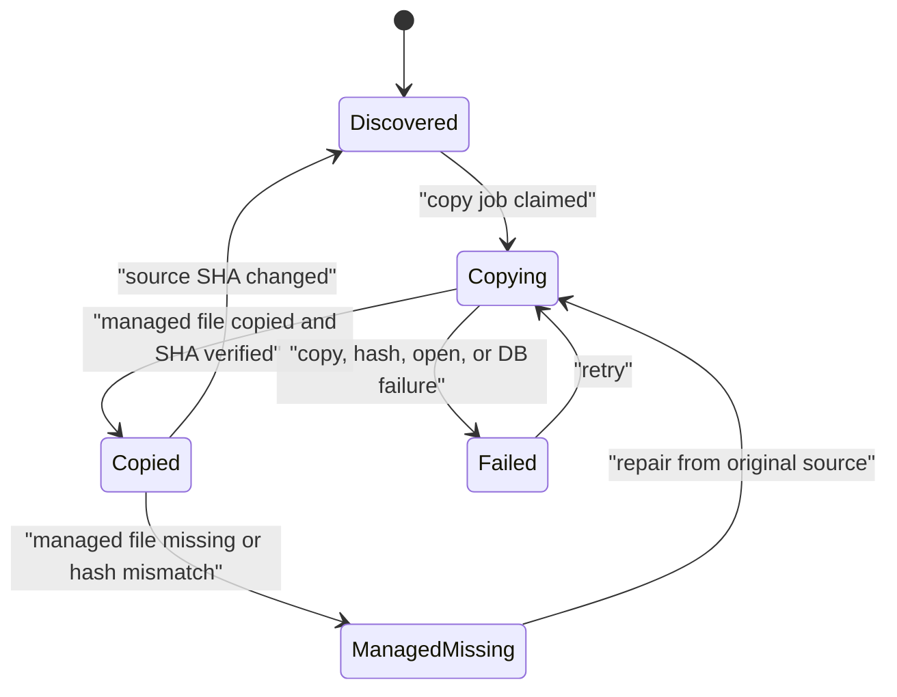
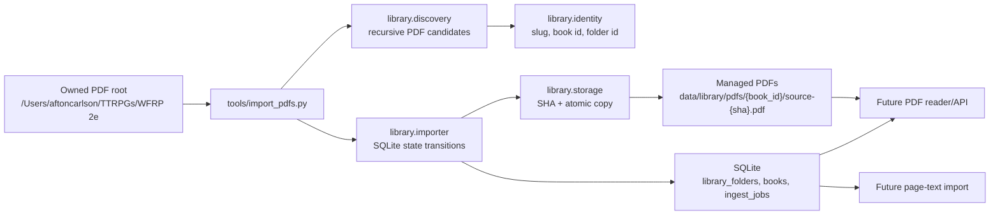

# Phase 2 Managed PDF Library Import Implementation Plan

> **For agentic workers:** REQUIRED SUB-SKILL: Use `superpowers:subagent-driven-development` or `superpowers:executing-plans` to implement this plan task by task. Steps use checkbox (`- [ ]`) syntax for tracking.

**Goal:** Implement the Phase 2 local managed-PDF library importer for WFRP Companion, importing all owned PDFs from the configured source root into app-managed storage and recording folder, book, and copy-job state in SQLite.

**Architecture:** Keep Phase 2 pure local. Discover all PDFs from `AppConfig.pdf_root`, preserve the source folder hierarchy in `library_folders`, create one stable `books` row per readable PDF, copy every readable PDF into a versioned managed path under `data/library/pdfs/<book_id>/source-<original_sha256>.pdf`, and use `ingest_jobs` plus guarded SQL transitions for idempotent copy state. Runtime and later reader/search phases will use the managed absolute PDF path stored in SQLite.

**Tech Stack:** Python 3.12, Conda environment `wfrp-companion`, SQLite, PyMuPDF, pytest, pytest-cov, ruff, Python standard library `pathlib`, `hashlib`, `shutil`, and `os.replace`.

---

## 1. Source Boundary

This plan is based on the current live repository at `/Users/aftoncarlson/workspace/WFRP-Companion`.

Live code reviewed:

- `wfrp_companion/config.py`
- `wfrp_companion/db/connection.py`
- `wfrp_companion/db/schema.sql`
- `tools/init_db.py`
- `tools/extract_page_text.py`
- `tests/db/test_schema.py`
- `environment.yml`

Current compiled wiki and docs reviewed:

- `wiki/topics/target-architecture.md`
- `wiki/topics/pdf-library-and-ingestion.md`
- `wiki/topics/local-tooling-and-packaging.md`
- `wiki/topics/testing-posture-and-conventions.md`
- `wiki/topics/implementation-standards.md`
- `docs/adr/0001-conda-python-tooling.md`

Relevant current design input:

- The accepted Phase 1 SQLite foundation on branch `codex/phase-1-db-foundation`.
- The user's Phase 2 decisions:
  - Store `books.managed_pdf_path` as an absolute filesystem path.
  - Import all books by default.
  - Add an ADR for managed local PDF storage because this is a durable architecture decision.

Official integration documentation verified:

- PyMuPDF `Document` can be used as a context manager and `Document.page_count` returns total page count. Source: PyMuPDF official docs at `https://github.com/pymupdf/pymupdf/blob/main/docs/document.md`.
- Python standard library documentation should be used during implementation for `hashlib.sha256`, `shutil.copyfileobj` or equivalent byte-copy behavior, and `os.replace` atomic replacement.
- SQLite official documentation should be used for UPSERT and guarded updates if implementation needs syntax confirmation.

Sources intentionally excluded as architectural input:

- The original generic planning prompt as an architecture source.
- Any older or stale plans except where this file explicitly carries forward current user decisions.
- Private WFRP PDF text content.
- Cloud/Azure/Cosmos architecture. Phase 2 is local filesystem plus SQLite only.

## 2. Current Live-Code Diagnosis

Phase 1 created a real SQLite foundation, but Phase 2 has not been implemented.

Concrete current implementation:

- `wfrp_companion/config.py` owns local configuration through `AppConfig`.
  - `pdf_root` defaults to `/Users/aftoncarlson/TTRPGs/WFRP 2e`.
  - `data_dir` defaults to `<repo>/data`.
  - `db_path` defaults to `<repo>/data/wfrp_companion.sqlite`.
  - `asset_dir` defaults to `<repo>/data/library/assets`.
- `wfrp_companion/db/schema.sql` already defines `library_folders`, `books`, `ingest_jobs`, and `book_readiness`.
- `wfrp_companion/db/connection.py` initializes SQLite with foreign keys enabled and WAL mode.
- `tools/init_db.py` is the existing CLI shape to follow for direct script execution and importable `main(argv)`.
- `tools/extract_page_text.py` has existing identity helpers:
  - `slugify(value: str) -> str`
  - `book_id_for(root: Path, pdf_path: Path) -> str`
  - `infer_category(root: Path, pdf_path: Path) -> str`
  - `sha256_file(path: Path) -> str`
- `tests/db/test_schema.py` proves the schema constraints and current CLI style.

Important live-code problems Phase 2 must fix:

- `library_folders` exists but has no rows.
- `books` exists but has no rows for the user's PDFs.
- `ingest_jobs` exists but no importer creates or claims jobs.
- There is no managed PDF copy under app storage.
- The source folder hierarchy exists only on disk, so later UI toggles cannot be backed by app-owned state.
- Book identity currently lives in `tools/extract_page_text.py`, which makes future OCR import, managed copy import, and DB import vulnerable to drift.
- `book_readiness.reader_ready` cannot become true because no `books.copy_status='copied'` rows exist.
- Future PDF reader and citation flows have no stable app-owned PDF path.

Ownership issues:

- The original PDF root is a user-owned import source, not an app-owned runtime store.
- SQLite must own metadata and lifecycle state.
- Managed local files are runtime artifacts, but their validity is owned by `books.managed_sha256` and `books.copy_status`.
- The frontend must not infer readiness from filesystem checks later; it must read DB state.

## 3. Architecture Decision

Implement Phase 2 as a Python package plus a CLI.

Create these package modules:

- `wfrp_companion/library/__init__.py`
- `wfrp_companion/library/identity.py`
- `wfrp_companion/library/discovery.py`
- `wfrp_companion/library/storage.py`
- `wfrp_companion/library/importer.py`

Create this CLI:

- `tools/import_pdfs.py`

Create this ADR:

- `docs/adr/0002-managed-local-pdf-storage.md`

Create tests:

- `tests/library/test_identity.py`
- `tests/library/test_discovery.py`
- `tests/library/test_storage.py`
- `tests/library/test_importer.py`

Architecture details:

- Discover recursively from `config.pdf_root`.
- Import all PDFs by default.
- Preserve folder hierarchy in `library_folders`.
- Use the existing slug convention from `tools/extract_page_text.py` for book IDs.
- Store `books.relative_path` as POSIX-style relative path from `pdf_root`.
- Store `books.original_source_path` as an absolute path.
- Store `books.managed_pdf_path` as an absolute path.
- Copy managed PDFs to `<data_dir>/library/pdfs/<book_id>/source-<original_sha256>.pdf`.
- Use short SQLite transactions for metadata and state transitions.
- Copy files outside long DB transactions.
- Use `ingest_jobs.idempotency_key='copy_pdf:<book_id>:<original_sha256>'`.

Approaches to avoid:

- Do not import OCR JSON in this phase.
- Do not create `pages`, `page_text`, `page_search`, or FTS rows.
- Do not add FastAPI or GUI code.
- Do not add a vector database.
- Do not write to the original PDF folder.
- Do not make category filtering part of the import; all books are imported.
- Do not add a second readiness flag outside `book_readiness`.
- Do not store private PDF bytes or extracted text in tests or docs.

## 4. Target State Model

Phase 2 has a formal copy lifecycle owned by `books.copy_status` and `ingest_jobs.status`.



`books.copy_status` meanings:

| Status | Meaning | Owner |
| --- | --- | --- |
| `discovered` | Source PDF is known and needs a managed copy. | Importer |
| `copying` | A copy job has claimed this book. | Importer |
| `copied` | Managed PDF exists and `managed_sha256` is set. | Importer |
| `managed_missing` | DB has a book row, but managed PDF is missing or invalid. | Importer repair check |
| `failed` | Latest copy attempt failed. | Importer |

`ingest_jobs.status` meanings for `copy_pdf`:

| Status | Meaning |
| --- | --- |
| `queued` | Work is needed and not yet claimed. |
| `running` | Current process is copying or verifying. |
| `succeeded` | Copy succeeded for this source SHA. |
| `failed` | Copy failed and `last_error` explains why. |

Downstream lifecycle fields stay explicit but untouched:

- `books.text_status` remains `not_imported`.
- `books.search_status` remains `not_indexed`.
- `books.visual_status` remains `not_scanned`.

When a source SHA changes for an already imported book:

- Set `copy_status='discovered'`.
- Keep the old managed copy until the replacement copy succeeds.
- If any downstream state had advanced beyond initial values, mark it stale:
  - `text_status='needs_refresh'` if it was `imported`.
  - `search_status='needs_refresh'` if it was `indexed`.
  - `visual_status='needs_refresh'` if it was `scanned`.

## 5. Target Architecture Diagram



## 6. Proposed Data Model / Contracts

No Phase 2 schema migration is required. Use the existing Phase 1 schema.

### `library_folders`

Phase 2 ownership:

- One row per folder that contains PDFs or ancestors of folders that contain PDFs.
- Folder IDs must be deterministic.
- Use `root` for the PDF root folder row.
- Use collision-resistant folder IDs for non-root rows: `folder-<slug>-<sha1_8>`, where `<sha1_8>` is the first eight hex characters of the POSIX relative folder path SHA-1. Folder IDs do not need to match OCR JSON names; book IDs do.
- Store `relative_path` as POSIX-style text.

Important fields:

- `id`
- `parent_id`
- `name`
- `relative_path`
- `sort_order`

Uniqueness:

- `relative_path` is unique in the existing schema.

### `books`

Phase 2 ownership:

- One row per readable discovered PDF.
- `id` is stable and derived from relative PDF path without suffix.
- `relative_path` is POSIX-style relative path from `pdf_root`.
- `original_source_path` is absolute.
- `managed_pdf_path` is absolute.

Important fields:

- `id`
- `folder_id`
- `title`
- `category`
- `relative_path`
- `original_source_path`
- `managed_pdf_path`
- `original_sha256`
- `managed_sha256`
- `page_count`
- `copy_status`
- `text_status`
- `search_status`
- `visual_status`
- `metadata_json`
- `discovered_at`
- `copied_at`
- `updated_at`

Initial insert values:

- `copy_status='discovered'`
- `text_status='not_imported'`
- `search_status='not_indexed'`
- `visual_status='not_scanned'`
- `enabled_default=0`
- `metadata_json='{}'`
- `managed_sha256=null`
- `copied_at=null`

Existing constraints that must be respected:

- `copy_status` must be one of `discovered`, `copying`, `copied`, `managed_missing`, `failed`.
- A `copied` book must have non-null `managed_sha256`.
- Boolean-like fields must be `0` or `1`.
- `relative_path` is unique.

### `ingest_jobs`

Phase 2 ownership:

- One `copy_pdf` job per `(book_id, original_sha256)` import attempt lineage.
- Job rows make import reruns idempotent and debuggable.

Important fields:

- `id`
- `job_type='copy_pdf'`
- `target_id=<book_id>`
- `status`
- `idempotency_key='copy_pdf:<book_id>:<original_sha256>'`
- `attempts`
- `last_error`
- `created_at`
- `updated_at`
- `completed_at`

Uniqueness:

- `idempotency_key` is unique in the existing schema.

### Core Python Contracts

`wfrp_companion/library/identity.py`:

```python
def slugify(value: str) -> str: ...
def path_to_posix(path: Path) -> str: ...
def relative_pdf_path(root: Path, pdf_path: Path) -> Path: ...
def book_id_for(root: Path, pdf_path: Path) -> str: ...
def folder_id_for(relative_folder: Path) -> str: ...
def category_for(relative_path: Path) -> str: ...
```

`wfrp_companion/library/discovery.py`:

```python
@dataclass(frozen=True)
class PdfCandidate:
    source_path: Path
    relative_path: Path
    relative_path_posix: str
    book_id: str
    title: str
    category: str
    folder_relative_path: Path
    folder_id: str

def find_pdf_paths(root: Path) -> list[Path]: ...
def discover_pdfs(root: Path) -> list[PdfCandidate]: ...
```

`wfrp_companion/library/storage.py`:

```python
def sha256_file(path: Path) -> str: ...
def managed_pdf_path(data_dir: Path, book_id: str, source_sha256: str) -> Path: ...
def copy_pdf_atomic(source_path: Path, target_path: Path) -> str: ...
def managed_file_matches(path: Path, expected_sha256: str) -> bool: ...
```

`wfrp_companion/library/importer.py`:

```python
@dataclass(frozen=True)
class ImportSummary:
    discovered: int
    copied: int
    skipped_current: int
    repaired: int
    stale_recovered: int
    failed: int

def import_pdf_library(
    config: AppConfig,
    *,
    retry_running: bool = False,
    stale_running_minutes: int = 30,
) -> ImportSummary: ...
```

## 7. External Integration Design

### Local PDF Source Folder

Source of truth boundary:

- `/Users/aftoncarlson/TTRPGs/WFRP 2e` is the user-owned source.
- The importer reads from it.
- The importer never writes to it.

Reads:

- Recursive PDF discovery.
- Source SHA-256.
- PyMuPDF page count.

Writes:

- None.

Idempotency:

- Stable `book_id` from source-relative path.
- Stable `original_sha256` from file bytes.
- Stable job key `copy_pdf:<book_id>:<original_sha256>`.

Failure behavior:

- If the source root does not exist, CLI exits non-zero before mutating DB. The CLI must validate `pdf_root.exists()` and `pdf_root.is_dir()` before calling `initialize_database(db_path)`.
- If one PDF fails, record a failed job and continue importing other PDFs.
- If an already copied source is later absent from discovery, do not delete the existing book row.

### Managed App Storage

Source of truth boundary:

- Files under `data/library/pdfs` are runtime artifacts.
- SQLite owns whether those files are valid.

Writes:

- `copy_pdf_atomic()` writes `<target>.tmp-<pid>` in the target directory.
- It verifies SHA after copy.
- It replaces the final target with `os.replace`.
- Final targets are versioned by source SHA, for example `source-0123abcd....pdf`. This prevents a source refresh from overwriting the old managed PDF before SQLite has successfully moved `books.managed_pdf_path` to the new version.

Reads:

- Later PDF reader/API phases will read `books.managed_pdf_path`.
- Phase 2 reads managed files only to verify repair/idempotency.

Failure behavior:

- If the managed file is missing after a previous copy, mark `copy_status='managed_missing'` and repair if source exists.
- If SHA verification fails, mark `books.copy_status='failed'` and `ingest_jobs.status='failed'`.

### SQLite

Source of truth boundary:

- SQLite owns folder/book/job lifecycle.

Writes:

- Folder upserts.
- Book upserts.
- Job upserts.
- Guarded state transitions.

Retry behavior:

- `failed` copy jobs can be retried by rerunning the CLI.
- Stale `running` copy jobs can be recovered by rerunning after `--stale-running-minutes` has elapsed, or immediately with `--retry-running`.
- A new source SHA creates or reuses a new idempotency key.

Success definition:

- `books.copy_status='copied'`
- `books.managed_sha256=books.original_sha256`
- `ingest_jobs.status='succeeded'`
- Managed file exists at absolute `books.managed_pdf_path`.

### PyMuPDF

Source of truth boundary:

- PyMuPDF is a parser/inspector only.

Reads:

- Open source PDF.
- Read `Document.page_count`.

Writes:

- None in Phase 2.

Failure behavior:

- Unopenable PDFs are failed candidates.
- Do not insert a `books` row for an unopenable PDF because `books.page_count` is non-null and must only represent readable source snapshots.
- Still create a failed `ingest_jobs` row with `job_type='copy_pdf'`, `target_id=<book_id>`, and `idempotency_key='copy_pdf:<book_id>:<source_sha256>'` so the CLI can report and retry the candidate after the source file is fixed.

## 8. Core Flow Design

### Create/Import Flow

1. CLI parses arguments.
2. CLI loads `AppConfig`.
3. CLI resolves:
   - `pdf_root`
   - `data_dir`
   - `db_path`
4. CLI validates `pdf_root.exists()` and `pdf_root.is_dir()`.
5. If validation fails, CLI exits non-zero without calling `initialize_database(db_path)`.
6. CLI calls `initialize_database(db_path)`.
7. Importer recovers stale copy claims according to `retry_running` and `stale_running_minutes`.
8. Importer discovers all PDF candidates.
9. For each candidate:
   - compute source SHA
   - open with PyMuPDF and read `page_count`
   - upsert folder hierarchy
   - upsert `books`
   - upsert `ingest_jobs`
   - claim copy state
   - copy managed file outside long DB transaction
   - finalize DB success or failure

### Folder Upsert Flow

For `Adventure Modules and Campaigns/Paths of the Damned/Ashes of Middenheim.pdf`, create:

- `library_folders(id='root', relative_path='')`
- `library_folders(id='folder-adventure-modules-and-campaigns-<sha1_8>', relative_path='Adventure Modules and Campaigns')`
- `library_folders(id='folder-adventure-modules-and-campaigns-paths-of-the-damned-<sha1_8>', relative_path='Adventure Modules and Campaigns/Paths of the Damned')`

Every insert must use `on conflict(relative_path) do update` so reruns are idempotent.

Folder ID collision rule:

- Because folder IDs include an eight-character SHA-1 suffix from the POSIX relative folder path, slug collisions should not occur in normal use.
- If a primary-key collision still occurs, treat it as a failed import candidate, report it in CLI output, and do not overwrite an existing folder row with a different `relative_path`.

### Book Upsert Flow

Source revision detection:

```sql
select original_sha256, copy_status, text_status, search_status, visual_status
from books
where id = :book_id;
```

If no row exists, insert initial discovered state.

If row exists and SHA is unchanged:

- update paths, title, category, folder, page count, and `updated_at`
- leave downstream statuses alone
- skip copy if managed file exists and SHA matches

If row exists and SHA changed:

- update `original_sha256`
- update `page_count`
- set `copy_status='discovered'`
- keep `managed_sha256` and `managed_pdf_path` pointing at the old versioned managed file until the new copy succeeds and the success transaction commits
- set downstream imported/indexed/scanned statuses to `needs_refresh`

All timestamps must be UTC ISO-8601 strings matching the existing test style, for example `2026-06-03T00:00:00Z`.

### Corrupt PDF Flow

If source SHA can be computed but PyMuPDF cannot open the PDF or cannot read `Document.page_count`:

1. Do not insert or update `books`, because there is no trustworthy `page_count`.
2. Insert or update a failed job:

```sql
insert into ingest_jobs (
  id,
  job_type,
  target_id,
  status,
  idempotency_key,
  attempts,
  last_error,
  created_at,
  updated_at
)
values (
  :job_id,
  'copy_pdf',
  :book_id,
  'failed',
  :idempotency_key,
  1,
  :last_error,
  :now,
  :now
)
on conflict(idempotency_key) do update set
  status = 'failed',
  attempts = ingest_jobs.attempts + 1,
  last_error = excluded.last_error,
  updated_at = excluded.updated_at;
```

3. Continue processing other candidates.
4. Return a non-zero CLI exit after the run if any corrupt candidates were found.

If the source PDF is later fixed and the SHA changes, the next run uses a new idempotency key and can create the normal `books` row.

### Copy Claim Flow

Claims must happen inside one transaction. If either the book claim or job claim fails, roll back both updates.

Use `begin immediate` so the local importer has a write lock while evaluating and claiming state:

```sql
begin immediate;
```

Claim the job first:

```sql
update ingest_jobs
set status = 'running',
    attempts = attempts + 1,
    last_error = null,
    updated_at = :now
where id = :job_id
  and status in ('queued', 'failed');
```

Then claim the book:

```sql
update books
set copy_status = 'copying', updated_at = :now
where id = :book_id
  and copy_status in ('discovered', 'managed_missing', 'failed');
```

If both updates affect one row, commit:

```sql
commit;
```

If either update affects zero rows:

```sql
rollback;
```

Then skip the copy because another run owns the work, the job is not claimable, or the book is already current.

### Stale Running Recovery Flow

Before discovery, recover stale copy claims:

1. Compute `stale_before = now - stale_running_minutes`.
2. If `retry_running` is false, only recover jobs where `ingest_jobs.status='running'` and `updated_at < stale_before`.
3. If `retry_running` is true, recover all `copy_pdf` jobs where `status='running'`.
4. In one transaction, set recovered jobs to `failed` with `last_error='Recovered stale running copy job from interrupted import.'`.
5. Set associated `books.copy_status='failed'` for recovered target books that are still `copying`.
6. Normal retry logic can then claim them as failed jobs.

This keeps a crashed process from stranding rows in `copying` or `running`, while still protecting a concurrently running importer by default.

### Copy Success Flow

After `copy_pdf_atomic()` returns the managed SHA:

```sql
update books
set copy_status = 'copied',
    managed_sha256 = :managed_sha256,
    managed_pdf_path = :managed_pdf_path,
    copied_at = :now,
    updated_at = :now
where id = :book_id
  and copy_status = 'copying';
```

Then:

```sql
update ingest_jobs
set status = 'succeeded',
    last_error = null,
    updated_at = :now,
    completed_at = :now
where id = :job_id;
```

### Copy Failure Flow

On exception:

```sql
update books
set copy_status = 'failed',
    updated_at = :now
where id = :book_id
  and copy_status = 'copying';
```

Then:

```sql
update ingest_jobs
set status = 'failed',
    last_error = :last_error,
    updated_at = :now
where id = :job_id;
```

The CLI should return non-zero if any book failed.

### Managed-Missing Repair Flow

Before skipping an unchanged book:

1. Read `books.managed_pdf_path`.
2. If file does not exist, set `copy_status='managed_missing'`.
3. If file exists but SHA differs from `managed_sha256`, set `copy_status='managed_missing'`.
4. Reuse the current `copy_pdf:<book_id>:<original_sha256>` job or create it if missing.
5. Copy again to the versioned path for the current `original_sha256`.

### Identity Collision Flow

If two source PDFs generate the same `book_id` but have different `relative_path` values:

- Treat this as an importer error.
- Do not overwrite either book row.
- Add a failed import result to the summary.
- Exit non-zero after processing non-conflicting books.

This prevents a slug collision from damaging the source-of-truth model.

If two folders somehow generate the same `folder_id` but have different `relative_path` values:

- Treat this as an importer error.
- Do not overwrite the existing folder row.
- Add a failed import result to the summary.
- Exit non-zero after processing non-conflicting books.

Folder ID collisions should be practically avoided by the `folder-<slug>-<sha1_8>` format, but the implementation still needs the guard.

## 9. UX / Surface Behavior

Phase 2 has CLI UX only.

`tools/import_pdfs.py` should support:

```bash
python tools/import_pdfs.py
python tools/import_pdfs.py --pdf-root "/Users/aftoncarlson/TTRPGs/WFRP 2e"
python tools/import_pdfs.py --data-dir "/path/to/data"
python tools/import_pdfs.py --db-path "/path/to/wfrp.sqlite"
python tools/import_pdfs.py --retry-running
python tools/import_pdfs.py --stale-running-minutes 5
```

CLI configuration precedence:

1. Explicit CLI arguments.
2. Environment variables read by `load_config()`.
3. Repo defaults from `load_config()`.

`tools/import_pdfs.py` must construct an `AppConfig` after parsing arguments:

- If `--pdf-root` is set, replace `config.pdf_root`.
- If `--data-dir` is set and `--db-path` is not set, replace `config.data_dir` and set `config.db_path` to `<data-dir>/wfrp_companion.sqlite`.
- If `--db-path` is set, replace `config.db_path` with that value.
- `asset_dir` remains `config.asset_dir` unless a future phase adds an asset CLI option; Phase 2 does not use it.

CLI output should include:

- PDF root used.
- DB path used.
- Managed PDF root used.
- Number of candidates discovered.
- Number copied.
- Number skipped as already current.
- Number repaired.
- Number of stale interrupted jobs recovered.
- Number failed.

CLI output must not include:

- Extracted PDF text.
- API keys or secrets.
- Large per-page metadata.

Future UI behavior enabled by Phase 2:

| DB state | Future surface behavior |
| --- | --- |
| `copy_status='discovered'` | Book appears as pending import. |
| `copy_status='copying'` | Book appears as importing. |
| `copy_status='copied'` | Book is reader-ready. |
| `copy_status='managed_missing'` | Book appears as repairable. |
| `copy_status='failed'` | Book appears in needs-attention queue. |

## 10. Implementation Sequence

This phase should land as one PR.

### Task 1: Add Managed Storage ADR

Files:

- Create `docs/adr/0002-managed-local-pdf-storage.md`

Steps:

- [ ] Write an ADR with status `Accepted`.
- [ ] State that the app copies user-owned PDFs into ignored local storage.
- [ ] State that `books.managed_pdf_path` is absolute.
- [ ] State that managed PDF filenames are versioned as `source-<original_sha256>.pdf`.
- [ ] State that SQLite owns metadata/state and managed files are runtime artifacts.
- [ ] State consequences: duplicated disk usage, stable runtime paths, repairable imports, no cloud.

Required verification:

```bash
git diff -- docs/adr/0002-managed-local-pdf-storage.md
```

### Task 2: Add Identity Helpers

Files:

- Create `wfrp_companion/library/__init__.py`
- Create `wfrp_companion/library/identity.py`
- Create `tests/library/test_identity.py`

Steps:

- [ ] Write tests that pin `slugify()` behavior to the existing `tools/extract_page_text.py` convention.
- [ ] Write tests for nested book ID generation.
- [ ] Write tests for POSIX relative paths on macOS paths.
- [ ] Write tests that folder IDs include a hash suffix and do not collide for similarly slugged folder names.
- [ ] Implement helpers.
- [ ] Run focused tests.

Expected command:

```bash
conda run -n wfrp-companion python -m pytest tests/library/test_identity.py -q
```

### Task 3: Add Discovery Helpers

Files:

- Create `wfrp_companion/library/discovery.py`
- Create `tests/library/test_discovery.py`

Steps:

- [ ] Write tests using synthetic nested folders.
- [ ] Assert non-PDF files are ignored.
- [ ] Assert `.PDF` suffix is accepted case-insensitively.
- [ ] Assert candidates are sorted by POSIX relative path.
- [ ] Implement `PdfCandidate`, `find_pdf_paths()`, and `discover_pdfs()`.
- [ ] Run focused tests.

Expected command:

```bash
conda run -n wfrp-companion python -m pytest tests/library/test_discovery.py -q
```

### Task 4: Add Storage Helpers

Files:

- Create `wfrp_companion/library/storage.py`
- Create `tests/library/test_storage.py`

Steps:

- [ ] Write tests for streaming SHA-256.
- [ ] Write tests for absolute managed PDF paths under `data_dir/library/pdfs/<book_id>/source-<sha256>.pdf`.
- [ ] Write tests that `copy_pdf_atomic()` produces byte-identical copies.
- [ ] Write tests that temporary files are removed after success and failure.
- [ ] Write tests for `managed_file_matches()`.
- [ ] Implement storage helpers.
- [ ] Run focused tests.

Expected command:

```bash
conda run -n wfrp-companion python -m pytest tests/library/test_storage.py -q
```

### Task 5: Add Importer

Files:

- Create `wfrp_companion/library/importer.py`
- Create `tests/library/test_importer.py`

Steps:

- [ ] Add synthetic PDF fixture helper using PyMuPDF to create small PDFs in `tmp_path`.
- [ ] Test initial import creates `library_folders`, `books`, and `ingest_jobs`.
- [ ] Test imported `books.managed_pdf_path` is absolute.
- [ ] Test `page_count` comes from PyMuPDF.
- [ ] Test managed copy SHA equals source SHA.
- [ ] Test rerunning import is idempotent.
- [ ] Test missing managed file is repaired.
- [ ] Test changed source SHA refreshes copy state and stale downstream statuses.
- [ ] Test changed source SHA keeps the old `managed_pdf_path` until the new versioned file copy succeeds.
- [ ] Test corrupt PDF records a failed `ingest_jobs` row and does not insert a `books` row.
- [ ] Test book ID collision fails safely.
- [ ] Test folder ID collision guard fails safely if forced with a monkeypatched identity helper.
- [ ] Test stale `running` job recovery moves job/book state back to retryable failed state.
- [ ] Implement importer.
- [ ] Run focused tests.

Expected command:

```bash
conda run -n wfrp-companion python -m pytest tests/library/test_importer.py -q
```

### Task 6: Add CLI

Files:

- Create `tools/import_pdfs.py`
- Extend `tests/library/test_importer.py` or create `tests/tools/test_import_pdfs.py`

Steps:

- [ ] Match `tools/init_db.py` bootstrap style for direct execution.
- [ ] Add parser options `--pdf-root`, `--data-dir`, `--db-path`, `--retry-running`, and `--stale-running-minutes`.
- [ ] Apply precedence as explicit args > env vars > defaults.
- [ ] Validate `pdf_root` before initializing SQLite.
- [ ] Return `0` if all imports succeed.
- [ ] Return non-zero if any candidate fails.
- [ ] Test importable `main(argv)`.
- [ ] Test direct script execution with `subprocess.run`.
- [ ] Test missing `--pdf-root` exits non-zero without creating the DB file.
- [ ] Test `--data-dir` without `--db-path` places the default DB at `<data-dir>/wfrp_companion.sqlite`.
- [ ] Run CLI-focused tests.

Expected command:

```bash
conda run -n wfrp-companion python -m pytest tests/library/test_importer.py -q
```

### Task 7: Update Wiki

Files:

- Modify `wiki/topics/local-tooling-and-packaging.md`
- Modify `wiki/topics/target-architecture.md`
- Modify `wiki/topics/pdf-library-and-ingestion.md`
- Modify `wiki/topics/testing-posture-and-conventions.md`
- Modify `wiki/topics/implementation-standards.md` if implementation reveals a new standard.
- Modify `wiki/log.md`

Steps:

- [ ] Document `tools/import_pdfs.py`.
- [ ] Document absolute managed PDF path behavior.
- [ ] Document all-books import default.
- [ ] Document `docs/adr/0002-managed-local-pdf-storage.md`.
- [ ] Update test command with `tools.import_pdfs` coverage.
- [ ] Add a wiki log entry for Phase 2.

### Task 8: Full Verification and PR Readiness

Steps:

- [ ] Run full coverage.
- [ ] Run ruff.
- [ ] Verify no private files are staged.
- [ ] Run a local real import against `/Users/aftoncarlson/TTRPGs/WFRP 2e` only after tests pass.
- [ ] Inspect summary for all books.
- [ ] Do not commit `data/` or generated SQLite files.
- [ ] Request independent code review before push.

Expected commands:

```bash
conda run -n wfrp-companion python -m pytest \
  --cov=wfrp_companion \
  --cov=tools.init_db \
  --cov=tools.import_pdfs \
  --cov-report=term-missing \
  --cov-fail-under=100
conda run -n wfrp-companion ruff check .
git status --short
```

Real local import command:

```bash
conda run -n wfrp-companion python tools/import_pdfs.py \
  --pdf-root "/Users/aftoncarlson/TTRPGs/WFRP 2e"
```

## 11. Testing Requirements

Testing is part of implementation and must be in the same PR.

Minimum categories:

- Identity unit tests.
- Discovery unit tests.
- Storage unit tests.
- Importer integration tests against temporary SQLite DBs.
- CLI tests.
- Failure-path tests.
- Idempotency tests.
- Managed-missing repair tests.
- Source-revision tests.
- Stale running job recovery tests.
- Book and folder identity collision tests.
- Missing source-root CLI tests that prove SQLite is not initialized before validation.

Coverage requirement:

- 100 percent coverage for changed Python code.
- Include `tools.import_pdfs` in coverage.
- Existing `tools.init_db` coverage must remain green.

Test fixture rules:

- Use synthetic PDFs only.
- Do not copy real WFRP PDF text into tests.
- Use `tmp_path` for source roots, DB paths, and data dirs.
- Use PyMuPDF to create minimal PDFs with known page counts.

## 12. Verification Matrix

| Scenario | Required result |
| --- | --- |
| Source root does not exist | CLI exits non-zero and does not create the DB file or misleading copied rows. |
| Empty source root | CLI exits zero with zero discovered/copied. |
| One valid PDF | One book row, one managed file, one succeeded job. |
| Nested PDF folders | `library_folders` preserves every parent folder. |
| Uppercase `.PDF` file | File is discovered and imported. |
| Non-PDF file | File is ignored. |
| Rerun same import | No duplicate rows or duplicate jobs. |
| Managed file deleted | Book becomes repairable and is recopied. |
| Managed file hash mismatch | Book becomes repairable and is recopied. |
| Source SHA changes | Book source metadata updates, old managed path remains until new versioned copy succeeds, then `managed_pdf_path` moves to `source-<new_sha>.pdf`. |
| DB finalize fails after versioned file copy | DB still points at the old managed path; rerun can finalize or retry without losing the old reader-ready file. |
| Corrupt PDF | Failed job row exists, no `books` row is inserted, and no `copied` state exists. |
| Stale running job | Rerun after stale threshold or with `--retry-running` moves job/book state back to retryable failure and then copies successfully. |
| Book slug collision | Importer reports collision and does not overwrite existing book state. |
| Folder ID collision | Importer reports collision and does not overwrite existing folder state. |
| `--data-dir` without `--db-path` | DB defaults to `<data-dir>/wfrp_companion.sqlite`. |
| Real WFRP import | All discovered PDFs copied into ignored `data/library/pdfs`. |
| Git status after real import | No `data/`, PDFs, SQLite DBs, or extracted text staged. |

## 13. Migration / Compatibility / Cleanup Strategy

No database schema migration is required.

Compatibility behavior:

- `book_id_for()` must match the current `tools/extract_page_text.py` convention so existing `data/page_text/*.json` can be imported in Phase 3.
- `tools/extract_page_text.py` should not be refactored in Phase 2 unless the implementation also updates tests to prove exact compatibility.
- Existing local OCR JSON remains untouched.

Temporary scaffolding:

- None expected.

Safe cases:

- Source PDF exists, opens with PyMuPDF, and hashes successfully.
- Same source relative path and same source SHA on rerun.
- Missing managed file with original source still present.

Ambiguous cases:

- Two PDFs normalize to the same `book_id`.
- Two folders somehow normalize to the same collision-resistant `folder_id`.
- PDF opens inconsistently or page count changes during import.
- Source SHA changes after downstream text/search/visual import in later phases.

Quarantine/manual-review behavior:

- Phase 2 does not add a quarantine table.
- Ambiguous candidates should be reported in CLI output and represented through failed `ingest_jobs` when a book/job target exists.
- Book and folder identity collisions should fail the import run non-zero because silent overwrite would damage the source-of-truth model.

Cleanup after Phase 2:

- None unless implementation creates temporary files during failed copy tests.
- Temporary copy files must be removed by storage helpers.

## 14. Operational Rollout Notes

Local rollout order:

1. Ensure Conda environment is installed.
2. Initialize or reuse SQLite DB.
3. Import all PDFs.
4. Verify summary.
5. Confirm generated data remains ignored by Git.

Commands:

```bash
conda env update -f environment.yml --prune
conda run -n wfrp-companion python tools/init_db.py
conda run -n wfrp-companion python tools/import_pdfs.py \
  --pdf-root "/Users/aftoncarlson/TTRPGs/WFRP 2e"
```

Operational constraints:

- Import duplicates the PDF library on local disk by design.
- No network or cloud access is required.
- No Azure is involved.
- If the import is interrupted and the stale threshold has passed, rerun the same command. Idempotency should resume or repair.
- If the import is interrupted and immediate recovery is needed, rerun with `--retry-running`.
- Keep `data/` ignored.

## 15. ADR / Platform Alignment

This phase aligns with `docs/adr/0001-conda-python-tooling.md`:

- Uses the Conda environment.
- Uses Python/PyMuPDF for PDF inspection.
- Uses pytest/ruff for verification.

This phase adds ADR 0002 because managed local PDF storage is durable:

- It commits the app to using copied local PDFs at runtime.
- It establishes SQLite as the state owner and managed files as artifacts.
- It accepts local disk duplication in exchange for stable reader paths and repairable imports.

This phase aligns with the wiki target architecture:

- Local-first by default.
- SQLite as app-owned source of truth.
- Later reader/search/AI phases build on stable book and path records.

Known tension:

- Absolute managed paths are simple and match the user's decision, but they are less portable than data-dir-relative paths. This is acceptable for the current private local app. If a later backup/export feature is added, it should include a path-rewrite/import step rather than changing Phase 2 semantics now.

## 16. Non-Goals / Guardrails / Open Questions

Non-goals:

- No OCR JSON import.
- No `pages` population.
- No `page_text` population.
- No FTS index.
- No vector DB.
- No API.
- No GUI.
- No PDF.js integration.
- No image/map extraction.
- No OpenAI integration.
- No TTS.
- No cloud sync.

Guardrails:

- Do not commit real PDFs.
- Do not commit generated SQLite databases.
- Do not commit extracted copyrighted text.
- Do not mutate the original PDF source folder.
- Do not infer readiness from filesystem checks in future UI; use DB state.
- Do not replace the existing schema unless a concrete implementation failure requires it.
- Do not lower the 100 percent coverage gate for changed Python code.

Open questions:

- None blocking Phase 2.

Resolved decisions:

- Store `managed_pdf_path` as an absolute filesystem path.
- Import all books by default.
- Add ADR 0002 for managed local PDF storage.
