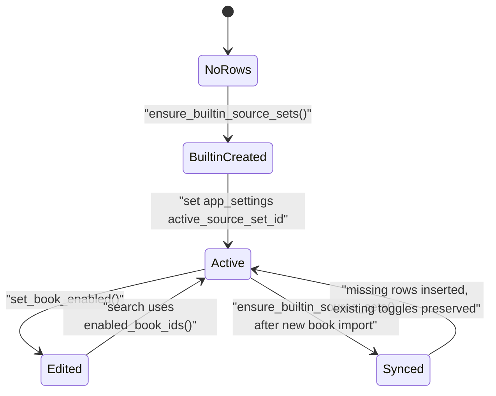
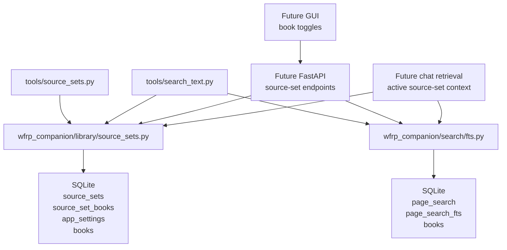

# Phase 3 Source Sets Implementation Plan

> **For agentic workers:** REQUIRED SUB-SKILL: Use superpowers:subagent-driven-development (recommended) or superpowers:executing-plans to implement this plan task-by-task. Steps use checkbox (`- [ ]`) syntax for tracking.

**Goal:** Implement app-owned source sets so WFRP Companion can enable or disable individual books for search, starting with an idempotent built-in `Rules/Core` source set.

**Architecture:** Keep SQLite as the source of truth. `source_sets` owns named sets, `source_set_books` owns per-book enablement, and `app_settings[key='active_source_set_id']` owns the default active set. Exact search keeps one global FTS index and applies source-set filtering at query time by resolving enabled book IDs before calling `search_exact()`.

**Tech Stack:** Python 3.12, Conda environment `wfrp-companion`, SQLite, SQLite FTS5, pytest, pytest-cov, ruff.

---

## 1. Source Boundary

This plan is based on the current live branch `codex/phase-3-source-sets`, created from merge commit `81df253` after PR #1 merged. The branch already contains the Phase 2 managed-PDF import, page-text import, and global FTS exact-search code.

Sources used as architectural input:

- `wfrp_companion/db/schema.sql`
- `wfrp_companion/search/fts.py`
- `tools/search_text.py`
- `tests/db/test_schema.py`
- `tests/search/test_fts.py`
- `tests/tools/test_search_text.py`
- `wiki/topics/target-architecture.md`
- `wiki/topics/implementation-standards.md`
- `wiki/topics/pdf-library-and-ingestion.md`
- `wiki/topics/local-tooling-and-packaging.md`
- `docs/adr/0001-conda-python-tooling.md`
- `docs/adr/0002-managed-local-pdf-storage.md`

Runtime observation used for rollout expectations only:

- Ignored local SQLite database `data/wfrp_companion.sqlite` currently has 26 books: 3 in `Core Book & GM Essentials`, 8 in `Rules and Mechanics Toolkits`, 6 in `World Guides and Faction Sourcebooks`, and 9 in `Adventure Modules and Campaigns`.

Sources intentionally excluded as architectural input:

- Older broad roadmap plan `docs/plans/2026-06-03-local-reference-library-implementation-plan.md`.
- Phase 2 execution plans except where the current wiki has already absorbed the resulting architecture.
- Any uncommitted local data files under ignored `data/`.
- Future API, GUI, OpenAI, vector-search, and PDF.js documentation, because this phase does not integrate those systems.

No Azure or other hosted systems are involved.

## 2. Current Live-Code Diagnosis

The live schema already has the core relational model needed for source sets:

- `source_sets`
- `source_set_books`
- `app_settings`
- `books.enabled_default`
- `chat_threads.active_source_set_id`
- `retrieval_runs.source_set_id`

The problem is ownership. There is no package code that owns `source_sets`, `source_set_books`, or `app_settings[key='active_source_set_id']`. The schema can represent per-book enablement, but the application cannot create, sync, list, activate, or mutate those rows.

Concrete live-code issues:

- `wfrp_companion/search/fts.py::search_exact()` accepts `book_ids: Collection[str] | None`, but callers must resolve that list themselves.
- `tools/search_text.py` supports `--book-id`, but otherwise performs whole-library search by passing `book_ids=None`.
- There is no built-in `Rules/Core` source set.
- There is no active source set, so future GUI and chat surfaces would need to infer search scope from ad hoc CLI flags or categories.
- `books.enabled_default` exists but is not the correct mutable source of truth. Using it now would split book enablement across `books` and `source_set_books`.
- `book_readiness.search_ready` correctly owns readiness, but it does not own user selection. Source-set filtering must be layered on top of readiness-gated search.
- There is no CLI to inspect or mutate per-book source-set membership before the API/GUI exists.

The current exact-search implementation already has the right lower-level behavior:

- `book_ids=None` means whole-library search.
- `book_ids=()` returns no hits.
- Non-empty `book_ids` filters search with bound parameters.
- Search still requires `books.copy_status='copied'`, `books.text_status='imported'`, and `books.search_status='indexed'`.

Phase 3 should preserve that contract and add a higher-level source-set resolver.

## 3. Architecture Decision

Recommended architecture:

- Create `wfrp_companion/library/source_sets.py` as the sole application owner for source-set rows, active-set settings, and per-book enablement.
- Create `tools/source_sets.py` as a local CLI for bootstrap, inspection, activation, and per-book toggles until an API/GUI exists.
- Update `tools/search_text.py` so default CLI search uses the active source set, with explicit escape hatches for `--all-books`, `--source-set`, and `--book-id`.
- Keep `wfrp_companion/search/fts.py::search_exact()` as the low-level exact-search primitive and continue passing explicit `book_ids`.

Why this fits the codebase:

- The schema already models source sets relationally.
- The search layer already supports exact query-time book filtering.
- A single global FTS projection is already built and verified. Rebuilding separate FTS indexes per source set would duplicate indexed text and complicate ranking.
- Existing local tooling is CLI-first and Conda-backed, so a source-set CLI matches `tools/import_pdfs.py`, `tools/import_page_text.py`, `tools/rebuild_fts.py`, and `tools/search_text.py`.

Alternatives to avoid:

- Do not create one FTS table per source set. It would add stale-index risk and unnecessary rebuild fan-out.
- Do not store mutable enablement in `books.enabled_default`. It is not source-set-specific.
- Do not infer `Rules/Core` search scope directly from `books.category` on every query. Categories should seed source-set rows, not replace explicit rows.
- Do not build frontend/API/OpenAI/chat behavior in this phase.
- Do not introduce an ORM or migration framework for this narrow local SQLite change.

## 4. Target State Model

This system does not need an async workflow state machine. It needs an explicit ownership lifecycle for source-set state.



Lifecycle rules:

- `source_sets.id='rules-core'` is stable and idempotent.
- `source_set_books` is the only per-book enablement source of truth.
- Built-in sync inserts missing relationship rows and preserves existing `enabled` values.
- Active source-set state is stored only in `app_settings[key='active_source_set_id']`.
- `enabled_book_ids()` returns an empty tuple when no books are enabled; search must return no hits in that case.

## 5. Target Architecture Diagram



## 6. Proposed Data Model / Contracts

No schema migration is required.

Existing persistence model:

`source_sets`

- `id text primary key`
- `name text not null unique`
- `description text`
- `is_builtin integer not null default 0`
- `created_at text not null`
- `updated_at text not null`

`source_set_books`

- `source_set_id text not null references source_sets(id) on delete cascade`
- `book_id text not null references books(id) on delete cascade`
- `enabled integer not null check(enabled in (0, 1))`
- `updated_at text not null`
- `primary key(source_set_id, book_id)`

`app_settings`

- `key text primary key`
- `value_json text not null`
- `updated_at text not null`

Steady-state constants:

```python
ACTIVE_SOURCE_SET_SETTING_KEY = "active_source_set_id"
RULES_CORE_SOURCE_SET_ID = "rules-core"
RULES_CORE_SOURCE_SET_NAME = "Rules/Core"
RULES_CORE_ENABLED_CATEGORIES = (
    "Core Book & GM Essentials",
    "Rules and Mechanics Toolkits",
)
```

New dataclasses:

```python
@dataclass(frozen=True)
class SourceSet:
    id: str
    name: str
    description: str | None
    is_builtin: bool


@dataclass(frozen=True)
class SourceSetBook:
    source_set_id: str
    book_id: str
    title: str
    category: str
    enabled: bool
    search_ready: bool


@dataclass(frozen=True)
class SourceSetSyncSummary:
    source_sets_created: int
    book_rows_inserted: int
    active_source_set_id: str
```

New module contract in `wfrp_companion/library/source_sets.py`:

```python
def ensure_builtin_source_sets(config: AppConfig) -> SourceSetSyncSummary: ...

def list_source_sets(config: AppConfig) -> tuple[SourceSet, ...]: ...

def list_source_set_books(
    config: AppConfig,
    source_set_id: str,
) -> tuple[SourceSetBook, ...]: ...

def get_active_source_set_id(config: AppConfig) -> str | None: ...

def set_active_source_set(config: AppConfig, source_set_id: str) -> None: ...

def enabled_book_ids(
    config: AppConfig,
    source_set_id: str | None = None,
) -> tuple[str, ...]: ...

def set_book_enabled(
    config: AppConfig,
    source_set_id: str,
    book_id: str,
    enabled: bool,
) -> None: ...

def default_enabled_for_source_set(source_set_id: str, category: str) -> bool: ...
```

Error contract:

```python
class SourceSetError(Exception):
    pass


class SourceSetNotFoundError(SourceSetError):
    pass


class BookNotFoundError(SourceSetError):
    pass


class ActiveSourceSetMissingError(SourceSetError):
    pass


class SourceSetConflictError(SourceSetError):
    pass
```

Default `Rules/Core` enablement:

- Enable books with category `Core Book & GM Essentials`.
- Enable books with category `Rules and Mechanics Toolkits`.
- Disable books with any other category.
- Insert rows for every book, not only enabled books, so the GUI can show complete per-book toggles.
- Preserve existing `source_set_books.enabled` values during resync.
- If `source_sets.id='rules-core'` already exists with `is_builtin=0` or a different `name`, raise `SourceSetConflictError` rather than overwriting user-owned data.
- If another source set already uses `name='Rules/Core'` with a different `id`, raise `SourceSetConflictError` because `source_sets.name` is unique.
- Missing relationship rows use `default_enabled_for_source_set(source_set_id, category)`: `rules-core` applies the category rule above; every other existing source set defaults new relationship rows to disabled.

Immutable snapshot data:

- `books.id`, `books.category`, and `books.title` are book identity/metadata inputs to source-set display and default seeding.

Live workflow state:

- `source_set_books.enabled`
- `app_settings[key='active_source_set_id']`

Explicit relationship data:

- `source_set_books(source_set_id, book_id)`

## 7. External Integration Design

There are no external systems in Phase 3.

SQLite boundary:

- SQLite is local app-owned persistence.
- Reads: `books`, `book_readiness`, `source_sets`, `source_set_books`, `app_settings`.
- Writes: `source_sets`, `source_set_books`, `app_settings`.
- No writes to PDFs, OCR JSON, FTS projections, OpenAI, GitHub, Azure, or hosted storage.

Idempotency:

- `ensure_builtin_source_sets()` is safe to rerun.
- Source-set row uses stable primary key `rules-core`.
- Missing relationship rows are inserted with `where not exists`.
- Existing relationship rows are not overwritten.
- Active source set is set only if no valid active source-set setting exists.

Retry behavior:

- If SQLite is locked or unavailable, the CLI exits nonzero and can be rerun.
- Because bootstrap writes are transactional, a failed run leaves either no partial transaction or a fully consistent committed state.

Success:

- `source_sets` contains `rules-core`.
- Every `books.id` has a `source_set_books` row for `rules-core`.
- `app_settings[key='active_source_set_id']` points to `rules-core` unless the user already selected a valid source set.

Failure:

- Missing source set during activation raises `SourceSetNotFoundError`.
- Missing book during toggle raises `BookNotFoundError`.
- Missing active source set during default search raises `ActiveSourceSetMissingError`.

## 8. Core Flow Design

### Built-In Source-Set Bootstrap Flow

1. CLI or future API calls `ensure_builtin_source_sets(config)`.
2. Open DB through `initialize_database(config.db_path)`.
3. Start a single transaction.
4. Check for source-set conflicts before writes:
   - `id='rules-core'` with `is_builtin=0` is a collision.
   - `id='rules-core'` with `name != 'Rules/Core'` is a collision.
   - `name='Rules/Core'` with `id != 'rules-core'` is a collision.
5. Insert or update `source_sets(id='rules-core')` only after those checks pass.
6. Insert missing `source_set_books` rows for every existing book.
7. If `app_settings[key='active_source_set_id']` is absent or points at a missing source set, write `"rules-core"`.
8. Commit.
9. Return inserted counts and active source-set id.

SQL shape:

```sql
select id, name, is_builtin
from source_sets
where id = 'rules-core'
   or name = 'Rules/Core';
```

```sql
insert into source_sets (
  id,
  name,
  description,
  is_builtin,
  created_at,
  updated_at
)
values (
  'rules-core',
  'Rules/Core',
  'Core rules, GM essentials, and rules/mechanics toolkit books.',
  1,
  :now,
  :now
)
on conflict(id) do update set
  name = excluded.name,
  description = excluded.description,
  is_builtin = 1,
  updated_at = excluded.updated_at;
```

```sql
insert into source_set_books (
  source_set_id,
  book_id,
  enabled,
  updated_at
)
select
  'rules-core',
  books.id,
  case
    when books.category in (
      'Core Book & GM Essentials',
      'Rules and Mechanics Toolkits'
    )
    then 1
    else 0
  end,
  :now
from books
where not exists (
  select 1
  from source_set_books
  where source_set_books.source_set_id = 'rules-core'
    and source_set_books.book_id = books.id
);
```

### Toggle Flow

1. Validate source set exists.
2. Validate book exists.
3. Ensure relationship row exists. If missing, insert it with `default_enabled_for_source_set(source_set_id, books.category)`.
4. Update `source_set_books.enabled`.
5. Commit.

Guarded update:

```sql
update source_set_books
set enabled = :enabled,
    updated_at = :now
where source_set_id = :source_set_id
  and book_id = :book_id;
```

### Active Source-Set Flow

1. `set_active_source_set(config, source_set_id)` validates the set exists.
2. Store JSON string in `app_settings.value_json`.
3. `get_active_source_set_id(config)` parses `value_json`.
4. If the active setting is malformed or points to a missing source set, return `None` and let CLI show a repair message.
5. `enabled_book_ids(config)` raises `ActiveSourceSetMissingError` when no explicit source set is passed and there is no valid active source set.

SQL shape:

```sql
insert into app_settings (key, value_json, updated_at)
values ('active_source_set_id', json_quote(:source_set_id), :now)
on conflict(key) do update set
  value_json = excluded.value_json,
  updated_at = excluded.updated_at;
```

### Source-Set Search Flow

1. `tools/search_text.py` parses scope flags.
2. If `--all-books` is set, pass `book_ids=None`.
3. If `--book-id` is provided, pass explicit `tuple(args.book_id)`.
4. If `--source-set` is provided, call `enabled_book_ids(config, source_set_id)`.
5. If no scope flag is provided, call `enabled_book_ids(config)` using active source set.
6. Pass resolved `book_ids` to `search_exact()`.
7. If the tuple is empty, `search_exact()` returns no hits.

Argument conflict rules:

- `--all-books` cannot be combined with `--source-set`.
- `--all-books` cannot be combined with `--book-id`.
- `--source-set` cannot be combined with `--book-id`.

## 9. UX / Surface Behavior

Phase 3 user-facing surfaces are CLI only.

`tools/source_sets.py` commands:

```bash
python tools/source_sets.py init
python tools/source_sets.py list
python tools/source_sets.py books --source-set rules-core
python tools/source_sets.py activate rules-core
python tools/source_sets.py enable rules-core core-book-gm-essentials-warhammer-fantasy-roleplay-2nd-edition-core-rules
python tools/source_sets.py disable rules-core adventure-modules-and-campaigns-the-thousand-thrones
```

Common CLI flags:

- `--data-dir PATH`
- `--db-path PATH`

These flags must be accepted before the subcommand, matching the local tooling style:

```bash
python tools/source_sets.py --data-dir /path/to/private-data init
python tools/source_sets.py --db-path /path/to/wfrp.sqlite list
```

Output contract:

`init` writes to stdout:

```text
WFRP source sets
DB path: <absolute-or-relative-db-path>
Created source sets: <count>
Inserted book rows: <count>
Active source set: rules-core
```

`list` writes one line per source set to stdout:

```text
rules-core | Rules/Core | builtin=1
```

`books --source-set rules-core` writes one line per book to stdout:

```text
enabled=1 | search_ready=1 | core-book-gm-essentials-warhammer-fantasy-roleplay-2nd-edition-core-rules | Warhammer Fantasy Roleplay 2nd Edition Core Rules | Core Book & GM Essentials
enabled=0 | search_ready=1 | adventure-modules-and-campaigns-the-thousand-thrones | The Thousand Thrones | Adventure Modules and Campaigns
```

`activate`, `enable`, and `disable` write one confirmation line to stdout:

```text
Active source set: rules-core
Enabled book: <book_id> in rules-core
Disabled book: <book_id> in rules-core
```

Error contract:

- Missing source set writes `Source set not found: <source_set_id>` to stderr and exits `1`.
- Missing book writes `Book not found: <book_id>` to stderr and exits `1`.
- Source-set conflict writes the `SourceSetConflictError` message to stderr and exits `1`.

`tests/tools/test_source_sets.py` must include a script-path execution test using `subprocess.run([sys.executable, script_path, ...])`, matching the existing tool test pattern.

`tools/search_text.py` behavior:

| State or Flag | Behavior |
| --- | --- |
| no scope flags and active source set exists | Search enabled books in the active source set. |
| no scope flags and no active source set exists | Exit nonzero with a message to run `tools/source_sets.py init` or use `--all-books`. |
| `--all-books` | Whole-library search using `book_ids=None`. |
| `--source-set rules-core` | Search enabled books in that source set. |
| `--book-id ID` | Search exactly the listed book IDs. |
| active source set has zero enabled books | Print zero hits; do not fall back to whole-library search. |
| disabled book contains matching text | It must not appear in source-set search. |

CLI output should avoid printing private extracted text beyond existing FTS snippets.

Future API/GUI behavior prepared by this phase:

- Library view can list every book with active-source-set `enabled` state.
- Toggle controls write `source_set_books.enabled`.
- Search/chat can use active source-set filtering without duplicating selection logic.

## 10. Implementation Sequence

This is one PR-sized phase.

### Task 1: Source-Set Module Tests And Bootstrap

**Files:**

- Create: `tests/library/test_source_sets.py`
- Create: `wfrp_companion/library/source_sets.py`

- [ ] Write tests that seed synthetic `books` rows across the four current categories and assert `ensure_builtin_source_sets()` creates `rules-core`.
- [ ] Assert every book receives a `source_set_books` row.
- [ ] Assert categories `Core Book & GM Essentials` and `Rules and Mechanics Toolkits` default to enabled.
- [ ] Assert `Adventure Modules and Campaigns` and `World Guides and Faction Sourcebooks` default to disabled.
- [ ] Run:

```bash
conda run -n wfrp-companion python -m pytest tests/library/test_source_sets.py -v
```

Expected before implementation: import or attribute failure.

- [ ] Implement constants, dataclasses, `SourceSetError` subclasses, `utc_timestamp()`, and `ensure_builtin_source_sets()`.
- [ ] Run the same focused test and make it pass.

### Task 2: Active Source-Set And Toggle Semantics

**Files:**

- Modify: `tests/library/test_source_sets.py`
- Modify: `wfrp_companion/library/source_sets.py`

- [ ] Add tests for `get_active_source_set_id()` returning `rules-core` after bootstrap.
- [ ] Add tests for `set_active_source_set()` rejecting a missing source set.
- [ ] Add tests for `set_book_enabled()` rejecting missing source set and missing book.
- [ ] Add tests for `SourceSetConflictError` when `id='rules-core'` exists as user-owned data.
- [ ] Add tests for `SourceSetConflictError` when `name='Rules/Core'` exists on a different id.
- [ ] Add tests for malformed `app_settings.value_json` returning no active source set.
- [ ] Add tests for active source-set setting pointing to a deleted source set returning no active source set.
- [ ] Add tests for `enabled_book_ids(config, source_set_id='missing')` raising `SourceSetNotFoundError`.
- [ ] Add tests for a valid source set with zero enabled rows returning `()`.
- [ ] Add tests proving manual toggles survive a second `ensure_builtin_source_sets()` call.
- [ ] Add tests proving a newly imported book gets a missing relationship row on resync without changing existing toggles.
- [ ] Implement `list_source_sets()`, `list_source_set_books()`, `get_active_source_set_id()`, `set_active_source_set()`, `enabled_book_ids()`, `set_book_enabled()`, and `default_enabled_for_source_set()`.
- [ ] Run:

```bash
conda run -n wfrp-companion python -m pytest tests/library/test_source_sets.py -v
```

Expected after implementation: all source-set tests pass.

### Task 3: Source-Set CLI

**Files:**

- Create: `tools/source_sets.py`
- Create: `tests/tools/test_source_sets.py`

- [ ] Add CLI tests for `init`, `list`, `books --source-set rules-core`, `activate`, `enable`, and `disable`.
- [ ] Add CLI tests for missing source set and missing book returning exit code `1`.
- [ ] Add CLI tests asserting the exact stdout/stderr contracts listed in Section 9.
- [ ] Add a subprocess script-path execution test for `tools/source_sets.py`.
- [ ] Implement `tools/source_sets.py` with the same `config_from_args()` pattern used by existing tools.
- [ ] Run:

```bash
conda run -n wfrp-companion python -m pytest tests/tools/test_source_sets.py -v
```

Expected after implementation: CLI tests pass.

### Task 4: Source-Set-Aware Search CLI

**Files:**

- Modify: `tools/search_text.py`
- Modify: `tests/tools/test_search_text.py`
- Modify: `tests/search/test_fts.py` only if a reusable source-set search helper belongs in `wfrp_companion/search/fts.py`.

- [ ] Add tests showing default `tools/search_text.py` resolves active source-set enabled book IDs.
- [ ] Add tests showing `--all-books` preserves old whole-library behavior.
- [ ] Add tests showing `--source-set rules-core` filters disabled books.
- [ ] Add tests showing `--book-id` still works.
- [ ] Add tests showing incompatible scope flags fail through argparse.
- [ ] Add tests showing missing or malformed active source-set settings exit nonzero with a repair instruction.
- [ ] Add tests showing an active source set with no enabled books prints zero hits rather than falling back to whole-library search.
- [ ] Implement scope resolution in `tools/search_text.py`.
- [ ] Run:

```bash
conda run -n wfrp-companion python -m pytest tests/tools/test_search_text.py tests/search/test_fts.py -v
```

Expected after implementation: all focused search tests pass.

### Task 5: Full Verification And Wiki Update

**Files:**

- Modify: `wiki/topics/target-architecture.md`
- Modify: `wiki/topics/local-tooling-and-packaging.md`
- Modify: `wiki/topics/pdf-library-and-ingestion.md`
- Modify: `wiki/topics/implementation-standards.md`
- Modify: `wiki/topics/testing-posture-and-conventions.md`
- Modify: `wiki/log.md`

- [ ] Run the full coverage gate:

```bash
conda run -n wfrp-companion python -m pytest \
  --cov=wfrp_companion \
  --cov=tools.init_db \
  --cov=tools.import_pdfs \
  --cov=tools.import_page_text \
  --cov=tools.rebuild_fts \
  --cov=tools.search_text \
  --cov=tools.source_sets \
  --cov-report=term-missing \
  --cov-fail-under=100
```

- [ ] Run lint:

```bash
conda run -n wfrp-companion ruff check .
```

- [ ] Run local smoke against ignored app data:

```bash
conda run -n wfrp-companion python tools/source_sets.py init
conda run -n wfrp-companion python tools/source_sets.py list
conda run -n wfrp-companion python tools/source_sets.py books --source-set rules-core
conda run -n wfrp-companion python tools/search_text.py "critical hit"
conda run -n wfrp-companion python tools/search_text.py "critical hit" --all-books
```

- [ ] Update wiki topics with the source-set source of truth, CLI commands, default `Rules/Core` categories, and test command.
- [ ] Confirm private generated data remains ignored:

```bash
git status --short --ignored data
```

Expected: `data/` appears ignored and is not staged.

## 11. Testing Requirements

Testing is required in the same PR as behavior changes.

Minimum categories:

- Source-set bootstrap tests.
- Active source-set setting tests.
- Per-book enable/disable mutation tests.
- Resync/idempotency tests.
- Search filtering tests.
- CLI tests for `tools/source_sets.py`.
- CLI tests for source-set-aware `tools/search_text.py`.
- Full coverage across the package and all tracked tool entrypoints.

The full coverage command must include `--cov=tools.source_sets`. The expected coverage remains 100%.

Use synthetic test text only. Do not commit WFRP book text.

## 12. Verification Matrix

| Scenario | Expected Result |
| --- | --- |
| Fresh DB with books but no source sets | `tools/source_sets.py init` creates `rules-core` and active setting. |
| Existing `rules-core` rerun | No duplicate rows; existing toggles preserved. |
| Existing user-owned `rules-core` row | Bootstrap exits with source-set conflict. |
| Existing `Rules/Core` name on another id | Bootstrap exits with source-set conflict. |
| Current real local 26-book library | 26 `source_set_books` rows for `rules-core`. |
| Current real local categories | 11 default enabled rows and 15 default disabled rows. |
| Manual disable Core Rules then rerun init | Core Rules remains disabled. |
| New book imported after source-set init | Rerun init inserts one missing relationship row. |
| Search default with active `rules-core` | Results only come from enabled books. |
| Search with `--all-books` | Results may come from any search-ready book. |
| Search with `--source-set rules-core` | Results match enabled books in `rules-core`. |
| Search with `--book-id X` | Existing explicit book filter still works. |
| Empty enabled source set | Search returns zero hits, not whole-library results. |
| Missing active source set | Search exits nonzero with repair instruction. |
| Malformed active source-set setting | Search exits nonzero with repair instruction. |
| Active setting points to deleted source set | Search exits nonzero with repair instruction. |
| Missing source set in CLI | Exit code `1`, clear error. |
| Missing book in CLI toggle | Exit code `1`, clear error. |
| Full tests | 100% coverage. |
| Lint | `ruff check .` passes. |
| Git status | No private PDFs, OCR JSON, SQLite DBs, or generated indexes staged. |

## 13. Migration / Compatibility / Cleanup Strategy

No schema migration is required.

Compatibility scaffolding:

- `tools/source_sets.py init` is the idempotent local backfill for existing databases.
- `tools/search_text.py --all-books` preserves the pre-source-set whole-library behavior.
- `tools/search_text.py --book-id` preserves manual book filtering.

How long scaffolding lives:

- `--all-books` should remain as an explicit diagnostic/admin option.
- `tools/source_sets.py` remains useful until the API/GUI owns these operations.

Cleanup not included:

- Do not remove `books.enabled_default`.
- Do not alter existing `chat_threads.active_source_set_id` or `retrieval_runs.source_set_id`.
- Do not change FTS schema.

Backfill cases:

- Safe: known categories seed enabled/disabled rows.
- Safe: existing relationship rows are preserved.
- Ambiguous: unknown category defaults disabled.
- Manual review: a user may enable unknown-category books through CLI.

## 14. Operational Rollout Notes

Local rollout order after merge:

1. Pull the Phase 3 branch.
2. Run tests and lint.
3. Run:

```bash
conda run -n wfrp-companion python tools/source_sets.py init
```

4. Inspect source sets:

```bash
conda run -n wfrp-companion python tools/source_sets.py list
conda run -n wfrp-companion python tools/source_sets.py books --source-set rules-core
```

5. Smoke search:

```bash
conda run -n wfrp-companion python tools/search_text.py "critical hit"
conda run -n wfrp-companion python tools/search_text.py "critical hit" --all-books
```

No feature flags, migrations, hosted services, firewall changes, Azure resources, or outbox workers are needed.

## 15. ADR / Platform Alignment

This plan aligns with:

- ADR 0001: Python commands continue to run through Conda.
- ADR 0002: PDFs and derived text remain local and private.
- Current SQLite source-of-truth direction in `wiki/topics/target-architecture.md`.
- Exact-search-first retrieval direction in `wiki/concepts/hybrid-search-for-rules.md`.

No new ADR is required for Phase 3 because the schema and local-first persistence decision already exist. A future ADR may be useful if source-set presets become a broader product policy beyond `Rules/Core`.

Known tension:

- `books.enabled_default` exists, but Phase 3 deliberately does not use it for mutable state. `source_set_books.enabled` is the steady-state source of truth.

Transitional compromise:

- The CLI is a temporary user/admin surface. The module and database model are steady-state and should be reused by future API/GUI work.

## 16. Non-Goals / Guardrails / Open Questions

Non-goals:

- No FastAPI endpoints.
- No React/Vite GUI.
- No PDF.js reader.
- No OpenAI or chat agent.
- No vector embeddings.
- No visual asset extraction.
- No per-source-set FTS indexes.
- No schema migration.
- No copyrighted text fixtures.

Guardrails:

- `source_set_books.enabled` is the only per-source-set book enablement owner.
- Empty enabled book lists must produce zero search results.
- Built-in source-set sync must not overwrite user toggles.
- Whole-library search must require explicit `--all-books` once source-set-aware search is in place.
- Source-set CLI output should not print large extracted text.
- All tests must use synthetic text.

Open questions:

- Future built-in presets beyond `Rules/Core` are not decided in this phase.
- Future GUI wording for source sets is not decided in this phase.
- Whether `books.enabled_default` should be removed or repurposed is deferred until API/GUI ownership is clearer.

## Self-Review

Spec coverage:

- The plan defines the system name, codebase, modules, external systems, pain points, and runtime constraints.
- It uses current live code, current wiki, and ADRs as source input.
- It defines SQLite as the single source of truth.
- It separates steady-state module/database behavior from temporary CLI scaffolding.
- It names concrete files, tables, fields, functions, commands, and tests.
- It handles concurrency through SQLite transactions and idempotent inserts.
- It maps state to current CLI and future GUI/search behavior.
- It gives PR-sized implementation tasks and verification commands.

Placeholder scan:

- No unresolved placeholders are intentionally left in this plan.

Type consistency:

- Function names, constants, dataclasses, and CLI flags are consistent across the plan.
