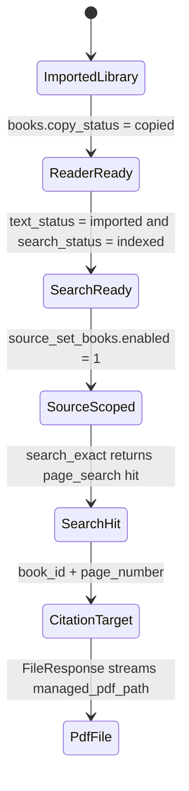
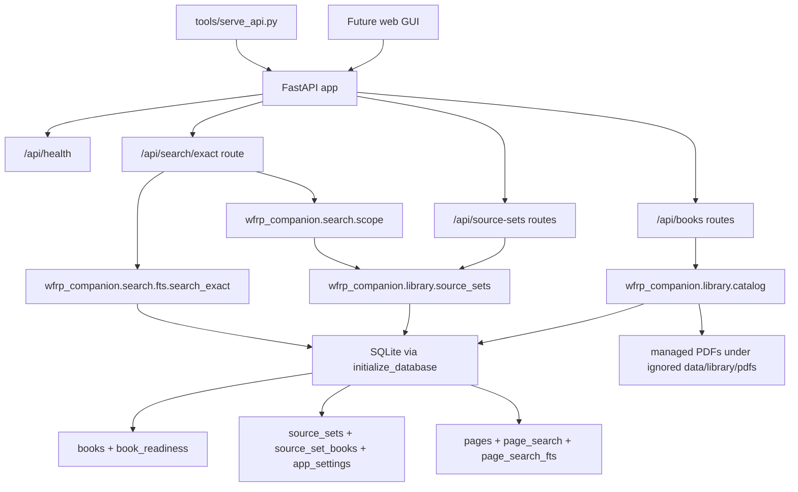

# Phase 4 Local Backend API Implementation Plan

> **For agentic workers:** REQUIRED SUB-SKILL: Use
> `superpowers:subagent-driven-development` (recommended) or
> `superpowers:executing-plans` to implement this plan task-by-task. Steps use
> checkbox (`- [ ]`) syntax for tracking.

**Goal:** Build the local FastAPI backend API that exposes the existing WFRP
Companion SQLite library, source-set, exact-search, page-reference, and managed
PDF reader surfaces to the future GUI.

**Architecture:** Keep SQLite and existing package services as the app-owned
source of truth. Add a small FastAPI app factory under `wfrp_companion/api/`,
thin route modules, reusable library read-model helpers, and a reusable search
scope helper shared by the API and `tools/search_text.py`.

**Tech Stack:** Python 3.12, Conda environment `wfrp-companion`, FastAPI,
Starlette `FileResponse`, Uvicorn, SQLite, pytest, pytest-cov, ruff.

---

## 1. Source Boundary

This plan is based on the current live repository state after PR #2 was merged
into `codex/phase-1-db-foundation`:

- `wfrp_companion/config.py`
- `wfrp_companion/db/connection.py`
- `wfrp_companion/db/schema.sql`
- `wfrp_companion/library/source_sets.py`
- `wfrp_companion/search/fts.py`
- `tools/search_text.py`
- `tools/source_sets.py`
- Current wiki pages:
  - `wiki/topics/target-architecture.md`
  - `wiki/topics/local-tooling-and-packaging.md`
  - `wiki/topics/testing-posture-and-conventions.md`
  - `wiki/topics/implementation-standards.md`
  - `wiki/topics/pdf-library-and-ingestion.md`
- ADRs:
  - `docs/adr/0001-conda-python-tooling.md`
  - `docs/adr/0002-managed-local-pdf-storage.md`
- Official/current framework docs queried through Context7 on 2026-06-04:
  - FastAPI `/fastapi/fastapi` docs for `APIRouter`, `include_router`,
    `Depends`, and `TestClient`.
  - Starlette `/kludex/starlette` docs for `FileResponse`, including automatic
    `Content-Length`, `Last-Modified`, `ETag`, and HTTP range request support
    with `206 Partial Content` / `416 Range Not Satisfiable`.
- Current local Conda environment versions observed on 2026-06-04:
  - `fastapi=0.136.3`
  - `starlette=1.2.1`

Intentionally excluded as architectural input:

- Older implementation plans that are not reflected in current live code or the
  current wiki.
- Any hosted/cloud architecture. Phase 4 is pure local.
- Future AI chat/RAG planning docs. Phase 4 creates the API boundary needed
  before AI endpoints.

## 2. Current Live-Code Diagnosis

The repo has a working local data pipeline but no HTTP/backend API boundary.

Concrete current implementation:

- `wfrp_companion/db/schema.sql` owns the SQLite schema for:
  - `books`
  - `pages`
  - `page_text`
  - `page_search`
  - `page_search_fts`
  - `source_sets`
  - `source_set_books`
  - `app_settings`
  - `book_readiness`
  - future `chat_threads`, `chat_messages`, `retrieval_runs`, and
    `retrieval_hits`
- `wfrp_companion/library/source_sets.py` owns source-set state and per-book
  membership:
  - `ensure_builtin_source_sets(config)`
  - `list_source_sets(config)`
  - `list_source_set_books(config, source_set_id)`
  - `get_active_source_set_id(config)`
  - `set_active_source_set(config, source_set_id)`
  - `enabled_book_ids(config, source_set_id=None)`
  - `set_book_enabled(config, source_set_id, book_id, enabled)`
- `wfrp_companion/search/fts.py` owns exact search and readiness-gated query
  results:
  - `search_exact(config, query, book_ids=None, limit=20)`
  - It only returns hits for books where `copy_status='copied'`,
    `text_status='imported'`, and `search_status='indexed'`.
- `tools/search_text.py` owns CLI-only search-scope parsing and resolution:
  - `--all-books`
  - `--source-set`
  - `--book-id`
  - default active source set
- `tools/source_sets.py` owns CLI-only source-set management.

Problems to solve:

- The future GUI has no API surface for library lists, source-set toggles,
  search results, page references, or PDF serving.
- Search-scope resolution exists only in `tools/search_text.py`. If the API
  copies it directly, CLI and API behavior can drift.
- There is no reusable read model for `books` joined to `book_readiness`; API
  routes would otherwise duplicate SQL ad hoc.
- Managed PDFs are tracked in `books.managed_pdf_path`, but there is no safe
  local reader endpoint.
- There is no standardized HTTP error mapping for:
  - missing book
  - explicit unknown search `book_id`
  - missing page
  - missing source set
  - missing active source set
  - reader-not-ready book
  - managed PDF file missing on disk
  - managed PDF path outside the app-owned managed PDF directory
  - conflicting search scope parameters
- There are no FastAPI route tests or route contracts.
- OpenAPI exists only as a future property of FastAPI; there is no smoke test
  that the main route paths are present.

Ownership that must not become fragile:

- Do not infer readiness in the frontend or API from source-set enablement.
- Do not create a second active source-set field outside
  `app_settings.active_source_set_id`.
- Do not expose raw `page_text.text` or large extracted WFRP text through API
  endpoints in this phase.
- Do not expose absolute private filesystem paths in JSON responses.
- Do not serve arbitrary filesystem paths from `books.managed_pdf_path`; a
  corrupt database row must not turn the local API into a general file server.

## 3. Architecture Decision

Implement a local FastAPI backend inside the existing Python package:

- Create `wfrp_companion/api/` for API app factory, schemas, dependencies,
  errors, and route modules.
- Create `wfrp_companion/library/catalog.py` for reusable SQLite read models
  over `books`, `book_readiness`, and `pages`.
- Create `wfrp_companion/search/scope.py` for reusable search-scope validation
  and book-id resolution, then update `tools/search_text.py` to use it.
- Add `tools/serve_api.py` as the local Uvicorn entrypoint.

Why this is right for this repo:

- The repo already uses Python, Conda, FastAPI, Uvicorn, SQLite, and pytest.
- Existing services are synchronous SQLite helpers; FastAPI can call them from
  normal route functions without introducing async DB infrastructure.
- `create_app(config)` gives tests isolated temporary SQLite databases without
  env var mutation.
- Starlette `FileResponse` already supports range requests, so PDF serving can
  stay boring and browser/PDF.js-friendly.
- Extracting `catalog.py` and `scope.py` avoids duplicated SQL/scope logic
  between CLI and API.

Approaches to avoid:

- Do not build a separate API database or ORM layer. SQLite tables already own
  the state and the current code uses direct SQL with `sqlite3.Row`.
- Do not start with an API gateway, plugin framework, Celery worker, or hosted
  auth stack.
- Do not write custom byte-range streaming for PDFs unless `FileResponse`
  proves insufficient in browser QA.
- Do not generate a frontend client package in this phase.
- Do not add OpenAPI snapshot files yet; add route-contract tests and one
  lightweight `/openapi.json` smoke test instead.

## 4. Target State Model

Phase 4 does not create a new workflow state machine. It exposes existing
stateful tables and derived views through explicit API contracts.

Lifecycle and ownership model:



Source-of-truth boundaries:

- `books.copy_status`, `books.text_status`, `books.search_status`, and
  `books.visual_status` are live lifecycle state.
- `book_readiness` is the derived readiness read model.
- `source_sets` and `source_set_books` are explicit source-set state.
- `app_settings.active_source_set_id` is the default search/retrieval scope.
- `page_search` and `page_search_fts` are rebuildable exact-search projections.
- Managed PDFs on disk are immutable-ish local file artifacts referenced by
  `books.managed_pdf_path`.

## 5. Target Architecture Diagram



## 6. Proposed Data Model / Contracts

No schema migration is required.

### New Package Contracts

Create `wfrp_companion/library/catalog.py`.

Dataclasses:

```python
@dataclass(frozen=True)
class BookSummary:
    id: str
    title: str
    category: str
    relative_path: str
    page_count: int
    copy_status: str
    text_status: str
    search_status: str
    visual_status: str
    reader_ready: bool
    search_ready: bool
    fully_ready: bool
    needs_attention: bool

@dataclass(frozen=True)
class BookDetail(BookSummary):
    managed_pdf_available: bool

@dataclass(frozen=True)
class PageReference:
    page_id: str
    book_id: str
    page_number: int
    page_label: str | None
    has_text: bool
    text_chars: int
    image_count: int
```

Functions:

- `list_books(config: AppConfig) -> tuple[BookSummary, ...]`
- `get_book(config: AppConfig, book_id: str) -> BookDetail`
- `get_page(config: AppConfig, book_id: str, page_number: int) -> PageReference`
- `reader_pdf_path(config: AppConfig, book_id: str) -> Path`

Exceptions:

- `CatalogError`
- `BookNotFoundError`
- `PageNotFoundError`
- `ReaderUnavailableError`
- `ManagedPdfMissingError`
- `ManagedPdfPathRejectedError`

`reader_pdf_path` containment rules:

- Resolve `managed_root = (config.data_dir / "library" / "pdfs").resolve()`.
- Resolve `expected_book_root = (managed_root / book_id).resolve()`.
- Resolve the DB path from `books.managed_pdf_path`.
- Require the resolved DB path to be inside `expected_book_root`.
- Require the resolved path suffix to be `.pdf`.
- Require the resolved path to exist and be a file.
- Reject symlinks that resolve outside the managed root because the containment
  check uses resolved paths.

Create `wfrp_companion/search/scope.py`.

Dataclasses:

```python
@dataclass(frozen=True)
class ResolvedSearchScope:
    label: str
    source_set_id: str | None
    book_ids: tuple[str, ...] | None
    all_books: bool
```

Functions:

- `resolve_search_scope(config, all_books=False, source_set_id=None,
  book_ids=None, validate_book_ids=False)`

Exceptions:

- `SearchScopeError`
- `SearchScopeConflictError`
- `SearchBookNotFoundError`

Resolution rules:

- `all_books=True` returns `book_ids=None` and label `all_books`.
- `book_ids` returns exactly those ids and label `book_id`.
- `source_set_id` returns `source_sets.enabled_book_ids(config, source_set_id)`
  and label `source_set`.
- no scope args returns `source_sets.enabled_book_ids(config)` and label
  `active_source_set`.
- `all_books`, `source_set_id`, and `book_ids` are mutually exclusive.
- When `validate_book_ids=True`, explicit `book_ids` are checked against
  `books.id`; missing ids raise `SearchBookNotFoundError`.
- `tools/search_text.py` calls `resolve_search_scope(...,
  validate_book_ids=False)` to preserve current CLI behavior where an unknown
  explicit `--book-id` simply returns zero hits.
- The API search route calls `resolve_search_scope(..., validate_book_ids=True)`
  so unknown explicit `book_id` query parameters return `404`.

### API Routes

`GET /api/health`

Response:

```json
{
  "status": "ok",
  "database": "configured"
}
```

Do not include `db_path` in the health response. `WFRP_DB_PATH` may be an
absolute private path, and the API JSON surface should not leak private
filesystem locations.

`GET /api/books`

Returns:

```json
{
  "books": [
    {
      "id": "core-book-gm-essentials-warhammer-fantasy-roleplay-2nd-edition-core-rules",
      "title": "Warhammer Fantasy Roleplay 2nd Edition Core Rules",
      "category": "Core Book & GM Essentials",
      "relative_path": "Core Book & GM Essentials/Warhammer Fantasy Roleplay 2nd Edition Core Rules.pdf",
      "page_count": 256,
      "copy_status": "copied",
      "text_status": "imported",
      "search_status": "indexed",
      "visual_status": "not_scanned",
      "reader_ready": true,
      "search_ready": true,
      "fully_ready": false,
      "needs_attention": false
    }
  ]
}
```

`GET /api/books/{book_id}`

Returns one book object plus `managed_pdf_available`. Do not include
`managed_pdf_path` in JSON.

`GET /api/books/{book_id}/pages/{page_number}`

Returns:

```json
{
  "page_id": "core-rules:134",
  "book_id": "core-rules",
  "page_number": 134,
  "page_label": null,
  "has_text": true,
  "text_chars": 1234,
  "image_count": 0
}
```

`GET /api/books/{book_id}/pdf`

Returns a Starlette/FastAPI `FileResponse`:

- `media_type="application/pdf"`
- `content_disposition_type="inline"`
- filename should use the book title when practical.

Expected behavior:

- `200 OK` for normal full-file responses.
- `206 Partial Content` for valid HTTP `Range` headers.
- `416 Range Not Satisfiable` for invalid ranges, as provided by
  Starlette `FileResponse`.
- `404` when `book_id` is unknown.
- `409` when the book is not reader-ready.
- `409` when SQLite points to a managed file that is missing on disk.
- `409` when SQLite points outside
  `<data-dir>/library/pdfs/<book_id>/*.pdf`.

`GET /api/source-sets`

Returns:

```json
{
  "active_source_set_id": "rules-core",
  "source_sets": [
    {
      "id": "rules-core",
      "name": "Rules/Core",
      "description": "Core rules, GM essentials, and rules/mechanics toolkit books.",
      "is_builtin": true,
      "active": true
    }
  ]
}
```

`GET /api/source-sets/active`

Returns:

```json
{
  "source_set_id": "rules-core"
}
```

If `app_settings.active_source_set_id` is missing, malformed, or references a
deleted source set, return `409` with a setup/repair message. `GET
/api/source-sets` may return `active_source_set_id: null` for overview
purposes, but the explicit active-source-set endpoint should fail because the
requested singleton state is not valid.

`PUT /api/source-sets/active`

Body:

```json
{
  "source_set_id": "rules-core"
}
```

Returns the same active-source-set response.

`GET /api/source-sets/{source_set_id}/books`

Returns:

```json
{
  "source_set_id": "rules-core",
  "books": [
    {
      "source_set_id": "rules-core",
      "book_id": "core-rules",
      "title": "Core Rules",
      "category": "Core Book & GM Essentials",
      "enabled": true,
      "search_ready": true
    }
  ]
}
```

`PUT /api/source-sets/{source_set_id}/books/{book_id}`

Body:

```json
{
  "enabled": true
}
```

Returns the updated source-set book object.

`GET /api/search/exact`

Query params:

- `query`: required string.
- `limit`: optional integer, default `20`, minimum `1`, maximum `100`.
- `source_set_id`: optional string.
- `book_id`: optional repeatable string.
- `all_books`: optional boolean, default `false`.

Response:

```json
{
  "query": "critical hit",
  "scope": {
    "label": "active_source_set",
    "source_set_id": "rules-core",
    "book_ids": ["core-rules"],
    "all_books": false
  },
  "hits": [
    {
      "rank": 1,
      "book_id": "core-rules",
      "title": "Core Rules",
      "category": "Core Book & GM Essentials",
      "page_id": "core-rules:134",
      "page_number": 134,
      "snippet": "...[Critical] [Hit]...",
      "score": -1.234
    }
  ]
}
```

## 7. External Integration Design

There are no external data systems in Phase 4.

FastAPI/Starlette/Uvicorn are local framework/runtime dependencies:

- Source of truth remains SQLite plus local managed PDF files.
- The API binds to `127.0.0.1` by default.
- No OpenAI calls.
- No Azure.
- No hosted database.
- No auth provider.
- No background queue.

Framework behavior to rely on:

- FastAPI `APIRouter` modules are included into the app with `app.include_router`.
- FastAPI dependencies use `Depends`.
- Tests use `fastapi.testclient.TestClient`.
- Starlette `FileResponse` streams local files and supports HTTP range
  requests, returning `206` / `416` for valid/invalid ranges.

If the API process is down:

- Existing CLI tools remain usable.
- No data repair or ingest work is blocked.
- The future GUI will be unable to operate until the local API is started.

## 8. Core Flow Design

### App Creation Flow

1. `tools/serve_api.py` parses `--host`, `--port`, `--data-dir`, and
   `--db-path`.
2. It builds an `AppConfig` using the same `--data-dir` / `--db-path` semantics
   as current tools.
3. It calls `create_app(config)`.
4. `create_app(config)` stores config in `app.state.config`.
5. `create_app(config)` calls `source_sets.ensure_builtin_source_sets(config)`.
6. It includes routers under `/api`.
7. Uvicorn serves the app on `127.0.0.1:8000` by default.

Startup sync rule:

- Do run `ensure_builtin_source_sets(config)`.
- Do not import PDFs.
- Do not import page text.
- Do not rebuild FTS.
- If built-in source-set conflict exists, fail app creation loudly so the local
  operator can repair the database instead of running with ambiguous scope.

### Library List Flow

1. `GET /api/books` calls `catalog.list_books(config)`.
2. `catalog.list_books` opens SQLite with `initialize_database(config.db_path)`.
3. SQL selects from `books` left-joined to `book_readiness`.
4. Rows are ordered by `books.category`, `books.title`, `books.id`.
5. API maps dataclasses to Pydantic response models.
6. No writes occur.

### Book Detail Flow

1. `GET /api/books/{book_id}` calls `catalog.get_book(config, book_id)`.
2. Missing row raises `catalog.BookNotFoundError`.
3. Route maps missing row to `404`.
4. Response includes `managed_pdf_available`, computed from the file existence
   of `books.managed_pdf_path` after the same managed-root containment check
   used by `reader_pdf_path`.
5. Response does not include the absolute path.

### PDF Reader Flow

1. `GET /api/books/{book_id}/pdf` calls
   `catalog.reader_pdf_path(config, book_id)`.
2. Missing book maps to `404`.
3. `reader_ready=0` maps to `409`.
4. A managed path outside `config.data_dir / "library" / "pdfs" / book_id`
   maps to `409`.
5. A managed path without `.pdf` suffix maps to `409`.
6. Missing managed file maps to `409`.
7. Route returns `FileResponse(path, media_type="application/pdf",
   content_disposition_type="inline")`.
8. Starlette handles range requests and file metadata headers.

### Page Reference Flow

1. `GET /api/books/{book_id}/pages/{page_number}` calls
   `catalog.get_page(config, book_id, page_number)`.
2. Missing book or page maps to `404`.
3. Route returns page metadata only.
4. It does not return `page_text.text`.

### Source Set List Flow

1. `GET /api/source-sets` calls `source_sets.list_source_sets(config)`.
2. It calls `source_sets.get_active_source_set_id(config)`.
3. It marks each row with `active`.
4. If active setting is missing or malformed, return
   `active_source_set_id: null` and `active: false` on all rows. Do not repair
   here; app startup should normally have synced it.

### Active Source Set Flow

1. `GET /api/source-sets/active` calls
   `source_sets.get_active_source_set_id(config)`.
2. If it returns `None`, map to `409` because the singleton active source-set
   state is missing, malformed, or references a deleted row.
3. If valid, return `{"source_set_id": "<id>"}`.

### Activate Source Set Flow

1. `PUT /api/source-sets/active` validates body has `source_set_id`.
2. Route calls `source_sets.set_active_source_set(config, source_set_id)`.
3. Missing source set maps to `404`.
4. Successful update is one short SQLite transaction owned by
   `source_sets.py`.
5. Response returns the new active source-set id.

### Toggle Source Set Book Flow

1. `PUT /api/source-sets/{source_set_id}/books/{book_id}` validates body has
   boolean `enabled`.
2. Route calls `source_sets.set_book_enabled(...)`.
3. Missing source set maps to `404`.
4. Missing book maps to `404`.
5. Existing helper inserts a missing relationship if needed and updates
   `source_set_books.enabled`.
6. Route returns the updated row by calling
   `source_sets.list_source_set_books(...)` and selecting `book_id`.

Concurrency/atomicity:

- SQLite primary key `(source_set_id, book_id)` prevents duplicate membership.
- `set_book_enabled` uses a transaction around insert/update.
- Last writer wins for simultaneous toggles, which is acceptable for local
  single-user UI.

### Exact Search Flow

1. `GET /api/search/exact` validates `query`, `limit`, and scope parameters.
2. It calls `resolve_search_scope(config, all_books, source_set_id, book_ids,
   validate_book_ids=True)`.
3. Scope conflicts map to `422`.
4. Missing active source set maps to `409`.
5. Missing named source set maps to `404`.
6. Unknown explicit `book_id` maps to `404` in the API.
7. It calls `search_exact(config, query, book_ids=scope.book_ids, limit=limit)`.
8. `search_exact` remains the readiness gate.
9. Response returns snippets and citations.

Scope conflict SQL-style invariant:

```text
count_true(all_books, source_set_id is not null, book_id list is not empty) <= 1
```

## 9. UX / Surface Behavior

Phase 4 is API-only, but responses must support the Phase 5 GUI.

State-to-surface mapping:

| State | API Behavior | Future GUI Behavior |
| --- | --- | --- |
| DB exists but no books | `GET /api/books` returns `books: []` | Empty library state |
| `reader_ready=0` | PDF endpoint returns `409` | Disable PDF open button |
| `search_ready=0` | Search omits hits | Show not searchable badge |
| `source_set_books.enabled=0` | Default/named source-set search excludes book | Toggle is off |
| active source set missing | Default search returns `409` | Setup/repair banner |
| active source set invalid | `GET /api/source-sets/active` returns `409` | Setup/repair banner |
| named source set missing | Source-set route/search returns `404` | Selection no longer valid |
| explicit search `book_id` missing | Search route returns `404` | Stale filter/book link message |
| managed file missing | PDF endpoint returns `409` | Re-import/repair prompt |
| managed path outside app storage | PDF endpoint returns `409` | Repair prompt |
| unknown book/page | `404` | Stale citation/book link message |

JSON surface rules:

- Use snake_case field names to match current Python and SQLite naming.
- Do not expose absolute private paths in JSON.
- Do not expose raw page text or large excerpts.
- Search snippets may contain short FTS snippets because they already exist in
  current CLI behavior and are needed for search result usability.
- Include `page_id`, `book_id`, and `page_number` on search hits so citations
  can jump into the reader later.

## 10. Implementation Sequence

Implement on a new branch from the current merged base:

```bash
git checkout codex/phase-1-db-foundation
git pull --ff-only origin codex/phase-1-db-foundation
git checkout -b codex/phase-4-local-api
```

### PR 1: API Foundation And Health

Scope:

- Create API package and local server entrypoint.
- Add app factory.
- Add health route.
- Add startup built-in source-set sync.

Files:

- Create `wfrp_companion/api/__init__.py`
- Create `wfrp_companion/api/app.py`
- Create `wfrp_companion/api/dependencies.py`
- Create `wfrp_companion/api/errors.py`
- Create `wfrp_companion/api/routes/__init__.py`
- Create `wfrp_companion/api/routes/health.py`
- Create `wfrp_companion/api/schemas.py`
- Create `tools/serve_api.py`
- Create `tests/api/test_app.py`
- Create `tests/tools/test_serve_api.py`

Implementation requirements:

- `create_app(config: AppConfig | None = None) -> FastAPI`.
- Store config in `app.state.config`.
- `get_config(request: Request) -> AppConfig`.
- Include routers with prefix `/api`.
- Call `source_sets.ensure_builtin_source_sets(config)` in `create_app`.
- `GET /api/health` returns `status` and a sanitized database indicator, not
  `db_path`.
- `tools/serve_api.py` defaults to `--host 127.0.0.1 --port 8000`.
- `tools/serve_api.py` supports `--data-dir` and `--db-path`.

Tests:

- Test app creation initializes SQLite and built-in source set.
- Test `GET /api/health`.
- Test source-set conflict causes app creation to fail.
- Test `tools/serve_api.py` parser/config behavior without starting Uvicorn;
  structure `main(argv, run_server=callable)` so tests can inject a fake
  runner.

What intentionally does not change:

- No library/search routes yet.
- No frontend.
- No OpenAPI snapshots.

### PR 2: Library Catalog And PDF Reader Routes

Scope:

- Add reusable library read model.
- Expose books, book detail, page metadata, and managed PDF serving.

Files:

- Create `wfrp_companion/library/catalog.py`
- Create `wfrp_companion/api/routes/library.py`
- Modify `wfrp_companion/api/app.py`
- Modify `wfrp_companion/api/errors.py`
- Modify `wfrp_companion/api/schemas.py`
- Create `tests/library/test_catalog.py`
- Create `tests/api/test_library_routes.py`

Implementation requirements:

- `catalog.list_books(config)`
- `catalog.get_book(config, book_id)`
- `catalog.get_page(config, book_id, page_number)`
- `catalog.reader_pdf_path(config, book_id)`
- Routes:
  - `GET /api/books`
  - `GET /api/books/{book_id}`
  - `GET /api/books/{book_id}/pages/{page_number}`
  - `GET /api/books/{book_id}/pdf`
- PDF route uses `FileResponse`, not custom streaming.
- File response uses `media_type="application/pdf"` and inline disposition.
- No JSON response returns `managed_pdf_path`.

Tests:

- List books includes readiness booleans from `book_readiness`.
- Detail includes `managed_pdf_available`.
- Missing book returns `404`.
- Page lookup returns metadata only.
- Missing page returns `404`.
- Ready PDF returns `200`, `application/pdf`, and file bytes for a synthetic
  fake PDF file.
- Valid range header returns `206`.
- Invalid range header returns `416`.
- Not-reader-ready book returns `409`.
- Missing managed file returns `409`.
- Managed path outside `<data-dir>/library/pdfs/<book_id>/` returns `409`.
- Managed path under the book directory but without `.pdf` suffix returns `409`.

What intentionally does not change:

- No source-set route mutation.
- No search route.

### PR 3: Source Set Routes

Scope:

- Expose existing source-set service over HTTP.

Files:

- Create `wfrp_companion/api/routes/source_sets.py`
- Modify `wfrp_companion/api/app.py`
- Modify `wfrp_companion/api/errors.py`
- Modify `wfrp_companion/api/schemas.py`
- Create `tests/api/test_source_set_routes.py`

Implementation requirements:

- Routes:
  - `GET /api/source-sets`
  - `GET /api/source-sets/active`
  - `PUT /api/source-sets/active`
  - `GET /api/source-sets/{source_set_id}/books`
  - `PUT /api/source-sets/{source_set_id}/books/{book_id}`
- In `wfrp_companion/api/routes/source_sets.py`, declare the static
  `/active` routes before parameterized `/{source_set_id}` routes so FastAPI
  does not interpret `active` as a source-set id.
- Missing source set maps to `404`.
- Missing book maps to `404`.
- Toggle returns updated row.
- Active source-set list marks active row.

Tests:

- Startup sync creates `rules-core`.
- List source sets includes active marker.
- Get active returns `rules-core`.
- Get active returns `409` when the active setting is missing, malformed, or
  points to a deleted source set.
- Activate missing source set returns `404`.
- Toggle enabled false/true persists in `source_set_books`.
- Toggle missing book returns `404`.
- List books includes `enabled` and `search_ready`.

What intentionally does not change:

- No custom source-set creation UI/API. Only built-in source set and toggles.

### PR 4: Shared Search Scope And Exact Search Route

Scope:

- Extract scope resolution from CLI into package code.
- Expose exact search over HTTP.
- Keep CLI behavior unchanged.

Files:

- Create `wfrp_companion/search/scope.py`
- Modify `tools/search_text.py`
- Create `wfrp_companion/api/routes/search.py`
- Modify `wfrp_companion/api/app.py`
- Modify `wfrp_companion/api/errors.py`
- Modify `wfrp_companion/api/schemas.py`
- Create `tests/search/test_scope.py`
- Modify `tests/tools/test_search_text.py`
- Create `tests/api/test_search_routes.py`

Implementation requirements:

- `resolve_search_scope(..., validate_book_ids=False)` implements exactly one
  of:
  - `all_books`
  - `source_set_id`
  - `book_ids`
  - default active source set
- `tools/search_text.py` delegates to `resolve_search_scope`.
- `GET /api/search/exact` delegates to `resolve_search_scope` and
  `search_exact`.
- API `limit` is validated as `1 <= limit <= 100`.
- Search route returns `query`, `scope`, and `hits`.
- API search calls `resolve_search_scope(..., validate_book_ids=True)`.

Tests:

- Scope helper conflict cases.
- Scope helper active source-set missing case.
- Scope helper preserves CLI unknown-book behavior when
  `validate_book_ids=False`.
- Scope helper raises `SearchBookNotFoundError` for unknown explicit book ids
  when `validate_book_ids=True`.
- CLI tests still pass.
- API default search uses active source set.
- API `all_books=true` searches whole library.
- API `source_set_id=rules-core` uses named source set.
- API repeated `book_id` filters to explicit books.
- Scope conflicts return `422`.
- Missing active source set returns `409`.
- Missing named source set returns `404`.
- Missing explicit `book_id` returns `404` through the API.
- Search readiness still suppresses enabled but not-indexed books.

What intentionally does not change:

- No semantic/vector search.
- No retrieval run persistence yet.

### PR 5: Documentation, OpenAPI Smoke, And Final Local QA

Scope:

- Update wiki and coverage command.
- Add lightweight OpenAPI route presence test.
- Run final local verification.

Files:

- Modify `wiki/topics/target-architecture.md`
- Modify `wiki/topics/local-tooling-and-packaging.md`
- Modify `wiki/topics/testing-posture-and-conventions.md`
- Modify `wiki/topics/pdf-library-and-ingestion.md`
- Modify `wiki/log.md`
- Create or modify `tests/api/test_openapi.py`

Implementation requirements:

- Test `/openapi.json` returns `200`.
- Test schema paths include:
  - `/api/health`
  - `/api/books`
  - `/api/books/{book_id}`
  - `/api/books/{book_id}/pdf`
  - `/api/source-sets`
  - `/api/search/exact`
- Do not add full OpenAPI snapshot files.
- Document server start command:

```bash
conda activate wfrp-companion
python tools/serve_api.py --host 127.0.0.1 --port 8000
```

Final verification:

```bash
conda run -n wfrp-companion python -m pytest --cov=wfrp_companion --cov=tools.init_db --cov=tools.import_pdfs --cov=tools.import_page_text --cov=tools.rebuild_fts --cov=tools.search_text --cov=tools.source_sets --cov=tools.serve_api --cov-report=term-missing --cov-fail-under=100
conda run -n wfrp-companion ruff check .
```

## 11. Testing Requirements

Testing is part of implementation, not follow-up cleanup.

Required categories:

- Unit tests for `wfrp_companion/library/catalog.py`.
- Unit tests for `wfrp_companion/search/scope.py`.
- API route tests using `fastapi.testclient.TestClient`.
- CLI regression tests for `tools/search_text.py` after scope extraction.
- Tool entrypoint tests for `tools/serve_api.py` without starting a real
  long-running server.
- PDF serving tests with synthetic fake PDF bytes only.
- Range request tests for `GET /api/books/{book_id}/pdf`.
- Managed PDF path containment tests.
- Error mapping tests for `404`, `409`, and `422` cases.
- OpenAPI smoke test for route presence, not full schema snapshots.

Coverage command after Phase 4:

```bash
conda run -n wfrp-companion python -m pytest --cov=wfrp_companion --cov=tools.init_db --cov=tools.import_pdfs --cov=tools.import_page_text --cov=tools.rebuild_fts --cov=tools.search_text --cov=tools.source_sets --cov=tools.serve_api --cov-report=term-missing --cov-fail-under=100
```

Every PR that changes behavior must include tests in that PR.

Fixtures:

- Use temporary SQLite databases.
- Use synthetic book/page/search data.
- Use tiny synthetic PDF files like `b"%PDF-1.4\n%%EOF\n"`.
- Do not commit WFRP PDF bytes, extracted page text, or long snippets.

## 12. Verification Matrix

The phase is complete only when all of these pass:

- `create_app(config)` initializes the database and built-in source set.
- `GET /api/health` returns `200`.
- `GET /api/books` returns books with readiness fields.
- `GET /api/books/{book_id}` returns one book and does not expose absolute
  filesystem paths.
- `GET /api/books/{book_id}/pages/{page_number}` returns page metadata and not
  page text.
- `GET /api/books/{book_id}/pdf` returns `200` for a ready synthetic PDF.
- A valid PDF `Range` request returns `206`.
- An invalid PDF `Range` request returns `416`.
- Reader-not-ready book returns `409` from the PDF endpoint.
- Missing managed file returns `409` from the PDF endpoint.
- Managed PDF path outside `<data-dir>/library/pdfs/<book_id>/` returns `409`.
- Managed PDF path inside the book directory but not ending in `.pdf` returns
  `409`.
- Missing book and missing page return `404`.
- `GET /api/source-sets` returns `rules-core` and marks it active after startup.
- `GET /api/source-sets/active` returns `409` when active source-set state is
  missing or invalid.
- `PUT /api/source-sets/active` changes active source set when valid.
- `PUT /api/source-sets/{source_set_id}/books/{book_id}` toggles membership.
- `GET /api/search/exact` defaults to the active source set.
- `GET /api/search/exact?all_books=true` searches whole library.
- `GET /api/search/exact?source_set_id=rules-core` searches named source set.
- `GET /api/search/exact?book_id=...` searches explicit book ids.
- Conflicting search scopes return `422`.
- Missing active source set returns `409`.
- Missing named source set returns `404`.
- Unknown explicit API search `book_id` returns `404`.
- `/openapi.json` returns `200` and includes the primary route paths.
- Full coverage gate passes at 100%.
- `ruff check .` passes.

## 13. Migration / Compatibility / Cleanup Strategy

No database migration is required.

Compatibility scaffolding:

- Keep all existing CLI tools.
- Update `tools/search_text.py` to use shared scope logic but preserve its
  command-line behavior and output shape.
- Add `tools/serve_api.py`; do not replace existing tools with API calls.

How long scaffolding lives:

- CLI tools are not temporary. They remain local operator tools and testable
  entrypoints.
- If API and CLI behavior diverge, move shared logic into package modules
  rather than duplicating fixes.

Cleanup later:

- If API schemas grow large, split `wfrp_companion/api/schemas.py` by route
  area in a later phase.
- If route modules start duplicating SQL, move more read-model queries into
  package services.
- If Phase 5 GUI needs generated clients, revisit OpenAPI snapshots or client
  generation then.

## 14. Operational Rollout Notes

Before Phase 4 implementation:

- Prefer promoting `codex/phase-1-db-foundation` into `main` first so Phase 4
  branches from the mainline accumulated Phases 1-3 state.
- If the user chooses to keep stacking, branch Phase 4 from
  `codex/phase-1-db-foundation`.

Local operation after implementation:

1. Make sure the Conda environment exists and is current:

```bash
conda env update -f environment.yml --prune
```

2. Make sure local data is populated:

```bash
conda activate wfrp-companion
python tools/import_pdfs.py
python tools/import_page_text.py
python tools/rebuild_fts.py
python tools/source_sets.py init
```

3. Start API:

```bash
python tools/serve_api.py --host 127.0.0.1 --port 8000
```

4. Smoke check:

```bash
curl http://127.0.0.1:8000/api/health
curl http://127.0.0.1:8000/api/books
curl "http://127.0.0.1:8000/api/search/exact?query=critical%20hit"
```

Rollout-only behavior:

- Bind to `127.0.0.1` by default.
- Do not add firewall, TLS, Docker, or hosted deployment work in this phase.
- Do not auto-run ingestion or FTS rebuild at server startup.

## 15. ADR / Platform Alignment

Aligned with current platform direction:

- ADR 0001: uses Conda Python tooling and existing `environment.yml`
  dependencies.
- ADR 0002: serves managed local PDF copies tracked in SQLite.
- Wiki target architecture: local-first browser GUI plus small backend API.
- Private copyright boundary: local-only API, no public redistribution, no raw
  text export.
- Hybrid-search concept: this phase exposes exact search only and preserves the
  later vector/RAG slot.

Tensions:

- FastAPI becomes the concrete backend API framework. This was already present
  in `environment.yml` and the wiki, so no new ADR is needed unless a later
  decision changes backend stack.
- Startup source-set sync performs a narrow DB write in app creation. This is a
  deliberate local-first convenience and should be tested. It must not expand
  into automatic import/OCR/indexing.
- OpenAPI snapshots are deferred because the API is still early; route-contract
  tests provide stability without noisy schema churn.

## 16. Non-Goals / Guardrails / Open Questions

Non-goals:

- No frontend GUI.
- No AI chat endpoint.
- No OpenAI API calls.
- No vector database.
- No semantic search.
- No auth/account system.
- No hosted deployment.
- No public network bind by default.
- No raw page-text export.
- No visual asset/map extraction API.
- No adventure generation.

Guardrails:

- SQLite remains the source of truth.
- Do not duplicate readiness state outside `books` and `book_readiness`.
- Do not duplicate source-set state outside `source_sets`, `source_set_books`,
  and `app_settings.active_source_set_id`.
- Do not expose absolute private paths in JSON.
- Do not serve a `managed_pdf_path` unless its resolved path is inside
  `<data-dir>/library/pdfs/<book_id>/` and ends in `.pdf`.
- Do not commit PDFs, extracted book text, local SQLite DBs, generated indexes,
  or private API keys.
- Use `FileResponse` for PDFs; avoid custom range parsing.
- Keep route modules thin and move reusable data access into package services.
- Keep tests synthetic and copyright-safe.

Resolved design questions:

- **Range requests:** rely on Starlette `FileResponse` and test normal, valid
  range, and invalid range responses.
- **Startup source-set sync:** run `ensure_builtin_source_sets(config)` during
  `create_app(config)`; do not auto-run ingestion or indexing.
- **OpenAPI snapshots:** add lightweight route-presence smoke testing only;
  defer full schema snapshots until the GUI depends on stable contracts.

Open questions for later phases:

- Should Phase 5 use generated API clients, hand-written fetch wrappers, or a
  small typed client module?
- Should local API auth be added before any non-localhost binding is supported?
- Should reader routes later include page-render image endpoints for thumbnails
  or map/image views?
