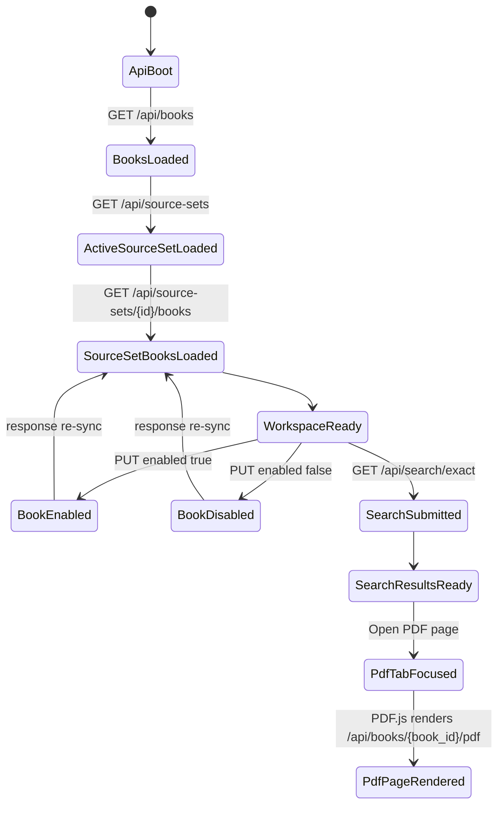
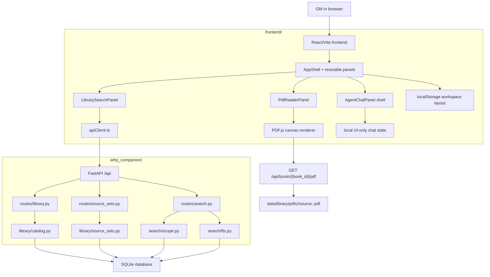

# Phase 5 Browser GUI Shell Implementation Plan

> **For agentic workers:** REQUIRED SUB-SKILL: Use
> `superpowers:subagent-driven-development` (recommended) or
> `superpowers:executing-plans` to implement this plan task-by-task. Steps use
> checkbox (`- [ ]`) syntax for tracking.

**Goal:** Build the first browser GUI for WFRP Companion: a local React/Vite GM
workspace with Library/Search tabs, grouped source-set book checkboxes,
multi-tab PDF reading, exact-search result jumps into the PDF reader, and a
non-agent chat shell ready for a later AI phase.

**Architecture:** Keep SQLite and the existing FastAPI backend as the app-owned
source of truth for books, readiness, source-set membership, search, page text,
and PDF access. Add a focused `frontend/` React + TypeScript app that talks only
through `/api`, stores only layout/view state in browser storage, and renders
managed PDFs through PDF.js from the guarded `/api/books/{book_id}/pdf` route.
Add one small backend page-text endpoint because the GUI must display expanded
search result text from SQLite, not ignored JSON files.

**Tech Stack:** Python 3.12, Conda environment `wfrp-companion`, FastAPI,
SQLite, pytest, pytest-cov, ruff, Node.js, npm, Vite, React, TypeScript,
Vitest, React Testing Library, Playwright, PDF.js through `pdfjs-dist`.

---

## 1. Source Boundary

This plan is based on the live repository state on 2026-06-04:

- `CLAUDE.md`
- `AGENTS.md`
- `environment.yml`
- `wfrp_companion/config.py`
- `wfrp_companion/db/schema.sql`
- `wfrp_companion/db/connection.py`
- `wfrp_companion/library/catalog.py`
- `wfrp_companion/library/source_sets.py`
- `wfrp_companion/search/fts.py`
- `wfrp_companion/search/scope.py`
- `wfrp_companion/api/app.py`
- `wfrp_companion/api/schemas.py`
- `wfrp_companion/api/errors.py`
- `wfrp_companion/api/routes/library.py`
- `wfrp_companion/api/routes/source_sets.py`
- `wfrp_companion/api/routes/search.py`
- `tools/serve_api.py`
- `tests/api/test_library_routes.py`
- `tests/api/test_source_set_routes.py`
- `tests/api/test_search_routes.py`
- Current wiki pages:
  - `wiki/CONTEXT.md`
  - `wiki/INDEX.md`
  - `wiki/topics/target-architecture.md`
  - `wiki/topics/local-tooling-and-packaging.md`
  - `wiki/topics/pdf-library-and-ingestion.md`
  - `wiki/topics/ui-ux-design-principles.md`
  - `wiki/topics/implementation-standards.md`
  - `wiki/topics/testing-posture-and-conventions.md`
  - `wiki/concepts/private-copyright-boundary.md`
  - `wiki/concepts/hybrid-search-for-rules.md`
- ADRs:
  - `docs/adr/0001-conda-python-tooling.md`
  - `docs/adr/0002-managed-local-pdf-storage.md`
- Phase 5 discovery mockup:
  - `.superpowers/brainstorm/91019-1780611135/content/phase5-dockable-workspace-v9-library-search-tabs.html`
- Official/current library documentation queried through Context7 on
  2026-06-04:
  - React docs for component state, refs, effects, and controlled inputs.
  - Vite docs for React TypeScript templates, `server.proxy`, `publicDir`, and
    default `dist` build output.
  - Mozilla PDF.js docs for `GlobalWorkerOptions.workerSrc`, `getDocument`,
    page rendering to canvas, device-pixel-ratio scaling, and queued page
    rendering.

Intentionally excluded as architectural input:

- Earlier broad architecture plans except where their decisions are now present
  in live code, ADRs, or the compiled wiki.
- Hosted/cloud deployment designs.
- OpenAI, vector search, adventure generation, TTS/STT, and visual asset
  extraction designs. Those are future phases.
- The browser mockup's inline CSS and hardcoded sample content as implementation
  source. The mockup is a UX reference, not production code.

## 2. Current Live-Code Diagnosis

The repository has a working local Python backend and no committed frontend.

Current backend facts:

- `wfrp_companion/db/schema.sql` defines the app-owned SQLite source of truth
  for `books`, `pages`, `page_text`, `page_search`, `page_search_fts`,
  `source_sets`, `source_set_books`, `app_settings`, `book_readiness`, future
  chat tables, and future retrieval tables.
- `wfrp_companion/library/catalog.py` exposes reusable read models for book
  lists, book details, page references, managed-PDF availability, and guarded
  reader PDF paths.
- `wfrp_companion/library/source_sets.py` owns the built-in `rules-core`
  source set, active source-set selection through
  `app_settings.active_source_set_id`, and per-book scope membership through
  `source_set_books.enabled`.
- `wfrp_companion/search/scope.py` owns default active-source-set, named
  source-set, explicit book, and whole-library search-scope resolution.
- `wfrp_companion/search/fts.py` owns readiness-gated exact search over
  `page_search` and `page_search_fts`.
- `wfrp_companion/api/routes/library.py` exposes:
  - `GET /api/books`
  - `GET /api/books/{book_id}`
  - `GET /api/books/{book_id}/pages/{page_number}`
  - `GET /api/books/{book_id}/pdf`
- `wfrp_companion/api/routes/source_sets.py` exposes:
  - `GET /api/source-sets`
  - `GET /api/source-sets/active`
  - `PUT /api/source-sets/active`
  - `GET /api/source-sets/{source_set_id}/books`
  - `PUT /api/source-sets/{source_set_id}/books/{book_id}`
- `wfrp_companion/api/routes/search.py` exposes:
  - `GET /api/search/exact`
- `/api/books/{book_id}/pdf` returns a Starlette `FileResponse` with
  `content_disposition_type="inline"` and relies on Starlette range support for
  PDF.js.
- API JSON intentionally does not expose `books.managed_pdf_path`.
- Existing tests cover the API routes, OpenAPI presence, PDF range responses,
  source-set toggles, active-source-set search defaults, exact-search scopes,
  and 100% Python coverage.

Problems and fragility to solve in Phase 5:

- There is no `frontend/` app, package metadata, frontend test setup, or dev
  proxy.
- There is no browser UI for the existing library, source-set toggles, exact
  search, or managed PDF reader.
- The GUI discovery requires expanded search-result text, but
  `/api/search/exact` only returns snippets. The frontend must not read ignored
  `data/page_text/*.json`; runtime text ownership belongs to SQLite
  `page_text`.
- The existing `GET /api/books/{book_id}/pages/{page_number}` route returns
  page metadata but deliberately not text. A distinct explicit text endpoint is
  needed so the GUI can show full page text only when requested.
- Chat tables exist in SQLite, but there are no chat routes, retrieval routes,
  model calls, or assistant contracts. Building real agent behavior in Phase 5
  would mix product discovery with a larger AI/RAG phase.
- Future visual design is expected, but the first GUI needs durable component
  boundaries and theme tokens so later art, graphics, and animations can layer
  on top without replacing the app shell.

Ownership risks to avoid:

- Do not make frontend checkbox state the source of truth for enabled books.
  Persist toggles through `PUT /api/source-sets/{source_set_id}/books/{book_id}`
  and re-sync from the response.
- Do not infer readiness from source-set membership. Readiness remains derived
  by `book_readiness` from `books.copy_status`, `books.text_status`,
  `books.search_status`, and `books.visual_status`.
- Do not expose private filesystem paths or raw PDF locations to the browser.
- Do not add a second active source-set field in browser storage. Browser
  storage may cache the selected tab/layout only; the backend owns active
  source set.
- Do not commit private PDFs, extracted book text, local SQLite databases, or
  generated indexes.

## 3. Architecture Decision

Build a local browser app under `frontend/` with React, Vite, TypeScript,
Vitest, React Testing Library, Playwright, and PDF.js.

Backend changes stay narrowly scoped:

- Extend `wfrp_companion/library/catalog.py` with a `PageTextReference`
  dataclass and `get_page_text(config, book_id, page_number)` helper that reads
  `pages` joined to `page_text`.
- Extend `wfrp_companion/api/schemas.py` with `PageTextResponse`.
- Extend `wfrp_companion/api/routes/library.py` with
  `GET /api/books/{book_id}/pages/{page_number}/text`.
- Reuse existing `catalog_error()` mapping for missing book/page states.

Frontend architecture:

- `frontend/` is a self-contained npm package with committed `package-lock.json`.
- Vite dev server proxies `/api` to `http://127.0.0.1:8000`.
- The React app uses small focused components:
  - `AppShell`
  - `TopBar`
  - `WorkspacePanel`
  - `LibrarySearchPanel`
  - `LibraryTab`
  - `SearchTab`
  - `PdfReaderPanel`
  - `AgentChatPanel`
- The API client is hand-written for the small current API surface. Generated
  OpenAPI clients are deferred until the API grows enough to justify them.
- `frontend/src/types/api.ts` mirrors current Pydantic response contracts.
- `frontend/src/lib/apiClient.ts` is the only module that calls `fetch()`.
- `frontend/src/state/workspaceState.ts` owns layout persistence and view-state
  reducers.
- Browser `localStorage` stores only:
  - active left tab (`library` or `search`)
  - panel sizes
  - panel collapsed/maximized state
  - collapsed library category names
  - open PDF tab descriptors and active PDF tab
  - per-tab page/zoom values
- `source_set_books.enabled` remains the persisted source-of-truth for checked
  books.

Why this is right for the codebase:

- The wiki already identifies a browser GUI and PDF.js as the target MVP shape.
- The Phase 4 API was designed specifically to support the GUI.
- Vite's dev proxy keeps frontend code simple by calling relative `/api/...`
  URLs in development.
- PDF.js can consume the existing PDF route directly because `FileResponse`
  supports HTTP range requests.
- A browser app is easier to iterate on than Electron/Tauri while the GUI and
  AI workflows are still taking shape.

Alternatives to avoid:

- Avoid Electron/Tauri in Phase 5. A desktop wrapper can be evaluated after the
  browser workflow is proven.
- Avoid a purely static frontend mock with fake data. It would not prove the
  local API, source-set, search, or PDF reader contracts.
- Avoid reading `data/page_text/*.json` from the frontend. The JSON files are
  private import inputs; SQLite is runtime state.
- Avoid storing book toggles only in browser storage.
- Avoid real OpenAI calls or agent orchestration in this phase.
- Avoid introducing Redux, XState, React Router, a component library, or a CSS
  framework unless implementation proves the plain component/state split is
  insufficient.

## 4. Target State Model

Phase 5 does not need one global workflow state machine. It needs explicit
ownership for two kinds of state:

- Backend-owned durable state:
  - `source_set_books.enabled`
  - `app_settings.active_source_set_id`
  - book/readiness/page/search data in SQLite
- Frontend-owned ephemeral view state:
  - layout, tabs, scrollable UI surfaces, category collapse state, PDF page/zoom

State ownership model:



Frontend local state shape:

```ts
export type LeftTab = "library" | "search";
export type PanelId = "left" | "reader" | "agent";

export type WorkspaceLayout = {
  leftTab: LeftTab;
  panels: Record<PanelId, {
    size: number;
    collapsed: boolean;
    maximized: boolean;
  }>;
  collapsedLibraryCategories: string[];
  openPdfTabs: PdfTab[];
  activePdfTabId: string | null;
};

export type PdfTab = {
  id: string;
  bookId: string;
  title: string;
  pageNumber: number;
  zoom: number;
};
```

Do not store `active_source_set_id` as durable frontend state. The frontend may
hold the current API response in memory, but a page refresh must re-read the
active source set from `/api/source-sets`.

## 5. Target Architecture Diagram



## 6. Proposed Data Model / Contracts

No schema migration is required in Phase 5.

Existing durable tables and ownership:

- `books`
  - Immutable-ish metadata: `id`, `folder_id`, `title`, `category`,
    `relative_path`, `original_sha256`, `page_count`.
  - Live lifecycle state: `copy_status`, `text_status`, `search_status`,
    `visual_status`, `managed_sha256`, `managed_pdf_path`.
- `book_readiness`
  - Derived read model; do not write to it.
  - GUI reads readiness through API fields `reader_ready`, `search_ready`,
    `fully_ready`, and `needs_attention`.
- `source_sets`
  - Durable named scope groups.
  - Current built-in set: `rules-core` / `Rules/Core`.
- `source_set_books`
  - Durable per-book membership.
  - `enabled` is the checkbox source of truth.
  - Primary key: `(source_set_id, book_id)`.
- `app_settings`
  - `active_source_set_id` stores default source scope.
- `pages`
  - Page identity and metadata.
- `page_text`
  - Runtime source of full extracted/OCR text.
- `page_search` and `page_search_fts`
  - Rebuildable exact-search projection.

Existing API contracts used by the frontend:

```ts
export type HealthResponse = {
  status: string;
  database: string;
};

export type BookSummaryResponse = {
  id: string;
  title: string;
  category: string;
  relative_path: string;
  page_count: number;
  copy_status: string;
  text_status: string;
  search_status: string;
  visual_status: string;
  reader_ready: boolean;
  search_ready: boolean;
  fully_ready: boolean;
  needs_attention: boolean;
};

export type BooksResponse = {
  books: BookSummaryResponse[];
};

export type SourceSetsResponse = {
  active_source_set_id: string | null;
  source_sets: {
    id: string;
    name: string;
    description: string | null;
    is_builtin: boolean;
    active: boolean;
  }[];
};

export type SourceSetBookResponse = {
  source_set_id: string;
  book_id: string;
  title: string;
  category: string;
  enabled: boolean;
  search_ready: boolean;
};

export type SourceSetBooksResponse = {
  source_set_id: string;
  books: SourceSetBookResponse[];
};

export type ExactSearchResponse = {
  query: string;
  scope: {
    label: string;
    source_set_id: string | null;
    book_ids: string[] | null;
    all_books: boolean;
  };
  hits: {
    rank: number;
    book_id: string;
    title: string;
    category: string;
    page_id: string;
    page_number: number;
    snippet: string;
    score: number;
  }[];
};
```

New backend contract:

```ts
export type PageTextResponse = {
  page_id: string;
  book_id: string;
  page_number: number;
  page_label: string | null;
  text: string;
  text_chars: number;
};
```

New route:

```http
GET /api/books/{book_id}/pages/{page_number}/text
```

Behavior:

- `200`: returns page text from SQLite `page_text`.
- `404`: book does not exist, page does not exist, or page has no imported text
  row.
- Response must not include `managed_pdf_path`, `original_source_path`, or any
  local filesystem path.

Frontend-only contracts:

```ts
export type ApiResult<T> =
  | { ok: true; data: T }
  | { ok: false; status: number; message: string };

export type SearchResultGroup = {
  bookId: string;
  title: string;
  category: string;
  hits: SearchHitResponse[];
};
```

## 7. External Integration Design

There are no hosted external systems in Phase 5.

### FastAPI Local Backend

Source of truth boundary:

- FastAPI reads and writes SQLite through existing package services.
- The frontend never writes SQLite directly.

Reads:

- Book/readiness lists from `GET /api/books`.
- Active source-set state from `GET /api/source-sets`.
- Source-set book membership from
  `GET /api/source-sets/{source_set_id}/books`.
- Exact search from `GET /api/search/exact`.
- Page metadata from `GET /api/books/{book_id}/pages/{page_number}`.
- Page text from new
  `GET /api/books/{book_id}/pages/{page_number}/text`.
- PDFs from `GET /api/books/{book_id}/pdf`.

Writes:

- Per-book enabled state through
  `PUT /api/source-sets/{source_set_id}/books/{book_id}`.

Idempotency:

- Repeated `PUT` with the same `enabled` value is idempotent because
  `source_sets.set_book_enabled()` updates one primary-key row.
- The frontend should treat the response body as the canonical updated row.

Retry behavior:

- `GET` calls may be retried manually by the user through a visible retry
  control.
- Checkbox `PUT` failures should revert the optimistic UI change and show a
  row-level error.
- Do not add background retry loops that can repeatedly flip checkbox state.

Success and failure:

- Success means the API returned a typed `2xx` JSON body or PDF stream.
- `404` means the requested entity is missing or no longer available.
- `409` means local state is not ready or is inconsistent, such as missing
  active source set or reader-unavailable book.
- `422` means invalid user/API request, such as conflicting search scope flags
  or invalid query length.
- API down means the frontend displays a local API unavailable banner and keeps
  view controls usable only where they do not require backend data.

### PDF.js

Source of truth boundary:

- PDF.js only renders bytes from `GET /api/books/{book_id}/pdf`.
- PDF.js does not own book/page metadata.

Reads:

- PDF document bytes via URL.
- Page number from frontend `PdfTab.pageNumber`.

Worker configuration:

- Set `GlobalWorkerOptions.workerSrc` with Vite's asset-URL import pattern in
  `frontend/src/lib/pdfjs.ts`:

```ts
import {
  GlobalWorkerOptions,
  getDocument,
  type PDFDocumentProxy,
  type RenderTask,
} from "pdfjs-dist";
import pdfWorkerUrl from "pdfjs-dist/build/pdf.worker.mjs?url";

GlobalWorkerOptions.workerSrc = pdfWorkerUrl;

export { getDocument };
export type { PDFDocumentProxy, RenderTask };
```

- If the installed `pdfjs-dist` package changes its worker path, the
  implementation must update only `frontend/src/lib/pdfjs.ts` and prove the new
  path with `npm run build`. Do not spread PDF.js worker configuration across
  components.

Rendering:

- Use `getDocument({ url })`.
- Render selected page to a canvas.
- Scale canvas for `window.devicePixelRatio`.
- Cancel stale render tasks when the tab, page, or zoom changes.

Failure:

- If the PDF route returns `409`, show “PDF unavailable for this book.”
- If loading or rendering fails, keep the tab open with a retry action.

### Vite Dev Server

Source of truth boundary:

- Vite is only the frontend dev/build tool.
- API calls use relative `/api` URLs and are proxied during development.

Dev proxy:

```ts
server: {
  proxy: {
    "/api": {
      target: "http://127.0.0.1:8000",
      changeOrigin: true,
    },
  },
}
```

Failure:

- If the backend is not running, Vite still serves the UI. API panels show a
  backend-unavailable state.

## 8. Core Flow Design

### Initial App Load

1. `App.tsx` renders `AppShell`.
2. `useInitialWorkspaceData()` calls:
   - `GET /api/health`
   - `GET /api/books`
   - `GET /api/source-sets`
3. If `active_source_set_id` is present, call:
   - `GET /api/source-sets/{active_source_set_id}/books`
4. Merge source-set rows with book summaries by `book_id`.
5. Group library rows by `category`.
6. Render:
   - top bar status such as `5 books enabled`
   - Library tab grouped checkbox sections
   - empty/search-ready Search tab
   - empty PDF reader tab well
   - chat shell

No backend transaction spans this flow. Each request is a normal short API read.

### Library Checkbox Toggle

1. User checks or unchecks a book.
2. The row enters `saving` state and optionally updates optimistically.
3. Frontend calls:

```http
PUT /api/source-sets/{source_set_id}/books/{book_id}
Content-Type: application/json

{"enabled": true}
```

4. Backend transaction:
   - `source_sets.set_book_enabled()` requires source set and book.
   - It ensures a `source_set_books` row exists.
   - It updates `enabled` and `updated_at`.
5. Route re-reads `list_source_set_books()` and returns the matching row.
6. Frontend replaces the row with the response.
7. On failure, frontend restores the prior row and displays the API error.

Concurrency guard:

- Disable the individual checkbox while its save is in flight.
- Do not queue checkbox toggles and do not rely on `AbortController` for
  already-dispatched `PUT` mutations. While saving, additional clicks on that
  checkbox are ignored by the disabled control.
- On success, reconcile from the canonical `SourceSetBookResponse` body.
- On failure, restore the pre-click value and leave the row enabled for another
  user attempt.

### Library Category Collapse

1. User clicks the category disclosure caret.
2. Frontend toggles the category name in
   `workspaceLayout.collapsedLibraryCategories`.
3. Persist layout to `localStorage`.

No API call. Collapse state is view-only.

### Search Flow

1. User opens the `Search` tab.
2. User enters a query in a controlled input.
3. On submit, call:

```http
GET /api/search/exact?query=critical%20hit&limit=20
```

4. Backend resolves the default active source set through
   `search/scope.py`.
5. Backend calls `search_exact_fts()` with resolved `book_ids`.
6. Frontend groups results by `book_id` and `title`.
7. Search results render in a bounded scroll area.
8. Each hit has:
   - snippet
   - `Open PDF page`
   - `Show full text`
   - optional `Ask agent` disabled or marked unavailable until agent phase

Race prevention:

- Use an `AbortController` for search requests. New query submissions abort
  older in-flight searches.
- Ignore responses whose request id does not match the latest submitted query.

### Show Full Text Flow

1. User clicks `Show full text` on a search hit.
2. Frontend calls:

```http
GET /api/books/{book_id}/pages/{page_number}/text
```

3. Backend reads the exact page text from SQLite `page_text`.
4. Frontend displays it inside an expanded scrollable result body.
5. User can collapse the body without losing the cached text for that current
   page session.

Guardrails:

- This endpoint is explicit and page-scoped.
- Do not include page text in default search results.
- Do not add bulk text export.

### Open PDF Page Flow

1. User clicks a book `Open` button or search result `Open PDF page` button.
2. Frontend creates or focuses a `PdfTab`:

```ts
{
  id: `${bookId}:${pageNumber}`,
  bookId,
  title,
  pageNumber,
  zoom: 1
}
```

3. `PdfReaderPanel` uses the tab's `bookId` to load:

```http
GET /api/books/{book_id}/pdf
```

4. PDF.js renders `pageNumber`.
5. The visible PDF label comes from the tab text only, such as
   `Core Rules p. 134`. Do not render a duplicate in-reader header.

Concurrency guard:

- If the active tab changes during load/render, cancel the previous render task.
- If a tab already exists for a book, focusing it and updating its page is
  acceptable. Do not open duplicate tabs for the same book/page pair.

### Panel Resize / Collapse / Maximize

1. User drags a panel divider, collapses a panel, or maximizes a panel.
2. Frontend updates `WorkspaceLayout`.
3. Persist the layout to `localStorage`.
4. Layout rules:
   - exactly one panel may be maximized at a time.
   - collapsed panels remain visible as restore rails/icons.
   - when no panel is maximized, all non-collapsed panels share the workspace
     using saved sizes.

No backend calls.

### Agent Chat Shell Flow

1. `AgentChatPanel` renders a header with hamburger/history button.
2. Transcript area is a scrollable bounded region.
3. Composer is a controlled multiline textarea with independent scrolling.
4. Send action is disabled with a tooltip or inline note until an agent API
   exists.
5. Hamburger opens a local placeholder history menu that says chat persistence
   arrives in the agent phase.

No chat rows are written in Phase 5. The existing `chat_threads` and
`chat_messages` tables remain unused.

## 9. UX / Surface Behavior

### Top Bar

Replace the mockup's placeholder `Library / Reader / Agent` items with a
global control/status bar:

- `WFRP Companion`
- `View`
- `Library`
- `Tools`
- `Settings`
- right-side status: `{enabled_count} books enabled`

Behavior:

- `View` opens a small menu with:
  - show/hide Library/Search panel
  - show/hide PDF Reader panel
  - show/hide Agent Chat panel
  - reset layout
- `Library` focuses the left panel and switches to the `Library` tab.
- `Tools` and `Settings` are disabled or placeholder menu items in Phase 5.
- Clicking `{enabled_count} books enabled` focuses the left panel and switches
  to the `Library` tab.

### Left Panel

The left panel has two tabs:

- `Library`
- `Search`

State rules:

| State | Surface behavior |
| --- | --- |
| API loading | show compact loading row inside active tab |
| API unavailable | show backend unavailable banner and retry |
| active tab `Library` | show grouped book selector |
| active tab `Search` | show exact-search input/results |
| panel collapsed | show restore rail, hide tab content |
| panel maximized | left panel fills workspace, other panels collapse visually |

### Library Tab

Controls:

- filter input: filters visible book rows by title/category.
- grouped category subsections: category header plus disclosure caret.
- checkbox per book: checked means enabled in active source set.
- `Open` button per book: opens the PDF reader tab at page 1.
- readiness text: `ready`, `indexed`, `not indexed`, or `needs attention`
  derived from API readiness fields.

No visible term `source set` in normal book rows. Source-set terminology may
appear only in future advanced settings.

### Search Tab

Controls:

- query input.
- submit button.
- scrollable grouped results.

Each result shows:

- book title
- page number
- snippet
- `Open PDF page`
- `Show full text`

Result overflow rules:

- grouped results container scrolls if it runs off the panel.
- expanded full text uses its own bounded scroll area.

### PDF Reader Panel

Controls:

- PDF source tabs.
- close tab button.
- page stepper/input.
- zoom controls.
- fit-width button.

Rules:

- PDF tabs identify book/page.
- Do not render a duplicate `Core Rules - page 134` header inside the page
  canvas area.
- PDF body is the rendered original PDF page.
- Multiple books can remain open as tabs.
- Search `Open PDF page` creates or focuses a tab at the exact source page.

### Agent Chat Panel

Controls:

- hamburger menu for future chat history.
- scrollable transcript.
- controlled multiline composer.
- send button disabled until chat API phase.

The panel should look like a real chat surface, but it must not imply that
OpenAI/RAG is already active.

### Responsive / Accessibility Behavior

- Text must not overlap or overflow buttons.
- Panels must remain usable on a laptop viewport.
- Scrollable areas must be keyboard reachable.
- Checkbox labels must be clickable.
- Buttons must have accessible labels.
- PDF canvas area should retain a stable size during page render/loading.

## 10. Implementation Sequence

### PR 1: Backend Page Text Endpoint

**Scope**

- Add explicit page-text retrieval to the local API.
- Keep text out of default page metadata and search responses.

**Files**

- Modify: `wfrp_companion/library/catalog.py`
- Modify: `wfrp_companion/api/schemas.py`
- Modify: `wfrp_companion/api/routes/library.py`
- Modify: `tests/api/test_library_routes.py`
- Modify: `tests/api/test_openapi.py`

**Steps**

- [ ] Add `PageTextReference` dataclass to `catalog.py` with fields
  `page_id`, `book_id`, `page_number`, `page_label`, `text`, `text_chars`.
- [ ] Add `get_page_text(config, book_id, page_number)` to `catalog.py`.
  It must:
  - verify the book exists.
  - query `pages` joined to `page_text`.
  - raise `PageNotFoundError` if the page or text row is missing.
  - return no filesystem paths.
- [ ] Add `PageTextResponse` to `api/schemas.py`.
- [ ] Add route before `/{book_id}` catch-all route ordering can become
  confusing:

```python
@router.get(
    "/books/{book_id}/pages/{page_number}/text",
    response_model=PageTextResponse,
)
def get_page_text(
    book_id: str,
    page_number: int,
    config: ConfigDependency,
) -> PageTextResponse:
    try:
        page = catalog.get_page_text(config, book_id, page_number)
    except catalog.CatalogError as error:
        raise errors.catalog_error(error) from error
    return PageTextResponse(**page.__dict__)
```

- [ ] Add tests:
  - success returns exact text for one page.
  - response excludes `managed_pdf_path` and `original_source_path`.
  - missing book returns `404`.
  - missing page returns `404`.
  - page without `page_text` row returns `404`.
  - OpenAPI contains `/api/books/{book_id}/pages/{page_number}/text`.
- [ ] Run:

```bash
conda activate wfrp-companion
python -m pytest tests/api/test_library_routes.py tests/api/test_openapi.py -v
ruff check .
python -m pytest --cov=wfrp_companion --cov=tools.init_db --cov=tools.import_pdfs --cov=tools.import_page_text --cov=tools.rebuild_fts --cov=tools.search_text --cov=tools.source_sets --cov=tools.serve_api --cov-report=term-missing --cov-fail-under=100
```

**What intentionally does not change**

- No search response shape change.
- No bulk text export.
- No chat API.

### PR 2: Frontend Scaffold And Tooling

**Scope**

- Create the first committed frontend package.
- No backend behavior changes.

**Files**

- Create: `frontend/package.json`
- Create: `frontend/package-lock.json`
- Create: `frontend/index.html`
- Create: `frontend/tsconfig.json`
- Create: `frontend/tsconfig.node.json`
- Create: `frontend/vite.config.ts`
- Create: `frontend/vitest.config.ts`
- Create: `frontend/playwright.config.ts`
- Create: `frontend/src/main.tsx`
- Create: `frontend/src/App.tsx`
- Create: `frontend/src/styles/theme.css`
- Create: `frontend/src/styles/global.css`
- Create: `frontend/src/test/setup.ts`
- Create: `frontend/src/test/render.tsx`
- Create: `frontend/src/assets/README.md`
- Copy: `assets/ui/buttlordxai-hero.png` to
  `frontend/public/assets/buttlordxai-hero.png`
- Modify: `.gitignore` if needed for `frontend/dist/`,
  `frontend/coverage/`, and `frontend/test-results/`.
- Modify: `wiki/topics/local-tooling-and-packaging.md`
- Modify: `wiki/topics/testing-posture-and-conventions.md`

**Dependencies**

Use npm and commit `package-lock.json`.

Expected package families:

- runtime: `@vitejs/plugin-react`, `vite`, `typescript`, `react`,
  `react-dom`, `pdfjs-dist`, `lucide-react`
- test/dev: `vitest`, `@testing-library/react`,
  `@testing-library/user-event`, `@testing-library/jest-dom`, `jsdom`,
  `playwright`, `@playwright/test`, `eslint` if chosen for frontend linting

**Steps**

- [ ] Create `frontend/package.json` with scripts:

```json
{
  "scripts": {
    "dev": "vite",
    "build": "tsc -b && vite build",
    "test": "vitest run",
    "test:coverage": "vitest run --coverage",
    "test:e2e": "playwright test"
  }
}
```

- [ ] Configure Vite proxy:

```ts
export default defineConfig({
  plugins: [react()],
  server: {
    proxy: {
      "/api": {
        target: "http://127.0.0.1:8000",
        changeOrigin: true,
      },
    },
  },
});
```

- [ ] Add theme tokens in `theme.css` using CSS variables for background,
  borders, text, accent green, danger, and panel colors.
- [ ] Add `App.tsx` with the first app shell placeholder and no fake backend
  assumptions.
- [ ] Add tests that verify:
  - app title renders.
  - public UI asset path can be referenced.
  - Vite build compiles.
- [ ] Run:

```bash
cd frontend
npm install
npm run test
npm run build
```

**What intentionally does not change**

- No PDF.js rendering yet.
- No API client yet.
- No source-set toggles yet.

### PR 3: Typed API Client And Initial Data Load

**Scope**

- Add typed fetch wrappers and API unavailable handling.
- Render backend-backed counts and loading/error states.

**Files**

- Create: `frontend/src/types/api.ts`
- Create: `frontend/src/lib/apiClient.ts`
- Create: `frontend/src/lib/apiError.ts`
- Create: `frontend/src/hooks/useInitialWorkspaceData.ts`
- Create: `frontend/src/hooks/useAsyncRequest.ts`
- Create: `frontend/src/components/TopBar.tsx`
- Modify: `frontend/src/App.tsx`
- Test: `frontend/src/lib/apiClient.test.ts`
- Test: `frontend/src/hooks/useInitialWorkspaceData.test.tsx`
- Test: `frontend/src/components/TopBar.test.tsx`

**Steps**

- [ ] Define TypeScript types mirroring current Pydantic response contracts:
  `BooksResponse`, `SourceSetsResponse`, `SourceSetBooksResponse`,
  `ExactSearchResponse`, and `PageTextResponse`.
- [ ] Implement `requestJson<T>(path, options)` that:
  - calls relative `/api` paths.
  - parses JSON success bodies.
  - maps non-2xx bodies to `ApiError`.
  - maps network failures to status `0` and message
    `Local API unavailable`.
- [ ] Implement API methods:
  - `getHealth()`
  - `listBooks()`
  - `listSourceSets()`
  - `listSourceSetBooks(sourceSetId)`
  - `setSourceSetBook(sourceSetId, bookId, enabled)`
  - `searchExact(params)`
  - `getPageText(bookId, pageNumber)`
- [ ] Implement `useInitialWorkspaceData()`:
  - loads health/books/source sets.
  - loads active source-set books if `active_source_set_id` exists.
  - exposes `loading`, `error`, and typed data.
- [ ] Render a top bar status based on loaded source-set books:
  `{enabledCount} books enabled`.
- [ ] Tests must mock `global.fetch` and cover:
  - successful JSON response.
  - HTTP error with `detail`.
  - network failure.
  - active source set missing.
  - enabled book count.
- [ ] Run:

```bash
cd frontend
npm run test
npm run build
```

**What intentionally does not change**

- No actual resizable panel behavior yet.
- No PDF rendering yet.
- No OpenAI/chat API calls.

### PR 4: Workspace Shell, Panels, And Layout Persistence

**Scope**

- Build the durable three-panel shell from the mockup.
- Persist layout/view state in localStorage.

**Files**

- Create: `frontend/src/state/workspaceState.ts`
- Create: `frontend/src/state/workspaceStorage.ts`
- Create: `frontend/src/components/AppShell.tsx`
- Create: `frontend/src/components/WorkspacePanel.tsx`
- Create: `frontend/src/components/PanelDivider.tsx`
- Create: `frontend/src/components/ViewMenu.tsx`
- Create: `frontend/src/components/RestoreRail.tsx`
- Create: `frontend/src/components/AppShell.css`
- Modify: `frontend/src/App.tsx`
- Test: `frontend/src/state/workspaceState.test.ts`
- Test: `frontend/src/state/workspaceStorage.test.ts`
- Test: `frontend/src/components/AppShell.test.tsx`

**Steps**

- [ ] Implement `WorkspaceLayout` with:
  - left/reader/agent panel sizes.
  - collapsed state.
  - maximized state.
  - left active tab.
  - collapsed library category names.
  - open PDF tabs.
  - active PDF tab id.
- [ ] Implement pure reducer helpers:
  - `resizePanel(layout, panelId, nextSize)`
  - `togglePanelCollapsed(layout, panelId)`
  - `maximizePanel(layout, panelId)`
  - `restorePanels(layout)`
  - `setLeftTab(layout, tab)`
  - `toggleLibraryCategory(layout, category)`
  - `openPdfTab(layout, tabInput)`
  - `closePdfTab(layout, tabId)`
  - `setPdfTabPage(layout, tabId, pageNumber)`
  - `setPdfTabZoom(layout, tabId, zoom)`
- [ ] Implement localStorage load/save with schema validation. Invalid saved
  state must fall back to defaults.
- [ ] Implement panels:
  - left: `Library / Search`
  - center: `PDF Reader`
  - right: `Agent Chat`
- [ ] Implement collapse/maximize controls and restore rails.
- [ ] Tests must cover:
  - only one maximized panel at a time.
  - collapsed panels can restore.
  - layout survives localStorage round trip.
  - invalid localStorage value falls back to default.
  - tab state persists.
- [ ] Run:

```bash
cd frontend
npm run test
npm run build
```

**What intentionally does not change**

- Divider drag can be implemented with pointer events in this PR, but exact
  pixel-perfect resizing polish can wait until browser QA in PR 8.
- No final custom art/animation layer.

### PR 5: Library And Search Panel

**Scope**

- Implement the left panel's two explicit tabs.
- Wire book checkboxes to source-set API state.
- Wire exact search to the API and search-result actions to the PDF tab model.

**Files**

- Create: `frontend/src/components/library/LibrarySearchPanel.tsx`
- Create: `frontend/src/components/library/LibraryTab.tsx`
- Create: `frontend/src/components/library/SearchTab.tsx`
- Create: `frontend/src/components/library/BookCategorySection.tsx`
- Create: `frontend/src/components/library/BookRow.tsx`
- Create: `frontend/src/components/library/SearchResultGroup.tsx`
- Create: `frontend/src/components/library/SearchResultCard.tsx`
- Create: `frontend/src/lib/grouping.ts`
- Modify: `frontend/src/components/AppShell.tsx`
- Modify: `frontend/src/state/workspaceState.ts`
- Test: `frontend/src/components/library/LibraryTab.test.tsx`
- Test: `frontend/src/components/library/SearchTab.test.tsx`
- Test: `frontend/src/components/library/SearchResultCard.test.tsx`
- Test: `frontend/src/lib/grouping.test.ts`

**Steps**

- [ ] Merge `BookSummaryResponse` and `SourceSetBookResponse` into a
  `LibraryBookRow` by `book_id`.
- [ ] Group rows by `category`, preserving API order.
- [ ] Render Library tab:
  - filter input.
  - category disclosure caret.
  - checkbox per book.
  - `Open` button per book.
  - readiness/status text.
- [ ] Checkbox behavior:
  - disable while saving.
  - call `setSourceSetBook()`.
  - replace row from response.
  - revert on failure and show row-level error.
- [ ] Render Search tab:
  - controlled query input.
  - submit button.
  - bounded scrollable grouped results.
  - per-hit snippet.
  - `Open PDF page` button.
  - `Show full text` button.
- [ ] `Open PDF page` calls `openPdfTab()` with hit `book_id`, `title`, and
  `page_number`.
- [ ] `Show full text` calls `getPageText()` lazily and renders text in a
  scrollable expanded body.
- [ ] Tests must cover:
  - Library and Search are separate tabs.
  - grouped categories collapse/expand.
  - checkbox `PUT` success updates row.
  - checkbox `PUT` failure reverts row.
  - search submits query and renders grouped hits.
  - `Open PDF page` dispatches the expected PDF tab action.
  - `Show full text` calls page-text endpoint and renders returned text.
- [ ] Run:

```bash
cd frontend
npm run test
npm run build
```

**What intentionally does not change**

- No semantic/vector search UI.
- No bulk category enable/disable.
- No real agent context injection from search results.

### PR 6: PDF Reader Panel

**Scope**

- Render original PDFs from existing API route.
- Support multiple PDF tabs and exact page jumps.

**Files**

- Create: `frontend/src/components/pdf/PdfReaderPanel.tsx`
- Create: `frontend/src/components/pdf/PdfTabBar.tsx`
- Create: `frontend/src/components/pdf/PdfCanvas.tsx`
- Create: `frontend/src/components/pdf/PdfToolbar.tsx`
- Create: `frontend/src/lib/pdfjs.ts`
- Create: `frontend/src/lib/pdfUrl.ts`
- Modify: `frontend/src/components/AppShell.tsx`
- Test: `frontend/src/components/pdf/PdfReaderPanel.test.tsx`
- Test: `frontend/src/components/pdf/PdfTabBar.test.tsx`
- Test: `frontend/src/components/pdf/PdfCanvas.test.tsx`
- Test: `frontend/src/lib/pdfUrl.test.ts`

**Steps**

- [ ] Configure PDF.js worker in `pdfjs.ts` using exactly this Vite asset import
  pattern:

```ts
import {
  GlobalWorkerOptions,
  getDocument,
  type PDFDocumentProxy,
  type RenderTask,
} from "pdfjs-dist";
import pdfWorkerUrl from "pdfjs-dist/build/pdf.worker.mjs?url";

GlobalWorkerOptions.workerSrc = pdfWorkerUrl;

export { getDocument };
export type { PDFDocumentProxy, RenderTask };
```

- [ ] Add a `pdfjs.ts` unit test or build assertion that imports the module.
  The acceptance check is `npm run build`; if the worker path is invalid under
  the installed `pdfjs-dist` version, the build must fail before PR review.
- [ ] Implement `bookPdfUrl(bookId)` returning
  `/api/books/${encodeURIComponent(bookId)}/pdf`.
- [ ] Implement PDF tab bar:
  - active tab highlight.
  - close tab button.
  - no duplicate in-reader book/page header.
- [ ] Implement toolbar:
  - previous page.
  - next page.
  - page number input.
  - zoom out.
  - zoom in.
  - fit width.
- [ ] Implement `PdfCanvas`:
  - `getDocument({ url })`.
  - `pdf.getPage(pageNumber)`.
  - device-pixel-ratio canvas scaling.
  - render task cancellation/cleanup when props change.
  - loading, error, and retry states.
- [ ] Tests must mock `pdfjs-dist` and cover:
  - correct PDF URL is used.
  - tab labels contain book/page.
  - in-reader duplicate header text is absent.
  - changing active tab cancels or ignores stale render.
  - page controls update tab page state.
  - render failure shows retry.
- [ ] Run:

```bash
cd frontend
npm run test
npm run build
```

**What intentionally does not change**

- No annotation, bookmarking, text selection, or PDF search inside the PDF.
- No map/image extraction view.

### PR 7: Agent Chat Shell

**Scope**

- Build the right panel as a real chat layout without backend/model calls.

**Files**

- Create: `frontend/src/components/chat/AgentChatPanel.tsx`
- Create: `frontend/src/components/chat/ChatHistoryMenu.tsx`
- Create: `frontend/src/components/chat/ChatTranscript.tsx`
- Create: `frontend/src/components/chat/ChatComposer.tsx`
- Modify: `frontend/src/components/AppShell.tsx`
- Test: `frontend/src/components/chat/AgentChatPanel.test.tsx`
- Test: `frontend/src/components/chat/ChatComposer.test.tsx`

**Steps**

- [ ] Render header with hamburger/history button.
- [ ] Render bounded scrollable transcript area.
- [ ] Render controlled multiline textarea composer with independent scrolling.
- [ ] Keep send button visible.
- [ ] Disable send with accessible reason:
  `Agent chat arrives in a later phase.`
- [ ] Hamburger opens a local placeholder menu for chat history.
- [ ] Tests must cover:
  - transcript area exists and is scrollable by class/role.
  - composer accepts multiline text.
  - send remains disabled.
  - history menu opens/closes.
- [ ] Run:

```bash
cd frontend
npm run test
npm run build
```

**What intentionally does not change**

- No OpenAI API key.
- No model calls.
- No writes to `chat_threads` or `chat_messages`.
- No retrieval runs.

### PR 8: Integrated Browser QA, Wiki, And Phase Completion

**Scope**

- Verify the assembled GUI against a running local backend.
- Update wiki to reflect the current frontend.

**Files**

- Create: `frontend/e2e/workspace.spec.ts`
- Modify: `wiki/topics/local-tooling-and-packaging.md`
- Modify: `wiki/topics/target-architecture.md`
- Modify: `wiki/topics/ui-ux-design-principles.md`
- Modify: `wiki/topics/testing-posture-and-conventions.md`
- Modify: `wiki/log.md`

**Steps**

- [ ] Add Playwright test coverage for:
  - app loads.
  - Library/Search tabs switch.
  - category collapse changes visible rows.
  - search result `Open PDF page` opens reader tab using mocked API data or a
    test backend fixture.
  - chat composer remains visible after long text.
- [ ] Manual QA with real local backend:

```bash
conda activate wfrp-companion
python tools/serve_api.py
```

In another terminal:

```bash
cd frontend
npm run dev
```

- [ ] Verify in browser:
  - backend-backed book list appears.
  - enabled checkbox count matches API state.
  - checkbox toggles persist after refresh.
  - search for `critical hit` returns results.
  - `Open PDF page` opens/focuses a PDF tab.
  - multiple PDFs can remain open as tabs.
  - PDF reader body has no duplicate page header.
  - panel collapse/maximize works and persists after refresh.
  - chat transcript and composer scroll independently.
- [ ] Run full verification:

```bash
conda activate wfrp-companion
ruff check .
python -m pytest --cov=wfrp_companion --cov=tools.init_db --cov=tools.import_pdfs --cov=tools.import_page_text --cov=tools.rebuild_fts --cov=tools.search_text --cov=tools.source_sets --cov=tools.serve_api --cov-report=term-missing --cov-fail-under=100
cd frontend
npm run test
npm run build
npm run test:e2e
```

- [ ] Update wiki with:
  - `frontend/` repo layout.
  - npm commands.
  - backend+frontend local run instructions.
  - frontend test commands.
  - Phase 5 GUI status and non-goals.

**What intentionally does not change**

- No hosted deployment.
- No app packaging.
- No AI agent behavior.

## 11. Testing Requirements

Testing is part of each PR, not cleanup.

Backend requirements:

- New page-text endpoint must have unit/API tests in the same PR.
- Preserve 100% Python coverage for tracked Python package/tool modules.
- Run:

```bash
conda activate wfrp-companion
ruff check .
python -m pytest --cov=wfrp_companion --cov=tools.init_db --cov=tools.import_pdfs --cov=tools.import_page_text --cov=tools.rebuild_fts --cov=tools.search_text --cov=tools.source_sets --cov=tools.serve_api --cov-report=term-missing --cov-fail-under=100
```

Frontend requirements:

- Unit/component tests with Vitest and React Testing Library:
  - API client.
  - initial data hook.
  - layout reducer/storage.
  - Library/Search tabs.
  - grouped checkbox sections.
  - source-set toggle success/failure.
  - search result grouping.
  - page-text expansion.
  - PDF tab reducer/actions.
  - PDF.js rendering wrapper with mocked PDF.js.
  - chat shell/composer.
- Build verification:

```bash
cd frontend
npm run test
npm run build
```

- E2E/manual browser verification once the GUI is assembled:

```bash
cd frontend
npm run test:e2e
```

Coverage target:

- Backend remains at 100% for current Python coverage gate.
- Frontend should start with a practical high gate after the first complete
  frontend PR. Minimum for Phase 5 completion: line and branch coverage at or
  above 90% for `frontend/src`, excluding Vite entry boilerplate and PDF.js
  worker shims if they cannot be meaningfully unit tested.

Test data guardrails:

- Use synthetic book titles/text in frontend tests.
- Do not commit WFRP book text in fixtures.
- E2E tests may use mocked API responses for deterministic CI-like checks.
- Manual QA may use the private local database/PDFs, but those files remain
  ignored and uncommitted.

## 12. Verification Matrix

| Scenario | Required result |
| --- | --- |
| API is down, frontend loads | UI renders with local API unavailable banner |
| API is running, frontend loads | Top bar shows enabled book count |
| Library tab active | Books grouped by category with checkbox rows |
| Category caret clicked | Section expands/collapses and state persists |
| Book checkbox toggled successfully | API `PUT` succeeds, row reflects response, count updates |
| Book checkbox toggle fails | Row reverts and shows error |
| Book `Open` clicked | PDF tab opens at page 1 |
| Search query submitted | Calls `/api/search/exact` and renders grouped results |
| Long result groups | Search results area scrolls, page layout does not break |
| `Show full text` clicked | Calls page-text endpoint and shows scrollable full text |
| `Open PDF page` clicked | PDF reader focuses exact book/page tab |
| Multiple PDF sources opened | Multiple reader tabs remain available |
| PDF tab active | PDF canvas renders original source page from API stream |
| PDF route returns error | Reader tab shows actionable error and retry |
| PDF reader tab area | No duplicate `Core Rules - page 134` style inner header |
| Left panel collapsed | Restore rail appears and content hides |
| Reader panel maximized | Reader fills workspace, other panels are visually minimized |
| Layout refreshed | Saved layout state restores |
| Chat transcript long | Transcript scrolls independently |
| Chat composer long | Composer scrolls and send button remains visible |
| Chat send clicked | Send remains disabled with later-phase reason |
| Frontend build | `npm run build` succeeds |
| Backend coverage | Python 100% coverage gate succeeds |
| No private data committed | Git status contains no PDFs, DBs, extracted text, or keys |

## 13. Migration / Compatibility / Cleanup Strategy

No database migration is required.

Temporary scaffolding:

- `AgentChatPanel` is a UI shell only.
- Chat history menu is a placeholder.
- `Tools` and `Settings` top-bar items are placeholders.
- Frontend tests may mock PDF.js while manual/browser QA verifies real PDF
  rendering against the local API.
- Search is exact-only, using `/api/search/exact`.

How long scaffolding should live:

- Chat placeholders remain until the later AI/chat phase adds real routes over
  `chat_threads`, `chat_messages`, `retrieval_runs`, and `retrieval_hits`.
- `Tools` and `Settings` placeholders remain until ingestion controls,
  settings, or diagnostics are intentionally planned.
- Exact-only search remains until semantic/vector retrieval is implemented.

Removal criteria:

- Remove chat placeholders when real chat thread list, message persistence,
  retrieval, and model-call APIs exist.
- Remove mocked-only PDF behavior from critical paths once Playwright has a
  stable synthetic PDF fixture or local test server fixture.
- Replace hand-written API client only if OpenAPI surface grows enough to make
  generated clients lower-risk.

Cleanup later:

- Add frontend route/package ADR if React/Vite/npm becomes a durable platform
  commitment beyond this phase.
- Add visual polish/theme phase after the cockpit workflow is functional.
- Add map/image browser only after `page_assets` is populated and reviewed.

Ambiguous cases:

- If a book is enabled but `search_ready=false`, show it checked but mark it
  `not indexed`; exact search will not return hits until backend readiness
  changes.
- If the active source set is missing, show a `409`-style setup error and do
  not invent a local fallback source set.
- If page text is missing for a search hit, keep the snippet visible and show a
  page-text unavailable error for the expanded area.

## 14. Operational Rollout Notes

Local development order:

1. Ensure the backend database exists and contains imported/indexed data.
2. Start the backend:

```bash
conda activate wfrp-companion
python tools/serve_api.py
```

3. Start the frontend:

```bash
cd frontend
npm install
npm run dev
```

4. Open the Vite URL, usually `http://localhost:5173`.

DB rollout:

- No schema rollout.
- Backend route addition is backward-compatible.
- Existing CLI tools continue to work.

Network/security:

- Backend stays bound to `127.0.0.1` by default.
- Frontend dev proxy targets `http://127.0.0.1:8000`.
- Do not bind the local API to public interfaces by default.

Recovery:

- If frontend shows API unavailable, verify `python tools/serve_api.py` is
  running.
- If PDFs do not load, verify `/api/books/{book_id}/pdf` returns `200` or
  `206`, and check `reader_ready`/managed file availability.
- If search returns no results, verify active source-set membership and
  `search_ready` status.

Feature flags:

- No runtime feature flags are required.
- Disabled UI affordances are sufficient for placeholders in this phase.

## 15. ADR / Platform Alignment

Alignment:

- ADR 0001 keeps Python tooling on Conda. Phase 5 does not change Python
  dependency management.
- ADR 0002 keeps managed PDFs in private local storage. Phase 5 reads PDFs only
  through the guarded API route.
- `wiki/topics/target-architecture.md` recommends a browser GUI, FastAPI,
  SQLite, and PDF.js. Phase 5 implements that direction.
- `wiki/topics/ui-ux-design-principles.md` calls for a practical GM cockpit,
  not a landing page. Phase 5 builds the cockpit: Library/Search, Reader, and
  Agent Chat shell as the first screen.
- `wiki/concepts/private-copyright-boundary.md` requires local/private use and
  no public redistribution. Phase 5 keeps extracted text behind an explicit
  page-scoped endpoint and does not add export/sharing features.

Tensions:

- React/Vite/npm is a new durable frontend toolchain not yet captured in an
  ADR. This is acceptable for the first frontend phase, but add an ADR if the
  team wants a permanent record of the browser stack decision.
- Page full-text display increases exposure of extracted copyrighted text
  inside the private app. The endpoint is acceptable because it is local,
  page-scoped, user-initiated, and does not add bulk export.
- The app will later receive custom graphics/animations. Phase 5 intentionally
  prioritizes component boundaries and theme tokens so visual work can layer on
  top without destabilizing core workflows.

Transitional compromise:

- Chat appears as a shell before it is backed by `chat_threads` and OpenAI/RAG.
  This keeps the cockpit layout honest while avoiding premature AI integration.

## 16. Non-Goals / Guardrails / Open Questions

Non-goals:

- No OpenAI API calls.
- No model selection or API key storage.
- No RAG answer generation.
- No adventure generator.
- No TTS/STT.
- No vector search.
- No semantic search UI.
- No map/image extraction or page asset browser.
- No Electron/Tauri/native app wrapper.
- No hosted deployment.
- No auth system.
- No public sharing, export, or bulk download of extracted book text.
- No WFRP book text in committed fixtures.
- No replacing the backend source-set source of truth with frontend state.

Guardrails:

- Frontend must call relative `/api` URLs only.
- Frontend must not know `managed_pdf_path` or `original_source_path`.
- Frontend must not read ignored `data/` files.
- Checkbox state must round-trip through the source-set API.
- Search defaults to the backend active source set.
- PDF reader uses `/api/books/{book_id}/pdf`; it does not construct file URLs.
- Full text is fetched per page only when the user expands a result.
- Layout persistence must tolerate invalid localStorage and fall back safely.
- UI must remain usable when panels overflow: result groups, chat transcript,
  and composer all scroll independently.

Open questions for the implementation kickoff:

- Should the disabled chat send button be visible from day one, or should the
  composer be read-only until the agent API phase?
- Should PDF tabs restore after a full browser restart, or only persist within
  the saved workspace layout until the user closes them?
- Should `Tools` and `Settings` top-bar menu items be visible-disabled or hidden
  until their features exist?

Assumptions:

- Use npm with committed `package-lock.json`.
- Use `frontend/` rather than `apps/web/` because the wiki lists both as
  acceptable and this repo currently has no monorepo workspace.
- The backend remains on `127.0.0.1:8000` during development.
- The frontend development server remains a separate process from FastAPI in
  Phase 5.
- All custom WFRP visual treatment will be added after the functional cockpit
  is stable, using theme tokens and component boundaries created here.

## Self-Review Checklist

- Source boundary cites live code, wiki, ADRs, current mockup, and official
  library documentation.
- Single source of truth is explicit: SQLite/FastAPI for durable data,
  localStorage only for view state.
- Source-set checkbox ownership remains `source_set_books.enabled`.
- No frontend filesystem paths or private JSON reads.
- Search result full text is provided by an explicit backend endpoint over
  SQLite `page_text`.
- Concurrency is addressed for checkbox toggles, searches, and PDF rendering.
- UX maps state to surfaces for top bar, left panel, reader, and chat.
- Implementation sequence is PR-sized and ordered.
- Tests and rollout commands are included.
- Temporary scaffolding and later cleanup are separated from steady-state
  architecture.
