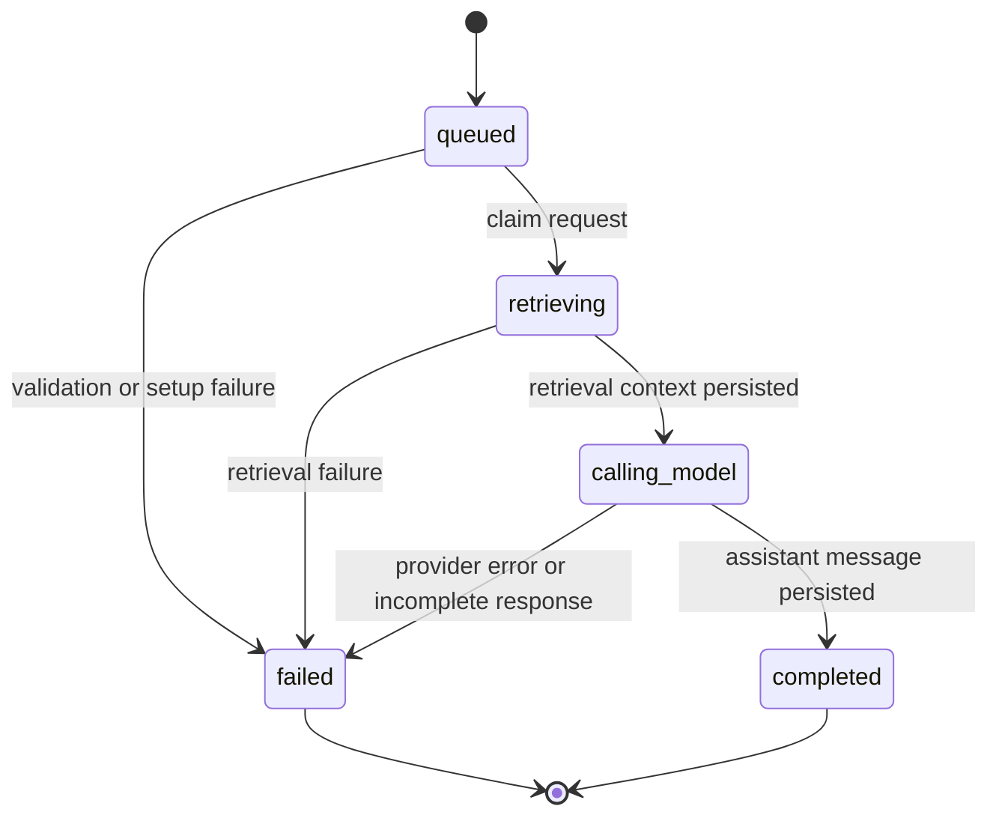
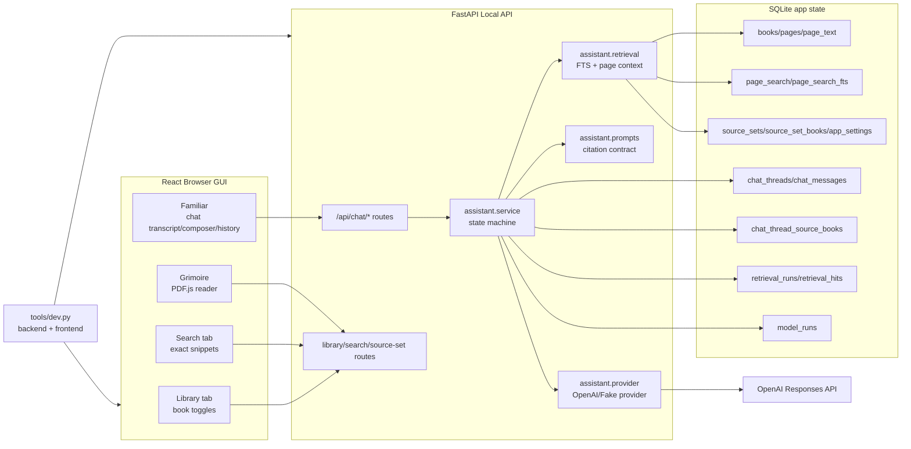

# Phase 6 Familiar MVP / Local RAG Chat Implementation Plan

> **For agentic workers:** REQUIRED SUB-SKILL: Use superpowers:subagent-driven-development (recommended) or superpowers:executing-plans to implement this plan task-by-task. Steps use checkbox (`- [ ]`) syntax for tracking.

**Goal:** Build the first working Familiar chat loop: local chat history, exact-search retrieval over enabled books, cited answer generation through OpenAI, and a reliable one-command local dev runner.

**Architecture:** Keep SQLite as the app-owned source of truth for chat, retrieval, and model-run state. The React Familiar panel stays a thin client over FastAPI, while the backend owns retrieval, prompt assembly, provider calls, persistence, idempotency, and citation contracts.

**Tech Stack:** Python 3.12, Conda, FastAPI, SQLite/WAL, SQLite FTS5, React/Vite/TypeScript, Vitest, Playwright, OpenAI Responses API via the official Python SDK.

---

## 1. Source Boundary

This plan is based on the current live code and current compiled wiki in `/Users/aftoncarlson/workspace/WFRP-Companion`.

Live-code sources used:

- `wfrp_companion/db/schema.sql`
- `wfrp_companion/db/connection.py`
- `wfrp_companion/config.py`
- `wfrp_companion/api/app.py`
- `wfrp_companion/api/routes/library.py`
- `wfrp_companion/api/routes/search.py`
- `wfrp_companion/api/routes/source_sets.py`
- `wfrp_companion/api/schemas.py`
- `wfrp_companion/api/errors.py`
- `wfrp_companion/library/catalog.py`
- `wfrp_companion/library/source_sets.py`
- `wfrp_companion/search/fts.py`
- `wfrp_companion/search/scope.py`
- `tools/serve_api.py`
- `frontend/src/components/chat/AgentChatPanel.tsx`
- `frontend/src/components/chat/AgentChatPanel.css`
- `frontend/src/components/AppShell.tsx`
- `frontend/src/lib/apiClient.ts`
- `frontend/src/types/api.ts`
- `frontend/vite.config.ts`
- `environment.yml`
- `frontend/package.json`

Wiki and ADR sources used:

- `wiki/CONTEXT.md`
- `wiki/topics/target-architecture.md`
- `wiki/topics/ai-rag-system.md`
- `wiki/topics/ui-ux-design-principles.md`
- `wiki/topics/testing-posture-and-conventions.md`
- `wiki/topics/local-tooling-and-packaging.md`
- `wiki/concepts/private-copyright-boundary.md`
- `wiki/concepts/hybrid-search-for-rules.md`
- `docs/adr/0001-conda-python-tooling.md`
- `docs/adr/0002-managed-local-pdf-storage.md`

Official third-party documentation used:

- OpenAI Responses API create endpoint: `https://developers.openai.com/api/reference/resources/responses/methods/create`
- OpenAI API authentication and request IDs: `https://developers.openai.com/api/reference/overview#authentication`
- OpenAI streaming responses guide: `https://developers.openai.com/api/docs/guides/streaming-responses`
- OpenAI model selection guide: `https://developers.openai.com/api/docs/guides/model-selection`
- OpenAI Python SDK README and API reference: `https://github.com/openai/openai-python`

Sources intentionally excluded as architectural input:

- Older implementation plans under `docs/plans/` are treated as historical execution records only. They are not used as architectural authority for Phase 6.
- Generated private runtime artifacts under `data/` are excluded.
- User-owned WFRP PDFs and extracted page-text content are excluded from this plan text.
- No Azure, hosted database, NoSQL service, OpenAI File Search, or image-generation documentation is used for this phase.

## 2. Current Live-Code Diagnosis

The current application has a stable local reference-library foundation but no working AI chat path.

Concrete live-code state:

- `wfrp_companion/db/schema.sql` already defines `chat_threads`, `chat_messages`, `retrieval_runs`, and `retrieval_hits`, but no Python module writes to or reads from those tables.
- `wfrp_companion/api/app.py` registers health, library, source-set, and exact-search routers only. There is no `/api/chat` router.
- `wfrp_companion/api/schemas.py` has no chat request/response models, no citation model, no model-run status model, and no error contract for provider failures.
- `frontend/src/components/chat/AgentChatPanel.tsx` is a controlled composer and static offline transcript. The send button is disabled and no API call exists.
- `frontend/src/lib/apiClient.ts` is the correct single fetch boundary, but it only exposes health, library, source-set, search, and page-text methods.
- `wfrp_companion/search/fts.py` can return exact page hits with snippets and citations, but there is no assistant retrieval-context builder that hydrates hits into bounded prompt context.
- `wfrp_companion/library/catalog.py` can return full page text through readiness-gated APIs, but Familiar does not use that path.
- `tools/serve_api.py` starts only the backend. Frontend and backend currently need to be launched separately, which caused stale Vite proxy behavior during manual testing.
- `environment.yml` does not include the OpenAI Python SDK.

Ownership and fragility problems:

- Chat state ownership is split by absence: the UI owns typed text transiently, SQLite has unused tables, and no backend service owns conversation lifecycle.
- Retrieval state is not explicit for chat. Search requests return hits to the browser, but assistant retrieval runs are not persisted or connected to user messages.
- Model-call state does not exist. There is no durable record of `queued`, `retrieving`, `calling_model`, `completed`, or `failed`, so retries and failures would be invisible if implemented ad hoc in React.
- OpenAI configuration has no local boundary. API keys must not reach the browser, and provider calls must be server-side only.
- Concurrency and duplicate sends are not guarded. A double-click or retry could create duplicate messages unless the backend owns idempotency.
- The current exact-search snippets are useful UI output but too small to be the only model context. The assistant needs bounded context windows from `page_text` while still avoiding whole-book or whole-PDF transfer.

## 3. Architecture Decision

Implement Phase 6 as a local-first, server-owned RAG chat system.

Recommended architecture:

- SQLite remains the single source of truth for chat threads, messages, retrieval runs, retrieval hits, and model runs.
- FastAPI owns chat endpoints, retrieval scope resolution, retrieval logging, prompt construction, provider calls, idempotency, retry transitions, and response shaping.
- React owns only view state: active chat thread, composer value, pending indicator, history popover visibility, and click actions for citations.
- Retrieval starts with existing SQLite FTS exact search over the active source set. Vector search remains future work.
- OpenAI integration uses the Responses API from the backend only. The API key is read from `OPENAI_API_KEY`; the model is read from `WFRP_OPENAI_MODEL`, defaulting to `gpt-5.4-mini` for cost and latency unless the user overrides it.
- The first Familiar implementation should stream assistant output. Keep the existing JSON send shape for tests, retry fallback, and history reloads, and add a backend-owned streaming send endpoint that accepts the user message by `POST` and returns newline-delimited JSON events over `fetch()` streaming.

Approaches to avoid:

- Do not put the OpenAI API key in frontend code, `localStorage`, SQLite, or committed files.
- Do not use OpenAI File Search or upload PDFs in this phase. The app already has local search, page text, and source-set controls, and the private-use boundary requires sending only the minimal retrieved context.
- Do not build vector embeddings, LanceDB/Chroma, adventure generation, speech-to-text, TTS, or image generation in this phase.
- Do not create a local NoSQL database for chat metadata. The existing relational schema is simpler, queryable, transactional, and already aligned with the app-owned state model.
- Do not let frontend inference decide which books were used. Retrieval scope and hits must be persisted by the backend.
- Do not build a fake always-on assistant in production. Tests may use a fake provider, but real runtime behavior should report provider-unavailable when `OPENAI_API_KEY` is missing.

## 4. Target State Model

This system needs explicit workflow state. `model_runs.status` is the app-owned source of truth for assistant generation lifecycle.



State ownership:

- `chat_threads` owns conversation identity, title, active source-set provenance, and updated time.
- `chat_thread_source_books` owns the per-thread book-scope snapshot captured when the thread is created.
- `chat_messages` is append-only conversation content. User and assistant messages are not edited in Phase 6.
- `retrieval_runs` owns one retrieval attempt for one user message.
- `retrieval_hits` owns the ranked pages used for that retrieval run.
- `model_runs` owns provider state, provider response ID, status, error fields, usage metadata, and idempotency.

A retry does not mutate a failed `model_runs` row back to `queued`. It creates a separate queued row with `retry_of_model_run_id` pointing at the failed run.

Status definitions:

| Status | Meaning | User-facing behavior |
| --- | --- | --- |
| `queued` | Backend accepted an idempotent request but has not started retrieval. | Composer disabled for that request. |
| `retrieving` | Backend is resolving source scope and assembling context. | Familiar shows "Searching enabled books...". |
| `calling_model` | Context is persisted and the provider call is in progress. | Familiar shows "Familiar is thinking...". |
| `completed` | Assistant message was persisted and returned. | Assistant response appears with citations. |
| `failed` | Retrieval, config, provider, or response parsing failed. | Error appears with retry control when retry is safe. |

## 5. Target Architecture Diagram



## 6. Proposed Data Model / Contracts

### SQLite Schema

Existing tables remain canonical:

- `chat_threads`
- `chat_messages`
- `retrieval_runs`
- `retrieval_hits`

Add `chat_thread_source_books` so an existing chat thread does not silently change scope when the user later toggles books in Library:

```sql
create table if not exists chat_thread_source_books (
  thread_id text not null references chat_threads(id) on delete cascade,
  book_id text not null references books(id) on delete cascade,
  source_set_id text references source_sets(id) on delete set null,
  captured_at text not null,
  primary key(thread_id, book_id)
);
```

Add `model_runs`:

```sql
create table if not exists model_runs (
  id text primary key,
  thread_id text not null references chat_threads(id) on delete cascade,
  user_message_id text references chat_messages(id) on delete set null,
  assistant_message_id text references chat_messages(id) on delete set null,
  retrieval_run_id text references retrieval_runs(id) on delete set null,
  retry_of_model_run_id text references model_runs(id) on delete set null,
  provider text not null,
  model text not null,
  status text not null,
  idempotency_key text not null unique,
  provider_response_id text,
  error_code text,
  error_message text,
  input_tokens integer,
  output_tokens integer,
  created_at text not null,
  updated_at text not null,
  completed_at text,
  metadata_json text not null default '{}',
  check(provider in ('openai', 'fake')),
  check(status in ('queued', 'retrieving', 'calling_model', 'completed', 'failed')),
  check(status = 'queued' or user_message_id is not null)
);
```

Add indexes:

```sql
create index if not exists ix_chat_threads_updated_at
on chat_threads(updated_at desc);

create index if not exists ix_chat_messages_thread_created
on chat_messages(thread_id, created_at, id);

create index if not exists ix_retrieval_runs_thread_message
on retrieval_runs(thread_id, message_id, created_at);

create index if not exists ix_retrieval_hits_run_rank
on retrieval_hits(retrieval_run_id, rank);

create index if not exists ix_chat_thread_source_books_book
on chat_thread_source_books(book_id);

create index if not exists ix_model_runs_thread_status
on model_runs(thread_id, status, updated_at);

create index if not exists ix_model_runs_user_message
on model_runs(user_message_id);

create index if not exists ix_model_runs_retry_of
on model_runs(retry_of_model_run_id);

create unique index if not exists ux_model_runs_one_active_retry
on model_runs(retry_of_model_run_id)
where retry_of_model_run_id is not null
  and status in ('queued', 'retrieving', 'calling_model');
```

Immutable snapshot data:

- `retrieval_runs.query`
- `retrieval_hits.rank`, `score`, and `snippet`
- `model_runs.provider`, `model`, and `idempotency_key`
- `chat_threads.active_source_set_id` as source-set provenance at thread creation
- `chat_thread_source_books.thread_id`, `book_id`, `source_set_id`, and `captured_at`

Live workflow state:

- `model_runs.status`
- `model_runs.error_code`
- `model_runs.error_message`
- `model_runs.provider_response_id`
- `model_runs.input_tokens`
- `model_runs.output_tokens`
- `model_runs.completed_at`
- `chat_threads.updated_at`

Explicit linkage data:

- `model_runs.thread_id`
- `model_runs.user_message_id`
- `model_runs.assistant_message_id`
- `model_runs.retrieval_run_id`
- `model_runs.retry_of_model_run_id`
- `retrieval_runs.message_id`
- `retrieval_hits.retrieval_run_id`
- `retrieval_hits.page_id`
- `chat_thread_source_books.thread_id`
- `chat_thread_source_books.book_id`

### Backend Contracts

Create `wfrp_companion/assistant/`:

- `chat_store.py`: SQLite persistence for threads, messages, retrieval runs, hits, and model runs.
- `retrieval.py`: exact-search retrieval and bounded page-context windows.
- `prompts.py`: system instructions and prompt assembly.
- `provider.py`: provider protocol, `OpenAIProvider`, `FakeProvider`, provider errors.
- `service.py`: chat orchestration and state transitions.
- `__init__.py`: package marker.

Create `wfrp_companion/api/routes/chat.py` and register it from `wfrp_companion/api/app.py`.

Request and response models to add in `wfrp_companion/api/schemas.py`:

```python
class CreateChatThreadRequest(BaseModel):
    title: str | None = None
    source_set_id: str | None = None

class ChatThreadResponse(BaseModel):
    id: str
    title: str | None
    active_source_set_id: str | None
    source_book_count: int
    created_at: str
    updated_at: str

class ChatMessageResponse(BaseModel):
    id: str
    thread_id: str
    role: str
    content: str
    created_at: str

class ChatCitationResponse(BaseModel):
    book_id: str
    title: str
    category: str
    page_id: str
    page_number: int
    snippet: str
    rank: int
    score: float

class SendChatMessageRequest(BaseModel):
    content: str
    idempotency_key: str | None = None

class RetryModelRunRequest(BaseModel):
    idempotency_key: str | None = None

class ModelRunResponse(BaseModel):
    id: str
    thread_id: str
    user_message_id: str | None
    assistant_message_id: str | None
    retrieval_run_id: str | None
    retry_of_model_run_id: str | None
    status: str
    provider: str
    model: str
    error_code: str | None = None
    error_message: str | None = None
    retryable: bool

class SendChatMessageResponse(BaseModel):
    thread: ChatThreadResponse
    user_message: ChatMessageResponse
    assistant_message: ChatMessageResponse | None
    model_run: ModelRunResponse
    citations: list[ChatCitationResponse]

class ChatStreamEvent(BaseModel):
    type: Literal['accepted', 'retrieval', 'delta', 'completed', 'failed']
    thread: ChatThreadResponse | None = None
    user_message: ChatMessageResponse | None = None
    assistant_message: ChatMessageResponse | None = None
    model_run: ModelRunResponse | None = None
    citations: list[ChatCitationResponse] = []
    text_delta: str | None = None
    error_message: str | None = None

class ChatTurnResponse(BaseModel):
    user_message: ChatMessageResponse
    assistant_message: ChatMessageResponse | None
    model_run: ModelRunResponse
    citations: list[ChatCitationResponse]

class ChatThreadDetailResponse(BaseModel):
    thread: ChatThreadResponse
    source_book_ids: list[str]
    turns: list[ChatTurnResponse]
```

Routes:

- `POST /api/chat/threads`
- `GET /api/chat/threads`
- `GET /api/chat/threads/{thread_id}`
- `POST /api/chat/threads/{thread_id}/messages`
- `POST /api/chat/threads/{thread_id}/messages/stream`
- `POST /api/chat/model-runs/{model_run_id}/retry`

Frontend contracts:

- Add matching TypeScript types in `frontend/src/types/api.ts`.
- Add `apiClient.createChatThread`, `apiClient.listChatThreads`, `apiClient.getChatThread`, `apiClient.sendChatMessage`, and `apiClient.retryModelRun`.
- Add `apiClient.streamChatMessage`, implemented with `fetch()` and `ReadableStream` parsing of newline-delimited JSON events. Do not use `EventSource`, because the app must send a request body and idempotency key.
- `AgentChatPanel` should accept API-backed thread state or own it through hooks local to the component. Keep fetch calls routed through `apiClient`.

## 7. External Integration Design

### OpenAI Responses API

Source of truth boundary:

- WFRP Companion owns chat state, retrieval state, citations, and source-set scope.
- OpenAI owns only the generated model response for a request.
- The app sends user prompt plus bounded retrieved context windows. It does not send PDFs, whole books, managed PDF paths, or full library text.

Configuration:

- `OPENAI_API_KEY`: required for real provider calls. Loaded server-side only.
- `WFRP_OPENAI_MODEL`: optional model override. Default `gpt-5.4-mini`.
- `WFRP_AI_PROVIDER`: optional. Allowed values are `openai` and `fake`; production default is `openai`.
- `WFRP_CHAT_CONTEXT_HIT_LIMIT`: optional integer, default `6`.
- `WFRP_CHAT_CONTEXT_CHAR_LIMIT`: optional integer, default `9000`.
- `WFRP_CHAT_CONTEXT_WINDOW_CHARS`: optional integer, default `1500`.
- `WFRP_OPENAI_TIMEOUT_SECONDS`: optional float, default `30.0`.

Written to OpenAI:

- System/developer instructions from `assistant.prompts`.
- The current user message.
- Short prior conversation summary from recent `chat_messages`, capped by count and characters.
- Bounded context windows with `book_id`, title, page number, and rank.

Read from OpenAI:

- Response text.
- Provider response ID.
- Usage token counts when returned by the SDK.
- Error codes/messages on failure.

Idempotency:

- The frontend generates a UUID `idempotency_key` per send attempt.
- Retry requests also send an `idempotency_key`; the retry button keeps the same key while an attempt is pending.
- `model_runs.idempotency_key` is unique.
- The backend claims a run before creating user-visible content. If a duplicate request arrives with the same key, return the existing run/result instead of sending a second provider request.
- `model_runs.retry_of_model_run_id` links retry attempts to the failed run they retry.
- `ux_model_runs_one_active_retry` prevents two in-flight retries for the same failed run even if the frontend double-clicks with different keys.
- The OpenAI request should include `X-Client-Request-Id` with the `model_runs.id` so provider-side troubleshooting can correlate to local state.
- Streaming provider calls use the OpenAI Responses API with `stream=True`. The provider adapter converts OpenAI response events into app-owned stream events and only exposes text deltas and final usage/response metadata to the route layer.

Retry behavior:

- Do not automatically retry 429, 5xx, timeout, or network failures inside the request handler. Automatic retries can create surprise cost and duplicate answers.
- Configure the OpenAI SDK client as `OpenAI(max_retries=0, timeout=WFRP_OPENAI_TIMEOUT_SECONDS)` to enforce that policy instead of relying on SDK defaults.
- Persist the failed `model_runs` row with `status='failed'`, `error_code`, and `error_message`.
- The UI retry button calls `POST /api/chat/model-runs/{model_run_id}/retry`, which creates a new model run linked to the same failed user message and performs retrieval/model generation again.
- Missing `OPENAI_API_KEY` is a provider-unavailable failure and must not contact OpenAI. For an accepted send/retry request, persist and return `model_run.status='failed'`, `error_code='provider_unavailable'`, and `retryable=true` in the normal chat response body so the UI can show the failed turn and retry after the key is fixed.
- Use HTTP errors only for pre-acceptance failures such as missing thread, invalid request body, source-set mismatch, or idempotency conflicts that cannot be safely associated with an existing run.

Success:

- The provider stream yields text delta events and then a completed response with non-empty assistant text.
- The backend streams `accepted`, `retrieval`, zero or more `delta`, and final `completed` events to the browser.
- The backend buffers assistant deltas server-side during the request, persists one assistant `chat_messages` row when the provider completes, updates `model_runs.status='completed'`, links `assistant_message_id`, and includes citations in the final `completed` event.
- If the client disconnects after the provider call has started, the backend should finish or fail the model run consistently; do not leave `model_runs.status='calling_model'`.

Failure:

- Provider exception, incomplete/failed response status, empty text, invalid config, or retrieval failure marks the model run failed.
- The user message remains in history because the user did ask it.
- No assistant message is inserted for failed provider calls.
- Failed runs are returned by both send responses and thread-detail responses so history and retry UI do not lose them.
- Streaming failures emit a final `failed` event when the connection is still open. Whether or not the event reaches the client, the failed `model_runs` row remains visible when the thread is reloaded.

If OpenAI is down:

- Existing library, Grimoire, source-set, and exact-search features continue working.
- Familiar shows the failed run with retry.
- The local database remains the source of truth and no data is lost.

## 8. Core Flow Design

### Dev Startup Flow

1. User runs `python tools/dev.py`.
2. The script resolves repo root and checks that `frontend/package.json` exists.
3. The script starts `python tools/serve_api.py --host 127.0.0.1 --port 8000`.
4. The script starts `npm run dev -- --host 127.0.0.1 --port 5173` from `frontend/`.
5. The script probes `http://127.0.0.1:8000/api/health` and `http://127.0.0.1:5173/`.
6. On `SIGINT` or subprocess failure, it terminates both child processes.
7. It prints the frontend URL and backend URL once both are healthy.

No database writes happen in `tools/dev.py` beyond normal API startup initialization.

### Thread Create Flow

1. `POST /api/chat/threads` accepts optional `title` and optional `source_set_id`.
2. If `source_set_id` is absent, resolve `source_sets.get_active_source_set_id(config)`.
3. Validate that any provided source set exists.
4. In one SQLite transaction:
   - Insert `chat_threads`.
   - Store the selected source-set ID in `chat_threads.active_source_set_id` as provenance.
   - Read the currently enabled book IDs from `source_set_books` for that source set.
   - Insert one `chat_thread_source_books` row for each enabled book. This is the immutable retrieval scope for the thread.
   - Set `created_at` and `updated_at` to the same UTC timestamp.
5. Return `ChatThreadResponse`.

### Message Send Flow

1. `POST /api/chat/threads/{thread_id}/messages` validates non-empty `content` and clamps max user-message length to `8000` characters.
2. Resolve or generate `idempotency_key`.
3. In one transaction:
   - Ensure `chat_threads.id` exists.
   - Insert `model_runs` with `status='queued'`, `thread_id`, `provider`, `model`, and unique `idempotency_key`.
   - If the idempotency key already exists, return the existing run and associated messages without creating a duplicate user message.
   - Insert a user `chat_messages` row.
   - Update `model_runs.user_message_id`.
   - Update `chat_threads.updated_at`.
4. Guarded transition:

```sql
update model_runs
set status = 'retrieving',
    updated_at = :now
where id = :model_run_id
  and status = 'queued';
```

5. Resolve retrieval scope from `chat_thread_source_books`, not live `source_set_books`.
6. Build retrieval query candidates:
   - Normalize whitespace and punctuation from the user message.
   - Remove common question/grammar stop words such as `what`, `how`, `does`, `the`, `a`, `an`, `is`, `are`, `for`, `with`, and `when`.
   - Preserve quoted phrases and WFRP-looking terms with digits or capitalized multi-word names.
   - Try the cleaned full key-term query first.
   - If no hits are found, try adjacent bigrams/trigrams and then individual high-value terms.
   - Deduplicate hits by `page_id`, preserving the best rank/score.
7. Call `search_exact(config, candidate_query, book_ids=thread_source_book_ids, limit=context_hit_limit)` for each candidate until the hit budget is filled.
8. For each hit, fetch `page_text` directly through the database or `catalog.get_page_text`.
9. Build a context window around matched candidate terms, capped by `WFRP_CHAT_CONTEXT_WINDOW_CHARS` per page and `WFRP_CHAT_CONTEXT_CHAR_LIMIT` total.
10. In one transaction:
   - Insert `retrieval_runs`.
   - Insert `retrieval_hits` in ranked order.
   - Update `model_runs.retrieval_run_id`.
11. Guarded transition:

```sql
update model_runs
set status = 'calling_model',
    updated_at = :now
where id = :model_run_id
  and status = 'retrieving';
```

12. If no retrieval context exists, call the provider with instructions to say the enabled thread source books did not provide enough context. Do not hallucinate rules.
13. Call the configured provider.
14. On success, in one transaction:
   - Insert assistant `chat_messages`.
   - Update `model_runs.status='completed'`.
   - Set `assistant_message_id`, `provider_response_id`, usage fields, `completed_at`, and `updated_at`.
   - Update `chat_threads.updated_at`.
15. On failure, in one transaction:
   - Update `model_runs.status='failed'`.
   - Set `error_code`, `error_message`, and `updated_at`.
   - Do not insert assistant message.
16. Return `SendChatMessageResponse` for both completed and failed accepted requests. Failed accepted requests include the persisted failed `model_run`, the user message, `assistant_message=null`, and any citations that were found before failure.

### Streaming Message Send Flow

1. `POST /api/chat/threads/{thread_id}/messages/stream` accepts the same `SendChatMessageRequest`.
2. The backend performs the same acceptance transaction as the JSON message send flow: claim idempotency, insert the user message if new, and create a `model_runs` row.
3. Immediately yield an NDJSON `accepted` event with `thread`, `user_message`, and `model_run`.
4. Perform retrieval and persist `retrieval_runs` / `retrieval_hits`.
5. Yield a `retrieval` event containing citations.
6. Transition the model run to `calling_model`.
7. Call the configured provider stream.
8. For each provider text delta, yield an NDJSON `delta` event with `text_delta`. The route also appends the delta to a server-side buffer.
9. When the provider stream completes, persist the buffered assistant text as one `chat_messages` row and mark the model run `completed`.
10. Yield a final `completed` event with `assistant_message`, completed `model_run`, and citations.
11. If a failure occurs after acceptance, mark the run `failed` and yield a final `failed` event with the failed `model_run` and user-safe error text when the client is still connected.
12. If the idempotency key already has a completed run, replay an `accepted` event followed by one `completed` event from stored state; do not call the provider again.

### Retry Flow

1. `POST /api/chat/model-runs/{model_run_id}/retry` loads the failed run and accepts optional `RetryModelRunRequest.idempotency_key`.
2. Validate `status='failed'` and `user_message_id is not null`.
3. Load the original user message.
4. Reuse the client-provided retry idempotency key, or generate `retry:{failed_run_id}:{new_uuid}` server-side only when the client does not provide one.
5. Before creating a new retry, check for an existing `model_runs` row where `retry_of_model_run_id=:failed_run_id` and `status in ('queued', 'retrieving', 'calling_model')`. Return that active retry instead of creating another one.
6. Insert the new retry `model_runs` row with `retry_of_model_run_id` set to the failed run ID.
7. Run the same retrieval and provider flow as message send, linked to the existing user message.
8. Do not duplicate the original user message.

### Chat History Flow

1. Familiar opens history menu.
2. `GET /api/chat/threads` returns recent threads ordered by `updated_at desc`.
3. Selecting a thread calls `GET /api/chat/threads/{thread_id}`.
4. The response returns `turns`, where each turn includes the user message, optional assistant message, model-run state, and citations from `retrieval_hits`.
5. The UI renders completed turns, failed turns, retryable model runs, and citation buttons from the thread-detail response.

## 9. UX / Surface Behavior

Familiar should become a working chat surface while keeping the current layout contract.

Required UI behavior:

- Header remains `Familiar`.
- Hamburger opens chat history in the panel, not a full-page navigation.
- Transcript occupies available vertical space and scrolls internally.
- Composer stays visible at the bottom of the panel.
- Send arrow remains inside the lower-right of the text field.
- Send is enabled when the composer has non-whitespace text and no current send is pending.
- Pressing Enter sends unless Shift+Enter is used for a newline.
- Assistant output streams into the visible assistant bubble as deltas arrive; the composer remains disabled until the final `completed` or `failed` event.
- If the stream is interrupted, reload the thread detail and show the persisted model-run state rather than inventing a local-only message.
- Assistant answers show citations as compact buttons or chips with book title and page.
- Clicking a citation opens the exact page in Grimoire using the existing `openPdfTab` context action.
- If OpenAI is not configured, the panel should clearly say Familiar is offline because `OPENAI_API_KEY` is missing.
- If retrieval finds no context, the assistant response should say the enabled books did not contain enough context.
- Search and Library panels remain unchanged except that search result `Ask agent` buttons may prefill or send a Familiar question after the chat API exists.

State-to-surface mapping:

| Backend condition | Familiar surface |
| --- | --- |
| No thread loaded | Show welcome/offline-ready state and empty composer. |
| `OPENAI_API_KEY` missing | Show the accepted user message, a failed provider-unavailable run, and a retry control; keep history readable. |
| Send pending, `queued` or `retrieving` | Show user message and "Searching enabled books...". |
| `calling_model` with deltas | Stream text into the active assistant bubble. |
| `calling_model` without deltas yet | Show "Familiar is thinking...". |
| `completed` | Show assistant message with citations. |
| `failed` | Show error row and Retry button. |
| Duplicate idempotency key | Do not duplicate transcript rows. |
| Citation clicked | Open source PDF in Grimoire at `page_number`. |

What should not be visible:

- Local filesystem paths.
- API keys.
- Full prompt payloads.
- Whole extracted pages unless the user explicitly opens page text through existing search UI.
- Provider stack traces.

## 10. Implementation Sequence

Phase 6 should land as one GitHub PR, matching the current development loop. The 6.x sections below are PR-sized implementation checkpoints inside that single phase branch, not separate GitHub PRs.

### Checkpoint 6.1: Reliable Local Dev Runner

Scope:

- Add one command that starts backend and frontend together and shuts both down cleanly.

Files:

- Create: `tools/dev.py`
- Create: `tests/tools/test_dev.py`
- Modify: `wiki/topics/local-tooling-and-packaging.md`
- Modify: `wiki/topics/testing-posture-and-conventions.md`

Steps:

- [ ] Write tests for command construction, child-process cleanup, readiness-probe success, readiness-probe failure, and frontend working-directory selection.
- [ ] Implement `tools/dev.py` with injectable process runner and HTTP probe functions so tests do not spawn real servers.
- [ ] Verify `python -m pytest tests/tools/test_dev.py -v`.
- [ ] Verify full backend coverage gate.
- [ ] Update wiki with `python tools/dev.py`.

What intentionally does not change:

- No chat API.
- No OpenAI dependency.
- No frontend behavior changes.

### Checkpoint 6.2: Chat Persistence And API Surface

Scope:

- Make chat threads, source-scope snapshots, messages, and model-run failures real local state without model calls.

Files:

- Create: `wfrp_companion/assistant/__init__.py`
- Create: `wfrp_companion/assistant/chat_store.py`
- Create: `wfrp_companion/api/routes/chat.py`
- Create: `tests/assistant/test_chat_store.py`
- Create: `tests/api/test_chat_routes.py`
- Modify: `wfrp_companion/db/schema.sql`
- Modify: `wfrp_companion/api/app.py`
- Modify: `wfrp_companion/api/schemas.py`
- Modify: `wfrp_companion/api/errors.py`
- Modify: `tests/db/test_schema.py`
- Modify: `tests/api/test_openapi.py`

Steps:

- [ ] Add `chat_thread_source_books`, `model_runs`, and related indexes to `schema.sql`.
- [ ] Extend schema tests to assert `chat_thread_source_books`, `model_runs`, retry lineage, active-retry uniqueness, constraints, and indexes.
- [ ] Implement `chat_store.py` dataclasses and functions: `create_thread`, `list_threads`, `get_thread_detail`, `claim_model_run`, `insert_user_message`, `load_model_run_result`, `mark_model_run_failed`, `claim_retry_model_run`, and `load_thread_turns`.
- [ ] Prove `create_thread` snapshots enabled book IDs into `chat_thread_source_books` and later source-set toggles do not change existing thread scope.
- [ ] Implement chat routes for thread create/list/detail.
- [ ] Implement a temporary message-send route that persists the user message, creates a failed `model_run` with `error_code='provider_unavailable'`, and returns a normal chat response body until Checkpoint 6.5 wires the real provider.
- [ ] Implement a temporary streaming message route that yields `accepted` and final `failed` NDJSON events for provider-unavailable sends.
- [ ] Implement retry route shape with idempotency and active-retry guard, returning provider-unavailable until Checkpoint 6.5.
- [ ] Verify OpenAPI includes `/api/chat/threads`, `/api/chat/threads/{thread_id}`, `/api/chat/threads/{thread_id}/messages`, and `/api/chat/model-runs/{model_run_id}/retry`.
- [ ] Verify full backend coverage gate.

What intentionally does not change:

- Familiar UI stays offline.
- Retrieval and OpenAI provider are not wired yet.

### Checkpoint 6.3: Retrieval Context And Prompt Contract

Scope:

- Build and persist the retrieval context used by Familiar.

Files:

- Create: `wfrp_companion/assistant/retrieval.py`
- Create: `wfrp_companion/assistant/prompts.py`
- Create: `tests/assistant/test_retrieval.py`
- Create: `tests/assistant/test_prompts.py`
- Modify: `wfrp_companion/assistant/chat_store.py`
- Modify: `wfrp_companion/assistant/service.py` if created in Checkpoint 6.2, otherwise create it here.
- Modify: `tests/api/test_chat_routes.py`

Steps:

- [ ] Write tests proving thread retrieval scope is read from `chat_thread_source_books`.
- [ ] Write tests proving books disabled after thread creation do not disappear from that thread's retrieval snapshot, while new threads capture the new enabled-book set.
- [ ] Write tests proving disabled books are not included when a new thread is created after they are disabled.
- [ ] Write tests proving natural-language questions are converted into useful exact-search candidates instead of passing every filler word into the current FTS `AND` query.
- [ ] Write tests proving retrieval hits are persisted with rank, score, page ID, and snippet.
- [ ] Write tests proving context windows are capped per page and total.
- [ ] Write tests proving no managed PDF path or source filesystem path appears in prompt context.
- [ ] Implement candidate query generation, exact-search retrieval, hit deduplication, page-text hydration, and bounded context windows.
- [ ] Implement prompt assembly requiring citations and insufficient-context honesty.
- [ ] Verify full backend coverage gate.

What intentionally does not change:

- No vector search.
- No OpenAI network call.
- No adventure generation.

### Checkpoint 6.4: Familiar Frontend Integration

Scope:

- Wire the Familiar panel to the new local chat API with fake/provider-unavailable chat response bodies before the real provider is enabled.

Files:

- Modify: `frontend/src/types/api.ts`
- Modify: `frontend/src/lib/apiClient.ts`
- Modify: `frontend/src/lib/apiClient.test.ts`
- Modify: `frontend/src/components/chat/AgentChatPanel.tsx`
- Modify: `frontend/src/components/chat/AgentChatPanel.css`
- Modify: `frontend/src/components/chat/AgentChatPanel.test.tsx`
- Modify: `frontend/e2e/workspace.spec.ts`

Steps:

- [ ] Add TypeScript chat API response types.
- [ ] Add API client methods and tests for encoded chat endpoints, including `streamChatMessage` NDJSON parsing.
- [ ] Update Familiar tests for enabled send, Enter-to-send, Shift+Enter newline, streaming delta rendering, pending state, history loading, error display, retry display, and citation click callback.
- [ ] Implement Familiar state and rendering without bypassing `apiClient`.
- [ ] Verify `cd frontend && npm run test:coverage`.
- [ ] Verify `cd frontend && npm run build`.
- [ ] Verify `cd frontend && npm run test:e2e`.

What intentionally does not change:

- No new top-level panels.
- No custom art/animation pass.

### Checkpoint 6.5: OpenAI Provider

Scope:

- Add the real server-side provider call behind the existing chat service.

Files:

- Create: `wfrp_companion/assistant/provider.py`
- Create: `tests/assistant/test_provider.py`
- Modify: `wfrp_companion/assistant/service.py`
- Modify: `wfrp_companion/config.py`
- Modify: `environment.yml`
- Modify: `tests/api/test_chat_routes.py`
- Modify: `wiki/concepts/private-copyright-boundary.md`
- Modify: `wiki/topics/ai-rag-system.md`

Steps:

- [ ] Add `openai` to `environment.yml`.
- [ ] Add config fields for provider, model, context hit limit, context char limit, context window chars, and OpenAI timeout seconds.
- [ ] Implement `Provider` protocol and `FakeProvider` for tests.
- [ ] Implement `OpenAIProvider` using `OpenAI(max_retries=0, timeout=timeout_seconds).responses.create(...)`.
- [ ] Implement `OpenAIProvider.stream_response(...)` using `responses.create(..., stream=True)` and map `response.output_text.delta` events into app text deltas.
- [ ] Pass `X-Client-Request-Id` equal to `model_runs.id`.
- [ ] Persist provider response ID and usage fields when present.
- [ ] Map missing key to a persisted failed `model_run` with `error_code='provider_unavailable'` and a normal chat response body for accepted sends/retries.
- [ ] Map provider errors to failed `model_runs` without assistant message insertion.
- [ ] Verify tests use fake provider and make no network calls.
- [ ] Verify full backend coverage gate.

What intentionally does not change:

- No OpenAI File Search.
- No embeddings.
- No TTS or realtime API.
- No image model calls.

### Checkpoint 6.6: End-To-End Chat QA, Wiki, And Rollout Polish

Scope:

- Make the phase PR-ready with documentation, manual QA notes, and complete verification.

Files:

- Modify: `wiki/CONTEXT.md`
- Modify: `wiki/topics/target-architecture.md`
- Modify: `wiki/topics/ai-rag-system.md`
- Modify: `wiki/topics/ui-ux-design-principles.md`
- Modify: `wiki/topics/testing-posture-and-conventions.md`
- Modify: `wiki/topics/local-tooling-and-packaging.md`
- Modify: `wiki/log.md`

Steps:

- [ ] Run full backend coverage gate.
- [ ] Run frontend coverage, build, and e2e.
- [ ] Manually start with `python tools/dev.py`.
- [ ] Verify missing `OPENAI_API_KEY` produces a clear Familiar offline state.
- [ ] With `OPENAI_API_KEY` set locally, ask a rules question and confirm citations open Grimoire pages.
- [ ] Update wiki with current chat/RAG state, important environment variables, and what still remains future work.
- [ ] Request independent code review with repo, plan, and wiki context.
- [ ] Fix review findings or document why they are not changes.
- [ ] Push one PR for the phase.

## 11. Testing Requirements

Testing is part of implementation, not follow-up cleanup.

Backend required tests:

- Schema tests for `chat_thread_source_books`, `model_runs` constraints, retry lineage, active-retry uniqueness, foreign keys, and indexes.
- Chat store unit tests for thread creation/list/detail, source-scope snapshot persistence, idempotent model-run claim, message insertion, status transitions, failed-run recording, retry lineage, and active-retry guarding.
- API tests for all `/api/chat/*` routes, validation errors, missing thread, missing provider key, retry behavior, and OpenAPI exposure.
- Streaming route tests for accepted/retrieval/delta/completed/failed event order, NDJSON framing, idempotent replay, and provider-unavailable failure events.
- Retrieval tests for per-thread source-book snapshots, disabled-book exclusion at thread creation, natural-language query simplification, no-hit behavior, readiness gating, ranking persistence, hit deduplication, and context-window caps.
- Prompt tests for citation instructions, insufficient-context language, no local paths, and no whole-page prompt dumps when context limits are low.
- Provider tests using fake clients only, covering successful non-stream and stream responses, text delta mapping, empty text, provider failure, response ID persistence, token usage persistence, missing API key, request ID header creation, `max_retries=0`, and configured timeout.
- Concurrency/idempotency tests where the same send idempotency key returns the existing run without duplicate user or assistant messages, and where duplicate retry clicks return the existing active retry without duplicate retry runs.

Frontend required tests:

- API client tests for all chat endpoints and streaming NDJSON parsing.
- Familiar panel tests for message entry, send, streaming delta rendering, pending states, disabled states, history popover, thread selection, error/retry state, assistant message rendering, and citation click actions.
- Workspace e2e test that sends a fake chat message and opens a cited page in Grimoire.

Coverage commands:

```bash
conda activate wfrp-companion
python -m pytest --cov=wfrp_companion --cov=tools.init_db --cov=tools.import_pdfs --cov=tools.import_page_text --cov=tools.rebuild_fts --cov=tools.search_text --cov=tools.source_sets --cov=tools.serve_api --cov=tools.dev --cov-report=term-missing --cov-fail-under=100
```

```bash
cd frontend
npm run test:coverage
npm run build
npm run test:e2e
```

Network rule:

- Automated tests must not call OpenAI. Use `FakeProvider` or fake OpenAI client injection.

## 12. Verification Matrix

| Scenario | Expected result |
| --- | --- |
| Run `python tools/dev.py` | Backend and frontend start, URLs print, Ctrl-C stops both. |
| Start app without `OPENAI_API_KEY` | Library, Search, and Grimoire work; Familiar persists the user message, shows a failed provider-unavailable run, and offers retry. |
| Create chat thread | SQLite has one `chat_threads` row and `chat_thread_source_books` rows for the enabled books at creation time. |
| Toggle a book after creating a thread | Existing thread keeps its snapshot; a new thread captures the new enabled-book set. |
| Send first message | One user message, one retrieval run, ranked retrieval hits, and one model run are persisted. |
| Streaming send succeeds | Familiar receives accepted/retrieval/delta/completed events, displays text progressively, and persists one assistant message. |
| Streaming send fails after acceptance | Familiar receives or reloads a failed model run, with no assistant message inserted. |
| Same idempotency key sent twice | No duplicate user message and no duplicate provider call. |
| Retry button double-clicked | One active retry model run exists for the failed run. |
| Enabled core book contains exact rule term | Familiar answer includes citation to that book/page. |
| Book disabled before creating a new thread | Familiar retrieval for that new thread does not use that book. |
| Natural-language question includes filler words | Retrieval still tries cleaned key-term candidates before reporting no context. |
| Retrieval finds no hits | Assistant says enabled books do not contain enough context. |
| Provider failure | Model run is `failed`, no assistant message is inserted, retry is offered. |
| Retry failed run | New model run is created for existing user message and can complete. |
| Citation clicked | Grimoire opens the correct book tab and page. |
| Chat history opened | Recent threads appear in updated order. |
| Page refresh | Saved chat threads remain in SQLite and can be reopened. |
| Frontend build | Production build succeeds. |
| Full tests | Backend 100% coverage gate, frontend coverage, build, and e2e pass. |

## 13. Migration / Compatibility / Cleanup Strategy

Migration needed:

- Existing local databases may already have `chat_threads`, `chat_messages`, `retrieval_runs`, and `retrieval_hits`.
- `chat_thread_source_books` and `model_runs` are additive and can be created by the existing `initialize_database()` schema execution path.
- New indexes are additive.
- No existing rows need destructive migration because chat tables are unused in the current live app.

Compatibility scaffolding:

- `FakeProvider` exists for tests only and may also support local demo mode when `WFRP_AI_PROVIDER=fake` is explicitly set.
- Provider-unavailable route behavior exists so the GUI can be tested before the user sets `OPENAI_API_KEY`.
- JSON response handling remains as compatibility and retry fallback. Streaming output is the primary Familiar send path in Phase 6.

Safe cases:

- Empty chat tables.
- Existing source sets and page search already populated.
- Existing frontend workspace layout in `localStorage`.

Ambiguous cases:

- Existing manual rows in chat tables. Preserve them and show them if they match the expected schema.
- Existing manual chat threads without `chat_thread_source_books`. Preserve them, but make new sends fail with a clear missing-thread-scope error unless the user refreshes/recreates the thread.
- Missing active source set. Thread creation should return a clear 409 with guidance to initialize source sets.

Quarantine/manual-review cases:

- Corrupt SQLite database.
- `retrieval_hits` pointing at deleted pages.
- Chat thread with missing source set. Show the thread but make new sends fail with source-set-missing until the user creates or selects a valid source set.
- Chat thread with no source-book snapshot. Show the thread but block new sends until a valid snapshot is explicitly created.

Cleanup after Phase 6:

- Remove the offline placeholder copy from Familiar once real provider-unavailable and empty-thread states exist.
- Keep `FakeProvider` for tests.
- Do not delete schema columns or chat rows.

## 14. Operational Rollout Notes

Rollout order:

1. Land backend schema and chat persistence.
2. Land retrieval and prompt construction.
3. Land frontend Familiar API integration.
4. Land OpenAI provider and environment documentation.
5. Run full backend and frontend verification.
6. Update wiki.
7. Push one PR for the phase and merge after checks/review.

Local environment update:

```bash
conda activate wfrp-companion
conda env update -f environment.yml --prune
```

Runtime environment variables:

```bash
export OPENAI_API_KEY="..."
export WFRP_OPENAI_MODEL="gpt-5.4-mini"
python tools/dev.py
```

Security:

- Do not commit `.env` files with real keys.
- Do not expose keys through `/api/health`, OpenAPI examples, frontend bundles, logs, or SQLite.
- Do not log full prompts by default.

Recovery:

- Failed model runs remain visible and retryable.
- If OpenAI is unavailable, restart is not required; retry after connectivity or key fix.
- If dev runner leaves a stale process, rerun it after killing the stale port owner. The runner should print the port and process failure clearly.

## 15. ADR / Platform Alignment

This plan aligns with existing platform direction:

- ADR 0001 says Python dependencies are managed through Conda and `environment.yml`; `openai` belongs there.
- ADR 0002 says local managed PDF storage and SQLite are the runtime metadata source of truth; Phase 6 keeps PDFs local and sends only bounded retrieved context to OpenAI.
- `wiki/topics/target-architecture.md` calls for a local-first browser GUI, FastAPI backend, SQLite metadata, search/retrieval, and OpenAI integration.
- `wiki/topics/ai-rag-system.md` says rules answers need exact search, citations, insufficient-context honesty, and distinction between rules text and GM interpretation.
- `wiki/topics/ui-ux-design-principles.md` defines Familiar as a chat-shaped shell with history, transcript, composer, and citation links.

Tensions:

- The target architecture eventually wants hybrid retrieval with vector search. Phase 6 intentionally ships exact-search RAG first because exact search is already implemented, tested, and superior for named WFRP rules.
- Streaming responses are now a Phase 6 requirement. The plan uses `fetch()` streaming with NDJSON events rather than `EventSource` so the frontend can POST the message body and idempotency key.
- Adventure generation, voice, and session memory are product goals, but they should build on a reliable cited chat foundation.

## 16. Non-Goals / Guardrails / Open Questions

Non-goals:

- No vector database.
- No embeddings.
- No OpenAI File Search.
- No PDF uploads to OpenAI.
- No hosted database.
- No local NoSQL database.
- No adventure-module generator.
- No TTS, speech-to-text, or realtime voice.
- No image generation or image model calls.
- No campaign notes or long-term campaign memory.
- No multi-user auth.
- No desktop wrapper.

Guardrails:

- Keep API keys server-side only.
- Keep source-set scope backend-owned.
- Keep retrieval citations persisted.
- Keep model-run state explicit and durable.
- Keep frontend fetches inside `frontend/src/lib/apiClient.ts`.
- Keep tests free of private WFRP text and OpenAI network calls.
- Keep copyrighted context windows bounded and do not store full prompt payloads in `model_runs.metadata_json`.
- Keep all app storage local by default.

Open questions that need real decisions before later phases:

- Whether the first vector store should be SQLite-adjacent, LanceDB, Chroma, or another local index.
- Whether chat history should eventually support campaign/session grouping.
- Whether future streaming should move from NDJSON over `fetch()` to SSE after the contract is stable.
- Whether the user wants an explicit model/settings UI or environment variables only for early phases.
- How much prior chat history should be included once campaign memory exists.

Assumptions:

- This remains private local use with user-owned PDFs.
- The user will provide `OPENAI_API_KEY` locally when ready.
- The current active source set remains the default scope for new chat threads.
- One PR can contain all Phase 6 work if tests and review stay green.
