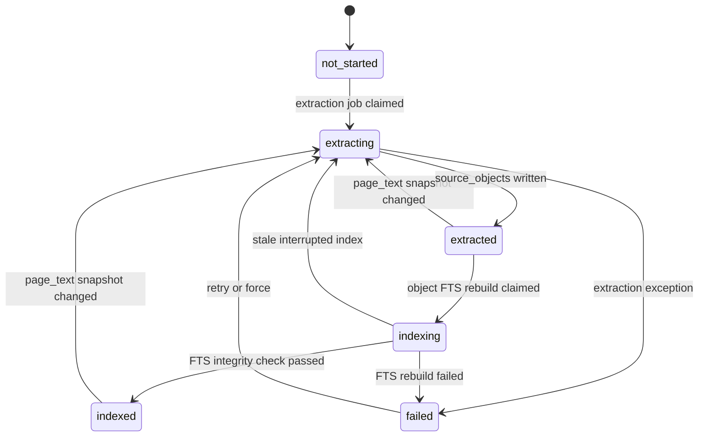
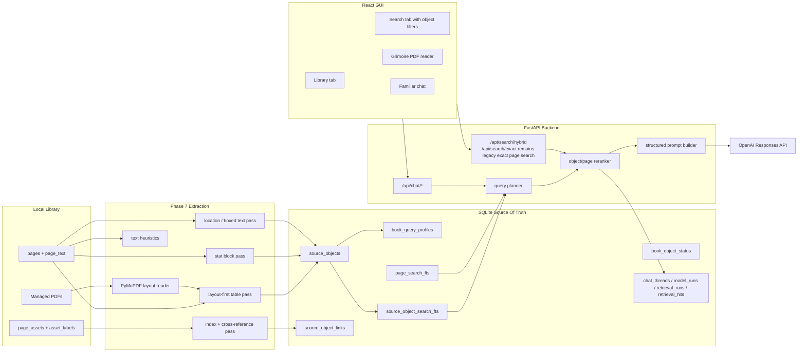

# Phase 7 Typed Source Object Retrieval Implementation Plan

> **For agentic workers:** REQUIRED SUB-SKILL: Use superpowers:subagent-driven-development (recommended) or superpowers:executing-plans to implement this plan task-by-task. Steps use checkbox (`- [ ]`) syntax for tracking.

**Goal:** Replace page-only Familiar retrieval with typed, confidence-scored local source objects for rules sections, tables, stat blocks, locations, boxed text, maps/images-as-links, and cross-references so rules answers are grounded in the actual source material instead of incidental page mentions.

**Architecture:** Keep SQLite as the app-owned source of truth and layer typed source-object extraction on top of existing managed PDFs, imported `page_text`, page-level FTS, source-set scopes, and chat/retrieval/model-run state. Phase 7 deliberately defers vector search and full visual intelligence; it first makes the library structurally searchable with deterministic extraction, layout-first table handling, query planning, reranking, and stronger grounded-answer behavior.

**Tech Stack:** Python 3.12, Conda, SQLite/WAL, SQLite FTS5, PyMuPDF, FastAPI, React/Vite/TypeScript, Vitest, Playwright, OpenAI Responses API through the existing backend provider boundary.

---

## 1. Source Boundary

This plan is based on the current live repo at `/Users/aftoncarlson/workspace/WFRP-Companion`.

Live-code sources used:

- `wfrp_companion/db/schema.sql`
- `wfrp_companion/search/fts.py`
- `wfrp_companion/search/scope.py`
- `wfrp_companion/assistant/retrieval.py`
- `wfrp_companion/assistant/prompts.py`
- `wfrp_companion/assistant/chat_service.py`
- `wfrp_companion/assistant/chat_store.py`
- `wfrp_companion/api/routes/search.py`
- `wfrp_companion/api/routes/chat.py`
- `wfrp_companion/api/schemas.py`
- `wfrp_companion/library/page_text_importer.py`
- `wfrp_companion/library/catalog.py`
- `frontend/src/components/library/LibrarySearchPanel.tsx`
- `frontend/src/components/chat/AgentChatPanel.tsx`
- `frontend/src/lib/apiClient.ts`
- `frontend/src/types/api.ts`
- `tools/extract_page_text.py`
- `tools/import_page_text.py`
- `tools/rebuild_fts.py`
- `tools/search_text.py`
- `tools/serve_api.py`

Wiki, ADR, and project-doc sources used:

- `CLAUDE.md`
- `AGENTS.md`
- `wiki/CONTEXT.md`
- `wiki/INDEX.md`
- `wiki/topics/ai-rag-system.md`
- `wiki/topics/pdf-library-and-ingestion.md`
- `wiki/topics/target-architecture.md`
- `wiki/topics/implementation-standards.md`
- `wiki/topics/testing-posture-and-conventions.md`
- `wiki/concepts/hybrid-search-for-rules.md`
- `wiki/concepts/private-copyright-boundary.md`
- `docs/adr/0001-conda-python-tooling.md`
- `docs/adr/0002-managed-local-pdf-storage.md`
- `docs/audits/2026-06-03-pdf-extraction-audit.md`
- `docs/audits/2026-06-03-page-text-ocr-extraction.md`
- `docs/plans/2026-06-05-phase-6-familiar-rag-chat-implementation-plan.md` as current local chat/retrieval context only, not as authority over this phase.

Official third-party documentation used:

- PyMuPDF documentation for `page.get_text("dict")`, `page.get_text("blocks")`, word/block bounding-box extraction, and `page.find_tables()`:
  - `https://pymupdf.readthedocs.io/`
  - `https://github.com/pymupdf/PyMuPDF`
- Existing project OpenAI integration remains bounded by the already implemented backend provider wrapper. No new OpenAI feature surface is introduced in this phase.

Sources intentionally excluded as architectural input:

- Older implementation plans are excluded except where their decisions are already reflected in live code, ADRs, or compiled wiki.
- User-owned WFRP PDFs, ignored OCR JSON, local indexes, and extracted book text are not quoted or committed.
- OpenAI File Search, hosted vector stores, Cosmos-style local NoSQL, Azure, PostgreSQL, and image-generation tools are excluded from this phase.

## 2. Current Live-Code Diagnosis

The current app has the right local-first backbone but the retrieval evidence is too coarse.

Concrete live-code problems:

- `wfrp_companion/search/fts.py` builds `page_search` and `page_search_fts` over whole pages. It stores `page_id`, `book_id`, `category`, `title`, `page_number`, and full page `text`, but no section, table, stat-block, location, map, or heading records.
- `wfrp_companion/assistant/retrieval.py` uses `query_candidates()` to split the user query into phrase/token candidates, calls `search_exact()`, de-dupes by `page_id`, loads full page text with `load_page_text()`, and slices a `context_window()`. That means a random page containing the words "critical" and "hit" can outrank the actual critical-hit table or rules section.
- `retrieval_hits` in `wfrp_companion/db/schema.sql` records only `retrieval_run_id`, `page_id`, `score`, `rank`, and `snippet`. It cannot say whether a hit is a rule section, table, table row, NPC stat block, monster profile, adventure location, or map reference.
- `wfrp_companion/assistant/prompts.py` passes page snippets as plain text blocks like `[1] Book p. N`. The prompt does not receive structured evidence type, heading path, confidence, table headers, stat labels, or source-object citations.
- The current prompt instructs Familiar to say when context is insufficient, but it still allows general WFRP knowledge to leak into answers when retrieval is weak. The bad "critical hit rules" answer is the visible symptom.
- Tables are buried inside OCR/page text. Search can match tokens from a table, but it cannot preserve caption, headers, row order, or identify the object as a table.
- NPC and monster stat blocks are buried inside page text. The app cannot boost profile fields such as `WS`, `BS`, `S`, `T`, `W`, skills, talents, traits, weapons, armor, or special rules.
- Adventure location descriptions, boxed text, encounters, and map references are not typed. Search cannot distinguish a named location description from incidental lore.
- `page_assets` and `asset_labels` already exist for images/maps, but retrieval does not use them as linked visual evidence.
- Source-set scoping and chat thread snapshots are good and must stay. `chat_thread_source_books` is the right boundary for which books Familiar may use in a thread.
- The OCR-heavy corpus is a hard constraint, not an edge case. `tools/extract_page_text.py` currently stores normalized OCR/page text and basic page counts; it does not preserve OCR word bounding boxes or table geometry in imported `page_text`. Layout-first extraction can use PyMuPDF geometry for born-digital pages, but OCR-derived pages must be text-heuristic-first with lower confidence until a later OCR-layout enhancement exists.
- `wfrp_companion/db/connection.py` initializes SQLite by replaying `schema.sql`; it does not apply ALTER/rebuild migrations. Phase 7 changes CHECK constraints and the `retrieval_hits` primary-key shape, so PR 1 must introduce explicit local migrations rather than relying on `create table if not exists`.
- `wfrp_companion/assistant/chat_service.py` currently constructs the provider before retrieval. That means a missing or quota-failed `OPENAI_API_KEY` can fail before retrieval is recorded. Phase 7 must move retrieval and retrieval-run persistence before provider construction.

Ownership issues to fix:

- Source structure is not owned anywhere. Page text is canonical, page FTS is rebuildable, but there is no app-owned table for "this span is the Critical Hits table" or "this span is an NPC profile."
- Retrieval confidence is implicit in scores from mixed candidate searches. It needs explicit query intent, object type, rank reasons, and confidence.
- The frontend displays citations, but it cannot show source type, weak retrieval warnings, or object-aware search filters because the API does not expose that data.

## 3. Architecture Decision

Implement a typed source-object layer over the existing local library.

Recommended target:

- Add deterministic source-object extraction from imported `page_text` plus managed PDF layout metadata.
- Store source objects in SQLite as durable private local metadata.
- Build a separate SQLite FTS5 projection for source objects.
- Add a query planner that classifies user questions into retrieval intents.
- Add a hybrid object/page retrieval path that searches typed object FTS first and keeps page FTS as fallback.
- Add reranking that considers exact phrase matches, heading matches, object type, table/stat/location confidence, book query profile, and source-set scope.
- Preserve page citations and add object-aware citations.
- Add a backend confidence gate so weak retrieval becomes an app-owned deterministic "I did not find the rule/table/stat block in the enabled sources" response instead of a generic model answer. Prompt instructions are a second line of defense, not the source of truth.

Why this fits the codebase:

- The app already has local managed PDFs, page text, page IDs, source sets, chat threads, retrieval runs, and page citations.
- SQLite is already the app-owned metadata source of truth. Typed source objects are relational, inspectable, and naturally tied to books/pages.
- PyMuPDF is already in the intended PDF extraction stack and supports text/layout metadata plus table detection. It is a better fit for table extraction than plain regex over OCR text alone.
- Vector search is useful later, but vectors over unstructured page blobs would embed the current problem. Structure first, semantic search later.

Approaches to avoid:

- Do not fix only "critical hits." That would mask the systemic retrieval failure.
- Do not stuff all rulebooks into every prompt by default. High context windows should receive curated evidence, not the entire library.
- Do not use vector-only retrieval. Exact names, tables, page references, NPCs, monsters, careers, talents, and spell names require exact search.
- Do not move AI metadata to a local NoSQL database. SQLite is already transactional, local, queryable, and sufficient for this app's workflow state.
- Do not build full image understanding now. Maps/images should be linked to pages and existing `page_assets` for now.

## 4. Target State Model

This phase needs a formal source-object extraction lifecycle. The source of truth is `book_object_status.status`, not frontend inference or the presence of FTS rows.



Lifecycle ownership:

- `page_text` remains immutable imported page text for the current source snapshot.
- `source_objects` is the canonical structured evidence table.
- `source_object_search` and `source_object_search_fts` are rebuildable projections.
- `book_object_status` owns extraction/index readiness per book.
- `ingest_jobs` owns idempotent worker claims and retries.
- `retrieval_runs.metadata_json` owns query intent and retrieval strategy for a chat turn.

Status rows are created explicitly before guarded transitions. A new eligible book must get:

```sql
insert into book_object_status (book_id, status, updated_at)
values (?, 'not_started', ?)
on conflict(book_id) do nothing;
```

Snapshot drift applies to `extracted`, `indexing`, and `indexed`. A stale `extracting` or `indexing` row is recoverable by the extraction tools using the same stale-running pattern already used by the existing import and FTS jobs.

No formal state machine is needed for individual source objects. Individual objects are replaced as part of a per-book extraction snapshot.

## 5. Target Architecture Diagram



## 6. Proposed Data Model / Contracts

### Schema Migration Mechanism

Phase 7 cannot be applied by replaying `schema.sql` alone. It changes CHECK constraints and the `retrieval_hits` primary-key shape. PR 1 must introduce explicit local migrations before adding the source-object schema.

Add:

```sql
create table if not exists schema_migrations (
  id text primary key,
  applied_at text not null
);
```

Create:

- `wfrp_companion/db/migrations.py`
- `wfrp_companion/db/migration_files/0001_phase_7_source_objects.sql`
- `tools/migrate_db.py`
- `tests/db/test_migrations.py`
- `tests/tools/test_migrate_db.py`

Migration rules:

- `initialize_database()` may continue creating a fresh database from `schema.sql`.
- `tools/migrate_db.py` applies versioned migrations to existing local DBs by using `open_connection()`, not `initialize_database()`, so it does not accidentally replay the post-migration schema before the migration runs.
- Every migration runs inside a transaction, records `schema_migrations.id`, and is idempotent by ID.
- Existing data must be preserved.
- Migration output must list table/count changes only; it must not print source-object text or page text.

Phase 7 migration must rebuild these existing tables because SQLite cannot alter CHECK constraints or primary keys in place:

- `ingest_jobs`, to allow `extract_source_objects` and `rebuild_source_object_fts`.
- `model_runs`, to allow `provider='local'` for backend deterministic insufficient-context responses.
- `retrieval_hits`, to replace primary key `(retrieval_run_id, page_id)` with `id text primary key`.

### Tables

Add `source_objects`:

```sql
create table if not exists source_objects (
  id text primary key,
  book_id text not null references books(id) on delete cascade,
  page_id text not null references pages(id) on delete cascade,
  object_type text not null,
  parent_object_id text references source_objects(id) on delete cascade,
  title text,
  heading_path_json text not null default '[]',
  page_start integer not null,
  page_end integer not null,
  char_start integer,
  char_end integer,
  bbox_json text,
  text text not null,
  search_text text not null,
  metadata_json text not null default '{}',
  confidence real not null default 0,
  extraction_method text not null,
  text_snapshot_sha256 text not null,
  created_at text not null,
  updated_at text not null,
  foreign key (page_id, book_id, page_start)
    references pages(id, book_id, page_number) on delete cascade,
  check(object_type in (
    'rule_section',
    'table',
    'table_row',
    'stat_block',
    'npc_profile',
    'monster_profile',
    'location_description',
    'encounter',
    'boxed_text',
    'map_reference',
    'image_reference',
    'index_entry',
    'cross_reference',
    'page_chunk'
  )),
  check(confidence >= 0 and confidence <= 1),
  check(page_start >= 1),
  check(page_end >= page_start)
);
```

`source_objects.id` must be deterministic across idempotent re-extraction when the underlying text has not changed:

```text
source_object_id = "{book_id}:p{page_start}-p{page_end}:{object_type}:{ordinal}:{normalized_text_sha256_12}"
```

The ordinal is only within the same `(book_id, page_start, object_type, heading/title bucket)`. If OCR text changes and the object ID changes, retrieval-hit snapshot fields still preserve historical chat citation context.

Add `source_object_links`:

```sql
create table if not exists source_object_links (
  id text primary key,
  from_object_id text not null references source_objects(id) on delete cascade,
  to_object_id text references source_objects(id) on delete cascade,
  to_book_id text references books(id) on delete set null,
  to_page_id text references pages(id) on delete set null,
  link_type text not null,
  label text,
  confidence real not null default 0,
  evidence_json text not null default '{}',
  created_at text not null,
  check(link_type in (
    'index_entry',
    'cross_reference',
    'same_section',
    'table_row',
    'stat_profile',
    'map_reference',
    'image_reference',
    'entity_mention'
  )),
  check(confidence >= 0 and confidence <= 1)
);
```

Add `book_object_status`:

```sql
create table if not exists book_object_status (
  book_id text primary key references books(id) on delete cascade,
  status text not null,
  object_count integer not null default 0,
  table_count integer not null default 0,
  stat_block_count integer not null default 0,
  location_count integer not null default 0,
  text_snapshot_sha256 text,
  last_error text,
  updated_at text not null,
  check(status in ('not_started', 'extracting', 'extracted', 'indexing', 'indexed', 'failed')),
  check(object_count >= 0),
  check(table_count >= 0),
  check(stat_block_count >= 0),
  check(location_count >= 0)
);
```

Add `book_query_profiles`:

```sql
create table if not exists book_query_profiles (
  book_id text not null references books(id) on delete cascade,
  query_type text not null,
  confidence real not null,
  evidence_json text not null default '{}',
  updated_at text not null,
  primary key(book_id, query_type),
  check(query_type in (
    'rules_lookup',
    'table_lookup',
    'stat_block_lookup',
    'npc_lookup',
    'monster_lookup',
    'location_lookup',
    'adventure_scene_lookup',
    'lore_lookup',
    'source_navigation'
  )),
  check(confidence >= 0 and confidence <= 1)
);
```

Add rebuildable object-search projection:

```sql
create table if not exists source_object_search (
  rowid integer primary key,
  source_object_id text not null unique references source_objects(id) on delete cascade,
  book_id text not null references books(id) on delete cascade,
  page_id text not null references pages(id) on delete cascade,
  object_type text not null,
  title text,
  heading_path text not null,
  page_start integer not null,
  page_end integer not null,
  confidence real not null,
  search_text text not null
);

create virtual table if not exists source_object_search_fts using fts5(
  title,
  heading_path,
  object_type,
  search_text,
  content='source_object_search',
  content_rowid='rowid'
);
```

Modify existing tables:

- Rebuild `retrieval_hits` to this target shape:

```sql
create table retrieval_hits (
  id text primary key,
  retrieval_run_id text not null references retrieval_runs(id) on delete cascade,
  page_id text not null references pages(id),
  source_object_id text references source_objects(id) on delete set null,
  score real not null,
  rank integer not null,
  snippet text,
  object_type_snapshot text,
  title_snapshot text,
  heading_path_snapshot_json text not null default '[]',
  confidence_snapshot real,
  rank_reasons_json text not null default '[]',
  text_snapshot_sha256 text,
  metadata_json text not null default '{}',
  check(confidence_snapshot is null or (confidence_snapshot >= 0 and confidence_snapshot <= 1))
);
```

- Copy existing retrieval hit rows during migration with IDs like `legacy:{retrieval_run_id}:{page_id}`, `source_object_id=null`, `object_type_snapshot='page_fallback'`, and empty JSON snapshot fields.
- Add uniqueness to support multiple object hits on the same page while preserving one page fallback per page:

```sql
create unique index if not exists ux_retrieval_hits_run_source_object
on retrieval_hits(retrieval_run_id, source_object_id)
where source_object_id is not null;

create unique index if not exists ux_retrieval_hits_run_page_fallback
on retrieval_hits(retrieval_run_id, page_id)
where source_object_id is null;

create unique index if not exists ux_retrieval_hits_run_rank
on retrieval_hits(retrieval_run_id, rank);
```

- Rebuild `ingest_jobs` so `job_type` allows `extract_source_objects` and `rebuild_source_object_fts`.
- Rebuild `model_runs` so `provider` allows `local` in addition to `openai` and `fake`.
- Update `schema.sql` to represent the post-migration fresh-database shape.

### Contracts

Backend dataclasses:

- `SourceObject`
- `SourceObjectHit`
- `QueryPlan`
- `RetrievalEvidence`
- `RetrievalContext`
- `HybridSearchRequest`
- `HybridSearchResponse`

`SourceObjectHit` must include:

- `source_object_id`
- `object_type`
- `book_id`
- `title`
- `category`
- `page_id`
- `page_number`
- `heading_path`
- `snippet`
- `context_text`
- `score`
- `rank`
- `confidence`
- `rank_reasons`
- `metadata`

Ranking thresholds:

- `strong`: `confidence >= 0.72`
- `usable`: `0.45 <= confidence < 0.72`
- `weak`: `confidence < 0.45` or no hits

Prompt context caps:

- Maximum one object block: `1,600` characters.
- Maximum total Familiar retrieval context: existing `AppConfig.chat_context_char_limit`.
- Table blocks may include headers and the top matching rows first, then truncate.
- Logs and CLI output must not print object `text`; they may print IDs, counts, types, confidence, book/page, and errors.

Hybrid search endpoint:

- Add `GET /api/search/hybrid`.
- Keep `GET /api/search/exact` unchanged for page-only exact search compatibility.
- Query parameters:
  - `query: str`
  - `limit: int = 20`
  - `object_type: list[str] | None`
  - `source_set_id: str | None`
  - `book_id: list[str] | None`
  - `all_books: bool = false`
- Response fields:
  - `query`
  - `query_type`
  - `scope`
  - `confidence`
  - `hits`
- Each hit contains the existing search fields plus nullable `source_object_id`, `object_type`, `heading_path`, `confidence`, `rank_reasons`, and `result_kind` where `result_kind in ('source_object', 'page_fallback')`.

`metadata_json` object conventions:

- Tables: `caption`, `headers`, `rows`, `bbox`, `table_method`, `row_count`, `column_count`.
- Stat blocks: `profile_name`, `profile_type`, `stats`, `skills`, `talents`, `traits`, `weapons`, `armor`, `special_rules`.
- Locations: `location_name`, `parent_location`, `scene_tags`, `boxed_text`, `encounter_refs`.
- Maps/images: `asset_id`, `label`, `bbox`, `linked_only: true`.
- Query profiles: evidence counts by object type, folder category, title words, heading hits.

## 7. External Integration Design

OpenAI Responses API:

- Source of truth boundary: OpenAI generates language only. SQLite owns retrieval state, citations, messages, model-run state, and retry state.
- Written to OpenAI: bounded user question, recent chat context when enabled, structured retrieved evidence, and instruction text.
- Not written to OpenAI: full PDFs, full books, local filesystem paths, API keys, extracted whole-library text, or source-object indexes.
- Idempotency: model calls use existing `model_runs.id` as request identity. Retried runs create a new `model_runs` row with `retry_of_model_run_id`.
- Retry behavior: provider failures set `model_runs.status='failed'`; user retry creates a new queued model run and reuses current retrieval code.
- Success: assistant message persisted, citations persisted, `model_runs.status='completed'`.
- Failure: failed event streams to Familiar with `error_code` and user-readable `error_message`.
- Provider construction must happen after retrieval has been recorded. If OpenAI is unavailable, the retrieval run and evidence still exist for debugging.
- Weak/no-evidence factual lookups must not call OpenAI. The backend writes a deterministic assistant message with `model_runs.provider='local'`, `model_runs.model='retrieval-confidence-gate'`, and `model_runs.status='completed'`.
- If OpenAI is down or quota fails: retrieval should still be logged; model run fails cleanly; local search and Grimoire remain usable.

PyMuPDF:

- Source of truth boundary: PyMuPDF supplies deterministic local PDF layout/text/table geometry only. SQLite stores the app-owned extracted object rows.
- Read from PyMuPDF: page text dictionaries, text blocks, word coordinates, table candidates via `page.find_tables()`, and bounding boxes where available.
- Idempotency: extraction job key includes `book_id` and current page-text snapshot hash.
- Retry behavior: failed extraction marks `book_object_status.status='failed'` and stores a short error. A later run with `--retry-running` or `--force` may rebuild the book.
- If a managed PDF is unavailable: fall back to page-text-only extraction for rule sections/page chunks and mark layout-dependent object types lower confidence.
- If a page's imported `page_text.extraction_method` is OCR-derived and no word boxes are available, table/stat/location extraction uses text heuristics first, sets `metadata_json.ocr_layout_available=false`, and caps initial confidence at `0.68` unless later evidence raises it.

No other external systems are involved.

## 8. Core Flow Design

### 8.1 Source Object Extraction Flow

1. Resolve eligible books:
   - `books.copy_status='copied'`
   - `books.text_status='imported'`
   - `books.search_status='indexed'`
2. Compute a per-book `text_snapshot_sha256` from `page_text.text_sha256` ordered by `page_id`.
3. Skip a book when `book_object_status.status='indexed'` and snapshot matches, unless `--force`.
4. Insert a `book_object_status` row if it does not exist.
5. Claim `ingest_jobs(job_type='extract_source_objects')` with idempotency key `extract_source_objects:{book_id}:{text_snapshot_sha256}`.
6. Transition `book_object_status.status` to `extracting` with a guarded update.
7. Recover stale `extracting` rows when `updated_at` is older than `--stale-running-minutes` or when `--retry-running` is passed.
8. Load page text from SQLite and layout metadata from managed PDF when present.
9. Run extraction passes in deterministic order:
   - `extract_rule_sections(book_pages, layout_pages)`;
   - `extract_tables_from_page(page_text, layout_page)`;
   - `extract_stat_blocks(book_pages, layout_pages)`;
   - `extract_locations(book_pages, layout_pages)`;
   - `link_page_assets(book_id, source_objects)`;
   - `extract_cross_references(book_pages, source_objects)`;
   - `create_page_chunk_fallbacks(book_pages, covered_spans)`.
10. Replace source objects for the book inside a short transaction.
11. Write `book_query_profiles` based on object counts, headings, category, and title evidence.
12. Set `book_object_status.status='extracted'`.

Object FTS rebuild is global for Phase 7, matching the current `page_search_fts` design:

- idempotency key: `rebuild_source_object_fts:global:{objects_snapshot_sha256}`
- eligible books: `book_object_status.status in ('extracted', 'indexed')`
- output status: each successfully represented book becomes `indexed`
- stale `indexing` rows are recoverable by `--retry-running`

PRs may later optimize to per-book object FTS refresh, but the first implementation should stay global and simple.

Status row creation:

```sql
insert into book_object_status (book_id, status, updated_at)
values (?, 'not_started', ?)
on conflict(book_id) do nothing;
```

Guarded claim:

```sql
update book_object_status
set status = 'extracting',
    text_snapshot_sha256 = ?,
    last_error = null,
    updated_at = ?
where book_id = ?
  and status in ('not_started', 'failed', 'extracted', 'indexed')
  and (
    status = 'failed'
    or text_snapshot_sha256 is null
    or text_snapshot_sha256 != ?
    or ? = 1
  );
```

The final `? = 1` is the `force` flag. A failed book is retryable with the same snapshot without requiring `--force`; `--force` is for rebuilding otherwise-current extracted/indexed books.

Extraction failure:

```sql
update book_object_status
set status = 'failed',
    last_error = ?,
    updated_at = ?
where book_id = ?;
```

Extraction output must not be printed to the terminal. Tool output may report counts by object type and failed book IDs.

Old high-level flow, retained for orientation:

1. Resolve eligible books.
2. Compute snapshot.
3. Claim job.
4. Extract objects.
5. Write objects and profiles.
6. Rebuild object FTS.

### 8.2 Layout-First Table Flow

1. Call `extract_tables_from_page(page_text: PageTextRecord, layout_page: LayoutPage | None) -> list[SourceObjectDraft]`.
2. Call PyMuPDF table detection on each page when the managed PDF is available.
3. Convert each table candidate to:
   - caption/title from nearby heading text;
   - headers;
   - rows/cells;
   - bbox;
   - searchable text.
4. Use text/word geometry to recover or validate row/column boundaries.
5. For OCR-heavy pages where geometry is unavailable, run `extract_tables_from_text(page_text: str)`.
6. Text-only table heuristics must look for repeated separators, aligned stat abbreviations, d100 ranges, row labels, column header patterns, repeated numeric columns, and known table words like `Roll`, `Result`, `Modifier`, `Location`, `Damage`, `Critical`, and `Effect`.
7. Confidence targets:
   - `0.85`: PyMuPDF table with headers and 2+ rows.
   - `0.72`: layout geometry plus strong caption/heading.
   - `0.55`: OCR/text-only candidate with repeated row pattern and title.
   - `0.35`: weak table-like text; store only as `page_chunk` unless the user later adds manual review tooling.
8. Store high-confidence tables as `object_type='table'` with child `table_row` objects.
9. Store uncertain but usable tables as `object_type='table'` with lower `confidence` and `metadata_json.table_method='ocr_text_candidate'`.
10. Never discard the original page citation. Every table object must open the exact PDF page.

### 8.3 Stat Block Flow

1. Call `extract_stat_blocks(book_pages: Sequence[PageRecord], layout_pages: Mapping[int, LayoutPage | None]) -> list[SourceObjectDraft]`.
2. Detect profile headers such as `Main Profile`, `Secondary Profile`, `WS`, `BS`, `S`, `T`, `Ag`, `Int`, `WP`, `Fel`, `A`, `W`, `SB`, `TB`, `M`, `Mag`, `IP`, and `FP`.
3. Extract profile names from nearby headings or title-like spans when layout metadata exists; otherwise use nearest preceding non-empty line.
4. Parse rows into `metadata_json.stats` while preserving raw text.
5. Detect skills, talents, traits, armor, weapons, trappings, and special rules as labeled fields.
6. Classify `npc_profile` versus `monster_profile` using title/category/heading evidence and profile labels.
7. Confidence targets:
   - `0.86`: named profile with main/secondary rows and at least one labeled section.
   - `0.70`: named profile with stat abbreviations and partial labeled sections.
   - `0.52`: unnamed stat-like block.
   - below `0.45`: keep as page fallback/chunk, not profile evidence.
8. Store ambiguous blocks as `stat_block` with lower confidence.

### 8.4 Adventure Location Flow

1. Call `extract_locations(book_pages: Sequence[PageRecord], layout_pages: Mapping[int, LayoutPage | None]) -> list[SourceObjectDraft]`.
2. Detect location headings from heading hierarchy, adventure category, title-like text, and numbered/lettered room patterns.
3. Create `location_description` objects for descriptive sections.
4. Create `boxed_text` objects for boxed/read-aloud style blocks when detected by layout boxes, indentation, or text cues such as imperative read-aloud framing.
5. Create `encounter` objects when location text includes encounter/NPC/stat references.
6. Link nearby map/image assets with `map_reference` or `image_reference`, using existing `page_assets` and `asset_labels` when available.
7. Confidence targets:
   - `0.80`: clear heading plus descriptive body in an adventure category.
   - `0.64`: heading-like line plus location cues.
   - `0.48`: possible room/area text; usable but low confidence.
   - below `0.45`: page fallback only.

### 8.5 Query Planning And Retrieval Flow

1. Classify the query into one query type:
   - `rules_lookup`
   - `table_lookup`
   - `stat_block_lookup`
   - `npc_lookup`
   - `monster_lookup`
   - `location_lookup`
   - `adventure_scene_lookup`
   - `lore_lookup`
   - `source_navigation`
2. Resolve scope from `chat_thread_source_books` for Familiar or from request parameters for Search.
3. Run object FTS against scoped books.
4. Run page FTS fallback against scoped books.
5. Merge candidates by `(source_object_id, page_id)`.
6. Apply boosts:
   - exact phrase in title/heading;
   - object type matches query type;
   - table/stat/location confidence;
   - `book_query_profiles` confidence;
   - source category matches query type;
   - index/cross-reference links point to the object.
7. Penalize weak candidates:
   - object type mismatch;
   - only generic token match;
   - low-confidence OCR-only table candidate;
   - page fallback with no typed object when typed objects exist.
8. Compute final confidence:
   - base object confidence: `0.35`;
   - exact phrase in title or heading: `+0.20`;
   - object type matches query type: `+0.18`;
   - exact phrase in body/search text: `+0.12`;
   - book query profile match: `+0.10 * profile_confidence`;
   - table/stat/location specialized parser confidence multiplier: `* parser_confidence`;
   - page fallback only: cap at `0.44` unless no typed objects exist for the scoped books.
9. Clamp confidence to `0..1`.
10. Record `retrieval_runs.metadata_json` with query type, candidate counts, ranking version, source confidence, and rank reasons.
11. Return top evidence to prompt construction.

Concrete APIs:

```python
def classify_query(query: str) -> QueryPlan: ...
def search_source_objects(config: AppConfig, plan: QueryPlan, scope: SearchScope, limit: int) -> tuple[SourceObjectHit, ...]: ...
def merge_candidates(object_hits: Sequence[SourceObjectHit], page_hits: Sequence[PageFallbackHit]) -> tuple[RetrievalCandidate, ...]: ...
def score_candidate(candidate: RetrievalCandidate, plan: QueryPlan) -> ScoredEvidence: ...
def retrieve_context(config: AppConfig, thread_id: str, query: str, *, hit_limit: int, total_char_limit: int, window_chars: int) -> RetrievalContext: ...
```

### 8.6 Familiar Answer Flow

1. `chat_service.py` transitions model run to `retrieving`.
2. New retrieval module returns structured evidence, not only page snippets.
3. Retrieval run and hits are persisted before provider call.
4. Apply backend confidence gate before provider construction:
   - for factual query types `rules_lookup`, `table_lookup`, `stat_block_lookup`, `npc_lookup`, `monster_lookup`, `location_lookup`, and `source_navigation`, no hits or `source_confidence < 0.45` completes locally without calling OpenAI;
   - the local response is persisted as an assistant message with citations if any weak page fallback exists;
   - the local response says the enabled source books did not produce enough evidence and suggests opening/searching sources;
   - `model_runs.provider='local'`, `model_runs.model='retrieval-confidence-gate'`, and `model_runs.status='completed'`.
5. Prompt builder includes evidence blocks with type labels:
   - `Rule Section`
   - `Table`
   - `Stat Block`
   - `Location`
   - `Page Fallback`
6. If retrieval confidence is usable but not strong, prompt builder instructs Familiar to qualify the answer and avoid unsupported claims.
7. Provider response streams as today for usable/strong evidence.
8. Citation objects include `source_object_id` when available and still open the exact page in Grimoire.

## 9. UX / Surface Behavior

### Library

- The Library tab remains the per-book source selector grouped by folder/category.
- Add object-index readiness only as compact metadata when useful:
  - `Objects indexed`
  - `Objects failed`
  - `Objects need rebuild`
- Do not make the Library tab an extraction-control console in this phase.

### Search

Add source-object-aware filters:

| Filter | Object types |
| --- | --- |
| All | object hits plus page fallback |
| Rules | `rule_section`, `cross_reference`, `index_entry` |
| Tables | `table`, `table_row` |
| Stat Blocks | `stat_block`, `npc_profile`, `monster_profile` |
| Locations | `location_description`, `encounter`, `boxed_text` |
| Maps/Images | `map_reference`, `image_reference` |

Search result behavior:

- `SearchTab` calls `apiClient.searchHybrid()` against `GET /api/search/hybrid`.
- `/api/search/exact` remains available for direct page-level debugging and compatibility.
- Show object type label and confidence indicator.
- Show full scrollable result text where needed.
- Keep the small book/open-page icon that opens the exact PDF page.
- Do not expose local paths.
- Do not render raw whole pages by default unless the user expands text already available through the existing guarded page-text endpoint.

### Familiar

State-to-surface rules:

| Retrieval state | Familiar behavior |
| --- | --- |
| Strong typed evidence | Answer with citations and clear rule/table/stat labels. |
| Mixed typed + page fallback | Answer with citations and avoid overclaiming weak parts. |
| Page fallback only | Say the answer is based on page-level matches and cite pages. |
| Weak/no evidence | Say the enabled books did not produce enough context; offer to search/open sources. |
| Provider failure | Preserve retrieval citations if available and show retry. |

Familiar citations:

- Display book title and page.
- Include object type when available.
- Open the exact PDF page in Grimoire.
- Later highlighting can use `bbox_json`, but this phase does not need visual page highlights.

### Grimoire

- No reader layout changes are required.
- Citations continue to open the exact source page.
- Maps/images remain linked to pages rather than extracted into a separate visual browser.

## 10. Implementation Sequence

### PR 1: Schema And Storage Contracts

Scope:

- Add a local migration mechanism, source-object schema, status tables, indexes, and schema tests.
- Add package modules with dataclasses and no extraction behavior yet.

Files:

- Modify: `wfrp_companion/db/schema.sql`
- Create: `wfrp_companion/db/migrations.py`
- Create: `wfrp_companion/db/migration_files/0001_phase_7_source_objects.sql`
- Create: `tools/migrate_db.py`
- Modify: `tests/db/test_schema.py`
- Create: `tests/db/test_migrations.py`
- Create: `tests/tools/test_migrate_db.py`
- Create: `wfrp_companion/source_objects/__init__.py`
- Create: `wfrp_companion/source_objects/models.py`
- Create: `tests/source_objects/test_models.py`

Tasks:

- [x] Add `schema_migrations` and a migration runner that works against existing local DBs.
- [x] Add migration tests proving a Phase 6 DB is upgraded without data loss.
- [x] Add `source_objects`, `source_object_links`, `book_object_status`, `book_query_profiles`, `source_object_search`, and `source_object_search_fts`.
- [x] Rebuild `ingest_jobs` so `job_type` includes `extract_source_objects` and `rebuild_source_object_fts`.
- [x] Rebuild `model_runs` so `provider` includes `local`.
- [x] Rebuild `retrieval_hits` to the new `id text primary key` shape with nullable `source_object_id` and durable snapshot fields.
- [x] Copy existing retrieval hit rows into the new shape with `source_object_id=null` and `object_type_snapshot='page_fallback'`.
- [x] Add schema tests for object type constraints, confidence checks, object/page foreign keys, and retrieval hit uniqueness.
- [x] Run `python -m pytest tests/db/test_schema.py tests/db/test_migrations.py tests/tools/test_migrate_db.py tests/source_objects/test_models.py -q`.

What does not change yet:

- `search_exact()` stays page-level.
- Familiar still uses existing page retrieval.
- No extraction command exists yet.

### PR 2: Deterministic Extraction Foundation

Scope:

- Implement source-object extraction from imported page text and managed PDF layout.
- Start with rule sections, heading paths, page chunks, and status lifecycle.

Files:

- Create: `wfrp_companion/source_objects/extractor.py`
- Create: `wfrp_companion/source_objects/layout.py`
- Create: `wfrp_companion/source_objects/store.py`
- Create: `tools/extract_source_objects.py`
- Create: `tests/source_objects/test_extractor.py`
- Create: `tests/source_objects/test_store.py`
- Create: `tests/tools/test_extract_source_objects.py`

Tasks:

- [ ] Implement per-book text snapshot hashing.
- [ ] Implement guarded extraction job claim and stale-running recovery.
- [ ] Implement page text loading from SQLite.
- [ ] Implement PyMuPDF layout loading from `books.managed_pdf_path` when available.
- [ ] Implement OCR-derived page detection from imported page metadata and cap layout-dependent confidence when word geometry is unavailable.
- [ ] Extract `rule_section` objects from heading patterns and page text spans.
- [ ] Create `page_chunk` fallback objects for pages/regions not covered by stronger types.
- [ ] Persist `book_object_status`.
- [ ] Add synthetic born-digital and OCR-only fixtures with fake RPG-like text, not WFRP book text.
- [ ] Run focused extractor/store/tool tests.

What does not change yet:

- No table/stat/location specialized extraction.
- No chat integration.

### PR 3: Tables, Stat Blocks, Locations, And Linked Visuals

Scope:

- Add the extraction passes that solve the actual retrieval-quality problem.

Files:

- Modify: `wfrp_companion/source_objects/extractor.py`
- Modify: `wfrp_companion/source_objects/layout.py`
- Create: `wfrp_companion/source_objects/tables.py`
- Create: `wfrp_companion/source_objects/stat_blocks.py`
- Create: `wfrp_companion/source_objects/locations.py`
- Create: `wfrp_companion/source_objects/links.py`
- Create: `tests/source_objects/test_tables.py`
- Create: `tests/source_objects/test_stat_blocks.py`
- Create: `tests/source_objects/test_locations.py`
- Create: `tests/source_objects/test_links.py`

Tasks:

- [ ] Implement `extract_tables_from_page()` with PyMuPDF `find_tables()` candidates.
- [ ] Implement `extract_tables_from_text()` for OCR/text fallback using repeated columns, d100 ranges, stat abbreviations, and header-like rows.
- [ ] Store table rows as child `table_row` objects.
- [ ] Implement `extract_stat_blocks()` with synthetic profile fixtures.
- [ ] Implement `npc_profile`, `monster_profile`, and ambiguous `stat_block` classification.
- [ ] Implement `extract_locations()` for location, boxed text, and encounter extraction.
- [ ] Link map/image references to existing `page_assets` rows when available.
- [ ] Generate `book_query_profiles` from folder/category/title/object evidence.
- [ ] Assert confidence thresholds: table high `>=0.72`, OCR candidate `>=0.55`, stat block usable `>=0.52`, location usable `>=0.48`.
- [ ] Run source-object test suite with coverage.

What does not change yet:

- Vector embeddings remain out of scope.
- Maps/images are linked only; no separate image viewer or visual search.

### PR 4: Object FTS, Query Planner, And Reranker

Scope:

- Make typed objects searchable and rank them better than page fallback.

Files:

- Create: `wfrp_companion/source_objects/fts.py`
- Create: `wfrp_companion/assistant/query_planner.py`
- Create: `wfrp_companion/assistant/reranker.py`
- Modify: `wfrp_companion/assistant/retrieval.py`
- Create: `tools/rebuild_source_object_fts.py`
- Create: `tools/search_objects.py`
- Create: `tests/source_objects/test_fts.py`
- Create: `tests/assistant/test_query_planner.py`
- Create: `tests/assistant/test_reranker.py`
- Modify: `tests/assistant/test_retrieval.py`

Tasks:

- [ ] Implement `rebuild_source_object_fts()`.
- [ ] Implement object search with source-set/book filters.
- [ ] Implement `classify_query()` with tests for all query types.
- [ ] Implement object/page candidate merge.
- [ ] Implement `score_candidate()` with explicit rank weights and rank reasons.
- [ ] Keep page FTS fallback when no typed object is strong enough.
- [ ] Add regression case where "critical hit rules" ranks a rule/table object above incidental page mentions.
- [ ] Add regression cases for table, NPC stat, monster profile, and location queries.

What does not change yet:

- Public API and frontend do not display object filters until PR 5.
- Familiar can still be switched to object retrieval behind backend tests first.

### PR 5: Familiar Prompt And Citation Upgrade

Scope:

- Feed structured evidence to Familiar and make weak retrieval honest.

Files:

- Modify: `wfrp_companion/assistant/prompts.py`
- Modify: `wfrp_companion/assistant/chat_service.py`
- Modify: `wfrp_companion/assistant/chat_store.py`
- Modify: `wfrp_companion/api/schemas.py`
- Modify: `wfrp_companion/api/routes/chat.py`
- Modify: `tests/assistant/test_prompts.py`
- Modify: `tests/assistant/test_chat_service.py`
- Modify: `tests/api/test_chat_routes.py`

Tasks:

- [ ] Extend citation schemas with nullable `source_object_id`, `object_type`, `heading_path`, and `confidence`.
- [ ] Persist object-aware retrieval hits.
- [ ] Move retrieval and retrieval-run recording before provider construction in `chat_service.py`.
- [ ] Add backend confidence gate for weak/no-evidence factual lookups that persists a local assistant response and does not call OpenAI.
- [ ] Update prompt context format to label `Rule Section`, `Table`, `Stat Block`, `Location`, and `Page Fallback`.
- [ ] Add chat service tests proving weak/no evidence does not call the provider.
- [ ] Add prompt tests proving usable-but-not-strong evidence is qualified and constrained.
- [ ] Add chat service tests proving retrieval metadata is recorded before provider calls.
- [ ] Keep streaming event shape backward-compatible where possible.

What does not change yet:

- No adventure generation.
- No campaign memory.
- No vector search.

### PR 6: Search UI, Familiar UX, Evaluation, And Wiki

Scope:

- Expose typed retrieval in the GUI and add an evaluation harness.

Files:

- Modify: `wfrp_companion/library/catalog.py`
- Modify: `wfrp_companion/api/routes/search.py`
- Modify: `wfrp_companion/api/schemas.py`
- Modify: `frontend/src/components/library/BookRow.tsx`
- Modify: `frontend/src/components/library/LibraryTab.tsx`
- Modify: `frontend/src/components/library/SearchTab.tsx`
- Modify: `frontend/src/components/library/SearchResultCard.tsx`
- Modify: `frontend/src/components/library/SearchResultGroup.tsx`
- Modify: `frontend/src/components/library/LibrarySearchPanel.test.tsx`
- Modify: `frontend/src/components/library/SearchTab.test.tsx`
- Modify: `frontend/src/components/library/LibraryTab.test.tsx`
- Modify: `frontend/src/components/chat/AgentChatPanel.tsx`
- Modify: `frontend/src/components/chat/AgentChatPanel.css`
- Modify: `frontend/src/lib/apiClient.ts`
- Modify: `frontend/src/lib/apiClient.test.ts`
- Modify: `frontend/src/types/api.ts`
- Create: `tests/retrieval/test_eval_cases.py`
- Create: `tests/fixtures/retrieval_eval_cases.json`
- Modify: `wiki/topics/ai-rag-system.md`
- Modify: `wiki/topics/pdf-library-and-ingestion.md`
- Modify: `wiki/topics/target-architecture.md`
- Modify: `wiki/topics/testing-posture-and-conventions.md`
- Modify: `wiki/log.md`

Tasks:

- [ ] Add `GET /api/search/hybrid`; keep `/api/search/exact` unchanged.
- [ ] Add `apiClient.searchHybrid()` and switch `SearchTab` to the hybrid endpoint.
- [ ] Add search object filters and result type labels.
- [ ] Add compact object-index readiness to `BookRow` only if the backend catalog exposes it; otherwise defer Library status display.
- [ ] Add Familiar retrieval confidence display for weak evidence.
- [ ] Keep citation click behavior opening exact Grimoire pages.
- [ ] Add synthetic eval cases for critical hits, fear/terror, spellcasting, table lookup, NPC stat block, monster profile, adventure location, boxed text, and map reference.
- [ ] Run full backend coverage gate.
- [ ] Run frontend tests, build, and e2e tests.
- [ ] Update wiki with the new source-object architecture and operational commands.

What does not change yet:

- No local vector DB.
- No page highlight overlay.
- No image extraction browser.

## 11. Testing Requirements

Testing is required in the same PR that changes behavior.

Backend test categories:

- Migration tests proving existing Phase 6 DBs upgrade without losing `chat_messages`, `retrieval_runs`, `retrieval_hits`, `ingest_jobs`, or `model_runs`.
- Schema tests for all new tables, constraints, indexes, and FTS tables.
- Extraction lifecycle tests for claim, skip-current, force, failed, stale-running recovery, and retry.
- Layout adapter tests with synthetic PDF/text fixtures.
- OCR-only synthetic fixture tests proving table/stat/location extraction degrades to lower-confidence text heuristics rather than failing or overclaiming.
- Table extraction tests for caption/header/row preservation and uncertain candidate confidence.
- Stat-block tests for profile rows, skills, talents, traits, weapons, armor, and ambiguous cases.
- Location/boxed-text tests for adventure-style sections.
- Object FTS tests for readiness gating and scoped book filtering.
- Query planner tests for all query types.
- Reranker tests proving object type, heading, exact phrase, and book profile boosts.
- Retrieval integration tests proving page fallback still works.
- Chat service tests proving weak/no-evidence factual lookups complete locally and do not call the provider.
- Prompt tests proving usable-but-not-strong retrieval is qualified and constrained.
- Chat route tests for object-aware citations and stream events.

Frontend test categories:

- Search tab object filters.
- Search result object labels and scroll behavior.
- Open-PDF-page button still opens the exact page.
- Familiar citation object type/confidence rendering.
- Familiar weak retrieval warning.
- Existing Grimoire tab/page behavior remains unchanged.

Coverage commands:

```bash
conda activate wfrp-companion
python -m pytest --cov=wfrp_companion --cov=tools.init_db --cov=tools.import_pdfs --cov=tools.import_page_text --cov=tools.rebuild_fts --cov=tools.search_text --cov=tools.source_sets --cov=tools.serve_api --cov=tools.extract_source_objects --cov=tools.rebuild_source_object_fts --cov=tools.search_objects --cov-report=term-missing --cov-fail-under=100
ruff check .
```

Frontend commands:

```bash
cd frontend
npm run test
npm run test:coverage
npm run build
npm run test:e2e
```

Fixtures must be synthetic or public-domain. Do not commit WFRP text excerpts.

## 12. Verification Matrix

End-to-end scenarios that must pass:

| Scenario | Expected result |
| --- | --- |
| Ask Familiar "Tell me about critical hit rules" | Familiar retrieves a rule/table object, cites exact book/page, and does not answer from generic memory. |
| Search "critical hit table" | Table object ranks above pages with incidental token matches. |
| Search a table row-like phrase | Matching `table_row` appears under its parent table with a page-open control. |
| Ask for a named NPC stat block | `npc_profile` or `stat_block` appears with profile fields and citation. |
| Ask for a monster's traits | `monster_profile` ranks above generic lore mentions. |
| Ask for an adventure location description | `location_description` ranks above broad chapter/page fallback. |
| Ask for boxed/read-aloud text | `boxed_text` is retrieved when detectable; otherwise page fallback says confidence is lower. |
| Ask for a map | Linked `map_reference`/`image_reference` opens the PDF page rather than pretending visual understanding. |
| Disable a book in Library before new chat | Familiar does not use that book in the new thread. |
| Toggle books after a chat thread exists | Existing thread continues using its `chat_thread_source_books` snapshot. |
| Extraction fails for one book | Other books remain searchable; failed book shows object status failure. |
| OpenAI quota/key unavailable | Retrieval still logs; model run fails cleanly; search/Grimoire keep working. |

## 13. Migration / Compatibility / Cleanup Strategy

Compatibility scaffolding:

- Keep `page_search` and `page_search_fts` as page fallback indefinitely.
- Keep existing `/api/search/exact` behavior until the object-aware search API is stable.
- Keep existing `ChatCitationResponse` fields and add nullable object fields instead of breaking callers.
- Existing chat threads and retrieval runs remain valid because migration copies legacy `retrieval_hits` into the new `id`-keyed table with `source_object_id=null` and durable snapshot fields.
- Historical object-aware retrieval hits remain useful after re-extraction because `retrieval_hits` snapshots `object_type`, `title`, `heading_path`, `confidence`, `rank_reasons`, and `text_snapshot_sha256` even if the linked `source_object_id` later becomes null.

Migration plan:

- PR 1 introduces `tools/migrate_db.py` and versioned migrations.
- The Phase 7 migration creates new tables, rebuilds `ingest_jobs`, rebuilds `model_runs`, rebuilds `retrieval_hits`, copies old rows, validates row counts, then records `schema_migrations.id='0001_phase_7_source_objects'`.
- Migration tests must create a minimal Phase 6 database fixture, apply the migration, and assert old chat/retrieval rows are still readable by `chat_store`.
- Fresh databases still use `schema.sql`; existing local databases use `tools/migrate_db.py`.

Backfill strategy:

- Safe cases:
  - Books with copied PDFs, imported page text, and indexed page FTS.
  - Pages with clean text/layout metadata.
  - Tables detected by PyMuPDF with stable rows/columns.
- Ambiguous cases:
  - OCR-heavy pages with broken word order.
  - Tables without clear captions.
  - Stat blocks split across columns or pages.
  - Adventure text with decorative headings.
- Quarantine/manual-review cases:
  - Extraction exceptions.
  - Managed PDF missing even though page text exists.
  - Pages with extremely low text density.
  - Objects with confidence below the storage threshold.

Operational surfacing:

- Ambiguous objects are stored with lower confidence, not hidden.
- Failed books are marked in `book_object_status.last_error`.
- Tool output should list counts and failures without printing copyrighted text.

Cleanup after rollout:

- Remove old page-only Familiar retrieval code only after object retrieval passes the verification matrix and eval tests.
- Do not delete `page_search` or page FTS; they remain useful fallback and direct search support.
- Do not delete `page_text`; it remains canonical imported text.

## 14. Operational Rollout Notes

Local rollout order:

1. Apply schema migrations:

```bash
conda activate wfrp-companion
python tools/migrate_db.py
```

2. Run current import/page-text/FTS pipeline if needed:

```bash
python tools/import_page_text.py
python tools/rebuild_fts.py
```

3. Run new extraction:

```bash
python tools/extract_source_objects.py --retry-running
python tools/rebuild_source_object_fts.py
```

4. Run eval:

```bash
python -m pytest tests/retrieval/test_eval_cases.py -q
```

5. Start local app:

```bash
python tools/dev.py
```

No Azure, firewall, hosted DB, or deployment cutover is needed. Generated data remains local under ignored `data/` and SQLite files.

Recovery mechanics:

- If migration fails, it must roll back its transaction and leave the previous DB shape intact.
- If migration succeeds but extraction fails, search/page FTS and existing Familiar page fallback still work.
- If extraction is interrupted, rerun with `--retry-running`.
- If page text changes, extraction detects snapshot drift and rebuilds.
- If object FTS is corrupt or stale, rerun `tools/rebuild_source_object_fts.py --force`.
- If a single book fails, rerun extraction for that book with `--book-id`.

## 15. ADR / Platform Alignment

This plan fits the platform direction:

- Local-first private storage stays the default.
- SQLite remains the app-owned metadata and workflow source of truth.
- Hybrid search remains the required approach for rules-heavy RPG material.
- Exact/page FTS is not replaced; it is augmented with typed object FTS.
- OpenAI receives only bounded retrieved context.
- Conda remains the Python dependency manager.

Tensions:

- PyMuPDF table extraction improves structure but will not perfectly parse every OCR-heavy table. The plan handles this with confidence scores, low-confidence candidates, and page fallback.
- Adding `source_objects` increases schema complexity, but it removes the current unreliable inference from page blobs and gives the app durable evidence.
- Vector search is intentionally deferred. This may delay fuzzy natural-language recall, but avoids embedding unstructured noise before the source library is object-aware.

ADR need:

- No ADR is required for typed objects because it extends the current SQLite/local-first architecture.
- Add an ADR later when choosing a local vector store or table OCR dependency beyond PyMuPDF.

## 16. Non-Goals / Guardrails / Open Questions

Non-goals:

- No vector DB in this phase.
- No adventure generation workflow in this phase.
- No TTS/STT.
- No hosted sync.
- No image-generation calls.
- No OpenAI File Search or PDF upload.
- No public export of book text.
- No separate local NoSQL database.
- No visual map/image intelligence beyond linked page/object references.

Guardrails:

- Keep PDFs, extracted text, source-object rows, and indexes private/local.
- Do not commit WFRP text fixtures.
- Prefer citations and summaries over long excerpts.
- Keep source-set scope backend-owned.
- Keep retrieval runs inspectable enough to debug bad answers.
- Make weak retrieval visible rather than allowing confident hallucination.

Resolved product decisions:

- Vector search is later.
- Tables use the best practical target: layout-first extraction with PyMuPDF table candidates and word/block geometry, plus OCR/text fallback with confidence scores.
- Maps/images are linked for now through page citations and existing `page_assets` metadata.

Open questions that genuinely need later decision:

- Which local vector store to adopt after typed object retrieval is stable.
- Whether page-level visual highlighting is worth building once `bbox_json` exists.
- Whether to add manual correction UI for low-confidence tables/stat blocks after automatic extraction results are available.
- Whether to introduce a heavier OCR/table dependency if PyMuPDF plus text heuristics fails on enough real books to justify the maintenance cost.
