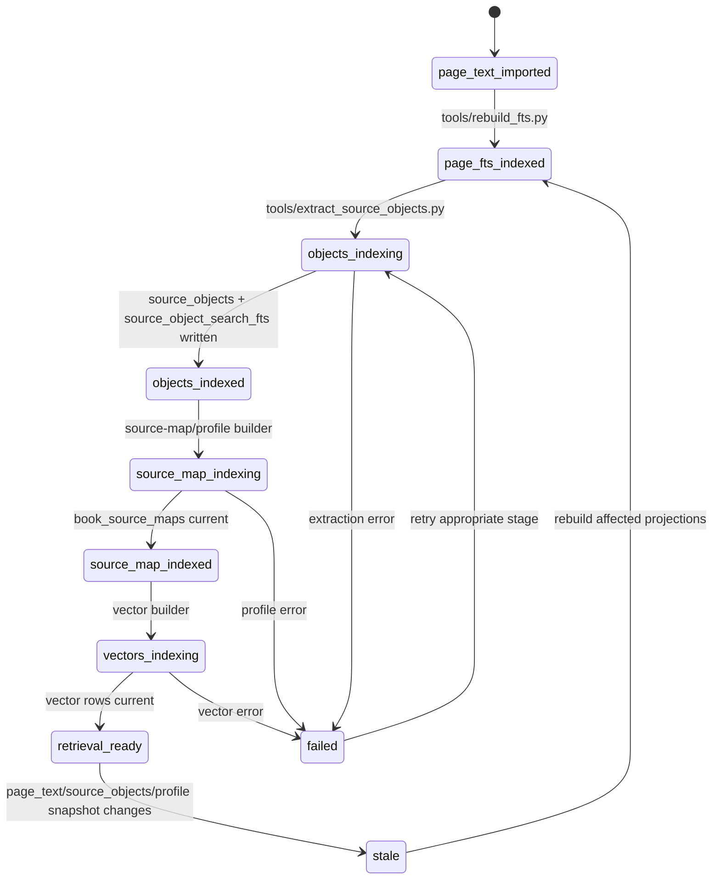
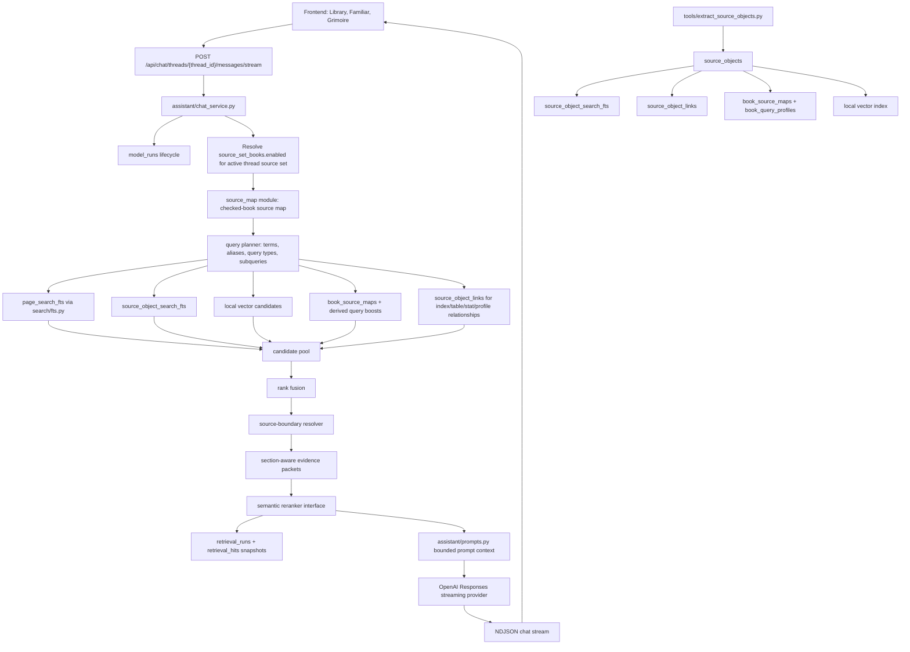

# Source-Map-Aware Hybrid Retrieval Implementation Plan

## 1. Source Boundary

This plan is based on the current live code and current project docs as of
2026-06-05:

- Prompt/template source:
  `/Users/aftoncarlson/.codex/attachments/dd2aac22-87f1-472b-8944-bf5e5153534a/pasted-text.txt`
- Repo guidance: `CLAUDE.md`, `AGENTS.md`
- Wiki: `wiki/CONTEXT.md`, `wiki/INDEX.md`,
  `wiki/topics/ai-rag-system.md`, `wiki/topics/target-architecture.md`,
  `wiki/topics/implementation-standards.md`,
  `wiki/concepts/private-copyright-boundary.md`,
  `wiki/concepts/hybrid-search-for-rules.md`
- Current handoff:
  `docs/handoffs/2026-06-05-source-map-hybrid-retrieval-handoff.md`
- Live retrieval code:
  `wfrp_companion/assistant/retrieval.py`,
  `wfrp_companion/assistant/prompts.py`,
  `wfrp_companion/assistant/chat_service.py`,
  `wfrp_companion/assistant/chat_store.py`
- Live search/source-object code:
  `wfrp_companion/search/fts.py`,
  `wfrp_companion/search/scope.py`,
  `wfrp_companion/source_objects/models.py`,
  `wfrp_companion/source_objects/extractor.py`,
  `wfrp_companion/source_objects/store.py`
- Live persistence schema:
  `wfrp_companion/db/schema.sql`,
  `wfrp_companion/db/migrations.py`,
  `wfrp_companion/db/migration_files/0001_phase_7_source_objects.sql`
- Live API/frontend surfaces:
  `wfrp_companion/api/routes/chat.py`,
  `wfrp_companion/api/schemas.py`,
  `frontend/src/components/chat/AgentChatPanel.tsx`,
  `frontend/src/types/api.ts`
- Current tests:
  `tests/assistant/test_retrieval.py`,
  `tests/assistant/test_prompts.py`,
  `tests/assistant/test_chat_service.py`,
  `tests/assistant/test_chat_store.py`,
  `tests/source_objects/test_store.py`,
  `tests/api/test_chat_routes.py`,
  `frontend/src/components/chat/AgentChatPanel.test.tsx`

Intentionally excluded as architectural input:

- Older phase plans under `docs/plans/` except where their decisions have been
  compiled into the current wiki or are reflected by live code.
- `docs/plans/2026-06-05-source-map-aware-hybrid-retrieval-plan.md` was
  inspected only as the previously produced artifact for continuity; it is not
  an architectural source for this plan.
- Historical chat summaries or memory not represented in current repo files.
- Private raw WFRP PDF contents or extracted private book text.
- Hosted deployment assumptions, public sharing requirements, or multi-user
  account architecture.
- New OpenAI API features beyond the existing `OpenAIProvider` streaming
  Responses integration. Any future OpenAI embeddings or hosted reranker phase
  must verify current official OpenAI docs before implementation.

## 2. Current Live-Code Diagnosis

The current live code has a useful first source-map/object-aware slice, but it
is not yet the complete target architecture.

What is already correct and should be preserved:

- Library checkbox scope is authoritative for new Familiar model runs.
  `wfrp_companion/assistant/retrieval.py::current_thread_source_scope()` reads
  `chat_threads.active_source_set_id`, then checked books from
  `source_set_books`; it does not use `chat_thread_source_books` as the current
  retrieval authority.
- `chat_thread_source_books` remains a historical thread-creation snapshot.
- `retrieval_runs.metadata_json` snapshots `source_book_ids`, `source_map`,
  and `candidates` for each answer.
- `retrieval_hits` records page/object evidence with rank reasons and page
  range metadata.
- `source_objects` and `source_object_search_fts` are now used by Familiar.
- Prompt construction includes a compact source map and final reranked
  evidence only.
- Frontend citations display printed labels/ranges while using
  `pdf_page_number` as the hidden Grimoire jump target.

Remaining live-code problems:

- `wfrp_companion/assistant/retrieval.py` is doing too many jobs: source-scope
  resolution, source-map construction, query planning, candidate generation,
  source-boundary resolution, reranking, evidence shaping, and helper scoring.
  This makes the next vector/table/index phases risky to add directly.
- The source map is derived dynamically from current `source_objects` and
  `page_search` text. There is no durable source-map/profile contract for book
  summaries, aliases, chapter ranges, glossary/index terms, or query-type
  boosts beyond the generic `book_query_profiles` table.
- `book_query_profiles` exists but is not currently populated or consumed by
  Familiar retrieval. Routing metadata is therefore incidental, not curated
  app-owned state.
- Candidate generation has page FTS and source-object FTS/scan channels, but
  no vector channel, no explicit Reciprocal Rank Fusion stage, and no clear
  provider-agnostic reranker interface.
- The reranker is deterministic local token overlap. This is testable and safe,
  but it is not a true semantic reranker for paraphrases like "who rules
  Bretonnia?" when the exact vocabulary is weak.
- `source_objects/extractor.py` currently emits `rule_section` and `page_chunk`
  objects. It does not yet emit first-class `table`, `table_row`,
  `stat_block`, `npc_profile`, `monster_profile`, `location_description`,
  `index_entry`, or glossary-style objects.
- `source_object_links` exists but is not populated. The system therefore
  cannot yet pair a table row with its table, an index entry with a target, or
  a stat block with its parent profile.
- Existing databases that have `source_objects` extracted before this slice
  may lack populated `source_object_search` rows until extraction is re-run.
  There is no dedicated object-search backfill tool.
- Printed page label coverage depends on prior page-text import calibration.
  The code carries `page_label`, but there is no per-book page-label
  calibration/backfill lifecycle state.
- External integration behavior is intentionally simple: OpenAI is called only
  after retrieval. There is no external vector store, embedding service, or
  reranker yet. That is good for privacy, but the future embedding plan needs
  explicit local-first ownership.

## 3. Architecture Decision

Implement the remaining retrieval work as a staged local-first pipeline over
SQLite-owned state:

1. Split retrieval into focused modules with stable dataclass contracts.
2. Normalize source-map/profile ownership in local tables.
3. Backfill and validate source-object search projections.
4. Add rank fusion and a provider-agnostic reranker interface.
5. Add vector candidates as an additional candidate source, not as a
   replacement for lexical/object FTS.
6. Expand source-object extraction to tables, stat blocks, index/glossary
   entries, and links.
7. Preserve per-message Library scope and immutable per-run snapshots at every
   stage.

This is the right fit because the repo already uses SQLite as the local source
of truth, has explicit migration machinery, and has a working retrieval/model
run lifecycle. The architecture should deepen those boundaries instead of
adding a framework-heavy agent orchestration layer.

Avoid:

- Vector-only retrieval. It would bury exact rule names, page references,
  table labels, spell names, talents, and NPC names.
- One-off search patches such as hard-coded Bretonnia aliases in Familiar.
  Aliases belong in source-map/profile metadata and query planning.
- Letting the frontend infer retrieval scope or citation targets.
  `source_set_books`, `retrieval_runs`, and `retrieval_hits` must own that
  state.
- Stuffing raw indexes, glossaries, or chapters into every prompt. Prompt
  context should contain compact source-map metadata plus selected evidence.
- Public export/share features for copyrighted book text.

## 4. Target State Model

Retrieval does not need a user-facing workflow state machine, but it does need
explicit app-owned lifecycle state for book-level retrieval assets.

Ownership model:

- Live scope:
  `source_sets`, `source_set_books.enabled`,
  `app_settings.active_source_set_id`, and `chat_threads.active_source_set_id`.
- Historical thread scope:
  `chat_thread_source_books`.
- Per-answer immutable scope and retrieval state:
  `retrieval_runs.metadata_json`, `retrieval_hits`.
- Book text/readiness:
  `books.copy_status`, `books.text_status`, `books.search_status`,
  `book_readiness`.
- Source-object extraction/indexing:
  `book_object_status`.
- Source-map/query profile state:
  add `book_source_maps` as the durable source-map source of truth. Keep
  `book_query_profiles` as a derived/query-type boost table, not as the owner
  of source-map structure.
- Vector indexing:
  add explicit embedding status and snapshot ownership; do not infer vector
  readiness from incidental vector rows.



## 5. Target Architecture Diagram



## 6. Proposed Data Model / Contracts

Existing canonical tables to preserve:

- `books`
  - Lifecycle columns: `copy_status`, `text_status`, `search_status`,
    `visual_status`.
  - Must remain the source for readiness; do not duplicate readiness flags.
- `pages`
  - `page_number` is the physical/PDF page number.
  - `page_label` is the printed label when available.
- `page_text`
  - Canonical imported private page text.
- `page_search`, `page_search_fts`
  - Rebuildable page-level lexical projection.
- `source_sets`, `source_set_books`, `app_settings`
  - Live Library/source-set scope.
- `chat_threads`, `chat_thread_source_books`
  - Thread metadata and historical thread-creation source snapshot.
- `model_runs`
  - App-owned Familiar generation state:
    `queued`, `retrieving`, `calling_model`, `completed`, `failed`.
- `retrieval_runs`
  - Immutable per-answer query/source snapshot. Continue storing
    `metadata_json.source_book_ids` for compatibility, but use
    `retrieval_run_source_books` as the queryable per-run source-book proof
    once migration `0002` lands.
- `retrieval_hits`
  - Immutable selected evidence snapshots.
- `source_objects`
  - Canonical structured private evidence.
  - Current `object_type` values already include table/stat/profile/index
    shapes; the structured-evidence migration must rebuild the check
    constraint to add `glossary_entry` before glossary extraction lands.
- `source_object_links`
  - App-owned relationships between typed evidence objects.
  - The structured-evidence migration must rebuild the check constraint to add
    `glossary_definition` before glossary links are written.
- `book_object_status`
  - Extraction/index lifecycle per book.
- `book_query_profiles`
  - Existing per-book/query-type boost table. Treat as derived boost data once
    `book_source_maps` exists; do not make it the source-map owner.
- `source_object_search`, `source_object_search_fts`
  - Rebuildable object-level lexical projection.

Recommended first migration: `0002_source_map_retrieval.sql`.

Add `book_retrieval_status`:

- `book_id text primary key references books(id) on delete cascade`
- `source_map_status text not null check in ('not_started','indexing','indexed','needs_refresh','failed')`
- `table_index_status text not null check in ('not_started','indexing','indexed','needs_refresh','failed','disabled')`
- `vector_status text not null check in ('not_started','indexing','indexed','needs_refresh','failed','disabled')`
- `page_label_status text not null check in ('not_started','calibrating','calibrated','needs_review','failed')`
- `page_text_snapshot_sha256 text`
- `source_object_snapshot_sha256 text`
- `source_map_snapshot_sha256 text`
- `vector_snapshot_sha256 text`
- `source_map_started_at text`
- `vector_started_at text`
- `table_index_started_at text`
- `page_label_started_at text`
- `embedding_model text`
- `embedding_dimensions integer`
- `last_error text`
- `updated_at text not null`

Add `book_source_maps`:

- `book_id text primary key references books(id) on delete cascade`
- `summary text not null`
- `aliases_json text not null default '[]'`
- `chapters_json text not null default '[]'`
- `best_source_for_json text not null default '[]'`
- `index_terms_json text not null default '[]'`
- `glossary_terms_json text not null default '[]'`
- `source_object_snapshot_sha256 text not null`
- `schema_version integer not null default 1`
- `builder_version text not null`
- `created_at text not null`
- `updated_at text not null`

Add `retrieval_run_source_books`:

- `retrieval_run_id text not null references retrieval_runs(id) on delete cascade`
- `source_set_id text references source_sets(id) on delete set null`
- `book_id text not null references books(id) on delete cascade`
- `book_title_snapshot text not null`
- `captured_at text not null`
- Primary key on `(retrieval_run_id, book_id)`.
- Index on `(book_id, captured_at)`.
- Purpose: queryable immutable proof that a run only considered checked books.
  Keep `retrieval_runs.metadata_json.source_book_ids` as compatibility
  snapshot data until older tooling is migrated.

Add `source_object_embeddings` in vector migration
`0003_vector_retrieval.sql`:

- `id text primary key`
- `source_object_id text not null references source_objects(id) on delete cascade`
- `book_id text not null references books(id) on delete cascade`
- `embedding_model text not null`
- `embedding_dimensions integer not null check(embedding_dimensions > 0)`
- `text_snapshot_sha256 text not null`
- `vector_blob blob not null`, containing a little-endian float32 vector for
  the SQLite-local MVP.
- `created_at text not null`
- `updated_at text not null`
- Unique index on
  `(source_object_id, embedding_model, embedding_dimensions, text_snapshot_sha256)`.
- Index on `(book_id, embedding_model)`.
- If a dedicated local vector backend is selected later, add a storage ADR and
  migrate to a `vector_ref` style table rather than silently changing this
  contract.

Add `book_page_label_calibrations` when page-label calibration lands:

- `book_id text primary key references books(id) on delete cascade`
- `status text not null check in ('not_started','calibrating','calibrated','needs_review','failed')`
- `method text not null`
- `calibration_json text not null default '{}'`
- `page_text_snapshot_sha256 text not null`
- `last_error text`
- `reviewed_at text`
- `updated_at text not null`
- `book_retrieval_status.page_label_status` remains the summary lifecycle
  state; this table owns the calibration details.

Core Python contracts to introduce:

- `wfrp_companion/assistant/source_map.py`
  - `SourceMapEntry`
  - `load_source_map(config, book_ids, query_terms)`
  - `format_prompt_source_map(source_map, query_plan)`
- `wfrp_companion/source_objects/source_map_builder.py`
  - `build_book_source_map(connection, book_id, snapshot)`
  - `persist_book_source_map(connection, book_id, source_map, snapshot)`
  - `rebuild_book_query_profiles(connection, book_id, source_map)`
- `wfrp_companion/assistant/query_planner.py`
  - `QueryPlan`
  - `plan_query(query, source_map, recent_messages=())`
- `wfrp_companion/assistant/candidates.py`
  - `Candidate`
  - `CandidateChannel` enum-like literals:
    `page_fts`, `source_object_fts`, `source_object_scan`, `vector`,
    `source_map`, `index_link`, `glossary_link`
- `wfrp_companion/assistant/evidence.py`
  - `EvidencePacket`
  - `resolve_source_boundary(candidate, query_plan)`
- `wfrp_companion/assistant/reranking.py`
  - `Reranker` protocol
  - `DeterministicReranker`
  - future `ProviderReranker` or `LocalCrossEncoderReranker`

Immutable snapshot data:

- `retrieval_runs.metadata_json`
- `retrieval_run_source_books`
- `retrieval_hits.*_snapshot` columns
- `retrieval_hits.metadata_json.page_start`
- `retrieval_hits.metadata_json.page_end`
- `retrieval_hits.metadata_json.page_range_label`

Live workflow state:

- `model_runs.status`
- `ingest_jobs.status`
- `book_object_status.status`
- `book_retrieval_status.*_status`

Explicit target/linkage data:

- `source_object_links`
- `source_object_embeddings`
- `book_query_profiles`
- `book_source_maps`

## 7. External Integration Design

Current external integration: OpenAI Responses streaming via
`wfrp_companion/assistant/provider.py::OpenAIProvider`.

Source of truth boundary:

- OpenAI is not a source of truth for retrieval scope, ranking snapshots,
  citations, source maps, or model-run state.
- SQLite owns retrieval state and model-run state.
- OpenAI receives only the bounded prompt assembled by
  `wfrp_companion/assistant/prompts.py`.

What is written/read:

- Read from env/config: `OPENAI_API_KEY`, `config.openai_model`,
  `config.openai_timeout_seconds`.
- Write to OpenAI: provider messages containing system prompt, bounded source
  map, selected evidence, and user question.
- Read from OpenAI: streamed text deltas, provider response id, token counts.
- Write locally: `model_runs.provider_response_id`, `input_tokens`,
  `output_tokens`, assistant `chat_messages.content`.

Idempotency:

- `model_runs.idempotency_key` prevents duplicate user turns and duplicate
  retries.
- Provider request id is `model_runs.id`, passed as `request_id`.
- Retrieval is re-run for retries, so each retry gets a new retrieval snapshot
  reflecting current checked Library scope.

Retry behavior:

- Provider unavailable before streaming: mark `model_runs.status='failed'`,
  `error_code='provider_unavailable'`.
- Provider error during streaming: mark failed with `provider_unavailable` or
  `provider_error`.
- Retry uses `create_queued_retry()` and references
  `retry_of_model_run_id`.

Success/failure:

- Success means one assistant message is persisted and linked to a completed
  `model_runs` row.
- Failure means no assistant message is linked and the failed run remains
  retryable when `user_message_id` exists.

External system down:

- Retrieval still persists before provider calls when the provider was
  successfully constructed.
- If provider construction fails because `OPENAI_API_KEY` is missing, the run
  fails without a provider call.
- The UI surfaces retry; it must not fabricate an answer from model memory.

Future embedding/reranker integration:

- Prefer local embeddings/vector store first to preserve local-first behavior.
- If OpenAI embeddings or an OpenAI reranker-style call is introduced later,
  verify current official OpenAI docs before implementation, add explicit
  config/env ownership, persist model names and text snapshot hashes locally,
  and ensure unchecked books never leave the process.

## 8. Core Flow Design

### A. Familiar Message Retrieval Flow

1. `chat_store.create_queued_turn()` inserts user `chat_messages` row and
   queued `model_runs` row under idempotency key.
2. `chat_service.stream_queued_result()` transitions:

```sql
update model_runs
set status = 'retrieving', updated_at = :now
where id = :model_run_id
  and status in ('queued');
```

3. `current_thread_source_scope()` reads `chat_threads.active_source_set_id`.
   If null, it falls back to `app_settings.active_source_set_id` for legacy
   threads.
4. Read checked books from `source_set_books` where `enabled = 1`.
5. Build source map only for those book ids.
6. Build query plan from user query, source-map aliases, likely query types,
   and eventually recent chat context.
7. Generate candidates from page FTS, source-object FTS, source-map routing,
   vector index, and link/index/glossary channels.
8. Deduplicate by `source_object_id` when available, otherwise page id.
9. Fuse ranks across channels.
10. Resolve candidates to complete evidence:
    - prefer typed parent object;
    - include linked table/stat/profile children when needed;
    - use neighbor/page fallback only when object boundaries are missing.
11. Rerank with deterministic reranker first; later allow provider/local
    semantic reranker behind a protocol.
12. Persist `retrieval_runs`, `retrieval_run_source_books`, and
    `retrieval_hits`.
13. Attach retrieval run to `model_runs`.
14. Transition to `calling_model`.
15. Build prompt from checked-book source map and selected evidence.
16. Stream OpenAI response.
17. Complete model run or fail it.

Race prevention:

- Status transitions must be guarded by expected prior statuses.
- Retrieval snapshots are immutable once inserted.
- Source-set checkbox changes after step 4 affect the next model run, not the
  in-flight run.

### B. Source Object Extraction And Object FTS Flow

1. `tools/extract_source_objects.py` calls
   `extract_source_object_library()`.
2. `book_text_snapshot_sha256()` computes deterministic input snapshot.
3. `claim_extraction_job()` transitions `book_object_status` to
   `extracting` and claims an `ingest_jobs` row with idempotency key
   `extract_source_objects:{book_id}:{snapshot}`.
4. Extract objects from page text/layout.
5. In one transaction, delete existing source objects/search rows for the
   book, insert new `source_objects`, insert `source_object_search`, rebuild
   `source_object_search_fts`, and set `book_object_status.status='indexed'`.
6. Mark job succeeded.

Future improvement:

- Split object extraction and object-search rebuild into explicit stages if
  source-object extraction grows slower or vector indexing becomes separate.

### C. Shared Retrieval-Asset Job Guard

All new retrieval-asset jobs should follow the existing source-object pattern:
claim an `ingest_jobs` row by idempotency key, guard the app-owned status row
with a conditional update, build outside long write transactions, and write the
final projection atomically.

Idempotency keys:

- Source maps:
  `rebuild_source_maps:{book_id}:{source_object_snapshot}:{builder_version}`
- Embeddings:
  `rebuild_embeddings:{book_id}:{embedding_model}:{embedding_dimensions}:{source_object_snapshot}:{builder_version}`
- Page labels:
  `backfill_page_labels:{book_id}:{page_text_snapshot}:{builder_version}`

Guarded status transition example:

```sql
update book_retrieval_status
set source_map_status = 'indexing',
    source_map_started_at = :now,
    source_object_snapshot_sha256 = :snapshot,
    last_error = null,
    updated_at = :now
where book_id = :book_id
  and source_map_status in ('not_started', 'needs_refresh', 'failed')
  and coalesce(source_map_snapshot_sha256, '') != :snapshot;
```

If the update affects zero rows, the worker must check whether the projection
is already current, another worker is indexing, or the book is not ready. It
must not proceed by guessing.

Stale-running recovery:

```sql
update book_retrieval_status
set source_map_status = 'needs_refresh',
    last_error = 'stale indexing job recovered',
    updated_at = :now
where source_map_status = 'indexing'
  and source_map_started_at < :stale_cutoff;
```

Success write order:

1. Start a short transaction.
2. Delete stale projection rows for the book and current projection type.
3. Insert `book_source_maps`, `book_query_profiles`, embeddings, or page-label
   updates.
4. Update `book_retrieval_status.*_status='indexed'` or calibrated equivalent
   with the current snapshot/model/builder fields.
5. Mark the matching `ingest_jobs` row `succeeded`.
6. Commit.

Failure write order:

1. Record count-only failure details in `book_retrieval_status.last_error`.
2. Set the relevant status to `failed`.
3. Mark the matching `ingest_jobs` row `failed` and increment attempts.
4. Do not log private text or embedding values.

### D. Source Map/Profile Build Flow

1. Compute source-object snapshot for each book from
   `source_objects.id`, `text_snapshot_sha256`, `object_type`, page ranges,
   and link rows.
2. If current, skip.
3. Claim `ingest_jobs(job_type='rebuild_source_maps')` with the shared
   idempotency key.
4. Guard `book_retrieval_status.source_map_status` with the shared conditional
   update.
5. Build compact book summary, aliases, chapters, query types, and source
   routing metadata from structured objects and safe metadata.
6. Persist canonical source-map structure to `book_source_maps`.
7. Persist optional query-type boosts to `book_query_profiles` as derived data.
8. Mark `book_retrieval_status.source_map_status='indexed'`.

### E. Vector Index Flow

1. Select source objects whose `text_snapshot_sha256` is current and whose
   type is useful for retrieval.
2. Exclude unchecked books at query time, not at index build time.
3. Claim `ingest_jobs(job_type='rebuild_embeddings')` with the shared
   idempotency key.
4. Guard `book_retrieval_status.vector_status` with the same transition
   pattern used by source maps.
5. Build embeddings locally if possible; otherwise introduce an explicitly
   reviewed external embedding provider.
6. Persist `source_object_embeddings` keyed by object id, model, and snapshot.
7. Mark `book_retrieval_status.vector_status='indexed'`.
8. Query-time vector search must always filter by checked `book_id`.

### F. Migration/Backfill Flow

1. Apply schema migration with `tools/migrate_db.py`.
2. Backfill `book_retrieval_status` for all existing books.
3. For books with `book_object_status.status in ('extracted','indexed')`,
   verify `source_object_search` row count matches `source_objects`.
4. Rebuild missing object-search rows safely.
5. Mark ambiguous books with `needs_refresh` or `failed`; do not silently
   report them as retrieval-ready.

## 9. UX / Surface Behavior

| Surface | Behavior |
| --- | --- |
| Library | Checkboxes remain the source-scope authority for the active source set. |
| Familiar composer | No new control is required for this retrieval phase. |
| Familiar retrieval event | Citations should appear only from checked books. |
| Familiar answer | Must cite retrieved book and printed page/page range for factual/rules claims. |
| Familiar citation buttons | Display printed labels/ranges; open Grimoire using hidden `pdf_page_number`. |
| Grimoire | Opens the first PDF page for a cited evidence span. |
| Search tab | Can remain exact-search oriented, but later object-search debug mode may expose typed evidence. |
| Thread history | If shown, distinguish "thread created with these sources" from "sources used for this run." |
| Ops/debug logs | Show source ids, object ids, rank reasons, and counts, not private full text. |

What should not be visible:

- Unchecked books in source-map prompt context.
- Unchecked books as citations.
- Raw filesystem paths.
- Full copyrighted table/chapter dumps.
- Internal vector values or private extracted text in logs.

## 10. Implementation Sequence

### Phase 1: Split Retrieval Into Focused Modules

Scope:

- Refactor current `wfrp_companion/assistant/retrieval.py` without changing
  behavior.

Changes:

- Create `wfrp_companion/assistant/source_map.py`.
- Create `wfrp_companion/assistant/query_planner.py`.
- Create `wfrp_companion/assistant/candidates.py`.
- Create `wfrp_companion/assistant/evidence.py`.
- Create `wfrp_companion/assistant/reranking.py`.
- Keep `retrieve_context()` as the public facade used by
  `chat_service.py`.

Does not change yet:

- No new schema.
- No vector search.
- No new extraction types.

Required tests:

- Move existing retrieval tests without weakening expectations.
- Add facade compatibility tests proving `retrieve_context()` returns the same
  fields.

Rollout:

- Behavior-preserving PR. Safe to land before any DB changes.

### Phase 2: Add Retrieval Profile/Source Map Ownership

Scope:

- Make source-map metadata durable and inspectable.

Changes:

- Add migration for `book_retrieval_status`, `book_source_maps`, and
  `retrieval_run_source_books`.
- Add source-map/profile builder module:
  `wfrp_companion/source_objects/source_map_builder.py`.
- Keep retrieval-time loading/formatting in
  `wfrp_companion/assistant/source_map.py`.
- Add tool `tools/rebuild_source_maps.py`.
- Add `ingest_jobs` job type `rebuild_source_maps`; the current schema only
  allows copy/import/FTS/visual/source-object jobs.
- Update `chat_store.record_retrieval_run()` to populate
  `retrieval_run_source_books` while continuing to write
  `metadata_json.source_book_ids` for compatibility.
- Update `wfrp_companion/db/migrations.py`:
  add the new migration id to `MIGRATION_IDS`, route it in `apply_migration()`,
  rebuild the `ingest_jobs` check constraint for new job types, update
  `collect_table_counts()`, and keep `wfrp_companion/db/schema.sql` replay in
  sync.

Does not change yet:

- No vector retrieval.
- No LLM-generated summaries unless explicitly reviewed for privacy/cost.

Required tests:

- Migration tests for new tables/enums.
- Builder idempotency tests.
- Stale snapshot tests.
- Scope tests proving unchecked book profiles are not used at query time.

Rollout:

- Apply migration, run source-map backfill locally, verify count-only output.

### Phase 3: Add Object Search Backfill Tool

Scope:

- Repair existing databases where `source_objects` exists but
  `source_object_search` is missing/stale.

Changes:

- Add `tools/rebuild_source_object_fts.py`.
- Add package function
  `wfrp_companion/source_objects/store.py::rebuild_source_object_search()`.
- Use `ingest_jobs(job_type='rebuild_source_object_fts')`, already allowed by
  schema.

Does not change yet:

- Does not alter source-object extraction heuristics.
- Does not add vector rows.

Required tests:

- Backfill from existing `source_objects`.
- Idempotent skip when projection is current.
- Stale-row cleanup.
- Count-only CLI output with no private text.

Rollout:

- Run after migrations and before real-library QA.

### Phase 4: Add Rank Fusion And Reranker Protocol

Scope:

- Make ranking explainable and replaceable before adding vector candidates.

Changes:

- Add `ReciprocalRankFusion` or equivalent simple fusion over independent
  channel ranks.
- Add `Reranker` protocol.
- Keep deterministic reranker as default.
- Persist `rank_reasons_json` with channel scores, fusion contribution, and
  reranker judgment.

Does not change yet:

- No vector retrieval.
- No provider-backed reranker by default.

Required tests:

- RRF deterministic ordering.
- Weak lexical hit rejection.
- Exact name/table query preservation.
- Rank reason snapshot assertions.

Rollout:

- Behavior changes require regression QA on known queries: Bretonnia,
  critical hits, fear, tables, NPC/stat block examples once available.

### Phase 5: Add Vector Candidate Channel

Scope:

- Add semantic candidate generation as one channel after fusion/reranking
  exists.

Changes:

- Add migration `0003_vector_retrieval.sql` for
  `source_object_embeddings` and `ingest_jobs(job_type='rebuild_embeddings')`.
- Add `source_object_embeddings` table with SQLite-local `vector_blob`
  storage.
- Add config for embedding provider/model. Default should be local/disabled
  until explicitly configured.
- Add `tools/rebuild_embeddings.py`.
- Add vector candidate generation in `candidates.py`.
- Filter vector query by checked `book_id`.

Does not change yet:

- Vector results do not bypass fusion/reranking.
- No hosted vector database.

Required tests:

- Embedding status lifecycle.
- Snapshot invalidation when source-object text changes.
- Query-time source filtering.
- Fusion tests showing exact page/object hits are not buried.

Rollout:

- Disabled by default unless local embedding dependency is present.

### Phase 6: Extract Tables, Stat Blocks, Index/Glossary Objects, And Links

Scope:

- Make structured WFRP evidence first-class.

Changes:

- Add structured-evidence migration to extend
  `source_objects.object_type` with `glossary_entry` and
  `source_object_links.link_type` with `glossary_definition`.
- Update `wfrp_companion/source_objects/models.py::SOURCE_OBJECT_TYPES` and
  related validation tests so Python accepts `glossary_entry` before SQLite
  constraints are exercised.
- Extend `source_objects/extractor.py` to emit:
  `table`, `table_row`, `stat_block`, `npc_profile`, `monster_profile`,
  `location_description`, `index_entry`, `glossary_entry`,
  `cross_reference`.
- Populate `source_object_links` with:
  `table_row`, `stat_profile`, `index_entry`, `glossary_definition`,
  `cross_reference`, `same_section`, `entity_mention`.
- Treat `source_objects.object_type='glossary_entry'` as canonical glossary
  evidence. `book_source_maps.glossary_terms_json` is only compact routing
  metadata for query planning.
- Update evidence resolver to include linked parent/child objects when needed.

Does not change yet:

- Does not attempt perfect extraction for every PDF.
- Does not export table contents outside private local prompts.

Required tests:

- Synthetic public/non-WFRP fixtures for table extraction.
- Stat block/profile linking tests.
- Index entry to target object/page tests.
- Glossary entry routing and evidence tests.
- Evidence packet completeness tests.

Rollout:

- Run on selected books first; keep extraction confidence and object counts
  visible in count-only CLI output.

### Phase 7: Printed Page Label Calibration/Backfill

Scope:

- Make printed page labels reliable across books.

Changes:

- Add page-label calibration migration for
  `book_page_label_calibrations` and
  `ingest_jobs(job_type='backfill_page_labels')`.
- Add `tools/backfill_page_labels.py`.
- Update citation labels to prefer calibrated printed ranges.

Does not change yet:

- No UI-heavy calibration tool unless manual correction is unavoidable.

Required tests:

- Offset calibration tests.
- Roman numeral/front-matter label tests.
- Citation range display tests.

Rollout:

- Safe to run per book; ambiguous books should surface manual review counts.

## 11. Testing Requirements

Every behavior-changing phase must add tests in the same PR.

Minimum backend tests:

- Scope/source-set tests:
  `tests/assistant/test_retrieval.py`,
  `tests/assistant/test_chat_service.py`
- Prompt scoping and bounded-context tests:
  `tests/assistant/test_prompts.py`
- Persistence snapshot tests:
  `tests/assistant/test_chat_store.py`
- Migration tests:
  `tests/db/test_migrations.py`,
  `tests/db/test_schema.py`
- Source-object extraction/index tests:
  `tests/source_objects/test_extractor.py`,
  `tests/source_objects/test_store.py`
- Tool CLI tests:
  `tests/tools/test_extract_source_objects.py`,
  future `tests/tools/test_rebuild_source_object_fts.py`,
  future `tests/tools/test_rebuild_source_maps.py`,
  future `tests/tools/test_rebuild_embeddings.py`

Minimum frontend tests:

- Chat citation label/open behavior:
  `frontend/src/components/chat/AgentChatPanel.test.tsx`
- API type/client compatibility when response shapes change:
  `frontend/src/lib/apiClient.test.ts`,
  `frontend/src/types/api.ts` compile through `npm run build`

Minimum verification commands:

```bash
conda run -n wfrp-companion python -m pytest -q
conda run -n wfrp-companion python -m pytest --cov=wfrp_companion --cov=tools.init_db --cov=tools.import_pdfs --cov=tools.import_page_text --cov=tools.rebuild_fts --cov=tools.search_text --cov=tools.source_sets --cov=tools.serve_api --cov=tools.dev --cov=tools.migrate_db --cov=tools.extract_source_objects --cov-report=term-missing --cov-fail-under=100
conda run -n wfrp-companion ruff check .
cd frontend && npm run test
cd frontend && npm run test:coverage
cd frontend && npm run build
cd frontend && npm run test:e2e
```

Manual/private-library QA:

- With `Knights of the Grail` checked, ask a Bretonnia query and verify
  Familiar retrieves/cites that book.
- Disable `Knights of the Grail`, ask the same query, and verify it is not in
  source map, candidates, prompt context, retrieval hits, or citations.
- Verify no logs print private book text.

## 12. Verification Matrix

| Scenario | Expected result | Evidence |
| --- | --- | --- |
| Bretonnia query with `Knights of the Grail` enabled | Retrieves and cites that book | `retrieval_hits.book_id`, UI citation |
| Bretonnia query with that book disabled | Does not retrieve or cite it | `retrieval_run_source_books` and `retrieval_runs.metadata_json.source_book_ids` |
| Misspelled `Bretonia` | Expands through enabled source-map vocabulary | `rank_reasons_json` includes expansion |
| Conversational filler query | Filler lexical hits are rejected or outranked | Top `retrieval_hits` match relevant evidence |
| Table query after table extraction | Returns `table`/`table_row` object and parent table context | `object_type_snapshot` |
| NPC/stat query after stat extraction | Returns profile/stat block plus linked context | `source_object_links` and `retrieval_hits` |
| Multi-page section | Prompt evidence includes complete span and page range | `metadata_json.page_range_label` |
| Retry after Library checkbox change | Retry gets new retrieval snapshot | new `retrieval_runs.id` and new `retrieval_run_source_books` rows |
| Provider unavailable | Model run fails without fabricated answer | `model_runs.error_code` |
| Existing extracted DB before object FTS | Backfill writes projection rows | source-object FTS counts |
| Private path/text safety | No local paths or raw broad book dumps in API/log output | prompt/log tests |
| Frontend citation click | Opens Grimoire using `pdf_page_number` | UI test/manual QA |

## 13. Migration / Compatibility / Cleanup Strategy

Temporary compatibility scaffolding:

- Keep `chat_thread_source_books` for historical thread detail.
- Keep page fallback retrieval for books without current source objects.
- Keep deterministic reranker as default even after vector candidates land.
- Require `retrieval_run_source_books` for new runs once migration `0002`
  lands.
- Keep `retrieval_runs.metadata_json.source_book_ids` as compatibility
  snapshot data and as the backfill source for older runs.

Migration order:

1. Phase 2 adds `0002_source_map_retrieval.sql` under
   `wfrp_companion/db/migration_files/` for `book_retrieval_status`,
   `book_source_maps`, `retrieval_run_source_books`, and
   `ingest_jobs(job_type='rebuild_source_maps')`.
2. Every migration PR must update `wfrp_companion/db/migrations.py` by adding
   its id to `MIGRATION_IDS`, routing it in `apply_migration()`, and updating
   `collect_table_counts()`.
3. Every migration PR must update `wfrp_companion/db/schema.sql` so a fresh
   database matches the migrated schema.
4. Backfill `book_retrieval_status` for all existing books without generating
   private text output.
5. Backfill `retrieval_run_source_books` from
   `retrieval_runs.metadata_json.source_book_ids` where present; leave rows
   absent for runs whose metadata lacks a source snapshot and mark that as
   legacy unknown scope.
6. Rebuild source-object search projections.
7. Build source maps/profiles.
8. Phase 5 adds `0003_vector_retrieval.sql` for
   `source_object_embeddings` and
   `ingest_jobs(job_type='rebuild_embeddings')`; build embeddings only when
   configured.
9. Phase 6 adds a structured-evidence migration to rebuild the
   `source_objects.object_type` and `source_object_links.link_type` check
   constraints with `glossary_entry` and `glossary_definition`.
10. Phase 7 adds a page-label calibration migration for
   `book_page_label_calibrations` and
   `ingest_jobs(job_type='backfill_page_labels')`.

Safe cases:

- Books with `copy_status='copied'`, `text_status='imported'`,
  `search_status='indexed'`, and current `source_objects`.
- Books with no source objects: mark retrieval profile/vector as
  `not_started`; page fallback remains valid.

Ambiguous/manual-review cases:

- Missing or inconsistent page labels.
- Source objects with stale text snapshot.
- Object counts that do not match projection counts.
- Embeddings with stale model or text snapshot.
- Existing retrieval runs without `metadata_json.source_book_ids`; those
  remain legacy unknown-scope records and should not be used as proof of
  checked-book compliance.

Quarantine behavior:

- Mark relevant status as `failed` or `needs_refresh`.
- Keep the book searchable via page fallback if `book_readiness.search_ready`
  is true.
- Surface count-only CLI errors; do not log private text.

Cleanup later:

- Once thread-history UI is built, rename/display
  `chat_thread_source_books` as creation-time scope.
- Remove any temporary object-search backfill compatibility path after all
  local DBs have current projections and the rebuild tool is available.
- Consider splitting `retrieval_runs.metadata_json` into queryable tables only
  when debugging/reporting needs require relational access.

## 14. Operational Rollout Notes

Local rollout order:

1. Ensure Conda env is current:
   `conda env update -f environment.yml --prune`
2. Apply DB migrations:
   `conda run -n wfrp-companion python tools/migrate_db.py`
3. Rebuild page FTS if page text changed:
   `conda run -n wfrp-companion python tools/rebuild_fts.py`
4. Extract or refresh source objects:
   `conda run -n wfrp-companion python tools/extract_source_objects.py`
5. Rebuild object FTS once the dedicated tool exists:
   `conda run -n wfrp-companion python tools/rebuild_source_object_fts.py`
6. Rebuild source maps/profiles once the tool exists:
   `conda run -n wfrp-companion python tools/rebuild_source_maps.py`
7. Build embeddings only if explicitly enabled:
   `conda run -n wfrp-companion python tools/rebuild_embeddings.py`

Feature flags/config:

- Vector retrieval should default to disabled until the embedding dependency
  and storage choice are committed.
- Provider-backed semantic reranking should default to disabled.
- Deterministic reranker remains the always-available fallback.

Recovery:

- Re-run idempotent tools.
- Use `retry_running`/stale recovery patterns already present in
  `source_objects/store.py`.
- If a vector/source-map build fails, keep page/object FTS retrieval available.

## 15. ADR / Platform Alignment

This plan aligns with:

- ADR 0001: Conda Python tooling. New Python dependencies must go through
  `environment.yml` and Conda verification.
- ADR 0002: managed local PDF storage. Retrieval must cite and open managed
  local PDFs without exposing filesystem paths in API JSON.
- Local-first SQLite target architecture. SQLite remains the source of truth
  for metadata, lifecycle state, source scope, retrieval snapshots, and
  campaign state.
- Private copyright boundary. Extracted text, PDFs, embeddings, and indexes
  remain local by default.
- Hybrid search concept. Exact search, source-object search, vector search,
  source-map routing, and semantic reranking are complementary channels.

Tensions:

- The current deterministic reranker is intentionally simple; it is a
  transitional compromise until vector candidates and a stronger semantic
  reranker exist.
- Storing embeddings locally may require a new dependency or vector-store
  format. That choice should get its own ADR if it creates long-lived storage
  consequences.
- `book_query_profiles` remains useful for query-type boosts, but the durable
  source-map contract belongs in `book_source_maps` so aliases, chapters,
  index terms, and glossary terms have one owner.

## 16. Non-Goals / Guardrails / Open Questions

Non-goals:

- Public hosting, public sharing, or export of copyrighted book text.
- Replacing SQLite as the metadata source of truth.
- Replacing exact FTS with vectors.
- Building a generic agent framework.
- Full perfect table/stat extraction for every WFRP PDF in the first PR.
- Changing the existing OpenAI streaming provider beyond prompt/retrieval
  inputs.
- Adding account/auth/multi-user behavior.

Guardrails:

- Checked Library books are authoritative for Familiar source scope.
- Unchecked books must not contribute source-map entries, aliases, candidates,
  rank boosts, prompt context, or citations.
- Lexical search generates candidates; reranking decides final evidence.
- Retrieval evidence should resolve to complete sections/objects when possible.
- `pdf_page_number` is jump metadata; printed labels/ranges are display text.
- Do not commit PDFs, extracted book text, embeddings, vector indexes, API
  keys, or generated private data.
- Tool and log output must be count/status oriented.

Open questions:

- When, if ever, should the SQLite-stored vector MVP graduate to LanceDB,
  Chroma, or another local vector backend?
- Should `book_query_profiles` be rebuilt entirely from `book_source_maps`, or
  should the two builders share a lower-level profile extraction module?
- Which semantic reranker should be the first non-deterministic option: local
  cross-encoder, ColBERT-style late interaction, or provider-backed judgment?
- How should manual page-label calibration be surfaced when automatic
  backfill is ambiguous?
- Should retrieval debug UI live in Familiar history, a developer-only route,
  or a CLI inspection tool?
