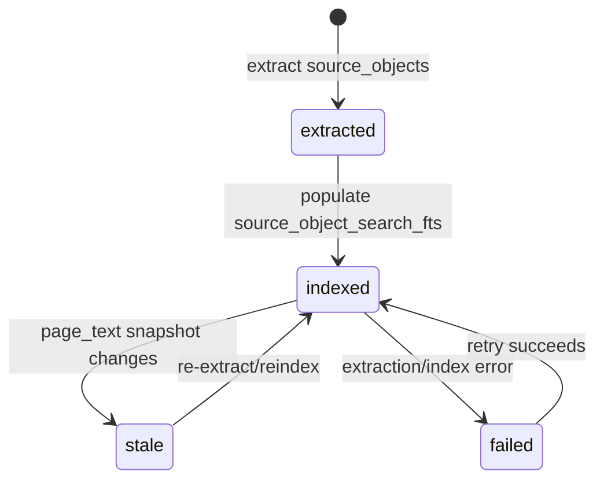
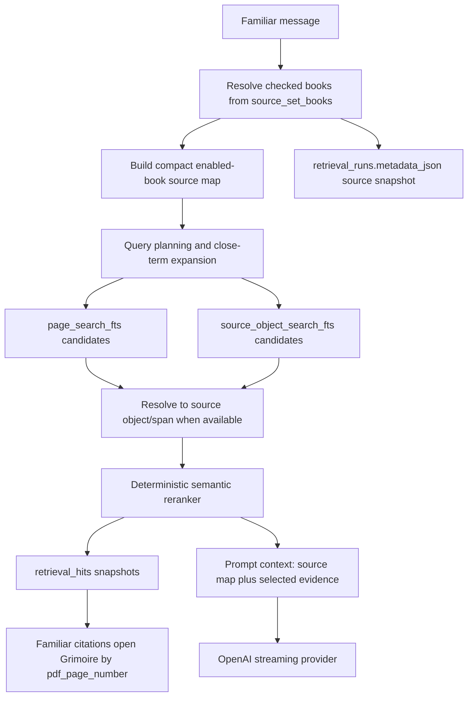

# Source-Map-Aware Hybrid Retrieval Implementation Plan

## 1. Source Boundary

Based on live code in `wfrp_companion/assistant/`, `wfrp_companion/search/`,
`wfrp_companion/source_objects/`, `wfrp_companion/db/schema.sql`,
`wfrp_companion/api/`, and the Familiar frontend citation surface. Also based
on `CLAUDE.md`, `AGENTS.md`, `wiki/CONTEXT.md`, `wiki/INDEX.md`,
`wiki/topics/ai-rag-system.md`, `wiki/topics/target-architecture.md`,
`wiki/topics/implementation-standards.md`, and
`docs/handoffs/2026-06-05-source-map-hybrid-retrieval-handoff.md`.

Intentionally excluded as architectural input: older phase plans under
`docs/plans/` except as historical implementation context already compiled into
the wiki, raw/private WFRP book text, and any hosted/public distribution
assumptions.

## 2. Current Live-Code Diagnosis

Before this slice, Familiar still used `chat_thread_source_books` as the
retrieval scope for every answer, so Library checkbox changes after thread
creation did not affect the next response. Retrieval stopped as soon as
page-level lexical FTS filled the prompt budget, making candidate order too
powerful. Source objects existed, but extraction did not populate
`source_object_search_fts`, and Familiar did not resolve page hits to source
objects or multi-page spans.

After this slice, the remaining fragility is mostly depth, not ownership:
semantic reranking is deterministic local overlap scoring, vector retrieval is
not implemented, and table/stat-block/glossary/index extraction is still future
work.

## 3. Architecture Decision

Recommended architecture: keep SQLite as the app-owned source of truth, use
Library source-set checkboxes as the per-message Familiar scope, generate broad
lexical/object candidates, resolve candidates to source objects where possible,
then rerank final evidence before prompt construction.

Avoid vector-only retrieval, one-off aliases, frontend-inferred scope, and
prompt stuffing. Those approaches either fail exact rules lookup, bypass user
scope, or make retrieval failures harder to debug.

## 4. Target State Model

No user-facing workflow state machine is needed for retrieval itself. Ownership
is:

- `source_set_books.enabled`: live Library checkbox scope.
- `chat_thread_source_books`: historical thread creation snapshot only.
- `retrieval_runs.metadata_json`: immutable per-answer source snapshot,
  source-map summary, and candidate list.
- `retrieval_hits`: immutable selected evidence and ranking snapshots.
- `book_object_status`: source-object extraction/index lifecycle per book.

## 5. Target Architecture Diagram

## 6. Proposed Data Model / Contracts

Current tables are sufficient for this slice:

- `source_objects`: canonical private structured evidence.
- `source_object_search` and `source_object_search_fts`: rebuildable object
  search projection.
- `book_object_status.status`: `indexed` means extraction and object FTS
  projection are current.
- `retrieval_runs.metadata_json`: `source_book_ids`, `source_map`, and
  `candidates`.
- `retrieval_hits`: selected evidence snapshots including `source_object_id`,
  `object_type_snapshot`, `title_snapshot`, `heading_path_snapshot_json`,
  `confidence_snapshot`, `rank_reasons_json`, `text_snapshot_sha256`, and
  page-range metadata in `metadata_json`.

Future vector work should add either a local vector table keyed by
`source_object_id` or a local vector-store manifest table with object IDs,
embedding model, text snapshot hash, and rebuild status.

## 7. External Integration Design

OpenAI remains the only external runtime integration for Familiar answers. The
backend sends only bounded source-map metadata, selected evidence text, and the
user prompt. It does not send unchecked-book source maps or candidates. Provider
failure keeps the app-owned `model_runs.status='failed'`, with retry using the
same user message and a fresh retrieval run.

No external vector database, hosted store, or public sharing surface should be
introduced in this phase.

## 8. Core Flow Design

Message flow:

1. Persist user message and queued `model_runs` row.
2. Transition run to `retrieving`.
3. Read `chat_threads.active_source_set_id`, then checked books from
   `source_set_books`.
4. Build compact source map only for checked books.
5. Generate page/object candidates without early prompt-budget truncation.
6. Resolve page hits to owning `source_objects` when overlap indicates the
   object is the better evidence unit.
7. Rerank candidates by semantic overlap, source-object type, confidence, and
   FTS signal.
8. Insert `retrieval_runs` and `retrieval_hits`.
9. Build prompt from checked-book source map plus final evidence only.
10. Stream provider response and complete/fail the model run.

## 9. UX / Surface Behavior

Library checkboxes control the next Familiar answer for the thread's source
set. Existing thread detail can still show the original thread source snapshot,
but that is not the retrieval authority for new model runs.

Familiar citations display printed page labels or page ranges when available.
`pdf_page_number` remains the hidden Grimoire jump target. The UI should not
show unchecked books as possible sources in source-map summaries, retrieved
context, or citations.

## 10. Implementation Sequence

Phase A, landed in this slice:

- Per-message checked-book scope for Familiar.
- `source_object_search_fts` population during extraction.
- Compact source-map prompt injection.
- Broad page/object candidate pool.
- Deterministic semantic reranking and rank reasons.
- Source-object span evidence and printed page-range citation labels.

Phase B:

- Add a rebuild/backfill CLI for `source_object_search_fts` over already
  extracted books.
- Add object-search API/debug output for local retrieval inspection.
- Add manual QA for `Knights of the Grail` Bretonnia queries against the real
  private library without logging book text.

Phase C:

- Add local vector embeddings for source objects as another candidate channel.
- Fuse page FTS, object FTS, source-map routing, and vector candidates.
- Keep reranking as the final gate.

Phase D:

- Extract tables, stat blocks, glossary entries, and index entries into typed
  objects and links.
- Pair child objects with parent sections when evidence would otherwise be
  incomplete.

## 11. Testing Requirements

Required tests per behavior-changing PR:

- Retrieval scope tests for enabled/disabled books.
- Candidate/reranking tests where lexical filler is rejected or outranked.
- Source-object span tests for multi-page sections.
- Prompt tests proving source map and evidence are bounded and scoped.
- Persistence tests for `retrieval_runs.metadata_json`,
  `retrieval_hits.rank_reasons_json`, and page-range metadata.
- Frontend citation tests for printed page labels/ranges and hidden PDF jump
  target.

## 12. Verification Matrix

- `Knights of the Grail` checked: Bretonnia query retrieves/cites that book.
- `Knights of the Grail` unchecked: same query does not use or cite it.
- Misspelled `Bretonia` can expand to enabled-source vocabulary.
- Conversational filler does not fill the final prompt context.
- Source-object section hit returns the full object span and page range.
- Retrieval logs include source snapshot, candidates, and rank reasons.
- Familiar prompt contains no unchecked-book source-map entries.
- Citation click opens by `pdf_page_number` while displaying printed labels.

## 13. Migration / Compatibility / Cleanup Strategy

No schema migration is required for this slice. Existing databases already have
the source-object and retrieval snapshot columns. Compatibility behavior:

- Existing `chat_thread_source_books` rows remain valid historical snapshots.
- Existing retrieval hits without object metadata remain `page_fallback` rows.
- Books extracted before this slice should be re-run through
  `tools/extract_source_objects.py` or a future object-FTS rebuild tool to fill
  `source_object_search_fts`.

Cleanup later: once per-run source snapshots are fully surfaced, decide whether
thread detail should label `chat_thread_source_books` as "created with" rather
than "current sources."

## 14. Operational Rollout Notes

Run migrations first if the local DB predates Phase 7:
`conda run -n wfrp-companion python tools/migrate_db.py`.

Then refresh source objects for searchable books:
`conda run -n wfrp-companion python tools/extract_source_objects.py`.

No network/firewall rollout is required beyond the existing OpenAI API key for
provider calls.

## 15. ADR / Platform Alignment

This aligns with the local-first SQLite architecture and the private
copyright boundary. It also follows the hybrid-search concept: exact search is
candidate generation, not the final judge. The transitional compromise is that
semantic reranking is deterministic local scoring until a local cross-encoder,
ColBERT-style reranker, or provider-backed reranker is intentionally added.

## 16. Non-Goals / Guardrails / Open Questions

Non-goals:

- Vector-only retrieval.
- Public sharing/export of book text.
- Full table/stat-block extraction for every book in this slice.
- Hosted deployment.
- Generic agent orchestration.

Guardrails:

- Never include unchecked books in source maps, candidates, prompts, or
  citations.
- Do not log or commit private extracted book text.
- Keep `pdf_page_number` as jump metadata, not display text.

Open questions:

- Which local embedding model/store should be used for vector candidates?
- How should printed page label calibration be backfilled for every book?
- Should source-map metadata eventually become a first-class table separate
  from `book_query_profiles`?
