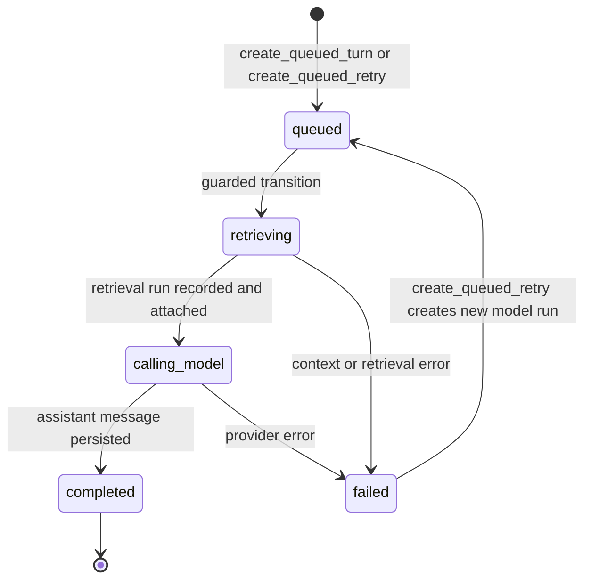

# Familiar Conversation Context Implementation Plan

> **For agentic workers:** REQUIRED SUB-SKILL: Use `superpowers:subagent-driven-development` (recommended) or `superpowers:executing-plans` to implement this plan task-by-task. Steps use checkbox (`- [ ]`) syntax for tracking.

**Goal:** Give Familiar bounded awareness of the chat it is currently in by adding prompt history and history-aware retrieval planning, while preserving the Library checkbox scope guarantee: source maps, retrieval candidates, semantic reranking, prompt evidence, and citations must only use currently checked books.

**Architecture:** SQLite remains the app-owned source of truth for chat history, retrieval runs, model runs, checked source snapshots, and audit metadata. A new local conversation-context layer selects completed prior turns before the current user message, converts a bounded slice into prompt messages, and builds a deterministic retrieval query plan that can resolve follow-up questions before the existing checked-book retrieval pipeline runs. OpenAI receives manually constructed message history for the current request only; provider-side conversations and `previous_response_id` are not used in this phase, and Responses requests must set `store=False`.

**Tech Stack:** Python 3.12, FastAPI, SQLite/WAL, pytest/coverage, OpenAI Responses API, React/Vite/TypeScript, Vitest, Playwright.

---

### 1. Source Boundary

This plan is based on these current sources:

- Planning prompt: `docs/plans/Implementation Plan Script.md`.
- Repo instructions: `CLAUDE.md` and `AGENTS.md`.
- Wiki topics: `wiki/CONTEXT.md`, `wiki/INDEX.md`, `wiki/topics/ai-rag-system.md`, `wiki/topics/target-architecture.md`, `wiki/topics/implementation-standards.md`, and `wiki/topics/testing-posture-and-conventions.md`.
- Live backend code:
  - `wfrp_companion/assistant/chat_service.py`
  - `wfrp_companion/assistant/chat_store.py`
  - `wfrp_companion/assistant/prompts.py`
  - `wfrp_companion/assistant/retrieval.py`
  - `wfrp_companion/assistant/source_map.py`
  - `wfrp_companion/assistant/candidates.py`
  - `wfrp_companion/assistant/reranking.py`
  - `wfrp_companion/assistant/evidence.py`
  - `wfrp_companion/assistant/query_planner.py`
  - `wfrp_companion/assistant/provider.py`
  - `wfrp_companion/config.py`
  - `wfrp_companion/db/schema.sql`
  - `wfrp_companion/api/schemas.py`
  - `wfrp_companion/api/routes/chat.py`
- Live frontend code:
  - `frontend/src/components/chat/AgentChatPanel.tsx`
  - `frontend/src/components/chat/AgentChatPanel.css`
  - `frontend/src/lib/apiClient.ts`
  - `frontend/src/types/api.ts`
- Existing test surfaces:
  - `tests/assistant/test_chat_service.py`
  - `tests/assistant/test_chat_store.py`
  - `tests/assistant/test_prompts.py`
  - `tests/assistant/test_provider.py`
  - `tests/assistant/test_retrieval.py`
  - `tests/assistant/test_retrieval_module_contracts.py`
  - `tests/assistant/test_query_planner.py`
  - `frontend/src/components/chat/AgentChatPanel.test.tsx`
- Official OpenAI docs:
  - Responses API reference: `https://platform.openai.com/docs/api-reference/responses`
  - Conversation state guide: `https://platform.openai.com/docs/guides/conversation-state?api-mode=responses`

Sources intentionally excluded as architectural input:

- Older phase plans under `docs/plans/` are not used as architecture sources. They are historical context only.
- Provider-side OpenAI conversation storage is not treated as the target architecture, even though the current OpenAI API supports it.
- WFRP PDF text is not used as fixture material or design content. Tests must use synthetic text.
- Azure is not involved in this local-first feature.

### 2. Current Live-Code Diagnosis

The current Familiar chat loop stores chat turns but does not use them as model context.

- `wfrp_companion/assistant/prompts.py` already supports prompt history through the `recent_messages` argument on `build_prompt_messages()`.
- `wfrp_companion/assistant/chat_service.py` discards that capability by passing `recent_messages=()` when building provider messages.
- The result is that a second message such as "what about his armor?" cannot use the prior "Tell me about Captain Alder" turn unless the current message repeats all needed nouns.

Retrieval planning is current-message only.

- `chat_service.stream_queued_result()` calls `retrieval.retrieve_context()` with `content` as the query.
- `wfrp_companion/assistant/retrieval.py` calls `build_enabled_source_map()` with terms from `meaningful_tokens(query)` and then calls `plan_query(query, source_map)` using that raw current `query`.
- Lexical and vector candidate generation therefore cannot seed the reranker with the antecedent terms needed by follow-up questions.

The database already has the right durable primitives, but no bounded context selector.

- `chat_messages` stores user and assistant messages by `thread_id`, `role`, `content`, and `created_at`.
- `model_runs` links `user_message_id`, `assistant_message_id`, `retrieval_run_id`, `retry_of_model_run_id`, and `status`.
- `load_turns_from_connection()` can rebuild UI turns, but it returns every model run for a thread and is not a prompt-safe context selection helper.
- There is no helper that loads only completed prior turns before the current user message, excludes failed and in-flight runs, applies turn and character budgets, and handles retry ordering.

Retrieval audit metadata does not distinguish original user wording from the effective retrieval query.

- `retrieval_runs.query` stores the current user content.
- `retrieval_runs.metadata_json` stores checked `source_book_ids`, enabled `source_map`, and generated `candidates`.
- There is no stored `retrieval_query`, no `history_message_ids`, and no `history_strategy`, so follow-up-aware retrieval would not be auditable if added only in memory.

The frontend has a visible history affordance that is still a placeholder.

- `frontend/src/components/chat/AgentChatPanel.tsx` keeps one active `threadId` in local component state.
- The history drawer renders "Chat persistence arrives in the agent phase" instead of loading `listChatThreads()` and `getChatThread()`.
- Existing tests prove a single mounted component reuses a thread, but users cannot return to a previous thread from the surface.

Provider integration is intentionally stateless today.

- `wfrp_companion/assistant/provider.py` sends `messages` directly to the OpenAI Responses API and streams response events.
- No provider-side conversation id or `previous_response_id` is persisted or sent.
- The current provider call does not set `store=False`, so the plan must explicitly make request retention behavior match the local-first memory boundary.
- Stateless request construction is good for local auditability and private checked-book scope, but the app must now do its own bounded history selection.

### 3. Architecture Decision

Implement a local conversation-context layer and keep SQLite as the only durable source of truth for Familiar memory.

Recommended architecture:

- Add `wfrp_companion/assistant/conversation_context.py`.
- Add a chat-store query helper that selects completed prior turns for a current user message.
- Convert the selected turns into bounded `prompts.PromptMessage` instances.
- Build a history-aware retrieval query from the current message plus the bounded prior-turn slice.
- Pass the history-aware retrieval query into `retrieval.retrieve_context()`.
- Continue passing the original user question into the `question` argument of `prompts.build_prompt_messages()`.
- Persist audit metadata on the retrieval run:
  - original user query in `retrieval_runs.query`
  - effective retrieval query in `retrieval_runs.metadata_json.retrieval_query`
  - selected history message ids in `retrieval_runs.metadata_json.history_message_ids`
  - selected turn count in `retrieval_runs.metadata_json.history_turn_count`
  - strategy in `retrieval_runs.metadata_json.history_strategy`
- Keep checked books authoritative by using the existing `current_thread_source_scope()` and `retrieval_run_source_books` snapshot for every retrieval run.

Avoid these alternatives:

- Do not use OpenAI Conversations API or `previous_response_id` for this phase. Hosted conversation state can preserve old retrieved context after the Library checkbox scope changes, is harder to audit locally, and weakens the repo's local-first privacy boundary.
- Do not leave Responses API request storage implicit. Set `store=False` so the local SQLite request history is the only memory mechanism for Familiar chat.
- Do not append the entire chat transcript to prompts. That creates token bloat, can leak stale retrieved evidence, and makes prompt behavior harder to test.
- Do not perform a one-off lexical patch such as simply concatenating the prior user message to the current search string. Retrieval should still flow through source-map candidate generation, rank fusion, semantic reranking, and section-aware evidence selection.
- Do not treat prior assistant answers as factual WFRP evidence. Chat history helps resolve references and maintain conversational continuity; retrieved evidence remains the only factual source for rules and setting claims.

### 4. Target State Model

The existing `model_runs.status` state machine remains authoritative. This feature adds deterministic context selection inside the existing `retrieving` phase; it does not add a new persisted workflow state.



Lifecycle ownership model:

- `model_runs.status` owns the provider-call lifecycle.
- `chat_messages` owns message text.
- `retrieval_runs` owns the immutable retrieval audit snapshot for one user message and one model run.
- `retrieval_run_source_books` owns the relational checked-book proof for that retrieval run.
- New conversation-context code owns only derived, bounded request-time context; it does not create durable state beyond retrieval metadata.

### 5. Target Architecture Diagram

```mermaid
flowchart LR
  User["User in Familiar chat"] --> ChatPanel["AgentChatPanel"]
  ChatPanel --> ChatAPI["FastAPI chat endpoints"]
  ChatAPI --> ChatService["chat_service.stream_queued_result"]
  ChatService --> Context["conversation_context"]
  Context --> Store["chat_store + SQLite"]
  Context --> RetrievalQuery["history-aware retrieval query"]
  ChatService --> Retrieval["retrieval.retrieve_context"]
  RetrievalQuery --> Retrieval
  Retrieval --> SourceScope["current_thread_source_scope"]
  SourceScope --> SQLiteBooks["checked source_set books"]
  Retrieval --> Candidates["page/object/vector candidates"]
  Candidates --> Reranker["rank fusion + semantic reranker"]
  Reranker --> Evidence["section-aware RetrievedHit objects"]
  ChatService --> Prompt["prompts.build_prompt_messages"]
  Context --> Prompt
  Evidence --> Prompt
  Prompt --> OpenAI["OpenAI Responses API streaming"]
  OpenAI --> ChatService
  ChatService --> Store
  ChatService --> ChatPanel
```



### 6. Proposed Data Model / Contracts

No schema migration is required for the first implementation. The current tables already support the needed relationships.

Existing tables used as-is:

- `chat_messages`
  - `id`
  - `thread_id`
  - `role`
  - `content`
  - `created_at`
  - `metadata_json`
- `model_runs`
  - `id`
  - `thread_id`
  - `user_message_id`
  - `assistant_message_id`
  - `retrieval_run_id`
  - `retry_of_model_run_id`
  - `provider`
  - `model`
  - `status`
  - `idempotency_key`
  - `provider_response_id`
  - `error_code`
  - `error_message`
  - `input_tokens`
  - `output_tokens`
  - `created_at`
  - `updated_at`
  - `completed_at`
  - `metadata_json`
- `retrieval_runs`
  - `id`
  - `thread_id`
  - `message_id`
  - `source_set_id`
  - `query`
  - `created_at`
  - `metadata_json`
- `retrieval_run_source_books`
  - `retrieval_run_id`
  - `source_set_id`
  - `book_id`
  - `book_title_snapshot`
  - `captured_at`
- `retrieval_hits`
  - existing rank, page, object, score, snapshot, and metadata fields.

Existing indexes used as-is:

- `ix_chat_messages_thread_created on chat_messages(thread_id, created_at, id)`
- `ix_retrieval_runs_thread_message on retrieval_runs(thread_id, message_id, created_at)`
- `ux_model_runs_one_active_retry` for retry concurrency.

New config fields in `wfrp_companion/config.py`:

```python
chat_prompt_history_turn_limit: int = 6
chat_prompt_history_char_limit: int = 2500
chat_retrieval_history_turn_limit: int = 3
chat_retrieval_query_char_limit: int = 900
```

New env vars:

```text
WFRP_CHAT_PROMPT_HISTORY_TURN_LIMIT
WFRP_CHAT_PROMPT_HISTORY_CHAR_LIMIT
WFRP_CHAT_RETRIEVAL_HISTORY_TURN_LIMIT
WFRP_CHAT_RETRIEVAL_QUERY_CHAR_LIMIT
```

New backend contracts:

```python
@dataclass(frozen=True)
class ConversationHistoryMessage:
    id: str
    role: str
    content: str
    created_at: str


@dataclass(frozen=True)
class ConversationContext:
    prompt_messages: tuple[prompts.PromptMessage, ...]
    retrieval_query: str
    history_message_ids: tuple[str, ...]
    history_turn_count: int
    history_strategy: str
```

Recommended public helper:

```python
def build_conversation_context(
    config: AppConfig,
    *,
    thread_id: str,
    current_user_message_id: str,
    current_user_content: str,
) -> ConversationContext:
    raise NotImplementedError
```

Recommended chat-store helper:

```python
def load_completed_turn_messages_before_user_message(
    connection: sqlite3.Connection,
    *,
    thread_id: str,
    before_user_message_id: str,
    max_turns: int,
) -> tuple[ConversationHistoryMessage, ...]:
    raise NotImplementedError
```

Logical chat thread read-model contract:

- `get_thread_detail()` should return one logical turn per `user_message_id`, not one visible turn per `model_runs` row.
- If a user message has one or more completed model runs, choose the latest completed run by `(completed_at, id)` and expose that assistant response.
- If a user message has no completed run but has an active queued/retrieving/calling_model run, expose the newest active run.
- If a user message has only failed runs, expose the newest failed run and mark it retryable only when no newer active or completed retry exists for the same `user_message_id`.
- This read model prevents a reloaded history drawer from showing an obsolete failed turn beside its successful retry.
- The prompt-history selector should use the same "latest completed logical turn" rule when multiple completed retries exist for a prior user message.

Retrieval metadata contract:

```json
{
  "source_book_ids": ["book_core"],
  "source_map": [],
  "candidates": ["armor", "captain alder armor"],
  "retrieval_query": "what about his armor?\n\nRecent chat context:\nCaptain Alder, knightly armor",
  "history_message_ids": ["message_1", "message_2"],
  "history_turn_count": 1,
  "history_strategy": "followup_contextualized"
}
```

Compatibility contract:

- `retrieval_runs.query` remains the original current user text.
- Existing readers that inspect `metadata_json.source_book_ids`, `source_map`, and `candidates` continue to work.
- The new metadata keys are additive and optional for older retrieval rows.

### 7. External Integration Design

The only external integration is the OpenAI Responses API.

Source of truth boundary:

- WFRP Companion owns chat messages, selected history, retrieval context, citations, and checked-book snapshots.
- OpenAI owns only streamed model generation for a single request.
- OpenAI response ids remain stored in `model_runs.provider_response_id` for audit/debugging, not as conversation-state ownership.
- `wfrp_companion/assistant/provider.py` must pass `store=False` to `client.responses.create()` so manually supplied local history is not also retained as OpenAI response state for this feature.

What gets sent:

- `provider.OpenAIProvider.stream_response()` continues to receive an explicit `messages` sequence.
- `provider.OpenAIProvider.stream_response()` sends `store=False`, `stream=True`, and `extra_headers={"X-Client-Request-Id": request_id}`.
- The message sequence becomes:
  - system instructions
  - bounded recent user/assistant messages from local SQLite
  - current user message containing the original question, enabled source map, and retrieved evidence

What does not get sent:

- Provider-side `conversation`
- `previous_response_id`
- stored Responses state for chat memory
- unchecked-book source maps
- unchecked-book candidate text
- unchecked-book evidence
- full unbounded transcripts
- local filesystem paths

Idempotency:

- Existing `model_runs.idempotency_key` remains the app idempotency guard for sends and retries.
- Provider request id remains `request_id=result.model_run.id`.
- If an idempotency replay returns an already completed model run, `stream_queued_result()` yields the existing completed result and does not recompute history.
- Provider tests must assert that `responses.create()` receives `store=False` along with the explicit message list.

Retry behavior:

- A retry creates a new queued `model_runs` row for the same original `user_message_id`.
- Conversation context for a retry must be selected before the original user message, not before the retry model-run timestamp.
- A retry must not include failed assistant text because no assistant message is attached to failed runs.

External down behavior:

- If the provider factory raises `ProviderUnavailableError`, the run fails with `provider_unavailable` before retrieval, matching current behavior.
- If streaming raises `ProviderUnavailableError`, the run fails with `provider_unavailable`.
- Generic context, retrieval, prompt, or provider exceptions continue to fail the run with `provider_error` until a more specific error code is justified by implementation.

### 8. Core Flow Design

#### Send message flow

1. `stream_chat_message()` calls `chat_store.create_queued_turn()`.
2. `stream_queued_result()` yields `accepted`.
3. It transitions `model_runs.status` from `queued` to `retrieving`.
4. It builds local `ConversationContext` for `result.user_message.id`.
5. It calls `retrieval.retrieve_context()` with `conversation_context.retrieval_query`.
6. Retrieval resolves checked books from `current_thread_source_scope()` and snapshots the checked books into `retrieval_run_source_books`.
7. `chat_store.record_retrieval_run()` stores:
   - `query=content`
   - checked source metadata
   - `retrieval_query`
   - `history_message_ids`
   - `history_turn_count`
   - `history_strategy`
8. The retrieval run is attached to the model run.
9. The service yields `retrieval` with citations derived from checked-book hits.
10. It transitions `retrieving` to `calling_model`.
11. It builds prompt messages with bounded `recent_messages`.
12. It streams provider deltas.
13. It completes the run with a persisted assistant message.

#### History selection flow

The helper must select only logical turns whose assistant response completed before the current user message. Recommended SQL shape:

```sql
select
  user_msg.id as user_message_id,
  user_msg.content as user_content,
  user_msg.created_at as user_created_at,
  assistant_msg.id as assistant_message_id,
  assistant_msg.content as assistant_content,
  assistant_msg.created_at as assistant_created_at
from model_runs
join chat_messages as user_msg
  on user_msg.id = model_runs.user_message_id
join chat_messages as assistant_msg
  on assistant_msg.id = model_runs.assistant_message_id
where model_runs.thread_id = :thread_id
  and model_runs.status = 'completed'
  and model_runs.user_message_id is not null
  and model_runs.assistant_message_id is not null
  and model_runs.completed_at is not null
  and (
    user_msg.created_at < :current_user_created_at
    or (
      user_msg.created_at = :current_user_created_at
      and user_msg.id < :current_user_message_id
    )
  )
  and (
    assistant_msg.created_at < :current_user_created_at
    or (
      assistant_msg.created_at = :current_user_created_at
      and assistant_msg.id < :current_user_message_id
    )
  )
  and not exists (
    select 1
    from model_runs as newer_completed
    join chat_messages as newer_assistant_msg
      on newer_assistant_msg.id = newer_completed.assistant_message_id
    where newer_completed.thread_id = model_runs.thread_id
      and newer_completed.user_message_id = model_runs.user_message_id
      and newer_completed.status = 'completed'
      and newer_completed.completed_at is not null
      and (
        newer_assistant_msg.created_at < :current_user_created_at
        or (
          newer_assistant_msg.created_at = :current_user_created_at
          and newer_assistant_msg.id < :current_user_message_id
        )
      )
      and (
        newer_completed.completed_at > model_runs.completed_at
        or (
          newer_completed.completed_at = model_runs.completed_at
          and newer_completed.id > model_runs.id
        )
      )
  )
order by user_msg.created_at desc, user_msg.id desc
limit :max_turns;
```

Implementation rules:

- Reverse the selected rows back to chronological order before prompt assembly.
- Include user and assistant messages as separate prompt messages.
- Apply `chat_prompt_history_char_limit` across the final selected message contents.
- Scrub local paths with the same path-scrubbing helper used for retrieved context, or move that helper to a small shared module if import cycles appear.
- Exclude rows whose assistant message is missing.
- Exclude failed, queued, retrieving, and calling_model runs.
- For retries, anchor on the original `before_user_message_id` so the retry does not see later turns as prior context for that user message.
- For prior user messages with multiple completed retries, include only the latest completed run's assistant response.

#### History-aware retrieval query flow

The retrieval query planner must stay deterministic for this phase.

1. Tokenize the current user message with existing `meaningful_tokens()`.
2. Detect follow-up style queries using low-signal structure:
   - few meaningful tokens
   - pronouns or deictic words such as `it`, `its`, `they`, `them`, `he`, `his`, `she`, `her`, `that`, `those`, `there`, `same`, `above`
   - phrases such as `what about`, `how about`, `and`, `also`, `compare`, `what else`
3. If the current query is self-contained, use the current query as the retrieval query.
4. If it is a follow-up, append bounded prior-turn context, prioritizing the most recent user message and compact assistant answer text.
5. Cap the final retrieval query with `chat_retrieval_query_char_limit`.
6. Do not add source-map terms from unchecked books. The retrieval pipeline will build source maps only after current checked scope resolution.

Recommended deterministic contract:

```python
def build_history_aware_retrieval_query(
    *,
    current_user_content: str,
    history_messages: Sequence[ConversationHistoryMessage],
    char_limit: int,
) -> tuple[str, str]:
    """Return (retrieval_query, history_strategy)."""
```

Strategy values:

- `none` when no history messages are selected.
- `self_contained` when history exists but current query is already specific enough.
- `followup_contextualized` when prior context is appended.

The retrieval query can include labels to keep the text understandable without turning chat history into evidence:

```text
Current question:
what about his armor?

Recent chat terms for reference resolution:
User: Tell me about Captain Alder.
Familiar: Captain Alder is a synthetic knightly NPC associated with a named retinue.
```

#### Prompt construction flow

`prompts.SYSTEM_INSTRUCTIONS` should be extended to make the history/evidence boundary explicit:

```text
Use chat history only to understand conversational references and user intent.
Do not treat chat history as retrieved rules or setting evidence.
For factual WFRP claims, rely on the retrieved context supplied in the current request.
```

`build_prompt_messages()` should continue to return:

1. system prompt
2. bounded recent prompt messages
3. current user prompt containing question, source map, and retrieved context

The current user prompt must continue to include the original current user text, not the expanded retrieval query.

#### Retrieval run persistence flow

Extend `chat_store.record_retrieval_run()` with optional keyword-only metadata:

```python
def record_retrieval_run(
    config: AppConfig,
    *,
    thread_id: str,
    message_id: str,
    source_set_id: str | None,
    query: str,
    hits: Sequence[object],
    source_book_ids: Sequence[str] = (),
    source_map: Sequence[object] = (),
    candidates: Sequence[str] = (),
    retrieval_query: str | None = None,
    history_message_ids: Sequence[str] = (),
    history_turn_count: int = 0,
    history_strategy: str = "none",
) -> str:
    raise NotImplementedError
```

Update `retrieval_run_metadata()` to include these fields only when meaningful so old behavior remains compact.

#### Frontend history flow

1. When `historyOpen` becomes true, call `client.listChatThreads()`.
2. Render a dense thread list sorted by backend order.
3. Thread selection is disabled while `sending` is true, and tests must prove in-flight streams cannot write into a different selected transcript.
4. Selecting a thread calls `client.getChatThread(thread.id)`.
5. Convert logical `ChatThreadDetailResponse.turns` into `TranscriptTurn[]`.
6. Set `threadId` to the selected thread id and render loaded turns.
7. If the selected thread has no turns, render the normal ready state.
8. After a successful new send, refresh or prepend the active thread summary when the drawer is open.
9. Update stream handling to patch turns by `event.model_run.id` and `event.thread.id` instead of blindly updating the last rendered turn.

The frontend does not need to expose retrieval-query internals.

### 9. UX / Surface Behavior

| Surface | Target behavior |
| --- | --- |
| Active Familiar transcript | Follow-up questions in the same thread behave as if Familiar knows the recent conversation. |
| Chat history drawer | Lists persisted chat threads instead of placeholder copy. |
| Loaded historical thread | Shows existing turns and citations, then lets the user continue that thread. |
| Citations | Continue to show only checked-book evidence selected for the current retrieval run. |
| Library checkbox changes | Affect new retrieval runs immediately through `current_thread_source_scope()`. Old assistant text remains visible as chat history, but new factual claims must be grounded in newly retrieved checked-book context. |
| Failed turns | Remain retryable when backend says so; failed assistant text is not invented or included in future prompt history. |
| Empty history | Same "Familiar ready" state as today. |

State-to-surface rules:

| Backend state | Surface behavior |
| --- | --- |
| `queued` | Accepted turn appears with empty assistant content. |
| `retrieving` | Citations may appear when retrieval event arrives. |
| `calling_model` | Text deltas stream into the matching active turn/run. |
| `completed` | Assistant content and citations are stable. |
| `failed` | Error message and retry button render if retryable. |

User-facing copy should not explain internal retrieval query planning. The behavior should feel like normal chat continuity.

### 10. Implementation Sequence

#### Phase 1: Backend prompt history selection

Scope:

- Add local bounded history selection.
- Pass selected prompt messages to OpenAI requests.
- Keep retrieval current-message only for this phase.

Steps:

- [ ] Add config fields and env parsing in `wfrp_companion/config.py`.
- [ ] Add `wfrp_companion/assistant/conversation_context.py` with dataclasses and prompt-message selection helpers.
- [ ] Add a chat-store helper to load completed prior user/assistant pairs before a current user message.
- [ ] Update `chat_service.stream_queued_result()` to build context after the `queued` to `retrieving` transition and pass `conversation_context.prompt_messages` into `prompts.build_prompt_messages()`.
- [ ] Extend `prompts.SYSTEM_INSTRUCTIONS` with the history/evidence boundary.
- [ ] Update `provider.OpenAIProvider.stream_response()` to pass `store=False` to `client.responses.create()`.
- [ ] Add tests before implementation:
  - prompt history is included between system and current user prompt
  - failed/in-flight turns are excluded
  - retry uses context before the original user message
  - prior user messages with multiple completed retries use only the latest completed assistant response
  - prompt history respects turn and char limits
  - provider receives prior user and assistant messages in chronological order
  - OpenAI provider requests include `store=False`

Required tests:

- `tests/assistant/test_chat_store.py`
- `tests/assistant/test_prompts.py`
- `tests/assistant/test_chat_service.py`
- `tests/assistant/test_provider.py`

What intentionally does not change:

- Retrieval query planning still uses the current user message.
- Frontend history drawer still may remain placeholder until Phase 3.
- No schema migration.

#### Phase 2: History-aware retrieval planning and audit metadata

Scope:

- Add deterministic follow-up-aware retrieval query construction.
- Store the effective retrieval query and history metadata.
- Preserve checked-book retrieval scope.

Steps:

- [ ] Add `build_history_aware_retrieval_query()` to `conversation_context.py` or a focused `wfrp_companion/assistant/conversation_query.py` if the module grows too large.
- [ ] Update `ConversationContext` to include `retrieval_query`, `history_message_ids`, `history_turn_count`, and `history_strategy`.
- [ ] Update `chat_service.stream_queued_result()` to call `retrieval.retrieve_context()` with `conversation_context.retrieval_query`.
- [ ] Keep `prompts.build_prompt_messages()` using `question=content` so the current prompt shows the original current user text.
- [ ] Extend `chat_store.record_retrieval_run()` and `retrieval_run_metadata()` with additive optional fields.
- [ ] Add tests before implementation:
  - self-contained questions keep `retrieval_query == content`
  - follow-up questions append recent context
  - retrieval metadata stores original query separately from effective retrieval query
  - checked source scope remains authoritative for candidates, source map, hits, and citations
  - semantic reranker can select a history-resolved hit when the raw follow-up terms alone would fail

Required tests:

- `tests/assistant/test_chat_service.py`
- `tests/assistant/test_chat_store.py`
- `tests/assistant/test_retrieval.py`
- `tests/assistant/test_query_planner.py` or a new `tests/assistant/test_conversation_context.py`

What intentionally does not change:

- No LLM-based query rewriting.
- No provider-side conversation state.
- No provider-side response storage for chat memory; set `store=False` in the provider call.
- No new vector provider or embedding behavior.
- No public surfacing of retrieval query text.

#### Phase 3: Frontend chat history surface

Scope:

- Replace the placeholder history drawer with persisted thread list/load behavior.
- Add a logical-turn read model so retries reload as one visible turn per user message.
- Keep the UI calm and dense.

Steps:

- [ ] Update `chat_store.load_turns_from_connection()` or add a dedicated read-model helper so `get_thread_detail()` returns one logical turn per `user_message_id`.
- [ ] Add backend tests for failed retry collapse, successful retry collapse, active retry display, and retryable flag behavior after reload.
- [ ] Add a small `threadToTranscriptTurns()` conversion helper in `AgentChatPanel.tsx` or a nearby chat utility file.
- [ ] Load thread summaries when `historyOpen` changes to true.
- [ ] Render thread buttons with title and updated timestamp.
- [ ] Selecting a thread loads `getChatThread(thread.id)`, sets active `threadId`, and renders persisted logical turns.
- [ ] Disable thread selection while a send is in flight and update stream events by thread/run identity rather than by the last rendered turn.
- [ ] Preserve current streaming behavior for the active thread.
- [ ] Refresh the thread list after a successful send when the drawer is open.
- [ ] Add frontend tests before implementation:
  - drawer loads and renders persisted threads
  - selecting a thread renders stored turns and citations
  - sending after selecting a historical thread reuses that thread id
  - selecting a different thread is disabled or ignored while streaming
  - stream events update the matching run and cannot mutate another selected transcript
  - history API failures show a compact panel error without breaking the active transcript

Required tests:

- `tests/assistant/test_chat_store.py`
- `tests/api/test_chat_routes.py`
- `frontend/src/components/chat/AgentChatPanel.test.tsx`

What intentionally does not change:

- No thread rename UI.
- No delete/archive UI.
- No cross-device sync.

#### Phase 4: Documentation, verification, and PR readiness

Scope:

- Update durable wiki knowledge to match the implemented state.
- Run backend and frontend gates.
- Prepare the feature branch/PR after all independently testable slices are green.

Steps:

- [ ] Update `wiki/topics/ai-rag-system.md` to describe prompt history, history-aware retrieval planning, and the evidence boundary.
- [ ] Update `wiki/topics/target-architecture.md` to note local SQLite-owned conversation context and no provider-side memory.
- [ ] Update `wiki/topics/testing-posture-and-conventions.md` with any new test files or coverage gates.
- [ ] Run focused backend tests for changed modules.
- [ ] Run the full backend coverage gate.
- [ ] Run frontend unit coverage and build if Phase 3 changed frontend code.
- [ ] Run Playwright e2e if chat history surface behavior changes materially.
- [ ] Have an independent review agent inspect the implementation and tests before pushing.

Required verification commands are listed in section 12.

### 11. Testing Requirements

Backend unit and integration tests:

- History selector tests:
  - selects only completed prior turns
  - orders selected messages chronologically
  - excludes current message
  - excludes failed, queued, retrieving, and calling_model runs
  - handles retry of failed run by anchoring before the original user message
  - selects only the latest completed logical turn for a prior user message with successful retries
  - applies turn and character budgets deterministically
- Prompt tests:
  - system prompt states the history/evidence boundary
  - recent messages appear before the current user prompt
  - current user prompt keeps source map and retrieved context
  - private paths are scrubbed
- Chat service tests:
  - fake provider captures messages and sees bounded prior turns
  - retrieval is called with the history-aware retrieval query
  - stored retrieval metadata includes history fields
  - idempotency replay does not recompute or duplicate retrieval runs
  - provider failures still transition model runs correctly
- Provider tests:
  - OpenAI Responses calls include `store=False`
  - Responses calls do not include `conversation` or `previous_response_id`
- Backend chat read-model tests:
  - thread detail collapses failed run plus successful retry into one visible logical turn
  - obsolete failed runs are not retryable after a newer active or completed retry exists
  - active retry is visible as the current logical turn until it completes or fails
- Retrieval tests:
  - follow-up query can retrieve a source object/page using prior-turn antecedent terms
  - unchecked books remain excluded from source maps, candidates, hits, prompt context, and citations
  - vector candidates, when enabled, still filter by checked `book_id`
  - semantic reranking remains the gate for prompt evidence

Frontend tests:

- History drawer loads summaries.
- Selecting a thread loads turns.
- Sending after selection uses the selected thread id.
- Thread selection is disabled or ignored while a send is in flight.
- Stream events update the matching thread/run instead of the last visible turn.
- Retry behavior still updates the correct turn.
- Citation buttons still call `onOpenCitation`.
- History API errors do not erase active transcript state.

Coverage requirements:

- Any changed backend module must have 100% coverage.
- The full backend coverage gate must remain at 100%.
- Frontend coverage must stay above configured thresholds in `frontend/vitest.config.ts`.

Use synthetic text only. Do not copy WFRP book text into tests or fixtures.

### 12. Verification Matrix

| Scenario | Expected result | Required verification |
| --- | --- | --- |
| First message in a new thread | No prompt history; retrieval query equals user content; normal citations. | Backend chat service test. |
| Second self-contained message | Prompt includes prior turn; retrieval query remains current content. | Backend chat service test. |
| Follow-up pronoun question | Prompt includes prior turn; retrieval query includes bounded prior context; reranker selects relevant checked evidence. | Backend retrieval/chat service test. |
| Failed prior turn | Failed assistant content is not included as history. | Chat-store/conversation-context test. |
| Retry of failed turn | Retry context is based on turns before the original user message. | Chat service retry test. |
| Reload after successful retry | Thread detail shows one logical turn for the user message and does not expose the obsolete failed run as retryable. | Chat-store/API route test. |
| Library checkbox changes between turns | New retrieval uses current checked source scope only. | Retrieval scope test with checked and unchecked books. |
| Unchecked book has stronger lexical match | It does not appear in source map, candidates, hits, prompt context, or citations. | Retrieval test. |
| Prompt history contains path-like text | Local paths and PDF filenames are scrubbed. | Prompt/context test. |
| OpenAI request built | Request includes explicit messages, `stream=True`, `store=False`, and no provider-side conversation linkage. | Provider test. |
| History drawer opens | Thread list renders instead of placeholder copy. | Frontend test. |
| Historical thread selected | Stored turns render and next send uses selected `threadId`. | Frontend test. |
| User tries to switch thread during stream | Selection is disabled/ignored or stream events remain scoped to their original thread/run. | Frontend test. |
| Provider unavailable before retrieval | Run fails with `provider_unavailable`; no retrieval run is written. | Existing/new chat service test. |
| Provider error during streaming | Run fails; retry remains available; prompt history remains bounded on retry. | Chat service test. |

Verification commands:

```bash
conda run -n wfrp-companion python -m pytest \
  tests/assistant/test_chat_store.py \
  tests/assistant/test_prompts.py \
  tests/assistant/test_chat_service.py \
  tests/assistant/test_provider.py \
  tests/assistant/test_retrieval.py \
  tests/assistant/test_query_planner.py \
  --cov=wfrp_companion.assistant.chat_store \
  --cov=wfrp_companion.assistant.prompts \
  --cov=wfrp_companion.assistant.chat_service \
  --cov=wfrp_companion.assistant.provider \
  --cov=wfrp_companion.assistant.retrieval \
  --cov=wfrp_companion.assistant.query_planner \
  --cov=wfrp_companion.assistant.conversation_context \
  --cov-report=term-missing \
  --cov-fail-under=100
```

```bash
conda run -n wfrp-companion python -m pytest \
  --cov=wfrp_companion \
  --cov=tools.init_db \
  --cov=tools.import_pdfs \
  --cov=tools.import_page_text \
  --cov=tools.rebuild_fts \
  --cov=tools.rebuild_source_object_fts \
  --cov=tools.rebuild_source_maps \
  --cov=tools.rebuild_embeddings \
  --cov=tools.backfill_page_labels \
  --cov=tools.search_text \
  --cov=tools.source_sets \
  --cov=tools.serve_api \
  --cov=tools.dev \
  --cov=tools.migrate_db \
  --cov=tools.extract_source_objects \
  --cov-report=term-missing \
  --cov-fail-under=100
```

```bash
conda run -n wfrp-companion ruff check .
```

```bash
npm --prefix frontend run test:coverage
npm --prefix frontend run build
```

If frontend behavior changes the browser-visible chat workflow:

```bash
npm --prefix frontend run test:e2e
```

### 13. Migration / Compatibility / Cleanup Strategy

No database migration is required for the initial feature.

Steady-state:

- Existing chat rows remain valid.
- Existing retrieval rows remain valid without the new metadata keys.
- New retrieval rows include additive history-aware metadata.
- `retrieval_runs.query` continues to mean original user text.

Compatibility scaffolding:

- Metadata readers must tolerate missing `retrieval_query`, `history_message_ids`, `history_turn_count`, and `history_strategy`.
- Frontend history loading must tolerate threads with zero turns and turns with missing assistant messages.

Cleanup after implementation:

- Remove the placeholder "Chat persistence arrives in the agent phase" copy once the history drawer is live.
- Remove any temporary test-only helper only if it is not part of the production contract.
- Do not remove old retrieval metadata compatibility paths because existing local databases can contain earlier retrieval rows.

Cases that need special handling:

- Ambiguous same-timestamp ordering is resolved by `(created_at, id)`, matching the existing `ix_chat_messages_thread_created` index. If this proves insufficient under concurrent multi-client use, a future migration can add an explicit per-thread turn sequence, but this phase should not add one without evidence.
- Multiple completed retries for the same user message should resolve to one logical turn. The history selector and thread detail read model should prefer the latest completed run that completed before the current user message, and should never include the current user message's own completed retry as prior context for itself.

### 14. Operational Rollout Notes

Rollout characteristics:

- No manual SQL apply is needed.
- No Azure, hosted worker, queue, or outbox enablement is needed.
- The feature is local-first and works with existing SQLite databases.
- New config values should have safe defaults and should not require `.env` changes.

Recovery:

- If prompt history causes an unexpected provider issue, lowering `WFRP_CHAT_PROMPT_HISTORY_TURN_LIMIT` to `0` should disable prompt history while preserving the rest of the chat pipeline.
- If follow-up retrieval expansion behaves poorly, lowering `WFRP_CHAT_RETRIEVAL_HISTORY_TURN_LIMIT` to `0` should force retrieval queries back to current-message-only behavior.

Development server:

- The documented local app command remains:

```bash
source "$(conda info --base)/etc/profile.d/conda.sh" && conda activate wfrp-companion && python tools/dev.py
```

Manual smoke path:

1. Start the app.
2. Open `http://127.0.0.1:5173/`.
3. Enable a known indexed test/source book in Library.
4. Ask a self-contained question.
5. Ask a follow-up using a pronoun or "what about".
6. Confirm citations still point only to checked books.
7. Open the history drawer, select the thread, and continue the chat.

### 15. ADR / Platform Alignment

This plan aligns with the current platform direction:

- Local-first storage remains the default.
- SQLite remains the app-owned state store for MVP behavior.
- Familiar continues to use hybrid retrieval: lexical and vector channels generate candidates; rank fusion and semantic reranking decide prompt evidence.
- Library checkbox scope remains authoritative for source maps, candidates, evidence, prompt context, and citations.
- Prompt context remains bounded and citation-focused.
- Retrieval metadata remains rich enough to debug ranking without reproducing copyrighted books.

Tensions and resolution:

- OpenAI now offers hosted conversation state, but WFRP Companion's privacy and checked-source-scope requirements are stronger than the convenience of provider-managed memory. Manual local history is the correct phase fit.
- Chat history is useful for natural conversation, but it must not become factual evidence. The system prompt, prompt structure, and tests must preserve that boundary.
- The existing schema lacks a turn sequence. `(created_at, id)` ordering is acceptable for the current local app and is backed by an existing index; a future explicit sequence can be added if multi-client concurrency becomes real product pressure.

### 16. Non-Goals / Guardrails / Open Questions

Non-goals:

- Do not implement provider-side OpenAI Conversations or `previous_response_id`.
- Do not implement LLM-based query rewriting in this phase.
- Do not implement long-term campaign memory, NPC memory, session summaries, or user profiles.
- Do not add hosted sync, auth, multi-device state, delete/archive, or thread rename workflows.
- Do not change ingestion, source-object extraction, vector indexing, or reranker architecture except where tests need to prove scope remains intact.
- Do not expose WFRP book text beyond bounded retrieved snippets and citations.
- Do not use WFRP copyrighted text in tests.

Guardrails:

- Checked Library scope is authoritative for every new retrieval run.
- Prior assistant text is conversational context only.
- Retrieved context is factual evidence.
- Keep all history and retrieval query budgets explicit and configurable.
- Keep metadata additive for existing databases.
- Keep frontend chat controls dense and practical, not a marketing surface.

Open questions for implementation review:

- Should the frontend thread list show the raw backend title only, or derive a first-message preview when title is still `Familiar Chat`? The initial implementation should use the backend title and timestamp to avoid adding title-generation scope.
- Should history-aware retrieval append assistant text or only prior user text? The recommended first slice uses both, bounded tightly, because assistant answers often contain resolved nouns. Tests must prove assistant text is not treated as evidence.
- Should `history_strategy` be surfaced in a debug endpoint? The initial implementation should store it in retrieval metadata only.

### Implementation Agent Checklist

- [ ] Use `superpowers:test-driven-development` before changing behavior.
- [ ] Keep changes scoped to the files named in this plan unless live code forces a small adjacent edit.
- [ ] Add tests before implementation for each behavior change.
- [ ] Maintain 100% backend coverage.
- [ ] Run the verification commands in section 12.
- [ ] Use an independent review agent before PR push.
- [ ] Update the wiki after implementation to reflect the current codebase.
