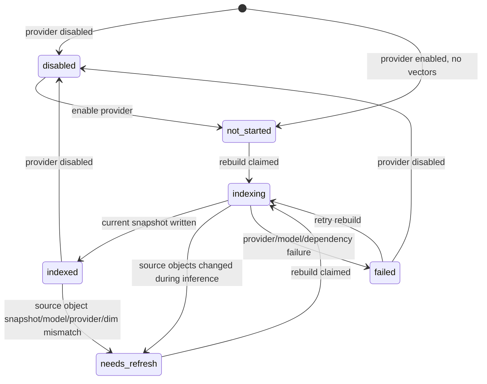
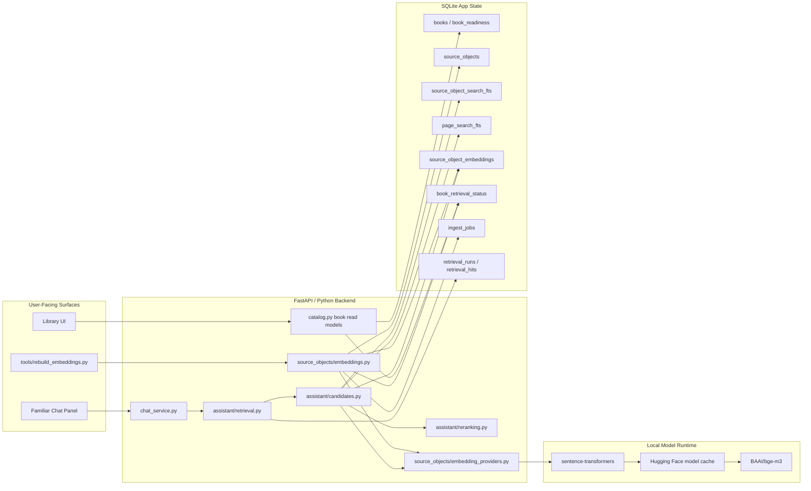

# Local Semantic Embeddings For Familiar RAG Implementation Plan

> **For agentic workers:** REQUIRED SUB-SKILL: Use superpowers:subagent-driven-development (recommended) or superpowers:executing-plans to implement this plan task-by-task. Steps use checkbox (`- [ ]`) syntax for tracking.

**Goal:** Replace Familiar's deterministic `local-hash` vector smoke-test path with a real local semantic embedding provider, defaulting to `BAAI/bge-m3`, while preserving the existing local-first, cited, hybrid RAG pipeline.

**Architecture:** Keep SQLite as the app-owned source of truth for vector lifecycle state and stored source-object vectors. Add a provider protocol and a `sentence-transformers` local provider that feeds the existing source-object embedding rebuild, vector candidate, reciprocal-rank-fusion, reranking, and citation flow. Do not introduce a separate vector database or route Familiar around existing checked-book scope controls.

**Tech Stack:** Python 3.12, SQLite, FastAPI, React/Vite, `sentence-transformers`, Hugging Face model cache, existing SQLite FTS, existing Familiar retrieval modules.

---

## 1. Source Boundary

This plan is based on the current live code in:

- `wfrp_companion/config.py`
- `wfrp_companion/source_objects/embeddings.py`
- `wfrp_companion/assistant/candidates.py`
- `wfrp_companion/assistant/retrieval.py`
- `wfrp_companion/assistant/reranking.py`
- `wfrp_companion/assistant/chat_service.py`
- `wfrp_companion/db/schema.sql`
- `wfrp_companion/db/migrations.py`
- `tools/rebuild_embeddings.py`
- `wfrp_companion/api/schemas.py`
- `wfrp_companion/library/catalog.py`
- `frontend/src/types/api.ts`
- Existing tests under `tests/source_objects/`, `tests/assistant/`, `tests/tools/`, `tests/api/`, and `frontend/src/`.

It is also based on the compiled wiki pages:

- `wiki/topics/implementation-standards.md`
- `wiki/topics/ai-rag-system.md`
- `wiki/concepts/hybrid-search-for-rules.md`
- `wiki/topics/testing-posture-and-conventions.md`
- `wiki/topics/local-tooling-and-packaging.md`

Third-party documentation checked for current integration constraints:

- Sentence Transformers semantic-search docs: local corpus embeddings and query embeddings can be computed locally, with manual semantic search acceptable for corpora up to about one million entries.
- BGE-M3 model card: `BAAI/bge-m3` is MIT licensed, 1024-dimensional, supports 8192-token inputs, and supports dense, sparse, and multi-vector modes. This plan starts dense-only.
- Qwen3 Embedding 0.6B model card: Apache 2.0, 0.6B parameters, 32k context, 1024-dim maximum, and instruction-aware query encoding. This is a future/experimental provider profile, not the first default.
- OpenAI embedding model docs and pricing: `text-embedding-3-small` is currently listed at $0.02 per 1M tokens and `text-embedding-3-large` at $0.13 per 1M tokens. This plan does not call hosted embeddings.

Intentionally excluded as architectural input:

- Prior `docs/plans/*` implementation plans. They may be useful history, but the user's prompt explicitly excludes stale planning docs as architectural inputs.
- Private WFRP PDFs, extracted book text, local SQLite data, local vector rows, and generated indexes.
- Unofficial model-ranking blogs and Reddit comments. Public benchmark claims are treated as model-card context, not as proof this app will retrieve better WFRP citations.

## 2. Current Live-Code Diagnosis

The current code already has the correct RAG spine:

- `chat_service.stream_queued_result()` builds conversation context, calls `retrieval.retrieve_context()`, records retrieval metadata and hits, then streams OpenAI output.
- `retrieval.retrieve_context()` resolves the current checked source-set scope, builds source maps, plans query candidates, collects page/object/vector candidates, fuses ranks, reranks, and returns cited context.
- `assistant/candidates.py` already treats vector search as another candidate channel and constrains it to checked books with current embedding snapshots.
- `book_retrieval_status`, `source_object_embeddings`, `retrieval_runs`, `retrieval_hits`, and `retrieval_run_source_books` already provide app-owned source-of-truth and audit state.

The important live-code problems are concrete:

1. `local-hash` is not semantic search.
   - `text_embedding_vector()` hashes tokens into a small vector. It is deterministic and test-friendly, but it cannot reliably connect natural-language questions to differently worded rulebook evidence.
   - The current code can prove the vector channel plumbing works, not that Familiar has useful semantic recall.

2. Provider ownership is hard-coded into retrieval.
   - `assistant/candidates.py` imports `local_hash_embeddings_enabled()` and `text_embedding_vector()` directly.
   - Adding a real model today means threading model-specific code through candidate search instead of using a provider boundary.

3. Embedding provider identity is not explicit in persistence.
   - `book_retrieval_status` stores `embedding_model` and `embedding_dimensions`, but not `embedding_provider`.
   - `source_object_embeddings` also lacks `embedding_provider`.
   - This is fragile once both `local-hash` and `sentence-transformers` can write rows.

4. Rebuild work currently holds too much inside one write transaction.
   - `rebuild_book_embeddings()` deletes and rewrites rows inside a `with connection:` block while computing vectors.
   - With `local-hash` this is cheap. With a local transformer model, long CPU/GPU inference must not hold SQLite write transactions open.

5. The current CLI has no real local model dependency path.
   - `environment.yml` does not include `sentence-transformers`, `torch`, or `FlagEmbedding`.
   - `tools/rebuild_embeddings.py` can only succeed with `local-hash`; any other provider becomes an unsupported-provider failure.

6. Current vector tests verify plumbing, not retrieval quality.
   - Tests cover disabled-by-default behavior, checked-book scope, stale snapshots, malformed row protection, and vector channel RRF integration.
   - There is no synthetic semantic regression showing that "injury after a decisive blow" can retrieve "critical hit" evidence without the exact words.

7. Surface behavior is CLI-only.
   - Vector state exists in `book_retrieval_status`, but `/api/books` does not expose it.
   - The Library UI intentionally avoids noisy readiness labels, so users cannot currently see whether semantic search is disabled, indexing, stale, or failed.

8. Configuration reconstruction is spread across tool entrypoints.
   - `config.load_config()` owns environment parsing, but many `tools/*` modules build a new `AppConfig(...)` after applying `--data-dir` or `--db-path`.
   - New embedding fields must be copied through at least `tools/rebuild_embeddings.py` and `tools/serve_api.py`; otherwise CLI overrides or server startup can silently fall back to defaults even when environment variables are set.
   - The implementation pass should run `rg -n "AppConfig\\(" . -g '*.py'` and either update each production call site or add a test proving the omitted fields are irrelevant for that tool.

## 3. Architecture Decision

Recommended architecture:

- Keep the existing SQLite-local `source_object_embeddings` table as the vector store for the MVP.
- Add a provider protocol under `wfrp_companion/source_objects/embedding_providers.py`.
- Keep `local-hash` as a deterministic test/smoke provider.
- Add `sentence-transformers` as the first real local semantic provider.
- Default the recommended local model profile to:
  - `WFRP_EMBEDDING_PROVIDER=sentence-transformers`
  - `WFRP_EMBEDDING_MODEL=BAAI/bge-m3`
  - `WFRP_EMBEDDING_DIMENSIONS=1024`
- Store only embeddings and lifecycle metadata. Do not export or log private source text.
- Keep vector candidates downstream of checked-book scope, snapshot currentness, RRF, deterministic reranking, and citation assembly.
- Cache the local model instance per provider/model/device/local-files-only key so Familiar does not reload a transformer model on every query.

Why this fits:

- The repo already invested in source objects, currentness snapshots, RRF, reranking, checked source-set scope, citations, and safe count-only tools.
- BGE-M3 is strong enough for local semantic RAG while remaining simpler to operate than Qwen3 0.6B. BGE-M3 also needs no query instruction prefix, which reduces model-specific branching.
- SQLite linear scanning is acceptable for the current family-table corpus and avoids adding LanceDB/Chroma operational state before there is evidence it is necessary.

Avoid these alternatives:

- Do not replace exact FTS with vectors. The wiki and current retrieval tests are right: named talents, spells, tables, and page references need exact search.
- Do not make OpenAI embeddings the default. Hosted embeddings would send chunks of private book-derived text to an external service and break the local-first default.
- Do not add LanceDB, Chroma, Milvus, or FAISS in this slice. The app does not yet have scale pressure that justifies a second index owner.
- Do not call local embedding models directly from `assistant/retrieval.py` or `chat_service.py`. Provider and vector ownership belongs under `source_objects/` and `assistant/candidates.py`.
- Do not add BGE sparse or ColBERT mode yet. Dense vectors are the smallest working semantic slice; sparse/ColBERT can be evaluated later.

## 4. Target State Model

Vector lifecycle remains app-owned in `book_retrieval_status.vector_status`.



Lifecycle ownership rules:

- `books.copy_status`, `books.text_status`, and `books.search_status` decide whether a book is eligible for source-object and vector work.
- `source_objects` are canonical private structured evidence.
- `source_object_embeddings` are rebuildable projections keyed by source object, provider, model, dimensions, and text snapshot.
- `book_retrieval_status.vector_status` is the currentness/readiness state for each book.
- `ingest_jobs(job_type='rebuild_embeddings')` is the concurrency/idempotency guard for rebuild work.
- Familiar uses vector rows only when `vector_status='indexed'` and `source_object_embeddings_current()` proves the provider/model/dimension/source-object snapshot is current.

## 5. Target Architecture Diagram



## 6. Proposed Data Model / Contracts

### SQLite migration

Add migration `0006_embedding_provider_identity` and update fresh schema.

Modify `book_retrieval_status`:

- Add `embedding_provider text`.
- Meaning:
  - `null`: no provider has successfully written current vectors.
  - `local-hash`: deterministic smoke/test provider.
  - `sentence-transformers`: local semantic provider.

Modify `source_object_embeddings`:

- Add `embedding_provider text not null default 'local-hash'`.
- Drop and recreate unique index:
  - old: `(source_object_id, embedding_model, embedding_dimensions, text_snapshot_sha256)`
  - new: `(source_object_id, embedding_provider, embedding_model, embedding_dimensions, text_snapshot_sha256)`
- Add index:
  - `(book_id, embedding_provider, embedding_model, embedding_dimensions)`

Fresh schema should use the new columns and indexes directly.

Immutable snapshot data:

- `source_object_embeddings.source_object_id`
- `source_object_embeddings.book_id`
- `source_object_embeddings.embedding_provider`
- `source_object_embeddings.embedding_model`
- `source_object_embeddings.embedding_dimensions`
- `source_object_embeddings.text_snapshot_sha256`
- `source_object_embeddings.vector_blob`
- `retrieval_hits.*_snapshot*` fields already snapshot selected evidence.

Live workflow state:

- `book_retrieval_status.vector_status`
- `book_retrieval_status.vector_snapshot_sha256`
- `book_retrieval_status.embedding_provider`
- `book_retrieval_status.embedding_model`
- `book_retrieval_status.embedding_dimensions`
- `book_retrieval_status.vector_started_at`
- `book_retrieval_status.last_error`
- `ingest_jobs.status`, `attempts`, `last_error`, `completed_at`

### Provider contracts

Create `wfrp_companion/source_objects/embedding_providers.py`.

Core contract:

```python
from __future__ import annotations

from collections.abc import Sequence
from typing import Protocol

class EmbeddingProvider(Protocol):
    provider_name: str
    model_name: str
    dimensions: int

    def embed_documents(self, texts: Sequence[str]) -> tuple[tuple[float, ...], ...]:
        ...

    def embed_query(self, text: str) -> tuple[float, ...]:
        ...
```

Provider factory:

```python
def resolve_embedding_provider(config: AppConfig) -> EmbeddingProvider | None:
    if config.embedding_provider == "disabled":
        return None
    if config.embedding_provider == "local-hash":
        return LocalHashEmbeddingProvider(config)
    if config.embedding_provider == "sentence-transformers":
        return SentenceTransformersEmbeddingProvider(config)
    raise UnsupportedEmbeddingProviderError(config.embedding_provider)
```

Provider behavior:

- `LocalHashEmbeddingProvider` wraps existing deterministic helpers.
- `SentenceTransformersEmbeddingProvider` imports `sentence_transformers` lazily so normal app startup does not fail when embeddings are disabled.
- `SentenceTransformersEmbeddingProvider` model construction is cached by provider, model, device, and local-files-only settings. The cache may hold model weights, but never source-object text or query text.
- `embed_documents()` uses batched local inference and returns normalized float tuples.
- `embed_query()` uses local inference and returns a normalized float tuple.
- For BGE-M3, no query prompt is required.
- For Qwen3, support optional `WFRP_EMBEDDING_QUERY_PROMPT_NAME=query`, but keep the default unset.

### Config contract

Modify `AppConfig`:

- Add `embedding_batch_size: int = 16`.
- Add `embedding_device: str | None = None`.
- Add `embedding_query_prompt_name: str | None = None`.
- Add `embedding_local_files_only: bool = False`.

Environment variables:

- `WFRP_EMBEDDING_PROVIDER`
- `WFRP_EMBEDDING_MODEL`
- `WFRP_EMBEDDING_DIMENSIONS`
- `WFRP_EMBEDDING_BATCH_SIZE`
- `WFRP_EMBEDDING_DEVICE`
- `WFRP_EMBEDDING_QUERY_PROMPT_NAME`
- `WFRP_EMBEDDING_LOCAL_FILES_ONLY`

Production call-site requirement:

- Update `tools/rebuild_embeddings.py::config_from_args()` to accept and preserve every embedding field listed above.
- Update `tools/serve_api.py::config_from_args()` to preserve every embedding field listed above so Familiar uses the same provider settings when started through the API server.
- Audit the remaining production `AppConfig(...)` constructors under `tools/`. If a tool reconstructs config only to run ingestion/search work that cannot use embeddings, it may rely on dataclass defaults, but the decision must be explicit in tests or code review notes.

Recommended local settings:

```bash
WFRP_EMBEDDING_PROVIDER=sentence-transformers
WFRP_EMBEDDING_MODEL=BAAI/bge-m3
WFRP_EMBEDDING_DIMENSIONS=1024
WFRP_EMBEDDING_BATCH_SIZE=16
```

Optional Qwen3 eval settings:

```bash
WFRP_EMBEDDING_PROVIDER=sentence-transformers
WFRP_EMBEDDING_MODEL=Qwen/Qwen3-Embedding-0.6B
WFRP_EMBEDDING_DIMENSIONS=1024
WFRP_EMBEDDING_QUERY_PROMPT_NAME=query
```

## 7. External Integration Design

There is one external integration in the recommended implementation: local model loading through `sentence-transformers`, which may download model assets from Hugging Face unless cached.

Source of truth boundary:

- Hugging Face is the source of model weights and tokenizer files.
- WFRP Companion is the source of truth for source objects, embeddings written from them, provider/model/dimension settings, lifecycle status, and retrieval evidence.

What gets read:

- Model/tokenizer files for `WFRP_EMBEDDING_MODEL`.
- Only model metadata and weights are fetched from Hugging Face.

What gets written:

- Local Hugging Face cache files outside app-owned SQLite.
- SQLite `source_object_embeddings` rows.
- SQLite `book_retrieval_status` and `ingest_jobs` lifecycle rows.

What must not be sent:

- Private PDF files.
- Extracted WFRP text.
- Source-object text.
- Query text, when using the local provider.

Idempotency:

- Reuse `source_object_embeddings_job_id()`, extended to include provider:
  - `rebuild_embeddings:{book_id}:{provider}:{model}:{dimensions}:{source_object_snapshot}`
- `claim_embedding_job()` remains the concurrency guard.

Retry behavior:

- If model/dependency load fails, mark the book `vector_status='failed'`, set a safe category-like `last_error`, and leave existing vector rows untouched.
- `--retry-running` and stale-running recovery continue to mark stale jobs failed and book status `needs_refresh`.
- Retrying the CLI should be safe and idempotent.

External down/offline behavior:

- If `WFRP_EMBEDDING_LOCAL_FILES_ONLY=1` and model files are absent, the rebuild fails safely with no private text in output.
- If Hugging Face is unreachable during first model load, the rebuild fails safely before deleting existing embeddings.
- If existing embeddings are current, query-time retrieval does not need network access.

Success means:

- Every current source object for a book has exactly one current vector row for the configured provider/model/dimensions.
- `book_retrieval_status.vector_status='indexed'`.
- `source_object_embeddings_current()` returns true for that book and config
  after comparing provider, model, dimensions, source-object snapshot, row
  counts, and vector blob byte length.

Failure means:

- A provider/model/dependency/inference error prevented current rows from being written.
- The CLI reports only counts plus bounded failure reasons.
- Familiar silently falls back to page/object exact channels because vector candidates will not pass currentness.

## 8. Core Flow Design

### Rebuild flow

1. Apply pending migrations.
2. Open SQLite.
3. Recover stale embedding jobs.
4. Discover eligible books from current `source_objects` joined to copied/imported/indexed `books`.
5. Ensure `book_retrieval_status` rows exist.
6. If provider is disabled:
   - Mark discovered books `vector_status='disabled'`.
   - Do not delete existing vector rows.
   - Return count-only summary.
7. For each book:
   - If current and not `--force`, skip.
   - Resolve provider lazily.
   - Claim job using provider/model/dimensions/source-object snapshot idempotency key.
   - In a short transaction, set `vector_status='indexing'`, `vector_started_at`, `embedding_provider`, `embedding_model`, `embedding_dimensions`, and snapshot.
   - Load source-object rows in deterministic order.
   - Compute document embeddings outside any write transaction.
   - Recompute source-object snapshot.
   - If the snapshot changed, mark `needs_refresh`, fail the job with safe message, and do not delete old rows.
   - In a short transaction, delete old rows for the same book/provider/model/dimensions, insert new rows, mark status `indexed`, and mark job `succeeded`. Do not delete rows for other providers or models.

Guarded transition example:

```sql
update book_retrieval_status
set vector_status = 'indexed',
    vector_snapshot_sha256 = :snapshot,
    embedding_provider = :provider,
    embedding_model = :model,
    embedding_dimensions = :dimensions,
    last_error = null,
    updated_at = :now
where book_id = :book_id
  and vector_status = 'indexing'
  and vector_snapshot_sha256 = :snapshot;
```

### Query-time vector flow

1. `retrieve_context()` builds `QueryPlan`.
2. `collect_evidence_candidates()` runs page FTS and source-object FTS as it does now.
3. `search_vector_candidates()`:
   - Returns empty if provider is disabled or unsupported.
   - Filters to checked source-book ids.
   - Filters to books whose vector currentness matches provider/model/dimensions/source-object snapshot.
   - Resolves provider and embeds the query locally.
   - Loads vector rows joined to `source_objects` by both `source_object_id` and `book_id`.
   - Computes cosine similarity in-process.
   - Emits vector `EvidenceCandidate` rows with rank reasons:
     - `candidate:vector`
     - `source_object:<type>`
     - `vector_provider:<provider>`
     - `vector_model:<model>`
     - `vector_similarity:<score>`
4. RRF fuses channels.
5. `DeterministicReranker` remains the final local semantic gate.
6. Prompt context and citations are built from selected hits only.

### Migration/backfill flow

1. Apply migration `0006_embedding_provider_identity`.
2. Existing vector rows get `embedding_provider='local-hash'`.
3. Existing currentness remains valid for `local-hash`.
4. When switching to `sentence-transformers`, existing `local-hash` rows remain harmless historical/projection rows but are ignored by currentness.
5. Run `tools/rebuild_embeddings.py --embedding-provider sentence-transformers --embedding-model BAAI/bge-m3 --embedding-dimensions 1024 --force`.

## 9. UX / Surface Behavior

Do not add a noisy new RAG panel in the first implementation. The primary user-facing behavior is better Familiar answers with existing citations.

Surface rules:

| State | CLI | API | Library UI | Familiar |
| --- | --- | --- | --- | --- |
| `disabled` | Reports skipped disabled | Exposes vector status | No warning by default | Uses exact/object RAG only |
| `not_started` | Reports discovered but not indexed when enabled | Exposes vector status | Compact semantic status may show "Not indexed" | Uses exact/object RAG only |
| `indexing` | Running command owns progress | Exposes vector status | Compact semantic status may show "Indexing" | Uses exact/object RAG only until current |
| `indexed` | Reports books indexed / skipped current | Exposes vector status/provider/dimensions | Compact semantic status may show "Semantic ready" | Uses vector candidates through RRF/reranker |
| `needs_refresh` | Rebuild repairs | Exposes vector status | Compact semantic status may show "Needs rebuild" | Ignores stale vectors |
| `failed` | Prints safe failure category | Exposes safe failure status only | Compact semantic status may show "Failed" without private text | Ignores vectors |

API/read-model change:

- Add vector fields to `BookSummaryResponse` and `BookSummary`:
  - `vector_status: str`
  - `embedding_provider: str | None`
  - `embedding_dimensions: int | None`
- Keep `embedding_model` internal to SQLite/cache identity and rebuild tooling.
  Do not expose it through `/api/books`, because user configuration can point
  Sentence Transformers at a local filesystem path.

Frontend behavior:

- Add TypeScript fields to `BookSummaryResponse`.
- Do not add per-book badge clutter in the table rows.
- Optional first surface: a compact summary line at the top of Library, such as `Semantic search: 12 indexed, 1 needs rebuild, 0 failed`.
- No raw errors or local paths in the frontend.

## 10. Implementation Sequence

### Phase 1: Provider identity schema and config

Scope:

- Add explicit provider identity to persistence and config.
- Keep behavior unchanged for `local-hash`.

Files:

- Modify: `wfrp_companion/db/schema.sql`
- Modify: `wfrp_companion/db/migrations.py`
- Add: `wfrp_companion/db/migration_files/0006_embedding_provider_identity.sql`
- Modify: `wfrp_companion/config.py`
- Modify: `tools/rebuild_embeddings.py`
- Modify: `tools/serve_api.py`
- Modify: `tests/db/test_schema.py`
- Modify: `tests/db/test_migrations.py`
- Modify: `tests/source_objects/test_embeddings.py`
- Modify: `tests/tools/test_rebuild_embeddings.py`
- Modify: `tests/tools/test_serve_api.py`

Steps:

- [ ] Write failing migration tests proving existing `source_object_embeddings` rows receive `embedding_provider='local-hash'`.
- [ ] Write failing schema tests proving fresh databases have provider columns and provider-aware unique/index definitions.
- [ ] Add migration file and register it in `migrations.py`.
- [ ] Update fresh schema.
- [ ] Add config fields and env parsing for batch size, device, query prompt name, and local-files-only.
- [ ] Update `tools/rebuild_embeddings.py::config_from_args()` and `tools/serve_api.py::config_from_args()` so they preserve the new embedding config values from `load_config()`.
- [ ] Run `rg -n "AppConfig\\(" . -g '*.py'` and inspect each production constructor. Record in the PR summary which call sites were updated and which intentionally rely on dataclass defaults.
- [ ] Run `python -m pytest tests/db/test_schema.py tests/db/test_migrations.py tests/source_objects/test_embeddings.py tests/tools/test_rebuild_embeddings.py tests/tools/test_serve_api.py -q`.
- [ ] Run `ruff check wfrp_companion/db wfrp_companion/config.py tools/rebuild_embeddings.py tools/serve_api.py tests/db tests/source_objects/test_embeddings.py tests/tools/test_rebuild_embeddings.py tests/tools/test_serve_api.py`.

Phase intentionally does not:

- Add `sentence-transformers`.
- Change vector search scoring.
- Change the CLI output.

### Phase 2: Embedding provider protocol

Scope:

- Introduce provider abstraction while keeping current `local-hash` behavior green.

Files:

- Add: `wfrp_companion/source_objects/embedding_providers.py`
- Modify: `wfrp_companion/source_objects/embeddings.py`
- Modify: `wfrp_companion/assistant/candidates.py`
- Modify: `tests/source_objects/test_embeddings.py`
- Modify: `tests/assistant/test_retrieval.py`

Steps:

- [ ] Write failing tests for `resolve_embedding_provider()` returning `None` for disabled, local provider for `local-hash`, and safe unsupported-provider errors.
- [ ] Write failing retrieval test proving `search_vector_candidates()` calls provider `embed_query()` rather than `text_embedding_vector()` directly.
- [ ] Add `EmbeddingProvider`, `LocalHashEmbeddingProvider`, and `UnsupportedEmbeddingProviderError`.
- [ ] Refactor current helpers to use the provider while preserving existing exported helper functions for tests/backward compatibility.
- [ ] Add provider/model rank reasons for vector candidates.
- [ ] Run `python -m pytest tests/source_objects/test_embeddings.py tests/assistant/test_retrieval.py -q`.
- [ ] Run `ruff check wfrp_companion/source_objects wfrp_companion/assistant tests/source_objects tests/assistant`.

Phase intentionally does not:

- Load real transformer models.
- Add new dependencies.

### Phase 3: Safe rebuild lifecycle for real local inference

Scope:

- Move expensive vector computation outside long SQLite write transactions.
- Prevent source-object drift from causing stale rows to be marked current.

Files:

- Modify: `wfrp_companion/source_objects/embeddings.py`
- Modify: `tests/source_objects/test_embeddings.py`

Steps:

- [ ] Write failing test where source-object snapshot changes after embeddings are computed but before rows are written; expect `needs_refresh`, no deletion of existing rows, and safe failed job.
- [ ] Write failing test using a fake slow provider to prove rebuild does not keep a write transaction open during `embed_documents()`.
- [ ] Split rebuild into claim/status transaction, inference phase, and final guarded write transaction.
- [ ] Extend job id to include provider.
- [ ] Preserve stale-running recovery behavior.
- [ ] Run `python -m pytest tests/source_objects/test_embeddings.py -q`.
- [ ] Run `ruff check wfrp_companion/source_objects tests/source_objects/test_embeddings.py`.

Phase intentionally does not:

- Add `sentence-transformers`.
- Change selected retrieval evidence.

### Phase 4: Sentence Transformers local provider

Scope:

- Add real local semantic embeddings with BGE-M3 as the recommended model.

Files:

- Modify: `environment.yml`
- Modify: `wfrp_companion/source_objects/embedding_providers.py`
- Modify: `tools/rebuild_embeddings.py`
- Modify: `tests/source_objects/test_embeddings.py`
- Modify: `tests/tools/test_rebuild_embeddings.py`
- Add: `docs/adr/0003-local-semantic-embeddings.md`

Steps:

- [ ] Write failing provider tests with a monkeypatched fake `sentence_transformers.SentenceTransformer` module. Do not download real models in unit tests.
- [ ] Write failing CLI tests for `--embedding-provider sentence-transformers`, `--embedding-batch-size`, `--embedding-device`, `--embedding-query-prompt-name`, and `--embedding-local-files-only`.
- [ ] Add `sentence-transformers` to `environment.yml`.
- [ ] Implement lazy import and model construction.
- [ ] Add a provider-cache test proving repeated query embedding calls for the same provider/model/device settings do not construct the model repeatedly.
- [ ] Implement `embed_documents()` with batching.
- [ ] Implement `embed_query()` with optional `prompt_name`.
- [ ] Validate actual vector dimensions against `config.embedding_dimensions`; fail safely before writing rows if mismatched.
- [ ] Update CLI summary to print provider/model/dimensions/batch size and no private text.
- [ ] Add ADR explaining why local Sentence Transformers + SQLite is the MVP choice over hosted embeddings or a vector DB.
- [ ] Run `python -m pytest tests/source_objects/test_embeddings.py tests/tools/test_rebuild_embeddings.py -q`.
- [ ] Run `ruff check wfrp_companion/source_objects tools/rebuild_embeddings.py tests/source_objects tests/tools/test_rebuild_embeddings.py`.
- [ ] Inspect `environment.yml` manually and run the focused pytest command in a freshly updated `wfrp-companion` Conda environment before claiming the dependency path works.

Phase intentionally does not:

- Run real BGE-M3 in normal unit tests.
- Add BGE sparse or ColBERT modes.
- Add Qwen as a default.

### Phase 5: API/read-model and compact UX status

Scope:

- Surface vector readiness without exposing private text or cluttering the Library table.

Files:

- Modify: `wfrp_companion/library/catalog.py`
- Modify: `wfrp_companion/api/schemas.py`
- Modify: `tests/api/test_library_routes.py`
- Modify: `frontend/src/types/api.ts`
- Modify: `frontend/src/components/library/LibraryTab.tsx`
- Modify: `frontend/src/components/library/LibraryTab.test.tsx`
- Modify: `frontend/src/components/library/LibrarySearchPanel.css`

Steps:

- [ ] Write failing API tests proving `/api/books` includes vector status fields and no local paths/errors.
- [ ] Update `BookSummary` and SQL to left join `book_retrieval_status`.
- [ ] Update Pydantic schemas.
- [ ] Write failing frontend test for a compact semantic-status summary grouped by vector status.
- [ ] Add TypeScript fields.
- [ ] Add compact summary text in `LibraryTab`, keeping per-book rows unchanged.
- [ ] Run `python -m pytest tests/api/test_library_routes.py -q`.
- [ ] Run `cd frontend && npm run test -- LibraryTab.test.tsx`.
- [ ] Run `ruff check wfrp_companion/library wfrp_companion/api tests/api/test_library_routes.py`.

Phase intentionally does not:

- Add rebuild buttons.
- Add model download progress UI.
- Add raw provider errors to the frontend.

### Phase 6: Synthetic semantic retrieval regression and docs

Scope:

- Prove semantic vectors improve Familiar candidate recall without relying on copyrighted fixtures.

Files:

- Modify: `tests/assistant/test_retrieval.py`
- Modify: `tests/source_objects/test_embeddings.py`
- Modify: `wiki/topics/ai-rag-system.md`
- Modify: `wiki/topics/implementation-standards.md`
- Modify: `wiki/topics/local-tooling-and-packaging.md`
- Modify: `wiki/topics/testing-posture-and-conventions.md`

Steps:

- [ ] Add a fake semantic provider test where document text says `Critical Hits` and the query is `what happens after a devastating blow in combat`; expect vector candidate generation even without exact FTS overlap.
- [ ] Add regression proving exact/object FTS still outranks a merely related vector-only hit for exact table/title queries.
- [ ] Update wiki with provider settings, rebuild command, local-first boundary, and BGE-M3 default recommendation.
- [ ] Run focused retrieval/source-object tests.
- [ ] Run full backend coverage gate from `wiki/topics/testing-posture-and-conventions.md`.
- [ ] Run `ruff check .`.
- [ ] If frontend changed, run `cd frontend && npm run test:coverage` and `cd frontend && npm run build`.

Phase intentionally does not:

- Add live private-PDF eval fixtures.
- Commit local model caches, SQLite databases, private text, or vector indexes.

## 11. Testing Requirements

Required backend tests:

- Schema tests for provider columns and provider-aware indexes.
- Migration tests from legacy vector schema to provider-aware schema.
- Config parsing tests for all new env vars.
- Provider factory tests for disabled, local-hash, sentence-transformers, and unsupported providers.
- Sentence Transformers provider tests with monkeypatched fake modules.
- Rebuild lifecycle tests for:
  - disabled provider
  - unsupported provider
  - missing dependency
  - dimension mismatch
  - source-object drift during inference
  - stale-running recovery
  - idempotent skip when current
  - checked-book scope
- Retrieval tests for:
  - vector candidates only from checked books
  - stale vectors ignored
  - exact/object channels not buried by vector-only candidates
  - semantic query recall through fake provider
  - rank reasons include provider/model/similarity
- CLI tests proving output stays count-only and does not print private text.
- API tests for vector status fields.

Required frontend tests if Phase 5 is implemented:

- Type/read-model tests compile with new fields.
- Library summary renders compact semantic-status counts.
- Failed vector status does not render raw error text.

Coverage and lint:

- Focused tests per phase.
- `ruff check .`.
- Full backend 100% coverage gate before claiming implementation complete.
- Frontend coverage/build when frontend changes land.

## 12. Verification Matrix

| Scenario | Required result |
| --- | --- |
| Provider disabled | `rebuild_embeddings` reports skipped disabled, writes no vectors, Familiar still answers from exact/object evidence |
| Existing local-hash DB migrates | Existing vector rows get `embedding_provider='local-hash'` and old currentness tests still pass |
| BGE-M3 provider enabled with missing dependency | CLI fails safely, no private text in output, existing rows untouched |
| BGE-M3 provider enabled with model available | CLI writes 1024-dim vectors, marks books indexed, second run skips current |
| Source objects change mid-rebuild | Book becomes `needs_refresh`, old rows are not deleted, no stale vectors are marked current |
| Checked source set excludes a book | Vector rows from excluded books cannot become candidates or citations |
| Exact title/table query | Exact/object FTS evidence remains ahead of related vector-only evidence |
| Fuzzy rules query | Synthetic semantic provider test retrieves intended source object without exact term overlap |
| Failed vector provider | Familiar ignores vector channel and continues with existing RAG |
| API server started with embedding env vars | `tools/serve_api.py::config_from_args()` preserves provider/model/dimensions/batch/device/query-prompt/local-files-only settings |
| Library API | `/api/books` reports vector status/model fields without local paths or extracted text |
| Library UI summary | Shows compact status counts only; no per-book noise or raw errors |

## 13. Migration / Compatibility / Cleanup Strategy

Temporary compatibility scaffolding:

- Keep `local-hash` and existing helper exports until the real provider path is stable.
- Existing `local-hash` vector rows remain valid for tests and smoke checks.
- `source_object_embeddings_current()` should support both old migrated local-hash rows and new sentence-transformers rows through the new provider-aware fields.

Safe migration cases:

- Existing vector table with local-hash rows: backfill `embedding_provider='local-hash'`.
- Empty vector table: add columns/indexes with no row changes.
- Existing `book_retrieval_status` without vector rows: leave provider null unless current local-hash status can be proven.

Ambiguous cases:

- `book_retrieval_status.vector_status='indexed'` but no matching rows: currentness should return false; migration should not guess.
- Rows whose `embedding_model` collides across providers: provider-aware index prevents future ambiguity, but migration assigns old rows to `local-hash`.

Cleanup after successful semantic provider rollout:

- Keep `local-hash` for deterministic unit tests.
- Remove any temporary test-only provider shims not needed after provider protocol tests settle.
- Do not delete schema columns or historical vector rows in the same cleanup. Schema deletion, if ever needed, is a separate migration.

## 14. Operational Rollout Notes

Rollout order:

1. Land schema/config/provider identity.
2. Land provider protocol and safe rebuild lifecycle.
3. Add dependency and local provider.
4. Run migrations:
   ```bash
   conda run -n wfrp-companion python tools/migrate_db.py
   ```
5. Rebuild source objects/source maps first if stale.
6. Rebuild embeddings:
   ```bash
   WFRP_EMBEDDING_PROVIDER=sentence-transformers \
   WFRP_EMBEDDING_MODEL=BAAI/bge-m3 \
   WFRP_EMBEDDING_DIMENSIONS=1024 \
   conda run -n wfrp-companion python tools/rebuild_embeddings.py --force
   ```
7. Start local app and verify Familiar retrieval.

Operational cautions:

- First model download can be slow and requires network access unless the model is already cached.
- Local inference can be CPU-heavy. Keep batch size configurable and default conservative.
- Do not commit Hugging Face cache directories, SQLite databases, vector blobs, private PDFs, or extracted text.
- If the model cannot load, keep vector status failed and let Familiar use exact/object RAG.

## 15. ADR / Platform Alignment

This plan aligns with:

- ADR 0001: Python/Conda owns backend dependencies. `sentence-transformers` belongs in `environment.yml`.
- ADR 0002: managed local PDF storage and SQLite remain the app-owned runtime data boundary.
- The wiki's local-first/private-copyright boundary: local embeddings keep private source-object text on the user's machine.
- The wiki's hybrid-search rule: semantic vector search supplements exact FTS and object search; it does not replace them.

Required new ADR:

- `docs/adr/0003-local-semantic-embeddings.md`
- It should record:
  - why `sentence-transformers` is the first real local provider
  - why BGE-M3 is the default model profile
  - why SQLite vector blobs remain the MVP vector store
  - why hosted embeddings and separate vector DBs are deferred
  - privacy and operational trade-offs

Tension:

- `sentence-transformers` pulls in larger ML dependencies than the current backend. This is acceptable only because embeddings are opt-in and lazy-loaded when enabled.
- BGE-M3 is not always the absolute benchmark leader. The plan chooses operational maturity over chasing model-card leaderboard scores.

## 16. Non-Goals / Guardrails / Open Questions

Non-goals:

- No hosted embeddings in this implementation.
- No LanceDB, Chroma, Milvus, FAISS, or pgvector.
- No BGE sparse/ColBERT retrieval in the first semantic slice.
- No provider-backed reranker or Qwen3 reranker.
- No public export of book text, chunks, embeddings, or indexes.
- No rebuild button in the frontend.
- No live private-PDF eval fixture committed to the repo.

Guardrails:

- Preserve checked-book source scope for every vector query.
- Preserve exact/object search and deterministic reranking as final prompt-context gates.
- Keep CLI output count-oriented and private-text-safe.
- Keep local embeddings disabled by default unless explicitly configured.
- Run TDD for each behavior-changing phase.

Open questions:

- Should the first UI surface for vector readiness be included in the semantic-provider PR, or should it remain CLI/API-only until after retrieval quality is verified?
- Should Qwen3 0.6B be added as a documented optional profile immediately, or only after a local eval pass confirms it improves this corpus?
- Should query embeddings be cached per retrieval run or per normalized query after the first implementation? The initial plan avoids this until profiling shows a need.
- What hardware should be treated as the baseline target for batch-size defaults: CPU-only Mac, Apple Silicon GPU/MPS, or NVIDIA GPU?
