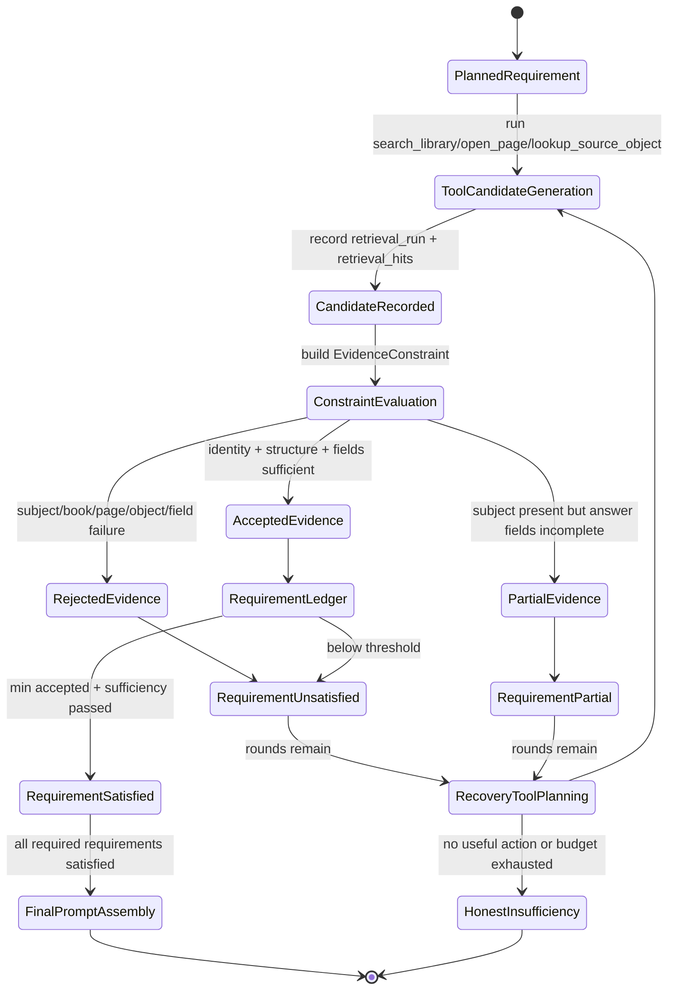
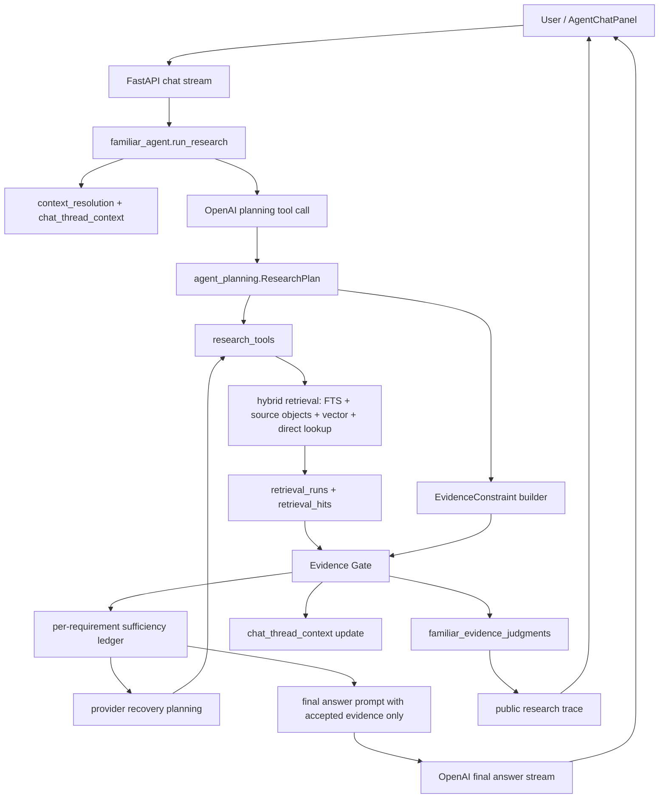

# Familiar Evidence-Gated RAG Implementation Plan

> **For agentic workers:** REQUIRED SUB-SKILL: Use `superpowers:subagent-driven-development` or `superpowers:executing-plans` to implement this plan phase-by-phase. Steps below use concrete file paths, test targets, and rollout checks.

**Goal:** Make Familiar refuse wrong-but-plausible evidence by enforcing backend-owned entity anchoring, structured stat/table verification, requirement sufficiency, and auditable evidence judgments before final answer generation.

**Architecture:** Keep the current hybrid retrieval stack as candidate generation, but move acceptance authority into a deterministic evidence gate owned by `wfrp_companion/assistant/`. The gate evaluates requirement constraints against structured source-object identity, body text, fields, book/page hints, and exclusion rules; only accepted evidence can update thread context or enter the final prompt.

**Tech Stack:** Python, SQLite, FastAPI, React/Vite, local source-object retrieval, SQLite FTS, local Sentence Transformers vectors (`BAAI/bge-m3`, 1024 dimensions), OpenAI Responses API through the existing provider wrapper.

---

### 1. Source Boundary

This plan is based on these current sources:

- Live code in `wfrp_companion/assistant/`, especially `familiar_agent.py`, `evidence_validation.py`, `research_tools.py`, `retrieval.py`, `candidates.py`, `reranking.py`, `agent_planning.py`, `prompts.py`, `chat_store.py`, and `research.py`.
- Live schema and migrations in `wfrp_companion/db/schema.sql` and `wfrp_companion/db/migrations.py`.
- Existing tests in `tests/assistant/test_evidence_validation.py`, `tests/assistant/test_familiar_agent.py`, `tests/assistant/test_retrieval.py`, `tests/assistant/test_research_tools.py`, `tests/assistant/test_chat_store.py`, and `frontend/src/components/chat/AgentChatPanel.test.tsx`.
- Repo guidance in `CLAUDE.md`, `wiki/CONTEXT.md`, `wiki/INDEX.md`, `wiki/topics/ai-rag-system.md`, `wiki/concepts/hybrid-search-for-rules.md`, `wiki/topics/target-architecture.md`, `wiki/topics/implementation-standards.md`, `wiki/topics/testing-posture-and-conventions.md`, and `wiki/concepts/private-copyright-boundary.md`.
- Library-wide structural audit of `data/wfrp_companion.sqlite` on 2026-06-09:
  - 26 books in the active `Rules/Core` source set, all enabled.
  - All 26 books have `copy_status='copied'`, `text_status='imported'`, `search_status='indexed'`, object status `indexed`, and vector status `indexed`.
  - 33,752 total `source_objects`: 23,556 `rule_section`, 8,388 `page_chunk`, 661 `cross_reference`, 455 `table_row`, 311 `stat_block`, 285 `npc_profile`, 62 `table`, 26 `monster_profile`, and 8 `index_entry`.
  - 622 stat/profile-like objects and 517 table/table-row objects across adventure, core, rules, and world-guide categories.
  - All source objects have matching `source_object_search` and `sentence-transformers` embedding rows.
  - `book_retrieval_status.table_index_status='not_started'` for every book.
  - `page_label_status` is `not_started` for 24 books and `needs_review` for 2 books.
  - Persisted `familiar_evidence_judgments.subject_constraint_json` is `{}` for all 163 current judgments, including accepted evidence.
- Current RAG research used as design input:
  - [Google Research: sufficient context in RAG](https://research.google/blog/deeper-insights-into-retrieval-augmented-generation-the-role-of-sufficient-context/)
  - [RAGChecker](https://arxiv.org/html/2408.08067v2)
  - [Retromorphic Testing with Hierarchical Verification for RAG](https://arxiv.org/html/2603.27752v1)
  - [Fast and Faithful: Real-Time Verification for Long-Document RAG Systems](https://arxiv.org/html/2603.23508v1)
  - [Anchoring Entities](https://openreview.net/forum?id=96vyGkAO08)
  - [Faithfulness-QA](https://arxiv.org/html/2604.25313v1)
  - [FaithfulRAG](https://aclanthology.org/2025.acl-long.1062/)
  - [Evidence Tree Search](https://aclanthology.org/2025.acl-long.1175/)
  - [ReClaim](https://aclanthology.org/2025.findings-naacl.55/)
  - [CoRM-RAG](https://arxiv.org/html/2605.01302v1)
  - [SeaKR](https://aclanthology.org/2025.acl-long.1312/)
  - [RetroRAG](https://arxiv.org/html/2501.05475v1)

Intentionally excluded as architectural input:

- Older `docs/plans/` phase plans, except as historical file names and not as source-of-truth architecture.
- Raw WFRP PDF/book text in committed fixtures or plan prose.
- The screenshots as narrow Orc-only requirements. They are treated as examples of a systemic evidence-acceptance failure.

### 2. Current Live-Code Diagnosis

Familiar currently works like this:

1. `familiar_agent.run_research()` resolves the user request with thread/reader context.
2. The provider submits a public `ResearchPlan` through `agent_planning.parse_research_plan()`.
3. `execute_tool()` runs `search_library`, `open_page`, or `lookup_source_object`.
4. `evidence_validation.validate_hits_for_requirement()` marks hits accepted, rejected, or partial.
5. Accepted hits are counted per requirement and become final prompt evidence.
6. `update_thread_context_from_validation()` updates active subject/book/page from the first accepted hit.

The important live-code problems are:

- **Subject anchoring is too weak.** `hit_matches_requirement_subject()` currently accepts if any include term or canonical token matches evidence text. Generic include terms such as `profile`, `statistics`, or OCR table labels can satisfy the subject side of a requirement.
- **Term matching is substring-based.** `text_contains_term()` uses `normalized in text`. This makes short WFRP stat abbreviations such as `S`, `T`, `A`, and `W` dangerous when used as required terms.
- **Structural object type is treated as statline proof.** `hit_has_statline_evidence()` accepts any `stat_block`, `monster_profile`, `npc_profile`, `table`, or `table_row` object without proving the requested entity or required stat fields are present.
- **Provider hints are accepted as prompt contract fields but not enforced as retrieval filters.** `book_title_hints`, `page_hints`, `include_terms`, `exclude_terms`, and `object_type_hints` are parsed and prompted, but `research_tools.search_library()` only passes query, intent, limits, and source scope into retrieval.
- **The final requirement ledger counts accepted hits, not answerable fields.** A statline requirement can become “sufficient” with one structurally plausible hit even if the named entity and fields are not proven.
- **Wrong accepted evidence can poison thread context.** `update_thread_context_from_validation()` trusts the first accepted hit and stores its book/page/source object as active context.
- **Audit data drops the key constraints.** `record_evidence_judgments()` does not pass the requirement subject constraint or constraint status into `chat_store.record_familiar_evidence_judgment()`, even though the table already has `subject_constraint_json` and `constraint_status`.
- **The UI label “Evidence sufficient” reflects backend hit-count sufficiency, not true context sufficiency.** This makes the trace misleading when the final answer refuses or cites unrelated evidence.
- **Library-wide retrieval noise is expected, not exceptional.** The active source set includes all 26 books, with hundreds of profiles/tables across every category. The fix must be general and must not rely on book-specific aliases for one creature, career, or table.

### 3. Architecture Decision

Use a backend-owned **Evidence Gate** between retrieval and final answer construction.

The gate has four responsibilities:

- Normalize each `EvidenceRequirement` into deterministic constraints.
- Evaluate candidates against identity, structure, fields, exclusions, book/page hints, and sufficiency.
- Persist the constraint decision for audit.
- Prevent rejected or partial evidence from updating thread context or final citations.

This is the right fit because the repo already separates candidate generation, reranking, evidence validation, prompt construction, and persisted research traces. The plan strengthens the weakest boundary without replacing the whole system.

Avoid these alternatives:

- **Do not rely on vector search alone.** Current research and the local failure both show that semantic similarity can retrieve plausible but wrong evidence.
- **Do not fix this with prompt wording only.** The model should not be the owner of evidence acceptance.
- **Do not add entity-specific aliases such as “Orc must use Bestiary page 104.”** The wiki explicitly requires general retrieval rules rather than one-off aliases.
- **Do not add a hosted vector database or cross-encoder service in this phase.** The local store is current; the failure is validation/acceptance, not candidate availability.
- **Do not expose raw book text in tests, logs, or plan artifacts.** Synthetic fixtures are enough to lock the behavior.

### 4. Target State Model

Familiar needs a formal evidence lifecycle, not a separate app workflow state machine. The app-owned source of truth remains SQLite rows for plans, tool calls, retrieval runs, retrieval hits, evidence judgments, and thread context.



Thread context may only update from `AcceptedEvidence` whose constraint decision has `constraint_status='passed'`.

### 5. Target Architecture Diagram



### 6. Proposed Data Model / Contracts

No new table is required for the first implementation. Use the existing schema:

- `familiar_research_plans.requirements_json` remains the immutable provider-submitted plan snapshot.
- `retrieval_runs` and `retrieval_hits` remain candidate-generation audit rows.
- `familiar_evidence_judgments` becomes the canonical acceptance decision table:
  - `subject_constraint_json`: populated from the backend-normalized constraint.
  - `constraint_status`: `passed`, `failed`, `partial`, or `not_applicable`.
  - `reason_code`: expanded with deterministic codes listed below.
  - `reasons_json`: bounded human-readable explanations without private source text.
- `chat_thread_context` remains live follow-up context and only changes after accepted evidence.

Create `wfrp_companion/assistant/evidence_constraints.py`:

```python
from __future__ import annotations

import sqlite3
from dataclasses import dataclass
from typing import Literal

from wfrp_companion.assistant.evidence import RetrievedHit

ConstraintStatus = Literal["passed", "failed", "partial", "not_applicable"]

STRUCTURAL_CONSTRAINT_TERMS = frozenset(
    {
        "stat",
        "stats",
        "statline",
        "statlines",
        "statistics",
        "profile",
        "profiles",
        "block",
        "blocks",
        "table",
        "tables",
        "chart",
        "charts",
        "entry",
        "entries",
        "page",
        "pages",
        "rule",
        "rules",
        "source",
        "sources",
    }
)

STAT_FIELD_TERMS = frozenset(
    {
        "m",
        "ws",
        "bs",
        "s",
        "t",
        "ag",
        "int",
        "wp",
        "fel",
        "a",
        "w",
        "sb",
        "tb",
        "mag",
        "ip",
        "fp",
    }
)

SUBJECT_STOP_TERMS = frozenset(
    {
        "give",
        "show",
        "tell",
        "find",
        "me",
        "their",
        "there",
        "the",
        "a",
        "an",
        "for",
        "of",
        "on",
        "about",
    }
)

@dataclass(frozen=True)
class EvidenceConstraint:
    requirement_id: str
    requirement_type: str
    canonical_subject: str | None
    subject_terms: tuple[str, ...]
    subject_aliases: tuple[str, ...]
    excluded_terms: tuple[str, ...]
    required_terms: tuple[str, ...]
    structural_terms: tuple[str, ...]
    object_type_hints: tuple[str, ...]
    book_title_hints: tuple[str, ...]
    page_hints: tuple[str, ...]
    min_accepted_hits: int

@dataclass(frozen=True)
class EvidenceZones:
    identity_text: str
    direct_body_text: str
    structural_text: str
    page_scope_text: str
    linked_identity_text: str = ""
    linked_stat_text: str = ""

@dataclass(frozen=True)
class ConstraintDecision:
    status: ConstraintStatus
    reason_code: str
    reasons: tuple[str, ...]
    matched_subject_terms: tuple[str, ...] = ()
    matched_required_terms: tuple[str, ...] = ()
    matched_stat_fields: tuple[str, ...] = ()
```

Constraint normalization rules:

- `canonical_subject` is the provider plan's canonical subject after trimming. Empty strings become `None`.
- `subject_terms` comes first from non-structural, non-stat-field, non-stopword tokens in `canonical_subject`.
- If `canonical_subject is None`, non-structural `include_terms` may be used as subject terms only for named structural requests. Broad topical/lore requirements with no canonical subject keep `subject_terms=()`.
- If `canonical_subject` exists but produces no subject terms, the constraint is invalid for `statline_evidence`, `page_evidence`, and `source_object_evidence`; matching should fail with `generic_subject_only`.
- `structural_terms` contains structural words removed from `canonical_subject`, `include_terms`, `required_terms`, and `object_type_hints`.
- `required_terms` excludes subject terms, structural terms, stat-field terms, and question filler before ordinary topical matching. Stat-field terms are checked by `statline_fields.py`, not by substring text matching.
- Matching uses normalized token/phrase boundaries. No single-letter stat abbreviation can pass by appearing inside another word.

Evidence-zone hydration contract:

- Do not add linked-object text to `RetrievedHit`. Keep `RetrievedHit` as the retrieval result snapshot.
- Add an evidence-gate hydrator in `evidence_constraints.py` with this signature:
  `build_evidence_zones(connection: sqlite3.Connection | None, hit: RetrievedHit, *, source_book_ids: set[str]) -> EvidenceZones`.

- `validate_hits_for_requirement()` gains optional `config: AppConfig | None = None`. Production callers in `familiar_agent.execute_tool_and_validate()` pass `config`; unit tests may omit it and use only the `RetrievedHit` fields.
- When `config` is provided and `hit.source_object_id` is present, the hydrator opens a short read-only SQLite connection and loads only rows whose `book_id` is in `source_book_ids`.
- Hydration may use:
  - the hit's object title, heading path, snippet, and context text;
  - `source_objects.metadata_json.parent_title`;
  - `source_objects.parent_object_id`;
  - `source_object_links` with `link_type in ('stat_profile', 'table_row')` where both linked objects remain inside checked source scope.
- Hydration must not cross unchecked books, must not write to SQLite, and must not persist or expose private linked text outside normal accepted evidence handling.

Create `wfrp_companion/assistant/statline_fields.py`:

```python
from __future__ import annotations

CORE_STAT_FIELDS = (
    "M", "WS", "BS", "S", "T", "Ag", "Int", "WP", "Fel",
    "A", "W", "SB", "TB", "Mag", "IP", "FP",
)

MIN_CORE_PROFILE_FIELDS = ("WS", "BS", "S", "T", "Ag", "Int", "WP", "Fel")
MIN_SECONDARY_PROFILE_FIELDS = ("A", "W", "SB", "TB")
```

Accepted reason codes:

- `evidence_constraint_passed`
- `statline_fields_sufficient`
- `topical_evidence`
- `page_evidence`
- `source_object_evidence`

Rejected/partial reason codes:

- `unchecked_source`
- `book_hint_mismatch`
- `page_hint_mismatch`
- `excluded_subject`
- `subject_mismatch`
- `generic_subject_only`
- `object_type_mismatch`
- `missing_statline_fields`
- `missing_required_terms`
- `subject_only_page`
- `context_insufficient`

### 7. External Integration Design

**OpenAI Responses API through `wfrp_companion/assistant/provider.py`**

- Source of truth: OpenAI proposes plans and produces final prose; the backend owns evidence acceptance.
- Reads: bounded prompt messages, accepted public plan summaries, accepted evidence packets.
- Writes: assistant message content through existing chat persistence.
- Idempotency: existing model run and message idempotency remains unchanged.
- Retry behavior: existing provider errors transition runs to `failed`; this plan does not add background retries.
- Failure behavior: if the provider is down, no local evidence state should be marked accepted by model assertion.

**Local Sentence Transformers embeddings**

- Source of truth: SQLite `source_object_embeddings` and `book_retrieval_status`.
- Reads: vectors for checked books only.
- Writes: no query-time writes.
- Idempotency/currentness: existing provider/model/dimension/snapshot checks remain authoritative.
- Failure behavior: vector provider failures stay fail-closed to lexical/object retrieval.
- Rollout note: current backend vector enablement is process-local unless the env vars are made durable.

**Local PDFs and extracted text**

- Source of truth: private local SQLite `pages`, `page_text`, `source_objects`, and managed PDFs.
- Reads: retrieval and reader routes only.
- Writes: this plan does not modify PDF ingestion.
- Failure behavior: missing text/object coverage makes evidence insufficient; it must not create confident citations from neighbor text.

### 8. Core Flow Design

**Planning flow**

1. Provider submits `ResearchPlan`.
2. Backend parses the plan exactly as today.
3. Backend builds an `EvidenceConstraint` for each requirement before tool execution.
4. Constraint building removes generic structural terms from subject identity and keeps them as structural intent.
5. Generic-only named structural requirements fail closed with `generic_subject_only` instead of accepting arbitrary profile/table evidence.

**Search-library flow**

1. `execute_tool()` calls `research_tools.search_library()` with the provider query plus the backend requirement constraint.
2. `search_library()` passes optional `object_type_hints`, `book_title_hints`, and `page_hints` into retrieval as filters or diagnostics.
3. Retrieval still collects broad candidates through page FTS, source-object FTS, fallback scan, vector, and direct lookup channels.
4. Reranking may use the hints for ordering, but it does not accept evidence.
5. Hits are recorded before validation, preserving rejected evidence for audit.

**Evidence-gate flow**

1. Build `EvidenceZones` from the hit and, when `config` is available, hydrate linked source-object context through the checked-book SQLite scope:
   - `identity_text`: object title, parent title from metadata, linked parent/child titles, and direct object title.
   - `direct_body_text`: object text/context excluding inherited heading-only lines.
   - `structural_text`: object type and stat/table markers.
   - `page_scope_text`: book title and printed/PDF page labels.
2. Evaluate exclusions first.
3. Evaluate book/page hints when present.
4. Evaluate subject identity using whole-token or phrase matching, not substring matching.
5. Evaluate object-type hints for structured requests.
6. For statline requests, parse fields from direct object/profile text. Object type alone is not sufficient.
7. Return `accepted`, `partial`, or `rejected`.
8. Persist `subject_constraint_json` and `constraint_status`.

**Requirement sufficiency flow**

1. A requirement is satisfied only when it has at least `min_accepted_hits` and every required field group for the requirement is sufficient.
2. Partial hits can be summarized for recovery planning but cannot become final citations.
3. If a final answer would have no accepted evidence, Familiar returns honest insufficiency.

**Thread context update flow**

1. `update_thread_context_from_validation()` ignores partial and rejected judgments.
2. It updates active context only from accepted hits with `constraint_status='passed'`.
3. It stores metadata with accepted hit count, requirement id, and reason code.

**Transaction boundaries**

- Retrieval-run and retrieval-hit persistence remains inside existing short SQLite writes.
- Evidence judgment persistence is one short write after validation.
- No SQLite write transaction is held during model calls or embedding inference.
- Thread context update is a separate short write after judgment persistence.

### 9. UX / Surface Behavior

The frontend should show evidence state in terms a GM can trust.

| Backend state | Chat trace label | Citation buttons | Final answer behavior |
| --- | --- | --- | --- |
| all required requirements passed | `Evidence sufficient` | accepted citations only | answer normally with citations |
| some partial, none accepted | `Evidence partial` | no final citations | explain what is missing |
| rejected candidates only | `Evidence insufficient` | no final citations | ask for more source detail or say not found |
| vector disabled/stale/error | retrieval trace shows vector status | unaffected | lexical/object evidence can still pass |
| page/book hint mismatch | rejected in trace counts | no rejected citation buttons | recovery can try another tool |

Do not expose raw rejected private text. It is acceptable to show safe reason labels such as `subject_mismatch`, `missing_statline_fields`, and `book_hint_mismatch`.

### 10. Implementation Sequence

**Phase 1: Evidence constraint normalization and persistence**

Scope:

- Create `wfrp_companion/assistant/evidence_constraints.py`.
- Modify `wfrp_companion/assistant/evidence_validation.py`.
- Modify `wfrp_companion/assistant/familiar_agent.py`.
- Modify `tests/assistant/test_evidence_validation.py`.
- Modify `tests/assistant/test_familiar_agent.py`.

Changes:

- Convert each `EvidenceRequirement` into an `EvidenceConstraint`.
- Split subject identity terms from the explicit structural/stat/stopword taxonomy in `evidence_constraints.py`.
- Replace substring subject/required-term matching with whole-token/phrase matching.
- Pass `subject_constraint` and `constraint_status` into `record_evidence_judgments()`.
- Fail named structural requirements with `generic_subject_only` when the only subject-like words are structural terms.

Required tests:

- `test_named_statline_rejects_generic_profile_without_subject_anchor`
- `test_subject_constraint_requires_canonical_entity_not_any_include_term`
- `test_generic_only_structural_subject_fails_closed`
- `test_broad_topical_requirement_without_canonical_subject_can_pass_required_terms`
- `test_empty_canonical_subject_does_not_create_fake_subject_constraint`
- `test_required_stat_terms_use_token_boundaries`
- `test_record_validation_persists_requirement_constraint`
- `test_accepted_requirement_constraint_updates_thread_context`

Example synthetic regression:

```python
def test_named_statline_rejects_generic_profile_without_subject_anchor() -> None:
    ambassador = hit(
        title="Career Compendium",
        object_type="npc_profile",
        object_title="Ambassador",
        context_text="Ambassador profile WS 35 BS 35 S 35 T 35 Ag 30 Int 40 WP 40 Fel 50.",
    )
    req = requirement(
        requirement_type="statline_evidence",
        subject=subject_constraint(
            canonical="orc",
            include_terms=("orc", "profile"),
            exclude_terms=(),
        ),
        required_terms=("orc", "WS", "BS", "S", "T", "Ag", "Int", "WP", "Fel"),
        object_type_hints=("stat_block", "monster_profile", "npc_profile"),
    )

    result = evidence_validation.validate_hits_for_requirement(
        (ambassador,),
        requirement=req,
        source_book_ids=("career-compendium",),
    )

    assert result.status == "insufficient"
    assert result.judgments[0].reason_code == "subject_mismatch"
```

Does not change yet:

- Retrieval ranking.
- UI trace rendering.
- Source-object extraction.

**Phase 2: Stat/profile field verifier**

Scope:

- Create `wfrp_companion/assistant/statline_fields.py`.
- Modify `wfrp_companion/assistant/evidence_validation.py`.
- Add tests to `tests/assistant/test_evidence_validation.py`.

Changes:

- Parse WFRP stat/profile labels from direct evidence text.
- Require enough core/secondary profile fields for `statline_evidence`.
- Stop treating `npc_profile`, `monster_profile`, `table`, or `table_row` as sufficient by object type alone.
- Use hydrated `source_object_links.link_type='stat_profile'` context when available, but keep checked-book scope and do not mutate `RetrievedHit`.

Required tests:

- `test_statline_object_type_alone_is_not_sufficient`
- `test_statline_accepts_complete_profile_fields`
- `test_table_row_requires_stat_fields_for_statline_requirement`
- `test_single_letter_stat_abbreviations_do_not_match_body_words`
- `test_stat_profile_link_hydration_stays_inside_checked_scope`

Does not change yet:

- More ambitious OCR table reconstruction.
- A new durable table index.

**Phase 3: Requirement-aware retrieval hints**

Scope:

- Modify `wfrp_companion/assistant/familiar_agent.py`.
- Modify `wfrp_companion/assistant/research_tools.py`.
- Modify `wfrp_companion/assistant/retrieval.py`.
- Modify `wfrp_companion/assistant/candidates.py`.
- Modify `wfrp_companion/assistant/reranking.py`.
- Add tests to `tests/assistant/test_research_tools.py` and `tests/assistant/test_retrieval.py`.

Changes:

- Pass normalized requirement hints into `search_library()`.
- Use book/page hints as filters when they resolve unambiguously inside the checked source set.
- Use object-type hints as candidate filters for structured lookup requests when doing so does not produce an empty pool; otherwise record a diagnostic skip reason.
- Add rank reasons for `constraint_hint:book`, `constraint_hint:page`, and `constraint_hint:object_type`.
- Update `research_tools.SearchLibraryResult`, `research_tools.search_library()`, `retrieval.retrieve_context_for_source_scope()`, and `candidates.collect_evidence_candidates_with_diagnostics()` signatures in the same phase so hint filters are introduced end-to-end instead of as unused arguments.

Required tests:

- `test_search_library_applies_unambiguous_book_hint_within_checked_scope`
- `test_search_library_records_unresolved_book_hint_without_crossing_scope`
- `test_object_type_hint_filters_structural_stat_candidates`
- `test_vector_candidates_still_go_through_requirement_validation`

Does not change yet:

- Provider-backed reranking.
- Hosted retrieval services.

Release guardrail:

- Do not ship only Phase 1 as a complete fix. The object-type acceptance hole remains open until Phase 2, and true requirement sufficiency remains incomplete until Phase 4.

**Phase 4: Sufficiency ledger and recovery behavior**

Scope:

- Modify `wfrp_companion/assistant/familiar_agent.py`.
- Modify `wfrp_companion/assistant/prompts.py`.
- Modify `tests/assistant/test_familiar_agent.py`.
- Modify `tests/assistant/test_prompts.py`.

Changes:

- Track requirement status using accepted hit count plus constraint/field sufficiency.
- Recovery prompts should include safe rejection summaries by reason code.
- `finish_research(reason='requirements_satisfied')` remains invalid unless the backend ledger is satisfied.
- Final prompt receives accepted evidence only and a clear insufficiency summary.

Required tests:

- `test_familiar_does_not_finish_when_only_wrong_entity_profile_was_retrieved`
- `test_recovery_prompt_includes_rejected_reason_counts`
- `test_final_prompt_gets_insufficiency_summary_without_rejected_text`
- `test_requirement_satisfied_requires_constraint_passed`

Does not change yet:

- Assistant answer style beyond existing cited/insufficient policy.

**Phase 5: Public trace and frontend behavior**

Scope:

- Modify `wfrp_companion/assistant/chat_store.py`.
- Modify `frontend/src/components/chat/AgentChatPanel.tsx`.
- Modify `frontend/src/components/chat/AgentChatPanel.test.tsx`.

Changes:

- Include safe validation reason counts in public research trace metadata.
- Render insufficiency/partial/sufficiency clearly without implying that rejected hits are valid citations.
- Preserve citation buttons for accepted hits only.

Required tests:

- `test_research_trace_shows_validation_reason_counts`
- `test_rejected_evidence_does_not_render_citation_button`
- `test_evidence_partial_label_does_not_say_sufficient`

Does not change yet:

- Full evidence-debug inspector.
- Raw excerpt display for rejected evidence.

**Phase 6: Library-wide regression harness**

Scope:

- Create `tests/assistant/test_familiar_evidence_gate_regressions.py`.

Changes:

- Add synthetic tests that represent the whole-library failure modes found in the audit:
  - generic career/profile evidence vs named creature statline
  - race profile vs named NPC
  - table mention vs actual table
  - heading-only entity match
  - vector-only semantically similar wrong entity
  - page hint mismatch

Required command:

```bash
PYTHONPATH=. /opt/miniconda3/envs/wfrp-companion/bin/python -m pytest \
  tests/assistant/test_evidence_validation.py \
  tests/assistant/test_familiar_agent.py \
  tests/assistant/test_research_tools.py \
  tests/assistant/test_retrieval.py \
  tests/assistant/test_familiar_evidence_gate_regressions.py
```

Does not change:

- No committed WFRP text fixtures.
- No new audit CLI in this phase; use the persisted judgment rows and existing tests as the regression surface.

### 11. Testing Requirements

Minimum backend test categories:

- Constraint normalization tests.
- Whole-token/phrase matching tests.
- Stat/profile field parser tests.
- Evidence validation tests for accepted, rejected, and partial paths.
- Persistence tests for `subject_constraint_json` and `constraint_status`.
- Retrieval hint/filter tests.
- Research-agent loop tests for recovery and final answer insufficiency.
- Regression tests for the specific Ambassador-vs-Orc class of failure using synthetic text.
- Vector fallback tests proving vector hits do not bypass validation.

Minimum frontend tests:

- Chat trace rendering for sufficient, partial, and insufficient validation.
- Citation button rendering for accepted hits only.
- Safe reason-code display without raw private evidence text.

Verification commands:

```bash
PYTHONPATH=. /opt/miniconda3/envs/wfrp-companion/bin/python -m pytest \
  tests/assistant/test_evidence_validation.py \
  tests/assistant/test_familiar_agent.py \
  tests/assistant/test_prompts.py \
  tests/assistant/test_research_tools.py \
  tests/assistant/test_retrieval.py \
  tests/assistant/test_chat_store.py \
  tests/assistant/test_familiar_evidence_gate_regressions.py
```

```bash
cd frontend
npm run test -- AgentChatPanel.test.tsx
```

Before merge, run the repo’s broader Python coverage command from `wiki/topics/testing-posture-and-conventions.md` or document why the focused suite is the right scope for the PR.

### 12. Verification Matrix

| Scenario | Expected result |
| --- | --- |
| User asks `orc`, then `give me stats`; retrieval finds Ambassador profile first | Ambassador rejected as `subject_mismatch`; no thread-context update to Career Compendium |
| User asks for `Orc statline`; Bestiary/Common Orc evidence is retrieved | accepted only if entity anchor and stat fields pass |
| User asks for `Ogre stats`; Rat Ogre evidence is retrieved | rejected as `excluded_subject` or `subject_mismatch` depending on requirement |
| User asks for `hit location chart` | actual `table`/`table_row` evidence outranks prose mentions |
| User asks broad lore/recommendation with no canonical subject | topical evidence can pass required terms without fake subject enforcement |
| User provides a book/page hint | unambiguous checked-book/page evidence is preferred; unresolved hints do not cross source scope |
| Vector channel returns a semantically close wrong object | candidate may be retrieved but is rejected by the evidence gate |
| Page labels are uncalibrated | citations retain PDF jump target and avoid false printed-page confidence |
| No accepted evidence after max rounds | final answer is honest insufficiency; UI trace says insufficient |
| Accepted evidence exists | final prompt includes only accepted evidence and citation buttons open the correct PDF page |

### 13. Migration / Compatibility / Cleanup Strategy

No schema migration is required for the first implementation because `familiar_evidence_judgments` already has `subject_constraint_json` and `constraint_status`.

Compatibility behavior:

- Existing judgment rows with `{}` subject constraints remain legacy audit rows.
- New rows must always populate `subject_constraint_json`.
- New rows must always set `constraint_status`.
- Existing research plans remain readable because requirement JSON shape does not change.

Cleanup after rollout:

- Remove compatibility helpers only if no call sites use `validate_hits()` without a requirement.
- Consider a later migration that adds a constrained enum check for `constraint_status` after values stabilize.
- Consider a later source-object extraction phase for richer table reconstruction, but do not couple it to this fix.

### 14. Operational Rollout Notes

Rollout order:

1. Land backend constraint and stat-field tests.
2. Land evidence gate code.
3. Land retrieval hint/filter changes.
4. Land public trace/frontend changes.
5. Run focused backend and frontend test suites.
6. Smoke test with the running local API and active `Rules/Core` source set.

Vector environment:

- Current local vector retrieval is enabled only when the API process has:

```bash
WFRP_EMBEDDING_PROVIDER=sentence-transformers
WFRP_EMBEDDING_MODEL=BAAI/bge-m3
WFRP_EMBEDDING_DIMENSIONS=1024
```

- This plan does not require rebuilding embeddings because all 26 current books already have matching embedding rows.
- If source objects are rebuilt, run the existing retrieval asset rebuild flow before judging vector behavior.

Failure/recovery:

- If a provider call fails, existing failed-run behavior remains.
- If vector retrieval fails, lexical/object retrieval continues and diagnostics record the vector status.
- If evidence validation rejects all hits, the run should remain `insufficient` rather than `completed`.

### 15. ADR / Platform Alignment

This plan aligns with the local-first architecture:

- SQLite remains the app-owned source of truth.
- PDFs and extracted text remain private and local.
- Hybrid retrieval remains candidate generation.
- Backend evidence validation remains authoritative.
- The frontend displays safe trace metadata rather than making evidence decisions.

It also aligns with the wiki’s AI-specific rule: for named stat/profile/table requests, validate the named entity against the selected source object itself and do not let neighboring snippets or heading-only matches prove the entity.

The transitional compromise is that validation remains deterministic and local rather than adding a provider-backed verifier. That is intentional: the current failure is mechanical enough to fix without another model in the loop.

### 16. Non-Goals / Guardrails / Open Questions

Non-goals:

- Do not rebuild OCR/layout extraction in this plan.
- Do not create public exports of source-object text.
- Do not add hosted vector storage.
- Do not add a provider-backed cross-encoder reranker.
- Do not add entity-specific hardcoded fixes for Orcs, Ambassadors, Ogres, or any one book.
- Do not surface raw rejected evidence text in the public trace.

Guardrails:

- All tests use synthetic WFRP-shaped snippets, not copied book passages.
- Rejected evidence can be counted and categorized, but not cited.
- Active thread context updates only from accepted evidence.
- Book/page hints narrow retrieval only inside checked source scope.
- Vector search remains a candidate channel and never bypasses the evidence gate.

Open questions:

- Should the dev launcher make `sentence-transformers` the default local vector provider when embeddings are current, or should vector stay opt-in through env vars?
- Should the UI show a compact rejected-reason summary by default, or only inside the expandable research trace?
- Should a later migration constrain `constraint_status` values at the database level after this phase proves the enum set?
