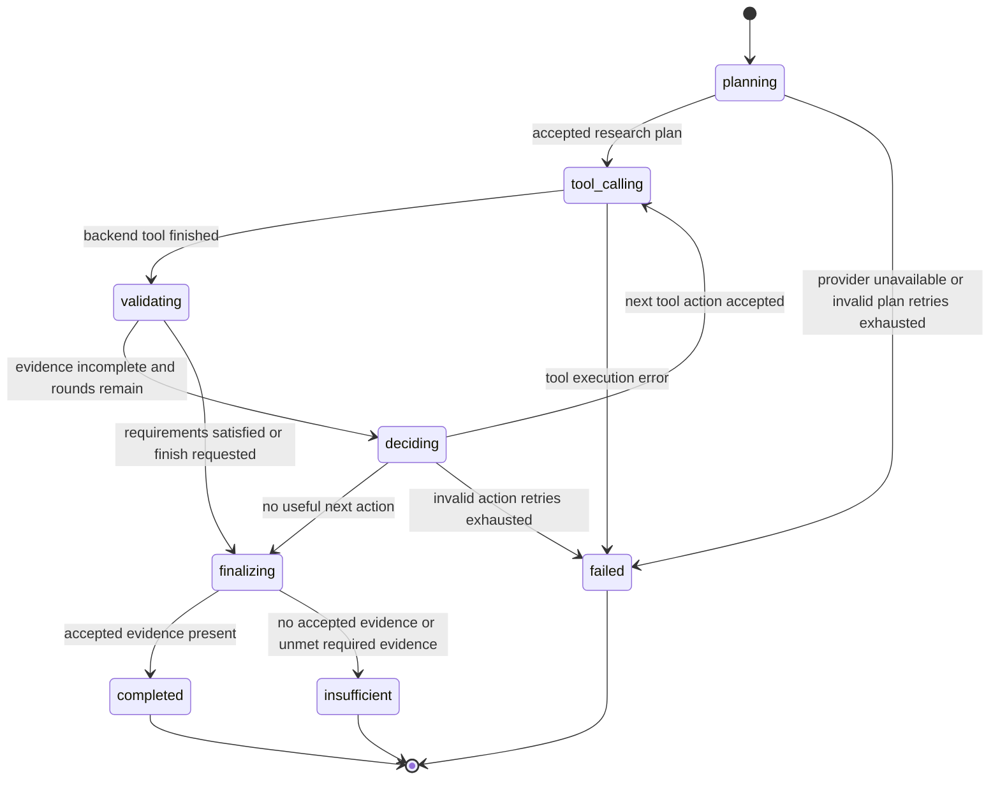
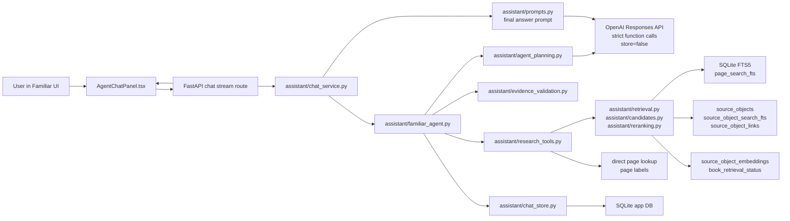

# Familiar Reasoning-Led Research Agent Implementation Plan

> **For agentic workers:** REQUIRED SUB-SKILL: Use `superpowers:subagent-driven-development` (recommended) or `superpowers:executing-plans` to implement this plan task-by-task. Steps use checkbox (`- [ ]`) syntax for tracking.

**Goal:** Replace Familiar's backend-first one-shot retrieval shape with an app-owned, bounded, reasoning-led research agent that plans first, uses hybrid retrieval tools intentionally, validates evidence against explicit requirements, and answers only from accepted cited evidence.

**Architecture:** Keep the local backend as the source of truth for source scope, retrieval, vector currentness, tool execution, validation, citations, and private storage. Add a persisted research-plan layer so the model can choose the research strategy before any search runs, while the app enforces strict tool schemas, round limits, checked-book scope, requirement-aware validation, and citation discipline.

**Tech Stack:** Python 3.12, FastAPI, SQLite, OpenAI Responses API function calling with `store=false`, React/Vite, SQLite FTS5, local source-object embeddings through `sentence-transformers` or deterministic `local-hash`, pytest with 100% backend coverage, Vitest/Playwright frontend tests.

---

### 1. Source Boundary

This plan is based on these sources:

- Repo instructions: `/Users/aftoncarlson/workspace/WFRP-Companion/CLAUDE.md` and the supplied `AGENTS.md` instructions.
- Plan prompt: `/Users/aftoncarlson/workspace/WFRP-Companion/docs/plans/Implementation Plan Script.md`.
- Wiki sources:
  - `/Users/aftoncarlson/workspace/WFRP-Companion/wiki/topics/ai-rag-system.md`
  - `/Users/aftoncarlson/workspace/WFRP-Companion/wiki/concepts/hybrid-search-for-rules.md`
  - `/Users/aftoncarlson/workspace/WFRP-Companion/wiki/topics/implementation-standards.md`
  - `/Users/aftoncarlson/workspace/WFRP-Companion/wiki/topics/testing-posture-and-conventions.md`
  - `/Users/aftoncarlson/workspace/WFRP-Companion/wiki/topics/target-architecture.md`
  - `/Users/aftoncarlson/workspace/WFRP-Companion/wiki/concepts/private-copyright-boundary.md`
  - `/Users/aftoncarlson/workspace/WFRP-Companion/wiki/topics/local-tooling-and-packaging.md`
- Live code:
  - `/Users/aftoncarlson/workspace/WFRP-Companion/wfrp_companion/assistant/familiar_agent.py`
  - `/Users/aftoncarlson/workspace/WFRP-Companion/wfrp_companion/assistant/context_resolution.py`
  - `/Users/aftoncarlson/workspace/WFRP-Companion/wfrp_companion/assistant/evidence_validation.py`
  - `/Users/aftoncarlson/workspace/WFRP-Companion/wfrp_companion/assistant/prompts.py`
  - `/Users/aftoncarlson/workspace/WFRP-Companion/wfrp_companion/assistant/research.py`
  - `/Users/aftoncarlson/workspace/WFRP-Companion/wfrp_companion/assistant/research_tools.py`
  - `/Users/aftoncarlson/workspace/WFRP-Companion/wfrp_companion/assistant/provider.py`
  - `/Users/aftoncarlson/workspace/WFRP-Companion/wfrp_companion/assistant/chat_service.py`
  - `/Users/aftoncarlson/workspace/WFRP-Companion/wfrp_companion/assistant/chat_store.py`
  - `/Users/aftoncarlson/workspace/WFRP-Companion/wfrp_companion/assistant/candidates.py`
  - `/Users/aftoncarlson/workspace/WFRP-Companion/wfrp_companion/db/schema.sql`
  - `/Users/aftoncarlson/workspace/WFRP-Companion/wfrp_companion/db/migrations.py`
  - `/Users/aftoncarlson/workspace/WFRP-Companion/wfrp_companion/db/migration_files/0007_familiar_agent_research.sql`
  - `/Users/aftoncarlson/workspace/WFRP-Companion/frontend/src/components/chat/AgentChatPanel.tsx`
  - `/Users/aftoncarlson/workspace/WFRP-Companion/frontend/src/types/api.ts`
- Current test surfaces:
  - `/Users/aftoncarlson/workspace/WFRP-Companion/tests/assistant/test_familiar_agent.py`
  - `/Users/aftoncarlson/workspace/WFRP-Companion/tests/assistant/test_context_resolution.py`
  - `/Users/aftoncarlson/workspace/WFRP-Companion/tests/assistant/test_evidence_validation.py`
  - `/Users/aftoncarlson/workspace/WFRP-Companion/tests/assistant/test_prompts.py`
  - `/Users/aftoncarlson/workspace/WFRP-Companion/tests/assistant/test_provider.py`
  - `/Users/aftoncarlson/workspace/WFRP-Companion/tests/assistant/test_research_tools.py`
  - `/Users/aftoncarlson/workspace/WFRP-Companion/tests/assistant/test_chat_store.py`
  - `/Users/aftoncarlson/workspace/WFRP-Companion/tests/db/test_schema.py`
  - `/Users/aftoncarlson/workspace/WFRP-Companion/tests/db/test_migrations.py`
  - `/Users/aftoncarlson/workspace/WFRP-Companion/frontend/src/components/chat/AgentChatPanel.test.tsx`
  - `/Users/aftoncarlson/workspace/WFRP-Companion/frontend/e2e/workspace.spec.ts`
- Current local DB state, inspected only with count-only SQL against `/Users/aftoncarlson/workspace/WFRP-Companion/data/wfrp_companion.sqlite`:
  - 26 books in `books`.
  - 13 enabled source-set memberships.
  - 26 rows with `book_retrieval_status.vector_status='indexed'`.
  - 33,752 `source_objects`.
  - 33,752 `source_object_embeddings`.
  - Recent Familiar runs include the failure class where a follow-up for regular Ogres can accept or chase Rat Ogre evidence because the plan and evidence requirements are not explicit.
- External research and integration docs:
  - OpenAI function calling and Structured Outputs docs, especially strict schema arguments for tools and Responses API function calling: [OpenAI function calling guide](https://platform.openai.com/docs/guides/function-calling?api-mode=responses) and [OpenAI help center function calling article](https://help.openai.com/en/articles/8555517-function-calling-in-the-openai-api).
  - ReAct, for interleaving reasoning and actions through tools: [ReAct: Synergizing Reasoning and Acting in Language Models](https://arxiv.org/abs/2210.03629).
  - Self-RAG, for retrieval plus critique of evidence usefulness: [Self-RAG](https://arxiv.org/abs/2310.11511).
  - Corrective RAG, for bounded correction when retrieved evidence is weak or wrong: [Corrective Retrieval Augmented Generation](https://arxiv.org/abs/2401.15884).
  - Reciprocal Rank Fusion, already used by this repo and appropriate for combining lexical/object/vector channels: [Reciprocal rank fusion outperforms condorcet and individual rank learning methods](https://dl.acm.org/doi/10.1145/1571941.1572114).

Intentionally excluded as architectural input:

- Earlier implementation plans in `/Users/aftoncarlson/workspace/WFRP-Companion/docs/plans/` other than `Implementation Plan Script.md`. They can be useful history, but this plan follows the prompt instruction not to base architecture on stale plans.
- Raw WFRP PDFs, copied page text, private OCR extracts, or vector rows as written content. This plan references only counts, table names, public code, and safe metadata.
- Model memory about WFRP rules. The feature must continue to answer factual WFRP claims only from accepted retrieved evidence.
- Hosted vector databases, public file search, and provider-hosted retrieval storage. The current product boundary is local-first and private.

### 2. Current Live-Code Diagnosis

The current system has strong retrieval foundations, but the agent orchestration is backwards for the product Familiar needs to be.

Concrete live-code problems:

- `wfrp_companion/assistant/familiar_agent.py::run_research()` resolves the request, creates a research run, then immediately calls `initial_tool_name()` and `initial_tool_arguments()` before the provider has planned. The model only participates in recovery through `request_recovery_tool()` after the first backend-selected tool fails to produce accepted evidence.
- `wfrp_companion/assistant/context_resolution.py` owns subject and intent resolution before the model sees the research problem. It handles simple follow-ups like "same for gors" and "give me their stats", but it has no first-class correction model for utterances like "no ogres, not rat ogres". In the live DB, that correction was persisted as `subject="no ogres not rat ogres"` and `resolved_query="no ogres not rat ogres statline"`.
- `wfrp_companion/assistant/evidence_validation.py::hit_mentions_subject()` uses token containment over object title, page title, snippet, and context. That lets broader or modifier-bearing evidence pass when the requested entity is underspecified. For example, a regular Ogre requirement can be satisfied by Rat Ogre material because `ogre` appears inside `Rat Ogre`.
- `familiar_research_runs` records `raw_query`, `resolved_query`, `intent`, status, and evidence status, but there is no persisted `ResearchPlan` or `EvidenceRequirement`. The app cannot later answer "what was this tool call trying to prove?" except by inferring from query strings and loose metadata.
- `familiar_tool_calls` has `arguments_json`, but no `research_plan_id`, `requirement_id`, or `purpose`. Tool calls are therefore not linked to explicit evidence goals.
- `familiar_evidence_judgments` records `requirement_type`, but not a specific requirement ID, subject constraint, include terms, or exclude terms. Accepted/rejected evidence cannot be audited against the user's actual correction or disambiguation.
- `wfrp_companion/assistant/familiar_agent.py::tool_definitions()` exposes `search_library`, `open_page`, and `lookup_source_object`, but the schemas do not carry `requirement_id`, include/exclude constraints, object-type hints, or enough structured purpose to guide requirement-aware validation.
- `wfrp_companion/assistant/prompts.py::SYSTEM_INSTRUCTIONS` correctly says Familiar is a bounded local research agent and must use accepted evidence, but the implementation does not let the model plan first. The system prompt overstates the agent contract relative to the live control flow.
- `frontend/src/components/chat/AgentChatPanel.tsx` surfaces "Researching", "Running hybrid search", vector status, and evidence status. It does not surface a safe research plan or requirement-specific rejection reasons, so users see search activity rather than the agent's bounded research strategy.
- The hybrid retrieval layer is useful and should not be replaced. `wfrp_companion/assistant/candidates.py` already gathers page FTS, source-object FTS/scan, vector candidates, RRF fusion, and deterministic reranking. The issue is not that vector search is absent; the issue is that the agent loop does not reason with explicit requirements before deciding which tool to run and how to validate results.

Ownership problems:

- Current owner of the first research action: backend heuristics in `familiar_agent.py`.
- Desired owner of the research strategy: app-owned persisted `ResearchPlan` proposed by the provider and validated by backend policy before execution.
- Current owner of evidence acceptance: backend validation against loose subject and intent.
- Desired owner of evidence acceptance: backend validation against explicit persisted `EvidenceRequirement` constraints.
- Current owner of source scope: backend SQLite source-set snapshot. This is correct and must stay backend-owned.
- Current owner of vector execution: backend hybrid retrieval. This is correct and must stay backend-owned.

### 3. Architecture Decision

Implement Familiar as a bounded, reasoning-led, tool-calling research agent with an explicit persisted research plan.

The target flow is:

1. Interpret the user request and recent thread context.
2. Ask the provider for a structured research plan before any retrieval tool runs.
3. Validate and persist that plan in SQLite.
4. Execute provider-selected tools in a bounded loop.
5. Run backend hybrid retrieval inside the tools.
6. Validate evidence against explicit requirements and subject constraints.
7. Let the provider choose the next action from safe summaries of prior tool results and judgments.
8. Finalize only from accepted evidence or return an honest insufficiency answer.

This fits the codebase because:

- The app already has explicit SQLite research runs, tool calls, retrieval runs, and evidence judgments.
- The app already has local source-set snapshots and hybrid retrieval. We can add planning without replacing source scope, retrieval, or citation contracts.
- OpenAI function calling with strict JSON schemas is already represented by `ProviderToolDefinition(strict=True)`.
- The product is local-first and private. A simple relational state machine is better than introducing a heavy orchestration framework or hosted retrieval service.
- Current research on robust RAG supports interleaving actions with reasoning, evaluating whether retrieved evidence is useful, and correcting weak retrieval. The app can implement those patterns without exposing private book text or chain-of-thought.

Avoid these alternatives:

- Do not add creature-specific aliases or hardcoded patches for Ogres, Harpies, Gors, or any other single entity. Fix the general requirement and validation model.
- Do not make vector search the sole retrieval mechanism. Rules-heavy RPG books need exact search, source-object lookup, page lookup, and vector candidates together.
- Do not let the provider call arbitrary SQL, read raw PDFs, or inspect filesystem paths.
- Do not adopt LangChain, a hosted vector database, OpenAI hosted file search, or an Agents SDK runtime in this phase. The existing local tool boundary is already sufficient, and hosted storage conflicts with the private project boundary unless explicitly chosen later.
- Do not display chain-of-thought. Surface a safe plan summary, evidence goals, tool names, retrieval channel diagnostics, and validation reasons.

### 4. Target State Model

Familiar needs a formal app-owned lifecycle. `familiar_research_runs.status` should add a `deciding` state so the DB can distinguish first-plan construction from later next-action selection.



State ownership:

- `familiar_research_runs` owns the research-run lifecycle.
- New `familiar_research_plans` owns the plan snapshot for each run.
- `familiar_tool_calls` owns each attempted app tool action.
- `retrieval_runs` and `retrieval_hits` own search/read evidence snapshots.
- `familiar_evidence_judgments` owns validation decisions.
- `model_runs` remains the outer chat model lifecycle and points to the final accepted retrieval run when one exists.
- `chat_thread_context` remains a compact reference-resolution cache, not a source of factual evidence.

### 5. Target Architecture Diagram



Backend responsibilities:

- Persist plan, tool, retrieval, judgment, and answer state.
- Enforce checked-book source scope.
- Enforce max tool rounds.
- Validate provider tool names and arguments.
- Run hybrid retrieval by default inside `search_library`.
- Validate evidence before prompt construction.
- Keep private text in local SQLite only.

Provider responsibilities:

- Produce structured research plans and next tool decisions.
- Use safe summaries of prior tool outputs and evidence judgments.
- Produce final user-facing prose only from accepted evidence.

Provider non-responsibilities:

- It does not decide source scope.
- It does not decide whether vector rows are current.
- It does not get unchecked source text.
- It does not persist memory through provider response IDs.

### 6. Proposed Data Model / Contracts

#### New Python module

Create `/Users/aftoncarlson/workspace/WFRP-Companion/wfrp_companion/assistant/agent_planning.py`.

Core contracts:

```python
from __future__ import annotations

from dataclasses import dataclass
from typing import Literal

JsonObject = dict[str, object]

ResearchIntent = Literal[
    "rules_lookup",
    "statline_lookup",
    "source_navigation",
    "lore_lookup",
    "scene_prep",
]

RequirementType = Literal[
    "topical_evidence",
    "statline_evidence",
    "page_evidence",
    "source_object_evidence",
]

@dataclass(frozen=True)
class SubjectConstraint:
    canonical: str | None
    surface: str | None
    include_terms: tuple[str, ...] = ()
    exclude_terms: tuple[str, ...] = ()
    book_title_hints: tuple[str, ...] = ()
    page_hints: tuple[str, ...] = ()
    notes: str | None = None

@dataclass(frozen=True)
class EvidenceRequirement:
    id: str
    requirement_type: RequirementType
    subject: SubjectConstraint
    required_terms: tuple[str, ...] = ()
    excluded_terms: tuple[str, ...] = ()
    object_type_hints: tuple[str, ...] = ()
    min_accepted_hits: int = 1
    required: bool = True

@dataclass(frozen=True)
class PlannedAction:
    tool_name: Literal["search_library", "open_page", "lookup_source_object", "finish_research"]
    requirement_id: str | None
    purpose: str
    arguments: JsonObject

@dataclass(frozen=True)
class ResearchPlan:
    id: str
    research_run_id: str
    revision: int
    intent: ResearchIntent
    plan_summary: str
    subject: SubjectConstraint
    requirements: tuple[EvidenceRequirement, ...]
    planned_actions: tuple[PlannedAction, ...] = ()
    provider_call_id: str | None = None
    status: Literal["proposed", "accepted", "rejected", "superseded"] = "accepted"
    validation_errors: tuple[str, ...] = ()
```

The model may propose the plan, but the backend validates:

- Requirement IDs are stable slugs matching `^[a-z][a-z0-9_]{2,63}$`.
- Tool names are from the allowlist.
- Each action with a requirement points to an existing requirement ID.
- Include/exclude terms are bounded strings, max 12 terms each.
- No argument can contain raw book text longer than 240 characters.
- `min_accepted_hits` is between 1 and 6.
- `plan_summary` is a safe user-visible summary, max 500 characters, no private text dumps.

#### Schema changes

Add migration `0008_familiar_research_plans`.

Create `/Users/aftoncarlson/workspace/WFRP-Companion/wfrp_companion/db/migration_files/0008_familiar_research_plans.sql`:

```sql
create table if not exists familiar_research_plans (
  id text primary key,
  research_run_id text not null references familiar_research_runs(id) on delete cascade,
  revision integer not null,
  status text not null,
  intent text not null,
  plan_summary text not null,
  subject_json text not null default '{}',
  requirements_json text not null default '[]',
  planned_actions_json text not null default '[]',
  provider_call_id text,
  validation_errors_json text not null default '[]',
  created_at text not null,
  updated_at text not null,
  check(revision >= 1),
  check(status in ('proposed', 'accepted', 'rejected', 'superseded')),
  check(length(intent) > 0),
  check(length(plan_summary) > 0)
);

create unique index if not exists ux_familiar_research_plans_run_revision
on familiar_research_plans(research_run_id, revision);

create unique index if not exists ux_familiar_research_plans_one_accepted
on familiar_research_plans(research_run_id)
where status = 'accepted';

create index if not exists ix_familiar_research_plans_run_status
on familiar_research_plans(research_run_id, status);
```

Rebuild constrained tables that need new enum values or columns:

- `familiar_research_runs.status` check must include `deciding`.
- `familiar_tool_calls` should add:
  - `research_plan_id text references familiar_research_plans(id) on delete set null`
  - `requirement_id text`
  - `purpose text`
- `familiar_evidence_judgments` should add:
  - `research_plan_id text references familiar_research_plans(id) on delete set null`
  - `requirement_id text`
  - `subject_constraint_json text not null default '{}'`
  - `constraint_status text`

SQLite constrained-table rebuilds must preserve existing rows, foreign keys, indexes, partial unique indexes, default values, and check constraints. Implement them with the existing migration helper style in `wfrp_companion/db/migrations.py`, and add migration tests that inspect schema, constraints, indexes, and preserved historical rows after migration.

Indexes:

```sql
create index if not exists ix_familiar_tool_calls_plan_requirement
on familiar_tool_calls(research_plan_id, requirement_id, step_number);

create index if not exists ix_familiar_evidence_judgments_requirement
on familiar_evidence_judgments(research_plan_id, requirement_id, status);
```

Fresh schema updates:

- Update `/Users/aftoncarlson/workspace/WFRP-Companion/wfrp_companion/db/schema.sql` with the new table, columns, indexes, and `deciding` enum value.
- Update `/Users/aftoncarlson/workspace/WFRP-Companion/wfrp_companion/db/migrations.py`:
  - Add `FAMILIAR_RESEARCH_PLANS_MIGRATION_ID = "0008_familiar_research_plans"`.
  - Append it to `MIGRATION_IDS`.
  - Dispatch it from `apply_migration()`.
  - Use rebuild helpers for constrained SQLite tables, following existing patterns in the file.

#### Provider tool contracts

OpenAI strict-tool compatibility is a hard requirement for this phase. Every object in every tool schema must define `additionalProperties: false`, and every property for that object must be listed in `required`. Optional values must be represented as nullable required fields. Do not use unconstrained nested `{ "type": "object" }` fields in strict tools.

Planning and next-action calls must force exactly one expected tool and disable parallel tool calls:

```python
response_provider.stream_response(
    messages=provider_messages,
    request_id=request_id,
    tools=(planning_tool_definition(),),
    tool_choice={"type": "function", "name": "set_research_plan"},
    parallel_tool_calls=False,
)
```

Update `/Users/aftoncarlson/workspace/WFRP-Companion/wfrp_companion/assistant/provider.py` so `OpenAIProvider.stream_response()` accepts `parallel_tool_calls: bool | None = None` and passes it through to `client.responses.create()` when not `None`. If the stream still returns more than one tool call for a planning or next-action step, reject the provider result deterministically with an `invalid_tool_call_count` error and do not execute local tools.

Planning tool:

```json
{
  "name": "set_research_plan",
  "description": "Create the bounded research plan before any local retrieval tool runs.",
  "parameters": {
    "type": "object",
    "properties": {
      "intent": {"type": "string"},
      "plan_summary": {"type": "string", "maxLength": 500},
      "subject": {
        "type": "object",
        "properties": {
          "canonical": {"type": ["string", "null"]},
          "surface": {"type": ["string", "null"]},
          "include_terms": {"type": "array", "items": {"type": "string"}, "maxItems": 12},
          "exclude_terms": {"type": "array", "items": {"type": "string"}, "maxItems": 12},
          "book_title_hints": {"type": "array", "items": {"type": "string"}, "maxItems": 6},
          "page_hints": {"type": "array", "items": {"type": "string"}, "maxItems": 6},
          "notes": {"type": ["string", "null"], "maxLength": 240}
        },
        "required": ["canonical", "surface", "include_terms", "exclude_terms", "book_title_hints", "page_hints", "notes"],
        "additionalProperties": false
      },
      "requirements": {
        "type": "array",
        "minItems": 1,
        "maxItems": 6,
        "items": {
          "type": "object",
          "properties": {
            "id": {"type": "string"},
            "requirement_type": {"type": "string"},
            "subject": {
              "type": "object",
              "properties": {
                "canonical": {"type": ["string", "null"]},
                "surface": {"type": ["string", "null"]},
                "include_terms": {"type": "array", "items": {"type": "string"}, "maxItems": 12},
                "exclude_terms": {"type": "array", "items": {"type": "string"}, "maxItems": 12},
                "book_title_hints": {"type": "array", "items": {"type": "string"}, "maxItems": 6},
                "page_hints": {"type": "array", "items": {"type": "string"}, "maxItems": 6},
                "notes": {"type": ["string", "null"], "maxLength": 240}
              },
              "required": ["canonical", "surface", "include_terms", "exclude_terms", "book_title_hints", "page_hints", "notes"],
              "additionalProperties": false
            },
            "required_terms": {"type": "array", "items": {"type": "string"}, "maxItems": 12},
            "excluded_terms": {"type": "array", "items": {"type": "string"}, "maxItems": 12},
            "object_type_hints": {"type": "array", "items": {"type": "string"}, "maxItems": 8},
            "min_accepted_hits": {"type": "integer", "minimum": 1, "maximum": 6},
            "required": {"type": "boolean"}
          },
          "required": ["id", "requirement_type", "subject", "required_terms", "excluded_terms", "object_type_hints", "min_accepted_hits", "required"],
          "additionalProperties": false
        }
      },
      "planned_actions": {
        "type": "array",
        "maxItems": 4,
        "items": {
          "type": "object",
          "properties": {
            "tool_name": {"type": "string"},
            "requirement_id": {"type": ["string", "null"]},
            "purpose": {"type": "string", "maxLength": 240},
            "arguments": {
              "type": "object",
              "properties": {
                "query": {"type": ["string", "null"], "maxLength": 240},
                "intent": {"type": ["string", "null"]},
                "subject": {"type": ["string", "null"], "maxLength": 120},
                "limit": {"type": ["integer", "null"], "minimum": 1, "maximum": 12},
                "book_id": {"type": ["string", "null"], "maxLength": 160},
                "book_title_hint": {"type": ["string", "null"], "maxLength": 160},
                "printed_page_label": {"type": ["string", "null"], "maxLength": 24},
                "pdf_page_number": {"type": ["integer", "null"], "minimum": 1},
                "subject_hint": {"type": ["string", "null"], "maxLength": 120},
                "source_object_id": {"type": ["string", "null"], "maxLength": 240},
                "status": {"type": ["string", "null"]},
                "reason": {"type": ["string", "null"], "maxLength": 240},
                "satisfied_requirement_ids": {"type": "array", "items": {"type": "string"}, "maxItems": 6},
                "unmet_requirement_ids": {"type": "array", "items": {"type": "string"}, "maxItems": 6},
                "include_terms": {"type": "array", "items": {"type": "string"}, "maxItems": 12},
                "exclude_terms": {"type": "array", "items": {"type": "string"}, "maxItems": 12},
                "object_type_hints": {"type": "array", "items": {"type": "string"}, "maxItems": 8},
                "book_title_hints": {"type": "array", "items": {"type": "string"}, "maxItems": 6},
                "page_hints": {"type": "array", "items": {"type": "string"}, "maxItems": 6}
              },
              "required": [
                "query",
                "intent",
                "subject",
                "limit",
                "book_id",
                "book_title_hint",
                "printed_page_label",
                "pdf_page_number",
                "subject_hint",
                "source_object_id",
                "status",
                "reason",
                "satisfied_requirement_ids",
                "unmet_requirement_ids",
                "include_terms",
                "exclude_terms",
                "object_type_hints",
                "book_title_hints",
                "page_hints"
              ],
              "additionalProperties": false
            }
          },
          "required": ["tool_name", "requirement_id", "purpose", "arguments"],
          "additionalProperties": false
        }
      }
    },
    "required": ["intent", "plan_summary", "subject", "requirements", "planned_actions"],
    "additionalProperties": false
  }
}
```

Execution tools should be expanded. Their JSON schemas must follow the same strict rule: all object properties listed as required, unused optional values represented as nullable fields, and `additionalProperties: false` on every object.

- `search_library`:
  - Existing: `query`, `intent`, `subject`, `limit`.
  - Add: `requirement_id`, `purpose`, `include_terms`, `exclude_terms`, `object_type_hints`, `book_title_hints`, `page_hints`.
- `open_page`:
  - Existing: `book_id`, `book_title_hint`, `printed_page_label`, `pdf_page_number`, `subject_hint`, `intent`.
  - Add: `requirement_id`, `purpose`, `include_terms`, `exclude_terms`.
- `lookup_source_object`:
  - Existing: `source_object_id`, `intent`.
  - Add: `requirement_id`, `purpose`, `include_terms`, `exclude_terms`.
- `finish_research`:
  - Arguments: `status`, `reason`, `satisfied_requirement_ids`, `unmet_requirement_ids`.
  - Backend treats this as a decision signal only. It does not make evidence sufficient unless the app has accepted evidence for required requirements.

#### Immutable snapshots versus live state

- Immutable snapshots:
  - `retrieval_hits` snapshots selected evidence details for a retrieval run.
  - `familiar_research_plans.requirements_json` snapshots the plan revision.
  - `familiar_tool_calls.arguments_json` snapshots exactly what tool action was requested.
  - `familiar_evidence_judgments.subject_constraint_json` snapshots validation constraints used at the time.
- Live workflow state:
  - `model_runs.status`
  - `familiar_research_runs.status`
  - `familiar_tool_calls.status`
- `familiar_research_plans.status`
- `book_retrieval_status` is app-owned retrieval asset lifecycle/readiness state. It is not a disposable projection, even though tools can rebuild the assets that update it.
- Derived projections:
  - `page_search_fts`
  - `source_object_search_fts`
  - `/api/retrieval/status`

### 7. External Integration Design

#### OpenAI Responses API

Boundary:

- OpenAI is used only to produce structured planning/actions and final prose.
- SQLite remains the source of truth for chat state, research state, source scope, retrieval output, evidence judgments, and citations.
- Provider calls keep `store=false`, matching the current `OpenAIProvider.stream_response()` behavior.

Read/write behavior:

- The app sends prompt messages, strict function definitions, and safe summaries of prior local tool outputs.
- The app receives function-call arguments and final text deltas.
- The app writes provider response IDs only as diagnostic metadata, not as required continuation state.
- The app never sends raw unchecked book text, filesystem paths, or full pages as planning context.

Idempotency:

- Continue using `model_runs.id` as `request_id` for provider calls through `X-Client-Request-Id`.
- Tool calls persist `provider_call_id` when present and retain the existing unique index for `(research_run_id, provider_call_id)` where not null.
- For planning calls, persist `provider_call_id` on `familiar_research_plans.provider_call_id` when available.

Retries:

- Planning retries are bounded to 2 invalid-schema or semantically invalid plan attempts.
- Next-action retries are bounded to 2 invalid tool-action attempts within the existing `MAX_TOOL_ROUNDS`.
- Provider unavailability before a plan is accepted marks `model_runs.status='failed'`, `error_code='provider_unavailable'`, and no retrieval tool should run.
- Provider failures before a plan is accepted must also transition the already-created `familiar_research_runs` row to `status='failed'`, `evidence_status='insufficient'`, with zero `familiar_tool_calls` and zero `retrieval_runs` for that user message.
- Planning and next-action provider calls must reject multiple tool calls. The app should record a bounded validation error and ask once for correction if retry budget remains; it must not execute any local tool from an ambiguous multi-call response.
- Provider failure after at least one tool call marks the run failed unless enough accepted evidence exists to produce a deterministic insufficiency/final prompt. Do not answer from memory.

Success and failure:

- Planning success means a valid `familiar_research_plans(status='accepted')` row exists for the research run.
- Tool success means the tool completed, recorded a `familiar_tool_calls(status='succeeded')` row, recorded a `retrieval_runs` row when applicable, and recorded evidence judgments.
- Research success means required requirements have enough accepted evidence and the final answer prompt includes only accepted evidence.
- Research insufficiency means the loop ended without required accepted evidence and the final prompt instructs the model to explain insufficiency without reconstructing facts from memory.

#### Local embedding provider

Boundary:

- Embedding rows are local SQLite data in `source_object_embeddings`.
- Vector readiness is owned by `book_retrieval_status` and checked against provider, model, dimensions, source-object snapshot, row count, freshness, and vector blob length.
- Query-time vector failures fail closed to non-vector channels.

Operational real local provider:

- Tests may use `local-hash`.
- The real local semantic provider should remain `sentence-transformers` with the configured model from `WFRP_EMBEDDING_MODEL`.
- The wiki currently identifies `BAAI/bge-m3` as the real local semantic provider. Do not hardcode this into Familiar orchestration; use config.

### 8. Core Flow Design

#### Flow A: New chat message

1. `chat_service.stream_chat_message()` calls `chat_store.create_queued_turn()` with the user content and idempotency key.
2. The stream yields `accepted`.
3. `model_runs.status` transitions from `queued` to `retrieving`.
4. `conversation_context.build_conversation_context()` builds bounded history.
5. `familiar_agent.run_research()` creates `familiar_research_runs(status='planning')`.
6. The provider is called with only:
   - User request.
   - Safe recent conversation context.
   - Active `chat_thread_context` reference hints.
   - Checked-source readiness summary, not book text.
   - Strict `set_research_plan` tool.
7. Backend validates the plan, persists `familiar_research_plans(status='accepted')`, and emits a `research_plan` stream event.
8. The agent executes the first provider-selected action from the plan or asks for a next action if the plan has no executable action.
9. Tool execution and validation run as in Flow B.
10. When evidence is sufficient or bounded attempts end, `familiar_agent` builds the final prompt from accepted evidence and plan summary.
11. `chat_service` transitions `model_runs.status` from `retrieving` to `calling_model`.
12. Provider final answer is streamed with `tool_choice="none"`.
13. `chat_store.complete_model_run()` persists the assistant message and final provider response metadata.

#### Flow B: Tool execution and validation

1. `familiar_agent` transitions `familiar_research_runs.status` from `planning` or `deciding` to `tool_calling`.
2. `chat_store.record_familiar_tool_call()` records:
   - `research_plan_id`
   - `requirement_id`
   - `purpose`
   - tool name
   - raw arguments
   - argument hash
3. Backend argument validation runs before calling `research_tools`.
4. Tool dispatch:
   - `search_library` calls `research.retrieve_context_for_source_scope()`.
   - `open_page` resolves an enabled book and printed/PDF page directly.
   - `lookup_source_object` loads a structured source object only if its book is in `chat_thread_source_books`.
5. `retrieval_runs.metadata_json` stores:
   - `research_run_id`
   - `research_plan_id`
   - `requirement_id`
   - `tool_call_id`
   - `tool_name`
   - checked source-book IDs
   - channel diagnostics
   - vector status
6. Requirement-aware validation runs:
   - Check enabled source scope.
   - Check include terms against object title, heading path, snippet, and bounded context.
   - Check exclude terms before statline acceptance.
   - For named stat/profile/table requests, require the selected source object title or structural object to match the requested subject unless the direct page lookup is explicitly requirement-bound.
   - Reject heading-only matches for entity evidence.
   - Keep partial page evidence separate from accepted statline evidence.
7. `familiar_evidence_judgments` records requirement ID and constraint snapshot.
8. `chat_thread_context` updates only from accepted evidence and should store canonical subject plus excluded modifiers when useful for later correction handling.
9. If required requirements are satisfied, transition to `finalizing`.
10. If not satisfied and rounds remain, transition to `deciding` and ask the provider for the next action from safe summaries.
11. If not satisfied and rounds are exhausted, transition to `finalizing` then `insufficient`.

#### Flow C: Page-aware correction

1. User says "it's on pg 99", "page 99", "same page", or supplies active reader context.
2. Planning receives the active context and page hint.
3. The plan should include an `open_page` action with:
   - `requirement_id`
   - `book_id` from active context when present.
   - `book_title_hint` if the user named a book.
   - `printed_page_label` for printed page references.
   - `pdf_page_number` only when the request or reader context supplies a PDF page number.
4. Backend executes `open_page`; no broad text search is needed for the first page-correction action.
5. Evidence validation checks the page against the explicit requirement. Opening a page is not enough by itself if the page does not contain the requested subject and evidence type.

#### Flow D: Correction or exclusion

Example: "no ogres, not rat ogres".

1. Planning must model this as a correction against active context, not literal subject text.
2. Expected plan shape:
   - `subject.canonical="ogres"` or singular canonical form determined by the model.
   - `subject.include_terms=["ogre", "ogres"]`
   - `subject.exclude_terms=["rat ogre", "rat ogres", "rat"]`
   - requirement type `statline_evidence` when the active intent is a statline lookup.
3. `search_library` can run hybrid search with query terms such as `ogre statistics statline`, but the requirement carries exclusions.
4. Validation rejects Rat Ogre, Dragon Ogre, or other modifier-bearing evidence if excluded terms match the selected source object's title, heading path, snippet, or bounded context.
5. Final answer either cites accepted regular Ogre statline evidence or says regular Ogre statline evidence was not accepted.

#### Flow E: Vector operational verification

This is an operational flow, not a code path in the chat loop.

1. Run the retrieval asset rebuild against the private local DB when source objects or embeddings are stale:

```bash
conda activate wfrp-companion
python tools/rebuild_retrieval_assets.py \
  --embedding-provider sentence-transformers \
  --embedding-model BAAI/bge-m3 \
  --embedding-dimensions 1024 \
  --retry-running
```

2. Verify count-only state:

```bash
sqlite3 data/wfrp_companion.sqlite "
select count(*) from books;
select vector_status, count(*) from book_retrieval_status group by vector_status;
select count(*) from source_objects;
select count(*) from source_object_embeddings;
"
```

3. Verify API aggregate readiness:

```bash
curl -s http://127.0.0.1:8000/api/retrieval/status
```

4. Verify a Familiar `search_library` tool result includes `diagnostics.vector_status='ran'` for enabled/current books when the embedding provider is enabled.

### 9. UX / Surface Behavior

The UI should surface the research process without exposing private text or hidden reasoning.

Add stream event type `research_plan` to the chat API and frontend type definitions.

Safe `research_plan` metadata:

```json
{
  "research_run_id": "research-...",
  "research_plan_id": "plan-...",
  "intent": "statline_lookup",
  "plan_summary": "Find regular Ogre statline evidence; exclude Rat Ogre evidence.",
  "requirements": [
    {
      "id": "regular_ogre_stats",
      "requirement_type": "statline_evidence",
      "subject": "ogres",
      "include_terms": ["ogre", "ogres"],
      "exclude_terms": ["rat ogre", "rat ogres", "rat"]
    }
  ]
}
```

State-to-surface rules:

| State/event | User-facing trace |
| --- | --- |
| `research_started` | "Research started" with resolved high-level request only. |
| `research_plan` | "Plan: <safe plan_summary>" and requirement count. |
| `tool_call` with `search_library` | "Searching <requirement_id>: <short query>". |
| `tool_call` with `open_page` | "Opening <book/page hint> for <requirement_id>". |
| `tool_result` | "Tool returned N candidates; vector <status>". |
| `evidence_validation` sufficient | "Evidence sufficient; N accepted". |
| `evidence_validation` insufficient | "Evidence insufficient; top reason codes: ...". |
| `failed` | Existing failure UI with retry when retryable. |

Do not surface:

- Chain-of-thought.
- Full retrieved private book text in trace.
- Raw provider tool JSON unless shown through a developer/debug view later.
- Filesystem paths.
- Unchecked source titles as if they were searched.

Frontend files:

- Modify `/Users/aftoncarlson/workspace/WFRP-Companion/frontend/src/types/api.ts` to add `"research_plan"` to `ChatStreamEvent["type"]`.
- Modify `/Users/aftoncarlson/workspace/WFRP-Companion/frontend/src/components/chat/AgentChatPanel.tsx` to label `research_plan`.
- Add tests in `/Users/aftoncarlson/workspace/WFRP-Companion/frontend/src/components/chat/AgentChatPanel.test.tsx`.
- Update Playwright fixtures in `/Users/aftoncarlson/workspace/WFRP-Companion/frontend/e2e/workspace.spec.ts` so local e2e tests include a plan event.

### 10. Implementation Sequence

#### PR 1: Persisted planning contracts and schema

Scope:

- Add plan dataclasses and validation helpers.
- Add SQLite schema/migration support for research plans and requirement linkage.
- Do not change live Familiar behavior yet.

Files:

- Create `/Users/aftoncarlson/workspace/WFRP-Companion/wfrp_companion/assistant/agent_planning.py`.
- Create `/Users/aftoncarlson/workspace/WFRP-Companion/tests/assistant/test_agent_planning.py`.
- Create `/Users/aftoncarlson/workspace/WFRP-Companion/wfrp_companion/db/migration_files/0008_familiar_research_plans.sql`.
- Modify `/Users/aftoncarlson/workspace/WFRP-Companion/wfrp_companion/db/schema.sql`.
- Modify `/Users/aftoncarlson/workspace/WFRP-Companion/wfrp_companion/db/migrations.py`.
- Modify `/Users/aftoncarlson/workspace/WFRP-Companion/wfrp_companion/assistant/research.py`.
- Modify `/Users/aftoncarlson/workspace/WFRP-Companion/wfrp_companion/assistant/chat_store.py`.
- Modify `/Users/aftoncarlson/workspace/WFRP-Companion/tests/db/test_schema.py`.
- Modify `/Users/aftoncarlson/workspace/WFRP-Companion/tests/db/test_migrations.py`.
- Modify `/Users/aftoncarlson/workspace/WFRP-Companion/tests/assistant/test_chat_store.py`.

Steps:

- [ ] Write failing tests for plan validation in `tests/assistant/test_agent_planning.py`: valid statline plan, invalid duplicate requirement IDs, overlong plan summary, unknown tool, unknown requirement reference, and private-text-sized argument rejection.
- [ ] Write failing schema tests that assert `familiar_research_plans`, `research_plan_id`, `requirement_id`, and `deciding` exist in a fresh DB.
- [ ] Write a failing schema test proving only one `familiar_research_plans(status='accepted')` row can exist per `research_run_id`.
- [ ] Write failing migration tests for applying `0008_familiar_research_plans` to a DB at migration `0007`.
- [ ] Implement `agent_planning.py` dataclasses, parsing, normalization, validation, and JSON conversion.
- [ ] Implement schema and migration changes.
- [ ] Add `chat_store.record_familiar_research_plan()`, `get_familiar_research_plan()`, and plan-aware row conversion helpers.
- [ ] Update `research.FamiliarToolCall` and `research.FamiliarEvidenceJudgment` dataclasses with optional plan/requirement fields.
- [ ] Run focused tests:

```bash
conda activate wfrp-companion
python -m pytest \
  tests/assistant/test_agent_planning.py \
  tests/assistant/test_chat_store.py \
  tests/db/test_schema.py \
  tests/db/test_migrations.py
```

Required result: all focused tests pass.

#### PR 2: Plan-first provider call and safe research-plan stream event

Scope:

- Add first provider planning call before any retrieval tool executes.
- Persist and emit the accepted plan.
- Keep the old initial backend tool execution behind no compatibility flag. The new behavior must be plan-first.

Files:

- Modify `/Users/aftoncarlson/workspace/WFRP-Companion/wfrp_companion/assistant/familiar_agent.py`.
- Modify `/Users/aftoncarlson/workspace/WFRP-Companion/wfrp_companion/assistant/prompts.py`.
- Modify `/Users/aftoncarlson/workspace/WFRP-Companion/wfrp_companion/assistant/provider.py` to pass through `parallel_tool_calls` and preserve forced `tool_choice`.
- Modify `/Users/aftoncarlson/workspace/WFRP-Companion/wfrp_companion/assistant/chat_service.py`.
- Modify `/Users/aftoncarlson/workspace/WFRP-Companion/tests/assistant/test_familiar_agent.py`.
- Modify `/Users/aftoncarlson/workspace/WFRP-Companion/tests/assistant/test_prompts.py`.
- Modify `/Users/aftoncarlson/workspace/WFRP-Companion/tests/assistant/test_provider.py`.

Steps:

- [ ] Write a failing test proving `run_research()` calls the provider planning function before `research_tools.search_library()` or `research_tools.open_page()`.
- [ ] Write a failing test proving provider unavailable during planning creates no `familiar_tool_calls` rows.
- [ ] Write a failing test proving provider unavailable during planning transitions the `familiar_research_runs` row to `failed`, leaves `tool_rounds_used=0`, and creates no `retrieval_runs` for the user message.
- [ ] Write a failing test proving a valid `set_research_plan` call persists `familiar_research_plans(status='accepted')`.
- [ ] Write a failing test proving planning calls force `tool_choice={"type": "function", "name": "set_research_plan"}` and `parallel_tool_calls=False`.
- [ ] Write a failing test proving two provider tool-call events during planning are rejected with `invalid_tool_call_count` and no local retrieval execution.
- [ ] Write a failing test proving `research_plan` progress event metadata contains only safe plan summary and requirement metadata.
- [ ] Add `build_research_planning_prompt_messages()` to `prompts.py`.
- [ ] Add planning tool definition builder to `familiar_agent.py` or `agent_planning.py`.
- [ ] Replace the initial backend tool call in `run_research()` with `request_research_plan()`.
- [ ] Keep `context_resolution.resolve_research_request()` as a hint provider, not the final authority. Its result may seed the planning prompt and metadata, but plan requirements become the validation authority.
- [ ] Run focused tests:

```bash
conda activate wfrp-companion
python -m pytest \
  tests/assistant/test_familiar_agent.py \
  tests/assistant/test_prompts.py \
  tests/assistant/test_provider.py
```

Required result: tests prove no retrieval occurs before plan acceptance.

#### PR 3: Model-directed bounded action loop

Scope:

- Replace recovery-only planning with a repeated next-action decision loop.
- Add `finish_research` as an internal decision action.
- Preserve backend enforcement of tool allowlist, scope, and max rounds.

Files:

- Modify `/Users/aftoncarlson/workspace/WFRP-Companion/wfrp_companion/assistant/familiar_agent.py`.
- Modify `/Users/aftoncarlson/workspace/WFRP-Companion/wfrp_companion/assistant/prompts.py`.
- Modify `/Users/aftoncarlson/workspace/WFRP-Companion/wfrp_companion/assistant/research_tools.py`.
- Modify `/Users/aftoncarlson/workspace/WFRP-Companion/tests/assistant/test_familiar_agent.py`.
- Modify `/Users/aftoncarlson/workspace/WFRP-Companion/tests/assistant/test_research_tools.py`.

Steps:

- [ ] Write failing tests for a plan with first `search_library` action producing insufficient evidence, followed by provider-selected `open_page`.
- [ ] Write failing tests for `finish_research` with no accepted evidence producing `insufficient`, not `completed`.
- [ ] Write failing tests for invalid tool names and invalid requirement IDs being recorded as rejected tool calls without executing retrieval.
- [ ] Write failing tests for multiple next-action tool calls being rejected deterministically before any local tool executes.
- [ ] Write failing provider wrapper tests proving `parallel_tool_calls=False` is passed to `client.responses.create()` when requested.
- [ ] Implement `request_next_research_action()` using plan summary, accepted/rejected judgment summaries, and compact tool-output summaries.
- [ ] Add `deciding` transitions in `familiar_agent.py` and `chat_store.transition_familiar_research_run()`.
- [ ] Update `execute_tool_and_validate()` to accept `research_plan` and `requirement`.
- [ ] Make max rounds count only executed local tools, not invalid provider planning retries.
- [ ] Run focused tests:

```bash
conda activate wfrp-companion
python -m pytest tests/assistant/test_familiar_agent.py tests/assistant/test_research_tools.py
```

Required result: the provider can steer multiple bounded tool actions, but cannot bypass backend validation.

#### PR 4: Requirement-aware tool arguments and evidence validation

Scope:

- Make evidence acceptance depend on explicit requirements and subject constraints.
- Fix the regular subject versus modifier-bearing subject class generally.

Files:

- Modify `/Users/aftoncarlson/workspace/WFRP-Companion/wfrp_companion/assistant/evidence_validation.py`.
- Modify `/Users/aftoncarlson/workspace/WFRP-Companion/wfrp_companion/assistant/research_tools.py`.
- Modify `/Users/aftoncarlson/workspace/WFRP-Companion/wfrp_companion/assistant/familiar_agent.py`.
- Modify `/Users/aftoncarlson/workspace/WFRP-Companion/wfrp_companion/assistant/context_resolution.py` only for safe hint extraction and correction-hint metadata.
- Modify `/Users/aftoncarlson/workspace/WFRP-Companion/tests/assistant/test_evidence_validation.py`.
- Modify `/Users/aftoncarlson/workspace/WFRP-Companion/tests/assistant/test_context_resolution.py`.
- Modify `/Users/aftoncarlson/workspace/WFRP-Companion/tests/assistant/test_familiar_agent.py`.

Steps:

- [ ] Write failing evidence tests where requirement subject `ogres` with exclude terms `rat` and `rat ogre` rejects source objects titled or headed as Rat Ogre.
- [ ] Write failing evidence tests where the same requirement accepts a regular Ogre stat/profile object with statline markers.
- [ ] Write failing evidence tests for Dragon Ogre and Chaos Ogre style modifier exclusions using generic excluded-term matching, not hardcoded entity names.
- [ ] Write failing tests proving page fallback with subject mention but no statline markers remains partial.
- [ ] Write failing tests proving direct `open_page` still requires requirement match before accepted evidence.
- [ ] Implement `validate_hits(..., requirement=EvidenceRequirement)` while retaining compatibility paths only for tests that have not been migrated in earlier PRs.
- [ ] Add reason codes:
  - `excluded_subject_modifier`
  - `required_term_missing`
  - `object_title_mismatch`
  - `heading_only_entity_match`
  - `unchecked_source`
  - `missing_statline_markers`
  - `subject_only_page`
  - `requirement_satisfied`
- [ ] Persist requirement ID and subject constraint on evidence judgments.
- [ ] Update thread context only from accepted evidence for the active requirement.
- [ ] Run focused tests:

```bash
conda activate wfrp-companion
python -m pytest \
  tests/assistant/test_evidence_validation.py \
  tests/assistant/test_context_resolution.py \
  tests/assistant/test_familiar_agent.py
```

Required result: the Rat Ogre versus regular Ogre class is fixed through generic constraints.

#### PR 5: Final prompt, system prompt, and citation discipline overhaul

Scope:

- Make the system prompt describe the actual agent/tool/evidence contract.
- Final prompt should receive the plan summary, accepted evidence, and requirement-specific insufficiency reasons.

Files:

- Modify `/Users/aftoncarlson/workspace/WFRP-Companion/wfrp_companion/assistant/prompts.py`.
- Modify `/Users/aftoncarlson/workspace/WFRP-Companion/tests/assistant/test_prompts.py`.
- Modify `/Users/aftoncarlson/workspace/WFRP-Companion/tests/assistant/test_familiar_agent.py`.

Target system prompt content:

```text
You are Familiar, a private local WFRP 2e Game Master aid.
You operate as a bounded research agent over the user's enabled local books.
The local app owns source scope, tools, retrieval, vector currentness, evidence validation, citations, and storage.
Your job is to propose safe research plans, choose allowed tools when evidence is needed, and answer only from accepted evidence supplied by the app.
Do not answer factual WFRP rules, setting, stat, NPC, item, spell, table, or source-page claims from memory.
Unchecked books are out of scope.
Chat history and reader context may clarify references, but they are not evidence.
If accepted evidence is insufficient for the requested claim, say so clearly and name the missing evidence type.
Cite factual WFRP claims with book and printed page when citations are available.
Keep copyrighted content brief: summarize, cite, and avoid long reproduced passages.
Do not reveal hidden reasoning. It is fine to show a concise user-safe plan summary or evidence status.
```

Steps:

- [ ] Write failing tests asserting the prompt states the app-owned tool/evidence contract and does not claim the model can inspect unchecked books.
- [ ] Write failing tests for final prompts with accepted evidence and with unmet requirements.
- [ ] Include accepted evidence only in final answer prompt.
- [ ] Include rejected/partial evidence only as safe insufficiency summaries, not as content for factual answering.
- [ ] Run focused tests:

```bash
conda activate wfrp-companion
python -m pytest tests/assistant/test_prompts.py tests/assistant/test_familiar_agent.py
```

Required result: the prompt contract matches the new plan-first loop.

#### PR 6: UI trace and API typing

Scope:

- Surface safe research plan and requirement-aware evidence status.
- Preserve compact, readable Familiar UI.

Files:

- Modify `/Users/aftoncarlson/workspace/WFRP-Companion/frontend/src/types/api.ts`.
- Modify `/Users/aftoncarlson/workspace/WFRP-Companion/frontend/src/components/chat/AgentChatPanel.tsx`.
- Modify `/Users/aftoncarlson/workspace/WFRP-Companion/frontend/src/components/chat/AgentChatPanel.test.tsx`.
- Modify `/Users/aftoncarlson/workspace/WFRP-Companion/frontend/e2e/workspace.spec.ts`.
- Modify backend schemas only if stream event typing is centralized in `/Users/aftoncarlson/workspace/WFRP-Companion/wfrp_companion/api/schemas.py`.

Steps:

- [ ] Write failing frontend test for a `research_plan` event rendering "Plan: ..." in the trace.
- [ ] Write failing frontend test for requirement-specific insufficient label.
- [ ] Add `"research_plan"` to stream event type definitions.
- [ ] Update `researchTraceLabel()` to handle safe plan metadata.
- [ ] Keep `MAX_RESEARCH_TRACE_ITEMS` behavior.
- [ ] Run frontend focused tests:

```bash
cd frontend
npm run test -- AgentChatPanel.test.tsx
```

Required result: the user sees what Familiar is trying to prove, not just that search ran.

#### PR 7: Full verification, wiki update, and PR readiness

Scope:

- Run full required verification.
- Verify vector operational status against the local DB.
- Update wiki to match the real code.
- Request independent code review only after implementation is PR-ready.

Files:

- Modify `/Users/aftoncarlson/workspace/WFRP-Companion/wiki/topics/ai-rag-system.md`.
- Modify `/Users/aftoncarlson/workspace/WFRP-Companion/wiki/concepts/hybrid-search-for-rules.md` only if retrieval/tool ownership wording changes.
- Modify `/Users/aftoncarlson/workspace/WFRP-Companion/wiki/topics/testing-posture-and-conventions.md` if test commands or named coverage areas change.
- Optionally add an ADR under `/Users/aftoncarlson/workspace/WFRP-Companion/docs/adr/` only if implementation adopts a new platform-level agent framework or hosted provider state. This plan does not require one.

Steps:

- [ ] Run backend lint:

```bash
conda activate wfrp-companion
ruff check .
```

- [ ] Run full backend 100% coverage gate:

```bash
conda activate wfrp-companion
python -m pytest --cov=wfrp_companion --cov=tools.init_db --cov=tools.import_pdfs --cov=tools.import_page_text --cov=tools.rebuild_fts --cov=tools.rebuild_source_object_fts --cov=tools.rebuild_source_maps --cov=tools.rebuild_embeddings --cov=tools.rebuild_retrieval_assets --cov=tools.backfill_page_labels --cov=tools.search_text --cov=tools.source_sets --cov=tools.serve_api --cov=tools.dev --cov=tools.migrate_db --cov=tools.extract_source_objects --cov-report=term-missing --cov-fail-under=100
```

- [ ] Run frontend tests:

```bash
cd frontend
npm run test
npm run test:coverage
npm run build
npm run test:e2e
```

- [ ] Verify vector status:

```bash
sqlite3 data/wfrp_companion.sqlite "
select count(*) from books;
select count(*) from source_objects;
select count(*) from source_object_embeddings;
select vector_status, count(*) from book_retrieval_status group by vector_status;
"
```

- [ ] Start the app with the real local embedding provider enabled:

```bash
conda activate wfrp-companion
WFRP_EMBEDDING_PROVIDER=sentence-transformers \
WFRP_EMBEDDING_MODEL=BAAI/bge-m3 \
WFRP_EMBEDDING_DIMENSIONS=1024 \
python tools/dev.py
```

- [ ] Use the Browser plugin to verify Familiar emits a plan, runs hybrid search with `vector ran`, opens citations, and handles insufficiency honestly.
- [ ] Update wiki after code behavior is verified.
- [ ] Request independent code review with proper context. Do not use `multi_agent_v1.close_agent`; bounded wait only.
- [ ] Address review findings or record why a finding is not applicable.
- [ ] Push the branch and PR after tests, wiki, and review are green.

### 11. Testing Requirements

Backend tests must cover:

- Plan parsing, normalization, validation, and JSON round-trip.
- Fresh schema and explicit migration from `0007` to `0008`.
- `chat_store` plan persistence and row conversion.
- No retrieval before plan acceptance.
- Provider-unavailable during planning creates no tool calls.
- Strict planning tool schema and invalid plan retries.
- Next-action loop with search, page lookup, source-object lookup, and finish decision.
- Invalid tool name rejection.
- Requirement ID linkage across plan, tool calls, retrieval metadata, and evidence judgments.
- Evidence validation include/exclude terms.
- Modifier-bearing subject rejection for the general class demonstrated by regular Ogre versus Rat Ogre.
- Page-aware direct lookup.
- Follow-up handling for "I want the stats", "the statline", "same for gors", and typo "give me there stats".
- Final prompt accepted-only behavior.
- Insufficiency prompt behavior.
- Vector diagnostics propagation from retrieval to tool result trace.
- Query-time vector failure fallback remains non-fatal.
- Stream interruption and retry behavior still mark runs correctly.

Frontend tests must cover:

- `research_plan` event trace rendering.
- Tool result trace still shows vector status.
- Requirement-specific evidence status trace.
- Existing citation buttons still open Grimoire pages.
- Retry UI still works for failed model runs.
- Transcript history does not display stale live trace for loaded historic turns unless persisted trace support is added later.

Test data rules:

- Use synthetic/public-domain fixtures only.
- Do not commit WFRP book text.
- Use short synthetic stat/profile snippets in tests.
- Keep all private DB and generated vector state out of Git.

### 12. Verification Matrix

| Scenario | Required result |
| --- | --- |
| Fresh user asks "harpies stat line" | Provider plan is persisted before search; search runs with `statline_evidence` requirement; final answer cites accepted evidence or says insufficient. |
| User asks "tell me about ogres", then "give me their stats" | Follow-up plan preserves active subject `ogres` and changes requirement to statline evidence. |
| User corrects "no ogres, not rat ogres" | Plan uses regular Ogre subject with Rat Ogre exclusions; Rat Ogre candidates are rejected with `excluded_subject_modifier`; answer does not cite Rat Ogre as regular Ogre. |
| User says "it's on pg 99" with active book context | First tool action is `open_page`; no broad search is required for that correction action. |
| User says "same for gors" after a statline request | Plan subject is Gors and intent remains statline lookup. |
| Vector provider enabled and embeddings current | `search_library` diagnostics show vector channel `ran`; trace surfaces vector status. |
| Vector provider disabled | `search_library` still runs lexical/object channels; diagnostics show vector `disabled`; final behavior remains usable. |
| Vector provider errors at query time | Vector channel fails closed; model run does not fail solely because vector search failed. |
| Provider unavailable before plan | No local retrieval tools run; user sees retryable provider failure. |
| Provider proposes invalid tool | Tool call is recorded as rejected; backend asks for a valid action if retry budget remains. |
| Evidence retrieved but wrong subject | Evidence judgment is rejected and final answer does not use it. |
| Evidence retrieved from unchecked book | Evidence judgment is rejected with `unchecked_source`. |
| No accepted evidence after bounded loop | Final answer states insufficiency and missing evidence type without reconstructing WFRP facts from memory. |
| UI trace expanded | User sees plan, tool actions, vector status, and evidence status, not hidden reasoning or private excerpts. |
| Citation clicked | Grimoire opens the cited PDF page using structured citation payload, not parsed prose. |

### 13. Migration / Compatibility / Cleanup Strategy

Migration:

- Existing research runs remain valid with no plan row.
- Read paths must tolerate historical runs without `familiar_research_plans`.
- New runs after migration must create exactly one accepted plan revision unless a later implementation explicitly supports plan revisioning.
- `model_runs.retrieval_run_id` remains the final accepted retrieval run pointer for compatibility.

Temporary scaffolding:

- Compatibility code may read legacy `requirement_type` when a historical judgment has no `requirement_id`.
- Compatibility code may display old traces without plan events.
- Compatibility code may keep `context_resolution.ResolvedResearchRequest` as a planning hint, but final validation should move to explicit requirements.

Removal criteria:

- Remove legacy initial-tool helper tests once PR 2 replaces backend-first initial tool behavior.
- Remove or narrow `initial_tool_name()` and `initial_tool_arguments()` after all references are gone.
- Remove compatibility validation path that accepts only `subject`/`intent` after all internal callers pass `EvidenceRequirement`.

Do not delete:

- Historical research rows.
- Historical retrieval rows.
- Historical evidence judgments.
- Old migrations.

Ambiguous cases:

- Historical chat turns have no plan and should not be backfilled with invented plans.
- If a current active thread context contains a subject from weak/partial evidence, planning can use it as a hint, but final evidence still must satisfy requirements.

### 14. Operational Rollout Notes

DB rollout:

1. Land schema and migration code.
2. Run:

```bash
conda activate wfrp-companion
python tools/migrate_db.py
```

3. Confirm `0008_familiar_research_plans` appears in `schema_migrations`.
4. Confirm no private text appears in migration output.

Retrieval asset rollout:

1. If source objects or embeddings are stale, run:

```bash
conda activate wfrp-companion
python tools/rebuild_retrieval_assets.py \
  --embedding-provider sentence-transformers \
  --embedding-model BAAI/bge-m3 \
  --embedding-dimensions 1024 \
  --retry-running
```

2. Count-only verification should show all intended books indexed/vectorized.
3. The live local DB inspected during planning already has 26 indexed vector-status books and equal source-object/embedding counts, but implementation must verify again after migrations and rebuilds.

Runtime:

- Start local app with:

```bash
conda activate wfrp-companion
WFRP_EMBEDDING_PROVIDER=sentence-transformers \
WFRP_EMBEDDING_MODEL=BAAI/bge-m3 \
WFRP_EMBEDDING_DIMENSIONS=1024 \
python tools/dev.py
```

Recovery:

- If migration fails, `tools/migrate_db.py` rolls back the failed migration transaction.
- If embedding rebuild fails for a book, `ingest_jobs` should close as failed and report count-only failure reasons.
- If provider planning fails, no retrieval side effects should have occurred.

### 15. ADR / Platform Alignment

This plan aligns with the current platform direction:

- Local-first storage remains SQLite.
- Source scope stays app-owned through source sets and chat thread snapshots.
- Retrieval remains hybrid and backend-owned.
- Vector search remains local and provider-aware.
- OpenAI remains a stateless reasoning/planning and final-prose provider, not the data store.
- The UI remains a practical GM workspace, not a separate agent dashboard.

No new ADR is required for this plan because it does not introduce a new platform service, hosted retrieval store, or agent framework. Create an ADR only if implementation changes one of these decisions:

- Adopt OpenAI hosted file search or hosted vector storage.
- Adopt an external agent orchestration framework.
- Make provider response state durable through `previous_response_id`.
- Move private source material outside local app storage.

### 16. Non-Goals / Guardrails / Open Questions

Non-goals:

- No public export of book text.
- No hosted vector database.
- No OpenAI hosted file search.
- No chain-of-thought display.
- No raw PDF/page dumps in chat trace, logs, test fixtures, or docs.
- No entity-specific patch list for individual monsters, NPCs, spells, careers, or books.
- No broad source-object extraction rewrite unless validation tests prove a general extraction gap.
- No campaign memory overhaul.
- No Azure work unless a future deployment or Azure-specific request requires it.

Guardrails:

- Factual WFRP claims require accepted retrieved evidence.
- Chat history and reader context clarify references only.
- Retrieval tools must enforce checked-book scope.
- Vector candidates must go through fusion, reranking, and evidence validation.
- Planning gives the model agency over research strategy, not authority to answer from memory.
- Tool calls must be strict, allowlisted, bounded, and persisted.
- Independent review happens after implementation is PR-ready, not before.
- In this repo, do not call `multi_agent_v1.close_agent`; use bounded waits and report the known platform blocker if the subagent service cannot spawn or wait.

Open questions requiring user decision only if encountered during implementation:

- Should the user-facing trace show requirement IDs, or only human labels derived from plan summary and requirement type? Default: human labels only.
- Should historical chat detail load persisted research traces from DB, or should plan traces remain live-stream-only for this phase? Default: live-stream-only to avoid a larger read-model expansion.
- Should the real embedding provider be forced by tooling defaults, or remain environment-configured? Default: remain environment-configured, with rollout commands using `sentence-transformers` and `BAAI/bge-m3`.
