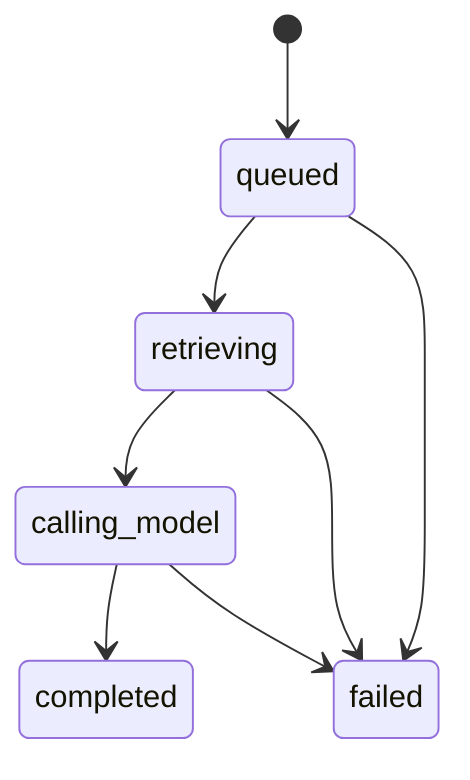
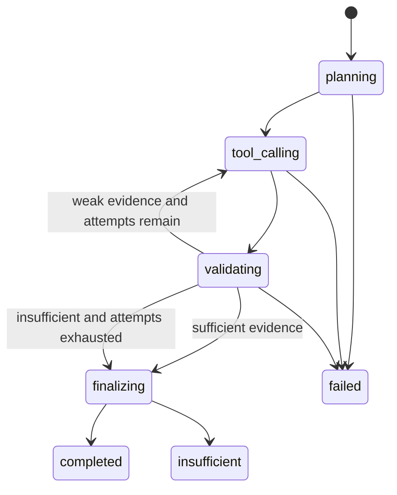
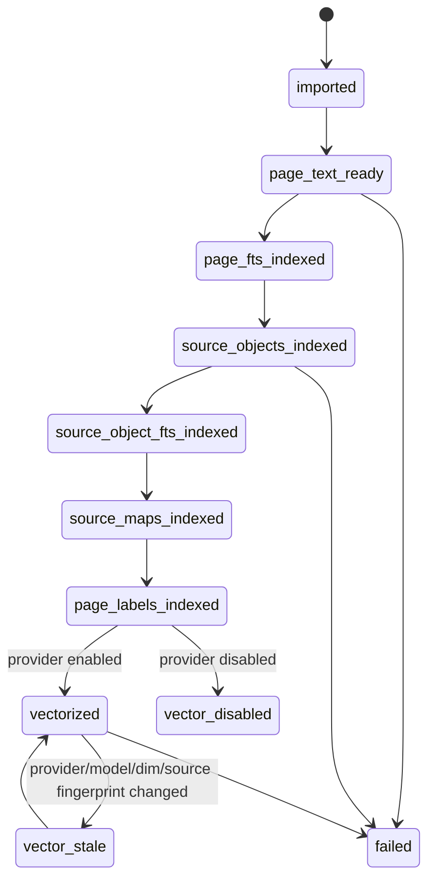
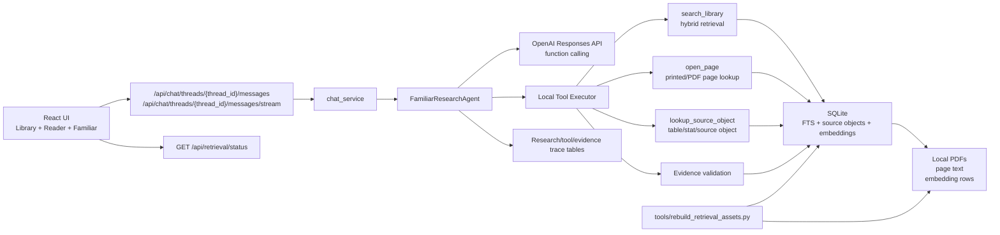

# Familiar Tool-Calling Hybrid RAG Implementation Plan

> **For agentic workers:** REQUIRED SUB-SKILL: Use `superpowers:subagent-driven-development` for implementation work, or `superpowers:executing-plans` if executing serially. Keep the checkbox tasks updated as work lands. Do not start coding from this plan until the user explicitly approves implementation.

**Goal:** Overhaul Familiar from a one-shot RAG answer generator into a bounded, observable, tool-calling research agent that uses hybrid retrieval by default, validates evidence before factual answers, keeps local/private copyright boundaries, and has fully operational local vector search over imported source books.

**Recommended architecture:** Backend-owned research loop using OpenAI Responses API function calling plus local app-executed tools. The model can request tools, but the app owns source scoping, retrieval, retries, validation, citations, persistence, privacy limits, and UI diagnostics.

**Primary implementation areas:** `wfrp_companion/assistant`, `wfrp_companion/source_objects`, `wfrp_companion/db`, `wfrp_companion/api`, `tools`, `frontend/src/components/chat`, `frontend/src/components/library`, `frontend/src/types`, `frontend/src/lib`.

---

## 1. Source Boundary

This plan is based on:

- Live repo instructions:
  - `AGENTS.md`
  - `CLAUDE.md`
- Implementation-plan prompt:
  - `docs/plans/Implementation Plan Script.md`
- Compiled wiki and ADRs:
  - `wiki/CONTEXT.md`
  - `wiki/INDEX.md`
  - `wiki/topics/implementation-standards.md`
  - `wiki/topics/testing-posture-and-conventions.md`
  - `wiki/topics/ai-rag-system.md`
  - `wiki/topics/target-architecture.md`
  - `wiki/topics/pdf-library-and-ingestion.md`
  - `wiki/concepts/hybrid-search-for-rules.md`
  - `wiki/concepts/private-copyright-boundary.md`
  - `docs/adr/0002-managed-local-pdf-storage.md`
  - `docs/adr/0003-local-semantic-embeddings.md`
- Live code inspected for this plan:
  - `wfrp_companion/assistant/chat_service.py`
  - `wfrp_companion/assistant/retrieval.py`
  - `wfrp_companion/assistant/candidates.py`
  - `wfrp_companion/assistant/prompts.py`
  - `wfrp_companion/assistant/conversation_context.py`
  - `wfrp_companion/assistant/evidence.py`
  - `wfrp_companion/assistant/reranking.py`
  - `wfrp_companion/assistant/query_planner.py`
  - `wfrp_companion/assistant/chat_store.py`
  - `wfrp_companion/source_objects/embeddings.py`
  - `wfrp_companion/source_objects/embedding_providers.py`
  - `wfrp_companion/db/schema.sql`
  - `wfrp_companion/config.py`
  - `wfrp_companion/api/schemas.py`
  - `wfrp_companion/api/routes/chat.py`
  - `wfrp_companion/api/routes/library.py`
  - `wfrp_companion/library/catalog.py`
  - `tools/dev.py`
  - `frontend/src/components/chat/AgentChatPanel.tsx`
  - `frontend/src/components/library/LibrarySearchPanel.tsx`
  - `frontend/src/components/library/LibraryTab.tsx`
  - `frontend/src/types/api.ts`
  - `frontend/src/lib/apiClient.ts`
- Current external references:
  - [OpenAI function calling guide](https://platform.openai.com/docs/guides/function-calling?api-mode=responses)
  - [OpenAI Responses API reference](https://platform.openai.com/docs/api-reference/responses/create?api-mode=responses)
  - [OpenAI tools guide](https://platform.openai.com/docs/guides/tools?api-mode=responses)
  - [ReAct](https://arxiv.org/abs/2210.03629)
  - [Self-RAG](https://arxiv.org/abs/2310.11511)
  - [Corrective RAG](https://arxiv.org/abs/2401.15884)
  - [RAG-Fusion](https://arxiv.org/abs/2402.03367)
  - [Searching for Best Practices in RAG](https://aclanthology.org/2024.emnlp-main.981/)
  - [BGE M3-Embedding](https://arxiv.org/abs/2402.03216)
  - [Qwen3 Embedding](https://arxiv.org/abs/2506.05176)
  - [BEIR](https://arxiv.org/abs/2104.08663)

Sources intentionally excluded as architectural input:

- Earlier implementation branches/plans unless their code is now merged into `main`.
- Earlier files under `docs/plans/` other than `docs/plans/Implementation Plan Script.md` and this new plan.
- Previous chat conclusions not verified against live code.
- Private WFRP book text and extracted page text. The plan refers to source-book behavior without reproducing protected text.
- Hosted/vector SaaS vendor docs, because the repo ADRs and user direction require local-first storage.
- OpenAI Agents SDK docs as an implementation target. The plan uses direct Responses API function calling because the app must own local evidence state, citations, and privacy controls.

## 2. Current Live-Code Diagnosis

### Current one-shot Familiar path

`wfrp_companion/assistant/chat_service.py` currently owns the Familiar run. `stream_queued_result()`:

- creates/loads a queued model run,
- transitions the run to `retrieving`,
- builds conversation context,
- calls `retrieval.retrieve_context(...)` once,
- records one `retrieval_run`,
- transitions to `calling_model`,
- builds static messages with `prompts.build_prompt_messages(...)`,
- streams one provider answer.

This is the central live-code problem. Familiar cannot ask for another search, open a page after the user corrects it, inspect a structured object, or recover when retrieval was weak. If the first retrieval misses the statline/table/page, the model can only apologize or hallucinate.

### Current retrieval has partial hybrid capability, but no agent contract

`wfrp_companion/assistant/candidates.py` already has useful hybrid ingredients:

- page exact/full-text search through `search_exact`,
- source-object FTS through `source_object_search_fts`,
- source-object scan fallback,
- vector candidate search through `search_vector_candidates`,
- reciprocal rank fusion.

But this is not yet the target behavior:

- The model cannot request retrieval tools.
- Hybrid channel diagnostics are not first-class enough for user-facing traces.
- Vector search can be disabled or stale without an answer-level trace that makes that clear.
- Page/table/stat lookup is not exposed as a bounded recovery tool.
- Evidence validation is not a backend gate before final answer generation.

### Current vector search is real but not operationally complete

`wfrp_companion/source_objects/embeddings.py` and `source_object_embeddings` already support local embedding storage with provider/model/dimension currentness. `docs/adr/0003-local-semantic-embeddings.md` recommends `sentence-transformers` with `BAAI/bge-m3`.

Current gaps:

- Default config has embeddings disabled.
- There is no single command that prepares all retrieval assets and vectorizes all imported/source books.
- UI status is too compact to prove which books are indexed/vectorized/current.
- Familiar answers do not expose whether vector candidates ran, were skipped, or were stale.

### Current follow-up and page correction handling is too narrow

`wfrp_companion/assistant/conversation_context.py` has limited follow-up detection. It does not robustly preserve active subject/intent for:

- `I want the stats`
- `the statline`
- `same for gors`
- `it's on pg 99`

Reader context is also not part of the chat request contract, so the backend cannot reliably use the currently open book/page as a page-lookup hint.

### Current prompt describes static RAG, not a research agent

`wfrp_companion/assistant/prompts.py` contains `SYSTEM_INSTRUCTIONS` that correctly emphasize enabled books, citations, chat history limits, and copyright restraint. It does not describe:

- tool-use requirements,
- local tool boundaries,
- evidence validation,
- bounded retry behavior,
- page-aware recovery,
- final-answer citation contract based on accepted evidence.

### Current persistence lacks an app-owned source of truth for agent work

Current tables can store messages, model runs, retrieval runs, hits, source books, pages, source objects, embeddings, and citations. They cannot express:

- a multi-step research run,
- individual model-requested tool calls,
- tool argument validation/rejection,
- multiple retrieval attempts for one answer,
- accepted/rejected/partial evidence judgments,
- active thread subject/intent/page context.

That means ownership would be split across incidental model text, frontend inference, and retrieval metadata if implemented without schema changes. The plan must add explicit app-owned workflow state.

### Current UI hides the wrong things

The UI exposes a simple semantic-search status in the library and citations in chat, but it does not show:

- whether a specific Familiar answer used exact/source-object/vector/page channels,
- whether vector search ran,
- why evidence was accepted/rejected,
- whether indexed/vectorized book counts are current,
- when a page correction triggered a direct page lookup.

## 3. Architecture Decision

Build Familiar as a backend-owned bounded research agent using direct OpenAI Responses API function calling.

The model receives a small set of tool schemas, but the backend executes every tool locally. The model never receives authority to select arbitrary books, bypass enabled-source scope, read raw PDFs, dump full pages, write vector state, or decide citation validity. The backend owns:

- active thread/source context,
- tool argument validation,
- hybrid retrieval execution,
- vector currentness checks,
- page/table/stat lookup,
- evidence validation,
- retry limits,
- final evidence packet construction,
- citation filtering,
- persistence,
- UI/debug traces.

### Why this fits this codebase

- The repo already has local SQLite persistence for books, pages, source objects, embeddings, retrieval runs, and citations.
- The existing retrieval code already has hybrid retrieval pieces worth preserving.
- The wiki and ADRs prefer boring local infrastructure over hosted systems.
- Private/copyright constraints require app-owned filtering and bounded excerpts.
- The user specifically wants vector search fully operational and hybrid, not a model-dependent optional tool.
- Direct Responses API function calling integrates with the existing provider abstraction without adopting a heavier orchestration framework.

### Alternatives to avoid

- **Do not build entity-specific patches.** Hardcoding "harpy page 99" or creature aliases would repeat the current failure mode.
- **Do not expose separate `keyword_search` and `vector_search` model tools.** The model would be able to forget one. Hybrid retrieval must be backend-owned and always attempted when applicable.
- **Do not use hosted vector search or upload private PDFs.** This violates the local-first/private source-book boundary.
- **Do not use OpenAI `file_search` over source books.** It would move private corpus storage outside the app-owned local boundary.
- **Do not migrate to OpenAI Agents SDK for this phase.** The app needs explicit SQLite state, source scope, citations, and trace control. Direct Responses function calling is sufficient and easier to test.
- **Do not rely on model self-attestation for evidence.** Backend validation must decide whether retrieved evidence contains the requested thing.

## 4. Target State Model

The system needs explicit workflow state for each Familiar answer attempt.

### Model run state

Keep the existing `model_runs.status` lifecycle compatible with the current app:



During the new research loop, keep `model_runs.status='retrieving'` until validated evidence is ready or the research loop has exhausted attempts. This avoids broad compatibility churn. Detailed agent state lives in new research tables.

### Research run state



### Retrieval asset state per book



### Source of truth ownership

- `model_runs` remains the coarse answer lifecycle.
- `familiar_research_runs` becomes the app-owned source of truth for research-agent workflow.
- `familiar_tool_calls` becomes the source of truth for tool calls requested/executed/rejected.
- `retrieval_runs` remains the source of truth for each retrieval attempt.
- `familiar_evidence_judgments` becomes the source of truth for evidence accepted/rejected/partial.
- `chat_thread_context` becomes the source of truth for active subject/intent/book/page context.
- The frontend may send reader context, but it is only a hint until the backend verifies it through enabled-source lookup.

## 5. Target Architecture Diagram



External boundary:

- The only external AI integration is the configured OpenAI-compatible provider for model reasoning/generation.
- Source books, extracted text, embeddings, retrieval traces, and citations remain local.
- Tool outputs sent to the model are bounded evidence packets, not whole books or public exports.

## 6. Proposed Data Model / Contracts

Add migration `wfrp_companion/db/migration_files/0007_familiar_agent_research.sql`, update `wfrp_companion/db/schema.sql`, and register it in `wfrp_companion/db/migrations.py`.

Required migration wiring:

- Add `FAMILIAR_AGENT_RESEARCH_MIGRATION_ID = "0007_familiar_agent_research"`.
- Append the ID to `MIGRATION_IDS`.
- Add an `apply_familiar_agent_research(connection)` function.
- Add an `elif` branch in `apply_migration(...)` for the new migration ID.

Structured ingestion must use the current `source_objects.object_type` enum unless an explicit migration expands it. Current allowed values are:

- `rule_section`
- `table`
- `table_row`
- `stat_block`
- `npc_profile`
- `monster_profile`
- `location_description`
- `encounter`
- `boxed_text`
- `map_reference`
- `image_reference`
- `index_entry`
- `glossary_entry`
- `cross_reference`
- `page_chunk`

Do not invent object types such as `profile`, `spell`, `talent`, or `lore` without a schema migration plus extractor, query-profile, retrieval, and test updates.

### `chat_thread_context`

Purpose: preserve active conversational research context without trusting model prose as evidence.

Columns:

- `thread_id TEXT PRIMARY KEY REFERENCES chat_threads(id) ON DELETE CASCADE`
- `active_subject TEXT`
- `active_intent TEXT`
- `active_book_id TEXT REFERENCES books(id) ON DELETE SET NULL`
- `active_printed_page_label TEXT`
- `active_pdf_page_number INTEGER`
- `active_source_object_id TEXT REFERENCES source_objects(id) ON DELETE SET NULL`
- `updated_from_message_id TEXT REFERENCES chat_messages(id) ON DELETE SET NULL`
- `updated_from_model_run_id TEXT REFERENCES model_runs(id) ON DELETE SET NULL`
- `metadata_json TEXT NOT NULL DEFAULT '{}'`
- `updated_at TEXT NOT NULL`

Rules:

- Update after successful or partial evidence validation, not merely because the model mentioned a noun.
- Store frontend reader context in `metadata_json.reader_context` only as a hint.
- Do not store long excerpts.

### `familiar_research_runs`

Purpose: one app-owned research run per Familiar answer attempt.

Columns:

- `id TEXT PRIMARY KEY`
- `model_run_id TEXT NOT NULL UNIQUE REFERENCES model_runs(id) ON DELETE CASCADE`
- `thread_id TEXT NOT NULL REFERENCES chat_threads(id) ON DELETE CASCADE`
- `user_message_id TEXT NOT NULL REFERENCES chat_messages(id) ON DELETE CASCADE`
- `source_set_id TEXT`
- `raw_query TEXT NOT NULL`
- `resolved_query TEXT NOT NULL`
- `intent TEXT NOT NULL`
- `status TEXT NOT NULL CHECK (status IN ('planning','tool_calling','validating','finalizing','completed','insufficient','failed'))`
- `max_tool_rounds INTEGER NOT NULL`
- `tool_rounds_used INTEGER NOT NULL DEFAULT 0`
- `evidence_status TEXT NOT NULL CHECK (evidence_status IN ('not_evaluated','sufficient','partial','insufficient'))`
- `final_retrieval_run_id TEXT REFERENCES retrieval_runs(id) ON DELETE SET NULL`
- `metadata_json TEXT NOT NULL DEFAULT '{}'`
- `created_at TEXT NOT NULL`
- `updated_at TEXT NOT NULL`
- `completed_at TEXT`

Indexes:

- `familiar_research_runs_model_run_idx(model_run_id)`
- `familiar_research_runs_thread_idx(thread_id, created_at)`

`source_set_id` is nullable provenance. Per-answer retrieval scope must be read from the thread-level snapshot in `chat_thread_source_books`, then snapshotted again into `retrieval_run_source_books` for each retrieval attempt.

Idempotency and guarded transitions:

- `model_run_id` is unique so replay cannot create two research runs for one model run.
- Status updates must be conditional, for example `where id = ? and status in ('planning','tool_calling','validating','finalizing')`.
- Terminal states `completed`, `insufficient`, and `failed` must not be mutated by retry/replay code.

### `familiar_tool_calls`

Purpose: record every requested/executed/rejected local tool call.

Columns:

- `id TEXT PRIMARY KEY`
- `research_run_id TEXT NOT NULL REFERENCES familiar_research_runs(id) ON DELETE CASCADE`
- `step_number INTEGER NOT NULL`
- `call_index INTEGER NOT NULL DEFAULT 0`
- `provider_call_id TEXT`
- `tool_name TEXT NOT NULL`
- `arguments_json TEXT NOT NULL`
- `argument_hash TEXT NOT NULL`
- `status TEXT NOT NULL CHECK (status IN ('requested','running','succeeded','failed','rejected'))`
- `retrieval_run_id TEXT REFERENCES retrieval_runs(id) ON DELETE SET NULL`
- `output_summary_json TEXT NOT NULL DEFAULT '{}'`
- `error_code TEXT`
- `error_message TEXT`
- `created_at TEXT NOT NULL`
- `updated_at TEXT NOT NULL`
- `completed_at TEXT`

Indexes:

- `familiar_tool_calls_run_idx(research_run_id, step_number)`
- `familiar_tool_calls_retrieval_idx(retrieval_run_id)`

Uniqueness and idempotency:

- `unique(research_run_id, step_number, call_index)`
- `unique(research_run_id, provider_call_id)` where `provider_call_id` is not null
- `argument_hash` is the normalized argument hash used for replay/debug comparison.
- Tool-call status updates must be guarded so `succeeded`, `failed`, or `rejected` calls are not re-executed accidentally.

### `familiar_evidence_judgments`

Purpose: persist backend validation of whether evidence supports the requested answer.

Columns:

- `id TEXT PRIMARY KEY`
- `research_run_id TEXT NOT NULL REFERENCES familiar_research_runs(id) ON DELETE CASCADE`
- `retrieval_run_id TEXT REFERENCES retrieval_runs(id) ON DELETE SET NULL`
- `retrieval_hit_id TEXT REFERENCES retrieval_hits(id) ON DELETE SET NULL`
- `source_object_id TEXT REFERENCES source_objects(id) ON DELETE SET NULL`
- `book_id TEXT REFERENCES books(id) ON DELETE SET NULL`
- `printed_page_label TEXT`
- `requirement_type TEXT NOT NULL`
- `status TEXT NOT NULL CHECK (status IN ('accepted','rejected','partial'))`
- `reason_code TEXT NOT NULL`
- `reasons_json TEXT NOT NULL DEFAULT '[]'`
- `created_at TEXT NOT NULL`

Indexes:

- `familiar_evidence_judgments_run_idx(research_run_id, status)`
- `familiar_evidence_judgments_hit_idx(retrieval_hit_id)`

### Retrieval diagnostics contract

Add or formalize a `RetrievalDiagnostics` dataclass:

```python
@dataclass(frozen=True)
class RetrievalDiagnostics:
    channel_counts: dict[str, int]
    channel_skip_reasons: dict[str, str]
    vector_status: Literal[
        "ran",
        "disabled",
        "missing_embeddings",
        "stale_embeddings",
        "provider_error",
    ]
    candidate_count_before_fusion: int
    candidate_count_after_fusion: int
    reranked_count: int
    selected_count: int
    page_lookup_attempted: bool
    validation_status: Literal[
        "not_evaluated",
        "sufficient",
        "partial",
        "insufficient",
    ]
```

Persist these fields in `retrieval_runs.metadata_json`:

- `diagnostics_schema_version`
- `tool_call_id`
- `attempt_number`
- `resolved_query`
- `intent`
- `channel_counts`
- `channel_skip_reasons`
- `vector_status`
- `fusion_summary`
- `rerank_summary`
- `validation_summary`

### API contracts

Extend `SendChatMessageRequest` with optional reader context:

```json
{
  "content": "it's on pg 99",
  "reader_context": {
    "active_book_id": "...",
    "active_pdf_page_number": 101,
    "active_printed_page_label": "99",
    "open_book_ids": ["..."]
  }
}
```

Source scope remains owned by the thread-level source snapshot in `chat_thread_source_books`, not by live `source_set_books` and not by arbitrary per-turn book IDs. Each retrieval attempt must snapshot the effective scope into `retrieval_run_source_books`. If a later implementation adds per-turn narrowing, it may only narrow within `chat_thread_source_books` and must not expand scope.

Add stream event types:

- `research_started`
- `tool_call`
- `tool_result`
- `evidence_validation`
- richer `retrieval`
- existing `delta`
- existing `completed`
- existing `failed`

Add a retrieval status read model via `GET /api/retrieval/status` or a clearly named extension to the existing library response. Preferred shape:

```json
{
  "books_total": 26,
  "books_enabled": 13,
  "page_text_indexed": 26,
  "source_objects_indexed": 26,
  "table_or_stat_indexed": 18,
  "vectorized_current": 26,
  "vectorized_enabled": 13,
  "embedding_provider": "sentence-transformers",
  "embedding_dimensions": 1024,
  "vector_status": "ready"
}
```

Do not expose `embedding_model` in this API because it may be a local path. Provider name, dimensions, aggregate status, and counts are enough for the UI.

### Tool contracts

The model receives local tool definitions. The backend validates all arguments and executes the tools.

#### `search_library`

Default retrieval tool. It always attempts applicable hybrid retrieval channels.

Arguments:

```json
{
  "query": "harpy statline",
  "intent": "statline_lookup",
  "subject": "harpy",
  "preferred_book_id": null,
  "preferred_printed_page_label": null,
  "object_types": ["stat_block", "monster_profile", "npc_profile", "table", "table_row"],
  "limit": 8
}
```

Backend behavior:

- Apply enabled source scope.
- Resolve query using active thread context and source maps.
- Run page FTS.
- Run source-object FTS.
- Run source-object scan fallback.
- Run vector search when provider/current embeddings exist.
- Run targeted table/stat filters when intent requests them.
- Fuse/rerank.
- Store a `retrieval_run`.
- Return bounded evidence packets with IDs, book/page labels, object labels, short snippets, and diagnostics.

#### `open_page`

Direct page-aware recovery tool.

Arguments:

```json
{
  "book_id": "...",
  "book_title_hint": "Old World Bestiary",
  "printed_page_label": "99",
  "pdf_page_number": null,
  "subject_hint": "harpy",
  "intent": "statline_lookup"
}
```

Backend behavior:

- Resolve book from explicit argument, active reader context, active thread context, source map, and enabled source scope.
- Resolve printed page label to PDF page using page-label calibration.
- Fetch page evidence windows and linked source objects.
- Apply table/stat extraction filters when intent requires them.
- Store a trace/retrieval run.
- Return bounded evidence packets and diagnostics.
- Keep full page text internal. Tool output, stream events, traces, and final prompts receive bounded snippets/evidence windows only.

#### `lookup_source_object`

Structured object inspection tool.

Arguments:

```json
{
  "source_object_id": "...",
  "intent": "statline_lookup"
}
```

Backend behavior:

- Confirm the object's book is enabled.
- Return metadata, citation, bounded snippet, and related table/header context.
- Do not return large surrounding text.

## 7. External Integration Design

### OpenAI Responses API

Source of truth boundary:

- OpenAI is used for reasoning/tool selection and final answer wording.
- The local app remains source of truth for source scope, retrieval, evidence validation, citations, and persistence.

Read/write behavior:

- The app sends:
  - system/developer instructions,
  - conversation summary/history needed for context,
  - strict JSON-schema tool definitions,
  - bounded `function_call_output` tool outputs tied to the model's `call_id`,
  - accepted evidence packets for final answers.
- The app receives:
  - function-call requests,
  - final answer text stream.
- The app does not send:
  - full source books,
  - raw PDFs,
  - full pages,
  - embedding vectors,
  - unrestricted local file paths.

Idempotency:

- Each `model_run_id` has at most one active `familiar_research_run`.
- Each provider tool call is recorded with `provider_call_id` when present.
- Retried local tool execution must either reuse the existing `familiar_tool_calls` row or create a new row with an incremented `step_number`; it must not overwrite prior evidence judgments.

Protocol details:

- Keep provider-side storage disabled with `store=False` unless a future ADR explicitly changes that boundary.
- Preserve Responses output items needed for tool-call continuity, including function-call and reasoning items where the API requires them.
- Return tool outputs as `function_call_output` items with the exact model-provided `call_id`.
- Use strict tool schemas so malformed calls are rejected predictably.
- Prefer disabling provider-parallel tool calls unless the implementation includes explicit per-round `call_index` handling and tests for multiple calls in one round.

Retry behavior:

- Provider/network failure before any final answer marks the research/model run failed and emits `failed`.
- Tool execution failures are returned to the model as bounded tool errors only while attempts remain.
- Bounded loop limits prevent runaway calls.

Success:

- The provider produces a final answer after the backend supplies accepted evidence or insufficiency context.
- Final citations are filtered to accepted evidence.

Failure:

- If the provider is down, Familiar returns a clear failure.
- If retrieval is insufficient, Familiar returns an insufficiency answer with safe trace summary.

### Local embedding provider

Source of truth boundary:

- `source_object_embeddings` stores local vectors and currentness metadata.
- `book_retrieval_status` reports book-level vector readiness.
- The embedding provider computes vectors only; it is not a retrieval source of truth.

Idempotency:

- Embeddings are keyed by source object plus provider/model/dimensions/fingerprint.
- Rebuilds update stale rows or replace them deterministically.

Failure:

- Provider errors mark vector status as `provider_error` for the attempt.
- Retrieval continues through exact/source-object/page channels.
- UI/status surfaces the failure without blocking non-vector search.

### Local filesystem/PDF assets

Source of truth boundary:

- Managed local PDFs and extracted page text remain local assets.
- Database rows point to local library records; API responses avoid raw path exposure.

Failure:

- Missing PDF/page text marks relevant retrieval asset status failed or incomplete.
- Familiar should not claim a source page was checked unless `open_page` or retrieval actually loaded local evidence.

## 8. Core Flow Design

### Chat research flow

1. `POST /api/chat/threads/{thread_id}/messages` or `/api/chat/threads/{thread_id}/messages/stream` receives user message content, idempotency key, and optional reader context.
2. Backend persists the user message and queued `model_run`.
3. Backend resolves enabled source scope from `chat_thread_source_books`, then records the effective scope for each retrieval attempt in `retrieval_run_source_books`.
4. Backend reads `chat_thread_context` and merges safe hints from reader context.
5. Backend creates `familiar_research_runs(status='planning')`.
6. Backend builds research prompt and tool definitions.
7. Provider returns either tool calls or a final answer.
8. If tool calls are returned:
   - validate tool names and arguments,
   - reject out-of-scope book/page/object IDs,
   - record `familiar_tool_calls`,
   - execute local tools,
   - record retrieval runs/tool outputs.
9. Backend validates evidence and records `familiar_evidence_judgments`.
10. If evidence is sufficient, move to finalization.
11. If evidence is weak/empty and attempts remain, send tool outputs and validation summary back to provider.
12. If attempts are exhausted, finalization uses insufficiency context.
13. Backend builds final prompt using only accepted/partial-safe evidence.
14. Provider streams final answer.
15. Backend persists assistant message and citations filtered to accepted evidence.
16. Backend updates `chat_thread_context` from validated subject/intent/page.
17. Backend marks research/model run completed or insufficient/failed.

Transaction boundaries:

- Persist user message/model run before external provider calls.
- Persist each tool call before execution.
- Persist each retrieval run/evidence judgment before final answer generation.
- Persist final assistant message and citations together where possible.
- Use guarded status transitions for `model_runs`, `familiar_research_runs`, and `familiar_tool_calls`; never update terminal statuses through unguarded writes.

Concurrency guards:

- A queued model run should be transitioned with conditional status updates.
- A thread should not run two active Familiar model runs concurrently unless the existing app already permits it; if permitted, `chat_thread_context` updates must include `updated_from_model_run_id` and last-write rules.
- Tool calls must be append-only; do not mutate prior retrieval evidence except status timestamps.

### Hybrid retrieval flow

1. Normalize resolved query and intent.
2. Apply enabled source scope.
3. Run `page_fts`.
4. Run `source_object_fts`.
5. Run `source_object_scan`.
6. Run `vector` if provider and current embeddings are available.
7. Run `table_stat_lookup` filters when intent indicates table/stat/profile and map that intent to current source-object types such as `stat_block`, `monster_profile`, `npc_profile`, `table`, and `table_row`.
8. Run `page_lookup` if a page hint is present.
9. Combine with RRF/fusion.
10. Rerank.
11. Select evidence candidates.
12. Record channel counts, skip reasons, fusion/rerank summaries.

Vector search must run when enabled/current even if exact search already found candidates. Exact hits can still win after fusion/reranking.

### Page-aware recovery flow

1. Parse page reference patterns:
   - `p. 99`
   - `pg 99`
   - `page 99`
   - `it's on pg 99`
   - `same page`
2. Resolve book in this order:
   - explicit book in message,
   - active reader context,
   - active thread context,
   - source-map/book inference from current subject,
   - clarification if ambiguous.
3. Confirm resolved book is enabled.
4. Resolve printed page label to PDF page.
5. Load bounded page evidence windows and linked source objects.
6. Validate the page contains the requested subject/intent markers.

### Follow-up resolution flow

1. Detect short follow-up/stat intent:
   - `I want the stats`
   - `the statline`
   - `stats`
   - `profile`
2. Reuse active subject when no new subject is present.
3. Detect "same for X" and reuse previous intent while replacing subject with X.
4. Treat chat history as intent context only.
5. Require fresh retrieved evidence before factual answer.

### Retrieval asset rebuild flow

Add `tools/rebuild_retrieval_assets.py`.

1. Validate schema.
2. Rebuild/import known local library metadata as needed.
3. Ensure page text is imported where available.
4. Rebuild page FTS.
5. Extract source objects.
6. Rebuild source-object FTS.
7. Rebuild source maps.
8. Backfill page labels.
9. Rebuild embeddings for all imported/source books when provider is enabled.
10. Print human-readable and optionally JSON status.

The command must compose existing modules where possible, not duplicate indexing logic.

The initial implementation should not add a new aggregate `ingest_jobs.job_type`. The command should report aggregate status from existing tables and any per-step jobs already written by composed scripts. If aggregate job tracking becomes necessary, add it as a separate explicit migration with tests for the new job type.

## 9. UX / Surface Behavior

### Familiar panel

During a running answer, show compact status lines:

- `Searching enabled books`
- `Opening Old World Bestiary p. 99`
- `Validating evidence`
- `Retrying with corrected query`

After completion, show an expandable trace:

- retrieval channels run,
- vector ran/skipped reason,
- candidate counts,
- accepted evidence count,
- rejected/partial evidence count,
- retry count,
- citations.

The normal chat answer remains primary. Debug details should be useful but not loud.

### Library/search status

The library surface should distinguish:

- imported books,
- enabled books,
- page-text indexed books,
- source-object indexed books,
- table/stat indexed books,
- vectorized current books,
- vector disabled/stale/error states.

The current compact `Semantic search: N indexed/disabled` display is not enough for this feature.

### Visibility rules

| Surface | Show | Do not show |
| --- | --- | --- |
| Familiar answer | final text, citations, compact trace | raw vectors, file paths, full pages |
| Trace details | channel counts, skip reasons, accepted/rejected summary | long copyrighted excerpts |
| Library status | aggregate indexing/vector status | private local paths |
| Page citation buttons | book title and printed page | raw OCR dumps |

## 10. Implementation Sequence

### Phase 1: Schema, contracts, and store tests

Scope:

- Add app-owned research state and typed contracts.

Changes:

- [ ] Add migration `wfrp_companion/db/migration_files/0007_familiar_agent_research.sql`.
- [ ] Add `FAMILIAR_AGENT_RESEARCH_MIGRATION_ID`, append `MIGRATION_IDS`, and wire `apply_familiar_agent_research(...)` in `wfrp_companion/db/migrations.py`.
- [ ] Update `wfrp_companion/db/schema.sql`.
- [ ] Add dataclasses/Pydantic models for research runs, tool calls, diagnostics, evidence judgments, and reader context.
- [ ] Add chat-store methods for:
  - [ ] creating/updating research runs,
  - [ ] recording tool calls,
  - [ ] recording evidence judgments,
  - [ ] reading/updating thread context.

Intentionally not changed yet:

- No provider tool calling.
- No chat behavior change.

Required tests:

- Migration tests.
- Store lifecycle tests.
- Thread context tests.

Rollout notes:

- Additive schema only.

### Phase 2: Retrieval diagnostics and local tool executor

Scope:

- Make existing retrieval tool-ready and observable.

Changes:

- [ ] Refactor retrieval to return explicit `RetrievalDiagnostics` without breaking existing `retrieve_context()`.
- [ ] Add `search_library` backend tool wrapper.
- [ ] Add `open_page` backend tool.
- [ ] Add `lookup_source_object` backend tool.
- [ ] Persist tool-linked retrieval runs.

Intentionally not changed yet:

- Model still uses one-shot path until provider/agent phase.

Required tests:

- Hybrid channel counts.
- Vector ran/disabled/missing/stale/provider-error states.
- Enabled-source scope enforcement.
- Page lookup with printed page labels.
- Source-object/table/stat lookup with synthetic fixtures.

### Phase 3: Evidence validation and follow-up/page resolution

Scope:

- Add backend validation and deterministic context recovery.

Changes:

- [ ] Add deterministic intent/follow-up parser.
- [ ] Add page-reference parser.
- [ ] Add active thread context update rules.
- [ ] Add `wfrp_companion/assistant/evidence_validation.py`.

Intentionally not changed yet:

- Do not let model decide validation.

Required tests:

- `I want the stats`.
- `the statline`.
- `same for gors`.
- `it's on pg 99`.
- Subject mismatch rejection.
- Statline intent requiring `stat_block`, `monster_profile`, `npc_profile`, `table`, or `table_row` markers.
- Unchecked source rejection.

### Phase 4: Retrieval asset pipeline and status UI

Scope:

- Make vector/index readiness operational and visible.

Changes:

- [ ] Add `tools/rebuild_retrieval_assets.py`.
- [ ] Compose existing import/index/extract/map/label/embed functions.
- [ ] Add aggregate retrieval-status API.
- [ ] Update library UI to show indexed/vectorized/source-object/table status.
- [ ] Document local embedding setup.

Intentionally not changed yet:

- No hosted vector service.
- No required model download in tests.

Required tests:

- Asset status aggregation.
- CLI orchestration with synthetic corpus/fake embeddings.
- Frontend ready/disabled/stale/error states.

### Phase 5: Provider function calling and bounded Familiar agent

Scope:

- Replace one-shot Familiar orchestration with bounded tool-calling research loop.

Changes:

- [ ] Add provider abstractions for tool definitions, calls, outputs, and reasoning continuity.
- [ ] Implement Responses API function calling in the existing provider layer.
- [ ] Add fake provider support for deterministic tests.
- [ ] Implement `FamiliarResearchAgent`.
- [ ] Integrate agent loop into `stream_queued_result()`.
- [ ] Add SSE events for research/tool/evidence progress.

Intentionally not changed yet:

- Do not migrate to Agents SDK.
- Do not expose arbitrary model tools.

Required tests:

- One tool call then final answer.
- Multiple tool rounds.
- Malformed tool args.
- Tool execution failure.
- Bounded retry exhaustion.
- Insufficient-evidence final response.
- Final answer uses accepted citations only.

### Phase 6: Prompt overhaul and final-answer enforcement

Scope:

- Replace static RAG prompt with agent/tool/evidence contract.

Changes:

- [ ] Replace `SYSTEM_INSTRUCTIONS`.
- [ ] Build separate prompt paths for:
  - [ ] research planning/tool use,
  - [ ] final answer with accepted evidence,
  - [ ] insufficiency answer after exhausted attempts.
- [ ] Filter citations to accepted evidence.

Intentionally not changed yet:

- Do not loosen citation requirements for factual WFRP claims.

Required tests:

- Enabled source scope.
- Reader context as non-evidence.
- Citation discipline.
- Copyright restraint.
- No memory-only WFRP factual answers.

### Phase 7: End-to-end UX, wiki, review, and PR readiness

Scope:

- Finish the user-facing surface and documentation after code reflects reality.

Changes:

- [ ] Update chat UI trace.
- [ ] Add e2e coverage for page-aware recovery and follow-up statline flow using synthetic fixtures.
- [ ] Run full backend coverage command.
- [ ] Run frontend tests/build/e2e.
- [ ] Update wiki topics after implementation is real:
  - [ ] `wiki/topics/ai-rag-system.md`
  - [ ] `wiki/concepts/hybrid-search-for-rules.md`
  - [ ] `wiki/topics/pdf-library-and-ingestion.md`
  - [ ] `wiki/topics/testing-posture-and-conventions.md`
  - [ ] `wiki/INDEX.md` if new pages are added.
- [ ] Request independent code/agent review only after implementation is PR-ready.
- [ ] Address review feedback.
- [ ] Push the PR.

## 11. Testing Requirements

Backend changed code must keep 100% coverage. Use the repo standard command, adding the new tool to coverage:

```bash
python -m pytest \
  --cov=wfrp_companion \
  --cov=tools.init_db \
  --cov=tools.import_pdfs \
  --cov=tools.import_page_text \
  --cov=tools.rebuild_fts \
  --cov=tools.rebuild_source_object_fts \
  --cov=tools.rebuild_source_maps \
  --cov=tools.rebuild_embeddings \
  --cov=tools.backfill_page_labels \
  --cov=tools.search_text \
  --cov=tools.source_sets \
  --cov=tools.serve_api \
  --cov=tools.dev \
  --cov=tools.migrate_db \
  --cov=tools.extract_source_objects \
  --cov=tools.rebuild_retrieval_assets \
  --cov-report=term-missing \
  --cov-fail-under=100
```

Required backend test categories:

- Migration/schema tests.
- Store/state lifecycle tests.
- Tool argument validation tests.
- Source-scope enforcement tests.
- Hybrid retrieval diagnostics tests.
- Vector currentness/status tests.
- Page lookup tests.
- Follow-up/context parser tests.
- Evidence validation tests.
- Provider function-calling tests with fake provider.
- Agent bounded-loop/retry tests.
- Prompt construction tests.
- Citation filtering tests.
- API stream-event schema tests.
- CLI asset-rebuild tests.

Code quality command:

```bash
ruff check .
```

Frontend commands:

```bash
npm run test
npm run test:coverage
npm run build
npm run test:e2e
```

Required frontend test categories:

- Chat stream handles new events.
- Research trace renders compact and expanded states.
- Library status distinguishes indexed/vectorized/disabled/stale/error.
- Reader context is sent with chat messages.
- Citations still open correct reader pages.
- UI does not display full page text, raw file paths, or vectors.

No tests may depend on real WFRP book text or downloaded embedding models. Use synthetic fixtures and fake/local-hash providers.

## 12. Verification Matrix

| Scenario | Expected behavior |
| --- | --- |
| Ask for a creature statline from an enabled indexed bestiary | Familiar runs hybrid retrieval, validates stat block/profile/table evidence using current source-object enum values, answers with citation. |
| Ask lore question, then `I want the stats` | Familiar preserves active subject, changes intent to statline lookup, retrieves fresh evidence. |
| Ask statline for one subject, then `same for gors` | Familiar preserves previous intent and swaps subject to gors. |
| User says `it's on pg 99` | Familiar uses `open_page` against active/inferred enabled book and validates page evidence. |
| Relevant book unchecked | Tool rejects or filters the book; answer does not use it. |
| Embeddings disabled | Retrieval still runs exact/source-object/page channels and records vector skip reason. |
| Embeddings enabled/current | Vector channel runs and trace shows vector candidate count. |
| Embeddings stale | Vector status reports stale/needs refresh; retrieval remains functional. |
| Exact hit and vector hit disagree | Fusion/rerank plus evidence validation selects cited evidence that actually matches subject/intent. |
| Retrieval empty after retries | Familiar gives insufficiency answer with safe tool/channel summary. |
| Citation clicked | UI opens the cited book/page. |
| Debug trace expanded | User sees channel counts/reasons, not long copyrighted excerpts. |
| Asset rebuild command run | It reports page/source-object/table/vector readiness for all imported/source books. |

## 13. Migration / Compatibility / Cleanup Strategy

Migration strategy:

- Use additive schema changes only in the first PR.
- Keep existing `model_runs.status` values for compatibility.
- Keep `retrieve_context()` available for tests and any legacy callers while adding tool-ready retrieval wrappers.
- Existing retrieval runs remain valid; new metadata keys are optional for old rows.
- `chat_thread_context` starts empty and is populated lazily after new Familiar runs.

Compatibility scaffolding:

- The one-shot code path may remain behind a feature flag or fallback during development, but the final PR for this phase should make the tool-calling path the default.
- If provider function calling is unavailable, fail clearly or fall back only if the fallback maintains citation/evidence discipline. Do not silently produce memory-only factual answers.

Cleanup after rollout:

- Remove temporary feature flags once tool-calling Familiar is stable and tests cover the default path.
- Remove dead prompt/test branches for the old one-shot static RAG path only after confirming no callers depend on it.
- Do not delete old retrieval-run schema columns; keep backward compatibility for historical traces.

Ambiguous migration cases:

- Books with page text but no source objects should be `page_fts_indexed` but `source_objects_incomplete`.
- Books with source objects but missing embeddings should be searchable and show vector missing/disabled.
- Books with stale embeddings should surface refresh-needed status, not silently run stale vector search.

## 14. Operational Rollout Notes

Rollout order:

1. Apply migrations.

```bash
python tools/migrate_db.py
```

2. Prepare retrieval assets with local embeddings enabled.

```bash
WFRP_EMBEDDING_PROVIDER=sentence-transformers \
WFRP_EMBEDDING_MODEL=BAAI/bge-m3 \
WFRP_EMBEDDING_DIMENSIONS=1024 \
python tools/rebuild_retrieval_assets.py --all-imported
```

3. Start the app.

```bash
python tools/dev.py
```

4. Confirm UI status:

- imported/source books indexed,
- enabled books counted,
- source objects/table-stat records indexed,
- vectorized/current books counted,
- embedding provider enabled.

Operational notes:

- First use of `sentence-transformers` may download model assets; document this.
- If embeddings are disabled, the app remains usable but clearly reports vector disabled.
- If embedding provider fails, exact/source-object/page search remains available.
- No Azure resource operation is required for this plan.

## 15. ADR / Platform Alignment

This plan aligns with existing repo direction:

- `docs/adr/0002-managed-local-pdf-storage.md`: source PDFs remain managed local assets.
- `docs/adr/0003-local-semantic-embeddings.md`: embeddings are local, with `sentence-transformers` and `BAAI/bge-m3` as the recommended useful profile.
- `wiki/concepts/private-copyright-boundary.md`: citations and short retrieved snippets are allowed; public text dumps are not.
- `wiki/concepts/hybrid-search-for-rules.md`: rules work should use hybrid retrieval, not vector-only search.
- `wiki/topics/implementation-standards.md`: changes should be scoped, tested, and grounded in current code.
- `wiki/topics/testing-posture-and-conventions.md`: backend coverage remains 100%.

Tensions and decisions:

- The default config currently disables embeddings. The plan does not force heavyweight model downloads during tests or startup. Instead, it adds an operational command and status surface that make vector readiness explicit.
- The initial vector scope embeds source objects/table/stat records rather than every page chunk. This matches current source-object architecture and keeps the local vector store small. If recall tests prove page chunk embeddings are necessary, add them through a later ADR-backed extension.
- Qwen3 Embedding is a promising current model family, but `BAAI/bge-m3` remains the implementation baseline because it is already selected in the ADR and is enough to build the feature now.

## 16. Non-Goals / Guardrails / Open Questions

Non-goals:

- Hosted vector database.
- OpenAI file search over private PDFs.
- Public API routes that dump book text.
- Entity-specific fixes for harpies, gors, or any other creature.
- Full OCR/layout overhaul outside what is needed for structured source objects/tables/statlines.
- Voice, image generation, campaign writing, or adventure authoring features.
- Migrating to OpenAI Agents SDK.

Guardrails:

- Hybrid retrieval is backend policy. The model should not choose whether vector search runs.
- Reader/chat context is not evidence.
- Final factual WFRP claims need accepted citations.
- Tool calls are bounded by max rounds and max calls per round.
- Tool outputs are bounded and local.
- Tests use synthetic fixtures only.
- Wiki updates happen after implementation reflects reality.
- Independent code/agent review happens only after implementation is PR-ready.

Resolved assumptions:

- Use direct Responses API function calling.
- Keep SQLite as the vector/retrieval store for this phase.
- Use local `sentence-transformers`/`BAAI/bge-m3` as the practical embedding profile.
- Vectorize all imported/source books through the rebuild command when the provider is enabled; per-answer retrieval still filters to enabled books.
- Keep `model_runs.status` compatible and store detailed research state in new tables.

Open questions:

- No blocking product question remains for plan writing.
- During implementation, benchmark whether source-object/stat/table embeddings alone are sufficient. If not, add page-chunk embeddings behind an explicit migration and test-backed design rather than improvising mid-feature.
