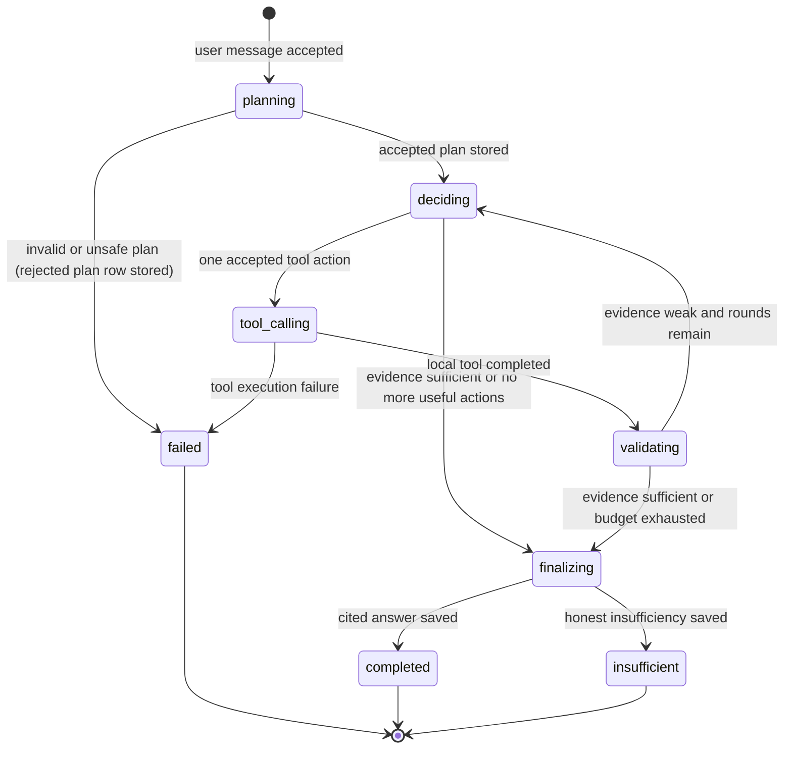
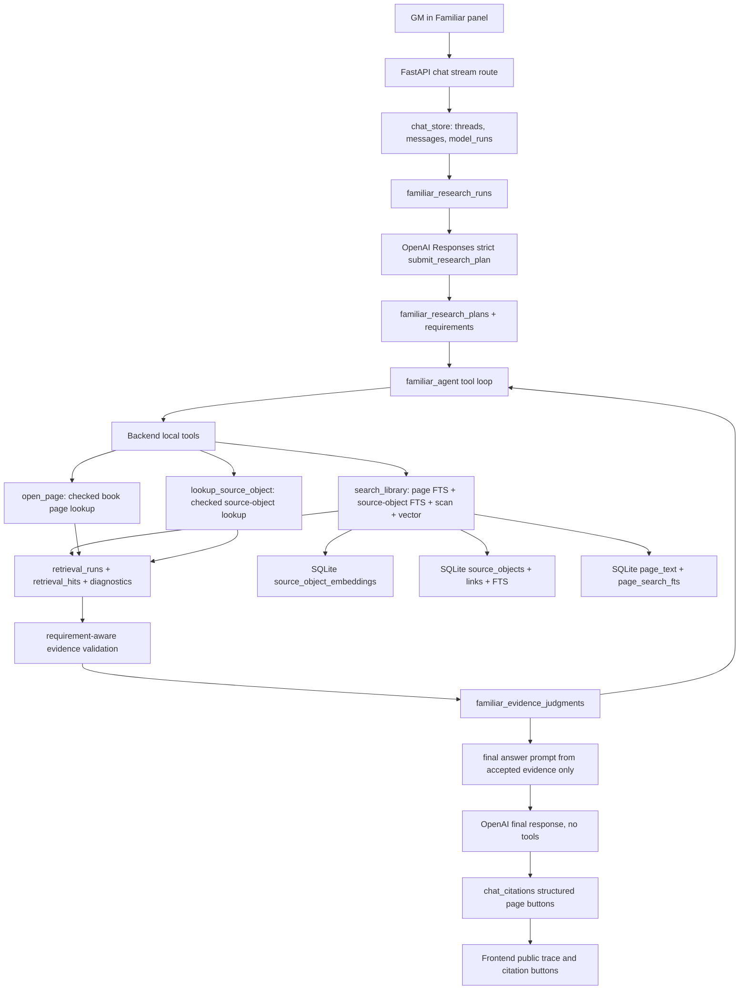

# Full Familiar Reasoning-Led Tool Agent Implementation Plan

> **For agentic workers:** REQUIRED SUB-SKILL: Use `superpowers:subagent-driven-development` (recommended) or `superpowers:executing-plans` to implement this plan task-by-task. Steps use checkbox (`- [ ]`) syntax for tracking.

**Goal:** Replace Familiar's backend-first retrieval pipeline with a complete bounded reasoning-led tool-calling research agent that plans before retrieval, uses backend-owned hybrid search tools, validates evidence against explicit requirements, and answers only from accepted cited evidence.

**Architecture:** Familiar becomes an app-owned agent loop over local tools. The model proposes a structured public research plan and bounded tool actions, while the backend owns source scope, hybrid retrieval, vector currentness, evidence validation, persistence, citations, and privacy boundaries. No local retrieval tool runs before a provider plan has been accepted.

**Tech Stack:** Python 3.12, FastAPI, SQLite, OpenAI Responses API function calling with strict tool schemas, local Sentence Transformers embeddings (`BAAI/bge-m3` through existing provider boundary), React/Vite frontend, pytest, Vitest, Playwright.

---

## 1. Source Boundary

This plan is based on these live repo sources:

- `CLAUDE.md`
- `AGENTS.md`
- `docs/plans/Implementation Plan Script.md`
- `wiki/CONTEXT.md`
- `wiki/INDEX.md`
- `wiki/topics/ai-rag-system.md`
- `wiki/topics/implementation-standards.md`
- `wiki/concepts/hybrid-search-for-rules.md`
- `wiki/concepts/private-copyright-boundary.md`
- `wfrp_companion/assistant/familiar_agent.py`
- `wfrp_companion/assistant/context_resolution.py`
- `wfrp_companion/assistant/evidence_validation.py`
- `wfrp_companion/assistant/prompts.py`
- `wfrp_companion/assistant/provider.py`
- `wfrp_companion/assistant/research.py`
- `wfrp_companion/assistant/research_tools.py`
- `wfrp_companion/assistant/retrieval.py`
- `wfrp_companion/assistant/candidates.py`
- `wfrp_companion/assistant/chat_store.py`
- `wfrp_companion/db/schema.sql`
- `wfrp_companion/db/migrations.py`
- `frontend/src/components/chat/AgentChatPanel.tsx`
- `frontend/src/lib/apiClient.ts`
- `frontend/src/types/api.ts`
- Current local retrieval status from `/api/retrieval/status` on 2026-06-09:
  26 enabled books, 26 page-text indexed books, 26 source-object indexed books,
  23 table/stat indexed books, 26 current vectorized books,
  `embedding_provider='sentence-transformers'`, `embedding_dimensions=1024`,
  aggregate vector status `ready`.
- Current local DB count check on 2026-06-09:
  26 copied/imported/indexed books, 33,752 source objects, and 33,752
  source-object embeddings for `sentence-transformers` at 1024 dimensions.

This plan is also grounded in these external primary or official sources:

- ReAct shows the value of interleaving model reasoning with actions against
  external sources instead of separating reasoning and tool use:
  [arXiv:2210.03629](https://arxiv.org/abs/2210.03629).
- Self-RAG argues against indiscriminate fixed-passage retrieval and supports
  adaptive retrieval plus critique of retrieved passages:
  [arXiv:2310.11511](https://arxiv.org/abs/2310.11511).
- CRAG uses a retrieval evaluator to trigger corrective retrieval behavior when
  retrieved documents are weak:
  [arXiv:2401.15884](https://arxiv.org/abs/2401.15884).
- RECOMP motivates compressing or selecting retrieved content before generation:
  [arXiv:2310.04408](https://arxiv.org/abs/2310.04408).
- Robust RAG work shows irrelevant retrieved context can actively hurt answers:
  [arXiv:2310.01558](https://arxiv.org/abs/2310.01558).
- Citation/verifiability work shows fluent answers often contain unsupported
  claims or inaccurate citations, so source support must be explicit:
  [arXiv:2304.09848](https://arxiv.org/abs/2304.09848) and
  [arXiv:2305.14627](https://arxiv.org/abs/2305.14627).
- Azure AI Search hybrid search documentation describes parallel keyword and
  vector retrieval with Reciprocal Rank Fusion:
  [Hybrid search overview](https://learn.microsoft.com/en-us/azure/search/hybrid-search-overview)
  and [Hybrid search scoring](https://learn.microsoft.com/en-us/azure/search/hybrid-search-ranking).
  This is used as a general IR architecture reference, not as an Azure adoption
  decision.
- OpenAI function calling documentation defines the model-tool-output loop,
  strict schemas, and disabling parallel tool calls when only one tool should
  be handled per turn:
  [OpenAI function calling](https://platform.openai.com/docs/guides/function-calling?api-mode=responses).
- OpenAI reasoning best practices note that persisted reasoning items can help
  multi-tool function calling. This plan intentionally keeps provider storage
  off for private/local-first behavior and uses app-owned public plan summaries
  plus ephemeral in-process response items instead:
  [OpenAI reasoning best practices](https://platform.openai.com/docs/guides/reasoning-best-practices).
- BAAI's `bge-m3` model card recommends hybrid retrieval plus reranking, and
  documents 1024-dimensional dense embeddings, sparse retrieval support, and
  long input support:
  [BAAI/bge-m3 model card](https://huggingface.co/BAAI/bge-m3).

Intentionally excluded as architectural inputs:

- Earlier implementation plans in `docs/plans/`, including
  `docs/plans/2026-06-09-familiar-reasoning-led-research-agent-plan.md`.
  Those plans may be compared during implementation if the user asks, but this
  plan is derived from current live code, wiki, and current external sources.
- Historical chat claims not verified against live code.
- Hosted vector-store or hosted file-search examples that would move private
  book text out of the local app.

## 2. Current Live-Code Diagnosis

The wiki says Familiar is a bounded tool-calling hybrid RAG agent, but live
code still starts with backend-selected retrieval before provider planning:

- `wfrp_companion/assistant/familiar_agent.py::run_research()` resolves the
  request, picks `initial_tool_name(resolved)`, builds `initial_tool_arguments`,
  and executes `execute_tool_and_validate()` before `request_recovery_tool()`
  ever calls the model for a tool decision.
- This means search and validation make the first irreversible relevance
  decision. The model only gets a recovery chance after retrieval is empty,
  partial, or rejected.
- `wfrp_companion/assistant/context_resolution.py` still contains heuristic
  request interpretation. A recent fix prevents one dungeon-crawl
  recommendation from becoming the fake subject `best setting run dungeon crawl`,
  but the general architecture is still brittle because recommendation,
  comparison, source-navigation, lore, statline, and page-correction requests
  are not represented as explicit evidence requirements.
- `wfrp_companion/assistant/evidence_validation.py::validate_hits()` validates
  with only `subject`, `intent`, and checked source scope. This is not enough
  for requirements such as "regular Ogre stats, not Rat Ogre stats",
  "recommend a dungeon crawl site", "compare likely locations", or
  "page 99 in the active book".
- `familiar_evidence_judgments.requirement_type` is a plain string derived from
  intent. There is no stable `requirement_id` linking plan requirements to tool
  calls, retrieval hits, judgments, and final answer obligations.
- `familiar_tool_calls.arguments_json` records tool arguments, but there is no
  app-owned accepted research plan row. The system cannot prove that a tool
  call served a particular evidence requirement.
- `wfrp_companion/assistant/provider.py` supports Responses API function calls,
  strict tool definitions, and `store=False`, but Familiar does not run a true
  model-tool-output loop. The current `response_input()` also replaces messages
  with tool outputs when `tool_results` are supplied, rather than maintaining a
  complete in-process response input list for multi-step tool loops.
- `provider.OpenAIProvider.stream_response()` does not set
  `parallel_tool_calls=False`, so the backend currently relies on downstream
  parsing and tests rather than preventing multi-call turns at the API level.
- `prompts.SYSTEM_INSTRUCTIONS` describes a bounded tool-calling research
  agent, but live orchestration contradicts that prompt because the backend
  performs the first retrieval before any provider plan.
- The retrieval layer itself is mostly aligned with the intended hybrid design:
  `retrieval.retrieve_context_for_source_scope()` builds source maps, plans
  query candidates, collects page FTS, source-object FTS, source-object scan,
  vector candidates, applies RRF, and reranks selected hits.
- `candidates.vector_channel_status()` currently reports `missing_embeddings`
  whenever no vector candidates return for an enabled provider. That loses the
  distinction between "vector channel ran and found nothing" and "vector channel
  could not run because embeddings were missing/stale/provider-error".
- The UI trace in `AgentChatPanel.tsx` surfaces compact events, but it does not
  show an accepted public research plan or requirement-level evidence
  decisions. Users see "research failed" or "evidence insufficient" without a
  clear explanation of what the agent tried to prove.
- Chat history reload does not restore research traces because `ChatTurnResponse`
  does not include persisted research events.

The core live-code ownership problem is this:

> Familiar's first retrieval and evidence gate are owned by backend heuristics,
> while the model is framed as an agent only after those heuristics have already
> narrowed the run. The target architecture must invert this: provider planning
> first, backend-validated local tools second, requirement-linked evidence
> validation third, final answer last.

## 3. Architecture Decision

Implement Familiar as a bounded, app-owned, reasoning-led tool-calling agent:

1. The backend creates a `familiar_research_runs` row in `planning`.
2. The provider must return exactly one strict `submit_research_plan` function
   call before any retrieval tool is executed.
3. The backend validates the plan, stores it, stores requirement rows, and emits
   a public `plan_accepted` trace event.
4. The provider then chooses one local tool action at a time from the allowed
   tools. The backend executes each tool, validates evidence against explicit
   plan requirements, stores judgments, and returns compact tool results.
5. The loop continues until evidence is sufficient, the plan's stop condition is
   met, or `max_tool_rounds` is exhausted.
6. The final answer prompt receives only accepted evidence packets, plan
   summary, relevant recent messages, and evidence status. It does not receive
   unchecked retrieval hits as facts.

Why this fits the repo:

- The repo already has explicit SQLite ownership for chat threads, model runs,
  retrieval runs, tool calls, citations, source scope, source objects, source
  object links, vector lifecycle, and evidence judgments.
- The existing retrieval layer already implements the backend-owned hybrid
  policy. The plan does not need a hosted vector database or agent framework.
- The private/copyright boundary requires local source storage, local vector
  state, short evidence excerpts, and structured citations, all of which are
  easier to enforce with app-owned tools than with hosted file search.
- OpenAI function calling is already wrapped by `provider.OpenAIProvider`, so
  the smallest durable change is a better local agent loop and stricter schemas,
  not a platform replacement.

Avoid these alternatives:

- Do not add entity-specific aliases such as "Karak Azgal for dungeon crawl" or
  "Old World Bestiary for Harpy". That repeats the brittleness.
- Do not let vector search bypass exact/source-object channels, RRF, reranking,
  scope, or validation.
- Do not let the provider query raw PDFs or local filesystem paths.
- Do not adopt OpenAI File Search or hosted vector stores in this phase.
- Do not set OpenAI `store=true` for private book-grounded research runs.
- Do not expose hidden chain-of-thought. Surface public plan summaries,
  tool choices, evidence decisions, and citations instead.
- Do not make the frontend infer research state from prose.

## 4. Target State Model

Familiar needs a formal lifecycle state machine because runs include provider
planning, local tool side effects, validation, retries, and final answer
creation.



Required state ownership:

- `model_runs.status` remains the chat/model lifecycle state used by the API.
- `familiar_research_runs.status` owns the agent research lifecycle.
- `familiar_research_runs.status` must add `deciding` in the Phase 1
  migration because the accepted-plan loop depends on it.
- `plan_rejected` is not a research-run status. Rejected plans are persisted as
  `familiar_research_plans(status='rejected')`, and the run transitions to
  `failed`.
- `familiar_research_plans.status` owns plan validity.
- `familiar_research_requirements.status` owns requirement-level evidence
  progress.
- `familiar_tool_calls.status` owns each tool action lifecycle.
- `familiar_evidence_judgments.status` owns hit-level support decisions.
- `retrieval_runs` and `retrieval_run_source_books` own immutable retrieval
  scope/results snapshots.
- `chat_citations` remain structured final citation payloads.

## 5. Target Architecture Diagram



## 6. Proposed Data Model / Contracts

### Schema additions

Add migration `wfrp_companion/db/migration_files/0008_familiar_reasoning_agent.sql`
and update `wfrp_companion/db/schema.sql`.

Create `familiar_research_plans`:

```sql
create table if not exists familiar_research_plans (
  id text primary key,
  research_run_id text not null references familiar_research_runs(id) on delete cascade,
  revision integer not null default 1,
  provider_call_id text,
  provider_response_id text,
  schema_version integer not null,
  task_kind text not null,
  answer_policy text not null,
  public_summary text not null,
  plan_json text not null,
  plan_hash text not null,
  status text not null,
  error_code text,
  error_message text,
  created_at text not null,
  accepted_at text,
  check(revision >= 1),
  check(schema_version >= 1),
  check(task_kind in (
    'statline_lookup',
    'rules_lookup',
    'setting_lore',
    'location_recommendation',
    'source_navigation',
    'comparison',
    'gm_advice',
    'page_lookup'
  )),
  check(answer_policy in (
    'cite_required',
    'cite_required_with_gm_interpretation',
    'general_advice_allowed',
    'insufficiency_only'
  )),
  check(status in ('accepted', 'rejected')),
  check(length(public_summary) between 1 and 600),
  check(length(plan_hash) > 0)
);

create unique index if not exists ux_familiar_research_plans_run_revision
on familiar_research_plans(research_run_id, revision);
```

Create `familiar_research_requirements`:

```sql
create table if not exists familiar_research_requirements (
  id text primary key,
  plan_id text not null references familiar_research_plans(id) on delete cascade,
  requirement_key text not null,
  evidence_kind text not null,
  subject text,
  subject_type text,
  query_hint text not null,
  required_object_types_json text not null default '[]',
  preferred_book_ids_json text not null default '[]',
  excluded_subjects_json text not null default '[]',
  page_refs_json text not null default '[]',
  min_accepted_hits integer not null default 1,
  status text not null default 'pending',
  created_at text not null,
  updated_at text not null,
  check(length(requirement_key) > 0),
  check(length(query_hint) > 0),
  check(min_accepted_hits >= 0),
  check(evidence_kind in (
    'statline',
    'rule',
    'table',
    'setting_lore',
    'location_recommendation',
    'source_navigation',
    'page_text',
    'comparison',
    'general_advice'
  )),
  check(status in ('pending', 'partial', 'satisfied', 'unsatisfied'))
);

create unique index if not exists ux_familiar_requirements_plan_key
on familiar_research_requirements(plan_id, requirement_key);
```

Create `familiar_research_events` for durable public trace history:

```sql
create table if not exists familiar_research_events (
  id text primary key,
  research_run_id text not null references familiar_research_runs(id) on delete cascade,
  sequence_number integer not null,
  event_type text not null,
  public_label text not null,
  metadata_json text not null default '{}',
  created_at text not null,
  check(sequence_number >= 1),
  check(length(event_type) > 0),
  check(length(public_label) > 0),
  check(length(public_label) <= 500)
);

create unique index if not exists ux_familiar_research_events_sequence
on familiar_research_events(research_run_id, sequence_number);
```

Modify `familiar_tool_calls`:

```sql
alter table familiar_tool_calls add column plan_id text references familiar_research_plans(id) on delete set null;
alter table familiar_tool_calls add column requirement_id text references familiar_research_requirements(id) on delete set null;
alter table familiar_tool_calls add column decision_summary text;
```

Modify `familiar_evidence_judgments`:

```sql
alter table familiar_evidence_judgments add column plan_id text references familiar_research_plans(id) on delete set null;
alter table familiar_evidence_judgments add column requirement_id text references familiar_research_requirements(id) on delete set null;
alter table familiar_evidence_judgments add column support_level text;
```

SQLite cannot add new `check` constraints to existing tables with a simple
`alter table`. Phase 1 must add `deciding` to
`familiar_research_runs.status` through a copy-table migration that preserves
all rows, refuses duplicate object names before renaming, and keeps the
existing statuses: `planning`, `tool_calling`, `validating`, `finalizing`,
`completed`, `insufficient`, and `failed`. Do not add `plan_rejected` as a
run status; rejected plans belong in `familiar_research_plans.status`.

Migration registration requirement:

- Add `FAMILIAR_REASONING_AGENT_MIGRATION_ID =
  "0008_familiar_reasoning_agent"` to `wfrp_companion/db/migrations.py`.
- Append that constant to `MIGRATION_IDS`.
- Add an `elif` branch in `apply_migration()` that calls
  `apply_familiar_reasoning_agent(connection)`.
- Implement `apply_familiar_reasoning_agent()` so it executes the migration SQL
  and performs any required copy-table rebuild for
  `familiar_research_runs.status`.
- Update `collect_table_counts()` so migration summaries include
  `familiar_research_plans`, `familiar_research_requirements`,
  `familiar_research_events`, and the modified existing research tables.
- Add schema tests that prove an initialized database applies migration `0008`
  through the runner, not by manually executing the SQL file.

### Python contracts

Create `wfrp_companion/assistant/agent_planning.py`.

Core dataclasses:

```python
from dataclasses import dataclass
from typing import Literal


@dataclass(frozen=True)
class EvidenceRequirement:
    requirement_key: str
    evidence_kind: str
    subject: str | None
    subject_type: str | None
    query_hint: str
    required_object_types: tuple[str, ...]
    preferred_book_ids: tuple[str, ...]
    excluded_subjects: tuple[str, ...]
    page_refs: tuple[str, ...]
    min_accepted_hits: int

@dataclass(frozen=True)
class ResearchPlan:
    task_kind: str
    answer_policy: str
    public_summary: str
    requirements: tuple[EvidenceRequirement, ...]
    initial_actions: tuple["AgentAction", ...]
    stop_condition: str

@dataclass(frozen=True)
class AgentAction:
    tool_name: str
    requirement_key: str | None
    arguments: dict[str, object]
    decision_summary: str

@dataclass(frozen=True)
class FinalResearchDecision:
    decision_type: Literal["finalize_research"]
    reason: Literal["requirements_satisfied", "budget_exhausted", "no_useful_action"]
    requirement_keys: tuple[str, ...]
    evidence_status: Literal["sufficient", "partial", "insufficient"]
    decision_summary: str
```

Strict schema requirements:

- Every plan has 1 to 5 requirements.
- Every requirement has a unique `requirement_key`.
- Tool actions can only reference known requirement keys.
- `AgentAction.requirement_key` is the canonical requirement identity. If a tool
  argument also contains `requirement_key`, the validator must require strict
  equality before any retrieval executes.
- Tool actions can only use backend-allowed tool names.
- Tool arguments must be bounded and cannot include large copied text.
- `public_summary` and `decision_summary` are public trace text, not hidden
  chain-of-thought.
- `answer_policy` controls whether final generation may include uncited general
  advice. Factual WFRP claims still require citations.

Tool action schema should make invalid states unrepresentable:

- `search_library` arguments:
  `requirement_key`, `query`, `intent`, `evidence_kind`, `limit`.
- `open_page` arguments:
  `requirement_key`, `book_id`, `book_title_hint`, `printed_page_label`,
  `pdf_page_number`, `subject_hint`, `intent`.
- `lookup_source_object` arguments:
  `requirement_key`, `source_object_id`, `intent`.

Do not expose a `run_vector` or `hybrid` argument. Hybrid retrieval is backend
policy and runs whenever provider/readiness allows it.

Finalization action schema:

- `finalize_research` arguments:
  `reason`, `requirement_keys`, `evidence_status`, `decision_summary`.
- `finalize_research` is not a retrieval tool and never performs search.
- The backend accepts `finalize_research` only when every referenced
  requirement key exists and either:
  accepted evidence satisfies the plan's stop condition, or
  max tool rounds are exhausted, or
  the provider explains why no remaining allowed tool can improve the evidence.
- The backend records `finalize_research` as a public decision event, then sets
  `familiar_research_runs.status='finalizing'`.
- The final answer still uses a separate `tool_choice="none"` provider call
  built from accepted evidence only.

## 7. External Integration Design

### OpenAI Responses API

Source of truth boundary:

- OpenAI provides model reasoning, structured plan calls, tool action calls, and
  final answer text.
- The app owns state, source scope, retrieval, validation, retries, citations,
  and storage.

Provider settings:

- Keep `store=False` to preserve the local/private boundary.
- Use strict function schemas for `submit_research_plan` and local research
  tools.
- Set `parallel_tool_calls=False` for research planning/tool-action turns so
  the backend handles at most one provider tool request per step.
- Use `tool_choice={"type": "function", "name": "submit_research_plan"}` for
  the initial planning call.
- Use allowed tool choice or ordinary tool definitions for later action calls.
- Use `tool_choice="none"` for the final answer call.

Reasoning item compromise:

- OpenAI docs recommend retaining reasoning items or `previous_response_id` for
  complex function-calling performance. This app should not enable provider
  storage for private book runs.
- Within a single research run, the provider wrapper must keep the prior
  response output items in memory and pass them back with function-call outputs
  when `store=False` prevents relying on provider-side state.
- Replace the current `response_input(messages, tool_results)` behavior that
  sends only `function_call_output` items after a tool result. The new provider
  contract is:
  1. Planning turn input: safe `ProviderMessage` items plus the forced
     `submit_research_plan` tool.
  2. Tool-decision turn input: the previous response's output items followed by
     one `function_call_output` for the stored `submit_research_plan` call.
  3. Subsequent tool-decision turn input: the preserved output items from the
     prior decision turn followed by the latest local tool's
     `function_call_output`.
  4. Final answer turn input: a fresh compact prompt built from accepted
     evidence and public trace summaries, `tool_choice="none"`, and no hidden
     reasoning items persisted outside memory.
- Do not persist hidden reasoning items to SQLite.
- Persist only public plan summaries, public decision summaries, tool inputs,
  count-oriented diagnostics, evidence judgments, and final citations.

Failure handling:

- Provider unavailable before plan acceptance: mark `model_runs.status='failed'`,
  `familiar_research_runs.status='failed'`, zero tool calls, zero retrieval
  runs, retryable error.
- Provider emits invalid JSON or invalid plan: store a rejected plan row, mark
  run failed with `invalid_research_plan`, zero retrieval runs.
- Provider emits multiple tool calls in one step: reject the step with
  `invalid_tool_call_count`, do not execute retrieval, and either ask once for a
  corrected action or fail if repeated.
- Provider emits final answer before evidence/plan state permits it: ignore as
  invalid for the research phase and ask for an allowed local tool action or
  `finalize_research` action within budget.

### Local retrieval and vector integration

Source of truth boundary:

- SQLite owns page text, source objects, links, source maps, embeddings,
  retrieval runs, and vector readiness.
- The embedding provider creates local vectors only through app tooling.

Rules:

- `search_library` always uses backend-owned hybrid retrieval:
  page FTS, source-object FTS, source-object scan, vector candidates when
  current, link-aware evidence resolution, RRF, and reranking.
- Query-time vector failures fail closed to non-vector channels.
- Retrieval diagnostics must distinguish:
  `ran`, `ran_no_candidates`, `disabled`, `missing_embeddings`,
  `stale_embeddings`, and `provider_error`.
- `/api/retrieval/status` remains count-only and must not expose raw book text
  or local model paths.

## 8. Core Flow Design

### New chat message flow

1. `chat_service.stream_chat_message()` creates the user message and model run.
2. `familiar_agent.run_research()` merges reader context but does not run
   retrieval.
3. Backend creates `familiar_research_runs(status='planning')`.
4. Backend calls provider with `submit_research_plan` as the only allowed tool.
5. Backend validates and stores the plan and requirements in one transaction.
6. Backend emits `plan_accepted` stream event and durable
   `familiar_research_events` row.
7. Backend enters the tool loop.
8. Provider selects exactly one local tool action or one `finalize_research`
   action.
9. Backend validates action name, requirement key equality, argument bounds,
   source scope, finalization preconditions, and max rounds before execution.
10. If the action is a local tool, backend executes it, records
    `familiar_tool_calls`, records `retrieval_runs`, validates hits against the
    linked requirement, records judgments, and updates requirement statuses.
11. If the action is `finalize_research`, backend records the public decision
    event and transitions the run to `finalizing` without running retrieval.
12. Backend sends compact public tool/action result summaries to the provider.
13. Loop continues until requirements are satisfied or bounded attempts end.
14. Backend builds final answer prompt from accepted evidence only.
15. Backend stores the assistant message and structured citations.

### Requirement-aware validation flow

Validation input:

- `EvidenceRequirement`
- retrieved hit
- checked source-book snapshot
- retrieval diagnostics

Validation rules:

- All evidence must be in the checked source-book snapshot.
- `statline` requires source-object type `stat_block`, `monster_profile`,
  `npc_profile`, or stat markers in bounded context.
- `table` requires `table` or `table_row`, or direct page evidence that contains
  the table label and structure.
- `location_recommendation` accepts topical location/adventure/setting evidence
  that supports selection criteria, without requiring the user's entire natural
  language request to appear as a subject phrase.
- Excluded subjects must reject hits whose object title or high-confidence
  evidence text matches the excluded subject. Example: "Ogre, not Rat Ogre".
- Page correction requirements prefer `open_page` and validate book/page match
  before text relevance.
- `general_advice` may be satisfied without book evidence only when the plan's
  `answer_policy` permits uncited general advice and the final answer labels it
  as general GM advice.

### Follow-up flow

1. `conversation_context` and `chat_thread_context` provide active subject,
   active book, active page, prior accepted requirement summaries, and user
   corrections.
2. The provider plan must explicitly state the follow-up interpretation.
3. Backend verifies that interpretation is compatible with active context:
   "I want the stats" can inherit active subject; "no ogres, not rat ogres"
   must update exclusions and subject.
4. The final answer updates `chat_thread_context` only from accepted evidence.

### Page-aware recovery flow

1. If the user provides "it is on pg 99", the provider plan must create a
   `page_text` requirement with the active or hinted book/page.
2. The first action should normally be `open_page`.
3. `open_page` resolves checked book plus printed/PDF page.
4. Validation checks the page and requirement. The model can then request
   `lookup_source_object` if a structured object ID is present in the hit.

### Retry flow

- A retry creates a new model run and new research run.
- It reuses the original user message and current source scope.
- It does not reuse old accepted evidence unless the new plan/tool loop
  retrieves and validates it again.
- Historical research rows remain immutable audit history.

### Transaction boundaries

- Create messages/model run in one short transaction.
- Create research run in one short transaction.
- Store accepted plan and requirements in one short transaction.
- Record each tool call before external/local side effects.
- Record retrieval runs and evidence judgments after tool execution.
- Update requirement/run statuses with guarded `where status in (...)` updates.
- Do not hold SQLite write transactions during provider streaming or local
  transformer inference.

Example guarded transition:

```sql
update familiar_research_runs
set status = 'tool_calling',
    tool_rounds_used = tool_rounds_used + 1,
    updated_at = ?
where id = ?
  and status in ('deciding', 'validating')
  and tool_rounds_used < max_tool_rounds;
```

## 9. UX / Surface Behavior

The Familiar panel should show a compact public trace, not hidden reasoning:

| Event | User-facing label |
| --- | --- |
| `research_started` | "Research started" |
| `plan_accepted` | "Plan: find cited evidence for regular Ogre stats" |
| `tool_call` search | "Searching enabled books for: Ogre statistics statline" |
| `tool_result` | "Tool returned 8 candidates; vector ran" |
| `evidence_validation` | "Evidence partial; 1 accepted, 3 rejected" |
| `requirement_satisfied` | "Satisfied: regular Ogre statline" |
| `requirement_unsatisfied` | "Still missing: regular Ogre statline" |
| `finalizing` | "Answering from accepted evidence" |
| `failed` | "Research failed before retrieval" |

Surface rules:

- The trace may show query strings, counts, vector status, accepted/rejected
  counts, requirement labels, and safe reason codes.
- The trace must not show hidden chain-of-thought, raw large book excerpts,
  local filesystem paths, API keys, or embedding model filesystem paths.
- Citations remain buttons backed by structured `ChatCitationResponse` fields.
- Chat history should reload persisted public research events.
- The Library aggregate status should continue showing enabled/indexed/vector
  counts.

## 10. Implementation Sequence

The phases below are PR-sized, but for this user request they should land on
the same feature branch and can be pushed as one PR after all phases pass.

### Phase 1: Plan contracts and schema, no behavior flip

**Scope:** Add durable plan/requirement/event contracts and storage. Current
Familiar behavior remains unchanged until tests and migration are in place.

**Files:**

- Create `wfrp_companion/assistant/agent_planning.py`
- Create `tests/assistant/test_agent_planning.py`
- Create `wfrp_companion/db/migration_files/0008_familiar_reasoning_agent.sql`
- Modify `wfrp_companion/db/schema.sql`
- Modify `wfrp_companion/db/migrations.py`
- Modify `wfrp_companion/assistant/research.py`
- Modify `wfrp_companion/assistant/chat_store.py`
- Modify `tests/assistant/test_chat_store.py`
- Modify `tests/db/test_schema.py`

Steps:

- [ ] Write failing tests in `tests/assistant/test_agent_planning.py` for:
  valid statline plan, valid location-recommendation plan, duplicate
  requirement keys, unknown tool name, action referencing an unknown
  requirement key, overlong public summary, overlong tool arguments, and
  private-path scrubbing.
- [ ] Run:
  `python -m pytest tests/assistant/test_agent_planning.py -q`
  and verify failures are about missing planning contracts.
- [ ] Implement dataclasses, strict schema helpers, JSON parser, and validation
  in `agent_planning.py`.
- [ ] Add migration and schema tables/columns exactly as described in section 6,
  including the copy-table `familiar_research_runs.status` rebuild that adds
  `deciding`.
- [ ] Register the migration in `wfrp_companion/db/migrations.py` by adding
  `FAMILIAR_REASONING_AGENT_MIGRATION_ID`, adding it to `MIGRATION_IDS`, adding
  the `apply_migration()` dispatcher branch, implementing
  `apply_familiar_reasoning_agent()`, and updating `collect_table_counts()`.
- [ ] Add schema tests proving `apply_pending_migrations()` applies migration
  `0008_familiar_reasoning_agent` and that a run can be stored with
  `status='deciding'`.
- [ ] Add `chat_store` functions:
  `record_familiar_research_plan()`,
  `record_familiar_research_requirement()`,
  `list_familiar_research_requirements()`,
  `record_familiar_research_event()`,
  `list_familiar_research_events()`.
- [ ] Run:
  `python -m pytest tests/assistant/test_agent_planning.py tests/assistant/test_chat_store.py tests/db/test_schema.py -q`
  and verify all pass.

**Does not change yet:** No provider-first orchestration, no UI change.

### Phase 2: Provider-first planning, zero retrieval before plan

**Scope:** Invert the first step. Familiar must call provider planning and store
an accepted plan before any retrieval tool runs.

**Files:**

- Modify `wfrp_companion/assistant/provider.py`
- Modify `wfrp_companion/assistant/prompts.py`
- Modify `wfrp_companion/assistant/familiar_agent.py`
- Modify `tests/assistant/test_provider.py`
- Modify `tests/assistant/test_prompts.py`
- Modify `tests/assistant/test_familiar_agent.py`

Steps:

- [ ] Write a failing test proving `search_library` is not called when the
  provider fails before returning `submit_research_plan`.
- [ ] Write a failing test proving a valid provider plan is stored before the
  first `familiar_tool_calls` row.
- [ ] Write a failing test proving invalid plan JSON creates a rejected plan and
  zero `retrieval_runs`.
- [ ] Add `submit_research_plan` tool definition with `strict=True`.
- [ ] Add provider support for `parallel_tool_calls=False`.
- [ ] Replace `response_input()` with an in-memory Responses transcript builder
  that preserves prior response output items for the active research run while
  keeping `store=False`.
- [ ] Add provider tests proving a tool-result turn includes the prior
  `function_call` item followed by the matching `function_call_output`, rather
  than replacing the whole input with the output alone.
- [ ] Add a planning prompt that includes raw user query, safe recent messages,
  reader context, source-scope summary, available tools, and the evidence
  contract.
- [ ] Change `run_research()` so `initial_tool_name()` is not used before plan
  acceptance.
- [ ] Keep `initial_tool_name()` only as compatibility helper until later
  cleanup tests remove it.
- [ ] Run:
  `python -m pytest tests/assistant/test_provider.py tests/assistant/test_prompts.py tests/assistant/test_familiar_agent.py -q`
  and verify all pass.

Required result: no local retrieval occurs before plan acceptance.

### Phase 3: True bounded tool loop with requirement-linked actions

**Scope:** Replace recovery-only tool calling with a provider-driven action loop
where every tool call references a plan requirement.

**Files:**

- Modify `wfrp_companion/assistant/familiar_agent.py`
- Modify `wfrp_companion/assistant/research_tools.py`
- Modify `wfrp_companion/assistant/chat_store.py`
- Modify `tests/assistant/test_familiar_agent.py`
- Modify `tests/assistant/test_research_tools.py`
- Modify `tests/assistant/test_chat_store.py`

Steps:

- [ ] Write failing tests for one-tool-per-step behavior with
  `parallel_tool_calls=False`.
- [ ] Write failing tests for rejecting unknown requirement keys and invalid
  tool names without executing local retrieval.
- [ ] Write failing tests for rejecting a tool action when
  `AgentAction.requirement_key` and `arguments["requirement_key"]` differ.
- [ ] Write failing tests for multi-step action flow:
  plan -> search -> insufficient -> open_page -> sufficient -> final answer.
- [ ] Write failing tests proving `finalize_research` records a decision event,
  runs no retrieval, and transitions the run to `finalizing`.
- [ ] Add `plan_id`, `requirement_id`, and `decision_summary` to tool-call
  persistence and dataclasses.
- [ ] Change tool execution to validate canonical `requirement_key` equality
  before running a tool.
- [ ] Add `finalize_research` action handling and precondition checks before
  final answer generation.
- [ ] Add public trace events for plan acceptance, tool action, tool result,
  and requirement status.
- [ ] Run:
  `python -m pytest tests/assistant/test_familiar_agent.py tests/assistant/test_research_tools.py tests/assistant/test_chat_store.py -q`
  and verify all pass.

Required result: Familiar can plan, use tools, inspect summaries, and choose
additional tools before answering.

### Phase 4: Requirement-aware evidence validation

**Scope:** Replace `subject + intent` validation as the primary gate with
explicit requirement validation.

**Files:**

- Modify `wfrp_companion/assistant/evidence_validation.py`
- Modify `wfrp_companion/assistant/familiar_agent.py`
- Modify `wfrp_companion/assistant/context_resolution.py`
- Modify `tests/assistant/test_evidence_validation.py`
- Modify `tests/assistant/test_context_resolution.py`
- Modify `tests/assistant/test_familiar_agent.py`

Steps:

- [ ] Write failing tests for:
  regular Ogre stats excluding Rat Ogre, broad dungeon-crawl recommendation,
  Harpy page correction, "I want the stats" follow-up, "same for gors", and
  topical lore with no named statline requirement.
- [ ] Add validation functions per `evidence_kind`.
- [ ] Preserve old `validate_hits(subject, intent, ...)` only as a compatibility
  wrapper that builds a requirement internally.
- [ ] Ensure rejected judgments record requirement id, support level, and safe
  reason codes.
- [ ] Update thread context only from accepted evidence and requirement summary.
- [ ] Remove the one-off dungeon-crawl special case from
  `context_resolution.py` once provider-first planning covers recommendation
  intent generally.
- [ ] Run:
  `python -m pytest tests/assistant/test_evidence_validation.py tests/assistant/test_context_resolution.py tests/assistant/test_familiar_agent.py -q`
  and verify all pass.

Required result: validation checks the requested evidence requirement, not a
literal normalized phrase accidentally derived from the user prompt.

### Phase 5: Hybrid/vector diagnostics hardening

**Scope:** Keep vector search fully operational and make traces prove what ran.

**Files:**

- Modify `wfrp_companion/assistant/candidates.py`
- Modify `wfrp_companion/assistant/research.py`
- Modify `wfrp_companion/assistant/retrieval.py`
- Modify `wfrp_companion/assistant/research_tools.py`
- Modify `tests/assistant/test_retrieval.py`
- Modify `tests/assistant/test_research_tools.py`
- Modify `tests/source_objects/test_embeddings.py`

Steps:

- [ ] Write failing tests for vector provider enabled with zero candidates
  returning `vector_status='ran_no_candidates'`, not `missing_embeddings`.
- [ ] Write failing tests for disabled provider, missing embeddings, stale
  embeddings, provider error, malformed vector row, and current vectors.
- [ ] Add richer vector status enum while preserving API compatibility by
  mapping unknown old values safely in frontend tests.
- [ ] Ensure `retrieval_hits.rank_reasons_json` includes vector provider/model
  and similarity only when vector candidates exist.
- [ ] Ensure tool-result metadata includes channel counts, skipped reasons,
  RRF counts, reranked counts, selected counts, and validation status.
- [ ] Run:
  `python -m pytest tests/assistant/test_retrieval.py tests/assistant/test_research_tools.py tests/source_objects/test_embeddings.py -q`
  and verify all pass.

Required result: vector readiness and per-run vector participation are both
observable and truthful.

### Phase 6: Final answer prompt and Familiar system prompt overhaul

**Scope:** Make prompts match the real agent contract and prevent unsupported
claims from slipping through final generation.

**Files:**

- Modify `wfrp_companion/assistant/prompts.py`
- Modify `tests/assistant/test_prompts.py`
- Modify `tests/assistant/test_familiar_agent.py`

Target system prompt text:

```text
You are Familiar, a private local WFRP 2e Game Master aid.
You operate as a bounded research agent over the user's enabled local books.
The local app owns source scope, tools, retrieval, vector currentness, evidence validation, citations, and storage.

Use the public research plan and accepted evidence supplied by the app.
Do not answer factual WFRP rules, setting, statline, NPC, location, or source claims from memory.
Unchecked books, chat history, and reader context are not evidence.
Reader context can guide tool use but cannot satisfy a citation requirement.

For factual WFRP claims, cite the accepted book/page evidence.
If accepted evidence is insufficient, say exactly what is missing.
For general GM advice that does not claim WFRP source facts, label it as general advice.
Keep copyrighted content brief: summarize, cite, and avoid long reproduced passages.
Do not reveal hidden reasoning; it is acceptable to summarize the public plan and evidence status.
```

Steps:

- [ ] Write failing prompt snapshot tests for cited statline answer,
  recommendation answer with cited evidence, insufficiency answer, and general
  GM advice answer.
- [ ] Update final prompt builder to include:
  public plan summary, satisfied/unsatisfied requirements, accepted evidence,
  citation contract, and answer policy.
- [ ] Ensure final provider call uses `tool_choice="none"`.
- [ ] Run:
  `python -m pytest tests/assistant/test_prompts.py tests/assistant/test_familiar_agent.py -q`
  and verify all pass.

Required result: final generation receives only the public plan, safe history,
answer policy, and accepted evidence.

### Phase 7: API and UI public trace

**Scope:** Surface the plan and requirement evidence flow in Familiar without
showing hidden reasoning or private text dumps.

**Files:**

- Modify `wfrp_companion/api/schemas.py`
- Modify `wfrp_companion/api/routes/chat.py`
- Modify `wfrp_companion/assistant/chat_service.py`
- Modify `frontend/src/types/api.ts`
- Modify `frontend/src/components/chat/AgentChatPanel.tsx`
- Modify `frontend/src/components/chat/AgentChatPanel.test.tsx`
- Modify `frontend/e2e/workspace.spec.ts`
- Modify `tests/api/test_chat_routes.py`

Steps:

- [ ] Write failing API tests for stream events:
  `plan_accepted`, `requirement_update`, `tool_result`,
  `evidence_validation`, and durable trace reload.
- [ ] Write failing frontend tests for trace labels in section 9.
- [ ] Add `research_events` to chat turn detail responses.
- [ ] Render persisted trace history when opening old chats.
- [ ] Keep trace text compact and count-oriented.
- [ ] Run:
  `python -m pytest tests/api/test_chat_routes.py -q`
  and:
  `npm --prefix frontend test -- AgentChatPanel`
  and verify all pass.

Required result: users can see what Familiar is trying to prove and why it did
or did not accept evidence.

### Phase 8: End-to-end verification, wiki, and PR readiness

**Scope:** Prove the system works as the full agent, update docs, then request
independent review.

**Files:**

- Modify `wiki/topics/ai-rag-system.md`
- Modify `wiki/concepts/hybrid-search-for-rules.md` if retrieval/agent
  ownership wording changes.
- Modify `wiki/topics/testing-posture-and-conventions.md` only if commands or
  coverage expectations change.
- Modify `wiki/log.md`

Steps:

- [ ] Run local retrieval asset verification:

```bash
curl -s http://127.0.0.1:8000/api/retrieval/status | python -m json.tool
```

Required result: enabled/indexed/vectorized counts match the intended local DB
state after migrations and rebuilds.

- [ ] If assets are stale, run:

```bash
python tools/rebuild_retrieval_assets.py \
  --embedding-provider sentence-transformers \
  --embedding-model BAAI/bge-m3 \
  --embedding-dimensions 1024
```

- [ ] Run focused backend suites:

```bash
python -m pytest \
  tests/assistant/test_agent_planning.py \
  tests/assistant/test_familiar_agent.py \
  tests/assistant/test_evidence_validation.py \
  tests/assistant/test_retrieval.py \
  tests/assistant/test_research_tools.py \
  tests/assistant/test_prompts.py \
  tests/api/test_chat_routes.py \
  -q
```

- [ ] Run full backend coverage gate from the wiki.
- [ ] Run frontend tests:

```bash
npm --prefix frontend test
npm --prefix frontend run e2e
```

- [ ] Run `ruff check .`.
- [ ] Start the app and manually verify:
  "tell me what the best setting to run a dungeon crawl",
  "I want the stats",
  "no ogres, not rat ogres",
  "it is on pg 99",
  and a vector-ready trace with `vector ran` or `ran_no_candidates`.
- [ ] Update wiki pages with the actual implemented behavior.
- [ ] Request independent review after implementation is PR-ready.

Required result: implementation, tests, docs, and review all describe the same
system.

## 11. Testing Requirements

Minimum required test categories:

- Planning schema tests for accepted/rejected plans.
- Provider tests for strict tool schemas, `parallel_tool_calls=False`, provider
  failures, and function-call streaming.
- Agent loop tests proving zero retrieval before accepted plan.
- Agent loop tests for bounded retries and no infinite recovery.
- Requirement validation tests for statline, table, page, recommendation,
  source navigation, comparison, and general advice.
- Follow-up tests for active subject, exclusions, same-for, and page correction.
- Hybrid retrieval tests for page FTS, source-object FTS, scan, vector, RRF,
  reranking, and selected hit diagnostics.
- Vector tests for disabled, ready, no candidates, missing/stale embeddings,
  provider errors, malformed rows, and scope filtering.
- Citation tests proving only accepted evidence becomes final citations.
- API stream tests for public trace events.
- Frontend tests for trace display, citation buttons, retry, history reload,
  and reader context.
- Migration tests for existing databases.
- 100% coverage for changed Python code using the repo's coverage gate.

## 12. Verification Matrix

| Scenario | Required result |
| --- | --- |
| Provider fails before plan | No tool calls, no retrieval runs, retryable failure. |
| Invalid plan JSON | Rejected plan stored, no retrieval runs. |
| Valid statline plan | Plan stored, requirement stored, tool calls reference requirement. |
| "I want the stats" after accepted Harpy evidence | Plan inherits active subject and retrieves Harpy statline. |
| "same for gors" | Plan changes subject to Gors and preserves statline evidence kind. |
| "no ogres, not rat ogres" | Requirement excludes Rat Ogre evidence and can continue searching regular Ogre evidence. |
| "it is on pg 99" | First tool action opens checked active book/page directly. |
| Dungeon-crawl recommendation | Plan creates location-recommendation requirement and accepts topical cited location/adventure evidence. |
| Vector ready | Trace shows vector participation and selected vector candidates when present. |
| Vector no candidates | Trace shows vector ran with no candidates, not missing embeddings. |
| Vector provider error | Search still uses lexical/object channels and records provider error. |
| No accepted evidence | Final answer says what is missing and does not invent WFRP facts. |
| General GM advice | Advice is labeled general and does not claim uncited WFRP source facts. |
| Citation clicked | Grimoire opens structured citation PDF page. |
| Chat history reopened | Public research trace is visible from persisted events. |

## 13. Migration / Compatibility / Cleanup Strategy

Migration:

- Add new plan/requirement/event tables without deleting historical research
  rows.
- Add nullable linkage columns to existing tool/evidence tables.
- Historical runs have no plan rows and should render old trace behavior.
- New runs must create exactly one accepted plan revision unless the provider
  plan is rejected.
- If a check-constraint status migration is needed, use copy-table migration and
  preserve all rows.

Compatibility:

- Keep `model_runs.retrieval_run_id` as final accepted retrieval pointer.
- Keep current `retrieval_runs.metadata_json` compatibility snapshots.
- Keep existing stream event types while adding new ones.
- Keep `validate_hits(subject, intent, ...)` as a compatibility wrapper until
  all callers use requirement-aware validation.

Cleanup after implementation:

- Remove `initial_tool_name()` and `initial_tool_arguments()` once no tests or
  code paths use backend-first retrieval.
- Remove one-off recommendation heuristics from `context_resolution.py` after
  provider planning handles recommendation intent generally.
- Remove prompt claims that mention recovery-only behavior.

Do not delete historical rows or private generated local data as part of this
plan.

## 14. Operational Rollout Notes

- Run DB migrations before starting the updated app.
- Keep generated SQLite files, PDFs, page text dumps, vector rows, and managed
  assets out of Git.
- Rebuild retrieval assets only if status checks show stale/missing state.
- Rebuild commands must remain count-only and must not print private source
  text.
- Keep `WFRP_EMBEDDING_PROVIDER=sentence-transformers`,
  `WFRP_EMBEDDING_MODEL=BAAI/bge-m3`,
  `WFRP_EMBEDDING_DIMENSIONS=1024` as the operational semantic profile unless
  the user chooses a different local provider.
- Keep OpenAI `store=False`.
- Keep provider timeout bounded.
- If the subagent service reports thread-limit leakage, do not call
  `multi_agent_v1.close_agent`; use bounded waits and report the blocker.

## 15. ADR / Platform Alignment

This plan aligns with the current platform direction:

- Local-first private source storage.
- SQLite as app-owned source of truth.
- Backend-owned source scope and retrieval.
- Hybrid search, not vector-only search.
- Structured citations and short excerpts.
- Provider used for reasoning and synthesis, not as the owner of private book
  storage or retrieval state.

No new ADR is required if implementation stays within this plan. Create an ADR
only if implementation adopts one of these long-lived decisions:

- Hosted vector storage.
- OpenAI File Search for private WFRP books.
- OpenAI `store=true` for private book-grounded runs.
- A new external agent orchestration framework.
- A non-SQLite persistence service.

## 16. Non-Goals / Guardrails / Open Questions

Non-goals:

- No hosted vector database.
- No hosted file search over private books.
- No public export or browsing of copyrighted book text.
- No entity-specific search patches.
- No hidden chain-of-thought display.
- No OCR/table extraction overhaul beyond what requirement validation needs.
- No model fine-tuning.
- No multi-agent in-app Familiar personas.

Guardrails:

- Factual WFRP claims require accepted cited evidence.
- General advice must be labeled as general advice.
- Reader context and chat history are routing hints, not evidence.
- All retrieval is scoped to checked source books.
- Vector search is a candidate channel, not an answer authority.
- The model can request tools, but backend code validates everything.

Open questions with default decisions:

- Should `store=true` be used for OpenAI reasoning continuity?
  Default: no. Keep `store=False` and use local public summaries plus optional
  ephemeral in-process response items.
- Should BGE-M3 sparse or ColBERT modes be added?
  Default: no in this plan. Existing SQLite vector path uses dense embeddings,
  while exact/source-object FTS covers lexical retrieval. Add sparse/ColBERT
  only under a separate retrieval-performance plan.
- Should final answer citation verification use an LLM judge?
  Default: no. Use deterministic requirement validation now; consider evaluator
  tooling only after a golden scenario suite exists.

## Self-Review Checklist

- Spec coverage:
  - Reasoning-led tool loop: covered in phases 2 and 3.
  - Hybrid vector search fully operational: covered in phases 5 and 8.
  - Evidence validation before answering: covered in phase 4.
  - Follow-up/page-aware recovery: covered in phases 3 and 4.
  - Prompt overhaul: covered in phase 6.
  - UI/observability: covered in phase 7.
  - Tests and 100% coverage: covered in sections 10, 11, and 12.
  - Wiki and independent review: covered in phase 8.
- Placeholder scan: no placeholder markers are intentionally left.
- Type consistency: plan, requirement, tool-call, judgment, and event concepts
  use stable names across data model, contracts, flows, and test phases.
- Independent review: background review thread
  `019eaba0-0363-7152-b640-587bff9a2258` identified and this revision fixes
  status migration, finalization-action, migration-runner, Responses loop, and
  requirement-key identity gaps.
