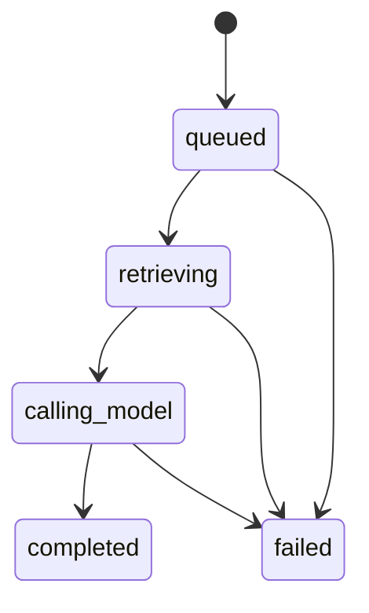
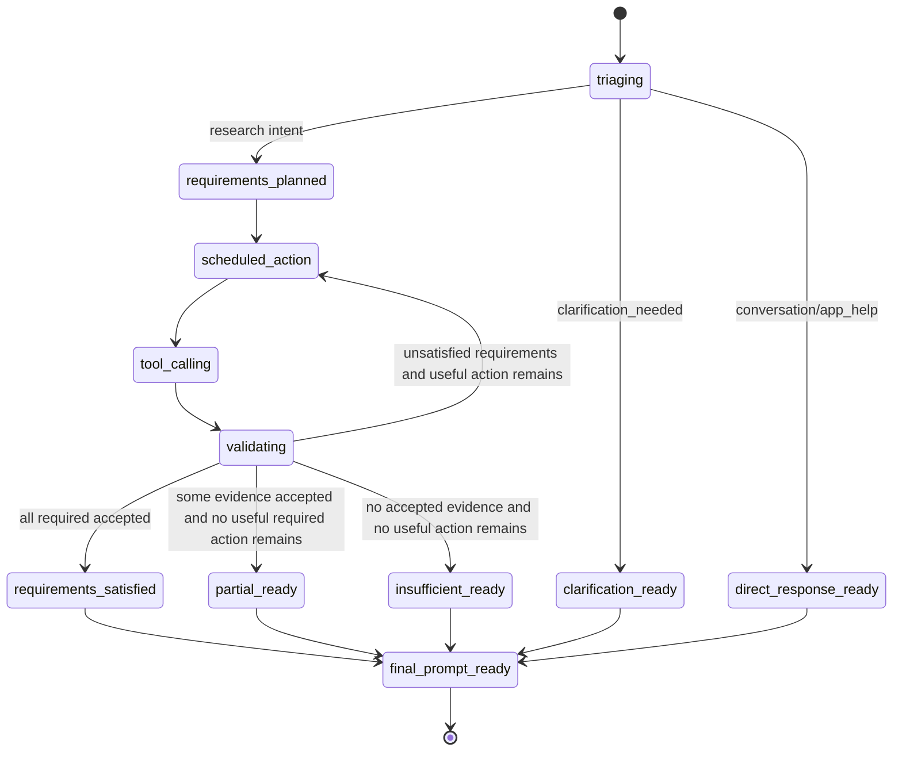
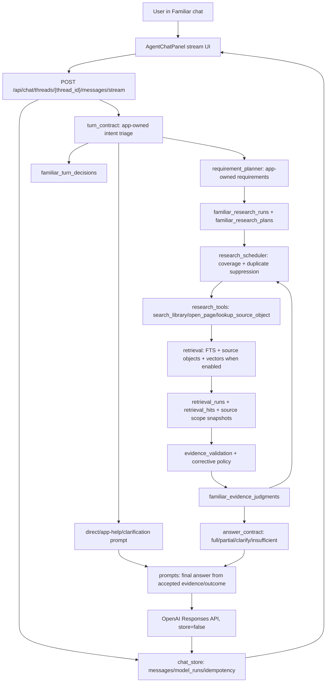

# Familiar Reliability Contract Implementation Plan

> **For agentic workers:** REQUIRED SUB-SKILL: Use superpowers:subagent-driven-development (recommended) or superpowers:executing-plans to implement this plan task-by-task. Steps use checkbox (`- [ ]`) syntax for tracking.

**Goal:** Replace Familiar's brittle provider-led research loop with an app-owned reliability contract that triages non-research turns, plans requirements deterministically, prevents repeated failed tool loops, recovers from over-strict evidence constraints, and returns cited partial answers instead of unnecessary refusals.

**Architecture:** The backend owns the workflow state, intent contract, requirement coverage, evidence acceptance policy, and answer outcome. The model remains a bounded provider for optional strategy suggestions and final prose only; model-generated plan text never becomes hard validation law without app normalization. Existing SQLite research tables remain the source of truth, with one additive decision table for turn-level contract snapshots.

**Tech Stack:** Python 3.12, FastAPI, SQLite, OpenAI Responses API, React/Vite frontend, local PDF/source-object retrieval, SQLite FTS, local vector candidates when enabled, Pytest, Vitest, Playwright.

---

### 1. Source Boundary

This plan is based on:

- Live code on branch `codex/familiar-tool-calling-hybrid-rag` after `git fetch --all --prune`, with `HEAD` at `17562f4 Harden Familiar evidence gate`.
- `docs/plans/Implementation Plan Script.md`.
- `CLAUDE.md`, `AGENTS.md`, and current compiled wiki pages:
  - `wiki/CONTEXT.md`
  - `wiki/INDEX.md`
  - `wiki/topics/ai-rag-system.md`
  - `wiki/topics/target-architecture.md`
  - `wiki/topics/implementation-standards.md`
  - `wiki/topics/testing-posture-and-conventions.md`
  - `wiki/concepts/private-copyright-boundary.md`
  - `wiki/concepts/hybrid-search-for-rules.md`
- Live code in:
  - `wfrp_companion/assistant/chat_service.py`
  - `wfrp_companion/assistant/familiar_agent.py`
  - `wfrp_companion/assistant/context_resolution.py`
  - `wfrp_companion/assistant/conversation_context.py`
  - `wfrp_companion/assistant/agent_planning.py`
  - `wfrp_companion/assistant/evidence_constraints.py`
  - `wfrp_companion/assistant/evidence_validation.py`
  - `wfrp_companion/assistant/prompts.py`
  - `wfrp_companion/assistant/provider.py`
  - `wfrp_companion/assistant/research.py`
  - `wfrp_companion/assistant/research_tools.py`
  - `wfrp_companion/assistant/retrieval.py` and retrieval submodules
  - `wfrp_companion/assistant/chat_store.py`
  - `wfrp_companion/db/migrations.py`
  - `frontend/src/components/chat/AgentChatPanel.tsx`
- Persisted local run evidence from `data/wfrp_companion.sqlite`:
  - Failed hit-location plus armor run: `research-6bc8f01f44854cdeb91bda1ff9cfe1c3`.
  - Failed greeting run: `research-c568c48498f04330a29dfa1ad6eea87f`.
  - Successful earlier hit-location run: `research-fd4a2053b76d46d29963ef66543beda0`.
- Current `/api/retrieval/status` behavior: all 26 enabled books indexed; vector provider disabled in the running process.
- User-requested vector enablement is in scope as operational readiness and verification, but it is not treated as the root-cause fix because the failed hit-location run already found the correct source object through exact/object retrieval.
- Official OpenAI function-calling documentation:
  - https://developers.openai.com/api/docs/guides/function-calling
  - https://developers.openai.com/api/docs/guides/tools
- Research references used as design constraints:
  - Agentic RAG survey: https://arxiv.org/abs/2501.09136
  - SoK Agentic RAG: https://arxiv.org/abs/2603.07379
  - Corrective RAG: https://arxiv.org/abs/2401.15884
  - Self-RAG: https://arxiv.org/abs/2310.11511
  - GaRAGe grounded RAG benchmark: https://arxiv.org/abs/2506.07671
  - CHARM cascading hallucination framework: https://arxiv.org/html/2606.04435v1

Intentionally excluded as architectural input:

- Historical implementation plans in `docs/plans/` except as trace/history, because the user requested current live-code planning and the prompt explicitly excludes stale architectural plans unless comparison is requested.
- Raw WFRP PDF text. This plan must not reproduce or depend on private copyrighted book passages.
- Provider-side conversation state, hosted vector databases, hosted file search over private PDFs, or prompt-only fixes.
- Merging or extending PR #10 as-is. PR #10 demonstrated useful safety hardening but also caused the current false-negative behavior.

### 2. Current Live-Code Diagnosis

#### Problem 1: Non-research turns enter the research pipeline

`chat_service.stream_queued_result()` always transitions queued runs to `retrieving`, builds conversation context, and calls `familiar_agent.run_research()` before any final model answer. `context_resolution.classify_intent()` returns `active_intent or RULES_INTENT` for anything that is not recognized as a statline query. That means `hello` becomes `rules_lookup` with subject `hello`.

Observed result:

- Run `research-c568c48498f04330a29dfa1ad6eea87f`.
- Raw query `hello`.
- Intent `rules_lookup`.
- Four search rounds.
- Final text greeted the user, but only after an unnecessary research run and refusal-style evidence status.

#### Problem 2: The final prompt turns every validation false negative into a refusal

`prompts.SYSTEM_INSTRUCTIONS` correctly says factual WFRP claims must come from accepted retrieved evidence. `build_final_answer_prompt_messages()` then says "No accepted evidence was found" and instructs the model not to reconstruct facts from memory whenever the accepted-evidence list is empty.

That safety boundary is right, but it means the validation layer must be robust. When the validation layer rejects correct evidence, the model has no lawful path to answer.

#### Problem 3: Provider-authored plan fields become hard validation law

`agent_planning.subject_schema()` accepts free-text `canonical`, `include_terms`, `book_title_hints`, `page_hints`, `required_terms`, and `object_type_hints`. `evidence_constraints.constraint_from_requirement()` turns those fields into `EvidenceConstraint`.

The failed hit-location run proves the danger:

- Provider plan required subject `hit location determination in combat`.
- Retrieval found Core Rules printed page 130 table `Hit Location`.
- Validation required multi-word structural subject phrase matching and rejected the table four times as `subject_mismatch`.
- The app never tried the second required requirement, `req_armor_location_rule`.

Provider text should guide retrieval, not define backend law.

#### Problem 4: Recovery is provider-steered and loop-prone

`familiar_agent.run_research()` uses the provider plan's first action, then asks the provider for a recovery tool while required requirements remain unsatisfied. The backend validates the chosen tool and requirement id, but it does not own a scheduler that guarantees coverage of every unsatisfied required requirement or suppresses duplicate failed actions.

The failed hit-location run repeated the same requirement and nearly identical query at steps 2, 3, and 4:

```json
{
  "requirement_id": "req_hit_location_rule",
  "query": "hit location random location roll combat table body location",
  "subject": "hit location determination in combat"
}
```

No backend policy redirected the next round to `req_armor_location_rule`.

#### Problem 5: Partial answers exist internally but final UX still collapses into refusal

`plan_evidence_status()` can return `partial`, and requirement ledgers track accepted and partial hits per requirement. The final prompt, however, only receives accepted hits plus terse requirement status ids. It cannot explain: "I can answer hit location from Core Rules p. 130, but I still lack armor-by-location evidence."

#### Problem 6: Reader context is too influential for unrelated turns

Planning and research prompts inject active book/page hints. Reader context is documented as a routing hint, not evidence, but provider plans can over-anchor on it. In the `hello` run, the provider planned around the active Old World Bestiary context and looked for `hello` in the local library.

#### Problem 7: Diagnostic metadata is too thin for corrective recovery

`tool_output_payload()` exposes accepted hits plus rejected reason counts. It intentionally withholds rejected snippets from prompts and UI, which is correct for privacy. But it also means the recovery model cannot tell whether it found the right object and the validator was too strict. The app needs a backend-owned corrective policy that can inspect local rejected judgments without exposing private text to the model.

#### Problem 8: Product-level golden regression coverage is missing

Existing tests are strong around storage, migrations, retrieval modules, prompt construction, provider tooling, and evidence gate regressions. Missing coverage is the user-level contract:

- `hello` should not research.
- A multi-part rules query should attempt every required part.
- Correct table evidence should not be rejected because the provider added extra wording.
- Partial evidence should produce a partial cited answer.
- Wrong-source evidence should still be rejected.
- Reader context should not bias unrelated requests.

#### Problem 9: Vector readiness is operationally unclear

The current running app reports vector disabled. That does not explain the observed false-negative hit-location failure, because exact/source-object retrieval already returned the right table. It still matters because the intended hybrid retrieval contract says vector is an enabled candidate channel when local embeddings are current. Implementation must verify both:

- vector-enabled/current behavior works and is visible in diagnostics;
- vector-disabled/provider-error behavior fails closed to exact/object/full-text retrieval.

### 3. Architecture Decision

Implement an app-owned Familiar Reliability Contract with five backend-owned layers:

1. **Turn triage:** Classify the user message before research. Outputs one of:
   - `conversation`
   - `app_help`
   - `rules_lookup`
   - `statline_lookup`
   - `source_navigation`
   - `lore_lookup`
   - `scene_prep`
   - `clarification_needed`
2. **Requirement planning:** Build deterministic app-owned requirements from the triage result. Provider planning can be retained as advisory metadata, but it cannot create hard subject constraints without normalization.
3. **Research scheduling:** Choose tool actions deterministically from unsatisfied requirements, prior attempts, page hints, and validation reasons. The provider may suggest refinements, but the scheduler owns coverage, duplicate suppression, and budget allocation.
4. **Corrective evidence policy:** Validate hits with persisted statuses that match the existing evidence judgment table: accepted, partial, rejected. Allow safe corrective recovery when exact table/object/page identity proves the requested topic but provider wording was over-specific.
5. **Answer outcome assembly:** Produce explicit answer outcomes:
   - `direct_response`
   - `full_answer`
   - `partial_answer`
   - `clarifying_question`
   - `insufficient_evidence`
   - `provider_error`

Why this fits the codebase:

- The app already owns SQLite state, source scope, retrieval tools, evidence judgments, and citations.
- Existing tables already record research runs, plans, tool calls, and judgments. The plan can add one focused decision table and avoid a rewrite.
- Official OpenAI docs describe tool calling as a model/application exchange where the application executes tools and may control `tool_choice` and `parallel_tool_calls`; they do not require the model to own orchestration state.
- Recent agentic RAG research frames reliability as a control-policy and trajectory-evaluation problem. That maps directly to an app-owned scheduler plus golden conversation tests.

Approaches to avoid:

- **Prompt-only patch:** Adding "do not repeat searches" to the prompt leaves loop control with the provider.
- **Model-only planner replacement:** Swapping models or asking for better JSON plans keeps the same brittle ownership boundary.
- **Vector-first fix:** Vector retrieval was disabled in the failed runs, but exact/source-object retrieval already found the right evidence. The bug was validation and orchestration.
- **Hosted file search/vector DB over PDFs:** Violates the local-first/private source boundary and duplicates existing SQLite retrieval ownership.
- **Full source-text logging:** Not needed and risky. Diagnostics should store IDs, hashes, titles, statuses, reason codes, and bounded non-copyright metadata.

### 4. Target State Model

The existing `model_runs.status` lifecycle remains:



The Familiar reliability contract adds an app-owned turn/research lifecycle inside `retrieving`:



State ownership:

- `familiar_turn_decisions` stores turn-level triage and answer outcome.
- `familiar_research_runs` remains the research run source of truth.
- `familiar_research_plans` stores the accepted app-owned plan. Provider-authored plans become advisory metadata unless explicitly normalized.
- `familiar_tool_calls` remains the attempt ledger.
- `familiar_evidence_judgments` remains the evidence decision ledger.
- `retrieval_runs` and `retrieval_hits` remain immutable retrieval snapshots.

### 5. Target Architecture Diagram



### 6. Proposed Data Model / Contracts

#### New table: `familiar_turn_decisions`

Add migration `0009_familiar_reliability_contract`, because live code already uses `0008_familiar_research_plans`, with this table:

```sql
create table familiar_turn_decisions (
  id text primary key,
  model_run_id text not null unique references model_runs(id) on delete cascade,
  thread_id text not null references chat_threads(id) on delete cascade,
  user_message_id text not null references chat_messages(id) on delete cascade,
  retry_of_decision_id text references familiar_turn_decisions(id) on delete set null,
  turn_kind text not null,
  answer_mode text not null,
  subject text,
  confidence text not null,
  reasons_json text not null default '[]',
  reader_context_policy text not null,
  answer_outcome text,
  outcome_json text not null default '{}',
  metadata_json text not null default '{}',
  created_at text not null,
  updated_at text not null,
  check(turn_kind in (
    'conversation',
    'app_help',
    'rules_lookup',
    'statline_lookup',
    'source_navigation',
    'lore_lookup',
    'scene_prep',
    'clarification_needed'
  )),
  check(answer_mode in ('direct', 'research', 'clarify')),
  check(confidence in ('high', 'medium', 'low')),
  check(reader_context_policy in (
    'ignore',
    'routing_hint',
    'page_navigation_hint'
  )),
  check(answer_outcome is null or answer_outcome in (
    'direct_response',
    'full_answer',
    'partial_answer',
    'clarifying_question',
    'insufficient_evidence',
    'provider_error'
  ))
);

create index ix_familiar_turn_decisions_thread
on familiar_turn_decisions(thread_id, created_at);

create index ix_familiar_turn_decisions_retry
on familiar_turn_decisions(retry_of_decision_id);
```

This table is live workflow/audit state. It stores no private source text.

#### Contract dataclasses

Create `wfrp_companion/assistant/turn_contract.py`:

```python
from __future__ import annotations

from dataclasses import dataclass
from typing import Literal

TurnKind = Literal[
    "conversation",
    "app_help",
    "rules_lookup",
    "statline_lookup",
    "source_navigation",
    "lore_lookup",
    "scene_prep",
    "clarification_needed",
]

AnswerMode = Literal["direct", "research", "clarify"]
Confidence = Literal["high", "medium", "low"]
ReaderContextPolicy = Literal["ignore", "routing_hint", "page_navigation_hint"]

@dataclass(frozen=True)
class TurnDecision:
    turn_kind: TurnKind
    answer_mode: AnswerMode
    subject: str | None
    confidence: Confidence
    reasons: tuple[str, ...]
    reader_context_policy: ReaderContextPolicy
```

Create `wfrp_companion/assistant/answer_contract.py`:

```python
from __future__ import annotations

from dataclasses import dataclass
from typing import Literal

AnswerOutcomeKind = Literal[
    "direct_response",
    "full_answer",
    "partial_answer",
    "clarifying_question",
    "insufficient_evidence",
    "provider_error",
]

@dataclass(frozen=True)
class RequirementOutcome:
    requirement_id: str
    status: Literal["satisfied", "partial", "unsatisfied"]
    required: bool
    accepted_hit_count: int
    partial_hit_count: int
    missing_summary: str | None

@dataclass(frozen=True)
class AnswerOutcome:
    kind: AnswerOutcomeKind
    evidence_status: Literal["sufficient", "partial", "insufficient", "not_evaluated"]
    requirement_outcomes: tuple[RequirementOutcome, ...]
    user_message: str | None = None
```

Create `wfrp_companion/assistant/requirement_contract.py`:

```python
from __future__ import annotations

from dataclasses import dataclass
from typing import Literal

RequirementKind = Literal[
    "rules_topic",
    "statline",
    "page_reference",
    "source_object",
    "supporting_context",
]

@dataclass(frozen=True)
class RequirementSpec:
    id: str
    kind: RequirementKind
    query: str
    subject_terms: tuple[str, ...]
    optional_terms: tuple[str, ...]
    object_type_hints: tuple[str, ...]
    book_hints: tuple[str, ...]
    page_hints: tuple[str, ...]
    required: bool = True
    min_accepted_hits: int = 1
```

#### Immutable snapshot vs live state

- Immutable snapshot:
  - `retrieval_runs`
  - `retrieval_hits`
  - `retrieval_run_source_books`
  - persisted `familiar_evidence_judgments`
- Live workflow state:
  - `model_runs.status`
  - `familiar_research_runs.status`
  - `familiar_turn_decisions.answer_outcome`
  - `familiar_turn_decisions.retry_of_decision_id` for retry lineage
- Explicit target/linkage state:
  - `familiar_research_plans.requirements_json`
  - `familiar_tool_calls.requirement_id`
  - `familiar_evidence_judgments.requirement_id`

#### Constraint ownership rule

Provider-authored fields are advisory unless normalized by app code:

- App-generated `RequirementSpec.subject_terms` can become hard subject constraints.
- Provider-generated `canonical` phrases cannot become hard constraints unless they match app-recognized subject tokens or exact source-object identity.
- `required_terms` must be supporting terms, not duplicated subject prose.
- Object type hints must be normalized to known object types or ignored:
  - `rule_section`
  - `table`
  - `table_row`
  - `stat_block`
  - `monster_profile`
  - `npc_profile`
  - `glossary_entry`
  - `index_entry`
  - `page_fallback`

### 7. External Integration Design

#### OpenAI Responses API

Source of truth boundary:

- OpenAI is the prose/model provider.
- The local backend owns:
  - source scope
  - intent decision
  - research requirements
  - tool execution
  - evidence validation
  - answer outcome
  - citations
  - persistent state

Reads/writes:

- The backend sends bounded prompt messages and strict function tool schemas.
- The backend receives streamed text deltas or function-call arguments.
- The backend never stores provider-side conversation state. Preserve `store=False`.
- Do not use `previous_response_id` for Familiar workflow memory.
- `chat_service.stream_queued_result()` must classify deterministic direct/clarify turns before constructing `provider_factory(config)`. A greeting or app-help turn must not fail merely because OpenAI is unavailable.

Idempotency:

- Continue using `model_runs.idempotency_key` for message acceptance.
- Continue sending `X-Client-Request-Id` from `provider.OpenAIProvider`.

Tool strategy:

- Keep `parallel_tool_calls=False` whenever the app is accepting provider tool calls. Official docs state this prevents more than one function call in a turn.
- Keep `tool_choice={"type": "function", "name": "set_research_plan"}` only if provider planning remains as advisory metadata. Forced tool choice should not be used for non-research turns.
- Keep `tool_choice="none"` for final prose responses.
- Keep strict function schemas compatible with OpenAI strict mode: every property listed in `required`, `additionalProperties: false`, nullable fields represented with `["string", "null"]` or equivalent.

Retry behavior:

- Provider unavailable before final answer:
  - If direct local response is possible, complete locally without OpenAI only for fixed app-help/greeting templates.
  - If model prose is required, fail `model_runs` with `provider_unavailable`.
- Provider unavailable during advisory planning:
  - Fall back to app-owned deterministic requirements.
  - Do not fail a researchable turn solely because advisory planning is unavailable.
- Provider unavailable during final prose:
  - Preserve research run and accepted evidence.
  - Mark `model_runs` failed and retryable.
- Provider construction timing:
  - Construct the provider only when a model call is actually needed.
  - Deterministic direct/clarify turns need no provider.
  - Deterministic planning, scheduling, tool execution, and evidence validation for researchable turns should run before final prose provider construction.

What should happen if OpenAI is down:

- Research tools must not be run if the turn is direct conversation.
- Deterministic direct/clarify turns must complete locally without constructing a provider.
- Researchable turns can complete deterministic retrieval state, but final prose may fail retryably if provider prose is required.
- No external state needs reconciliation because `store=False`.

#### Local vector provider

Source of truth boundary:

- Local SQLite tables own vector readiness:
  - `source_object_embeddings`
  - `book_retrieval_status.vector_status`
  - provider/model/dimension fields on both tables
- The embedding provider only creates local vectors through app tooling. It is not a source of truth for source scope or evidence acceptance.

Operational decision:

- This phase should enable and verify the local semantic profile in development when the machine has the model available:

```bash
conda activate wfrp-companion
WFRP_EMBEDDING_PROVIDER=sentence-transformers \
WFRP_EMBEDDING_MODEL=BAAI/bge-m3 \
WFRP_EMBEDDING_DIMENSIONS=1024 \
python tools/rebuild_embeddings.py --force
```

- Start the app with the same `WFRP_EMBEDDING_*` environment values and verify `/api/retrieval/status` reports current vectorized enabled books.
- Query-time vector failures must fail closed to non-vector channels.
- Vector candidates remain candidate evidence only; they cannot bypass evidence validation or citation requirements.

### 8. Core Flow Design

#### Flow A: Direct conversation turn

1. `chat_service.stream_chat_message()` creates queued turn through `chat_store.create_queued_turn()`.
2. `stream_queued_result()` builds conversation context.
3. `turn_contract.classify_turn()` runs before provider construction and returns:

```python
TurnDecision(
    turn_kind="conversation",
    answer_mode="direct",
    subject=None,
    confidence="high",
    reasons=("greeting_or_social_text",),
    reader_context_policy="ignore",
)
```

4. `chat_store.record_familiar_turn_decision()` inserts the decision.
5. The backend skips both `provider_factory(config)` and `familiar_agent.run_research()` for deterministic direct/clarify turns.
6. The backend builds a direct prompt or fixed response:
   - Greeting: "Hello. What would you like to look up or prep?"
   - Thanks/acknowledgment: short non-research response.
7. Complete `model_runs` without research events, or emit a compact `turn_decision` event.

Transaction boundary:

- Decision insert and model run transition use existing short SQLite writes.
- No retrieval rows are created.

#### Flow B: Researchable turn

1. Triage returns `answer_mode="research"`.
2. Insert `familiar_turn_decisions`.
3. Create `familiar_research_runs`.
4. Build deterministic requirements in `requirement_planner.plan_requirements()`.
5. Persist accepted app plan to `familiar_research_plans`.
6. Enter `research_scheduler.next_action()` loop.
7. Execute action through existing `execute_tool_and_validate()`.
8. Record tool call, retrieval run, and evidence judgments.
9. Repeat until:
   - all required requirements are satisfied;
   - no non-duplicate useful action remains;
   - max rounds is reached.
10. Assemble `AnswerOutcome`.
11. Build final prompt from accepted evidence plus outcome metadata.
12. Construct the final prose provider only after deterministic research is complete. If provider construction fails here, preserve the research rows and mark the model run retryable.

Guarded transition example:

```sql
update familiar_research_runs
set status = 'tool_calling',
    tool_rounds_used = :step_number,
    updated_at = :now
where id = :research_run_id
  and status in ('planning', 'validating');
```

#### Flow C: Multi-part rules question

Example: `what are the rules on hit location and armor per location in combat`.

Deterministic requirements:

```python
(
    RequirementSpec(
        id="hit_location_rule",
        kind="rules_topic",
        query="hit location combat table body location",
        subject_terms=("hit", "location"),
        optional_terms=("combat", "attack", "table", "body"),
        object_type_hints=("table", "rule_section"),
        book_hints=("core rules",),
        page_hints=(),
        required=True,
    ),
    RequirementSpec(
        id="armor_location_rule",
        kind="rules_topic",
        query="armor armour points location body location combat",
        subject_terms=("armor", "location"),
        optional_terms=("armour", "points", "body", "combat"),
        object_type_hints=("rule_section", "table"),
        book_hints=("core rules",),
        page_hints=(),
        required=True,
    ),
)
```

Scheduler policy:

- Try `hit_location_rule` once.
- If accepted, move to `armor_location_rule`.
- If rejected with `subject_mismatch` but hit identity contains exact essential subject tokens, run corrective validation or `lookup_source_object`.
- Never spend all rounds on one unsatisfied required requirement while another required requirement has zero attempts.

#### Flow D: Corrective validation

When a hit is rejected with `subject_mismatch`:

1. Inspect local hit metadata, not private source text:
   - `object_title`
   - `object_type`
   - `heading_path`
   - `page_label` / `page_range_label`
   - `rank_reasons`
   - requirement essential subject terms
2. If all essential subject terms are present in identity text and supporting/object-type hints match, convert to `accepted` or persisted `partial` depending on requirement type and body certainty.
3. Record reason code:
   - `accepted_identity_subject_match`
   - `partial_identity_match_body_uncertain`
   - `rejected_subject_mismatch`
4. Do not expose rejected snippets to UI.

This fixes "hit location determination in combat" rejecting `Hit Location` without weakening wrong-entity protections such as `Black Knight` vs `Black Orc`.

#### Flow E: Partial answer

If at least one required requirement is satisfied and at least one remains unsatisfied:

1. `AnswerOutcome.kind = "partial_answer"`.
2. Final prompt receives:
   - accepted evidence for satisfied requirements;
   - requirement status with human-readable missing summaries;
   - instruction to answer only the satisfied parts and name missing parts.
3. UI shows citations for accepted evidence only.
4. The public trace says `Evidence partial; N accepted; M unsatisfied`.

#### Flow F: Retry

Retry behavior must preserve:

- Original user message.
- Original source scope snapshot semantics.
- Turn decision can be recomputed only if no completed decision exists for the retry target.
- If a completed `familiar_turn_decisions` row exists for the original model run, copy only immutable triage fields to the retry row:
  - `turn_kind`
  - `answer_mode`
  - `subject`
  - `confidence`
  - `reasons_json`
  - `reader_context_policy`
- Set `retry_of_decision_id` to the original decision id.
- Reset mutable outcome fields on the retry row:
  - `answer_outcome = null`
  - `outcome_json = '{}'`
- Store retry metadata such as `{"retry_of_model_run_id": "<id>"}` in `metadata_json`.
- Research runs for retries remain separate rows, as today.

### 9. UX / Surface Behavior

State-to-surface rules:

| Backend outcome | User-facing behavior | Citations |
|---|---|---|
| `direct_response` | Natural short response; no evidence panel needed | none |
| `clarifying_question` | One direct question; no blame on user | none |
| `full_answer` | Cited answer | accepted only |
| `partial_answer` | Cited answer for found parts plus concise missing-parts note | accepted only |
| `insufficient_evidence` | Honest insufficiency with concrete missing requirements | none or accepted partial if any |
| `provider_error` | Retryable error banner | preserve prior citations if existing completed run |

Research trace behavior:

- Keep current expandable trace.
- Add a compact first event: `Turn classified: rules lookup` or `Turn classified: conversation`.
- For non-research turns, do not show "Evidence insufficient".
- For repeated rejected evidence, show aggregate reason counts only.
- For partial answers, show requirement status table:
  - satisfied
  - partial
  - unsatisfied

Do not expose:

- Raw rejected source text.
- Provider hidden reasoning.
- Local file paths or PDF filenames.
- Full prompt contents in the UI.

### 10. Implementation Sequence

#### Phase 1: Prompt/run diagnostics, vector readiness, and golden regression harness

Scope:

- Add tests and diagnostics before behavior changes.
- Verify the user-requested vector channel is enabled/current in development or explicitly record why it is unavailable.
- No production behavior change except optional debug helpers and local vector operational setup.

Files:

- Create: `wfrp_companion/assistant/prompt_diagnostics.py`
- Create: `tests/assistant/test_familiar_golden_contract.py`
- Modify: `tests/assistant/test_prompts.py`
- Modify: `tests/assistant/test_familiar_agent.py`
- Modify: `tests/assistant/test_retrieval.py`
- Modify: `tests/assistant/test_research_tools.py`

Steps:

- [ ] Add synthetic provider fixtures that simulate:
  - direct conversation;
  - provider over-specific subject;
  - repeated recovery action;
  - partial multi-requirement evidence.
- [ ] Add failing test `test_hello_does_not_create_research_run`.
- [ ] Add failing test `test_hello_does_not_instantiate_provider`.
- [ ] Add failing test `test_provider_unavailable_greeting_completes_locally`.

```python
def test_hello_does_not_create_research_run(tmp_path):
    config = make_config(tmp_path)
    provider_instance = DirectFinalProvider(answer="Hello. What would you like to look up?")
    thread = chat_service.chat_store.create_thread(config)

    events = tuple(chat_service.stream_chat_message(
        config,
        thread_id=thread.id,
        content="hello",
        idempotency_key="hello-no-research",
        provider_factory=lambda _: provider_instance,
    ))

    assert events[-1].assistant_message is not None
    assert "Hello" in events[-1].assistant_message.content
    with initialize_database(config.db_path) as connection:
        rows = connection.execute("select count(*) from familiar_research_runs").fetchone()
    assert rows[0] == 0
```

- [ ] Add failing test `test_multi_part_rules_query_attempts_each_required_requirement`.
- [ ] Add failing test `test_correct_hit_location_table_is_not_rejected_by_over_specific_provider_subject`.
- [ ] Add failing test `test_partial_answer_uses_accepted_evidence_and_names_missing_requirement`.
- [ ] Add failing test `test_ambiguous_or_frustration_message_does_not_enter_research`.
- [ ] Add vector tests for:
  - enabled/current embeddings -> `search_library` diagnostics include `vector_status="ran"` or the current repo equivalent;
  - disabled provider -> lexical/object retrieval still runs and diagnostics include `vector_status="disabled"`;
  - provider error/stale embeddings -> vector fails closed without failing the user turn.
- [ ] Add `prompt_diagnostics.prompt_surface_summary(messages)` returning only role, char count, hashes, and redacted first-line labels.
- [ ] Rebuild local embeddings if status is disabled/stale:

```bash
conda activate wfrp-companion
WFRP_EMBEDDING_PROVIDER=sentence-transformers \
WFRP_EMBEDDING_MODEL=BAAI/bge-m3 \
WFRP_EMBEDDING_DIMENSIONS=1024 \
python tools/rebuild_embeddings.py --force
```

- [ ] Start the API with matching `WFRP_EMBEDDING_*` values and verify:

```bash
curl -s http://127.0.0.1:8000/api/retrieval/status | python -m json.tool
```

- [ ] Run focused tests and confirm expected failures:

```bash
conda activate wfrp-companion
python -m pytest tests/assistant/test_familiar_golden_contract.py -v
```

Expected: failures proving current behavior.

#### Phase 2: App-owned turn triage

Scope:

- Classify user turns before research.
- Skip research for conversation/app-help/clarification turns.

Files:

- Create: `wfrp_companion/assistant/turn_contract.py`
- Modify: `wfrp_companion/assistant/chat_service.py`
- Modify: `wfrp_companion/assistant/chat_store.py`
- Modify: `wfrp_companion/assistant/research.py`
- Modify: `wfrp_companion/db/migrations.py`
- Test: `tests/assistant/test_turn_contract.py`
- Test: `tests/assistant/test_chat_service.py`
- Test: `tests/db/test_migrations.py`

Steps:

- [ ] Add migration `0009_familiar_reliability_contract`.
- [ ] Add dataclasses and deterministic classifier in `turn_contract.py`.
- [ ] Use these deterministic rules:
  - Empty/whitespace: `clarification_needed`, `answer_mode="clarify"`.
  - Greeting-only (`hello`, `hi`, `hey`, `good morning`, `good evening`): `conversation`, `answer_mode="direct"`.
  - Thanks/acknowledgment-only: `conversation`, `answer_mode="direct"`.
  - App questions containing `what can you do`, `help`, `how do i use`: `app_help`, `answer_mode="direct"`.
  - Page-only references (`same page`, `page 130`) with active context: `source_navigation`, `answer_mode="research"`, `reader_context_policy="page_navigation_hint"`.
  - Statline terms: `statline_lookup`.
  - Rules terms (`rule`, `rules`, `combat`, `damage`, `armor`, `armour`, `talent`, `spell`, `career`, `skill`, `test`): `rules_lookup`.
  - Lore lookup only when the turn has explicit WFRP/source-domain signals: enabled book/source title matches, known accepted-context subject references, or phrases like `lore`, `background`, `about`, `who is`, or `what is` attached to a non-generic WFRP entity/topic.
  - Ambiguous meta/frustration/social text such as `this is broken`, `why are you doing that`, `no`, or generic one-word nouns without a known source/context match: `clarification_needed`, not lore/rules research.
  - Otherwise low-confidence `clarification_needed`.
- [ ] Add `chat_store.record_familiar_turn_decision()` and `chat_store.update_familiar_turn_decision_outcome()`.
- [ ] In `chat_service.stream_queued_result()`, call triage before `provider_factory(config)` and before `familiar_agent.run_research()`.
- [ ] For `answer_mode="direct"`, build a final prompt with no tools or return a deterministic response for greetings/app help.
- [ ] Preserve provider unavailability behavior for non-deterministic direct prose.
- [ ] For researchable turns, do not construct the final prose provider until deterministic requirement planning, scheduling, retrieval, and validation have completed.
- [ ] If the provider is unavailable after research, preserve the research rows and fail the model run retryably.
- [ ] Update tests so `hello` creates `familiar_turn_decisions` but no `familiar_research_runs`.

#### Phase 3: App-owned requirement planner

Scope:

- Generate normalized requirements from turn decisions.
- Keep provider plan as optional advisory metadata only.

Files:

- Create: `wfrp_companion/assistant/requirement_contract.py`
- Create: `wfrp_companion/assistant/requirement_planner.py`
- Modify: `wfrp_companion/assistant/agent_planning.py`
- Modify: `wfrp_companion/assistant/familiar_agent.py`
- Test: `tests/assistant/test_requirement_planner.py`
- Test: `tests/assistant/test_familiar_agent.py`

Steps:

- [ ] Add `RequirementSpec` and conversion helper `to_evidence_requirement(spec)`.
- [ ] Add deterministic planner cases:
  - Statline lookup: one `statline` requirement.
  - Source navigation/page reference: one `page_reference` requirement.
  - Rules lookup with `and`, comma-separated, or known paired terms: split into requirements.
  - `hit location` plus `armor/armour location`: produce two required requirements.
- [ ] Normalize subject terms so structural filler does not become hard identity:

```python
def essential_subject_terms(text: str) -> tuple[str, ...]:
    tokens = meaningful_tokens(text)
    return tuple(
        token for token in tokens
        if token not in {"rule", "rules", "combat", "determination", "table", "section"}
    )
```

- [ ] Persist app-owned plan in `familiar_research_plans` with `provider_call_id=None` and `status="accepted"`.
- [ ] If provider planning is retained, store its output in `familiar_research_runs.metadata_json["provider_plan_advisory"]` after redaction and bounds checking, not as the accepted plan.
- [ ] Update parser tests so free-text provider `canonical` cannot bypass app normalization.

#### Phase 4: Deterministic scheduler and duplicate suppression

Scope:

- Replace provider-steered recovery loop with app-owned `research_scheduler`.
- Provider recovery tool calls become optional suggestions only.

Files:

- Create: `wfrp_companion/assistant/research_scheduler.py`
- Modify: `wfrp_companion/assistant/familiar_agent.py`
- Modify: `wfrp_companion/assistant/research.py`
- Test: `tests/assistant/test_research_scheduler.py`
- Test: `tests/assistant/test_familiar_agent.py`

Steps:

- [ ] Add scheduler dataclasses:

```python
@dataclass(frozen=True)
class ScheduledAction:
    requirement_id: str
    tool_name: Literal["search_library", "open_page", "lookup_source_object", "finish_research"]
    arguments: dict[str, object]
    reason: str
```

- [ ] Add `attempt_signature(tool_name, arguments)` using existing normalized JSON hashing.
- [ ] Add policy:
  - Prioritize required unsatisfied requirements with zero attempts.
  - Then required partial requirements.
  - Then optional requirements only if budget remains.
  - Reject exact duplicate action signatures for the same requirement.
  - If the same requirement receives two `subject_mismatch` rejections on the same evidence key, trigger corrective action instead of repeating search.
- [ ] Replace the `while` loop provider recovery call with:

```python
while not plan_requirements_satisfied(...) and tool_rounds_used < MAX_TOOL_ROUNDS:
    scheduled = research_scheduler.next_action(...)
    if scheduled is None:
        break
    outcome = execute_tool_and_validate(... scheduled ...)
```

- [ ] Keep `request_recovery_tool()` only behind a feature flag or remove it if tests prove no provider recovery path is needed.
- [ ] Add tests proving hit-location plus armor tries both requirements within two rounds.

#### Phase 5: Corrective evidence validation

Scope:

- Fix false negatives without reopening wrong-entity false positives.

Files:

- Create: `wfrp_companion/assistant/evidence_policy.py`
- Modify: `wfrp_companion/assistant/evidence_constraints.py`
- Modify: `wfrp_companion/assistant/evidence_validation.py`
- Test: `tests/assistant/test_evidence_policy.py`
- Test: `tests/assistant/test_evidence_validation.py`
- Test: `tests/assistant/test_familiar_evidence_gate_regressions.py`

Steps:

- [ ] Add identity-token corrective helper:

```python
def identity_satisfies_essential_terms(
    identity_text: str,
    essential_terms: tuple[str, ...],
) -> bool:
    identity_tokens = set(evidence_constraints.normalized_tokens(identity_text))
    return bool(essential_terms) and all(term in identity_tokens for term in essential_terms)
```

- [ ] Add internal `EvidenceDecision` with `accepted`, `partial`, `rejected`, matching the existing persisted `familiar_evidence_judgments.status` constraint.
- [ ] For structural requirements, allow identity-term match when:
  - all app-owned essential terms match source-object identity text;
  - object type matches a known allowed type or no object type hint is required;
  - excluded terms do not match;
  - book/page hints, when present, match.
- [ ] Do not allow provider-only extra terms such as `determination` or `combat` to be required identity terms unless the app planner marked them essential.
- [ ] Preserve existing false-positive regressions:
  - generic career profile for named creature rejected;
  - race profile for named NPC rejected;
  - vector-similar wrong entity rejected;
  - `Black Knight` does not satisfy `Black Orc`;
  - wrong book/page rejected.
- [ ] Add regression for `Hit Location` table satisfying `hit location` even when advisory provider phrase says `hit location determination in combat`.

#### Phase 6: Answer outcome and final prompts

Scope:

- Make full, partial, clarification, direct, and insufficiency outcomes explicit.

Files:

- Create: `wfrp_companion/assistant/answer_contract.py`
- Modify: `wfrp_companion/assistant/prompts.py`
- Modify: `wfrp_companion/assistant/familiar_agent.py`
- Modify: `wfrp_companion/assistant/chat_service.py`
- Test: `tests/assistant/test_answer_contract.py`
- Test: `tests/assistant/test_prompts.py`
- Test: `tests/assistant/test_familiar_agent.py`

Steps:

- [ ] Add `build_answer_outcome(plan, accepted_by_requirement, partial_by_requirement)`.
- [ ] Use outcome rules:
  - all required satisfied -> `full_answer`;
  - any required satisfied and any required unsatisfied -> `partial_answer`;
  - no accepted evidence and low-confidence turn -> `clarifying_question`;
  - no accepted evidence after useful actions exhausted -> `insufficient_evidence`.
- [ ] Update final prompt content:

```text
Answer outcome: partial_answer
Answer the satisfied requirements from accepted evidence.
Do not answer unsatisfied requirements.
Briefly name missing requirements without blaming the user.
```

- [ ] Include human-readable missing summaries:
  - `Need accepted evidence for armor by body location.`
  - `Need accepted stat/profile fields for Orc.`
- [ ] Ensure no final prompt includes rejected snippets.
- [ ] Update tests so partial answer prompts include accepted evidence and unsatisfied requirement names.

#### Phase 7: Frontend trace polish

Scope:

- Surface the new contract cleanly without exposing private text.

Files:

- Modify: `frontend/src/components/chat/AgentChatPanel.tsx`
- Modify: frontend chat tests near `AgentChatPanel.test.tsx`
- Modify: API route/read-model tests if event payloads change

Steps:

- [ ] Add stream event handling for `turn_decision`.
- [ ] Display:
  - `Conversation turn` for direct response.
  - `Rules lookup; 2 requirements` for research.
  - `Evidence partial; 1 accepted; 1 missing` for partial.
- [ ] Do not render "Evidence insufficient" for direct conversation turns.
- [ ] Keep citation buttons unchanged and accepted-only.
- [ ] Run:

```bash
cd frontend
npm run test
npm run build
```

#### Phase 8: Wiki, docs, and full verification

Scope:

- Update durable project knowledge after implementation.

Files:

- Modify: `wiki/topics/ai-rag-system.md`
- Modify: `wiki/topics/testing-posture-and-conventions.md`
- Modify: `wiki/log.md`
- Optional modify: `docs/adr/0003-local-semantic-embeddings.md` only if vector defaults change, which this plan does not require.

Steps:

- [ ] Document the Familiar Reliability Contract.
- [ ] Document that provider plans are advisory unless normalized by the app.
- [ ] Document golden conversation regressions.
- [ ] Run focused backend tests:

```bash
conda activate wfrp-companion
python -m pytest \
  tests/assistant/test_turn_contract.py \
  tests/assistant/test_requirement_planner.py \
  tests/assistant/test_research_scheduler.py \
  tests/assistant/test_evidence_policy.py \
  tests/assistant/test_answer_contract.py \
  tests/assistant/test_familiar_golden_contract.py \
  tests/assistant/test_familiar_agent.py \
  tests/assistant/test_evidence_validation.py \
  tests/assistant/test_prompts.py \
  tests/db/test_migrations.py
```

- [ ] Run full coverage gate:

```bash
conda activate wfrp-companion
python -m pytest --cov=wfrp_companion --cov=tools.init_db --cov=tools.import_pdfs --cov=tools.import_page_text --cov=tools.rebuild_fts --cov=tools.rebuild_source_object_fts --cov=tools.rebuild_source_maps --cov=tools.rebuild_embeddings --cov=tools.rebuild_retrieval_assets --cov=tools.backfill_page_labels --cov=tools.search_text --cov=tools.source_sets --cov=tools.serve_api --cov=tools.dev --cov=tools.migrate_db --cov=tools.extract_source_objects --cov-report=term-missing --cov-fail-under=100
```

- [ ] Run frontend verification if UI changed:

```bash
cd frontend
npm run test
npm run test:coverage
npm run build
npm run test:e2e
```

### 11. Testing Requirements

Backend tests:

- Turn triage:
  - greeting skips research;
  - greeting/app-help do not instantiate the provider;
  - provider unavailable plus deterministic greeting still completes locally;
  - thanks skips research;
  - app help skips research;
  - empty message asks clarification;
  - ambiguous meta/frustration input asks clarification rather than researching;
  - statline query researches;
  - rules query researches;
  - reader context ignored for unrelated greeting.
- Requirement planner:
  - multi-part hit-location plus armor creates two required requirements;
  - statline follow-up uses active subject only for statline follow-ups;
  - provider extra words do not become essential subject terms.
- Scheduler:
  - tries every required requirement before repeating one;
  - suppresses duplicate argument hashes;
  - uses `open_page` for page reference;
  - triggers corrective validation after repeated subject mismatch.
- Evidence policy:
  - accepts exact `Hit Location` table for hit-location rule requirement;
  - rejects wrong entity, wrong book, wrong page, unchecked book;
  - preserves statline field sufficiency.
- Answer contract:
  - full answer when all required satisfied;
  - partial answer when some required satisfied;
  - insufficiency when no accepted evidence;
  - clarifying question for low-confidence ambiguous input.
- Prompt construction:
  - direct prompt does not include research status;
  - partial prompt includes accepted evidence and missing summaries;
  - rejected snippets are absent;
  - chat history remains non-evidence.
- Provider:
  - final calls use `tool_choice="none"`;
  - strict tool schemas remain valid;
  - `store=False` remains set;
  - advisory planning failure falls back to deterministic app planning.
- Stream/API read models:
  - `turn_decision` stream events contain only public metadata;
  - reloaded threads reconstruct direct, partial, and insufficient traces without private text;
  - retry rows expose the retry lineage field without breaking historical runs.
- Vector:
  - enabled/current vectors participate in hybrid retrieval diagnostics;
  - disabled/stale/provider-error vectors fail closed to non-vector channels;
  - vector candidates never bypass evidence validation.

Frontend tests:

- Direct conversation turn does not show evidence-insufficient accordion.
- Partial research turn shows partial evidence status and accepted citations.
- Citation buttons still open Grimoire pages.
- Reloaded thread reconstructs the public trace without private text.

Migration tests:

- Fresh DB has `familiar_turn_decisions`.
- Existing DB migrates without losing `familiar_research_runs`.
- Decision table constraints reject invalid enum values.
- Retry rows can link back through metadata without FK breakage.

### 12. Verification Matrix

| Scenario | Expected result |
|---|---|
| `hello` | Direct greeting, no `familiar_research_runs`, no evidence-insufficient UI |
| `thanks` | Direct acknowledgment, no retrieval |
| `what can you do` | App-help answer, no retrieval |
| `orc` | Low-confidence clarification or lore lookup depending classifier rules; must not produce unrelated statline refusal |
| `give me stats` after accepted Orc context | Uses active subject, retrieves Orc statline, cites accepted evidence |
| `give me stats` without active subject | Clarifying question asking what creature/NPC |
| `tell me the rules for hit location` | Retrieves and accepts hit-location table/rule evidence |
| `what are the rules on hit location and armor per location in combat` | Attempts hit-location and armor requirements; returns full or partial cited answer, not total refusal when one part is found |
| Provider canonical says `hit location determination in combat` | App normalizes essential terms to `hit location`; correct table can be accepted |
| Wrong book has lexical match | Rejected by checked scope/book hints |
| `Black Orc stats` with Black Knight vector hit | Rejected subject mismatch |
| Active reader on Old World Bestiary, user says `hello` | Reader context ignored |
| Ambiguous frustration/meta turn | Clarifying response, no research run |
| Deterministic greeting while OpenAI unavailable | Local direct response, completed model run |
| Vector enabled and embeddings current | Hybrid retrieval diagnostics show vector participation |
| Vector disabled | Exact/source-object retrieval still works; trace says vector disabled |
| Vector provider error or stale embeddings | Vector fails closed; non-vector channels continue |
| OpenAI unavailable during advisory planning | Deterministic research still proceeds |
| OpenAI unavailable during final prose | Run fails retryably without losing research rows |

### 13. Migration / Compatibility / Cleanup Strategy

Temporary compatibility:

- Keep existing `familiar_research_plans.requirements_json` shape.
- Existing provider-authored plans remain readable historical data.
- New runs should mark app-owned plans with `provider_call_id = null` and metadata such as:

```json
{
  "plan_owner": "app",
  "contract_version": "familiar-reliability-v1"
}
```

- If provider advisory plans are retained, store them under bounded metadata:

```json
{
  "provider_plan_advisory": {
    "provider_call_id": "call-plan",
    "intent": "rules_lookup",
    "requirement_count": 3
  }
}
```

Cleanup later:

- Remove `request_recovery_tool()` only after scheduler tests and live QA prove it is unused.
- Remove provider-authored accepted plan path after one release/phase with no regressions.
- Do not delete historical columns or tables; they are audit history.

Backfill:

- No backfill is required for `familiar_turn_decisions`; old runs can lack rows.
- Read models must tolerate missing decision rows.
- A future offline diagnostic may infer decisions for old runs, but this phase should not mutate old run history.

Safe cases:

- Existing completed runs remain displayed from stored messages/citations.
- Existing research traces still load from `familiar_research_runs` and events.

Ambiguous cases:

- Historical failed runs with no accepted evidence should not be rewritten.
- Historical provider plans should not be reclassified as app-owned.

### 14. Operational Rollout Notes

- Apply DB migration before starting the updated API.
- No external service migration required.
- Vector rebuild is required when `/api/retrieval/status` reports disabled/stale/missing embeddings for the intended local semantic profile.
- No source-object rebuild required.
- The running app may show vector disabled; this plan must still work with non-vector retrieval.
- Feature flag recommendation:

```text
WFRP_FAMILIAR_CONTRACT_VERSION=v1
```

If unset, default to `v1` after tests pass. Use only for rollback during development; do not keep multiple long-term behavior branches.

Rollback:

- If triage misclassifies too aggressively, temporarily route low-confidence turns to clarification rather than research.
- If corrective validation is too permissive, disable the corrective acceptance path while keeping scheduler and partial-answer behavior.
- If frontend trace changes regress, backend can continue emitting existing events plus new metadata ignored by older frontend code.

### 15. ADR / Platform Alignment

Alignment:

- Preserves local-first storage and private PDF boundary from `CLAUDE.md` and `wiki/concepts/private-copyright-boundary.md`.
- Preserves hybrid retrieval as candidate generation, not final truth, from `wiki/concepts/hybrid-search-for-rules.md`.
- Preserves accepted-evidence-only final citation policy.
- Uses SQLite explicit state rather than framework-heavy orchestration.
- Keeps OpenAI provider stateless with `store=False`, matching current provider tests and privacy posture.

Tensions:

- PR #10 tightened validation to prevent false positives. This plan keeps the safety goal but moves from provider phrase matching to app-owned essential-term matching.
- Excluding rejected snippets from prompts protects copyright/privacy but reduces model recovery ability. This plan resolves that tension by moving corrective recovery into backend code that can inspect local metadata without exposing text.
- The model can still write final prose. The backend must keep final prompt inputs constrained so prose cannot cite nonexistent evidence.

### 16. Non-Goals / Guardrails / Open Questions

Non-goals:

- No hosted vector database.
- No hosted file search over private PDFs.
- No public text export.
- No broad re-OCR or table extraction rewrite.
- No wholesale frontend redesign.
- No attempt to read or summarize every WFRP book into prompts.
- No provider-side conversation memory.
- No model-only prompt patch as the primary fix.
- No weakening wrong-entity validation to make one screenshot pass.

Guardrails:

- Every factual WFRP claim still needs accepted evidence.
- Partial answers must not answer unsatisfied requirements.
- Rejected evidence remains out of UI citations and final prompt evidence.
- Corrective validation must operate on bounded metadata and accepted local evidence zones, not on hidden model reasoning.
- Every behavioral change needs a golden regression test in the same PR.

Open questions:

- Should direct greetings be deterministic local strings or model-generated with `tool_choice="none"`? Recommended first slice: deterministic local strings for greetings and app help to avoid provider dependency.
- Should provider advisory planning remain in v1? Recommended first slice: skip provider planning entirely for app-owned plans, retain final prose only. Reintroduce advisory planning later only if deterministic planner lacks coverage.
- Should `familiar_turn_decisions` be exposed through the thread-detail API? Recommended first slice: expose only stream/reload metadata needed by the current UI trace.

### 17. PR-Ready Task Checklist

#### Task 1: Add failing golden tests

**Files:**

- Create: `tests/assistant/test_familiar_golden_contract.py`

- [ ] Write `test_hello_does_not_create_research_run`.
- [ ] Write `test_hello_does_not_instantiate_provider`.
- [ ] Write `test_provider_unavailable_greeting_completes_locally`.
- [ ] Write `test_ambiguous_or_frustration_message_does_not_enter_research`.
- [ ] Write `test_multi_part_rules_query_attempts_each_required_requirement`.
- [ ] Write `test_over_specific_provider_subject_does_not_reject_exact_hit_location_table`.
- [ ] Write `test_partial_answer_names_unsatisfied_requirement`.
- [ ] Write vector-status regression tests for enabled/current, disabled, stale, and provider-error retrieval paths.
- [ ] Run focused tests and confirm failures.

#### Task 2: Add decision table and chat-store helpers

**Files:**

- Modify: `wfrp_companion/db/migrations.py`
- Modify: `wfrp_companion/assistant/research.py`
- Modify: `wfrp_companion/assistant/chat_store.py`
- Test: `tests/db/test_migrations.py`
- Test: `tests/assistant/test_chat_store.py`

- [ ] Add `familiar_turn_decisions` migration.
- [ ] Register migration id `0009_familiar_reliability_contract` after existing `0008_familiar_research_plans`.
- [ ] Add dataclass.
- [ ] Add insert/update/load helpers.
- [ ] Include and test `retry_of_decision_id` and `metadata_json`.
- [ ] Test constraints and fresh/migrated DBs.

#### Task 3: Implement turn triage

**Files:**

- Create: `wfrp_companion/assistant/turn_contract.py`
- Modify: `wfrp_companion/assistant/chat_service.py`
- Test: `tests/assistant/test_turn_contract.py`
- Test: `tests/assistant/test_chat_service.py`

- [ ] Add deterministic classifier.
- [ ] Route direct/clarify turns before provider construction and before research.
- [ ] Verify `hello` skips research.
- [ ] Verify deterministic direct turns complete when provider construction would fail.
- [ ] Verify ambiguous/meta/frustration turns clarify instead of researching.
- [ ] Verify research turns still call Familiar research.

#### Task 4: Implement requirement planner

**Files:**

- Create: `wfrp_companion/assistant/requirement_contract.py`
- Create: `wfrp_companion/assistant/requirement_planner.py`
- Modify: `wfrp_companion/assistant/familiar_agent.py`
- Test: `tests/assistant/test_requirement_planner.py`

- [ ] Add app-owned `RequirementSpec`.
- [ ] Convert to existing `EvidenceRequirement`.
- [ ] Split multi-part rules requirements.
- [ ] Persist app-owned accepted plans.

#### Task 5: Implement scheduler

**Files:**

- Create: `wfrp_companion/assistant/research_scheduler.py`
- Modify: `wfrp_companion/assistant/familiar_agent.py`
- Test: `tests/assistant/test_research_scheduler.py`
- Test: `tests/assistant/test_familiar_agent.py`

- [ ] Add scheduler action selection.
- [ ] Add duplicate suppression.
- [ ] Enforce coverage of all required requirements.
- [ ] Remove provider-steered recovery from the critical path.

#### Task 6: Implement corrective evidence policy

**Files:**

- Create: `wfrp_companion/assistant/evidence_policy.py`
- Modify: `wfrp_companion/assistant/evidence_constraints.py`
- Modify: `wfrp_companion/assistant/evidence_validation.py`
- Test: `tests/assistant/test_evidence_policy.py`
- Test: `tests/assistant/test_evidence_validation.py`
- Test: `tests/assistant/test_familiar_evidence_gate_regressions.py`

- [ ] Add essential-term identity matching.
- [ ] Ignore provider-only extra identity terms for app-owned requirements.
- [ ] Preserve wrong-entity/wrong-book/wrong-page failures.
- [ ] Record clear reason codes.

#### Task 7: Implement answer outcome and prompt updates

**Files:**

- Create: `wfrp_companion/assistant/answer_contract.py`
- Modify: `wfrp_companion/assistant/prompts.py`
- Modify: `wfrp_companion/assistant/familiar_agent.py`
- Test: `tests/assistant/test_answer_contract.py`
- Test: `tests/assistant/test_prompts.py`

- [ ] Add outcome assembly.
- [ ] Add final prompt branches for full/partial/clarify/insufficient.
- [ ] Ensure partial prompts include only accepted evidence.
- [ ] Ensure rejected snippets remain absent.

#### Task 8: Update UI trace

**Files:**

- Modify: `frontend/src/components/chat/AgentChatPanel.tsx`
- Test: `frontend/src/components/chat/AgentChatPanel.test.tsx`

- [ ] Display turn classification.
- [ ] Display partial outcome cleanly.
- [ ] Hide evidence-insufficient affordance for direct conversation turns.
- [ ] Preserve citation behavior.

#### Task 9: Update wiki and run verification

**Files:**

- Modify: `wiki/topics/ai-rag-system.md`
- Modify: `wiki/topics/testing-posture-and-conventions.md`
- Modify: `wiki/log.md`

- [ ] Document the new contract.
- [ ] Document tests and rollback notes.
- [ ] Document local vector readiness, including enabled/current and fail-closed disabled/error behavior.
- [ ] Verify `/api/retrieval/status` and a Familiar search trace with vectors enabled, or record the explicit local blocker.
- [ ] Run backend coverage gate.
- [ ] Run frontend tests/build/e2e if UI changed.

### 18. Self-Review

Spec coverage:

- Intent triage is covered in Phases 2 and Task 3.
- Provider-authored constraint brittleness is covered in Phases 3 and 5.
- Duplicate/repeated recovery is covered in Phase 4.
- Partial answer behavior is covered in Phase 6.
- Prompt/context auditability is covered in Phase 1.
- UI behavior is covered in Phase 7.
- Wiki/verification is covered in Phase 8.

Placeholder scan:

- This plan intentionally contains no `TBD`, `TODO`, or "implement later" placeholders.
- Open questions include recommended first-slice decisions so implementation can proceed.

Type consistency:

- `TurnDecision`, `RequirementSpec`, `ScheduledAction`, and `AnswerOutcome` are introduced before later tasks refer to them.
- Enum values in dataclasses match the proposed SQLite constraints.
