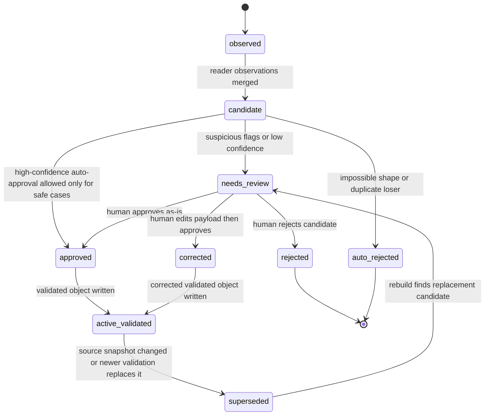
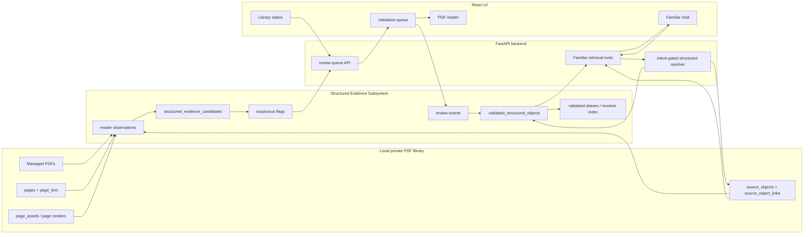

# Structured Evidence Validation Implementation Plan

> **For agentic workers:** REQUIRED SUB-SKILL: Use superpowers:subagent-driven-development (recommended) or superpowers:executing-plans to implement this plan task-by-task. Steps use checkbox (`- [ ]`) syntax for tracking.

**Goal:** Add an app-owned structured evidence layer that uses multiple PDF/text readers, flags suspicious table/profile extraction, supports manual validation, and lets Familiar prefer validated tables and monster/NPC profile bundles only when the user intent warrants it.

**Architecture:** Keep existing `source_objects` as the raw typed evidence anchor and add a versioned validated structured-evidence layer beside it. Multi-reader observations produce untrusted candidates; review actions promote corrected candidates into validated structured objects. Familiar uses an intent-gated resolver over validated objects before falling back to existing source-object/page/vector retrieval.

**Tech Stack:** Python 3.12, SQLite, FastAPI, PyMuPDF/Tesseract/Poppler through the existing Conda environment, React/Vite/TypeScript, existing local retrieval modules, no hosted OCR or hosted embedding service.

---

### 1. Source Boundary

This plan is based on these current sources:

- `CLAUDE.md`
- `AGENTS.md` instructions supplied in the thread
- `docs/plans/Implementation Plan Script.md`
- `wiki/CONTEXT.md`
- `wiki/INDEX.md`
- `wiki/topics/ai-rag-system.md`
- `wiki/topics/pdf-library-and-ingestion.md`
- `wiki/topics/implementation-standards.md`
- `wiki/topics/testing-posture-and-conventions.md`
- `wiki/topics/target-architecture.md`
- `wiki/topics/local-tooling-and-packaging.md`
- `wiki/concepts/private-copyright-boundary.md`
- `wiki/concepts/hybrid-search-for-rules.md`
- `docs/adr/0001-conda-python-tooling.md`
- `docs/adr/0002-managed-local-pdf-storage.md`
- `docs/adr/0003-local-semantic-embeddings.md`
- Live code in:
  - `wfrp_companion/db/schema.sql`
  - `wfrp_companion/db/migrations.py`
  - `wfrp_companion/source_objects/models.py`
  - `wfrp_companion/source_objects/extractor.py`
  - `wfrp_companion/source_objects/store.py`
  - `wfrp_companion/source_objects/layout.py`
  - `tools/extract_page_text.py`
  - `tools/rebuild_retrieval_assets.py`
  - `wfrp_companion/library/retrieval_status.py`
  - `wfrp_companion/assistant/turn_contract.py`
  - `wfrp_companion/assistant/requirement_planner.py`
  - `wfrp_companion/assistant/retrieval.py`
  - `wfrp_companion/assistant/candidates.py`
  - `wfrp_companion/assistant/evidence_constraints.py`
  - `wfrp_companion/assistant/evidence_validation.py`
  - `wfrp_companion/api/app.py`
  - `wfrp_companion/api/routes/library.py`
  - `wfrp_companion/api/schemas.py`
  - `frontend/src/App.tsx`
  - `frontend/src/components/library/LibraryTab.tsx`
  - `frontend/src/lib/apiClient.ts`
- Current local database observations from `data/wfrp_companion.sqlite`, using only counts and metadata:
  - 26 books have source-object extraction jobs succeeded.
  - Current object counts include 23,556 `rule_section`, 8,388 `page_chunk`, 455 `table_row`, 311 `stat_block`, 285 `npc_profile`, 62 `table`, and 26 `monster_profile` rows.
  - Core Rules printed page 112 currently has only broad `rule_section` objects such as `ADVANCED ARMOUR`, `ARMOUR`, and `Basic ARMOUR`; it has no typed table object for the advanced armour table.
  - Core Rules printed page 130 currently has a typed `Hit Location` table and six `table_row` objects.

Sources intentionally excluded as architectural input:

- Older implementation plans under `docs/plans/` other than the plan prompt above.
- Historical handoff documents unless the wiki quoted their current accepted conclusions.
- Raw WFRP PDF text, private page text dumps, or book excerpts.
- The current dirty changes in `tests/assistant/test_evidence_validation.py` and `wfrp_companion/assistant/statline_fields.py` are treated as live work-in-progress context only. This plan does not edit or depend on those uncommitted changes landing unchanged.

### 2. Current Live-Code Diagnosis

The current source-object pipeline is useful but too generic for exact table/profile trust:

- `source_objects` can represent `table`, `table_row`, `stat_block`, `npc_profile`, and `monster_profile`, but those rows store raw text spans plus `metadata_json`. They do not store a versioned structured table payload, field-level profile payload, row/cell confidence, table number, table aliases, review status, or validated/corrected state.
- `metadata_json` currently stores extraction metadata such as `structured_type`, `parent_title`, `ocr_derived`, `layout_available`, and `word_geometry_available`. It is raw extraction metadata, not a validated data contract.
- `source_object_links` correctly links `table_row -> table` and `stat_block -> profile`, but link traversal only recovers raw source-object text. It cannot prove that a specific table number or profile field was manually verified.
- `book_retrieval_status.table_index_status` exists but there is no current app-owned structured table/profile index lifecycle. `/api/retrieval/status` reports `table_or_stat_indexed` by detecting typed `source_objects`, not by detecting validated structured evidence.
- `tools/extract_page_text.py` chooses embedded text or OCR output per page. It does not persist multiple reader observations side by side, so later systems cannot compare PDF text, OCR text, word geometry, and source-object heuristics.
- `wfrp_companion/source_objects/layout.py` records whether PyMuPDF word geometry exists, but it does not persist words, blocks, bounding boxes, or table regions for review.
- `page_assets` has schema room for page renders and visual candidates, but there is no implemented review surface that pairs a rendered page region with extracted structured JSON.
- `wfrp_companion/source_objects/extractor.py` uses conservative heuristics for pipe tables, range charts, stat profiles, index entries, glossary entries, and cross references. This is appropriate, but it means missing structures are expected. Core Rules page 112 is the current concrete example: the page has relevant rule-section text but no table object.
- Familiar's current turn and requirement contracts are much better than the previous provider-led behavior, but structured lookup is still driven by generic object-type hints and retrieved text. There is no canonical validated table/profile resolver in front of retrieval.
- Evidence validation can reject wrong object types, wrong pages, wrong entities, and statline evidence without sufficient profile fields. That protects correctness, but when extraction missed the exact structure, validation fails closed even if the page is known.
- Natural user wording still depends on sparse query normalization, source maps, and reranking. There is no app-owned alias table for validated entities such as monsters, NPCs, table numbers, or alternate user phrasings.

The core ownership problem is this: raw OCR/source-object extraction is currently being asked to serve as both candidate generation and trusted structured truth. Those roles need to be split.

### 3. Architecture Decision

Implement a new structured evidence subsystem with these ownership rules:

- `source_objects` remains the canonical raw typed evidence anchor.
- New reader observation rows preserve what each reader saw on a page.
- New structured evidence candidate rows represent untrusted possible tables/profile bundles.
- New validation/review rows are the app-owned audit trail for human decisions.
- New validated structured object rows are the trusted structured truth Familiar can use for exact table/profile answers.
- Familiar uses validated structured objects only through an intent-gated resolver. Broad lore, app help, scene prep, and ordinary conversation must not be dragged into stat/table lookup just because a matching structured object exists.

Recommended package layout:

- Create `wfrp_companion/structured_evidence/models.py` for dataclasses, enums, payload schema helpers, and deterministic IDs.
- Create `wfrp_companion/structured_evidence/readers.py` for reader observation generation from page text, source objects, PyMuPDF words/blocks, OCR metadata, and optional rendered page geometry.
- Create `wfrp_companion/structured_evidence/candidates.py` for merging observations into table/profile candidates.
- Create `wfrp_companion/structured_evidence/suspicion.py` for suspicious-flag rules.
- Create `wfrp_companion/structured_evidence/store.py` for SQLite lifecycle, guarded job claims, candidate replacement, validation writes, and currentness checks.
- Create `wfrp_companion/structured_evidence/resolver.py` for checked-scope, intent-gated table/profile/entity resolution.
- Create `wfrp_companion/structured_evidence/payloads.py` for versioned payload validation and search text generation.
- Create `tools/extract_structured_evidence.py` for count-only rebuilds.
- Add a route module `wfrp_companion/api/routes/structured_evidence.py` for review queue APIs.
- Add frontend review components under `frontend/src/components/library/` or a new `frontend/src/components/review/` folder.

Avoid these approaches:

- Do not replace `source_objects` with validated JSON. Existing retrieval, citations, source maps, links, embeddings, and tests depend on source-object anchors.
- Do not put validated table/profile truth only in `source_objects.metadata_json`. That would keep trusted state mixed with raw extraction metadata and would not support review/audit lifecycle cleanly.
- Do not rely on vector search to resolve exact table/profile requests. Vectors are a fuzzy candidate channel, not an exact structured evidence store.
- Do not use hosted OCR, hosted table extraction, or hosted embeddings in this phase. The project boundary is private and local-first.
- Do not build a public export of tables, profile bundles, or book text.
- Do not make structured lookup always-on. It must be selected by request intent and requirement type.

### 4. Target State Model

This system needs a formal lifecycle because candidate extraction, manual review, and retrieval trust are different states.



State ownership:

- Reader observations are immutable snapshots for a given book/page/source snapshot.
- Candidates are replaceable derived rows tied to a source snapshot and extractor version.
- Review actions are append-only audit records.
- Validated structured objects are the only structured rows Familiar may treat as trusted.
- A validated row becomes stale when its source snapshot no longer matches the current `source_objects` / page text snapshot.

Candidate statuses:

- `candidate`: created and not yet triaged.
- `needs_review`: suspicious or important enough for manual review.
- `auto_rejected`: generated but not usable.
- `approved`: accepted without payload edits.
- `corrected`: accepted with user edits.
- `rejected`: explicitly rejected.
- `superseded`: replaced by a newer candidate or source snapshot.

Validated object statuses:

- `active`: current trusted object.
- `stale`: source snapshot changed; still viewable for audit but not preferred for new retrieval.
- `retired`: deliberately removed from retrieval.

### 5. Target Architecture Diagram



### 6. Proposed Data Model / Contracts

Add migration `0010_structured_evidence_validation`.

Because migrations are file-backed but applied through the Python dispatcher, Phase 1 must add the SQL file and update `wfrp_companion/db/migrations.py`: define the new migration id constant, append it to `MIGRATION_IDS`, dispatch it from `apply_migration()`, and add count/repair helpers only where live code needs them.

#### `structured_reader_observations`

Purpose: immutable per-reader observations. These are not trusted answer data.

Important columns:

- `id text primary key`
- `book_id text not null references books(id) on delete cascade`
- `page_id text not null references pages(id) on delete cascade`
- `page_number integer not null`
- `source_object_id text references source_objects(id) on delete set null`
- `reader_name text not null`
- `reader_version text not null`
- `observation_type text not null`
- `object_shape text`
- `content_kind text`
- `entity_kind text`
- `title text`
- `table_number text`
- `canonical_name text`
- `char_start integer`
- `char_end integer`
- `bbox_json text`
- `payload_json text not null default '{}'`
- `text_hash text`
- `text_snapshot_sha256 text not null`
- `confidence real not null`
- `created_at text not null`

Enums:

- `reader_name`: `page_text_import`, `source_object_heuristic`, `pymupdf_text`, `pymupdf_words`, `tesseract_ocr`, `manual_seed`
- `observation_type`: `table_caption`, `table_region`, `table_row`, `profile_header`, `profile_stat_block`, `profile_field_block`, `cross_reference`, `page_reference`
- `object_shape`: `structured_table`, `table_row`, `profile_bundle`, `profile_field_block`
- `content_kind`: `rules_table`, `combat_table`, `equipment_table`, `random_roll_table`, `encounter_table`, `career_table`, `spell_table`, `creature_profile`, `npc_profile`, `generic_stat_block`, `unknown`
- `entity_kind`: `monster`, `npc`, `creature`, `item`, `spell`, `career`, `rule`, `location`, `none`, `unknown`

Indexes:

- `ix_structured_reader_observations_book_page` on `(book_id, page_number, reader_name)`
- `ix_structured_reader_observations_source_object` on `(source_object_id)`
- `ix_structured_reader_observations_type` on `(book_id, observation_type, object_shape)`

#### `structured_evidence_candidates`

Purpose: derived untrusted candidate objects assembled from one or more observations.

Important columns:

- `id text primary key`
- `book_id text not null references books(id) on delete cascade`
- `primary_page_id text not null references pages(id) on delete cascade`
- `primary_source_object_id text references source_objects(id) on delete set null`
- `object_shape text not null`
- `content_kind text not null`
- `entity_kind text not null`
- `canonical_name text`
- `title text`
- `table_number text`
- `table_number_normalized text`
- `page_start integer not null`
- `page_end integer not null`
- `printed_page_start text`
- `printed_page_end text`
- `heading_path_json text not null default '[]'`
- `observation_ids_json text not null default '[]'`
- `source_object_ids_json text not null default '[]'`
- `payload_json text not null`
- `search_text text not null`
- `confidence real not null`
- `suspicious_flags_json text not null default '[]'`
- `status text not null`
- `status_reason text`
- `text_snapshot_sha256 text not null`
- `structured_extractor_version text not null`
- `created_at text not null`
- `updated_at text not null`

Constraints:

- `status in ('candidate', 'needs_review', 'auto_rejected', 'approved', 'corrected', 'rejected', 'superseded')`
- `object_shape in ('structured_table', 'profile_bundle')`
- `confidence between 0 and 1`
- `page_end >= page_start`

Indexes:

- `ix_structured_candidates_book_status` on `(book_id, status, updated_at)`
- `ix_structured_candidates_lookup` on `(book_id, object_shape, table_number_normalized, canonical_name)`
- `ix_structured_candidates_page` on `(book_id, page_start, page_end)`
- Partial unique index for one active candidate identity per source snapshot:
  - `(book_id, object_shape, coalesce(table_number_normalized, ''), coalesce(canonical_name, ''), page_start, text_snapshot_sha256, structured_extractor_version)`
  - Applies where `status not in ('auto_rejected', 'rejected', 'superseded')`.

#### `validated_structured_objects`

Purpose: trusted local structured evidence used by retrieval after review or safe auto-approval.

Important columns:

- `id text primary key`
- `candidate_id text references structured_evidence_candidates(id) on delete set null`
- `book_id text not null references books(id) on delete cascade`
- `primary_page_id text not null references pages(id) on delete cascade`
- `primary_source_object_id text references source_objects(id) on delete set null`
- `object_shape text not null`
- `content_kind text not null`
- `entity_kind text not null`
- `canonical_name text`
- `title text`
- `table_number text`
- `table_number_normalized text`
- `page_start integer not null`
- `page_end integer not null`
- `printed_page_start text`
- `printed_page_end text`
- `heading_path_json text not null default '[]'`
- `payload_schema_version integer not null`
- `payload_json text not null`
- `field_confidence_json text not null default '{}'`
- `source_snapshot_sha256 text not null`
- `validation_status text not null`
- `review_state text not null`
- `created_at text not null`
- `updated_at text not null`
- `reviewed_at text`

Constraints:

- `validation_status in ('active', 'stale', 'retired')`
- `review_state in ('auto_approved', 'human_approved', 'human_corrected')`
- `payload_schema_version >= 1`
- `object_shape in ('structured_table', 'profile_bundle')`

Indexes:

- `ix_validated_structured_objects_book_shape` on `(book_id, object_shape, validation_status)`
- `ix_validated_structured_objects_table_number` on `(book_id, table_number_normalized, validation_status)`
- `ix_validated_structured_objects_name` on `(book_id, canonical_name, validation_status)`
- Partial unique index for active validated table identity:
  - `(book_id, object_shape, table_number_normalized)` where `validation_status='active' and table_number_normalized is not null`
- Partial unique index for active validated profile identity:
  - `(book_id, object_shape, canonical_name, entity_kind)` where `validation_status='active' and canonical_name is not null`

#### `validated_structured_object_sources`

Purpose: explicit links from trusted structured objects back to raw source anchors.

Important columns:

- `id text primary key`
- `validated_object_id text not null references validated_structured_objects(id) on delete cascade`
- `anchor_kind text not null`
- `source_object_id text references source_objects(id) on delete set null`
- `page_id text references pages(id) on delete set null`
- `source_role text not null`
- `source_snapshot_sha256 text not null`
- `confidence real not null`
- `created_at text not null`

Constraints:

- `anchor_kind in ('source_object', 'page', 'manual')`
- `source_object_id is not null` only when `anchor_kind='source_object'`
- `page_id is not null` only when `anchor_kind='page'`
- `source_object_id is null and page_id is null` when `anchor_kind='manual'`

Indexes:

- Unique partial index on `(validated_object_id, source_role, source_object_id)` where `anchor_kind='source_object'`
- Unique partial index on `(validated_object_id, source_role, page_id)` where `anchor_kind='page'`
- Non-unique index on `(validated_object_id, source_role, anchor_kind)` for review/audit queries

Source roles:

- `primary`
- `fallback_page`
- `supporting_section`
- `stat_block`
- `profile_text`
- `table_row`
- `manual_correction`

#### `validated_structured_object_aliases`

Purpose: exact and fuzzy user-language lookup without entity-specific code.

Important columns:

- `validated_object_id text not null references validated_structured_objects(id) on delete cascade`
- `book_id text not null references books(id) on delete cascade`
- `alias text not null`
- `alias_normalized text not null`
- `alias_source text not null`
- `confidence real not null`
- `created_at text not null`
- Primary key `(validated_object_id, alias_normalized)`

Alias sources:

- `canonical`
- `title`
- `table_number`
- `generated_plural`
- `generated_word_order`
- `manual`

Indexes:

- `ix_validated_alias_lookup` on `(book_id, alias_normalized, confidence desc)`
- `ix_validated_alias_object` on `(validated_object_id)`

#### `structured_evidence_reviews`

Purpose: append-only review audit.

Important columns:

- `id text primary key`
- `candidate_id text references structured_evidence_candidates(id) on delete set null`
- `validated_object_id text references validated_structured_objects(id) on delete set null`
- `action text not null`
- `reviewer text`
- `notes text`
- `patch_json text not null default '{}'`
- `prior_payload_hash text`
- `after_payload_hash text`
- `created_at text not null`

Actions:

- `approve`
- `correct`
- `reject`
- `mark_stale`
- `retire`
- `restore`

#### `book_retrieval_status` updates

Add:

- `structured_evidence_status text not null default 'not_started'`
- `structured_evidence_snapshot_sha256 text`
- `structured_evidence_started_at text`
- `structured_evidence_last_review_at text`

Allowed `structured_evidence_status`:

- `not_started`
- `extracting`
- `indexed`
- `needs_review`
- `needs_refresh`
- `failed`
- `disabled`

Keep existing `table_index_status` during migration for compatibility. New code should use `structured_evidence_status`. A later cleanup can retire `table_index_status` after all UI/API code has moved.

#### `ingest_jobs` updates

Add job types:

- `extract_structured_evidence`
- `rebuild_structured_evidence_search`

Job ids:

- `extract_structured_evidence:<book_id>:<source_object_snapshot>:<page_text_snapshot>:<structured_extractor_version>`
- `rebuild_structured_evidence_search:<book_id>:<validated_snapshot>`

#### Assistant structured lookup contract

Structured lookup policy must be durable and auditable. It cannot be inferred later from a turn kind, because retries and evidence audits need to know which structured behavior was allowed at the time of the accepted research plan.

Extend `EvidenceRequirement` / requirement JSON with:

- `structured_lookup_policy`: `required`, `allowed`, `supporting_only`, `forbidden`, or `not_primary`
- `structured_object_shape_hints`: zero or more of `structured_table`, `profile_bundle`
- `structured_content_kind_hints`: optional table/profile kind hints
- `structured_entity_kind_hints`: optional `monster`, `npc`, `creature`, or other entity hints
- `table_number_hints`: normalized table numbers when user/page context gives them
- `book_title_hints` and `page_hints`: explicit user/source anchors

Persist the same policy fields in:

- `requirements_json` for the accepted research plan.
- `planned_actions_json` when a planned action expects structured lookup.
- Structured resolver/tool-call args so diagnostics show why lookup was required, allowed, or skipped.
- Evidence judgment diagnostics so accepted/rejected hits explain whether structured lookup was active and why.

Extend `EvidenceCandidate` and `RetrievedHit` with explicit structured provenance rather than relying only on `context_text` or `rank_reasons`:

- `validated_structured_object_id`
- `validated_payload_schema_version`
- `validated_payload_hash`
- `validated_validation_status`
- `validated_source_snapshot_sha256`
- `structured_lookup_policy`

If implementation chooses a single `metadata_json` field instead of explicit dataclass fields, it must still expose these exact keys in tests and diagnostics.

#### Table payload contract

Store as `payload_json` in `structured_evidence_candidates` and `validated_structured_objects`.

```json
{
  "schema_version": 1,
  "object_shape": "structured_table",
  "content_kind": "equipment_table",
  "identity": {
    "table_number_raw": "Table 5-6",
    "table_number_normalized": "5-6",
    "title_raw": "Advanced Armour",
    "title_normalized": "advanced armour",
    "aliases": ["table 5-6", "advanced armour table", "armour points by location"]
  },
  "source": {
    "book_id": "core-book-gm-essentials-core-rules",
    "chapter_path": ["Chapter V: Equipment", "Armour"],
    "printed_page_start": "112",
    "printed_page_end": "112",
    "pdf_page_start": 112,
    "pdf_page_end": 112,
    "source_object_ids": [],
    "text_snapshot_sha256": "sha256"
  },
  "structure": {
    "columns": [
      {"key": "item", "label_raw": "Item", "confidence": 0.0}
    ],
    "rows": [
      {
        "ordinal": 1,
        "range_raw": null,
        "cells": {},
        "raw_text": "",
        "confidence": 0.0,
        "suspicious_cells": []
      }
    ]
  },
  "provenance": {
    "reader_names": ["page_text_import", "source_object_heuristic"],
    "confidence": 0.0,
    "issues": []
  }
}
```

#### Profile bundle payload contract

```json
{
  "schema_version": 1,
  "object_shape": "profile_bundle",
  "content_kind": "creature_profile",
  "entity_kind": "monster",
  "identity": {
    "name_raw": "Common Orc",
    "name_normalized": "common orc",
    "aliases": ["orc", "common orc"]
  },
  "source": {
    "book_id": "rules-and-mechanics-toolkits-old-world-bestiary",
    "chapter_path": ["Greenskins", "Orcs"],
    "printed_page_start": "104",
    "printed_page_end": "104",
    "pdf_page_start": 104,
    "pdf_page_end": 104,
    "source_object_ids": [],
    "text_snapshot_sha256": "sha256"
  },
  "profile": {
    "description": "",
    "main_profile": {
      "ws": null,
      "bs": null,
      "s": null,
      "t": null,
      "ag": null,
      "int": null,
      "wp": null,
      "fel": null
    },
    "secondary_profile": {
      "a": null,
      "w": null,
      "sb": null,
      "tb": null,
      "m": null,
      "mag": null,
      "ip": null,
      "fp": null
    },
    "skills": [],
    "talents": [],
    "traits": [],
    "special_rules": [],
    "weapons": [],
    "armour": [],
    "trappings": [],
    "notes": []
  },
  "provenance": {
    "reader_names": ["page_text_import", "source_object_heuristic"],
    "field_confidence": {},
    "suspicious_fields": []
  }
}
```

### 7. External Integration Design

No hosted external service is introduced in this phase.

Local integrations:

- Managed PDFs:
  - Source of truth: `books.managed_pdf_path` and source hash columns in SQLite.
  - Read by structured readers only after `books.copy_status='copied'`.
  - If a PDF is missing/unreadable, readers write a bounded failure reason and the candidate build continues from page text/source objects.
- PyMuPDF:
  - Used through the existing Conda environment for page labels, text, words, blocks, and optional rendered page snapshots.
  - Failures are converted into safe reason codes such as `pymupdf_unreadable` and do not expose private paths in API responses.
- Tesseract:
  - Already used by `tools/extract_page_text.py` fallback OCR.
  - This phase may reuse the already imported OCR text and may add a targeted reader observation that records OCR metadata. It must not run long OCR inside SQLite write transactions.
- Poppler tools:
  - Already available in the environment and can be used for future cross-checks. This phase should not require a new Poppler dependency path unless tests prove PyMuPDF/Tesseract observations are insufficient.
- OpenAI:
  - Familiar final prose generation remains unchanged.
  - The provider does not own structured extraction, validation, or resolver state.
  - Validated structured payloads may feed final prompt evidence only through existing accepted-evidence construction and copyright-safe summarization.

If any local executable is missing:

- Extraction should mark the relevant observation reader as failed in bounded metadata.
- The book structured-evidence status should become `needs_review` if other readers found candidates, or `failed` only if no usable reader path remains.
- Existing source-object/page/vector retrieval must continue to work.

### 8. Core Flow Design

#### Flow A: Structured evidence rebuild

1. Caller runs `tools/extract_structured_evidence.py`.
2. Tool applies pending migrations.
3. Tool selects eligible books where copied, page text imported, search indexed, and source objects indexed.
4. For each book, compute:
   - page text snapshot from `book_text_snapshot_sha256()`.
   - source-object snapshot from current source objects.
   - structured extractor version.
5. In a short transaction:
   - Ensure `book_retrieval_status` exists.
   - Guarded update:

```sql
update book_retrieval_status
set structured_evidence_status = 'extracting',
    structured_evidence_started_at = :now,
    last_error = null,
    updated_at = :now
where book_id = :book_id
  and (:force = 1 or structured_evidence_status in (
    'not_started', 'indexed', 'needs_review', 'needs_refresh', 'failed'
  ));
```

   - Claim `ingest_jobs(idempotency_key='extract_structured_evidence:...')`.
6. Outside the write transaction:
   - Load page text rows.
   - Load source objects and links.
   - Load PyMuPDF word/block metadata when the managed PDF exists.
   - Generate reader observations.
   - Merge observations into structured candidates.
   - Apply suspicious-flag rules.
7. In a final short transaction:
   - Recheck that page/source snapshots still match.
   - Mark existing candidates for the old snapshot as `superseded`.
   - Insert new observations and candidates.
   - Preserve existing active validated objects whose source snapshot still matches.
   - Mark active validated objects stale when source snapshot changed.
   - Set `structured_evidence_status`:
     - `indexed` when all high-confidence candidates are either active validated or non-suspicious.
     - `needs_review` when any candidate has suspicious flags or low confidence.
     - `failed` when candidate generation failed with no usable fallback.
   - Close the ingest job as `succeeded` or `failed`.

Race prevention:

- Recheck snapshots before writing final rows.
- Do not hold write transactions during PDF/OCR/layout reading.
- Use idempotency key per book/snapshot/version.
- Use partial unique indexes for active candidate identities.

#### Flow B: Suspicious candidate detection

Candidate generation should flag, not hide, these cases:

- `referenced_table_missing`: source text or source object mentions a table number but no matching structured table candidate exists on the same checked page range.
- `table_number_conflict`: readers disagree about table number.
- `title_conflict`: readers disagree about table title.
- `ocr_dash_variant`: table number differs only by dash/OCR form such as hyphen/en dash/em dash.
- `range_gap`: d100/d10 range rows skip expected coverage.
- `range_overlap`: roll ranges overlap.
- `column_count_drift`: row cell counts differ from header count.
- `low_reader_agreement`: only one reader found the candidate.
- `source_object_missing`: candidate exists only in page text/layout, not as a typed `source_object`.
- `profile_missing_main_fields`: stat profile has fewer than the required main profile fields.
- `profile_missing_secondary_fields`: secondary profile is absent or partial.
- `profile_followup_uncertain`: skills/talents/traits/special rules/trappings continuation could not be bounded confidently.
- `entity_kind_uncertain`: monster/NPC classification is heuristic-only.
- `page_label_uncertain`: printed page label calibration is missing or needs review.

Suspicious flags must be count/status metadata in CLI and API list views. Raw candidate text remains available only in local detail/review endpoints.

#### Flow C: Manual review and validation

1. Frontend loads `GET /api/structured-evidence/review?status=needs_review`.
2. API returns candidate summaries:
   - candidate id
   - object shape
   - title/canonical name/table number
   - book title
   - page range
   - suspicious flags
   - confidence
   - current validation state
   - source-object/page ids for reader jump
3. User opens a candidate detail.
4. API returns local detail:
   - payload JSON
   - observation summaries
   - source links
   - page/page range identity
   - no private filesystem paths
   - no telemetry, hosted cache, share/export link, or public route reuse
   - access limited to the local app/API origin used by the existing library workflow
5. UI opens the PDF page in the existing reader and shows a structured editor.
6. User approves, corrects, or rejects.
7. API validates payload shape with `payloads.py`.
8. In a single transaction:
   - Insert `structured_evidence_reviews`.
   - If approve/correct:
     - Retire or supersede conflicting active validated object.
     - Insert/update `validated_structured_objects`.
     - Insert `validated_structured_object_sources`.
     - Rebuild aliases for that validated object.
     - Mark candidate `approved` or `corrected`.
   - If reject:
     - Mark candidate `rejected`.
   - Recompute per-book `structured_evidence_status`.

#### Flow D: Intent-gated structured resolver

1. `turn_contract.classify_turn()` continues to classify broad turn kind.
2. `requirement_planner` adds explicit structured lookup policy:
   - `required` for statline lookup and explicit table lookup.
   - `allowed` for rules lookup with table/rule terms.
   - `supporting_only` for scene prep.
   - `forbidden` for conversation, app help, and ambiguous clarifying turns.
   - `not_primary` for lore lookup unless the user asks for stats, table, rules values, AP, roll chart, or a named profile.
   - The chosen policy and all structured hints are written into `requirements_json`, `planned_actions_json`, resolver/tool-call args, and evidence judgment diagnostics.
3. `structured_evidence.resolver.resolve_structured_target()` receives:
   - checked `source_book_ids`
   - user query
   - requirement kind
   - object type hints
   - book/page hints
   - policy
4. If policy is `forbidden`, return no structured target.
5. If policy is `required`:
   - Search active validated aliases and identity columns first.
   - If exactly one high-confidence target matches, return it.
   - If multiple plausible targets match, return an ambiguity result and let Familiar ask a clarification.
   - If none match, return `no_validated_target` and fall back to current retrieval only if the requirement permits unvalidated evidence.
6. If policy is `allowed` or `supporting_only`, add validated targets as boosted candidates but do not require them.

#### Flow E: Retrieval and evidence validation integration

1. Add a new candidate channel `validated_structured`.
2. Candidate collection asks the resolver before normal page/source/vector search.
3. Validated structured candidates convert to `EvidenceCandidate` with:
   - `source_object_id` set to the primary source object when available.
   - `object_type` mapped to existing retrieval types for compatibility:
     - `structured_table` -> `table`
     - `profile_bundle` with monster -> `monster_profile`
     - `profile_bundle` with NPC -> `npc_profile`
   - rank reasons such as `validated_structured:active`, `validated_table_number:5-6`, `validated_alias:advanced armour`.
   - structured provenance fields: validated object id, payload schema version, payload hash, validation status, source snapshot hash, and active policy.
4. RRF/reranking keeps existing exact/page/vector channels.
5. Evidence validation accepts validated structured objects only when:
   - source book is checked.
   - validation status is active.
   - source snapshot is current.
   - requirement policy allows structured lookup.
   - object shape/kind matches the requirement.
6. Statline validation should prefer payload fields when present and fall back to current text-based `statline_fields` logic for raw source objects.
7. Table validation should match normalized table number/title/page/book when present, not just body text.

#### Flow F: Migration and backfill

1. Add schema and migrations.
2. Run `tools/extract_structured_evidence.py --book-id <small synthetic/test book>` in tests.
3. Backfill candidates from existing `source_objects`:
   - Existing `table` / `table_row` rows become table candidates.
   - Existing `npc_profile` / `monster_profile` plus linked `stat_block` rows become profile bundle candidates.
   - Existing pages with likely table references and no table object become `needs_review` candidates or `referenced_table_missing` warnings.
4. Do not auto-approve private WFRP data broadly in the migration.
5. Allow safe auto-approval only in tests and synthetic fixtures where payload is exact and reader agreement is high.
6. Real local library rows should start as `needs_review` or candidate state unless confidence is genuinely high and no suspicious flags exist.

### 9. UX / Surface Behavior

Add a review surface in the existing local app, not a marketing or export page.

Recommended MVP UI:

- Add a compact "Review" tab next to Library/Search inside `LibrarySearchPanel`, or add a review section inside Library if the tab structure is too tight.
- Show aggregate status in Library:
  - enabled books
  - page text indexed
  - source objects indexed
  - structured candidates
  - needs review
  - validated active
  - vector status
- Review queue list fields:
  - book title
  - page label/range
  - candidate type
  - table number or profile name
  - entity kind
  - suspicious flags
  - confidence
  - updated time
- Detail behavior:
  - Open the PDF page in the existing reader.
  - Show structured payload editor.
  - Show observations and flags in collapsible local-only details.
  - Approve/correct/reject actions.
  - No public export button.

State-to-surface rules:

| State | Library Status | Review Queue | Familiar |
| --- | --- | --- | --- |
| no candidates | "Structured evidence not built" | hidden | existing retrieval only |
| candidates, no suspicious flags | "Structured evidence indexed" | optional filter | may use only if active validated exists |
| needs_review | "Needs review" | visible by default | does not treat candidate as trusted |
| active validated | "Validated structured evidence ready" | visible under approved filter | preferred when intent-gated |
| stale validated | "Needs rebuild/review" | visible under stale filter | not preferred for new answers |
| failed | "Structured evidence failed" | failure category visible | existing retrieval still works |

### 10. Implementation Sequence

#### Phase 1: Schema, Models, and Lifecycle

Scope:

- Add schema tables, migration, dataclasses, payload validators, and status currentness.

Changes:

- Modify `wfrp_companion/db/schema.sql`.
- Modify `wfrp_companion/db/migrations.py`.
- Add migration file `wfrp_companion/db/migration_files/0010_structured_evidence_validation.sql`.
- Add the migration id constant, append `MIGRATION_IDS`, and extend the migration dispatcher.
- Create `wfrp_companion/structured_evidence/__init__.py`.
- Create `wfrp_companion/structured_evidence/models.py`.
- Create `wfrp_companion/structured_evidence/payloads.py`.
- Create `wfrp_companion/structured_evidence/store.py`.
- Add tests in `tests/db/test_schema.py`, `tests/db/test_migrations.py`, and `tests/structured_evidence/test_models.py`.

Does not change yet:

- No UI.
- No Familiar retrieval integration.
- No automatic PDF OCR/layout rebuild behavior beyond schema support.

Required tests:

- Schema creates all new tables and constraints.
- Migration applies to initialized DB and records `0010`.
- Migration dispatcher applies `0010` through `apply_migration()` and preserves existing migration order.
- Migration refuses uninitialized DB through existing migration guard.
- Payload validators reject malformed table/profile JSON.
- `validated_structured_objects` uniqueness prevents two active table/profile identities for the same book.
- `validated_structured_object_sources` does not permit duplicate source-object/page anchors when nullable fields are involved.
- Review events are append-only.

#### Phase 2: Reader Observations and Candidate Builder

Scope:

- Generate observations from existing page text, source objects, and PyMuPDF layout metadata. Merge into untrusted candidates.

Changes:

- Create `wfrp_companion/structured_evidence/readers.py`.
- Create `wfrp_companion/structured_evidence/candidates.py`.
- Create `wfrp_companion/structured_evidence/suspicion.py`.
- Create `tools/extract_structured_evidence.py`.
- Update `tools/rebuild_retrieval_assets.py` to run structured evidence extraction after source-object search rebuild and before source maps/embeddings.
- Add `extract_structured_evidence` to `ingest_jobs` migration/check constraints.
- Add tests in `tests/structured_evidence/test_readers.py`, `tests/structured_evidence/test_candidates.py`, `tests/structured_evidence/test_suspicion.py`, and `tests/tools/test_extract_structured_evidence.py`.

Does not change yet:

- Candidates are not trusted by Familiar.
- Manual review APIs are not public yet.

Required tests:

- Existing `table` and linked `table_row` source objects produce a `structured_table` candidate.
- Existing `npc_profile`/`monster_profile` and linked `stat_block` produce a `profile_bundle` candidate with description/follow-up fields.
- A page with a table reference but no structured table gets `referenced_table_missing`.
- OCR dash/table-number variants normalize to the same table number.
- D100 range gaps and overlaps produce suspicious flags.
- Profile bundles with missing stat fields or uncertain follow-up labels produce suspicious flags.
- CLI output reports counts and bounded failure reasons only.

#### Phase 3: Manual Review API and Validation Store

Scope:

- Add local API endpoints to list candidates, inspect candidate detail, approve/correct/reject, and expose aggregate review counts.

Changes:

- Create `wfrp_companion/api/routes/structured_evidence.py`.
- Include the router in `wfrp_companion/api/app.py`.
- Add Pydantic schemas to `wfrp_companion/api/schemas.py` or a focused new schema module if the existing file grows too large.
- Extend `structured_evidence/store.py` with review transactions.
- Add tests in `tests/api/test_structured_evidence_routes.py` and `tests/structured_evidence/test_store.py`.

Does not change yet:

- Frontend review UI can wait until Phase 4.
- Familiar still ignores validated structured objects until Phase 5.

Required tests:

- Candidate list is count/metadata oriented.
- Candidate detail does not expose filesystem paths.
- Candidate detail is local-only: no telemetry/share/export/cache fields and no accidental reuse by public surfaces.
- Approve writes review event, validated object, source links, and aliases in one transaction.
- Correct validates payload and records before/after payload hashes.
- Reject marks candidate rejected and writes review event.
- Conflicting active validated table/profile rows are retired/superseded deterministically.
- Stale source snapshots prevent approval unless the client refreshes.

#### Phase 4: Review Queue UI

Scope:

- Build the local manual validation workflow.

Changes:

- Extend `frontend/src/types/api.ts`.
- Extend `frontend/src/lib/apiClient.ts`.
- Add `frontend/src/components/library/StructuredEvidenceReviewPanel.tsx`.
- Add CSS in a focused file such as `frontend/src/components/library/StructuredEvidenceReviewPanel.css`.
- Integrate the review surface into `LibrarySearchPanel` or `LibraryTab`.
- Add tests in `frontend/src/components/library/StructuredEvidenceReviewPanel.test.tsx` and `frontend/src/lib/apiClient.test.ts`.

Does not change yet:

- No public export.
- No bulk approve of private WFRP data.
- No visual crop editing unless the existing PDF reader page jump is insufficient.

Required tests:

- Queue renders suspicious flags and confidence.
- Approve/correct/reject calls correct API methods.
- Dirty JSON edits are validated before submit.
- Opening a candidate opens the PDF reader to the correct `pdf_page_number`.
- Library aggregate status displays needs-review and validated counts.

#### Phase 5: Intent-Gated Resolver and Retrieval Integration

Scope:

- Make Familiar use active validated structured objects when the request intent warrants it, without hijacking lore/prep/general questions.

Changes:

- Create `wfrp_companion/structured_evidence/resolver.py`.
- Modify `wfrp_companion/assistant/requirement_planner.py` to carry structured lookup policy in requirement/planned-action metadata.
- Modify `wfrp_companion/assistant/agent_planning.py` to serialize structured lookup policy and hints in accepted research-plan contracts.
- Modify `wfrp_companion/assistant/evidence.py` to carry validated structured object provenance on candidates and retrieved hits.
- Modify `wfrp_companion/assistant/candidates.py` to add a `validated_structured` channel.
- Modify `wfrp_companion/assistant/retrieval.py` diagnostics to include structured candidate counts/skip reasons.
- Modify `wfrp_companion/assistant/evidence_constraints.py` and `evidence_validation.py` to accept validated payloads under the right requirement type and source scope.
- Add tests in `tests/assistant/test_retrieval.py`, `tests/assistant/test_requirement_planner.py`, `tests/assistant/test_evidence_validation.py`, and `tests/assistant/test_familiar_golden_contract.py`.

Does not change yet:

- No LLM-driven extraction.
- No hosted reranker.
- No replacement of existing page/source/vector channels.

Required tests:

- Structured lookup policy and hints persist through requirements, planned actions, resolver args, and judgment diagnostics.
- Explicit table request resolves an active validated table by table number, dash variants, title, and page/book hints.
- Explicit stat request resolves an active validated monster/NPC profile bundle with stats, skills, talents, traits, special rules, weapons, armour, trappings, notes, and description.
- `tell me about orcs` does not force stat/profile lookup.
- `make an encounter with orcs` may use profile support but does not require an exact stat answer.
- `what are the rules for armor by location` can use validated table support but still accepts relevant rules sections.
- Ambiguous alias matches produce a clarification path rather than a wrong answer.
- Unvalidated candidates never satisfy evidence validation.
- Accepted validated structured hits expose validated object id, payload hash, schema version, validation status, source snapshot, and policy in diagnostics.
- Stale validated objects are ignored for new retrieval.
- Existing vector/page/source-object retrieval tests continue to pass.

#### Phase 6: Retrieval Status, Rebuild Orchestration, and Wiki Update

Scope:

- Make structured evidence readiness visible and keep rebuild flow consistent.

Changes:

- Modify `wfrp_companion/library/retrieval_status.py`.
- Modify API schema `RetrievalStatusResponse`.
- Modify `frontend/src/components/library/LibraryTab.tsx` aggregate status text.
- Modify `tools/rebuild_retrieval_assets.py` summary.
- Update `wiki/topics/ai-rag-system.md`.
- Update `wiki/topics/pdf-library-and-ingestion.md`.
- Update `wiki/topics/implementation-standards.md`.
- Update `wiki/topics/testing-posture-and-conventions.md`.
- Update `wiki/log.md`.

Does not change yet:

- Do not delete `table_index_status`.
- Do not delete raw `source_objects` or historical candidates.

Required tests:

- Retrieval status reports structured evidence candidate/needs-review/validated counts.
- Rebuild assets runs structured evidence extraction in the right order.
- CLI remains count-only and avoids private text.
- Frontend aggregate status renders new counts.

#### Phase 7: Cleanup and Compatibility Removal

Scope:

- Remove temporary compatibility code only after the validated structured layer is stable.

Changes:

- Decide whether `book_retrieval_status.table_index_status` can be fully deprecated.
- Remove compatibility fields only in a later migration after tests and wiki confirm no code path reads them.
- Clean up any duplicate diagnostics once `structured_evidence_status` is the only readiness owner.

Does not change:

- Do not delete review history.
- Do not delete stale validated objects unless a separate privacy/storage cleanup policy is approved.

Required tests:

- Schema migration preserves existing validated data.
- Cleanup migration does not orphan retrieval hits, candidates, review events, or source-object links.

### 11. Testing Requirements

Minimum Python test categories:

- DB schema and migration tests for every new table, enum, index, and compatibility column.
- Model/payload validator tests for table and profile payload contracts.
- Reader tests using synthetic page text/source objects, not private WFRP excerpts.
- Candidate builder tests for table, table row, profile, stat block, and missing-table-reference cases.
- Suspicious flag tests for range gaps, overlap, OCR variants, low reader agreement, missing secondary profile, missing follow-up fields, and uncertain entity kind.
- Store tests for job claim, stale-running recovery, snapshot drift, candidate replacement, validation writes, and conflicting active object retirement.
- API route tests for list/detail/approve/correct/reject and path privacy.
- API route tests for local-only detail behavior and no public/share/export leakage.
- Retrieval/resolver tests for exact table lookup, profile lookup, alias resolution, checked-book scoping, stale validated object rejection, and ambiguity.
- Assistant contract tests proving structured lookup policy persists through accepted requirements, planned actions, resolver/tool-call args, and evidence judgment diagnostics.
- Familiar regression tests proving structured lookup is intent-gated and does not hijack lore/prep/general chat.
- CLI tests proving count-only output.
- Rebuild orchestration tests proving order and status propagation.

Minimum frontend test categories:

- API client method tests.
- Review queue rendering.
- Review detail/editor validation.
- Approve/correct/reject button behavior.
- PDF reader jump integration.
- Library aggregate structured-evidence status.

Required verification commands for implementation PRs that touch Python:

```bash
conda run -n wfrp-companion ruff check wfrp_companion tests tools
conda run -n wfrp-companion python -m pytest --cov=wfrp_companion --cov=tools.init_db --cov=tools.import_pdfs --cov=tools.import_page_text --cov=tools.rebuild_fts --cov=tools.rebuild_source_object_fts --cov=tools.rebuild_source_maps --cov=tools.rebuild_embeddings --cov=tools.rebuild_retrieval_assets --cov=tools.backfill_page_labels --cov=tools.search_text --cov=tools.source_sets --cov=tools.serve_api --cov=tools.dev --cov=tools.migrate_db --cov=tools.extract_source_objects --cov=tools.extract_structured_evidence --cov-report=term-missing --cov-fail-under=100
```

Required verification commands for implementation PRs that touch frontend:

```bash
cd frontend
npm run test:coverage
npm run test:e2e
npm run build
```

Use synthetic fixtures and generated sample PDFs only. Do not commit private WFRP PDF text, screenshots of book pages, extracted table contents, vector rows, or full profile payloads from owned books.

### 12. Verification Matrix

| Scenario | Expected Result |
| --- | --- |
| Existing typed table with rows | Candidate builder creates a structured table candidate linked to the table source object and row source objects. |
| Existing profile plus linked stat block | Candidate builder creates a profile bundle with description/follow-up fields and stat payload. |
| Page references a table number but no table object exists | Candidate is flagged or warning is recorded as `referenced_table_missing`; Familiar does not invent table values. |
| Table number has dash/OCR variants | Resolver normalizes variants to the same table number. |
| D100 table has missing range | Candidate gets `range_gap` and defaults to `needs_review`. |
| Profile has stats but missing skills/talents/traits area | Candidate gets relevant suspicious fields and defaults to `needs_review`. |
| Human corrects one table cell | Review event records correction, active validated object contains corrected payload, raw source object remains unchanged. |
| Validated object source snapshot becomes stale | Retrieval ignores the stale validated object and status becomes `needs_refresh` or `needs_review`. |
| User asks explicit table question | Resolver prefers active validated structured table when checked scope allows it. |
| User asks explicit stat question | Resolver prefers active validated profile bundle when checked scope allows it. |
| User asks lore question | Structured resolver is not required and does not force a stat/table answer. |
| User asks scene prep question | Structured objects may support the answer but do not become the only answer shape. |
| Alias matches multiple active objects | Familiar asks a focused clarification or reports ambiguity instead of choosing randomly. |
| Embeddings disabled/stale | Structured resolver still works; vector diagnostics still report current vector status. |
| Review API list endpoint | Returns metadata/status/counts only, no filesystem paths. |
| CLI rebuild | Prints counts and bounded reason codes only. |

### 13. Migration / Compatibility / Cleanup Strategy

Migration strategy:

- Add new tables without modifying existing `source_objects` rows.
- Add `structured_evidence_status` to `book_retrieval_status`.
- Keep `table_index_status` as compatibility scaffolding.
- Add new job types to `ingest_jobs`.
- Backfill zero validated objects by default. The first rebuild creates candidates and review state.
- Existing typed source objects seed candidates but not trusted validated facts unless a safe auto-approval rule explicitly passes.

Safe cases:

- Synthetic tests.
- Existing source-object table/profile rows where all payload fields are internally consistent and no suspicious flags exist.
- Candidate creation from existing source-object relationships.

Ambiguous/manual-review cases:

- Table references without table object.
- OCR-derived pages without word geometry.
- Multiple table candidates for the same number/page.
- Profile bundles with missing main/secondary profile fields.
- Monster/NPC classification based only on title marker heuristics.
- Any candidate whose page-label calibration is not confident.

Quarantine behavior:

- Keep candidates in `needs_review`.
- Do not let candidates satisfy Familiar evidence validation.
- Surface count and reason in Library/Review UI.

Cleanup:

- After structured evidence has been integrated and validated in real use, plan a separate cleanup to remove or deprecate `table_index_status`.
- Do not delete historical review rows.
- Do not delete raw observations automatically. If local storage growth becomes a problem, add a separate retention policy that preserves validated object provenance.

### 14. Operational Rollout Notes

Rollout order:

1. Apply migrations.
2. Run existing retrieval rebuild smoke command without structured extraction changes to prove no breakage.
3. Run structured evidence extraction on one synthetic/test DB in CI.
4. Run structured evidence extraction on a small selected local book with `--book-id` for manual QA.
5. Enable review UI.
6. Integrate resolver in retrieval after API/store tests are green.
7. Run full retrieval asset rebuild locally.
8. Rebuild embeddings only after source-object/structured extraction is stable and only with explicit `WFRP_EMBEDDING_*` settings.

Recovery:

- Use `--retry-running` and `--stale-running-minutes` on the new CLI following existing tool patterns.
- A failed local reader should not fail existing page/source/vector retrieval.
- If structured evidence extraction fails for a book, mark only `structured_evidence_status='failed'` and keep existing retrieval assets untouched.
- If source-object extraction changes, mark structured evidence as `needs_refresh`.

Privacy:

- CLI output is count-only.
- API list endpoints are metadata-oriented.
- Detail endpoints are local app endpoints and should not expose filesystem paths.
- No public export of structured tables/profile bundles.

### 15. ADR / Platform Alignment

This plan aligns with existing ADRs:

- ADR 0001: Uses the Conda environment and existing local native PDF/OCR tools.
- ADR 0002: Reads managed local PDFs through SQLite-owned managed storage.
- ADR 0003: Keeps retrieval local and private; structured resolver coexists with local embeddings rather than replacing them.

This plan aligns with wiki direction:

- Keeps SQLite as app-owned source of truth.
- Keeps source-set checked scope authoritative.
- Keeps source objects as canonical private raw structured evidence.
- Adds explicit state where inference is currently too fragile.
- Keeps vector search as a candidate channel, not an evidence bypass.
- Keeps provider planning advisory and app-owned validation authoritative.

Transitional compromise:

- `payload_json` stores table rows/profile fields rather than fully normalizing every cell into relational tables in the first phase. This keeps the MVP smaller while still adding explicit identity, aliases, status, provenance, review events, and validation. If future querying requires SQL over individual cells, add `validated_structured_table_rows` and `validated_structured_table_cells` in a later ADR/plan.

### 16. Non-Goals / Guardrails / Open Questions

Non-goals:

- Do not build hosted OCR, hosted extraction, hosted vector DB, or public content export.
- Do not rewrite the entire source-object extractor.
- Do not remove existing page/source/vector retrieval.
- Do not make Familiar answer from unvalidated candidates.
- Do not make structured lookup always-on.
- Do not solve maps, illustrations, handouts, or visual asset classification in this phase.
- Do not commit private PDF text, extracted table contents, screenshots of book pages, or validated WFRP payload data.

Guardrails:

- Validated structured objects must link back to books/pages/source objects and source snapshots.
- Candidate and validated object rows must be scoped by checked source books before retrieval.
- Manual correction must not mutate raw OCR/page text/source-object text.
- Suspicious extraction must produce reviewable state, not silent failure.
- Familiar must preserve partial/insufficient evidence behavior when structured data is missing.
- Every behavior change needs regression tests in the same PR.

Open questions:

- No blocking product questions remain for the first implementation plan.
- A later phase may decide whether table rows/cells deserve fully normalized relational tables after the JSON payload contract has been exercised.
- A later ADR may be warranted if the project adds a new OCR/table extraction dependency beyond the current Conda/PyMuPDF/Tesseract/Poppler stack.

### Self-Review Notes

- Spec coverage: The plan covers multi-reader observations, suspicious entries, manual validation, updated JSON contracts, tables plus monster/NPC profile bundles, descriptions/skills/talents/traits/special rules/trappings, links to existing JSON/source objects, alias resolution, and intent-gated retrieval.
- Placeholder scan: No unresolved placeholder markers remain. Future work is explicitly marked as non-goal or later ADR/plan scope.
- Type consistency: The plan consistently uses `structured_reader_observations`, `structured_evidence_candidates`, `validated_structured_objects`, `validated_structured_object_sources`, `validated_structured_object_aliases`, and `structured_evidence_reviews`.
- Scope check: The work is large but phaseable. Each phase can land independently with tests and without exposing private book text.
