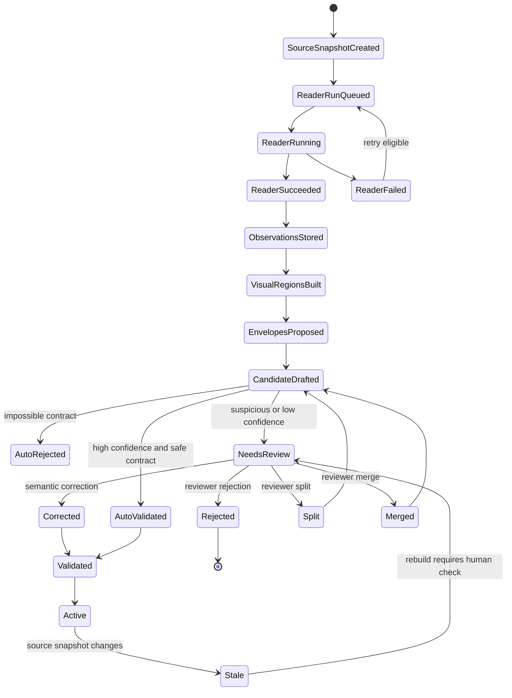
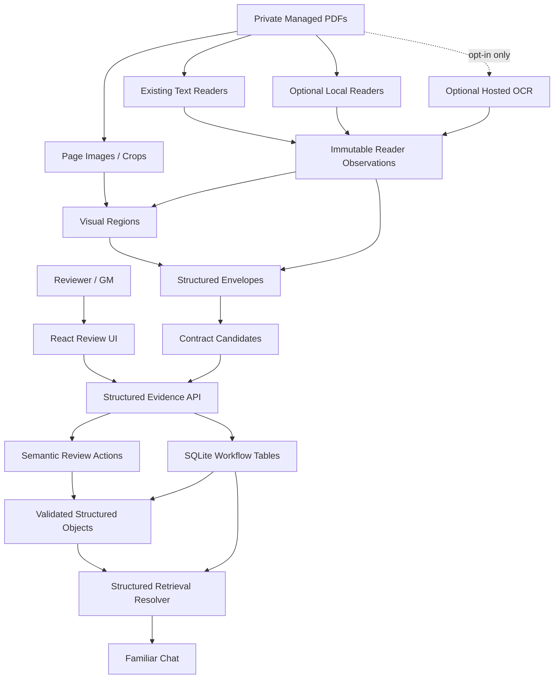

# Visual Structured Evidence Contract Implementation Plan

> **For agentic workers:** REQUIRED SUB-SKILL: Use `superpowers:subagent-driven-development` when available, or `superpowers:executing-plans` when implementing inline. Steps use checkbox (`- [ ]`) syntax for tracking. If multi-agent review hits the known `agent thread limit reached` lifecycle blocker, do not use close-agent retry loops; use bounded diagnostics and fall back to CodeRabbit, a Codex background thread, or inline review.

**Goal:** Replace the brittle text-only structured-evidence extraction path with a visual, contract-driven, human-reviewable pipeline that can reliably identify tables, profile cards, careers, entries, and their relationships without forcing humans to edit raw JSON.

**Architecture:** Keep raw extraction observations immutable, add a v2 envelope and visual-region layer as the app-owned source of truth for structured evidence candidates, and promote only reviewed or high-confidence contract-valid objects into `validated_structured_objects`. Readers become competing evidence providers, not authorities. The review UI becomes semantic and image-backed, so humans approve, correct, merge, split, or reclassify objects without repairing JSON by hand.

**Tech Stack:** Python backend, SQLite, existing `wfrp_companion` ingestion/retrieval modules, React/Vite frontend, PyMuPDF/Tesseract local readers, optional local document parsers such as Docling/Marker/MinerU/PaddleOCR, optional opt-in hosted OCR providers, pytest, Vitest, Playwright.

---

## 1. Source Boundary

This plan is based on these current sources:

- Live worktree: `/Users/aftoncarlson/.config/superpowers/worktrees/WFRP-Companion/structured-evidence-validation`
- Branch: `codex/structured-evidence-validation`
- Runtime data directory used by the app: `/Users/aftoncarlson/workspace/WFRP-Companion/data`
- Current plan prompt: `/Users/aftoncarlson/.config/superpowers/worktrees/WFRP-Companion/structured-evidence-validation/docs/plans/Implementation Plan Script.md`
- Repo instructions: `/Users/aftoncarlson/workspace/WFRP-Companion/AGENTS.md`
- Source-of-truth guidance: `/Users/aftoncarlson/.config/superpowers/worktrees/WFRP-Companion/structured-evidence-validation/CLAUDE.md`
- Compiled wiki:
  - `/Users/aftoncarlson/.config/superpowers/worktrees/WFRP-Companion/structured-evidence-validation/wiki/CONTEXT.md`
  - `/Users/aftoncarlson/.config/superpowers/worktrees/WFRP-Companion/structured-evidence-validation/wiki/INDEX.md`
  - `/Users/aftoncarlson/.config/superpowers/worktrees/WFRP-Companion/structured-evidence-validation/wiki/topics/pdf-library-and-ingestion.md`
  - `/Users/aftoncarlson/.config/superpowers/worktrees/WFRP-Companion/structured-evidence-validation/wiki/topics/ai-rag-system.md`
  - `/Users/aftoncarlson/.config/superpowers/worktrees/WFRP-Companion/structured-evidence-validation/wiki/topics/implementation-standards.md`
  - `/Users/aftoncarlson/.config/superpowers/worktrees/WFRP-Companion/structured-evidence-validation/wiki/topics/testing-posture-and-conventions.md`
  - `/Users/aftoncarlson/.config/superpowers/worktrees/WFRP-Companion/structured-evidence-validation/wiki/topics/target-architecture.md`
  - `/Users/aftoncarlson/.config/superpowers/worktrees/WFRP-Companion/structured-evidence-validation/wiki/concepts/private-copyright-boundary.md`
  - `/Users/aftoncarlson/.config/superpowers/worktrees/WFRP-Companion/structured-evidence-validation/wiki/concepts/hybrid-search-for-rules.md`
- Live code reviewed:
  - `/Users/aftoncarlson/.config/superpowers/worktrees/WFRP-Companion/structured-evidence-validation/wfrp_companion/structured_evidence/models.py`
  - `/Users/aftoncarlson/.config/superpowers/worktrees/WFRP-Companion/structured-evidence-validation/wfrp_companion/structured_evidence/payloads.py`
  - `/Users/aftoncarlson/.config/superpowers/worktrees/WFRP-Companion/structured-evidence-validation/wfrp_companion/structured_evidence/candidates.py`
  - `/Users/aftoncarlson/.config/superpowers/worktrees/WFRP-Companion/structured-evidence-validation/wfrp_companion/structured_evidence/readers.py`
  - `/Users/aftoncarlson/.config/superpowers/worktrees/WFRP-Companion/structured-evidence-validation/wfrp_companion/structured_evidence/suspicion.py`
  - `/Users/aftoncarlson/.config/superpowers/worktrees/WFRP-Companion/structured-evidence-validation/wfrp_companion/structured_evidence/store.py`
  - `/Users/aftoncarlson/.config/superpowers/worktrees/WFRP-Companion/structured-evidence-validation/wfrp_companion/api/routes/structured_evidence.py`
  - `/Users/aftoncarlson/.config/superpowers/worktrees/WFRP-Companion/structured-evidence-validation/frontend/src/components/library/StructuredEvidenceReviewPanel.tsx`
  - `/Users/aftoncarlson/.config/superpowers/worktrees/WFRP-Companion/structured-evidence-validation/wfrp_companion/db/schema.sql`
  - `/Users/aftoncarlson/.config/superpowers/worktrees/WFRP-Companion/structured-evidence-validation/wfrp_companion/db/migrations.py`
  - `/Users/aftoncarlson/.config/superpowers/worktrees/WFRP-Companion/structured-evidence-validation/wfrp_companion/db/migration_files/0010_structured_evidence_validation.sql`
  - `/Users/aftoncarlson/.config/superpowers/worktrees/WFRP-Companion/structured-evidence-validation/wfrp_companion/db/migration_files/0011_structured_layout_metadata_observations.sql`
  - `/Users/aftoncarlson/.config/superpowers/worktrees/WFRP-Companion/structured-evidence-validation/wfrp_companion/source_objects/extractor.py`
  - `/Users/aftoncarlson/.config/superpowers/worktrees/WFRP-Companion/structured-evidence-validation/wfrp_companion/structured_evidence/resolver.py`
  - `/Users/aftoncarlson/.config/superpowers/worktrees/WFRP-Companion/structured-evidence-validation/wfrp_companion/assistant/evidence_constraints.py`
  - `/Users/aftoncarlson/.config/superpowers/worktrees/WFRP-Companion/structured-evidence-validation/wfrp_companion/assistant/evidence_validation.py`
  - `/Users/aftoncarlson/.config/superpowers/worktrees/WFRP-Companion/structured-evidence-validation/wfrp_companion/assistant/requirement_planner.py`
  - `/Users/aftoncarlson/.config/superpowers/worktrees/WFRP-Companion/structured-evidence-validation/wfrp_companion/assistant/turn_contract.py`
- Existing tests reviewed:
  - `/Users/aftoncarlson/.config/superpowers/worktrees/WFRP-Companion/structured-evidence-validation/tests/structured_evidence/test_candidates.py`
  - `/Users/aftoncarlson/.config/superpowers/worktrees/WFRP-Companion/structured-evidence-validation/tests/structured_evidence/test_readers.py`
  - `/Users/aftoncarlson/.config/superpowers/worktrees/WFRP-Companion/structured-evidence-validation/tests/structured_evidence/test_suspicion.py`
  - `/Users/aftoncarlson/.config/superpowers/worktrees/WFRP-Companion/structured-evidence-validation/tests/structured_evidence/test_store.py`
  - `/Users/aftoncarlson/.config/superpowers/worktrees/WFRP-Companion/structured-evidence-validation/tests/api/test_structured_evidence_routes.py`
  - `/Users/aftoncarlson/.config/superpowers/worktrees/WFRP-Companion/structured-evidence-validation/tests/assistant/test_requirement_planner.py`
  - `/Users/aftoncarlson/.config/superpowers/worktrees/WFRP-Companion/structured-evidence-validation/tests/assistant/test_familiar_evidence_gate_regressions.py`
  - `/Users/aftoncarlson/.config/superpowers/worktrees/WFRP-Companion/structured-evidence-validation/tests/assistant/test_research_tools.py`
  - `/Users/aftoncarlson/.config/superpowers/worktrees/WFRP-Companion/structured-evidence-validation/frontend/src/components/library/StructuredEvidenceReviewPanel.test.tsx`
- Live private DB diagnostics against `/Users/aftoncarlson/workspace/WFRP-Companion/data/wfrp_companion.sqlite`.
- User-observed review failures from the current thread, used as failure classes and not as final schema definitions.
- Official/current extraction tool references checked for external-tool design:
  - Docling documentation: https://docling-project.github.io/docling/
  - Docling project site: https://www.docling.ai/
  - Marker repository: https://github.com/datalab-to/marker
  - MinerU repository and docs: https://github.com/opendatalab/MinerU and https://opendatalab.github.io/MinerU/
  - PaddleOCR/PaddleX table structure docs: https://github.com/PaddlePaddle/PaddleOCR and https://paddlepaddle.github.io/PaddleX/3.4/en/module_usage/tutorials/ocr_modules/table_structure_recognition.html
  - Mistral OCR docs: https://docs.mistral.ai/studio-api/document-processing/basic_ocr
  - LlamaParse docs: https://developers.llamaindex.ai/llamaparse/parse/
  - Amazon Textract table docs: https://docs.aws.amazon.com/textract/latest/dg/how-it-works-tables.html
  - Google Document AI docs: https://cloud.google.com/document-ai/docs

Sources intentionally excluded as architectural input:

- Earlier implementation plans in `/docs/plans` are not used as architecture sources. They can be compared later for historical context, but this plan is based on live code, wiki, and current failures.
- Speculative JSON examples from the conversation are not treated as target contracts. Several were known wrong; they are evidence that the contract needs formal design.
- The older checkout at `/Users/aftoncarlson/workspace/WFRP-Companion` is not treated as live structured-evidence code because it lacks the branch modules that produced the current failures.
- Private WFRP PDFs and extracted book text are not to be committed, copied into fixtures, or reproduced in this plan.

## 2. Current Live-Code Diagnosis

The current structured-evidence implementation is a useful first slice, but it is still text-first and source-object-first. It does not yet model the actual extraction unit a human sees on a page.

Most important live-code problems:

- `wfrp_companion/source_objects/extractor.py` can only detect a narrow set of table shapes. It handles pipe tables and some plain range tables, but fails on visual tables, repeated side-by-side column groups, grouped matrices, unnumbered contextual tables, embedded child tables, and tables whose OCR text is fragmented.
- `wfrp_companion/structured_evidence/readers.py` ignores `rule_section` source objects even when the table-like or profile-like content is only present inside a section. This is why visible tables can become `referenced_table_missing` placeholders instead of real candidates.
- `wfrp_companion/structured_evidence/candidates.py` creates placeholders in `_missing_reference_candidates()` when a table reference is seen but no table object is found. Those placeholders look reviewable even though they contain no rows, no cells, and no visual evidence.
- `_table_payload()` in `candidates.py` accepts fallback columns like `Value` and can create an empty row. `payloads.py` validates that shape because it only checks that columns and rows exist. This lets bad evidence become a candidate with too few warnings.
- `_table_candidates()` depends too heavily on `table_region` plus child `table_row` observations. When a real table is only available as a page image or section text, no proper table candidate is created.
- `source_objects/extractor.py` can promote prose to a table title. The Renegade Crowns community-feature failure shows a prose fragment becoming the candidate title while only the bottom rows are captured.
- `StructuredObjectShape` in `models.py` only has `structured_table` and `profile_bundle`. That is too small for the domain. Career entries, advance schemes, rules entries with child tables, grouped matrices, random-context tables, and profile cards are being squeezed into the wrong shapes.
- `candidates.py` treats profile extraction as one `profile_header` plus one linked `profile_stat_block`. It does not assemble a profile envelope from neighboring headings, captions, stat blocks, and follow-up sections.
- `_profile_payload()` parses follow-up fields only from the profile text. It misses sibling rule sections and adjacent blocks containing skills, talents, armour, armour points, weapons, trappings, career, race, descriptions, and notes.
- The profile payload contract lacks first-class `race`, `career`, `armour_points`, `profile_kind`, and group-vs-individual identity fields. The UI therefore cannot distinguish "Roadwardens with race Human" from an object named `Race: Human`.
- `classify_profile_type()` in `source_objects/extractor.py` treats anything without monster markers as `npc_profile`. Career advance schemes can therefore become NPC profiles.
- `suspicion.py` catches some missing fields and range gaps, but it does not catch invalid identities such as stat-header fragments, `Race:*`, `Career:*`, armour lines, known fallback table placeholders, empty cells, partial table tails, or career-as-NPC classifications.
- The current review UI in `frontend/src/components/library/StructuredEvidenceReviewPanel.tsx` exposes a raw `Structured payload JSON` textarea as the correction surface. This makes the human-in-the-loop step too manual and too easy to corrupt.
- There is no image-backed review surface. The reviewer sees JSON, not the page crop that proves whether the candidate is a whole object, a fragment, a wrong type, or a missing visual table.
- Deduplication is tied to canonical identity and page/snapshot keys, not to an explicit page envelope or visual/stat-block source. Live diagnostics found no exact duplicate stat source ids among profile candidates, which means the user-visible "dupe" concern is mostly logical fragmentation and wrong envelope boundaries, not simple duplicate rows.
- The tests encode several bad behaviors as expected behavior. For example, `tests/structured_evidence/test_candidates.py` expects missing-reference placeholder candidates and fallback one-column/empty-row tables.
- Existing tests are mostly synthetic text-object tests. They do not cover visual region detection, cross-page profile envelopes, OCR-damaged stat headers, semantic review actions, or the specific failure families the app is producing.
- The live DB review queue shows this is systemic:
  - hundreds of profile candidates are in `needs_review`
  - hundreds of table candidates are in `needs_review`
  - thousands of table candidates are `superseded`
  - dozens of suspicious profile names follow patterns like `Race:*`, `Career:*`, stat headers, and equipment labels
  - only a tiny number of validated objects are currently active

Observed failure classes that the plan must cover:

- A visual table exists on the page, but the JSON becomes `Referenced table X-Y` with no rows.
- A large numbered table exists, but only tail rows are captured and the title is prose.
- A clean profile card exists, but the profile fields are empty because OCR headers are noisy and follow-up fields are in adjacent blocks.
- A career advance scheme is classified as an NPC profile.
- A heading, race line, career line, or stat-header fragment is treated as an entity name.
- A group stat block should be one object, not atomized into several objects.
- A generic table title like `Random Smells` needs context scope such as the city or section it belongs to.
- An embedded table under a rules entry should be a child object, not an unrelated top-level table.
- Complex tables include side-by-side repeated column groups, D1000 ranges, inherited cells, footnotes, dashes with semantic meaning, and page-reference columns.

## 3. Architecture Decision

Recommended architecture:

Build a v2 structured-evidence pipeline around explicit visual regions, extraction envelopes, typed object contracts, and semantic review actions.

The single source of truth for reviewed structured evidence will be `validated_structured_objects` plus new v2 relationship/source tables. Raw reader output remains immutable evidence. Candidates are transient workflow state. The Familiar agent should answer from validated structured evidence when the query needs a stat card, table, career, or structured entry, and should continue using hybrid page/source-object retrieval for ordinary rules prose.

Core decisions:

- Keep raw extraction observations immutable. Do not edit source text or source objects to make the review queue look clean.
- Introduce `structured_visual_regions` to store page-level detected regions, bounding boxes, crop asset references, provider names, confidence, and suspicion flags.
- Introduce `structured_envelopes` to represent the human-recognizable object area: a profile card, career entry, table, rules entry, or related bundle. Envelopes can span multiple source objects and, where needed, multiple pages.
- Introduce explicit object families:
  - `profile_card` for NPC, monster, enemy, group, or named character stat cards.
  - `career_entry` for careers and advance schemes.
  - `rules_entry` for named rules, mutations, spells, diseases, or other entries that may contain child tables.
  - `structured_table` for top-level, context-scoped, or embedded tables.
- Keep the table contract generic, but make `table_kind` explicit inside the payload. The same `structured_table` shape can represent lookup tables, roll tables, modifier matrices, grouped matrices, profile-stat tables, contextual random tables, or embedded child tables.
- Add parent-child relationships so embedded tables and profile-stat grids can belong to an entry or profile without becoming unrelated search hits.
- Make human review semantic. A human should be able to correct identity, type, scope, fields, rows, columns, merge/split boundaries, and parent-child relationships without editing JSON directly.
- Keep optional third-party readers behind provider adapters. Their output should enter the same observations/regions/envelopes pipeline and never bypass validation.

Approaches to avoid:

- Do not add more special-case aliases like `chaos warrior -> chaos warriors` as the main fix. Alias handling is useful at retrieval time, but it cannot repair bad extraction data.
- Do not force every object into `structured_table` or `profile_bundle`. That is how career schemes became NPCs and headings became names.
- Do not trust OCR text alone for page-layout objects. The examples show that visible tables can be present while text extraction is incomplete or misleading.
- Do not make manual JSON editing the human-in-the-loop strategy. It is too slow, too error-prone, and not aligned with the reviewer's actual visual task.
- Do not make hosted OCR mandatory. Private PDFs are user-owned local reference material; hosted extraction is opt-in only.
- Do not teach Familiar to reconstruct stat blocks from memory when structured evidence fails. The fix is better evidence, not looser hallucination policy.

## 4. Target State Model

The system needs a formal lifecycle because extraction, review, correction, validation, and retrieval are separate states with different owners.



Ownership rules:

- Reader providers own only raw observations and provider metadata.
- The backend owns envelope assembly, contract validation, candidate state, and validated object state.
- The frontend owns display and user intent, not inferred workflow truth.
- The human reviewer owns explicit correction decisions.
- Familiar retrieval owns query matching over validated objects and page/source evidence, not extraction repair.

State transition guards:

- A candidate cannot become `active` unless it passes its contract validator.
- A placeholder created from a reference with no visual or row evidence must be `blocked_missing_visual_evidence`, not `needs_review` as if it were real content.
- A `profile_card` cannot be active if its identity is only a label field such as race, career, armour, weapons, skills, talents, or a stat header.
- A `career_entry` cannot be active as `profile_card`.
- A table with no real cells cannot be active.
- A child table cannot become a top-level search object unless explicitly promoted or separately scoped.

## 5. Target Architecture Diagram



## 6. Proposed Data Model / Contracts

### Existing tables to keep

- `pages`, `page_text`, `source_objects`, `source_object_search`, global FTS tables, source-map tables, and embeddings tables remain the low-level source and retrieval foundation.
- `structured_reader_observations`, `structured_evidence_candidates`, `structured_evidence_reviews`, `validated_structured_objects`, `validated_structured_object_sources`, and `validated_structured_object_aliases` remain, but v2 should extend their relationships rather than keep all semantics inside payload JSON.
- There is no live `structured_evidence_snapshots` or `structured_evidence_reader_runs` table. V2 should reuse the existing `text_snapshot_sha256` / `source_snapshot_sha256` fields and, where an execution record is needed, link to `ingest_jobs` or store provider-run metadata in the new visual-region/envelope tables.

### New migration

Create `/Users/aftoncarlson/.config/superpowers/worktrees/WFRP-Companion/structured-evidence-validation/wfrp_companion/db/migration_files/0012_visual_structured_evidence_contracts.sql`.

Also update:

- `/Users/aftoncarlson/.config/superpowers/worktrees/WFRP-Companion/structured-evidence-validation/wfrp_companion/db/migrations.py`
  - add `VISUAL_STRUCTURED_EVIDENCE_CONTRACTS_MIGRATION_ID = "0012_visual_structured_evidence_contracts"`
  - append the id to `MIGRATION_IDS`
  - add an `apply_visual_structured_evidence_contracts(connection)` branch in `apply_migration`
- `/Users/aftoncarlson/.config/superpowers/worktrees/WFRP-Companion/structured-evidence-validation/wfrp_companion/db/schema.sql`
  - update fresh-database schema definitions to match the migration

Add `structured_visual_regions`:

- `id TEXT PRIMARY KEY`
- `book_id TEXT NOT NULL`
- `source_snapshot_sha256 TEXT NOT NULL`
- `ingest_job_id TEXT`
- `provider_name TEXT NOT NULL`
- `provider_version TEXT NOT NULL DEFAULT ''`
- `pdf_page_start INTEGER NOT NULL`
- `pdf_page_end INTEGER NOT NULL`
- `printed_page_start TEXT`
- `printed_page_end TEXT`
- `region_kind TEXT NOT NULL CHECK(region_kind IN ('table','profile_card','career_entry','rules_entry','heading','text_block','stat_grid','unknown'))`
- `bbox_json TEXT NOT NULL`
- `crop_asset_path TEXT`
- `raw_text TEXT NOT NULL DEFAULT ''`
- `confidence REAL NOT NULL DEFAULT 0`
- `issues_json TEXT NOT NULL DEFAULT '[]'`
- `created_at TEXT NOT NULL DEFAULT CURRENT_TIMESTAMP`
- Index: `(book_id, source_snapshot_sha256, pdf_page_start, region_kind)`
- Unique idempotency key through `id`, generated from book, snapshot, provider, page range, region kind, bbox, and raw text hash.

Crop-serving contract:

- API JSON must expose `region_id` and a relative API URL such as `/api/structured-evidence/regions/{region_id}/crop`, not raw filesystem paths.
- Create a backend helper that resolves `crop_asset_path` only after verifying the normalized path remains under the configured private data directory.
- `GET /api/structured-evidence/regions/{region_id}/crop` returns image bytes with an image media type or `404` for missing/unsafe files.
- Add tests for missing region, missing file, path traversal, wrong book/data-root path, and successful image response.
- The frontend should render crops only through this route.

Add `structured_envelopes`:

- `id TEXT PRIMARY KEY`
- `book_id TEXT NOT NULL`
- `source_snapshot_sha256 TEXT NOT NULL`
- `envelope_kind TEXT NOT NULL CHECK(envelope_kind IN ('profile_card','career_entry','rules_entry','structured_table'))`
- `scope_kind TEXT NOT NULL DEFAULT 'book' CHECK(scope_kind IN ('book','chapter','section','page','parent_object','location'))`
- `scope_value TEXT NOT NULL DEFAULT ''`
- `identity_raw TEXT NOT NULL DEFAULT ''`
- `identity_normalized TEXT NOT NULL DEFAULT ''`
- `parent_envelope_id TEXT`
- `pdf_page_start INTEGER NOT NULL`
- `pdf_page_end INTEGER NOT NULL`
- `printed_page_start TEXT`
- `printed_page_end TEXT`
- `confidence REAL NOT NULL DEFAULT 0`
- `status TEXT NOT NULL DEFAULT 'candidate' CHECK(status IN ('candidate','needs_review','validated','rejected','superseded','blocked'))`
- `issues_json TEXT NOT NULL DEFAULT '[]'`
- `created_at TEXT NOT NULL DEFAULT CURRENT_TIMESTAMP`
- `updated_at TEXT NOT NULL DEFAULT CURRENT_TIMESTAMP`
- Index: `(book_id, source_snapshot_sha256, envelope_kind, status)`
- Index: `(book_id, envelope_kind, identity_normalized, scope_kind, scope_value)`
- Partial unique active key for validated top-level objects: `(book_id, envelope_kind, identity_normalized, scope_kind, scope_value, source_snapshot_sha256)` where `status IN ('candidate','needs_review','validated')` and `parent_envelope_id IS NULL`.

Add `structured_envelope_regions`:

- `envelope_id TEXT NOT NULL`
- `visual_region_id TEXT NOT NULL`
- `role TEXT NOT NULL CHECK(role IN ('primary','heading','body','stat_grid','table','caption','footnote','supporting'))`
- `ordinal INTEGER NOT NULL DEFAULT 0`
- Primary key: `(envelope_id, visual_region_id, role)`
- Index: `(visual_region_id)`

Add `structured_envelope_source_objects`:

- `envelope_id TEXT NOT NULL`
- `source_object_id TEXT NOT NULL`
- `role TEXT NOT NULL CHECK(role IN ('primary','heading','body','stat_block','table','table_row','profile_text','supporting','reference'))`
- `ordinal INTEGER NOT NULL DEFAULT 0`
- Primary key: `(envelope_id, source_object_id, role)`
- Index: `(source_object_id)`

Add `structured_review_actions`:

- `id TEXT PRIMARY KEY`
- `candidate_id TEXT`
- `envelope_id TEXT`
- `validated_object_id TEXT`
- `action_kind TEXT NOT NULL CHECK(action_kind IN ('approve','reject','correct_fields','reclassify','merge','split','set_parent','clear_parent','mark_suspicious','rerun_reader'))`
- `action_payload_json TEXT NOT NULL`
- `reviewer TEXT NOT NULL DEFAULT 'local_user'`
- `created_at TEXT NOT NULL DEFAULT CURRENT_TIMESTAMP`
- Index: `(candidate_id, created_at)`
- Index: `(envelope_id, created_at)`

Extend existing enums by migration-safe table rebuilds where SQLite constraints require it:

- `structured_evidence_candidates.object_shape` and `validated_structured_objects.object_shape` should allow `profile_card`, `career_entry`, `rules_entry`, and `structured_table`.
- `structured_evidence_candidates.status` should allow `blocked` in addition to the current `candidate`, `needs_review`, `auto_rejected`, `approved`, `corrected`, `rejected`, and `superseded`.
- Keep compatibility reads for old `profile_bundle`, mapping it to `profile_card` in code until cleanup.
- `source_objects.object_type` should allow `career_entry`, `career_advance_scheme`, `rules_entry`, `visual_table`, `table_region`, and `profile_card` if the extractor continues to materialize source objects. If v2 uses only observations for these, do not widen `source_objects` beyond what is required.
- `validated_structured_object_sources.source_role` should allow `visual_region`, `envelope`, `parent_entry`, `child_table`, `semantic_correction`, and `reader_observation`.

### Status matrix

| Table | Current statuses | Target statuses | Notes |
| --- | --- | --- | --- |
| `structured_envelopes.status` | new table | `candidate`, `needs_review`, `validated`, `rejected`, `superseded`, `blocked` | `blocked` means an object reference or region exists, but required extraction evidence is missing. |
| `structured_evidence_candidates.status` | `candidate`, `needs_review`, `auto_rejected`, `approved`, `corrected`, `rejected`, `superseded` | existing statuses plus `blocked` | Requires SQLite table rebuild, model enum update, API filters, summary counts, and tests. |
| `validated_structured_objects.validation_status` | `active`, `stale`, `retired` | unchanged | Only contract-valid objects can become `active`. |
| `validated_structured_objects.review_state` | `auto_approved`, `human_approved`, `human_corrected` | unchanged for this plan | Add new values only if the implementation needs to distinguish semantic correction subtypes. |

Blocked issue codes:

- `missing_visual_region`
- `blocked_missing_visual_evidence`
- `referenced_table_without_body`
- `visual_region_without_parseable_cells`

Candidate summary/read APIs must include `blocked` counts separately from `needs_review` so the UI can show an extraction-evidence queue instead of pretending those rows are reviewable objects.

### Contract files

Create a focused contracts package:

- Create `wfrp_companion/structured_evidence/contracts/__init__.py`
- Create `wfrp_companion/structured_evidence/contracts/base.py`
  - `ContractValidationResult`
  - `ContractIssue`
  - `normalize_identity(text: str) -> str`
  - `reject_label_identity(identity: str) -> bool`
- Create `wfrp_companion/structured_evidence/contracts/profile_card.py`
  - `ProfileCardPayload`
  - `ProfileKind`: `npc`, `monster`, `enemy_group`, `named_npc`, `generic_npc`, `unknown`
  - required fields: identity, source, profile kind, main profile, secondary profile, field provenance
  - optional fields: race, career, description, skills, talents, traits, special rules, armour, armour points, weapons, trappings, notes
  - invalid identity labels: race, career, main profile, secondary profile, skills, talents, armour, armour points, weapons, trappings
- Create `wfrp_companion/structured_evidence/contracts/career_entry.py`
  - `CareerEntryPayload`
  - fields: name, description, advance scheme, skills, talents, trappings, career entries, career exits, notes
  - this contract accepts percentage/dash advance cells and does not pretend they are NPC stats
- Create `wfrp_companion/structured_evidence/contracts/rules_entry.py`
  - `RulesEntryPayload`
  - fields: name, entry kind, description, body sections, child table refs, page refs, notes
- Create `wfrp_companion/structured_evidence/contracts/structured_table.py`
  - `StructuredTablePayload`
  - `table_kind`: `lookup`, `roll_table`, `modifier_matrix`, `grouped_matrix`, `profile_stat_grid`, `embedded_child`, `context_random`, `unknown`
  - fields: identity, scope, columns, rows, row groups, footnotes, parent ref, page refs, visual region refs, confidence, issues
  - hard failure when no real cells exist

### Immutable snapshot vs workflow state vs live targets

- Immutable:
  - source snapshots
  - provider-run metadata through `ingest_jobs` or immutable region/observation metadata
  - observations
  - visual regions generated by a provider run
  - review actions
- Workflow state:
  - envelope status
  - candidate status
  - candidate issues
  - reviewer queue assignment and filters
- Live target:
  - active rows in `validated_structured_objects`
  - validated aliases and source relationships
  - retrieval indexes derived from validated objects

### Idempotency

- Provider run idempotency key: `book_id + source_snapshot_sha256 + provider_name + provider_version + page_range + settings_hash`.
- Visual region idempotency key: `provider_run_key + page + region_kind + bbox_hash + raw_text_hash`.
- Envelope idempotency key: `book_id + source_snapshot_sha256 + envelope_kind + page_span + normalized_identity + source_region_ids_hash`.
- Candidate idempotency key: `envelope_id + contract_version + payload_hash`.
- Validated object key: `book_id + object_shape + normalized_identity + scope_kind + scope_value + parent_object_key`.

## 7. External Integration Design

The default system remains local-first. External readers are provider adapters whose output is treated as evidence, not truth.

### Built-in local readers

- Providers:
  - existing page text import
  - existing source-object heuristic
  - PyMuPDF text/words
  - Tesseract OCR if configured
  - page image renderer/cropper
- Source of truth boundary: local SQLite stores all outputs; readers do not own reviewed state.
- Success: observations and visual regions are stored for each requested page range.
- Failure: provider job/run metadata is marked failed with error metadata; other readers continue.
- Retry: repeat the same idempotency key and replace no immutable row; create a new run only when provider version or settings hash changes.

### Optional local third-party parser bakeoff

Official documentation shows active tools that can extract layout, OCR, JSON/Markdown, and table structure from PDFs/images: Docling, Marker, MinerU, and PaddleOCR/PaddleX. These should be evaluated as adapters, not chosen blindly.

- Create provider adapters behind `WFRP_EXTRACTION_PROVIDERS=docling,marker,mineru,paddleocr`.
- Default is empty, so no new heavyweight dependency runs unless enabled.
- Each adapter writes normalized observations:
  - visual regions with bounding boxes
  - table HTML/cells when available
  - reading-order blocks
  - provider confidence and raw artifact path
- Each adapter stores raw provider output under the private data directory, not in git.
- Bakeoff command writes a comparison report with coverage metrics only; no private book text in committed reports.

### Optional hosted OCR providers

Mistral OCR, LlamaParse, Amazon Textract, and Google Document AI expose document OCR/table/layout capabilities, but they require sending private PDFs or page images to a hosted service.

- Hosted providers are opt-in only via explicit environment variables:
  - `WFRP_ALLOW_HOSTED_EXTRACTION=1`
  - `WFRP_EXTRACTION_PROVIDERS=mistral_ocr` or equivalent
  - provider-specific API keys in local environment only
- Default behavior when hosted provider is not configured: mark provider as unavailable and continue local readers.
- No hosted output is committed.
- No route should expose raw hosted extraction artifacts.
- If hosted service is down, the hosted provider job fails softly and local readers still complete.

## 8. Core Flow Design

### Flow A: source snapshot and provider run

1. User imports or refreshes a managed PDF.
2. Backend creates or reuses a source snapshot keyed by book and file/page-text hash.
3. Backend queues provider work through existing `ingest_jobs` or records provider-run metadata on generated visual regions/observations.
4. Each provider run starts inside a transaction:
   - mark the relevant `ingest_jobs` row or provider-run record `running`
   - commit
5. Provider writes observations and visual regions with idempotent ids.
6. Provider marks the job/run metadata `succeeded` or `failed`.
7. Failed providers do not block other providers.

Guard:

```sql
UPDATE ingest_jobs
SET status = 'running', started_at = CURRENT_TIMESTAMP
WHERE id = :ingest_job_id
  AND status IN ('queued', 'retryable_failed');
```

### Flow B: visual region generation

1. Render page images for the page range into the private data directory.
2. Use local readers and layout hints to propose regions.
3. Store every region with bbox, provider, confidence, crop path, and issues.
4. Mark suspicious regions:
   - table-like image with no cell extraction
   - title-like text but no body
   - rows without caption
   - caption/reference with no visual table
   - page crop too small or too large

Transaction boundary: each page's regions are inserted in one transaction so a failed page does not corrupt the whole book run.

### Flow C: envelope assembly

1. Group visual regions and observations by page and reading order.
2. Create profile-card envelopes from heading + stat grid + follow-up label blocks.
3. Create career-entry envelopes from career heading + description + advance scheme + entries/exits.
4. Create structured-table envelopes from visual table/caption/rows, including unnumbered contextual tables.
5. Create rules-entry envelopes from named entry headings plus body text and child table regions.
6. Link multi-page envelopes when a heading appears on one page and the body/stat grid continues on the next page.
7. Link embedded child tables to parent entries.

Hard rules:

- A label line alone is not an envelope identity.
- A reference to a table number alone is not a table envelope.
- A stat grid without the surrounding heading/follow-up fields is suspicious and cannot auto-validate.
- An advance scheme is a career entry unless surrounding evidence proves it is a profile card.

### Flow D: candidate drafting

1. For each envelope, choose a contract by `envelope_kind`.
2. Build a typed payload.
3. Run contract validation.
4. Store candidate:
   - `candidate` when valid and high confidence
   - `needs_review` when semantically plausible but suspicious
   - `blocked` when the candidate only exists because of a reference and no visual/content evidence exists
   - `auto_rejected` when identity/type is impossible
5. Write issue codes in a stable list. Examples:
   - `identity_is_label`
   - `missing_visual_region`
   - `missing_required_cells`
   - `partial_table_tail`
   - `profile_missing_stat_grid`
   - `profile_missing_followup_fields`
   - `career_misclassified_as_profile`
   - `embedded_table_missing_parent`
   - `ocr_header_noise`
   - `scope_required`

### Flow E: semantic human review

1. Reviewer opens the queue.
2. API returns candidate summary, semantic payload, issue list, source/crop region ids, crop API URLs, and raw JSON only in debug details.
3. Reviewer can:
   - approve
   - reject
   - correct fields
   - reclassify object type
   - merge envelopes
   - split a region/envelope
   - set or clear parent
   - request a reader rerun
4. API stores a `structured_review_actions` row before mutating candidate or validated state.
5. API applies the correction through contract validators.
6. API creates or updates the active validated object.
7. Crop requests go through `GET /api/structured-evidence/regions/{region_id}/crop`; API responses never expose private absolute paths.

Guard:

```sql
UPDATE structured_evidence_candidates
SET status = :new_status, updated_at = CURRENT_TIMESTAMP
WHERE id = :candidate_id
  AND status IN ('candidate', 'needs_review', 'blocked');
```

### Flow F: retrieval and Familiar behavior

1. Query intent classifier identifies whether the user likely needs:
   - profile stats
   - table contents
   - career information
   - rules prose
   - mixed answer
2. For profile/table/career intent, search validated structured objects first.
3. Use aliases and normalized identity matching, including singular/plural and word-order-safe aliases, but never invent an answer from alias alone.
4. If validated structured evidence exists, answer from that object and cite its source page(s).
5. If only blocked or needs-review candidates exist, tell the user the local extraction knows there is likely a candidate but it needs review, and offer the exact review item.
6. If no structured object exists, fall back to hybrid page/source-object retrieval.
7. If hybrid retrieval finds page evidence, answer with citations.
8. If hybrid retrieval fails, say evidence is missing and name the retrieval path that failed.

This flow prevents the app from forcing stat-block/table logic onto normal prose questions while still making structured evidence first-class when the user asks for stats or table contents.

Live-code retrieval ownership:

- `wfrp_companion/structured_evidence/resolver.py` is the structured-object resolver. It currently maps only `structured_table` and `profile_bundle`; v2 must add `profile_card`, `career_entry`, and `rules_entry`, while preserving `profile_bundle` compatibility.
- `wfrp_companion/assistant/evidence_constraints.py` owns structured lookup policies and shape/content hints.
- `wfrp_companion/assistant/requirement_planner.py` decides when a user request needs structured lookup.
- `wfrp_companion/assistant/evidence_validation.py` accepts or rejects retrieved structured evidence against the requirement constraint.
- `wfrp_companion/assistant/turn_contract.py` and prompt-building modules surface requirement outcomes to Familiar.
- Tests belong under existing `tests/assistant` and `tests/structured_evidence`, not a new imaginary `tests/rag` tree unless that tree is created by a separate refactor.

## 9. UX / Surface Behavior

The review UI should become an image-backed semantic correction surface.

Modify `/frontend/src/components/library/StructuredEvidenceReviewPanel.tsx` and create smaller components:

- Create `frontend/src/components/library/structuredEvidence/ReviewQueue.tsx`
- Create `frontend/src/components/library/structuredEvidence/CandidateEvidencePane.tsx`
- Create `frontend/src/components/library/structuredEvidence/ProfileCardForm.tsx`
- Create `frontend/src/components/library/structuredEvidence/CareerEntryForm.tsx`
- Create `frontend/src/components/library/structuredEvidence/StructuredTableGrid.tsx`
- Create `frontend/src/components/library/structuredEvidence/ReviewActionBar.tsx`
- Create `frontend/src/components/library/structuredEvidence/IssueBadges.tsx`

State-to-surface rules:

| State | Surface behavior |
| --- | --- |
| `candidate` | Show as low-friction review item with crop, type, identity, and fields. |
| `needs_review` | Show at top of queue with issue badges and required correction controls. |
| `blocked` | Show in a separate "Needs extraction evidence" queue; do not present as a real object. |
| `validated` | Show in validated list with source links and review history. |
| `rejected` | Hide by default; visible under review history filters. |
| `superseded` | Hide by default; visible from replacement object's history. |
| `stale` | Show as "source changed; recheck needed" when source snapshot changes. |

Required UI behaviors:

- Display the page crop next to the parsed candidate through the guarded crop API route.
- Display page/book/source metadata and source buttons.
- For profile cards, show editable fields for name, profile kind, race, career, main profile, secondary profile, skills, talents, traits, special rules, armour, armour points, weapons, trappings, notes, and description.
- For careers, show description, advance scheme, skills, talents, trappings, career entries, and career exits.
- For tables, show a grid editor with rows, columns, row groups, footnotes, table number, title, scope, and parent object.
- Provide merge/split controls for fragmented page objects.
- Provide reclassify controls for wrong object families.
- Keep raw JSON behind a collapsed debug panel. It should not be the normal correction path.
- Show issue badges using stable issue codes from the backend.
- Do not display large private OCR text exports or book passages outside the local app.
- Do not expose absolute crop paths or raw private data-directory paths in frontend JSON.

## 10. Implementation Sequence

### Phase 1: Contract registry and failure-fixture harness

Scope:

- Add formal payload contracts and tests without changing live extraction behavior.
- Build a private-safe fixture harness that can represent the failure families with synthetic text and metadata.

Files:

- Create `wfrp_companion/structured_evidence/contracts/__init__.py`
- Create `wfrp_companion/structured_evidence/contracts/base.py`
- Create `wfrp_companion/structured_evidence/contracts/profile_card.py`
- Create `wfrp_companion/structured_evidence/contracts/career_entry.py`
- Create `wfrp_companion/structured_evidence/contracts/rules_entry.py`
- Create `wfrp_companion/structured_evidence/contracts/structured_table.py`
- Create `tests/structured_evidence/test_contracts_profile_card.py`
- Create `tests/structured_evidence/test_contracts_career_entry.py`
- Create `tests/structured_evidence/test_contracts_structured_table.py`
- Create `tests/structured_evidence/test_failure_fixtures.py`
- Create `tests/fixtures/structured_evidence/README.md`

Steps:

- [x] Write tests that reject label identities such as race labels, career labels, stat-header fragments, armour labels, skills labels, and weapons labels.
- [x] Write tests that accept a group profile identity with race and career as fields.
- [x] Write tests that reject a profile payload with no stat grid and no follow-up fields.
- [x] Write tests that accept a career entry with an advance scheme and reject it as a profile card.
- [x] Write tests that reject a structured table with no real cells.
- [x] Write tests that allow unnumbered scoped tables when `scope_kind` and `scope_value` are present.
- [x] Write tests that allow embedded child tables only when `parent_ref` is present.
- [x] Implement contract validators.
- [x] Run `conda run -n wfrp-companion python -m pytest tests/structured_evidence/test_contracts_profile_card.py tests/structured_evidence/test_contracts_career_entry.py tests/structured_evidence/test_contracts_structured_table.py tests/structured_evidence/test_contracts_rules_entry.py tests/structured_evidence/test_failure_fixtures.py -q`.
- [x] Update no runtime behavior in this phase.

Required tests:

- Contract validation branch coverage for every issue code introduced in Phase 1.
- Synthetic fixtures only; do not commit private WFRP text or screenshots.

### Phase 2: v2 schema migration and store APIs

Scope:

- Add visual region, envelope, envelope-source, and review-action persistence.
- Keep existing v1 tables compatible.

Files:

- Create `wfrp_companion/db/migration_files/0012_visual_structured_evidence_contracts.sql`
- Modify `wfrp_companion/db/migrations.py`
- Modify `wfrp_companion/db/schema.sql`
- Modify `wfrp_companion/structured_evidence/models.py`
- Modify `wfrp_companion/structured_evidence/store.py`
- Create `tests/structured_evidence/test_visual_region_store.py`
- Create `tests/structured_evidence/test_envelope_store.py`
- Modify `tests/structured_evidence/test_structured_evidence_store.py`
  - Live repo note: the historical plan name `test_store.py` maps to
    `test_structured_evidence_store.py` in this checkout.

Steps:

- [x] Write migration tests that apply all migrations to an empty SQLite DB.
- [x] Write store tests for inserting immutable visual regions idempotently.
- [x] Write store tests for creating envelopes linked to regions and source objects.
- [x] Write store tests for status guards that prevent invalid candidate-to-validated transitions.
- [x] Write store tests for append-only review actions.
- [x] Implement SQL migration in `wfrp_companion/db/migration_files/0012_visual_structured_evidence_contracts.sql`.
- [x] Register `0012_visual_structured_evidence_contracts` in `wfrp_companion/db/migrations.py`.
- [x] Update `wfrp_companion/db/schema.sql` so fresh databases match migrated databases.
- [x] Rebuild SQLite-constrained tables where needed to add `blocked` and new object-shape values.
- [x] Implement model enums and dataclasses.
- [x] Implement store methods.
- [x] Run `conda run -n wfrp-companion python -m pytest tests/structured_evidence/test_visual_region_store.py tests/structured_evidence/test_envelope_store.py tests/structured_evidence/test_structured_evidence_store.py -q`.

Compatibility:

- Existing `profile_bundle` rows must still load.
- Existing review routes must continue to return current candidates.
- No live data deletion.

Phase 2 implementation note:

- The migration adds `structured_visual_regions`, `structured_envelopes`,
  `structured_envelope_regions`, `structured_envelope_source_objects`, and
  `structured_review_actions`.
- Legacy `profile_bundle` and v1 `structured_table` payload validation remains
  compatible, while v2 `profile_card`, `career_entry`, `rules_entry`, and
  `structured_table` payloads are validated through the contract registry.
- `blocked` is a candidate/review workflow state, but blocked candidates are
  not promotable into validated objects.
- Visual extraction, envelope assembly, profile/career parsing, table-family
  extraction, and Familiar runtime use remain later phases.

### Phase 3: page image and visual-region pipeline

Scope:

- Render private page images/crops and produce visual-region observations.
- Keep crops local under the private data directory.

Files:

- Create `wfrp_companion/structured_evidence/visual_regions.py`
- Create `wfrp_companion/structured_evidence/page_images.py`
- Modify `wfrp_companion/structured_evidence/readers.py`
- Modify `wfrp_companion/structured_evidence/store.py`
- Create `tests/structured_evidence/test_page_images.py`
- Create `tests/structured_evidence/test_visual_regions.py`

Steps:

- [ ] Write tests for deterministic crop path generation using book id, snapshot id, page, and bbox hash.
- [ ] Write tests that page image rendering never writes into git-tracked directories.
- [ ] Write tests that visual-region generation marks table-like regions with no cells as suspicious.
- [ ] Write tests that provider failure records a failed job/run metadata entry without blocking other readers.
- [ ] Implement page rendering with PyMuPDF.
- [ ] Implement crop asset path storage.
- [ ] Implement visual-region creation from existing source object/table/stat hints.
- [ ] Run `conda run -n wfrp-companion pytest tests/structured_evidence/test_page_images.py tests/structured_evidence/test_visual_regions.py -q`.

Rollout:

- Add a feature flag `WFRP_STRUCTURED_EVIDENCE_V2_VISUAL=1`.
- Default can be enabled in local dev after tests pass because all artifacts stay local.

### Phase 4: envelope assembler

Scope:

- Assemble human-recognizable objects from regions and observations.
- Solve fragmentation before parsing fields.

Files:

- Create `wfrp_companion/structured_evidence/envelopes.py`
- Modify `wfrp_companion/structured_evidence/candidates.py`
- Create `tests/structured_evidence/test_envelope_assembly_profiles.py`
- Create `tests/structured_evidence/test_envelope_assembly_tables.py`
- Create `tests/structured_evidence/test_envelope_assembly_careers.py`

Steps:

- [ ] Write test for heading on one page and stat grid/follow-up fields on the next page becoming one profile envelope.
- [ ] Write test for a race line becoming a profile field, not identity.
- [ ] Write test for a career line becoming a profile field, not identity.
- [ ] Write test for an advance scheme becoming a career-entry envelope.
- [ ] Write test for a visible table reference without table body becoming `blocked`, not a fake table.
- [ ] Write test for a partial tail table being marked `partial_table_tail`.
- [ ] Implement reading-order grouping.
- [ ] Implement cross-page continuation rules.
- [ ] Implement parent-child envelope links for embedded tables.
- [ ] Run `conda run -n wfrp-companion pytest tests/structured_evidence/test_envelope_assembly_profiles.py tests/structured_evidence/test_envelope_assembly_tables.py tests/structured_evidence/test_envelope_assembly_careers.py -q`.

What does not change yet:

- Familiar retrieval should not use v2 envelopes until validated object indexing is updated.

### Phase 5: profile card and career extraction

Scope:

- Fill profile and career fields from envelopes.
- Fix NPC/monster/enemy/group/career confusion.

Files:

- Create `wfrp_companion/structured_evidence/profile_cards.py`
- Create `wfrp_companion/structured_evidence/career_entries.py`
- Modify `wfrp_companion/structured_evidence/candidates.py`
- Modify `wfrp_companion/source_objects/extractor.py` only where needed to stop obvious misclassification at the source.
- Create `tests/structured_evidence/test_profile_card_extraction.py`
- Create `tests/structured_evidence/test_career_entry_extraction.py`

Steps:

- [ ] Write test for a clean profile card with name, race, career, main profile, secondary profile, skills, talents, armour, armour points, weapons, and trappings.
- [ ] Write test for a group/enemy profile that is not classified as a named NPC.
- [ ] Write test for a profile whose name is above a stat block but fields continue below it.
- [ ] Write test for OCR-damaged stat headers still mapping values when column count/order is recoverable.
- [ ] Write test for an advance scheme with career entries/exits becoming a career entry.
- [ ] Write test for `profile_kind` classification issue codes when the NPC/monster distinction is uncertain.
- [ ] Implement tolerant stat grid parsing.
- [ ] Implement follow-up field parsing from envelope blocks, not only profile text.
- [ ] Implement career entry extraction.
- [ ] Run `conda run -n wfrp-companion pytest tests/structured_evidence/test_profile_card_extraction.py tests/structured_evidence/test_career_entry_extraction.py -q`.

Human-in-the-loop requirement:

- Ambiguous NPC vs monster vs enemy group classifications must become `needs_review` with suggested `profile_kind`, not auto-active.

### Phase 6: table extraction families

Scope:

- Support the table families observed in the failures without creating a one-off parser per table.

Files:

- Create `wfrp_companion/structured_evidence/table_extraction.py`
- Create `wfrp_companion/structured_evidence/table_shapes.py`
- Modify `wfrp_companion/structured_evidence/candidates.py`
- Modify `wfrp_companion/structured_evidence/suspicion.py`
- Create `tests/structured_evidence/test_table_extraction_lookup.py`
- Create `tests/structured_evidence/test_table_extraction_grouped_matrix.py`
- Create `tests/structured_evidence/test_table_extraction_embedded.py`
- Create `tests/structured_evidence/test_table_suspicion.py`

Steps:

- [ ] Write test for numbered two-column roll table extracted from visual/text rows.
- [ ] Write test for repeated side-by-side column groups becoming one logical table.
- [ ] Write test for D1000/range tables.
- [ ] Write test for grouped matrix rows with inherited labels and footnotes.
- [ ] Write test for unnumbered context-scoped random table.
- [ ] Write test for embedded child table under a rules entry.
- [ ] Write test that partial tails and missing leading ranges are suspicious.
- [ ] Implement row/cell normalization.
- [ ] Implement row group and footnote capture.
- [ ] Implement table scope and parent linking.
- [ ] Run `conda run -n wfrp-companion pytest tests/structured_evidence/test_table_extraction_lookup.py tests/structured_evidence/test_table_extraction_grouped_matrix.py tests/structured_evidence/test_table_extraction_embedded.py tests/structured_evidence/test_table_suspicion.py -q`.

Guardrail:

- Do not encode individual WFRP table contents in tests. Use synthetic rows that mimic shape, not copyrighted content.

### Phase 7: semantic review API, read model, and crop route

Scope:

- Add semantic review actions, candidate read models, and the guarded crop-serving route.
- Keep frontend changes minimal in this phase.

Files:

- Modify `wfrp_companion/api/routes/structured_evidence.py`
- Modify `wfrp_companion/structured_evidence/store.py`
- Create `wfrp_companion/structured_evidence/review_actions.py`
- Create `tests/api/test_structured_evidence_review_actions.py`
- Create `tests/api/test_structured_evidence_region_crops.py`

Steps:

- [ ] Write API tests for `correct_fields`, `reclassify`, `merge`, `split`, `set_parent`, and `rerun_reader` actions.
- [ ] Write API tests that raw JSON correction is debug-only and still contract-validated.
- [ ] Write API tests for `GET /api/structured-evidence/regions/{region_id}/crop`.
- [ ] Write crop route tests for path traversal, crop outside data root, missing region, missing file, and valid image response.
- [ ] Write API tests that candidate summaries include `blocked` counts separately from `needs_review`.
- [ ] Implement review action models.
- [ ] Implement review action API endpoints.
- [ ] Implement guarded crop resolution helper.
- [ ] Run `conda run -n wfrp-companion pytest tests/api/test_structured_evidence_review_actions.py tests/api/test_structured_evidence_region_crops.py -q`.

Human-in-the-loop requirement:

- The review action must be persisted as an append-only row.
- The API must reject semantic corrections that fail the object contract.

### Phase 8: profile and career review UI

Scope:

- Add semantic frontend review for profile cards and career entries.
- Raw JSON remains available only as a debug panel.

Files:

- Modify `frontend/src/components/library/StructuredEvidenceReviewPanel.tsx`
- Create `frontend/src/components/library/structuredEvidence/ReviewQueue.tsx`
- Create `frontend/src/components/library/structuredEvidence/CandidateEvidencePane.tsx`
- Create `frontend/src/components/library/structuredEvidence/ProfileCardForm.tsx`
- Create `frontend/src/components/library/structuredEvidence/CareerEntryForm.tsx`
- Create `frontend/src/components/library/structuredEvidence/ReviewActionBar.tsx`
- Create `frontend/src/components/library/structuredEvidence/IssueBadges.tsx`
- Modify `frontend/src/components/library/StructuredEvidenceReviewPanel.test.tsx`
- Create `frontend/src/components/library/structuredEvidence/ProfileCardForm.test.tsx`
- Create `frontend/src/components/library/structuredEvidence/CareerEntryForm.test.tsx`

Steps:

- [ ] Write frontend tests showing profile-card fields for name, profile kind, race, career, stats, skills, talents, armour, armour points, weapons, trappings, notes, and description.
- [ ] Write frontend tests showing career-entry fields for description, advance scheme, skills, talents, trappings, career entries, and career exits.
- [ ] Write frontend tests that crop images use the relative crop API URL, not an absolute filesystem path.
- [ ] Write frontend tests that raw JSON is collapsed/debug-only.
- [ ] Implement profile card form.
- [ ] Implement career entry form.
- [ ] Implement shared issue badges and action bar.
- [ ] Run `npm --prefix frontend test -- StructuredEvidenceReviewPanel ProfileCardForm CareerEntryForm`.

Human-in-the-loop requirement:

- The reviewer must be able to correct one ambiguous profile/career candidate through form fields, submit the correction, and see the persisted review action.

### Phase 9: table review UI, merge/split, and parent linking

Scope:

- Add semantic frontend review for tables and the higher-risk structural actions.

Files:

- Create `frontend/src/components/library/structuredEvidence/StructuredTableGrid.tsx`
- Create `frontend/src/components/library/structuredEvidence/StructuredTableGrid.test.tsx`
- Modify `frontend/src/components/library/structuredEvidence/CandidateEvidencePane.tsx`
- Modify `frontend/src/components/library/structuredEvidence/ReviewActionBar.tsx`
- Modify `wfrp_companion/api/routes/structured_evidence.py`
- Modify `wfrp_companion/structured_evidence/review_actions.py`
- Modify `tests/api/test_structured_evidence_review_actions.py`

Steps:

- [ ] Write frontend tests for table rows, columns, row groups, footnotes, table number, title, scope, and parent object display.
- [ ] Write frontend tests for blocked table candidates appearing in an extraction-evidence queue.
- [ ] Write API tests for merge/split parent-link invariants.
- [ ] Write API tests that embedded tables require a valid parent unless explicitly top-level.
- [ ] Implement table grid editor.
- [ ] Implement merge/split controls.
- [ ] Implement parent set/clear controls.
- [ ] Run `conda run -n wfrp-companion pytest tests/api/test_structured_evidence_review_actions.py -q`.
- [ ] Run `npm --prefix frontend test -- StructuredTableGrid CandidateEvidencePane ReviewActionBar`.

Human-in-the-loop requirement:

- The reviewer must be able to mark a placeholder/missing visual table as blocked or rejected without editing JSON.

### Phase 10: optional extraction-provider bakeoff base and first adapter

Scope:

- Build the provider abstraction and prove it with one local adapter.
- Do not add all providers in one PR.

Files:

- Create `wfrp_companion/structured_evidence/providers/__init__.py`
- Create `wfrp_companion/structured_evidence/providers/base.py`
- Create `wfrp_companion/structured_evidence/providers/docling_provider.py`
- Create `tools/structured_evidence_bakeoff.py`
- Create `tests/structured_evidence/test_provider_contracts.py`
- Create `tests/tools/test_structured_evidence_bakeoff.py`

Steps:

- [ ] Write provider-contract tests using fake provider outputs.
- [ ] Write one normalized provider-output example using synthetic text, bbox, table cells, and confidence.
- [ ] Write bakeoff tests verifying private outputs are written under the data directory.
- [ ] Write tests that missing optional dependencies produce a clear unavailable-provider result.
- [ ] Implement provider base class.
- [ ] Implement the first adapter as an optional import.
- [ ] Implement bakeoff CLI with page-range input and metrics-only report.
- [ ] Run `conda run -n wfrp-companion pytest tests/structured_evidence/test_provider_contracts.py tests/tools/test_structured_evidence_bakeoff.py -q`.

Rollout:

- Do not add heavyweight packages to the default environment until the bakeoff shows clear benefit.
- Hosted providers require separate opt-in work and should not be included in this phase unless explicitly approved.

### Phase 11: additional extraction adapters

Scope:

- Add more provider adapters only after Phase 10 proves the harness.

Files:

- Create `wfrp_companion/structured_evidence/providers/marker_provider.py`
- Create `wfrp_companion/structured_evidence/providers/mineru_provider.py`
- Create `wfrp_companion/structured_evidence/providers/paddleocr_provider.py`
- Modify `tests/structured_evidence/test_provider_contracts.py`

Steps:

- [ ] Write fake-output normalization tests for Marker.
- [ ] Write fake-output normalization tests for MinerU.
- [ ] Write fake-output normalization tests for PaddleOCR/PaddleX.
- [ ] Implement adapters as optional imports.
- [ ] Run `conda run -n wfrp-companion pytest tests/structured_evidence/test_provider_contracts.py -q`.

### Phase 12: retrieval integration and regression suite

Scope:

- Make Familiar use validated structured objects correctly without over-triggering structured lookup for normal prose questions.

Files:

- Modify `wfrp_companion/structured_evidence/resolver.py`
- Modify `wfrp_companion/assistant/evidence_constraints.py`
- Modify `wfrp_companion/assistant/requirement_planner.py`
- Modify `wfrp_companion/assistant/evidence_validation.py`
- Modify `wfrp_companion/assistant/turn_contract.py` only if the result surface needs new blocked/needs-review metadata.
- Modify `wfrp_companion/assistant/prompts.py` only if prompt summaries need new structured-object labels.
- Create `tests/structured_evidence/test_resolver_v2_shapes.py`
- Modify `tests/assistant/test_requirement_planner.py`
- Modify `tests/assistant/test_familiar_evidence_gate_regressions.py`
- Modify `tests/assistant/test_research_tools.py`

Steps:

- [ ] Write test for stats query resolving to validated `profile_card`.
- [ ] Write test for table query resolving to validated `structured_table`.
- [ ] Write test for career query resolving to validated `career_entry`.
- [ ] Write test for rules-entry query resolving to validated `rules_entry`.
- [ ] Write test for ordinary rules prose query using hybrid page retrieval without forcing table/profile lookup.
- [ ] Write test for blocked candidate producing an actionable review-needed message, not a hallucinated answer.
- [ ] Write test for alias matching where user phrasing differs from canonical identity.
- [ ] Update `STRUCTURED_OBJECT_TYPES` and shape normalization in `resolver.py`.
- [ ] Update requirement planner shape/content hints for profile, career, table, and rules-entry intent.
- [ ] Update evidence validation to accept new validated object types and reject blocked/non-active candidates.
- [ ] Keep vector/hybrid retrieval enabled for prose fallback and supporting citations.
- [ ] Run `conda run -n wfrp-companion pytest tests/structured_evidence/test_resolver_v2_shapes.py tests/assistant/test_requirement_planner.py tests/assistant/test_familiar_evidence_gate_regressions.py tests/assistant/test_research_tools.py -q`.

Guardrail:

- This phase must not weaken the evidence gate. It should improve retrieval targets, not allow memory reconstruction.

### Phase 13: migration, cleanup, docs, and PR readiness

Scope:

- Backfill current candidates into v2 envelopes where safe.
- Quarantine ambiguous/bad candidates.
- Update wiki and prepare PR.

Files:

- Create `tools/backfill_structured_evidence_v2.py`
- Create `tests/tools/test_backfill_structured_evidence_v2.py`
- Modify relevant wiki files:
  - `wiki/topics/pdf-library-and-ingestion.md`
  - `wiki/topics/ai-rag-system.md`
  - `wiki/topics/testing-posture-and-conventions.md`
  - `wiki/topics/implementation-standards.md` only if process guidance changes
- Modify `CLAUDE.md` only if the wiki index/source-of-truth pointers change.

Steps:

- [ ] Write backfill tests for safe profile candidates.
- [ ] Write backfill tests for safe table candidates.
- [ ] Write backfill tests that suspicious label-identity candidates become quarantined.
- [ ] Write backfill tests that referenced-missing placeholder candidates become blocked.
- [ ] Write backfill tests that old `profile_bundle` rows map to v2 `profile_card` compatibility reads.
- [ ] Implement dry-run backfill report.
- [ ] Implement apply mode gated by `--apply`.
- [ ] Run full backend test suite: `conda run -n wfrp-companion pytest -q`.
- [ ] Run frontend tests: `npm --prefix frontend test`.
- [ ] Run frontend build: `npm --prefix frontend run build`.
- [ ] Run the app locally and perform a visual review smoke test.
- [ ] Request independent review before PR push.
- [ ] Update wiki after tests and review are green.

PR readiness:

- This phase is not done until tests pass, the app runs, at least one semantic review flow is manually verified, and an independent review has no blocking issues.

## 11. Testing Requirements

Testing is part of implementation, not cleanup.

Backend:

- Contract tests for every object family and every issue code.
- Migration tests applying all migrations to empty and existing-style DBs.
- Store tests for visual regions, envelopes, envelope relationships, candidates, validated objects, and review actions.
- Crop-serving security tests for path traversal, missing files, and data-root enforcement.
- Parser tests for profile cards, career entries, rules entries, and table families.
- Suspicion tests for label identities, missing cells, partial tails, OCR header noise, missing parents, and cross-page continuation.
- Retrieval tests for structured-first answers and hybrid fallback.
- Backfill tests for safe, ambiguous, and quarantine cases.
- Concurrency tests for guarded candidate transitions and duplicate idempotency keys.

Frontend:

- Component tests for queue state rendering.
- Form tests for profile, career, and table corrections.
- Issue badge tests.
- Raw JSON debug-panel test.
- Review action submission tests.
- Crop/source metadata display tests.

End-to-end/manual:

- Local app starts with existing data directory.
- Review queue can show visual crop and semantic fields.
- Reviewer can correct and validate one profile-like object.
- Reviewer can mark one bad placeholder as blocked/rejected.
- Familiar can answer from a validated structured object and cite source pages.
- Familiar does not force structured lookup for normal rules prose.

Coverage standard:

- Every code change in structured evidence, retrieval routing, review API, and review UI must include tests in the same PR.
- New backend modules should target 100% branch coverage for contract and state-transition logic.
- UI coverage must include each visible state and each review action introduced.

## 12. Verification Matrix

| Scenario | Expected result |
| --- | --- |
| Visual numbered table exists but text reader missed rows | Candidate is `needs_review` or valid table from visual/tool evidence; never an empty `Referenced table` object. |
| Table reference exists but no table body/visual region is found | Candidate is `blocked` with `missing_visual_region`. |
| Large table only partially extracted | Candidate has `partial_table_tail` and cannot auto-validate. |
| Table has repeated side-by-side column groups | One logical `structured_table`, not two unrelated tables. |
| Table has inherited group labels and footnotes | Rows preserve group context and footnotes. |
| Unnumbered contextual random table | Table has scope fields, not only a generic title. |
| Embedded table under a named entry | Child table links to parent entry. |
| Clean profile card | Name, profile kind, race/career if present, stats, follow-up fields, and source refs are populated. |
| Race line before stat block | Race becomes a field, not identity. |
| Career line before stat block | Career becomes a field, not identity. |
| Group stat card | One profile card with group kind, not multiple atomized objects. |
| Career advance scheme | `career_entry`, not `profile_card`. |
| OCR-damaged stat header | Parser recovers if column count/order is clear; otherwise `ocr_header_noise` and review. |
| Ambiguous NPC vs monster/enemy distinction | `needs_review` with suggested kind. |
| Human correction | Append-only review action plus validated object update. |
| Familiar stats query | Searches validated profile cards first, then hybrid fallback. |
| Familiar prose query | Uses hybrid retrieval without forcing table/profile lookup. |
| Hosted OCR disabled | System runs normally with local readers. |
| Provider failure | Failed provider run is visible; other providers still succeed. |

## 13. Migration / Compatibility / Cleanup Strategy

Temporary compatibility:

- Keep v1 candidates visible until v2 candidate generation is stable.
- Map old `profile_bundle` to `profile_card` in API read models.
- Keep raw JSON correction route behind debug/admin behavior until semantic UI is complete.
- Preserve existing `validated_structured_objects` rows and source links.

Backfill strategy:

- Safe cases:
  - candidates with valid contract payloads and non-label identities
  - candidates linked to clear source objects and visual regions
  - validated rows with complete source references
- Ambiguous cases:
  - profile candidates missing stats or follow-up fields
  - career-looking profiles
  - table candidates with weak captions or partial rows
  - generic titles that need scope
- Quarantine cases:
  - `Referenced table` placeholders with no visual/body evidence
  - label identities such as race/career/equipment/stat headers
  - empty-cell fallback tables
  - candidates whose source object ids no longer exist

Cleanup removal conditions:

- Remove v1 fallback table candidate generation only after tests prove v2 handles missing references as blocked candidates.
- Remove raw JSON as the primary correction UI only after semantic forms support profile, career, table, and rules-entry objects.
- Remove compatibility mapping for `profile_bundle` only after backfill moves or retires all old active rows.
- Do not delete old immutable observations; mark stale/superseded workflow rows instead.

## 14. Operational Rollout Notes

Rollout order:

1. Land contracts and tests.
2. Land schema migration and store APIs.
3. Land visual-region generation behind feature flag.
4. Land envelope assembly behind feature flag.
5. Land profile/career/table extraction behind feature flag.
6. Land semantic review API/read-model/crop route.
7. Land profile/career review UI.
8. Land table review UI and merge/split/parent actions.
9. Run optional provider bakeoff if local extraction is still insufficient.
10. Enable structured retrieval integration.
11. Run dry-run backfill.
12. Run human review on a small private page set.
13. Update wiki and push PR.

Operational commands:

- Backend tests: `conda run -n wfrp-companion pytest -q`
- Frontend tests: `npm --prefix frontend test`
- Frontend build: `npm --prefix frontend run build`
- Local backend: `WFRP_DATA_DIR=/Users/aftoncarlson/workspace/WFRP-Companion/data conda run -n wfrp-companion python tools/serve_api.py --host 127.0.0.1 --port 8000`
- Local frontend: `npm run dev -- --host 127.0.0.1 --port 5173`

Recovery:

- If a provider writes bad observations, disable that provider and rerun envelope generation from other observations.
- If candidate generation is bad, retire candidates from that source snapshot/provider run and regenerate.
- If validated object data is bad, append a correction/rejection review action and supersede the active object.
- If migration fails, restore from local DB backup before applying the migration.

## 15. ADR / Platform Alignment

This plan aligns with the project direction recorded in the wiki:

- Local-first private storage remains the default.
- Imported WFRP PDFs remain private user-owned reference material.
- The app answers with citations and short retrieved excerpts, not public reproduction of sourcebooks.
- Hybrid retrieval remains required for rules work.
- Structured evidence becomes a stronger retrieval substrate, not a replacement for page/source-object search.
- The backend owns lifecycle state and source-of-truth relationships.
- The frontend displays and submits user decisions; it does not infer workflow truth.

Tensions:

- Optional hosted OCR could improve extraction but conflicts with the privacy default. The plan resolves this by making hosted providers opt-in only.
- Heavy local document parsers may complicate the environment. The plan resolves this with a bakeoff phase and optional provider imports before adding dependencies.
- The current v1 structured-evidence branch is already useful, but some tests bless bad behavior. The plan changes those tests as part of the implementation rather than layering exceptions over them.

## 16. Non-Goals / Guardrails / Open Questions

Non-goals:

- Do not manually screenshot every page in every book as the primary pipeline.
- Do not manually correct JSON as the primary human-in-loop workflow.
- Do not commit private PDF text, page images, crops, or book table contents.
- Do not make Familiar answer from memory when evidence is missing.
- Do not build a hosted/cloud extraction dependency by default.
- Do not solve every possible RPG layout in one pass; support the observed WFRP failure families through general contracts.
- Do not replace the existing page/source-object hybrid retrieval system.
- Do not create a separate public dataset of WFRP structured data.

Guardrails:

- Every extracted object must keep provenance back to page, visual region or source object, reader/provider, and source snapshot.
- Every human correction must be append-only in `structured_review_actions`.
- Every active validated object must pass its contract.
- Every structured answer in Familiar must cite local source evidence.
- Ambiguity should surface as review work, not as confident wrong JSON.
- Tests should use synthetic shape fixtures or private ignored fixture packs, not committed sourcebook content.

Open questions with recommended defaults:

- Hosted OCR allowed? Recommended default: no. Enable only per explicit local environment opt-in.
- How much can auto-validate? Recommended default: only high-confidence objects with complete contract fields and no suspicion issues. Everything else goes to review.
- Should a generic enemy stat block be `monster`, `npc`, or `enemy_group`? Recommended default: store `profile_kind='enemy_group'` when the source presents it as a reusable opponent/group, and mark uncertain cases `needs_review`.
- Should embedded tables be separately searchable? Recommended default: yes, but search result must show parent context and source page; do not make them appear as unrelated top-level objects.
- Should raw JSON editing remain? Recommended default: keep it read-only or debug-only after semantic review ships.
- Where should private golden fixtures live? Recommended default: ignored local directory under the data path, plus committed synthetic fixtures that exercise the same shapes.

## Self-Review Checklist

- Source boundary names live code, wiki, and current docs.
- Earlier plans and speculative JSON examples are excluded as architectural inputs.
- Live-code diagnosis ties failures to concrete modules and functions.
- The plan defines one app-owned source of truth for validated structured evidence.
- Raw reader output, workflow state, and validated targets are separated.
- Lifecycle states and guarded transitions are explicit.
- External reader/provider behavior is opt-in, local-first, idempotent, and failure-tolerant.
- UX behavior is semantic and image-backed.
- Implementation is sequenced into PR-sized phases with tests in each phase.
- Migration, compatibility, rollback, and cleanup are described.
- Non-goals protect privacy, copyright boundaries, and agent reliability.
